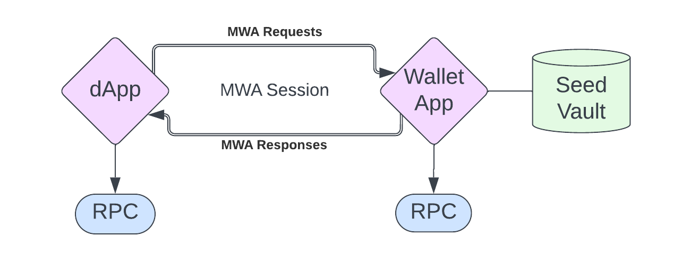
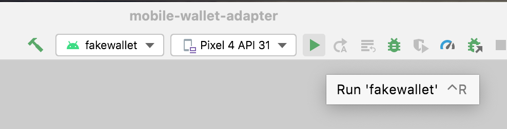

# TL;DR

- The Mobile Wallet Adapter can be used to create mobile dApps
- Web and Mobile Solana programming differ only in how wallets are connected

# Overview

Solana has gone mobile! For a long time, dApps were web-first rather than mobile-first. That started to change with the announcement of the Solana Mobile Stack (SMS) in 2022. This stack is designed to create dApps that provide a seamless mobile UX. It consists of the [Mobile Wallet Adapter (MWA)](https://docs.solanamobile.com/getting-started/overview#mobile-wallet-adapter), [Seed Vault](https://docs.solanamobile.com/getting-started/overview#seed-vault) and the [Solana dApp Store](https://docs.solanamobile.com/getting-started/overview#solana-dapp-store).

Our mobile lessons primarily focus on the Mobile Wallet Adapter as it's the most broadly applicable part of the stack. The simplest way to get started is to use the Mobile Wallet Adapter and React Native to create a simple Android app. This lesson assumes you're familiar with React and Solana programming. If that's not necessarily the case, [start our course from the beginning](./intro-to-cryptography.md) and come back here when you feel ready!.

## Solana Mobile Use Cases

MWA is a huge innovation. The crypto mobile market is pure untapped potential, and now, everyone can walk around with the power of Solana in their pockets. Here are a few examples of what Solana mobile unlocks:

**Mobile Banking and Trading (DeFi)**

DeFi apps aren't new, but they're often web-bound and don't have a great mobile experience. By comparison, most traditional banking right now happens on mobile. With SMS, you can now bank and trade with your own wallet, where you hold your own keys.

**Mobile Gaming with Solana Micropayments**

Traditional mobile games are a cash cow. 50% of the video game industry’s valuation is due to Mobile gaming with "micropayments." However, due to payment facilitator fees, these in-game purchases usually have a minimum of $0.99. With Solana, it's possible to unlock true micropayments. Need an extra life? How about pay 0.0001 sol? 

**Mobile E-Commerce** 

SMS can enable a new wave of mobile e-commerce shoppers to pay directly from their favorite Solana wallet. Imagine a world where you can use your Solana wallet as seamlessly as you can use Apply Pay.

Mobile crypto is the future, and Solana knows this. Let’s dive in and learn how we can be part of it.

## Web vs. Mobile

Solana wallet interaction differs slightly on mobile compared to web. The core wallet functionality is the same: the wallet holds your private keys and uses them to sign and send transactions. To avoid having different interfaces between wallets, developers abstracted that functionality into the Solana Wallet Adapter standard. This remains the standard on web. The mobile counterpart is the Mobile Wallet Adapter (MWA).

The differences between the two standards are due to the different construction of web vs mobile wallets. Web wallets are just browser extensions that inject wallet adapter functions into the `window` object of your webpage. This gives your site access to them. Mobile wallets, however, are native applications. There's no way to surface functions from one native application to another. The Mobile Wallet Adapter exists as a workaround to enable any app, written in any language, to connect to a native wallet app.

We'll dig into the specifics of the Mobile Wallet Adapter in a later lesson, but it effectively opens a WebSocket between applications to facilitate communication. That way a separate app can provide the wallet app with the transaction to be signed and sent, and the wallet app can respond with appropriate status updates.

## Create a Solana mobile dApp

### Supported Operating Systems

At the time of writing, Android is the only mobile OS supported by the Mobile Wallet Adapter.

On `Android`, a websocket connection is able to persist between apps, even when the wallet app is in the background.

On `iOS`, the lifetime of a connection between apps is purposefully limited by the operating system. Specifically, iOS will quickly suspend connections when an app is pushed to the background. This kills the MWA websocket connection. This is an inherent design difference between iOS and Android (probably made to preserve battery, network usage, etc).

However, this doesn’t mean that Solana dApps can’t run on iOS at all. You can still create a Mobile Web App using the [standard wallet adapter](https://github.com/solana-labs/wallet-adapter)` library. Your users can then install a mobile-friendly wallet like the [Glow Wallet](https://glow.app/).

This lesson will focus on developing Android apps with the MWA.

### Frameworks

Solana Mobile supports a number of different frameworks. Officially supported are React native and native Android, with community SDKs for Flutter, Unity, and Unreal Engine.

**Solana SDKs:**

- [React Native](https://docs.solanamobile.com/react-native/quickstart) ( Regular and Expo )
- [Android](https://docs.solanamobile.com/android-native/quickstart)

**Community SDKs:**

- [Flutter](https://docs.solanamobile.com/flutter/overview)
- [Unity](https://docs.solanamobile.com/unity/unity_sdk)
- [Unreal Engine](https://docs.solanamobile.com/unreal/unreal_sdk)

To keep the development experience as close as possible with other lessons, we'll be working exclusively with React Native.

## Solana dApp Flow

Solana React Native dApps are virtually identical to React dApps. The primary difference is in the wallet interaction. Instead of the wallet being available in the browser, your dApp will create an MWA session with the wallet app of your choosing using a websocket. Fortunately, most of this is abstracted for you in the MWA library.



### Reading data

Reading data from a Solana cluster in React Native is the exact same as in React. You use the `useConnection` hook to grab the `Connection` object. Using that, you can get account info. Since reading is free, we don’t need to actually connect to the wallet.

```tsx
const account = await connection.getAccountInfo(account);
```

If you need a refresher on this, check out our [lesson on reading data from the blockchain](./intro-to-reading-data.md).

### Connecting to a wallet

Writing data to the blockchain has to happen through a transaction. Transactions have to be signed by one or more private keys and sent to an RPC provider. This virtually always happens through a wallet application.

Typical wallet interaction happens by calling out to a browser extension. On mobile, you use a websocket to start an MWA session. Specifically, you use Android intents where the dApp broadcasts its intent with the `solana-wallet://` scheme. 


When the wallet app receives this intent, it opens a connection with the dApp that initiated the session. Your dApp sends this intent using the `transact` function:

```tsx
transact(async (wallet: Web3MobileWallet) => {
	// Wallet Action code here
}
```

This will give you access to the `Web3MobileWallet` object. You can then use this to send transactions to the wallet.

### Sending transactions

Transacting with a wallet through the MWA has a few extra steps compared to the web counterpart. The flow is as follows:

1. Establish a session with a wallet using `transact`
2. Request Authorization with the `authorizeSession(wallet)` function from the `useAuthorization()` hook.
3. Sign Transaction with `wallet.signTransactions` or sign and send with `wallet.signAndSendTransactions`. 


Note that `await authorizeSession(wallet)` will also reauthorize a session if one has already been established. Generally, if you want to send a transaction to the blockchain the following code snippet is what you’ll need:

```tsx
const {authorizeSession} = useAuthorization();
const {connection} = useConnection();

const sendTransactions = (transaction: Transaction)=> {

	transact(async (wallet: Web3MobileWallet) => {
		const latestBlockhashResult = await connection.getLatestBlockhash();
		const authResult = await authorizeSession(wallet);

		const updatedTransaction = new Transaction({
      ...transaction,
      ...latestBlockhashResult,
      feePayer: authResult.publicKey,
    });

		const signature = await wallet.signAndSendTransactions({
        transactions: [transaction],
    });
	})
}
```

### Debugging

Since two applications are involved in sending transactions, debugging can be tricky. Specifically, you won’t be able to see the wallet's debug logs the way you can see your dApps logs.

Fortunately, [Logcat on Android Studio](https://developer.android.com/studio/debug/logcat) makes it possible to see logs from all applications on your device.

If you prefer not to use Logcat, the other method you could try is to only use the wallet to sign transactions, and then send them in your code. This will allows you to better debug the transaction if you’re running into problems.

### Releasing

Deploying mobile application can be difficult on its own. It's often even more difficult when it's a crypto app. There are two main reasons for this: customer safety and circumnavigating the marketplace fee.

First, most of the mobile app marketplaces have policies restricting blockchain involvement. Crypto is new enough that it's a regulatory wildcard. Platforms feel they're protecting users by being strict with blockchain-related apps.

Second, if you use crypto for "purchases" in-app, you’ll be seen as circumnavigating the platform’s fee (anywhere from 15-30%). This is explicitly against app store policies as the platform is trying to protect its revenue stream.

These are hurdles for sure, but there's hope. Here are some things to keep in mind for each marketplace:

- **App Store (iOS) -** We only talked about android today for the technical MWA reason. However, their policies are also some of the most strict and make it hard for Solana dApps to exist. For now, Apple has some pretty strict anti-crypto policies. Wallets seem to be fine, but they'll flag and likely reject anything that seems like a "purchase" using crypto.
- **Google Play (Android) -** Google is generally more relaxed, but there are still a few things to be aware of. As of this writing in Sep ‘23, Google is rolling out [new crypto policies](https://www.theverge.com/2023/7/12/23792720/android-google-play-blockchain-crypto-nft-apps) to make it more clear what they will and will not allow. Take a look.
- **Steam -** Does not allow crypto games at all
    > “built on blockchain technology that issue or allow the exchange of cryptocurrencies or NFTs.”
    > 
- **Download Sites / Your Site -** Depending on the target platform, you can make your dApp available for download on your own site. However, most users are wary of downloading mobile applications from websites.
- **dApp Store (Solana) -** Solana saw the issues with mobile dApp distribution on other platform app stores and decided to make their own. As part of the SMS stack, they created the [Solana dApp Store](https://docs.solanamobile.com/getting-started/overview#solana-dapp-store).

## Conclusion

Getting started with mobile Solana development is fairly straightforward thanks to SMS. Remember to look at our other lessons if you need a refresher on Solana development more broadly.

# Demo

Today we’ll be building a simple Android mobile counter dApp with React Native. The app will interact with the [Anchor counter program](https://www.soldev.app/course/intro-to-anchor-frontend) that we made in the [Intro to client-side Anchor development](https://www.soldev.app/course/intro-to-anchor-frontend) lesson. In this app, we’ll be able to see the current count, connect our wallet and increment it. We’ll be doing this all on devnet, and will be compiling only for Android. 

**Note:** We’ll be writing this application in vanilla React Native. If you’re looking to use Expo, we will be covering that in our Solana Advance dApp lesson.

### 1. Prerequisites

React Native allows us to write mobile applications like we’re used to on the web. However there are some parts that have to be compiled down to languages that phones understand, this means we have some setup to do before we can start.

1. [Setup a React Native dev environment](https://reactnative.dev/docs/environment-setup?guide=native#creating-a-new-application). Go through the ***[entire article](https://reactnative.dev/docs/environment-setup?guide=native#creating-a-new-application)*** and accomplish the following for **Android**:
    1. Install dependancies
    2. Installing Android Studio
    3. Configuring **ANDROID_HOME** environment variable 
    4. Create a new sample project (only for setting up the emulator)
        1. If you run into an error `✖ Copying template`, add the `--npm` flag at the end
        
        ```bash
        npx react-native@latest init AwesomeProject
        ✔ Downloading template
        ✖ Copying template
        
        npx react-native@latest init AwesomeProject --npm
        ✔ Downloading template
        ✔ Copying template
        ```
        
    5. Run and compile the sample project on an emulator 
2. Install and run the Solana fake wallet
    1. Install the repo
        
        ```bash
        git clone https://github.com/solana-mobile/mobile-wallet-adapter.git
        ```
        
    2. In Android Studio, `Open project > Navigate to the cloned directory > Select mobile-wallet-adapter/android/build.gradle`
    3. After Android Studio finishes loading the project, select `fakewallet` in the build/run configuration dropdown in the top right
        
        
        
    4. For debugging, you’ll want to use `Logcat`. Now that your fake wallet is running on the emulator, go to `View -> Tool Windows -> Logcat`. This will open up a console logging out what’s happening with fake wallet.

Lastly, if you run into Java versioning issues - you’ll want to be on Java version 11. To check what you’re currently running type `java --version` in your terminal.

### 2. Create the App

Let’s create our app with the following:

```bash
npx react-native@latest init counter --npm
```

Then let’s make sure everything is setup properly by starting the default app and running it on our android emulator.

```bash
cd counter
npm run android
```

This should open and run the app in your Android emulator. If you run into problems, check to make sure you’ve accomplished everything in the prerequisite section.

**Note:** We are making everything from scratch today, however if you just want to start with React Native development with Solana, check out [Solana Mobile’s React Native template](https://docs.solanamobile.com/react-native/react-native-scaffold).

### 3. Install Dependencies

We’ll need to add in our Solana dependencies. Fortunately [Solana Mobile gives](https://docs.solanamobile.com/react-native/expo) us a really nice list of what packages we need and why we need them: 

- `@solana-mobile/mobile-wallet-adapter-protocol`: A React Native/Javascript API enabling interaction with MWA-compatible wallets.
- `@solana-mobile/mobile-wallet-adapter-protocol-web3js`: A convenience wrapper to use common primitives from [@solana/web3.js](https://github.com/solana-labs/solana-web3.js) – such as `Transaction` and `Uint8Array`.
- `@solana/web3.js`: Solana Web Library for interacting with Solana network through the [JSON RPC API](https://docs.solana.com/api/http).
- `react-native-get-random-values` Secure random number generator polyfill for `web3.js` underlying Crypto library on React Native.
- `buffer` Buffer polyfill also needed for `web3.js` on React Native.

We are also going to add two of our own `@project-serum/anchor` to allow us to interact with our counter program, and `assert` as a polyfill to allow our anchor package to do it’s thing.

```bash
npm install \
  @solana/web3.js \
  @solana-mobile/mobile-wallet-adapter-protocol-web3js \
  @solana-mobile/mobile-wallet-adapter-protocol \
  react-native-get-random-values \
  buffer \
	@project-serum/anchor \
	assert
```

If you’re not familiar; polyfills actively replace node-native libraries to make them work anywhere Node is not running. We’ll be adding the appropriate polyfills to our `App.tsx` in a couple of steps. But in case you’re curious now, we’ll be adding the following:

```tsx
// Top of App.tsx
import 'react-native-get-random-values';
import { Buffer } from "buffer";
global.Buffer = Buffer;
```

### 4. Counter Program IDL

We want the IDL from our counter program for some nice auto-completion and compilation features. Create a folder `models` and create the file `anchor-counter.ts` file inside. Now, fill it with the IDL from the  [Anchor counter program](https://www.soldev.app/course/intro-to-anchor-frontend) by pasting in the following:

```tsx
export type AnchorCounter = {
  version: '0.1.0';
  name: 'anchor_counter';
  instructions: [
    {
      name: 'initialize';
      accounts: [
        {
          name: 'counter';
          isMut: true;
          isSigner: false;
          pda: {
            seeds: [
              {
                kind: 'const';
                type: 'string';
                value: 'counter';
              },
            ];
          };
        },
        {
          name: 'user';
          isMut: true;
          isSigner: true;
        },
        {
          name: 'systemProgram';
          isMut: false;
          isSigner: false;
        },
      ];
      args: [];
    },
    {
      name: 'increment';
      accounts: [
        {
          name: 'counter';
          isMut: true;
          isSigner: false;
          pda: {
            seeds: [
              {
                kind: 'const';
                type: 'string';
                value: 'counter';
              },
            ];
          };
        },
        {
          name: 'user';
          isMut: false;
          isSigner: true;
        },
      ];
      args: [];
    },
    {
      name: 'decrement';
      accounts: [
        {
          name: 'counter';
          isMut: true;
          isSigner: false;
          pda: {
            seeds: [
              {
                kind: 'const';
                type: 'string';
                value: 'counter';
              },
            ];
          };
        },
        {
          name: 'user';
          isMut: false;
          isSigner: true;
        },
      ];
      args: [];
    },
  ];
  accounts: [
    {
      name: 'counter';
      type: {
        kind: 'struct';
        fields: [
          {
            name: 'count';
            type: 'u64';
          },
        ];
      };
    },
  ];
};

export const IDL: AnchorCounter = {
  version: '0.1.0',
  name: 'anchor_counter',
  instructions: [
    {
      name: 'initialize',
      accounts: [
        {
          name: 'counter',
          isMut: true,
          isSigner: false,
          pda: {
            seeds: [
              {
                kind: 'const',
                type: 'string',
                value: 'counter',
              },
            ],
          },
        },
        {
          name: 'user',
          isMut: true,
          isSigner: true,
        },
        {
          name: 'systemProgram',
          isMut: false,
          isSigner: false,
        },
      ],
      args: [],
    },
    {
      name: 'increment',
      accounts: [
        {
          name: 'counter',
          isMut: true,
          isSigner: false,
          pda: {
            seeds: [
              {
                kind: 'const',
                type: 'string',
                value: 'counter',
              },
            ],
          },
        },
        {
          name: 'user',
          isMut: false,
          isSigner: true,
        },
      ],
      args: [],
    },
    {
      name: 'decrement',
      accounts: [
        {
          name: 'counter',
          isMut: true,
          isSigner: false,
          pda: {
            seeds: [
              {
                kind: 'const',
                type: 'string',
                value: 'counter',
              },
            ],
          },
        },
        {
          name: 'user',
          isMut: false,
          isSigner: true,
        },
      ],
      args: [],
    },
  ],
  accounts: [
    {
      name: 'counter',
      type: {
        kind: 'struct',
        fields: [
          {
            name: 'count',
            type: 'u64',
          },
        ],
      },
    },
  ],
};
```

### 5. ConnectionProvider.tsx

Let’s start adding our Solana functionality. Create a new folder called `components` and within it, a file called `ConnectionProvider.tsx`. This provider will wrap around our main application and will give us our `Connection` class we’re used to in `@solana/web3.js`. This is no different from our web programming, so just make sure your code matches below.

```tsx
import {Connection, ConnectionConfig} from '@solana/web3.js';
import React, {ReactNode, createContext, useContext, useMemo} from 'react';

export interface ConnectionProviderProps {
  children: ReactNode;
  endpoint: string;
  config?: ConnectionConfig;
}

export interface ConnectionContextState {
  connection: Connection;
}

const ConnectionContext = createContext<ConnectionContextState>(
  {} as ConnectionContextState,
);

export function ConnectionProvider(props: ConnectionProviderProps){
  const {children, endpoint, config = {commitment: 'confirmed'}} = {...props};
  const connection = useMemo(
    () => new Connection(endpoint, config),
    [config, endpoint],
  );

  return (
    <ConnectionContext.Provider value={{connection}}>
      {children}
    </ConnectionContext.Provider>
  );
};

export const useConnection = (): ConnectionContextState =>
  useContext(ConnectionContext);
```

Remember, everything we are doing in the app will be on Devnet. So in our `App.tsx` we’ll be passing in the endpoint for a Devnet validator.

### 6. AuthProvider.tsx

The next Solana provision we’ll need is the auth provider. This is the main difference between mobile and web development. What we’re implementing here is roughly equivalent to `WalletProvider` that we’re used to in web apps. However, since we are using Android and its natively installed wallets, the flow to connect and utilize them is a bit different. Most notably, we need to follow the mobile wallet adapter protocol (MWA). 

We do this by providing the following in our `AuthProvider`:

- `accounts`: If the user has multiple wallets, different accounts are maintained in this array of Accounts.
- `selectedAccount`: The current selected account for the transaction.
- `authorizeSession(wallet)`: Authorizes (or reauthorizes, if token is expired) the wallet for the user and returns an account which will act as the selected account for the session.
- `deauthorizeSession(wallet)`: Deauthorizes the `selectedAccount`.
- `onChangeAccount`: Acts as an handler when `selectedAccount` is changed.

We’re also going to throw in some utility methods:

- `getPublicKeyFromAddress(base64Address)`: Create a new Public Key object from the Base64 address.
- `getAuthorizationFromAuthResult`: Handles the authorization result, extracts relevant data from the result and returns the `Authorization` context object.

We’ll expose all of this through a `useAuthorization` hook.

For today, we are just going to implement what you need, to get up and running. We will dive more into all of the bits of MWA in the next lesson. 

Create the file `AuthProvider.tsx` and fill in the following:

```tsx
import {Cluster, PublicKey} from '@solana/web3.js';
import {
  Account as AuthorizedAccount,
  AuthorizationResult,
  AuthorizeAPI,
  AuthToken,
  Base64EncodedAddress,
  DeauthorizeAPI,
  ReauthorizeAPI,
} from '@solana-mobile/mobile-wallet-adapter-protocol';
import {toUint8Array} from 'js-base64';
import {useState, useCallback, useMemo, ReactNode} from 'react';
import React from 'react';

export const AuthUtils = {
  getAuthorizationFromAuthResult: (
    authResult: AuthorizationResult,
    previousAccount?: Account,
  ): Authorization => {
    let selectedAccount: Account;
    if (
      //no wallet selected yet
      previousAccount == null ||
      //the selected wallet is no longer authorized
      !authResult.accounts.some(
        ({address}) => address === previousAccount.address,
      )
    ) {
      const firstAccount = authResult.accounts[0];
      selectedAccount = AuthUtils.getAccountFromAuthorizedAccount(firstAccount);
    } else {
      selectedAccount = previousAccount;
    }
    return {
      accounts: authResult.accounts.map(
        AuthUtils.getAccountFromAuthorizedAccount,
      ),
      authToken: authResult.auth_token,
      selectedAccount,
    };
  },

  getAccountFromAuthorizedAccount: (
    authAccount: AuthorizedAccount,
  ): Account => {
    return {
      ...authAccount,
      publicKey: AuthUtils.getPublicKeyFromAddress(authAccount.address),
    };
  },

  getPublicKeyFromAddress: (address: Base64EncodedAddress) => {
    return new PublicKey(toUint8Array(address));
  },
};

export type Account = Readonly<{
  address: Base64EncodedAddress;
  label?: string;
  publicKey: PublicKey;
}>;

type Authorization = Readonly<{
  accounts: Account[];
  authToken: AuthToken;
  selectedAccount: Account;
}>;

export const AppIdentity = {
  name: 'Solana Counter Incrementor',
};

export type AuthorizationProviderContext = {
  accounts: Account[] | null;
  authorizeSession: (wallet: AuthorizeAPI & ReauthorizeAPI) => Promise<Account>;
  deauthorizeSession: (wallet: DeauthorizeAPI) => void;
  onChangeAccount: (nextSelectedAccount: Account) => void;
  selectedAccount: Account | null;
};

const AuthorizationContext = React.createContext<AuthorizationProviderContext>({
  accounts: null,
  authorizeSession: (_wallet: AuthorizeAPI & ReauthorizeAPI) => {
    throw new Error('Provider not initialized');
  },
  deauthorizeSession: (_wallet: DeauthorizeAPI) => {
    throw new Error('Provider not initialized');
  },
  onChangeAccount: (_nextSelectedAccount: Account) => {
    throw new Error('Provider not initialized');
  },
  selectedAccount: null,
});

export type AuthProviderProps = {
  children: ReactNode;
  cluster: Cluster;
};

export function AuthorizationProvider(props: AuthProviderProps) {
  const {children, cluster} = {...props};
  const [authorization, setAuthorization] = useState<Authorization | null>(
    null,
  );

  const handleAuthorizationResult = useCallback(
    async (authResult: AuthorizationResult): Promise<Authorization> => {
      const nextAuthorization = AuthUtils.getAuthorizationFromAuthResult(
        authResult,
        authorization?.selectedAccount,
      );
      setAuthorization(nextAuthorization);

      return nextAuthorization;
    },
    [authorization, setAuthorization],
  );

  const authorizeSession = useCallback(
    async (wallet: AuthorizeAPI & ReauthorizeAPI) => {
      const authorizationResult = await (authorization
        ? wallet.reauthorize({
            auth_token: authorization.authToken,
            identity: AppIdentity,
          })
        : wallet.authorize({cluster, identity: AppIdentity}));
      return (await handleAuthorizationResult(authorizationResult))
        .selectedAccount;
    },
    [authorization, handleAuthorizationResult],
  );

  const deauthorizeSession = useCallback(
    async (wallet: DeauthorizeAPI) => {
      if (authorization?.authToken == null) {
        return;
      }

      await wallet.deauthorize({auth_token: authorization.authToken});
      setAuthorization(null);
    },
    [authorization, setAuthorization],
  );

  const onChangeAccount = useCallback(
    (nextAccount: Account) => {
      setAuthorization(currentAuthorization => {
        if (
          //check if the account is no longer authorized
          !currentAuthorization?.accounts.some(
            ({address}) => address === nextAccount.address,
          )
        ) {
          throw new Error(`${nextAccount.address} is no longer authorized`);
        }

        return {...currentAuthorization, selectedAccount: nextAccount};
      });
    },
    [setAuthorization],
  );

  const value = useMemo(
    () => ({
      accounts: authorization?.accounts ?? null,
      authorizeSession,
      deauthorizeSession,
      onChangeAccount,
      selectedAccount: authorization?.selectedAccount ?? null,
    }),
    [authorization, authorizeSession, deauthorizeSession, onChangeAccount],
  );

  return (
    <AuthorizationContext.Provider value={value}>
      {children}
    </AuthorizationContext.Provider>
  );
}

export const useAuthorization = () => React.useContext(AuthorizationContext);
```

### 7. Program Provider

The last provider we need is our program provider. This will expose our counter program we want to interact with. This is no different from what we’re used to in web. Create the file `ProgramProvider.tsx`, and past the following:

```tsx
import {AnchorProvider, IdlAccounts, Program, setProvider} from '@project-serum/anchor';
import {Keypair, PublicKey} from '@solana/web3.js';
import {AnchorCounter, IDL} from '../models/anchor-counter';
import React, {
  ReactNode,
  createContext,
  useCallback,
  useContext,
  useEffect,
  useMemo,
  useState,
} from 'react';
import {useConnection} from './ConnectionProvider';

export type CounterAccount = IdlAccounts<AnchorCounter>['counter'];

export type ProgramContextType = {
  program: Program<AnchorCounter> | null;
  counterAddress: PublicKey | null;
};

export const ProgramContext = createContext<ProgramContextType>({
  program: null,
  counterAddress: null,
});

export type ProgramProviderProps = {
  children: ReactNode;
};

export function ProgramProvider(props: ProgramProviderProps) {
  const { children } = props;
  const {connection} = useConnection();
  const [program, setProgram] = useState<Program<AnchorCounter> | null>(null);
  const [counterAddress, setCounterAddress] = useState<PublicKey | null>(null);

  const setup = useCallback(async () => {
    const programId = new PublicKey(
      'ALeaCzuJpZpoCgTxMjJbNjREVqSwuvYFRZUfc151AKHU',
    );

    const MockWallet = {
      signTransaction: () => Promise.reject(),
      signAllTransactions: () => Promise.reject(),
      publicKey: Keypair.generate().publicKey,
    };

    const provider = new AnchorProvider(connection, MockWallet, {});
    setProvider(provider);

    const programInstance = new Program<AnchorCounter>(
      IDL,
      programId,
      provider,
    );

    const [counterProgramAddress] = PublicKey.findProgramAddressSync(
      [Buffer.from('counter')],
      programId,
    );

    setProgram(programInstance);
    setCounterAddress(counterProgramAddress);
  }, [connection]);

  useEffect(() => {
    setup();
  }, [setup]);

  const value: ProgramContextType = useMemo(
    () => ({
      program,
      counterAddress,
    }),
    [program, counterAddress],
  );

  return (
    <ProgramContext.Provider value={value}>{children}</ProgramContext.Provider>
  );
}

export const useProgram = () => useContext(ProgramContext);
```

### 8. App.tsx

Now that everything is setup, let’s wrap our providers around our main application. We are going to re-write the default `App.tsx`. The basic changes we are making are:

- Import our providers and add in our polyfills
- Wrap the app first with out `ConnectionProvider` then `AuthorizationProvider` and finally `ProgramProvider`.
- Pass in our devnet endpoint to our `ConnectionProvider`, and our cluster to `AuthorizationProvider`
- Replace the default internal `<View>` with `<MainScreen />` which we will build next.

```tsx
// Polyfills at the top
import "react-native-get-random-values";
import { Buffer } from "buffer";
global.Buffer = Buffer;

import { clusterApiUrl } from "@solana/web3.js";
import { ConnectionProvider } from "./components/ConnectionProvider";
import { AuthorizationProvider } from "./components/AuthProvider";
import { ProgramProvider } from "./components/ProgramProvider";
import { MainScreen } from "./screens/MainScreen"; // Going to make this
import React from "react";

export default function App() {
  // const cluster = "localhost" as any;
  // const endpoint = 'http://10.0.2.2:8899';
  const cluster = "devnet";
  const endpoint = clusterApiUrl(cluster);

  return (
    <ConnectionProvider
      endpoint={endpoint}
      config={{ commitment: "processed" }}
    >
      <AuthorizationProvider cluster={cluster}>
        <ProgramProvider>
          <MainScreen />
        </ProgramProvider>
      </AuthorizationProvider>
    </ConnectionProvider>
  );
}
```

### 9. MainScreen.tsx

Now, let’s put everything together. Create a new folder `screens` and a new file `MainScreen.tsx` inside it. In this file we are only structuring the screen and showing two, yet-to-be created components: `CounterView` and `CounterButton`.

```tsx
import {StatusBar, StyleSheet, View} from 'react-native';
import {CounterView} from '../components/CounterView';
import {CounterButton} from '../components/CounterButton';
import React from 'react';

const mainScreenStyles = StyleSheet.create({
  container: {
    height: '100%',
    width: '100%',
    backgroundColor: 'lightgray',
  },

  incrementButtonContainer: {position: 'absolute', right: '5%', bottom: '3%'},
  counterContainer: {
    alignContent: 'center',
    alignItems: 'center',
    justifyContent: 'center',
  },
});

export function MainScreen() {
  return (
    <View style={mainScreenStyles.container}>
      <StatusBar barStyle="light-content" backgroundColor="darkblue" />
      <View
        style={{
          ...mainScreenStyles.container,
          ...mainScreenStyles.counterContainer,
        }}>
        <CounterView />
      </View>
      <View style={mainScreenStyles.incrementButtonContainer}>
        <CounterButton />
      </View>
    </View>
  );
}
```

### 10. CounterView.tsx

The `CounterView` is the first of our two program-specific files. It’s only job is to fetch and listen for updates on our `Counter` account. Since, we’re only listening here, we don’t have to do anything MWA related, so it should look identical to a web application. 

```tsx
import {View, Text, StyleSheet} from 'react-native';
import {useConnection} from './ConnectionProvider';
import {useProgram, CounterAccount} from './ProgramProvider';
import {useEffect, useState} from 'react';
import {AccountInfo} from '@solana/web3.js';
import React from 'react';

const counterStyle = StyleSheet.create({
  counter: {
    fontSize: 48,
    fontWeight: 'bold',
    color: 'black',
    textAlign: 'center',
  },
});

export function CounterView() {
  const {connection} = useConnection();
  const {program, counterAddress} = useProgram();
  const [counter, setCounter] = useState<CounterAccount>();

  // Fetch Counter Info
  useEffect(() => {
    if (!program || !counterAddress) return;

    program.account.counter.fetch(counterAddress).then(setCounter);

    const subscriptionId = connection.onAccountChange(
      counterAddress,
      (accountInfo: AccountInfo<Buffer>) => {
        try {
          const data = program.coder.accounts.decode(
            'counter',
            accountInfo.data,
          );
          setCounter(data);
        } catch (e) {
          console.log('account decoding error: ' + e);
        }
      },
    );

    return () => {
      connection.removeAccountChangeListener(subscriptionId);
    };
  }, [program, counterAddress, connection]);

  if (!counter) return <Text>Loading...</Text>;

  return (
    <View>
      <Text>Current counter</Text>
      <Text style={counterStyle.counter}>{counter.count.toString()}</Text>
    </View>
  );
}
```

### 11. CounterButton.tsx

Finally we have our last component, the `CounterButton`. This button will do the following:

- Call `transact` to get access to a mobile wallet
- Authorize the session with `authorizeSession`
- Create an `increment` transaction
- Have the wallet `signAndSendTransactions`

Create the file `CounterButton.tsx` and fill in the following:

```tsx
import {
    Alert,
    Platform,
    Pressable,
    StyleSheet,
    Text,
    ToastAndroid,
  } from 'react-native';
  import {useAuthorization} from './AuthProvider';
  import {useProgram} from './ProgramProvider';
  import {useConnection} from './ConnectionProvider';
  import {
    transact,
    Web3MobileWallet,
  } from '@solana-mobile/mobile-wallet-adapter-protocol-web3js';
  import {LAMPORTS_PER_SOL, Transaction} from '@solana/web3.js';
  import {useState} from 'react';
import React from 'react';
  

  const floatingActionButtonStyle = StyleSheet.create({
    container: {
      height: 64,
      width: 64,
      alignItems: 'center',
      borderRadius: 40,
      justifyContent: 'center',
      elevation: 4,
      marginBottom: 4,
      backgroundColor: 'blue',
    },
  
    text: {
      fontSize: 24,
      color: 'white',
    },
  });
  
  export function CounterButton(){
    const {authorizeSession} = useAuthorization();
    const {program, counterAddress} = useProgram();
    const {connection} = useConnection();
    const [isTransactionInProgress, setIsTransactionInProgress] = useState(false);

    const showToastOrAlert = (message: string) => {
        if (Platform.OS == 'android') {
          ToastAndroid.show(message, ToastAndroid.SHORT);
        } else {
          Alert.alert(message);
        }
    }
  
    const incrementCounter = () => {

        if (!program || !counterAddress) return;

        if (!isTransactionInProgress) {
            setIsTransactionInProgress(true);

            transact(async (wallet: Web3MobileWallet) => {
                const authResult = await authorizeSession(wallet);
                const latestBlockhashResult = await connection.getLatestBlockhash();

                const ix = await program.methods
                .increment()
                .accounts({counter: counterAddress, user: authResult.publicKey})
                .instruction();

                const balance = await connection.getBalance(authResult.publicKey);
                console.log(`Wallet ${authResult.publicKey} has a balance of ${balance}`);

                // When on Devnet you may want to transfer SOL manually per session, due to Devnet's airdrop rate limit
                const minBalance = LAMPORTS_PER_SOL / 1000;
                if(balance < minBalance){
                  console.log(`requesting airdrop for ${authResult.publicKey} on ${connection.rpcEndpoint}`);
                  await connection.requestAirdrop(authResult.publicKey, minBalance * 2);
                }

                const transaction = new Transaction({
                    ...latestBlockhashResult,
                    feePayer: authResult.publicKey,
                }).add(ix);

                const signature = await wallet.signAndSendTransactions({
                    transactions: [transaction],
                });

                showToastOrAlert(`Transaction successful! ${signature}`);

            }).catch((e)=>{
                console.log(e);
                showToastOrAlert(`Error: ${JSON.stringify(e)}`);
            }).finally(()=>{
                setIsTransactionInProgress(false);
            })
        }
    };
  
    return (
      <>
        <Pressable
          style={floatingActionButtonStyle.container}
          onPress={incrementCounter}>
          <Text style={floatingActionButtonStyle.text}>
            +
          </Text>
        </Pressable>
      </>
    );
  };
```

### 12. Build and Run

Now it’s time to test that everything works!

```bash
npm run android
```

You should get the following:


If you run into some problems here are what they could be:

- Application does not build → Exit Metro with ctrl+c and try again
- Nothing happens when you press the `CounterButton` → Make sure you have Solana wallet installed ( like the fake wallet we installed in Prerequisites )
- You get stuck in a forever loop while calling `increment` → This is likely due to you reaching a Devnet airdrop rate limit. Take out the airdrop section in `CounterButton` and manually send some devnet sol to your wallet’s address (printed in the console)

If you get stuck, feel free to check out the [completed code](https://github.com/Unboxed-Software/solana-react-native-counter).

# Challenge

You’re challenge today is to take our app and add a decrement function. Simply add another button and call the `decrement` function on our program.

If you want, take a look at the [solution code](https://github.com/Unboxed-Software/solana-react-native-counter/tree/solution).