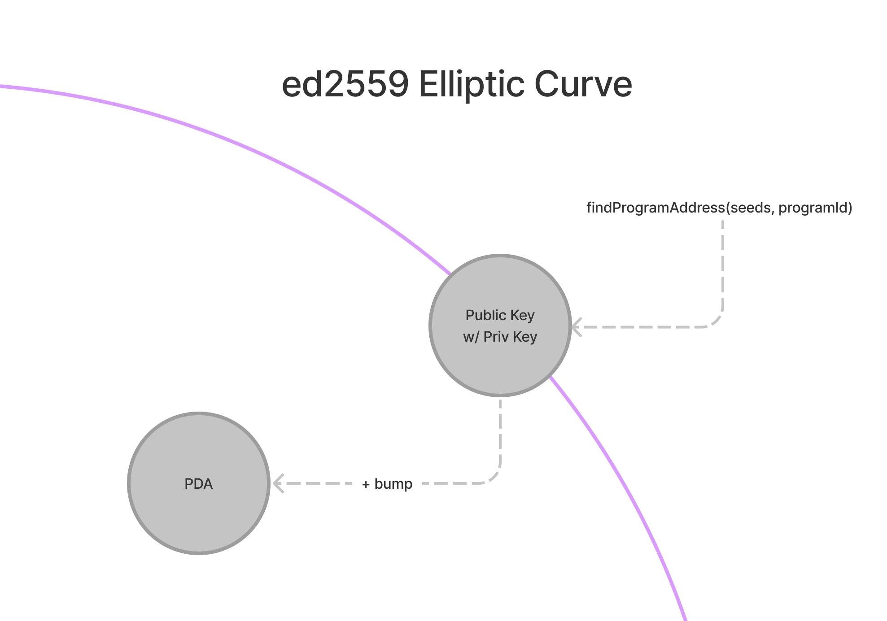

# TL;DR

- **Program Derived Addresses**, or PDAs, are addresses that do not have a corresponding private key. The concept of PDAs allows for programs to sign for transactions themselves and allows for storing and locating data.
- You can derive a PDA using the `findProgramAddress(seeds, programid)` method.
- You can get an array of all the accounts belonging to a program using `getProgramAccounts(programId)`.
- Account data needs to be deserialized using the same layout used to store it in the first place. You can use `@project-serum/borsh` to create a schema.

# Overview

In the last lesson, we serialized custom instruction data that was subsequently stored on-chain by a Solana program. In this lesson, we’ll cover in greater detail how programs use accounts, how to retrieve them, and how to deserialize the data they store.

## Programs

As the saying goes, everything in Solana is an account. Even programs. Programs are accounts that store code and are marked as executable. This code can be executed by the Solana runtime when instructed to do so.

Programs themselves, however, are stateless. They cannot modify the data within their account. They can only persist state by storing data in other accounts that can be referenced at some other point in time. Understanding how these accounts are used and how to find them is crucial to client-side Solana development.

### PDA

PDA stands for Program Derived Address. As the name suggests, it refers to an address (public key) derived from a program and some seeds. In a previous lesson, we discussed public/private keys and how they are used on Solana. Unlike a keypair, a PDA *does not* have a corresponding private key. The purpose of a PDA is to create an address that a program can sign for in the same way a user may sign for a transaction with their wallet.

When you submit a transaction to a program and expect the program to then update state or store data in some way, that program is using one or more PDAs. This is important to understand when developing client-side for two reasons:

1. When submitting a transaction to a program, the client needs to include all addresses for accounts that will be written to or read from. This means that unlike more traditional client-server architectures, the client needs to have implementation-specific knowledge about the Solana program. The client needs to know which PDA is going to be used to store data so that it can include that address in the transaction.
2. Similarly, when reading data from a program, the client needs to know which account(s) to read from.

### Finding PDAs

PDAs are not technically created. Rather, they are *found* or *derived* based on one or more input seeds.

Regular Solana keypairs lie on the ed2559 Elliptic Curve. This cryptographic function ensures that every point along the curve has a corresponding point somewhere else on the curve, allowing for public/private keys. PDAs are addresses that lie *off* the ed2559 Elliptic curve and therefore cannot be signed for by a private key (since there isn’t one). This ensures that the program is the only valid signer for that address.

To find a public key that does not lie on the ed2559 curve, the program ID and seeds of the developer’s choice (like a string of text) are passed through the function [`findProgramAddress(seeds, programid)`](https://solana-labs.github.io/solana-web3.js/classes/PublicKey.html#findProgramAddress). This function combines the program ID, seeds, and a bump seed into a buffer and passes it into a SHA256 hash to see whether or not the resulting address is on the curve. If the address is on the curve (~50% chance it is), then the bump seed is decremented by 1 and the address is calculated again. The bump seed starts at 255 and progressively iterates down to `bump = 254`, `bump = 253`, etc. until an address is found with the given seeds and bump that does not lie on the ed2559 curve. The `findProgramAddress` function returns the resulting address and the bump used to kick it off the curve. This way, the address can be generated anywhere as long as you have the bump and seeds.



PDAs are a unique concept and are one of the hardest parts of Solana development to understand. If you don’t get it right away, don’t worry. It’ll make more sense the more you practice.

### Why Does This Matter?

The derivation of PDAs is important because the seeds used to find a PDA are what we use to locate the data. For example, a simple program that only uses a single PDA to store global program state might use a simple seed phrase like “GLOBAL_STATE”. If the client wanted to read data from this PDA, it could derive the address using the program ID and this same seed.

```tsx
const [pda, bump] = await findProgramAddress(Buffer.from("GLOBAL_STATE"), programId)
```

In more complex programs that store user-specific data, it’s common to use a user’s public key as the seed. This separates each user’s data into its own PDA. The separation makes it possible for the client to locate each user’s data by finding the address using the program ID and the user’s public key.

```tsx
const [pda, bump] = await web3.PublicKey.findProgramAddress(
	[
		publicKey.toBuffer()
	],
	programId
)
```

Also, when there are multiple accounts per user, a program may use one or more additional seeds to create and identify accounts. For example, in a note-taking app there may be one account per note where each PDA is derived with the user’s public key and the note’s title.

```tsx
const [pda, bump] = await web3.PublicKey.findProgramAddress(
	[
		publicKey.toBuffer(),
		Buffer.from('First Note')
	],
	programId
)
```

### Getting Multiple Program Accounts

In addition to deriving addresses, you can fetch all accounts created by a program using `connection.getProgramAccounts(programId)`. This returns an array of objects where each object has `pubkey` property representing the public key of the account and an `account` property of type `AccountInfo`. You can use the `account` property to get the account data.

```tsx
const accounts = connection.getProgramAccounts(programId).then(accounts => {
	accounts.map(({ pubkey, account }) => {
		console.log('Account:', pubkey)
		console.log('Data buffer:', account.data)
	})
})
```

## Deserializing custom account data

The `data` property on an `AccountInfo` object is a buffer. To use it efficiently, you’ll need to write code that deserializes it into something more usable. This is similar to the serialization process we covered last lesson. Just as before, we’ll use [Borsh](https://borsh.io/) and `@project-serum/borsh`. If you need a refresher on either of these, have a look at the previous lesson.

Deserializing requires knowledge of the account layout ahead of time. When creating your own programs, you will define how this is done as part of that process. Many programs also have documentation on how to deserialize the account data. Otherwise, if the program code is available you can look at the source and determine the structure that way.

To properly deserialize data from an on-chain program, you will have to create a client-side schema mirroring how the data is stored in the account. For example, the following might be the schema for an account storing metadata about a player in an on-chain game.

```tsx
import * as borsh from "@project-serum/borsh";

borshAccountSchema = borsh.struct([
	borsh.bool('initialized'),
	borsh.u16('playerId'),
	borsh.str('name')
])
```

Once you have your layout defined, simply call `.decode(buffer)` on the schema.

```tsx
import * as borsh from "@project-serum/borsh";

borshAccountSchema = borsh.struct([
	borsh.bool('initialized'),
	borsh.u16('playerId'),
	borsh.str('name')
])

const { playerId, name } = borshAccountSchema.decode(buffer)
```

# Demo

Let’s practice this together by continuing to work on the Movie Review app from the last lesson. No worries if you’re just jumping into this lesson - it should be possible to follow either way.

As a refresher, this project uses a Solana program deployed on Devnet which lets users review movies. Last lesson, we added functionality to the frontend skeleton letting users submit movie reviews but the list of reviews is still showing mock data. Let’s fix that by fetching the program’s storage accounts and deserializing the data stored there.


### 1. Download the starter code

If you didn’t complete the demo from the last lesson or just want to make sure that you didn’t miss anything, you can download the [starter code](https://github.com/Unboxed-Software/solana-movie-frontend/tree/solution-serialize-instruction-data).

The project is a fairly simple Next.js application. It includes the `WalletContextProvider` we created in the Wallets lesson, a `Card` component for displaying a movie review, a `MovieList` component that displays reviews in a list, a `Form` component for submitting a new review, and a `Movie.ts` file that contains a class definition for a `Movie` object.

Note that when you run `npm run dev`, the reviews displayed on the page are mocks. We’ll be swapping those out for the real deal.

### 2. Create the buffer layout

Remember that to properly interact with a Solana program, you need to know how its data is structured.

The Movie Review program creates a separate account for each movie review and stores the following data in the account’s `data`:

1. `initialized` as a boolean representing whether or not the account has been initialized.
2. `rating` as an unsigned, 8-bit integer representing the rating out of 5 that the reviewer gave the movie.
3. `title` as a string representing the title of the reviewed movie.
4. `description` as a string representing the written portion of the review.

Let’s configure a `borsh` layout in the `Movie` class to represent the movie account data layout. Start by importing `@project-serum/borsh`. Next, create a `borshAccountSchema` static property and set it to the appropriate `borsh` struct containing the properties listed above.

```tsx
import * as borsh from '@project-serum/borsh'

export class Movie {
	title: string;
	rating: number;
	description: string;

	...

	static borshAccountSchema = borsh.struct([
		borsh.bool('initialized'),
		borsh.u8('rating'),
		borsh.str('title'),
		borsh.str('description'),
	])
}
```

Remember, the order here *matters*. It needs to match how the account data is structured.

### 3. Create a method to deserialize data

Now that we have the buffer layout set up, let’s create a static method in `Movie` called `deserialize` that will take an optional `Buffer` and return a `Movie` object or `null`.

```tsx
import * as borsh from '@project-serum/borsh'

export class Movie {
	title: string;
	rating: number;
	description: string;

	...

	static borshAccountSchema = borsh.struct([
		borsh.bool('initialized'),
		borsh.u8('rating'),
		borsh.str('title'),
		borsh.str('description'),
	])

	static deserialize(buffer?: Buffer): Movie|null {
		if (!buffer) {
			return null
		}

		try {
			const { title, rating, description } = this.borshAccountSchema.decode(buffer)
			return new Movie(title, rating, description)
		} catch(error) {
			console.log('Deserialization error:', error)
			return null
		}
	}
}
```

The method first checks whether or not the buffer exists and returns `null` if it doesn’t. Next, it uses the layout we created to decode the buffer, then uses the data to construct and return an instance of `Movie`. If the decoding fails, the method logs the error and returns `null`.

### 4. Fetch movie review accounts

Now that we have a way to deserialize account data, we need to actually fetch the accounts. Open `MovieList.tsx` and import `@solana/web3.js`. Then, create a new `Connection` inside the `MovieList` component. Finally, replace the line `setMovies(Movie.mocks)` inside `useEffect` with a call to `connection.getProgramAccounts`. Take the resulting array and convert it into an array of movies and call `setMovies`.

```tsx
import { Card } from './Card'
import { FC, useEffect, useState } from 'react'
import { Movie } from '../models/Movie'
import * as web3 from '@solana/web3.js'

const MOVIE_REVIEW_PROGRAM_ID = 'CenYq6bDRB7p73EjsPEpiYN7uveyPUTdXkDkgUduboaN'

export const MovieList: FC = () => {
	const connection = new web3.Connection(web3.clusterApiUrl('devnet'))
	const [movies, setMovies] = useState<Movie[]>([])

	useEffect(() => {
		connection.getProgramAccounts(new web3.PublicKey(MOVIE_REVIEW_PROGRAM_ID)).then(async (accounts) => {
			const movies: Movie[] = accounts.map(({ account }) => {
				return Movie.deserialize(account.data)
			})

			setMovies(movies)
		})
	}, [])

	return (
		<div>
			{
				movies.map((movie, i) => <Card key={i} movie={movie} /> )
			}
		</div>
	)
}
```

At this point, you should be able to run the app and see the list of movie reviews retrieved from the program!

Depending on how many reviews have been submitted, this may take a long time to load or may lock up your browser entirely. But don’t worry — next lesson we’ll learn how to page and filter accounts so you can be more surgical with what you load.

If you need more time with this project to feel comfortable with these concepts, have a look at the [solution code](https://github.com/Unboxed-Software/solana-movie-frontend/tree/solution-deserialize-account-data) before continuing.

# Challenge

Now it’s your turn to build something independently. Last lesson, you worked on the Student Intros app to serialize instruction data and send a new intro to the network. Now, it's time to fetch and deserialize the program's account data. Remember, the Solana program that supports this is at `HdE95RSVsdb315jfJtaykXhXY478h53X6okDupVfY9yf`.


1. You can build this from scratch or you can download the starter code [here](https://github.com/Unboxed-Software/solana-student-intros-frontend/tree/solution-serialize-instruction-data).
2. Create the account buffer layout in `StudentIntro.ts`. The account data contains:
   1. `initialized` as an unsigned, 8-bit integer representing the instruction to run (should be 1).
   2. `name` as a string representing the student's name.
   3. `message` as a string representing the message the student shared about their Solana journey.
3. Create a static method in `StudentIntro.ts` that will use the buffer layout to deserialize an account data buffer into a `StudentIntro` object.
4. In the `StudentIntroList` component's `useEffect`, get the program's accounts and deserialize their data into a list of `StudentIntro` objects.
5. Instead of mock data, you should now be seeing student introductions from the network!

If you get really stumped, feel free to check out the solution code [here](https://github.com/Unboxed-Software/solana-student-intros-frontend/tree/solution-deserialize-account-data).

As always, get creative with these challenges and take them beyond the instructions if you want!
