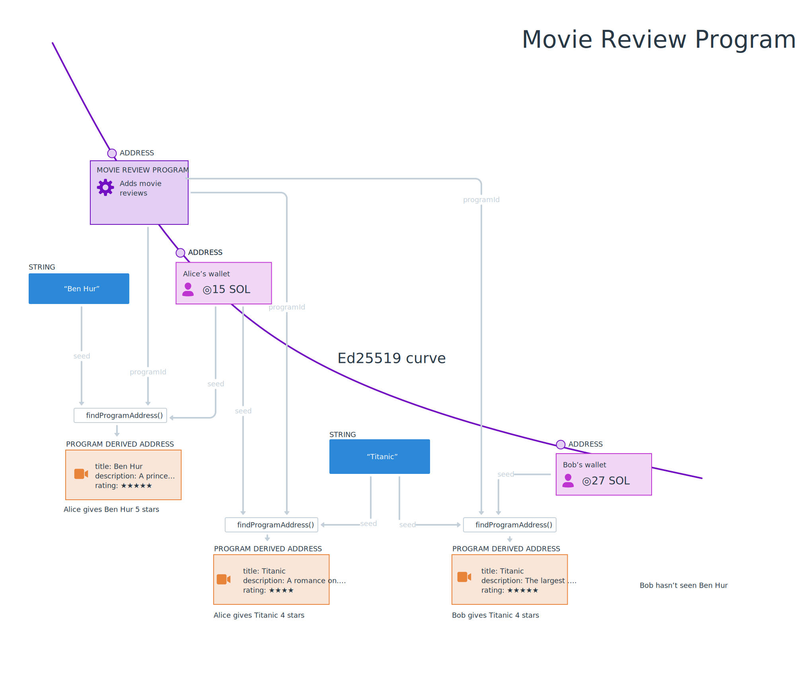

# Summary

- Programs store data in PDAs, which stands for **Program Derived Address**. 
- PDAs do not have a corresponding secret key. 
- To store and locate data, derive a PDA using the `findProgramAddress(seeds, programid)` method. 
- You can get the accounts belonging to a program using `getProgramAccounts(programId)`.
- Account data needs to be deserialized using the same layout used to store it in the first place. You can use `@coral-xyz/borsh` to create a schema.

# Lesson

In the last lesson, we serialized program data that was subsequently stored onchain by a Solana program. In this lesson, we’ll cover in greater detail how programs store data on the chain, how to retrieve data, and how to deserialize the data they store.

## Programs

As the saying goes, everything in Solana is an account. Even programs. Programs are accounts that store code and are marked as executable. This code can be executed by the Solana runtime when instructed to do so. A program address is a public keys on the Ed25519 Elliptic Curve. Like all public keys, they have corresponding secret keys.

Programs store data separately from their code. Programs store data in PDAs, which stands for **Program Derived Address**. PDAs are a unique concept to Solana, but the pattern is familiar: 

 - You can think of PDAs as a key value store, where the address is the key, and the data inside the account is the value.
 - You can also consider PDAs as records in a database, with the address being the primary key used to look up the values inside.
 
PDAs combine a program addresss and some developer-chosen seeds to create addresses that store individual pieces of data. Since PDAs are addresses that lie *off* the Ed25519 Elliptic curve, PDAs don't have secret keys. Instead, PDAs can be signed for by the program address used to create them.

PDAs and the data inside them can be consistently found based on the program address, bump, and seeds. To find a PDA, the program ID and seeds of the developer’s choice (like a string of text) are passed through the [`findProgramAddress()`](https://solana-labs.github.io/solana-web3.js/classes/PublicKey.html#findProgramAddress) function. 

Let's have a look at some examples...

#### Example: program with global state 

A simple program that has global state - like our ping counter - might wish to only use a single PDA, based on a simple seed phrase like `"GLOBAL_STATE"`. If the client wanted to read data from this PDA, it could derive the address using the program ID and this same seed.

```typescript
const [pda, bump] = await findProgramAddress(Buffer.from("GLOBAL_STATE"), programId)
```


#### Example: program with user-specific data

In programs that store user-specific data, it’s common to use a user’s public key as the seed. This separates each user’s data into its own PDA. The separation makes it possible for the client to locate each user’s data by finding the address using the program ID and the user’s public key.

```typescript
const [pda, bump] = await web3.PublicKey.findProgramAddress(
  [
    publicKey.toBuffer()
  ],
  programId
)
```


### Example: program with multiple data items per user

When there are multiple data items per user, a program may use more seeds to create and identify accounts. For example, in a note-taking app there may be one account per note where each PDA is derived with the user’s public key and the note’s title.

```typescript
const [pda, bump] = await web3.PublicKey.findProgramAddress(
  [
    publicKey.toBuffer(), 
    Buffer.from("Shopping list")
  ],
  programId,
);
```


In this example we can see both Alice and Bob have a note called 'Shopping List' but since we use their wallet address as one of the seeds, both these notes can exist at the same time.

### Getting Multiple Program Accounts

In addition to deriving addresses, you can fetch all accounts created by a program using `connection.getProgramAccounts(programId)`. This returns an array of objects where each object has `pubkey` property representing the public key of the account and an `account` property of type `AccountInfo`. You can use the `account` property to get the account data.

```typescript
const accounts = connection.getProgramAccounts(programId).then(accounts => {
  accounts.map(({ pubkey, account }) => {
    console.log('Account:', pubkey)
    console.log('Data buffer:', account.data)
  })
})
```

## Deserializing program data

The `data` property on an `AccountInfo` object is a buffer. To use it efficiently, you’ll need to write code that deserializes it into something more usable. This is similar to the serialization process we covered last lesson. Just as before, we’ll use [Borsh](https://borsh.io/) and `@coral-xyz/borsh`. If you need a refresher on either of these, have a look at the previous lesson.

Deserializing requires knowledge of the account layout ahead of time. When creating your own programs, you will define how this is done as part of that process. Many programs also have documentation on how to deserialize the account data. Otherwise, if the program code is available you can look at the source and determine the structure that way.

To properly deserialize data from an onchain program, you will have to create a client-side schema mirroring how the data is stored in the account. For example, the following might be the schema for an account storing metadata about a player in an onchain game.

```typescript
import * as borsh from "@coral-xyz/borsh";

borshAccountSchema = borsh.struct([
  borsh.bool("initialized"),
  borsh.u16("playerId"),
  borsh.str("name"),
]);

```

Once you have your layout defined, simply call `.decode(buffer)` on the schema.

```typescript
import * as borsh from "@coral-xyz/borsh";

borshAccountSchema = borsh.struct([
  borsh.bool("initialized"),
  borsh.u16("playerId"),
  borsh.str("name"),
]);

const { playerId, name } = borshAccountSchema.decode(buffer);

```

# Lab

Let’s practice this together by continuing to work on the Movie Review app from the last lesson. No worries if you’re just jumping into this lesson - it should be possible to follow either way.

As a refresher, this project uses a Solana program deployed on Devnet which lets users review movies. Last lesson, we added functionality to the frontend skeleton letting users submit movie reviews but the list of reviews is still showing mock data. Let’s fix that by fetching the program’s storage accounts and deserializing the data stored there.


### 1. Download the starter code

If you didn’t complete the lab from the last lesson or just want to make sure that you didn’t miss anything, you can download the [starter code](https://github.com/Unboxed-Software/solana-movie-frontend/tree/solution-serialize-instruction-data).

The project is a fairly simple Next.js application. It includes the `WalletContextProvider` we created in the Wallets lesson, a `Card` component for displaying a movie review, a `MovieList` component that displays reviews in a list, a `Form` component for submitting a new review, and a `Movie.ts` file that contains a class definition for a `Movie` object.

Note that when you run `npm run dev`, the reviews displayed on the page are mocks. We’ll be swapping those out for the real deal.

### 2. Create the buffer layout

Remember that to properly interact with a Solana program, you need to know how its data is structured. A reminder:



The program's executable data is in a program account, but individual reviews are kept in PDAs. We use `findProgramAddress()` to create a PDA that's unique for every wallet, for every film title. We'll store the following data in the PDA's `data`:

1. `initialized` as a boolean representing whether or not the account has been initialized.
2. `rating` as an unsigned, 8-bit integer representing the rating out of 5 that the reviewer gave the movie.
3. `title` as a string representing the title of the reviewed movie.
4. `description` as a string representing the written portion of the review.

Let’s configure a `borsh` layout in the `Movie` class to represent the movie account data layout. Start by importing `@coral-xyz/borsh`. Next, create a `borshAccountSchema` static property and set it to the appropriate `borsh` struct containing the properties listed above.

```tsx
import * as borsh from '@coral-xyz/borsh'

export class Movie {
  title: string;
  rating: number;
  description: string;

  ...

  static borshAccountSchema = borsh.struct([
    borsh.bool('initialized'),
    borsh.u8('rating'),
    borsh.str('title'),
    borsh.str('description'),
  ])
}
```

Remember, the order here *matters*. It needs to match how the account data is structured.
### 3. Create a method to deserialize data

Now that we have the buffer layout set up, let’s create a static method in `Movie` called `deserialize` that will take an optional `Buffer` and return a `Movie` object or `null`.

```typescript
import * as borsh from '@coral-xyz/borsh'

export class Movie {
  title: string;
  rating: number;
  description: string;

  ...

  static borshAccountSchema = borsh.struct([
    borsh.bool('initialized'),
    borsh.u8('rating'),
    borsh.str('title'),
    borsh.str('description'),
  ])

  static deserialize(buffer?: Buffer): Movie|null {
    if (!buffer) {
      return null
    }

    try {
      const { title, rating, description } = this.borshAccountSchema.decode(buffer)
      return new Movie(title, rating, description)
    } catch(error) {
      console.log('Deserialization error:', error)
      return null
    }
  }
}
```

The method first checks whether or not the buffer exists and returns `null` if it doesn’t. Next, it uses the layout we created to decode the buffer, then uses the data to construct and return an instance of `Movie`. If the decoding fails, the method logs the error and returns `null`.

### 4. Fetch movie review accounts

Now that we have a way to deserialize account data, we need to actually fetch the accounts. Open `MovieList.tsx` and import `@solana/web3.js`. Then, create a new `Connection` inside the `MovieList` component. Finally, replace the line `setMovies(Movie.mocks)` inside `useEffect` with a call to `connection.getProgramAccounts`. Take the resulting array and convert it into an array of movies and call `setMovies`.

```tsx
import { Card } from './Card'
import { FC, useEffect, useState } from 'react'
import { Movie } from '../models/Movie'
import * as web3 from '@solana/web3.js'
import { useConnection } from "@solana/wallet-adapter-react"

const MOVIE_REVIEW_PROGRAM_ID = 'CenYq6bDRB7p73EjsPEpiYN7uveyPUTdXkDkgUduboaN'

export const MovieList: FC = () => {
  const { connection } = useConnection()
  const [movies, setMovies] = useState<Movie[]>([])

  useEffect(() => {
    connection.getProgramAccounts(new web3.PublicKey(MOVIE_REVIEW_PROGRAM_ID)).then(async (accounts) => {
      const movies: Movie[] = accounts.map(({ account }) => {
        return Movie.deserialize(account.data)
      })

      setMovies(movies)
    })
  }, [])

  return (
    <div>
      {
        movies.map((movie, i) => <Card key={i} movie={movie} /> )
      }
    </div>
  )
}
```

At this point, you should be able to run the app and see the list of movie reviews retrieved from the program!

Depending on how many reviews have been submitted, this may take a long time to load or may lock up your browser entirely. But don’t worry — next lesson we’ll learn how to page and filter accounts so you can be more surgical with what you load.

If you need more time with this project to feel comfortable with these concepts, have a look at the [solution code](https://github.com/Unboxed-Software/solana-movie-frontend/tree/solution-deserialize-account-data) before continuing.

# Challenge

Now it’s your turn to build something independently. Last lesson, you worked on the Student Intros app to serialize instruction data and send a new intro to the network. Now, it's time to fetch and deserialize the program's account data. Remember, the Solana program that supports this is at `HdE95RSVsdb315jfJtaykXhXY478h53X6okDupVfY9yf`.


1. You can build this from scratch or you can [download the starter code](https://github.com/Unboxed-Software/solana-student-intros-frontend/tree/solution-serialize-instruction-data).
2. Create the account buffer layout in `StudentIntro.ts`. The account data contains:
   1. `initialized` as an unsigned, 8-bit integer representing the instruction to run (should be 1).
   2. `name` as a string representing the student's name.
   3. `message` as a string representing the message the student shared about their Solana journey.
3. Create a static method in `StudentIntro.ts` that will use the buffer layout to deserialize an account data buffer into a `StudentIntro` object.
4. In the `StudentIntroList` component's `useEffect`, get the program's accounts and deserialize their data into a list of `StudentIntro` objects.
5. Instead of mock data, you should now be seeing student introductions from the network!

If you get really stumped, feel free to [check out the solution code](https://github.com/Unboxed-Software/solana-student-intros-frontend/tree/solution-deserialize-account-data).

As always, get creative with these challenges and take them beyond the instructions if you want!


## Completed the lab?

Push your code to GitHub and [tell us what you thought of this lesson](https://form.typeform.com/to/IPH0UGz7#answers-lesson=9cb89e09-2c97-4185-93b0-c89f7aca7677)!