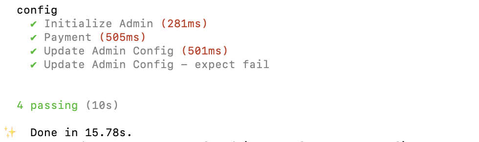

# Environment Variables on Solana

# Lesson Objectives

*By the end of this lesson, you will be able to:*

- Use Rust `cfg` attribute and feature flags to set up environment variables in an Anchor program
- Create an admin only instruction to set up a global state PDA used for storing config values

# TL;DR

- Use the `cfg` attribute with Rust features (`#[cfg(feature = ...)]`) to implement environment variables that differ between testing and production
- Use Anchor constraints to create admin instructions accessible only by the executing program’s upgrade authority

# Overview

In the context of Solana program development, environment variables can be used to store default settings and known addresses that a program can reference during execution.

Once a program is deployed, constants cannot be changed without redeploying the program. This can be a limitation for programs that require the ability to modify certain values after deployment. 

To address this issue, one solution is to create a global state PDA (program derived account) immediately after deploying the program. This account can be used to store values that may need to be modified after deployment.

The global state PDA account can be made accessible only by the program upgrade authority or an address that is hardcoded as a constant in the program. This ensures that only authorized parties can modify the values in the account, and helps prevent unauthorized changes.

By using a global state PDA account in this way, a program can maintain the ability to modify certain values after deployment, while still maintaining security and control over those values.

In the end, we will build and deploy an Anchor program on Localhost. Then, run 4 tests to verify our program is properly set up with it's `cfg` attributes and feature flags.

## Rust features flag and `cfg` attribute

In Rust, the `cfg` attribute can be used to conditionally compile code based on the value of a configuration flag. This allows you to include or exclude certain code from your program.

The `cfg` attribute can be used in a Anchor program in a similar way to how it is used in other Rust programs.

```rust
#[cfg(feature = "testing")]
fn my_function() {
    // code that will be included only if the "testing" feature flag is enabled
}

#[cfg(not(feature = "testing"))]
fn my_function() {
    // code that will be included only if the "testing" feature flag is not enabled
}
```

In this example, the `cfg` attribute is used to conditionally compile `my_function()` based on the presence of the `testing` feature. This allows you to enable or disable certain functionality in your Anchor program at compile time by enabling or disabling the feature.

Features flags are defined in the `[features]` table of the program’s `Cargo.toml` file. You may define multiple features for different use cases.

```toml
[features]
my-feature = []
another-feature = []
```

To enable a feature when testing your program, you can use the `--features` flag with the `anchor test` command. 

```bash
anchor test -- --features "my-feature"
```

You can also specify multiple features by separating them with a comma.

```bash
anchor test -- --features "my-feature", "another-feature"
```

### Environment variable example

The **`cfg`** attribute can be used in an Anchor program to conditionally compile code based on the value of a configuration flag, allowing you to adapt the program to different environments. 

This means we can configure the program to use a Devnet Address for testing and a Mainnet Address while in production. This allows the program to easily switch between different environments without requiring any changes to the code itself.

Here is an example of how you might use the `cfg` attribute to set up environment variables in your Anchor program:

```rust
use anchor_lang::prelude::*;
use anchor_spl::token::{Mint, Token, TokenAccount};

declare_id!("Fg6PaFpoGXkYsidMpWTK6W2BeZ7FEfcYkg476zPFsLnS");

#[cfg(feature = "local-testing")]
pub mod constants {
    use solana_program::{pubkey, pubkey::Pubkey};
    pub const USDC_MINT_PUBKEY: Pubkey = pubkey!("WaoKNLQVDyBx388CfjaVeyNbs3MT2mPgAhoCfXyUvg8");
}

#[cfg(not(feature = "local-testing"))]
pub mod constants {
    use solana_program::{pubkey, pubkey::Pubkey};
    pub const USDC_MINT_PUBKEY: Pubkey = pubkey!("EPjFWdd5AufqSSqeM2qN1xzybapC8G4wEGGkZwyTDt1v");
}

#[program]
pub mod test_program {
    use super::*;

		pub fn initialize_usdc_token_account(ctx: Context<Initialize>) -> Result<()> {
        Ok(())
    }
}

#[derive(Accounts)]
pub struct Initialize<'info> {
    #[account(
        init,
        payer = payer,
        token::mint = mint,
        token::authority = payer,
    )]
    pub token: Account<'info, TokenAccount>,
    #[account(address = constants::USDC_MINT_PUBKEY)]
    pub mint: Account<'info, Mint>,
    #[account(mut)]
    pub payer: Signer<'info>,
    pub token_program: Program<'info, Token>,
    pub system_program: Program<'info, System>,
    pub rent: Sysvar<'info, Rent>,
}
```

In this example, the `cfg` attribute is used to conditionally compile two different implementations of the `constants` module. This allows the program to use different values for the `USDC_MINT_PUBKEY` constant depending on whether the `local-testing` feature is enabled or not. This could be useful, for example, if the program needs to use different mint accounts for testing and production environments.

## Rust features flag and `cfg!` macro

The `cfg!` macro in Rust allows you to check the values of certain configuration flags at runtime. This can be useful if you want to execute different code paths depending on the values of certain configuration flags. For example, you could use the `cfg!` macro to bypass or adjust time-based constraints required in an instruction during testing. Think about testing a staking program where you must wait 24 hours to receive staking rewards. With out being able to adjust the staking time frame testing would take at least 24 hours.

To use the **`cfg!`** macro in an Anchor program, you can add a `cfg!` macro call to the body of the function you want to conditionally execute code. For example, you could use the `cfg!` macro like this:

```rust
#[program]
pub mod my_program {
    use super::*;

    pub fn test_function(ctx: Context<Test>) -> Result<()> {
        if cfg!(feature = "local-testing") {
            // This code will be executed only if the "local-testing" feature is enabled
            // ...
        } else {
            // This code will be executed only if the "local-testing" feature is not enabled
            // ...
        }
				// Code that should always be included goes here
				...
				Ok(())
    }
}
```

In this example, the `test_function` function uses the `cfg!` **macro** to check the value of the `local-testing` feature at runtime. If the `local-testing` feature is enabled, the first code path is executed. If the `local-testing` feature is not enabled, the second code path is executed instead.

## Admin Instruction

Next, let’s discuss creating an admin instruction to initialize a global state PDA used to store modifiable program configurations. 

One approach is to restrict access of an admin instruction to the program’s upgrade authority. Alternatively, you can hardcode the administrator public key as a constant in the program and include a constraint to check against the value. 

Here is an example of the account constraints used to ensure the `authority` signing a transaction matches the program’s `upgrade_authority_address`.

```rust
#[derive(Accounts)]
pub struct SetAdminSettings<'info> {
    #[account(mut, seeds = [b"admin"], bump)]
    pub admin_settings: Account<'info, AdminSettings>,
    #[account(constraint = program.programdata_address()? == Some(program_data.key()))]
    pub program: Program<'info, MyProgram>,
    #[account(constraint = program_data.upgrade_authority_address == Some(authority.key()))]
    pub program_data: Account<'info, ProgramData>,
    pub authority: Signer<'info>,
}
```

In this example the `admin_setting` account stores state intended to be updatable only by the admin. The `admin_setting` account is a PDA derived using the hardcoded value of `admin`. This means only one `AdminSettings` account can exist for this program.

```rust
#[account(mut, seeds = [b"admin"], bump)]
pub admin_settings: Account<'info, AdminSettings>,
```

The following accounts and constraints ensure that the `authority` signing the instruction must match the program’s upgrade authority.

```rust
#[account(constraint = program.programdata_address()? == Some(program_data.key()))]
pub program: Program<'info, MyProgram>,
#[account(constraint = program_data.upgrade_authority_address == Some(authority.key()))]
pub program_data: Account<'info, ProgramData>,
pub authority: Signer<'info>,
```
<!-- Revise flow here -->
Let's break this down a little more. The `constraint` on the `program` account specifies that the `program_data.key()` must match the `programdata_address` of the program itself.

```rust
#[account(constraint = program.programdata_address()? == Some(program_data.key()))]
pub program: Program<'info, MyProgram>,
```

The `constraint` on the `program_data` account specifies that the `authority.key()` must match the `upgrade_authority_address` of the `program_data` account.

```rust
#[account(constraint = program_data.upgrade_authority_address == Some(authority.key()))]
pub program_data: Account<'info, ProgramData>,
```

The `Signer` type specifies the `authority` must be a signer on the transaction

```rust
pub authority: Signer<'info>,
```

These series of constraints together ensures that only the upgrade authority of the executing program can sign as the `authority` for the intended admin instruction.

All together a simple `set_admin_settings` instruction would look like the following. 

```rust
use anchor_lang::prelude::*;
use crate::program::MyProgram;

declare_id!("29KLUpcQ1EHYqN3wqBkmo7o2T7xfhESpTKy6eEp9krNU");

#[program]
mod my_program {
    pub fn set_admin_settings(
        ctx: Context<SetAdminSettings>,
        admin_data: u64,
    ) -> Result<()> {
        ctx.accounts.admin_config.admin_data = admin_data;   
        Ok(())
    }
}

#[derive(Accounts)]
pub struct SetAdminSettings<'info> {
    #[account(mut, seeds = [b"admin"], bump)]
    pub admin_settings: Account<'info, AdminSettings>,
    #[account(constraint = program.programdata_address()? == Some(program_data.key()))]
    pub program: Program<'info, MyProgram>,
    #[account(constraint = program_data.upgrade_authority_address == Some(authority.key()))]
    pub program_data: Account<'info, ProgramData>,
    pub authority: Signer<'info>,
}

#[account]
pub struct AdminSettings {
   admin_data: u64,
}
```

You can read more about the relationship between the program account and program data account [here](https://www.notion.so/29780c48794c47308d5f138074dd9838).

# Demo

Let's pull all of this together now by creating and testing a Solana program that will run 4 tests:

1) Txn on local validator
2) Simulated txn on Mainnet
3) An Admin Config Update - as Admin
4) An Admin Config Update - not as Admin

Based on the `cfg` attributes and feature flags we will provide, all 4 tests should pass.

### 1. Starter

First thing to do is grab the starter code here [https://github.com/maweiche/admin-test/tree/starter](https://github.com/maweiche/admin-test/tree/starter). Make sure you clone the code from the `starter` branch and not `master`.

Once you've cloned the starter code, let's configure Solana in the terminal. We'll be deploying and testing on localhost, so switch the Solana RPC in your terminal to localhost with:

```sh
solana config set --url localhost
```

If you see an output like this, then you're set.

```sh
RPC URL: http://localhost:8899
```

### 2. Admin Instruction

Now that we are set up, let's open our `state.rs` located in your `/programs/config/src` directory and define the structure expected for our `AdminConfig`

```rust
use anchor_lang::prelude::*;

#[account]
pub struct AdminConfig {
    pub admin: Pubkey,
    pub fee_destination: Pubkey,
    pub fee_basis_points: u64,
}

impl AdminConfig {
    pub const LEN: usize = 8 + 32 + 32 + 8;
}
```

The structure is pretty straightforward, we are telling the program which "types" to expect for the three fields in `AdminConfig`, and then how many bytes are required to store this structure.

Next, let's edit the programs instructions starting with `initialize_admin_config.rs` located in the `/programs/config/src/instructions/admin` :

```rust
use crate::program::Config;
use crate::state::AdminConfig;
use anchor_lang::prelude::*;
use anchor_spl::token::TokenAccount;

#[derive(Accounts)]
pub struct InitializeAdminConfig<'info> {
    #[account(init, seeds = [b"admin"], bump, payer = authority, space = AdminConfig::LEN)]
    pub admin_config: Account<'info, AdminConfig>,
    #[account()]
    pub fee_destination: Account<'info, TokenAccount>,
    #[account(mut)]
    pub authority: Signer<'info>,
    #[account(constraint = program.programdata_address()? == Some(program_data.key()))]
    pub program: Program<'info, Config>,
    #[account(constraint = program_data.upgrade_authority_address == Some(authority.key()))]
    pub program_data: Account<'info, ProgramData>,
    pub system_program: Program<'info, System>,
}

pub fn initialize_admin_config_handler(ctx: Context<InitializeAdminConfig>) -> Result<()> {
    ctx.accounts.admin_config.admin = ctx.accounts.authority.key();
    ctx.accounts.admin_config.fee_destination = ctx.accounts.fee_destination.key();
    ctx.accounts.admin_config.fee_basis_points = 100;
    Ok(())
}
```

What we are doing here is setting up the instructions for how to initialize the `AdminConfig` and what values to set to it's fields. To be more specific, when the program is deployed it will take the `Signer` of the deployment and set it as the `Authority` because of these 2 lines :

```rust
pub authority: Signer<'info>,
```

```rust
ctx.accounts.admin_config.admin = ctx.accounts.authority.key();
```


### 3. Payment Instruction

Now that we have the `AdminConfig` set up, let's dig into the `payment.rs` located in the `programs/config/src/instructions` directory.

Here we'll breakdown the instructions for how our program will handle a payment, starting with updating the imports and payment structure.

```rust
use crate::state::AdminConfig;
use crate::USDC_MINT_PUBKEY;
use anchor_lang::prelude::*;
use anchor_spl::token::{self, Mint, Token, TokenAccount};

#[derive(Accounts)]
pub struct Payment<'info> {
    #[account(
        seeds = [b"admin"],
        bump,
        has_one = fee_destination
    )]
    pub admin_config: Account<'info, AdminConfig>,
    #[account(
        mut,
        token::mint = USDC_MINT_PUBKEY
    )]
    pub fee_destination: Account<'info, TokenAccount>,
    #[account(
        mut,
        token::mint = USDC_MINT_PUBKEY
    )]
    pub sender_token_account: Account<'info, TokenAccount>,
    #[account(
        mut,
        token::mint = USDC_MINT_PUBKEY
    )]
    pub receiver_token_account: Account<'info, TokenAccount>,
    pub token_program: Program<'info, Token>,
    #[account(mut)]
    pub sender: Signer<'info>,
}
```

Once we've defined the structure for our `Payment` let's write the function to handle it:

```rust
pub fn payment_handler(ctx: Context<Payment>, amount: u64) -> Result<()> {
    let fee_amount = amount
        .checked_mul(ctx.accounts.admin_config.fee_basis_points)
        .unwrap()
        .checked_div(10000)
        .unwrap();
    let remaining_amount = amount.checked_sub(fee_amount).unwrap();

    msg!("Amount: {}", amount);
    msg!("Fee Amount: {}", fee_amount);
    msg!("Remaining Amount: {}", remaining_amount);

    token::transfer(
        CpiContext::new(
            ctx.accounts.token_program.to_account_info(),
            token::Transfer {
                from: ctx.accounts.sender_token_account.to_account_info(),
                authority: ctx.accounts.sender.to_account_info(),
                to: ctx.accounts.fee_destination.to_account_info(),
            },
        ),
        fee_amount,
    )?;

    token::transfer(
        CpiContext::new(
            ctx.accounts.token_program.to_account_info(),
            token::Transfer {
                from: ctx.accounts.sender_token_account.to_account_info(),
                authority: ctx.accounts.sender.to_account_info(),
                to: ctx.accounts.receiver_token_account.to_account_info(),
            },
        ),
        remaining_amount,
    )?;

    Ok(())
}
```

Nothing too special here, just a standard token transfer from one account to another using the token address defined by `USDC_MINT_PUBKEY` in our structure.

### 4. Write Tests

Ok, now that we have completed the instructions for our two test subjects, the `Payment` and `AdminConfig`, let's set up the tests.

Open up your `/tests/config.ts` , the first thing we want to set up is initializing the `AdminConfig`:

```tsx
it("Initialize Admin", async () => {
    const tx = await program.methods
      .initializeAdminConfig()
      .accounts({
        adminConfig: adminConfig,
        feeDestination: feeDestination,
        authority: wallet.publicKey,
        program: program.programId,
        programData: programDataAddress,
        systemProgram: anchor.web3.SystemProgram.programId,
      })
      .rpc()

    assert.strictEqual(
      (
        await program.account.adminConfig.fetch(adminConfig)
      ).feeBasisPoints.toNumber(),
      100
    )
    assert.strictEqual(
      (await program.account.adminConfig.fetch(adminConfig)).admin.toString(),
      wallet.publicKey.toString()
    )
  })
```

Again, pretty straightforward. We are setting the intial states of the `AdminConfig` and the program that we have provided in our `Anchor.toml` (more on that in a minute).

Next, let's set up the `Payment` test instruction:

```tsx
it("Payment", async () => {
    try {
      const tx = await program.methods
        .payment(new anchor.BN(10000))
        .accounts({
          adminConfig: adminConfig,
          feeDestination: feeDestination,
          senderTokenAccount: senderTokenAccount,
          receiverTokenAccount: receiverTokenAccount,
          sender: sender.publicKey,
        })
        .transaction()

      await anchor.web3.sendAndConfirmTransaction(connection, tx, [sender])

      assert.strictEqual(
        (await connection.getTokenAccountBalance(senderTokenAccount)).value
          .uiAmount,
        0
      )

      assert.strictEqual(
        (await connection.getTokenAccountBalance(feeDestination)).value
          .uiAmount,
        100
      )

      assert.strictEqual(
        (await connection.getTokenAccountBalance(receiverTokenAccount)).value
          .uiAmount,
        9900
      )
    } catch (err) {
      console.log(err)
    }
  })
```

So for our test what the `Payment` instruction is doing here is creating a payment of `10000` from the `senderTokenAccount` to the `receiverTokenAccount`. It is then checking the balance of 3 accounts (`sender`, `receiver`, `feeDestination`). IF the program executes as expected then the following should be true:

- the `senderTokenAccount` should have `0` tokens remaining (because it sent them all)
- the `feeDestination` should have `100` tokens (because we set the `fee_basis_points` to .1%)
- the `receiverTokenAccount` should have `9900` (the original amount - the fee)


Ok cool, we are half way there with 2/4 tests complete, let's write the last two. The first one will attmempt to `Update Admin Config` using the `Admin` credentials, and the second will do the same except with the wrong credentials (for this test to pass, we expect the update to fail).

Let's dig in to the `Update Admin Config`:

```tsx
  it("Update Admin Config", async () => {
    const tx = await program.methods
      .updateAdminConfig(new anchor.BN(200))
      .accounts({
        adminConfig: adminConfig,
        admin: wallet.publicKey,
      })
      .rpc()

    assert.strictEqual(
      (
        await program.account.adminConfig.fetch(adminConfig)
      ).feeBasisPoints.toNumber(),
      200
    )
  })
```
Here we are updating the `feeBasisPoints` to `200` in the `AdminConfig` with the `admin` set to the `publickey` from the `wallet` provided in the `Anchor.toml` (we'll still get to that, hang tight).

If it executes as expected, after the update the program should have a new `feeBasisPoints` of `200`.

Now for the final test `Update Admin Config - expect fail` :

```tsx
  it("Update Admin Config - expect fail", async () => {
    try {
      const tx = await program.methods
        .updateAdminConfig(new anchor.BN(300))
        .accounts({
          adminConfig: adminConfig,
          admin: sender.publicKey,
        })
        .transaction()

      await anchor.web3.sendAndConfirmTransaction(connection, tx, [sender])
    } catch (err) {
      expect(err)
      // console.log(err)
    }
  })
```
With this final test, we are trying to update the `AdminConfig` just like before, but this time using `sender.publicKey`. Our program should not allow this, so if it "fails" then our test will "Pass".

### Build and Deploy

Ok great job! You have now written all of the necessary instructions and tests, but it's not quite ready to test. First we need to use Anchor to build and deploy the program, then we'll have to update the program id listed in two places.

First, let's go to that `Anchor.toml` we talked about earlier and set our wallet to the right location. Inside the `Anchor.toml` you should see:

```
wallet = "YOUR_WALLET_PATH_HERE"
```

Use `solana config get` to get the location of your `Keypair Path` and inject that where "YOUR_WALLET_PATH_HERE" is. Mine looks like:

```
wallet = "/home/matt/.config/solana/id.json"
```

Next, head back to the terminal. Make sure you are in your project directory and run:

```sh
anchor build
```

Once you see `Finished` you are ready to deploy! So to deploy on localhost, let's open up a 2nd tab in our terminal and start our local solana validator using:

```sh
solana-test-validator
```

You should see the validator turn on (make sure to turn off with `ctrl + c` when finished), head back to your first tab and now run:

```sh
anchor deploy
```

If you see you receive a `Error: RPC request error` it's most likely because your `solana-test-validator` isn't running, double check that. If successful you should see something like:

```sh
Program Id: 3cye9aV3D7qdoAp2a8QBs6wF6CvS2PYPWhxYhunAc4dS

Deploy success
```

Awesome! Now copy that `Program Id` and let's update our program in 2 places: `Anchor.toml` and `lib.rs`

`Anchor.toml`
```
[programs.localnet]
config = "3cye9aV3D7qdoAp2a8QBs6wF6CvS2PYPWhxYhunAc4dS"
```

`lib.rs`
```rust
declare_id!("3cye9aV3D7qdoAp2a8QBs6wF6CvS2PYPWhxYhunAc4dS");
```

To recap what we did here:

-We built and deployed the program with Anchor
-Took the deployed program Id
-Updated our program id referenced by our code so the test reads the right program (the one with `AdminConfig` set to our local wallet)

### Test

Final step! Let's test! To do this we'll use this command that skips the deploy command and uses the feature flag "local-testing":

```sh
anchor test --skip-deploy -- --features "local-testing"
```

If everything executes correctly your response should look like the following:



If needed, you can compare with the solution code here: [https://github.com/maweiche/admin-test/tree/starter](https://github.com/maweiche/admin-test/tree/solution).

Nice job, you now know how to create `env` type variables within a Solana Program!

# Challenge

*Short, numbered instructions for readers to do a project similar to the demo, only this time independently. Gives them a chance to know for sure that they feel solid about the lesson. We can provide starter and solution code but the expectation is the solution code is for reference and comparison after they’ve done the challenge independently.*

1. Challenge instruction one
2. Challenge instruction two