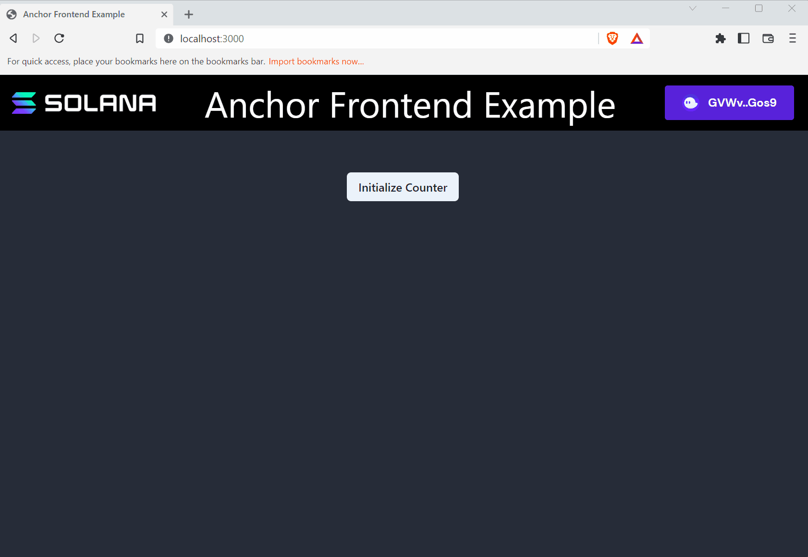

# TL;DR

-   An **IDL** es un archivo que representa la estructura de un programa de Solana. Los programas escritos y construidos usando Anchor generan automáticamente un IDL correspondiente. IDL son las siglas de Interface Description Language.
-   `@coral-xyz/anchor` es un cliente de Typescript que incluye todo lo que necesitará para interactuar con los programas de Anchor
-   Un `Provider` ** objeto **de anclaje combina un `connection` a un clúster y un especificado `wallet` para habilitar la firma de transacciones
-   Un `Program` ** objeto de **anclaje proporciona una API personalizada para interactuar con un programa específico. Crea una `Program` instancia utilizando el IDL de un programa y `Provider`.
-   El **ancla `MethodsBuilder` ** proporciona una interfaz simple a través `Program` de instrucciones de construcción y transacciones.

# Descripción general

Anchor simplifica el proceso de interacción con los programas de Solana desde el cliente al proporcionar un archivo de lenguaje de descripción de interfaz (IDL) que refleja la estructura de un programa. El uso del IDL junto con la biblioteca Typescript de Anchor ( `@coral-xyz/anchor`) proporciona un formato simplificado para construir instrucciones y transacciones.

```tsx
// sends transaction
await program.methods
    .instructionName(instructionDataInputs)
    .accounts({})
    .signers([])
    .rpc();
```

Esto funciona desde cualquier cliente Typescript, ya sea un frontend o pruebas de integración. En esta lección vamos a repasar cómo utilizar `@coral-xyz/anchor` para simplificar la interacción del programa del lado del cliente.

## Estructura del lado del cliente de anclaje

Comencemos repasando la estructura básica de la biblioteca Typescript de Anchor. El objeto principal que vas a utilizar es el `Program` objeto. Una `Program` instancia representa un programa específico de Solana y proporciona una API personalizada para leer y escribir en el programa.

Para crear una instancia de `Program`, necesitará lo siguiente:

-   IDL - archivo que representa la estructura de un programa
-   `Connection` - la conexión del clúster
-   `Wallet` - par de claves predeterminado utilizado para pagar y firmar transacciones
-   `Provider` - encapsula el `Connection` a un clúster de Solana y un `Wallet`
-   `ProgramId` - la dirección en cadena del programa


La imagen de arriba muestra cómo cada una de estas piezas se combinan para crear una `Program` instancia. Repasaremos cada uno de ellos individualmente para tener una mejor idea de cómo todo se une.

### Idioma de descripción de interfaz (IDL)

Cuando crea un programa de Anchor, Anchor genera un archivo JSON y Typescript que representa el IDL de su programa. El IDL representa la estructura del programa y puede ser utilizado por un cliente para inferir cómo interactuar con un programa específico.

Si bien no es automático, también puede generar un IDL a partir de un programa nativo de Solana utilizando herramientas [shank](https://github.com/metaplex-foundation/shank) como Metaplex.

Para tener una idea de la información que proporciona un IDL, aquí está el IDL para el programa de contador que construyó anteriormente:

```json
{
    "version": "0.1.0",
    "name": "counter",
    "instructions": [
        {
            "name": "initialize",
            "accounts": [
                { "name": "counter", "isMut": true, "isSigner": true },
                { "name": "user", "isMut": true, "isSigner": true },
                { "name": "systemProgram", "isMut": false, "isSigner": false }
            ],
            "args": []
        },
        {
            "name": "increment",
            "accounts": [
                { "name": "counter", "isMut": true, "isSigner": false },
                { "name": "user", "isMut": false, "isSigner": true }
            ],
            "args": []
        }
    ],
    "accounts": [
        {
            "name": "Counter",
            "type": {
                "kind": "struct",
                "fields": [{ "name": "count", "type": "u64" }]
            }
        }
    ]
}
```

Al inspeccionar el IDL, puede ver que este programa contiene dos instrucciones ( `initialize` y `increment`).

Observe que además de especificar las instrucciones, especifica las cuentas y entradas para cada instrucción. La `initialize` instrucción requiere tres cuentas:

1.  `counter` - la nueva cuenta que se inicializa en la instrucción
2.  `user` - el ordenante de la transacción y la inicialización
3.  `systemProgram` - el programa del sistema se invoca para inicializar una nueva cuenta

Y la `increment` instrucción requiere dos cuentas:

1.  `counter` - una cuenta existente para aumentar el campo de recuento
2.  `user` - el ordenante de la operación

Mirando el IDL, puede ver que en ambas instrucciones `user` se requiere como firmante porque la `isSigner` marca está marcada como `true`. Además, ninguna de las instrucciones requiere ningún dato de instrucción adicional ya que la `args` sección está en blanco para ambas.

Mirando más abajo en la `accounts` sección, puede ver que el programa contiene un tipo de cuenta nombrado `Counter` con un solo `count` campo de tipo `u64`.

Aunque el IDL no proporciona los detalles de implementación para cada instrucción, podemos obtener una idea básica de cómo el programa en cadena espera que se construyan las instrucciones y ver la estructura de las cuentas del programa.

Independientemente de cómo lo obtenga, tiene _necesidad_ un archivo IDL para interactuar con un programa que usa el `@coral-xyz/anchor` paquete. Para usar el IDL, deberá incluir el archivo IDL en su proyecto y luego importar el archivo.

```tsx
import idl from "./idl.json";
```

### Proveedor

Antes de que pueda crear un `Program` objeto utilizando el IDL, primero debe crear un `Provider` objeto de anclaje.

El `Provider` objeto combina dos cosas:

-   `Connection` - la conexión a un clúster de Solana (es decir, localhost, devnet, mainnet)
-   `Wallet` - una dirección especificada utilizada para pagar y firmar transacciones

Luego `Provider`, puede enviar transacciones a la cadena de bloques de Solana en nombre de a `Wallet` al incluir la firma de la billetera a las transacciones salientes. Cuando se utiliza un frontend con un proveedor de monedero Solana, todas las transacciones salientes aún deben ser aprobadas por el usuario a través de la extensión de su navegador de monedero.

Configurar el `Wallet` y `Connection` se vería algo como esto:

```tsx
import { useAnchorWallet, useConnection } from "@solana/wallet-adapter-react";

const { connection } = useConnection();
const wallet = useAnchorWallet();
```

Para configurar la conexión, puede usar el `useConnection` gancho de `@solana/wallet-adapter-react` para obtener el `Connection` a un clúster de Solana.

Tenga en cuenta que el `Wallet` objeto proporcionado por el `useWallet` gancho de no `@solana/wallet-adapter-react` es compatible con el `Wallet` objeto que el ancla `Provider` espera. Sin embargo, `@solana/wallet-adapter-react` también proporciona un `useAnchorWallet` gancho.

A modo de comparación, aquí está el `AnchorWallet` de `useAnchorWallet` :

```tsx
export interface AnchorWallet {
    publicKey: PublicKey;
    signTransaction(transaction: Transaction): Promise<Transaction>;
    signAllTransactions(transactions: Transaction[]): Promise<Transaction[]>;
}
```

Y el `WalletContextState` de `useWallet` :

```tsx
export interface WalletContextState {
    autoConnect: boolean;
    wallets: Wallet[];
    wallet: Wallet | null;
    publicKey: PublicKey | null;
    connecting: boolean;
    connected: boolean;
    disconnecting: boolean;
    select(walletName: WalletName): void;
    connect(): Promise<void>;
    disconnect(): Promise<void>;
    sendTransaction(
        transaction: Transaction,
        connection: Connection,
        options?: SendTransactionOptions,
    ): Promise<TransactionSignature>;
    signTransaction: SignerWalletAdapterProps["signTransaction"] | undefined;
    signAllTransactions:
        | SignerWalletAdapterProps["signAllTransactions"]
        | undefined;
    signMessage: MessageSignerWalletAdapterProps["signMessage"] | undefined;
}
```

`WalletContextState` Proporciona mucha más funcionalidad en comparación con el `AnchorWallet`, pero `AnchorWallet` se requiere para configurar el `Provider` objeto.

Para crear el `Provider` objeto `AnchorProvider` desde el que se usa `@coral-xyz/anchor`.

El `AnchorProvider` constructor tiene tres parámetros:

-   `connection` - el `Connection` al clúster Solana
-   `wallet` - el `Wallet` objeto
-   `opts` - parámetro opcional que especifica las opciones de confirmación, utilizando una configuración predeterminada si no se proporciona una

Una vez que haya creado el `Provider` objeto, configúrelo como proveedor predeterminado `setProvider`.

```tsx
import { useAnchorWallet, useConnection } from "@solana/wallet-adapter-react";
import { AnchorProvider, setProvider } from "@coral-xyz/anchor";

const { connection } = useConnection();
const wallet = useAnchorWallet();
const provider = new AnchorProvider(connection, wallet, {});
setProvider(provider);
```

### Programa

Una vez que tenga el IDL y un proveedor, puede crear una instancia de `Program`. El constructor requiere tres parámetros:

-   `idl` - el IDL como tipo `Idl`
-   `programId` - la dirección en cadena del programa como `string` o `PublicKey`
-   `Provider` - EL proveedor comentado en el apartado anterior

El `Program`  objeto crea una API personalizada que puede usar para interactuar con un programa de Solana. Esta API es la ventanilla única para todo lo relacionado con la comunicación con los programas en cadena. Entre otras cosas, puede enviar transacciones, obtener cuentas deserializadas, decodificar datos de instrucciones, suscribirse a cambios en la cuenta y escuchar eventos. Puedes aprender más sobre la `Program` clase[here](https://coral-xyz.github.io/anchor/ts/classes/Program.html#constructor).

Para crear el `Program` objeto, primero importa `Program` y `Idl` desde `@coral-xyz/anchor`. `Idl` es un tipo que puedes usar cuando trabajas con Typescript.

A continuación, especifique `programId` la del programa. Tenemos que indicar explícitamente el `programId` ya que puede haber múltiples programas con la misma estructura IDL (es decir, si el mismo programa se implementa varias veces utilizando diferentes direcciones). Al crear el `Program` objeto, `Provider` se utiliza el valor predeterminado si no se especifica explícitamente uno.

En conjunto, la configuración final se ve algo así:

```tsx
import idl from "./idl.json";
import { useAnchorWallet, useConnection } from "@solana/wallet-adapter-react";
import {
    Program,
    Idl,
    AnchorProvider,
    setProvider,
} from "@coral-xyz/anchor";

const { connection } = useConnection();
const wallet = useAnchorWallet();

const provider = new AnchorProvider(connection, wallet, {});
setProvider(provider);

const programId = new PublicKey("JPLockxtkngHkaQT5AuRYow3HyUv5qWzmhwsCPd653n");
const program = new Program(idl as Idl, programId);
```

## Ancla `MethodsBuilder`

Una vez que el `Program` objeto está configurado, puede utilizar el Constructor de métodos de anclaje para crear instrucciones y transacciones relacionadas con el programa. `MethodsBuilder` Utiliza el IDL para proporcionar un formato simplificado para crear transacciones que invocan instrucciones de programa.

Tenga en cuenta que la convención de nomenclatura de casos Camel se utiliza cuando se interactúa con un programa del cliente, en comparación con la convención de nomenclatura de casos Snake utilizada cuando se escribe el programa en Rust.

El `MethodsBuilder` formato básico es el siguiente:

```tsx
// sends transaction
await program.methods
    .instructionName(instructionDataInputs)
    .accounts({})
    .signers([])
    .rpc();
```

Pasando paso a paso, usted:

1. Call `methods` on `program` : esta es la API del constructor para crear llamadas de instrucción relacionadas con el IDL del programa
2. Llame al nombre de la instrucción como `.instructionName(instructionDataInputs)` - simplemente llame a la instrucción usando la sintaxis de puntos y el nombre de la instrucción, pasando cualquier argumento de instrucción como valores separados por comas
3. Llamada `accounts` - usando la sintaxis del punto `.accounts`, llamada, pasando en un objeto con cada cuenta la instrucción espera basado en el IDL
4. Opcionalmente llame `signers` - usando la sintaxis del punto `.signers`, llame, pasando en una serie de firmantes adicionales requeridos por la instrucción
5. Llamada `rpc` : este método crea y envía una transacción firmada con la instrucción especificada y devuelve una `TransactionSignature`. Cuando se usa `.rpc`, el `Wallet` de `Provider` se incluye automáticamente como firmante y no tiene que enumerarse explícitamente.

Tenga en cuenta que si no se requieren firmantes adicionales por la instrucción que no sean los `Wallet` especificados con el `Provider`, la `.signer([])` línea puede ser excluida.

También puede crear la transacción directamente cambiando `.rpc()` a `.transaction()`. Esto crea un `Transaction` objeto utilizando la instrucción especificada.

```tsx
// creates transaction
const transaction = await program.methods
    .instructionName(instructionDataInputs)
    .accounts({})
    .transaction();

await sendTransaction(transaction, connection);
```

Del mismo modo, puede usar el mismo formato para compilar una instrucción usando `.instruction()` y luego agregar manualmente las instrucciones a una nueva transacción. Esto crea un `TransactionInstruction` objeto utilizando la instrucción especificada.

```tsx
// creates first instruction
const instructionOne = await program.methods
    .instructionOneName(instructionOneDataInputs)
    .accounts({})
    .instruction();

// creates second instruction
const instructionTwo = await program.methods
    .instructionTwoName(instructionTwoDataInputs)
    .accounts({})
    .instruction();

// add both instruction to one transaction
const transaction = new Transaction().add(instructionOne, instructionTwo);

// send transaction
await sendTransaction(transaction, connection);
```

En resumen, Anchor `MethodsBuilder` proporciona una forma simplificada y más flexible de interactuar con los programas en cadena. Puede crear una instrucción, una transacción o crear y enviar una transacción utilizando básicamente el mismo formato sin tener que serializar o deserializar manualmente las cuentas o los datos de la instrucción.

## Obtener cuentas del programa

El `Program` objeto también le permite buscar y filtrar fácilmente cuentas de programa. Simplemente llame `program` y `account` luego especifique el nombre del tipo de cuenta como se refleja en el IDL. Anchor luego deserializa y devuelve todas las cuentas según lo especificado.

El siguiente ejemplo muestra cómo puede obtener todas las `counter` cuentas existentes para el programa Counter.

```tsx
const accounts = await program.account.counter.all();
```

También puede aplicar un filtro usando `memcmp` y luego especificando un `offset` y el filtro `bytes` para.

El siguiente ejemplo muestra todas `counter` las cuentas con `count` un 0. Tenga en cuenta que el `offset` de 8 es para el discriminador de 8 bytes que Anchor utiliza para identificar los tipos de cuenta. El 9º byte es donde comienza el `count` campo. Puede consultar el IDL para ver que el siguiente byte almacena el `count` campo de tipo `u64`. Anchor luego filtra y devuelve todas las cuentas con bytes coincidentes en la misma posición.

```tsx
const accounts = await program.account.counter.all([
    {
        memcmp: {
            offset: 8,
            bytes: bs58.encode(new BN(0, "le").toArray()),
        },
    },
]);
```

Alternativamente, también puede obtener los datos de la cuenta deserializada para una cuenta específica `fetch` si conoce la dirección de la cuenta que está buscando.

```tsx
const account = await program.account.counter.fetch(ACCOUNT_ADDRESS);
```

Del mismo modo, puede buscar para varias cuentas usando `fetchMultiple`.

```tsx
const accounts = await program.account.counter.fetchMultiple([
    ACCOUNT_ADDRESS_ONE,
    ACCOUNT_ADDRESS_TWO,
]);
```

# Demostración

Practiquemos esto juntos construyendo un frontend para el programa Counter de la última lección. Como recordatorio, el programa Counter tiene dos instrucciones:

-   `initialize` - inicializa una nueva `Counter` cuenta y establece el `count` a `0`
-   `increment` - aumenta la `count` en una `Counter` cuenta existente

### 1. Descarga el código de inicio

Descargue el código de inicio para este proyecto[here](https://github.com/Unboxed-Software/anchor-ping-frontend/tree/starter). Una vez que tenga el código de inicio, eche un vistazo a su alrededor. Instale las dependencias con `npm install` y luego ejecute la aplicación con `npm run dev`.

Este proyecto es una sencilla aplicación Next.js. Incluye el archivo `WalletContextProvider` que creamos en el[Lección de monederos](https://github.com/Unboxed-Software/solana-course/blob/main/content/interact-with-wallets), el `idl.json` archivo para el programa Counter, y los `Increment` componentes `Initialize` and que construiremos a lo largo de esta demostración. El `programId` del programa que vamos a invocar también está incluido en el código de inicio.

### 2. `Initialize`

Para empezar, vamos a completar la configuración para crear el `Program` objeto en el `Initialize.tsx` componente.

Recuerde, necesitaremos una instancia de `Program` para usar el Ancla `MethodsBuilder` para invocar las instrucciones en nuestro programa. Para eso, necesitaremos una billetera Anchor y una conexión, que podemos obtener de los `useConnection` ganchos `useAnchorWallet` and. También vamos a crear una `useState` para capturar la instancia del programa.

```tsx
export const Initialize: FC<Props> = ({ setCounter }) => {
  const [program, setProgram] = useState("")

  const { connection } = useConnection()
  const wallet = useAnchorWallet()

  ...
}
```

Con eso, podemos trabajar en la creación de la `Program` instancia real. Hagámoslo en un `useEffect`.

Primero necesitamos obtener el proveedor predeterminado si ya existe, o crearlo si no existe. Podemos hacerlo llamando `getProvider` dentro de un bloque try/catch. Si se produce un error, eso significa que no hay un proveedor predeterminado y necesitamos crear uno.

Una vez que tenemos un proveedor, podemos construir una `Program` instancia.

```tsx
useEffect(() => {
    let provider: anchor.Provider;

    try {
        provider = anchor.getProvider();
    } catch {
        provider = new anchor.AnchorProvider(connection, wallet, {});
        anchor.setProvider(provider);
    }

    const program = new anchor.Program(idl as anchor.Idl, PROGRAM_ID);
    setProgram(program);
}, []);
```

Ahora que hemos terminado la configuración del ancla, podemos invocar la `initialize` instrucción del programa. Haremos esto dentro de la `onClick` función.

Primero, tendremos que generar una nueva `Keypair` para la nueva `Counter` cuenta, ya que estamos inicializando una cuenta por primera vez.

Luego podemos usar el Ancla `MethodsBuilder` para crear y enviar una nueva transacción. Recuerde, Anchor puede inferir algunas de las cuentas requeridas, como las `systemAccount` cuentas `user` and. Sin embargo, no puede inferir la `counter` cuenta porque la generamos dinámicamente, por lo que deberá agregarla `.accounts`. También tendrá que añadir ese par de teclas como un signo con `.signers`. Por último, puede utilizar `.rpc()` para enviar la transacción a la billetera del usuario.

Una vez realizada la transacción, llame `setUrl` a la URL del explorador y luego llame `setCounter`, pasando a la cuenta del contador.

```tsx
const onClick = async () => {
    const sig = await program.methods
        .initialize()
        .accounts({
            counter: newAccount.publicKey,
            user: wallet.publicKey,
            systemAccount: anchor.web3.SystemProgram.programId,
        })
        .signers([newAccount])
        .rpc();

    setTransactionUrl(`https://explorer.solana.com/tx/${sig}?cluster=devnet`);
    setCounter(newAccount.publicKey);
};
```

### 3. `Increment`

A continuación, pasemos al `Increment.tsx` componente. Al igual que antes, complete la configuración para crear el `Program` objeto. Además de llamar `setProgram`, `useEffect` debería llamar `refreshCount`.

Añada el siguiente código para la configuración inicial:

```tsx
export const Increment: FC<Props> = ({ counter, setTransactionUrl }) => {
  const [count, setCount] = useState(0)
  const [program, setProgram] = useState<anchor.Program>()
  const { connection } = useConnection()
  const wallet = useAnchorWallet()

  useEffect(() => {
    let provider: anchor.Provider

    try {
      provider = anchor.getProvider()
    } catch {
      provider = new anchor.AnchorProvider(connection, wallet, {})
      anchor.setProvider(provider)
    }

    const program = new anchor.Program(idl as anchor.Idl, PROGRAM_ID)
    setProgram(program)
    refreshCount(program)
  }, [])
  ...
}
```

A continuación, vamos a utilizar el ancla `MethodsBuilder` para construir una nueva instrucción para invocar la `increment` instrucción. Una vez más, Anchor puede inferir la `user` cuenta de la billetera, por lo que solo necesitamos incluir la `counter` cuenta.

```tsx
const onClick = async () => {
    const sig = await program.methods
        .increment()
        .accounts({
            counter: counter,
            user: wallet.publicKey,
        })
        .rpc();

    setTransactionUrl(`https://explorer.solana.com/tx/${sig}?cluster=devnet`);
};
```

### 5. Mostrar el recuento correcto

Ahora que podemos inicializar el programa del contador e incrementar el conteo, necesitamos obtener nuestra interfaz de usuario para mostrar el conteo almacenado en la cuenta del contador.

Mostraremos cómo observar los cambios en la cuenta en una lección futura, pero por ahora solo tenemos un botón que llama para que `refreshCount` pueda hacer clic en él para mostrar el nuevo recuento después de cada `increment` invocación.

En el interior `refreshCount`, vamos `program` a utilizar para recuperar la cuenta del contador, `setCount` a continuación, utilizar para establecer el recuento en el número almacenado en el programa:

```tsx
const refreshCount = async (program) => {
    const counterAccount = await program.account.counter.fetch(counter);
    setCount(counterAccount.count.toNumber());
};
```

¡Súper sencillo con Anchor!

### 5. Probar el frontend

En este punto, ¡todo debería funcionar! Puede probar el frontend ejecutando `npm run dev`.

1. Conecta tu billetera y deberías ver el `Initialize Counter` botón
2. Haga clic en el `Initialize Counter` botón y, a continuación, apruebe la transacción
3. A continuación, debe ver un enlace en la parte inferior de la pantalla a Solana Explorer para la `initialize` transacción. El `Increment Counter` botón, `Refresh Count` el botón y el recuento también deben aparecer.
4. Haga clic en el `Increment Counter` botón y, a continuación, apruebe la transacción
5. Espere unos segundos y haga clic `Refresh Count`. El recuento debe incrementarse en la pantalla.



¡Siéntase libre de hacer clic en los enlaces para inspeccionar los registros del programa de cada transacción!


Enhorabuena, ahora sabe cómo configurar un frontend para invocar un programa Solana utilizando un IDL de Anchor.

Si necesita más tiempo con este proyecto para sentirse cómodo con estos conceptos, no dude en echar un vistazo al [código de solución en la `solution-increment` sucursal](https://github.com/Unboxed-Software/anchor-ping-frontend/tree/solution-increment) antes de continuar.

# Desafío

Ahora es tu turno de construir algo de forma independiente. Sobre la base de lo que hemos hecho en la demostración, intente crear un nuevo componente en el frontend que implemente un botón para disminuir el contador.

Antes de construir el componente en el frontend, primero deberá:

1. Construir e implementar un nuevo programa que implemente una `decrement` instrucción
2. Actualice el archivo IDL en el frontend con el de su nuevo programa
3. Actualiza el `programId` con el de tu nuevo programa

Si necesita ayuda, no dude en consultar este programa[here](https://github.com/Unboxed-Software/anchor-counter-program/tree/solution-decrement).

¡Intenta hacerlo de forma independiente si puedes! Pero si te quedas atascado, siéntete libre de hacer referencia a la[código de solución](https://github.com/Unboxed-Software/anchor-ping-frontend/tree/solution-decrement).
