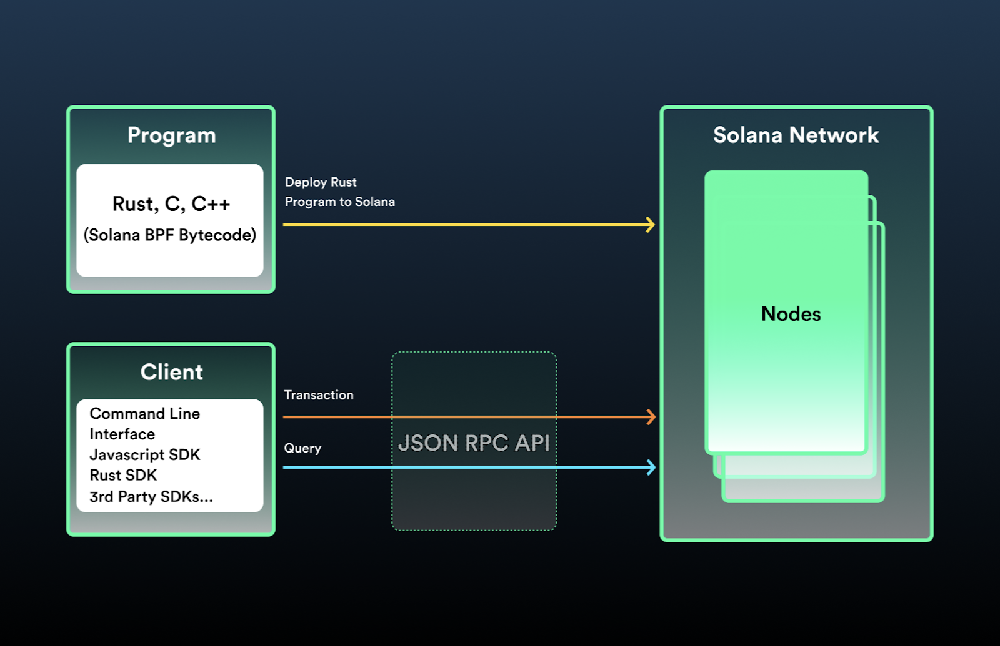
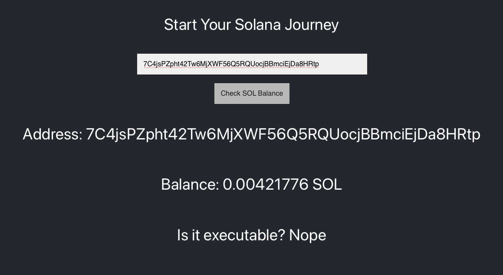

## TL;DR

-   **Cuentas** son como los archivos en el libro mayor de red de Solana. Todos los datos de estado se almacenan en una cuenta. Las cuentas se pueden usar para muchas cosas, pero por ahora nos centraremos en el aspecto de las cuentas que almacenan SOL.
-   **SOL** es el nombre del token nativo de Solana.
-   **Lamports** son SOLES fraccionarios y llevan su nombre [Leslie Lamport](https://en.wikipedia.org/wiki/Leslie_Lamport).
-   **Claves públicas**, a menudo denominadas direcciones, apuntan a cuentas en la red Solana. Si bien debe tener una clave secreta específica para realizar ciertas funciones dentro de las cuentas, cualquier persona puede leer los datos de la cuenta con una clave pública.
-   **JSON RPC API**: todas las interacciones con la red Solana ocurren a través del[JSON RPC API](https://docs.solana.com/developing/clients/jsonrpc-api). Esta es efectivamente una PUBLICACIÓN HTTP con un cuerpo JSON que representa el método al que desea llamar.
-   **@solana/web3.js** es una abstracción en la parte superior de la API de JSON RPC. Se puede instalar con `npm` y le permite llamar a los métodos de Solana como funciones de JavaScript. Por ejemplo, puede usarlo para consultar el saldo de SOL de cualquier cuenta:

    ```tsx
    async function getBalanceUsingWeb3(address: PublicKey): Promise<number> {
        const connection = new Connection(clusterApiUrl("devnet"));
        return connection.getBalance(address);
    }

    const publicKey = new PublicKey(
        "7C4jsPZpht42Tw6MjXWF56Q5RQUocjBBmciEjDa8HRtp",
    );
    getBalanceUsingWeb3(publicKey).then((balance) => {
        console.log(balance);
    });
    ```

# Descripción general

## Cuentas

Las cuentas de Solana son similares a los archivos en sistemas operativos como Linux. Tienen datos arbitrarios y persistentes y son lo suficientemente flexibles como para ser utilizados de muchas maneras diferentes.

En esta lección no consideraremos mucho sobre las cuentas más allá de su capacidad para almacenar SOL (token nativo de Solana, más sobre eso más adelante). Sin embargo, las cuentas también se utilizan para almacenar estructuras de datos personalizadas y código ejecutable que se puede ejecutar como programas. Las cuentas estarán involucradas en todo lo que hagas con Solana.

### Claves públicas

Las claves públicas a menudo se denominan direcciones. Las direcciones apuntan a cuentas en la red Solana. Si desea ejecutar un programa específico o transferir SOL, deberá proporcionar la clave pública (o claves) necesaria para hacerlo.

Las claves públicas son de 256 bits y a menudo se muestran como cadenas codificadas en base 58 `7C4jsPZpht42Tw6MjXWF56Q5RQUocjBBmciEjDa8HRtp`.

## La API Solana JSON RPC



Toda la interacción del cliente con la red de Solana ocurre a través de Solana[JSON RPC API](https://docs.solana.com/developing/clients/jsonrpc-api).

Según el [Especificación JSON-RPC 2.0](https://www.jsonrpc.org/specification)

> _JSON-RPC es un protocolo de llamada a procedimiento remoto (RPC) ligero y sin estado. Principalmente, esta especificación define varias estructuras de datos y las reglas en torno a su procesamiento. Es agnóstico al transporte en el sentido de que los conceptos se pueden usar dentro del mismo proceso, a través de sockets, a través de http o en muchos entornos de paso de mensajes diferentes. Utiliza [JSON](http://www.json.org/)  ([RFC 4627](http://www.ietf.org/rfc/rfc4627.txt)) como formato de datos._

En la práctica, esta especificación simplemente implica el envío de un objeto JSON que representa un método que desea llamar. Puede hacer esto con sockets, http y más.

Este objeto JSON necesita cuatro miembros:

-   `jsonrpc` - El número de versión de JSON RPC. Esto tiene que ser _exactamente_ `"2.0"`.
-   `id` - Un identificador que elija para identificar la llamada. Puede ser una cadena o un número entero.
-   `method` - El nombre del método que desea invocar.
-   `params` - Una matriz que contiene los parámetros a utilizar durante la invocación del método.

Por lo tanto, si desea llamar al `getBalance` método en la red de Solana, puede enviar una llamada HTTP a un clúster de Solana de la siguiente manera:

```tsx
async function getBalanceUsingJSONRPC(address: string): Promise<number> {
    const url = clusterApiUrl("devnet");
    console.log(url);
    return fetch(url, {
        method: "POST",
        headers: { "Content-Type": "application/json" },
        body: JSON.stringify({
            jsonrpc: "2.0",
            id: 1,
            method: "getBalance",
            params: [address],
        }),
    })
        .then((response) => response.json())
        .then((json) => {
            if (json.error) {
                throw json.error;
            }

            return json["result"]["value"] as number;
        })
        .catch((error) => {
            throw error;
        });
}
```

## Web3.js SDK de Solana

Si bien la API JSON-RPC es bastante simple, implica una cantidad significativa de repeticiones tediosas. Para simplificar el proceso de comunicación, Solana Labs creó el `@solana/web3.js` SDK como una abstracción sobre la API JSON-RPC.

Web3.js le permite llamar a los métodos API JSON-RPC utilizando funciones JavaScript. El SDK proporciona un conjunto de funciones y objetos auxiliares. Cubriremos gran parte del SDK gradualmente a lo largo de este curso, pero no repasaremos todo en profundidad, así que asegúrese de revisar [documentación](https://docs.solana.com/developing/clients/javascript-reference) en algún momento.

### Instalación

A lo largo de este curso, utilizaremos principalmente `npm`. Cómo usar `npm` está fuera del alcance de este curso y asumiremos que es una herramienta que usa regularmente. [Echa un vistazo a esto](https://nodesource.com/blog/an-absolute-beginners-guide-to-using-npm/) si ese no es el caso.

Para instalarlo `@solana/web3.js`, configure su proyecto de la manera que normalmente usaría:

`npm install @solana/web3.js`.

### Conectar a la red

Cada interacción con la red Solana `@solana/web3.js` va a ocurrir a través de un `Connection` objeto. Este objeto establece una conexión JSON-RPC con un clúster de Solana (más sobre clústeres más adelante). Por ahora, vamos a usar la URL para el clúster de Devnet en lugar de Mainnet. Como su nombre indica, este clúster está diseñado para uso y pruebas de desarrolladores.

```tsx
const connection = new Connection(clusterApiUrl("devnet"));
```

### Leer desde la red

Una vez que tienes un `Connection` objeto, consultar la red es tan simple como llamar a los métodos apropiados. Por ejemplo, para obtener el saldo de una dirección en particular, haga lo siguiente:

```tsx
async function getBalanceUsingWeb3(address: PublicKey): Promise<number> {
    const connection = new Connection(clusterApiUrl("devnet"));
    return connection.getBalance(address);
}
```

El saldo devuelto es en SOLES fraccionarios llamados lamports. Una sola lámpara representa 0.000000001 SOL. La mayoría de las veces, cuando se trata de SOL, el sistema usará lámparas en lugar de SOL. Web3.js proporciona la constante `LAMPORTS_PER_SOL` para hacer conversiones rápidas.

...y así, ¡ahora sabes cómo leer datos de la cadena de bloques de Solana! Una vez que entremos en los datos personalizados, las cosas se volverán más complicadas. Pero por ahora, practiquemos lo que hemos aprendido hasta ahora.

# Demostración

Vamos a crear un sitio web simple que permite a los usuarios comprobar el saldo en una dirección en particular.

Se verá algo como esto:


Con el fin de permanecer en el tema, no vamos a trabajar completamente desde cero. Puedes encontrar el código de inicio[here](https://github.com/Unboxed-Software/solana-intro-frontend/tree/starter). El proyecto inicial utiliza Next.js y Typescript. Si estás acostumbrado a una pila diferente, ¡no te preocupes! Los principios de web3 y Solana que aprenderá a lo largo de estas lecciones son aplicables a la pila frontend con la que se sienta más cómodo.

### 1. Orientarse

Una vez que tengas el código de inicio, echa un vistazo. Instale las dependencias con `npm install` y luego ejecute la aplicación con `npm run dev`. Tenga en cuenta que no importa lo que coloque en el campo de dirección, cuando haga clic en "Comprobar saldo de SOL", el saldo será un valor de marcador de posición de 1000.

Estructuralmente, la aplicación está compuesta por `index.tsx` y `AddressForm.tsx`. Cuando un usuario envía el formulario, se `index.tsx` llama a `addressSubmittedHandler` in. Ahí es donde vamos a añadir la lógica para actualizar el resto de la interfaz de usuario.

### 2. Instalar dependencias

Utilícelo `npm install @solana/web3.js` para instalar nuestra dependencia de la biblioteca Web3 de Solana.

### 3. Establecer el saldo de la dirección

En primer lugar, importar `@solana/web3.js` en la parte superior de `index.tsx`.

Ahora que la biblioteca está disponible, vamos a ir a la `addressSubmittedHandler` y crear una instancia de `PublicKey` uso del valor de la dirección de la entrada del formulario. A continuación, cree una instancia de `Connection` y utilícela para llamar `getBalance`. Pasa el valor de la clave pública que acabas de crear. Finalmente, llame `setBalance`, pasando el resultado de `getBalance`. Si está preparado, intente esto de forma independiente en lugar de copiar del fragmento de código a continuación.

```tsx
import type { NextPage } from 'next'
import { useState } from 'react'
import styles from '../styles/Home.module.css'
import AddressForm from '../components/AddressForm'
import * as Web3 from '@solana/web3.js'

const Home: NextPage = () => {
  const [balance, setBalance] = useState(0)
  const [address, setAddress] = useState('')

  const addressSubmittedHandler = (address: string) => {
    setAddress(address)
    const key = new Web3.PublicKey(address)
    const connection = new Web3.Connection(Web3.clusterApiUrl('devnet'))
    connection.getBalance(key).then(balance => {
      setBalance(balance / Web3.LAMPORTS_PER_SOL)
    })
  }

...

}
```

Observe que estamos tomando el saldo devuelto por Solana y dividiéndolo por `LAMPORTS_PER_SOL`. Los faroles son SOLES fraccionarios (0.000000001 SOL). La mayoría de las veces, cuando se trata de SOL, el sistema usará lámparas en lugar de SOL. En este caso, el saldo devuelto por la red está en lamports. Antes de configurarlo en nuestro estado, lo convertimos a SOL usando la `LAMPORTS_PER_SOL` constante.

En este punto, debe poder poner una dirección válida en el campo del formulario y hacer clic en "Comprobar saldo de SOL" para ver tanto la dirección como el saldo a continuación.

### 4. Manejar direcciones no válidas

Estamos a punto de terminar. El único problema que queda es que el uso de una dirección no válida no muestra ningún mensaje de error ni cambia el saldo mostrado. Si abres la consola del desarrollador, verás `Error: Invalid public key input`. Al usar el `PublicKey` constructor, debe pasar una dirección válida o obtendrá este error.

Para solucionar esto, vamos a envolver todo en un `try-catch` bloque y alertar al usuario si su entrada no es válida.

```tsx
const addressSubmittedHandler = (address: string) => {
    try {
        setAddress(address);
        const key = new Web3.PublicKey(address);
        const connection = new Web3.Connection(Web3.clusterApiUrl("devnet"));
        connection.getBalance(key).then((balance) => {
            setBalance(balance / Web3.LAMPORTS_PER_SOL);
        });
    } catch (error) {
        setAddress("");
        setBalance(0);
        alert(error);
    }
};
```

Tenga en cuenta que en el bloque de captura también eliminamos la dirección y el saldo para evitar confusiones.

¡Lo hicimos! Tenemos un sitio en funcionamiento que lee los saldos SOL de la red Solana. Estás en camino de lograr tus grandes ambiciones en Solana. Si necesita dedicar más tiempo a mirar este código para comprenderlo mejor, eche un vistazo a la versión completa[código de solución](https://github.com/Unboxed-Software/solana-intro-frontend). Agárrate fuerte, estas lecciones aumentarán rápidamente.

# Desafío

Dado que este es el primer desafío, lo mantendremos simple. Siga adelante y añada al frontend que ya hemos creado incluyendo un elemento de línea después de "Balance". Haga que el elemento de línea muestre si la cuenta es o no una cuenta ejecutable. Pista: hay un `getAccountInfo` método.

Su dirección de billetera estándar _no_ será ejecutable, por lo que si desea una dirección que _will_ sea ejecutable para pruebas, úsela `CenYq6bDRB7p73EjsPEpiYN7uveyPUTdXkDkgUduboaN`.



Si te quedas atascado siéntete libre de echar un vistazo a la[código de solución](https://github.com/Unboxed-Software/solana-intro-frontend/tree/challenge-solution).
