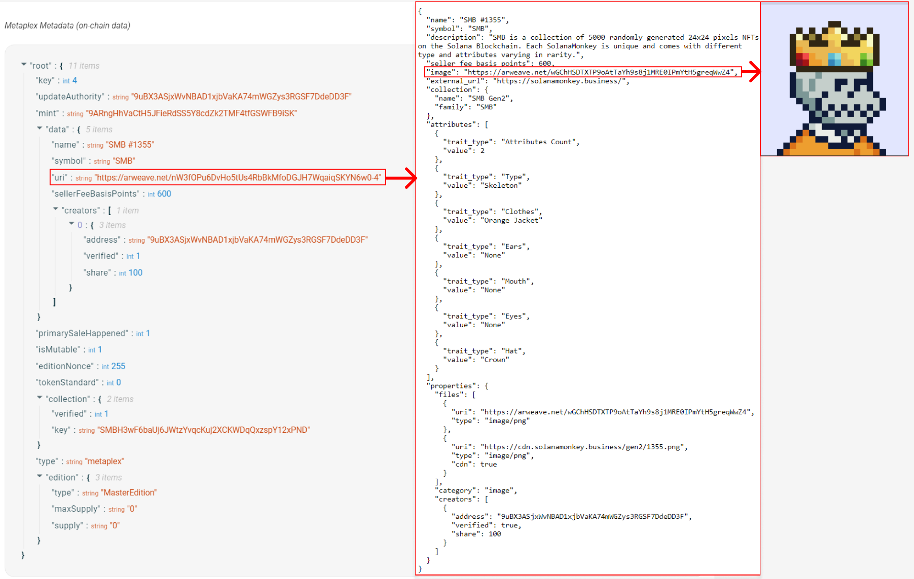

# TL;DR

-   **Tokens no fungibles (NFT)** se representan en Solana como tokens SPL con una cuenta de metadatos asociada, 0 decimales y un suministro máximo de 1
-   **Metaplex** ofrece una colección de herramientas que simplifican la creación y distribución de NFT en la cadena de bloques de Solana
-   El **Metadatos del token** programa estandariza el proceso de adjuntar metadatos a los tokens SPL
-   **Metaplex SDK** Es una herramienta que ofrece APIs fáciles de usar para ayudar a los desarrolladores a utilizar las herramientas en cadena proporcionadas por Metaplex.
-   El **Candy Machine** programa es una herramienta de distribución de NFT utilizada para crear y acuñar NFT a partir de una colección
-   **Sugar CLI** es una herramienta que simplifica el proceso de carga de archivos de medios/metadatos y la creación de una máquina de dulces para una colección

# Descripción general

Los tokens no fungibles (NFT) de Solana son tokens SPL creados mediante el programa Token. Estos tokens, sin embargo, también tienen una cuenta de metadatos adicional asociada con cada token Mint. Esto permite una amplia variedad de casos de uso para tokens. Puede tokenizar efectivamente cualquier cosa, desde el inventario del juego hasta el arte.

En esta lección, cubriremos los conceptos básicos de cómo se representan los NFT en Solana, cómo crearlos y actualizarlos utilizando el SDK Metaplex, y proporcionaremos una breve introducción a las herramientas que pueden ayudarlo a crear y distribuir NFT en Solana a escala.

## NFT en Solana

Un NFT de Solana es un token no divisible con metadatos asociados. Además, la menta del token tiene un suministro máximo de 1.

En otras palabras, un NFT es un token estándar del Programa de Tokens, pero difiere de lo que podría pensar como "tokens estándar" en que:

1. Tiene 0 decimales para que no se pueda dividir en partes
2. Proviene de un token Mint con suministro de 1 para que solo exista 1 de estos tokens
3. Proviene de un token Mint cuya autoridad está establecida en `null` (para garantizar que el suministro nunca cambie)
4. Tiene una cuenta asociada que almacena metadatos

Si bien los primeros tres puntos son características que se pueden lograr con el Programa de tokens SPL, los metadatos asociados requieren alguna funcionalidad adicional.

Típicamente, los metadatos de un NFT tienen tanto un componente dentro como fuera de la cadena. Los metadatos en cadena se almacenan en una cuenta asociada con el token Mint. Uno de sus campos es URI que normalmente apunta a un archivo JSON fuera de la cadena (ver [this link](https://lsc6xffbdvalb5dvymf5gwjpeou7rr2btkoltutn5ij5irlpg3wa.arweave.net/XIXrlKEdQLD0dcML01kvI6n4x0GanLnSbeoT1EVvNuw) como ejemplo). El componente fuera de la cadena almacena datos adicionales y un enlace a la imagen. Los sistemas de almacenamiento de datos permanentes como Arweave se utilizan a menudo para almacenar el componente fuera de la cadena de los metadatos NFT.

A continuación se muestra un ejemplo de la relación entre los metadatos dentro y fuera de la cadena. Los metadatos en cadena contienen un campo URI que apunta a un `.json` archivo fuera de cadena que almacena el enlace a la imagen del NFT y metadatos adicionales.



## **Metaplex**

[Metaplex](https://www.metaplex.com/) es una organización que proporciona un conjunto de herramientas, como la[Metaplex SDK](https://docs.metaplex.com/sdks/js/), que simplifican la creación y distribución de NFT en la cadena de bloques de Solana. Estas herramientas se adaptan a una amplia gama de casos de uso y le permiten administrar fácilmente todo el proceso de NFT para crear y acuñar una colección de NFT.

Más específicamente, el SDK de Metaplex está diseñado para ayudar a los desarrolladores a utilizar las herramientas en cadena que ofrece Metaplex. Ofrece una API fácil de usar que se centra en casos de uso populares y permite una fácil integración con complementos de terceros. Para obtener más información sobre las capacidades del SDK de Metaplex, puede consultar el[README](https://github.com/metaplex-foundation/js#readme).

Uno de los programas esenciales ofrecidos por Metaplex es el programa Token Metadata. El programa Token Metadata estandariza el proceso de adjuntar metadatos a los tokens SPL. Al crear un NFT con Metaplex, el programa Token Metadata crea una cuenta de metadatos utilizando una dirección derivada del programa (PDA) con el token Mint como semilla. Esto permite que la cuenta de metadatos para cualquier NFT se localice de manera determinista utilizando la dirección del token Mint. Para obtener más información sobre el programa Token Metadata, puede consultar el Metaplex[documentación](https://docs.metaplex.com/programs/token-metadata/).

En las siguientes secciones, cubriremos los conceptos básicos del uso del SDK Metaplex para preparar activos, crear NFT, actualizar NFT y asociar un NFT con una colección más amplia.

### Instancia Metaplex

Una `Metaplex` instancia sirve como punto de entrada para acceder a las API de Metaplex SDK. Esta instancia acepta una conexión utilizada para comunicarse con el clúster. Además, los desarrolladores pueden personalizar las interacciones del SDK especificando un "Controlador de identidad" y un "Controlador de almacenamiento".

El controlador de identidad es efectivamente un par de claves que se puede utilizar para firmar transacciones, un requisito al crear un NFT. El controlador de almacenamiento se utiliza para especificar el servicio de almacenamiento que desea utilizar para cargar activos. El `bundlrStorage` controlador es la opción predeterminada y carga los activos en Arweave, un servicio de almacenamiento permanente y descentralizado.

A continuación se muestra un ejemplo de cómo puede configurar la `Metaplex` instancia para devnet.

```tsx
import {
    Metaplex,
    keypairIdentity,
    bundlrStorage,
} from "@metaplex-foundation/js";
import { Connection, clusterApiUrl, Keypair } from "@solana/web3.js";

const connection = new Connection(clusterApiUrl("devnet"));
const wallet = Keypair.generate();

const metaplex = Metaplex.make(connection)
    .use(keypairIdentity(wallet))
    .use(
        bundlrStorage({
            address: "https://devnet.bundlr.network",
            providerUrl: "https://api.devnet.solana.com",
            timeout: 60000,
        }),
    );
```

### Subir activos

Antes de que pueda crear un NFT, debe preparar y cargar cualquier activo que planee asociar con el NFT. Si bien esto no tiene que ser una imagen, la mayoría de los NFT tienen una imagen asociada con ellos.

Preparar y cargar una imagen implica convertir la imagen en un búfer, convertirla al formato Metaplex utilizando la `toMetaplexFile` función, y finalmente cargarla en el controlador de almacenamiento designado.

El SDK Metaplex admite la creación de un nuevo archivo Metaplex a partir de archivos presentes en su equipo local o los cargados por un usuario a través de un navegador. Puede hacer lo primero usando `fs.readFileSync` para leer el archivo de imagen, luego conviértalo en un archivo Metaplex usando `toMetaplexFile`. Finalmente, use su `Metaplex` instancia para llamar `storage().upload(file)` para cargar el archivo. El valor de retorno de la función será el URI donde se almacenó la imagen.

```tsx
const buffer = fs.readFileSync("/path/to/image.png");
const file = toMetaplexFile(buffer, "image.png");

const imageUri = await metaplex.storage().upload(file);
```

### Subir metadatos

Después de cargar una imagen, es hora de cargar los metadatos JSON fuera de la cadena utilizando la `nfts().uploadMetadata` función. Esto devolverá un URI donde se almacenan los metadatos JSON.

Recuerde, la parte fuera de la cadena de los metadatos incluye cosas como el URI de la imagen, así como información adicional como el nombre y la descripción del NFT. Si bien técnicamente puede incluir cualquier cosa que desee en este objeto JSON, en la mayoría de los casos debe seguir el [Norma NFT](https://docs.metaplex.com/programs/token-metadata/token-standard#the-non-fungible-standard) para garantizar la compatibilidad con billeteras, programas y aplicaciones.

Para crear los metadatos, utilice el `uploadMetadata` método proporcionado por el SDK. Este método acepta un objeto de metadatos y devuelve un URI que apunta a los metadatos cargados.

```tsx
const { uri } = await metaplex.nfts().uploadMetadata({
    name: "My NFT",
    description: "My description",
    image: imageUri,
});
```

### Crear NFT

Después de cargar los metadatos del NFT, finalmente puede crear el NFT en la red. El `create` método Metaplex SDK le permite crear un nuevo NFT con una configuración mínima. Este método se encargará de la creación de la cuenta Mint, la cuenta de token, la cuenta de metadatos y la cuenta de edición maestra para usted. Los datos proporcionados a este método representarán la porción en cadena de los metadatos de NFT. Puede explorar el SDK para ver todas las demás entradas que se pueden proporcionar opcionalmente a este método.

```tsx
const { nft } = await metaplex.nfts().create(
    {
        uri: uri,
        name: "My NFT",
        sellerFeeBasisPoints: 0,
    },
    { commitment: "finalized" },
);
```

Este método devuelve un objeto que contiene información sobre el NFT recién creado. De forma predeterminada, el SDK establece la `isMutable` propiedad en true, lo que permite realizar actualizaciones en los metadatos del NFT. Sin embargo, puede elegir establecer en false, `isMutable` lo que hace que los metadatos del NFT sean inmutables.

### Actualizar NFT

Si te has ido `isMutable` como verdadero, es posible que tengas una razón para actualizar los metadatos de tu NFT. El `update` método del SDK le permite actualizar las partes dentro y fuera de la cadena de los metadatos del NFT. Para actualizar los metadatos fuera de la cadena, deberá repetir los pasos de cargar una nueva imagen y URI de metadatos como se describe en los pasos anteriores, luego proporcione el nuevo URI de metadatos a este método. Esto cambiará el URI al que apuntan los metadatos en cadena, actualizando efectivamente los metadatos fuera de cadena también.

```tsx
const nft = await metaplex.nfts().findByMint({ mintAddress });

const { response } = await metaplex.nfts().update(
    {
        nftOrSft: nft,
        name: "Updated Name",
        uri: uri,
        sellerFeeBasisPoints: 100,
    },
    { commitment: "finalized" },
);
```

Tenga en cuenta que cualquier campo que no incluya en la llamada `update` permanecerá igual, por diseño.

### Añadir NFT a la colección

A [Colección certificada](https://docs.metaplex.com/programs/token-metadata/certified-collections#introduction) es un NFT al que pueden pertenecer los NFT individuales. Piense en una gran colección de NFT como Solana Monkey Business. Si nos fijamos en un NFT individual, [Metadata](https://explorer.solana.com/address/C18YQWbfwjpCMeCm2MPGTgfcxGeEDPvNaGpVjwYv33q1/metadata) verá un `collection` campo con un punto `key` que está en el `Certified Collection` [NFT](https://explorer.solana.com/address/SMBH3wF6baUj6JWtzYvqcKuj2XCKWDqQxzspY12xPND/). En pocas palabras, los NFT que forman parte de una colección están asociados con otro NFT que representa la colección en sí.

Para agregar un NFT a una colección, primero se debe crear el NFT de colección. El proceso es el mismo que antes, excepto que incluirá un campo adicional en nuestros metadatos NFT: Este campo `isCollection` le dice al programa token que este NFT es un NFT de colección.

```tsx
const { collectionNft } = await metaplex.nfts().create(
    {
        uri: uri,
        name: "My NFT Collection",
        sellerFeeBasisPoints: 0,
        isCollection: true,
    },
    { commitment: "finalized" },
);
```

A continuación, enumere la dirección de menta de la colección como referencia para el `collection` campo en nuestro nuevo Nft.

```tsx
const { nft } = await metaplex.nfts().create(
    {
        uri: uri,
        name: "My NFT",
        sellerFeeBasisPoints: 0,
        collection: collectionNft.mintAddress,
    },
    { commitment: "finalized" },
);
```

Cuando compruebe los metadatos en su NFT recién creado, ahora debería ver un `collection` campo como este:

```JSON
"collection":{
    "verified": false,
    "key": "SMBH3wF6baUj6JWtzYvqcKuj2XCKWDqQxzspY12xPND"
}
```

Lo último que debe hacer es verificar el NFT. Esto efectivamente solo convierte el `verified` campo anterior en verdadero, pero es increíblemente importante. Esto es lo que permite que los programas y aplicaciones de consumo sepan que su NFT es, de hecho, parte de la colección. Puedes hacer esto usando la `verifyCollection` función:

```tsx
await metaplex.nfts().verifyCollection({
    mintAddress: nft.address,
    collectionMintAddress: collectionNft.address,
    isSizedCollection: true,
});
```

### Candy Machine

Al crear y distribuir un suministro masivo de NFT, Metaplex lo hace fácil con su [Candy Machine](https://docs.metaplex.com/programs/candy-machine/overview) programa y software[Sugar CLI](https://docs.metaplex.com/developer-tools/sugar/).

Candy Machine es efectivamente un programa de acuñación y distribución para ayudar a lanzar colecciones NFT. Sugar es una interfaz de línea de comandos que le ayuda a crear una máquina de dulces, preparar activos y crear NFT a escala. Los pasos cubiertos anteriormente para crear un NFT serían increíblemente tediosos de ejecutar para miles de NFT de una sola vez. Candy Machine y Sugar resuelven esto y ayudan a garantizar un lanzamiento justo al ofrecer una serie de salvaguardas.

No cubriremos estas herramientas en profundidad, pero definitivamente veremos cómo funcionan juntas[here](https://docs.metaplex.com/developer-tools/sugar/overview/introduction).

Para explorar toda la gama de herramientas que ofrece Metaplex, puedes verlas [Repositorio de Metaplex](https://github.com/metaplex-foundation/metaplex) en GitHub.

# Demostración

En esta demostración, repasaremos los pasos para crear un NFT utilizando el SDK Metaplex, actualizaremos los metadatos del NFT después del hecho y luego asociaremos el NFT con una colección. Al final, tendrá una comprensión básica de cómo usar el SDK Metaplex para interactuar con NFT en Solana.

### 1. Arranque

Para comenzar, descargue el código de inicio de la `starter` rama de[este repositorio](https://github.com/Unboxed-Software/solana-metaplex/tree/starter).

El proyecto contiene dos imágenes en el `src` directorio que utilizaremos para los NFT.

Además, en el `index.ts` archivo, encontrará el siguiente fragmento de código que incluye datos de muestra para el NFT que crearemos y actualizaremos.

```tsx
interface NftData {
    name: string;
    symbol: string;
    description: string;
    sellerFeeBasisPoints: number;
    imageFile: string;
}

interface CollectionNftData {
    name: string;
    symbol: string;
    description: string;
    sellerFeeBasisPoints: number;
    imageFile: string;
    isCollection: boolean;
    collectionAuthority: Signer;
}

// example data for a new NFT
const nftData = {
    name: "Name",
    symbol: "SYMBOL",
    description: "Description",
    sellerFeeBasisPoints: 0,
    imageFile: "solana.png",
};

// example data for updating an existing NFT
const updateNftData = {
    name: "Update",
    symbol: "UPDATE",
    description: "Update Description",
    sellerFeeBasisPoints: 100,
    imageFile: "success.png",
};

async function main() {
    // create a new connection to the cluster's API
    const connection = new Connection(clusterApiUrl("devnet"));

    // initialize a keypair for the user
    const user = await initializeKeypair(connection);

    console.log("PublicKey:", user.publicKey.toBase58());
}
```

Para instalar las dependencias necesarias, ejecute `npm install` en la línea de comandos.

A continuación, ejecute el código ejecutando `npm start`. Esto creará un nuevo par de claves, lo escribirá en el `.env` archivo y enviará airdrop devnet SOL al par de claves.

```
Current balance is 0
Airdropping 1 SOL...
New balance is 1
PublicKey: GdLEz23xEonLtbmXdoWGStMst6C9o3kBhb7nf7A1Fp6F
Finished successfully
```

### 2. Configurar Metaplex

Antes de empezar a crear y actualizar NFTs, necesitamos configurar la instancia Metaplex. Actualice la `main()` función con lo siguiente:

```tsx
async function main() {
    // create a new connection to the cluster's API
    const connection = new Connection(clusterApiUrl("devnet"));

    // initialize a keypair for the user
    const user = await initializeKeypair(connection);

    console.log("PublicKey:", user.publicKey.toBase58());

    // metaplex set up
    const metaplex = Metaplex.make(connection)
        .use(keypairIdentity(user))
        .use(
            bundlrStorage({
                address: "https://devnet.bundlr.network",
                providerUrl: "https://api.devnet.solana.com",
                timeout: 60000,
            }),
        );
}
```

### 3. función `uploadMetadata` auxiliar

A continuación, cree una función de ayuda para manejar el proceso de cargar una imagen y metadatos, y devolver los metadatos URI. Esta función tomará la instancia Metaplex y los datos NFT como entrada, y devolverá los metadatos URI como salida.

```tsx
// helper function to upload image and metadata
async function uploadMetadata(
    metaplex: Metaplex,
    nftData: NftData,
): Promise<string> {
    // file to buffer
    const buffer = fs.readFileSync("src/" + nftData.imageFile);

    // buffer to metaplex file
    const file = toMetaplexFile(buffer, nftData.imageFile);

    // upload image and get image uri
    const imageUri = await metaplex.storage().upload(file);
    console.log("image uri:", imageUri);

    // upload metadata and get metadata uri (off chain metadata)
    const { uri } = await metaplex.nfts().uploadMetadata({
        name: nftData.name,
        symbol: nftData.symbol,
        description: nftData.description,
        image: imageUri,
    });

    console.log("metadata uri:", uri);
    return uri;
}
```

Esta función leerá un archivo de imagen, lo convertirá en un búfer y luego lo cargará para obtener una imagen URI. A continuación, cargará los metadatos NFT, que incluyen el nombre, el símbolo, la descripción y la imagen URI, y obtendrá un URI de metadatos. Este URI son los metadatos fuera de la cadena. Esta función también registrará la imagen URI y los metadatos URI como referencia.

### 5. función `createNft` auxiliar

A continuación, vamos a crear una función de ayuda para manejar la creación del NFT. Esta función toma como entradas la instancia Metaplex, los metadatos URI y los datos NFT. Utiliza el `create` método del SDK para crear el NFT, pasando los metadatos URI, nombre, tarifa de vendedor y símbolo como parámetros.

```tsx
// helper function create NFT
async function createNft(
    metaplex: Metaplex,
    uri: string,
    nftData: NftData,
): Promise<NftWithToken> {
    const { nft } = await metaplex.nfts().create(
        {
            uri: uri, // metadata URI
            name: nftData.name,
            sellerFeeBasisPoints: nftData.sellerFeeBasisPoints,
            symbol: nftData.symbol,
        },
        { commitment: "finalized" },
    );

    console.log(
        `Token Mint: https://explorer.solana.com/address/${nft.address.toString()}?cluster=devnet`,
    );

    return nft;
}
```

La función `createNft` registra la URL del token Mint y devuelve un `nft` objeto que contiene información sobre el NFT recién creado. El NFT se acuñará en la clave pública correspondiente a la `user` utilizada como controlador de identidad al configurar la instancia de Metaplex.

### 6. Crear NFT

Ahora que hemos configurado la instancia Metaplex y creado funciones auxiliares para cargar metadatos y crear NFT, podemos probar estas funciones creando un NFT. En la `main()` función, llame a la `uploadMetadata` función para cargar los datos NFT y obtener el URI para los metadatos. A continuación, utilice la `createNft` función y los metadatos URI para crear un NFT.

```tsx
async function main() {
	...

  // upload the NFT data and get the URI for the metadata
  const uri = await uploadMetadata(metaplex, nftData)

  // create an NFT using the helper function and the URI from the metadata
  const nft = await createNft(metaplex, uri, nftData)
}
```

Ejecute `npm start` en la línea de comandos para ejecutar la `main` función. Debería ver un resultado similar al siguiente:

```tsx
Current balance is 1.770520342
PublicKey: GdLEz23xEonLtbmXdoWGStMst6C9o3kBhb7nf7A1Fp6F
image uri: https://arweave.net/j5HcSX8qttSgJ_ZDLmbuKA7VGUo7ZLX-xODFU4LFYew
metadata uri: https://arweave.net/ac5fwNfRckuVMXiQW_EAHc-xKFCv_9zXJ-1caY08GFE
Token Mint: https://explorer.solana.com/address/QdK4oCUZ1zMroCd4vqndnTH7aPAsr8ApFkVeGYbvsFj?cluster=devnet
Finished successfully
```

Siéntase libre de inspeccionar los URI generados para la imagen y los metadatos, así como ver el NFT en el explorador Solana visitando la URL proporcionada en la salida.

### 7. función `updateNftUri` auxiliar

A continuación, vamos a crear una función de ayuda para manejar la actualización de un URI de NFT existente. Esta función tomará la instancia Metaplex, los metadatos URI y la dirección Mint del NFT. Utiliza el `findByMint` método del SDK para obtener los datos NFT existentes utilizando la dirección Mint, y luego utiliza el `update` método para actualizar los metadatos con el nuevo URI. Finalmente, registrará la URL del token Mint y la firma de la transacción como referencia.

```tsx
// helper function update NFT
async function updateNftUri(
    metaplex: Metaplex,
    uri: string,
    mintAddress: PublicKey,
) {
    // fetch NFT data using mint address
    const nft = await metaplex.nfts().findByMint({ mintAddress });

    // update the NFT metadata
    const { response } = await metaplex.nfts().update(
        {
            nftOrSft: nft,
            uri: uri,
        },
        { commitment: "finalized" },
    );

    console.log(
        `Token Mint: https://explorer.solana.com/address/${nft.address.toString()}?cluster=devnet`,
    );

    console.log(
        `Transaction: https://explorer.solana.com/tx/${response.signature}?cluster=devnet`,
    );
}
```

### 8. Actualizar NFT

Para actualizar un NFT existente, primero necesitamos cargar nuevos metadatos para el NFT y obtener el nuevo URI. En la `main()` función, vuelva a llamar a la `uploadMetadata` función para cargar los datos NFT actualizados y obtener el nuevo URI para los metadatos. Luego, podemos usar la función `updateNftUri` ayudante, pasando en la instancia Metaplex, el nuevo URI de los metadatos y la dirección Mint del NFT. El `nft.address` es de la salida de la `createNft` función.

```tsx
async function main() {
	...

  // upload updated NFT data and get the new URI for the metadata
  const updatedUri = await uploadMetadata(metaplex, updateNftData)

  // update the NFT using the helper function and the new URI from the metadata
  await updateNftUri(metaplex, updatedUri, nft.address)
}
```

Ejecute `npm start` en la línea de comandos para ejecutar la `main` función. Debería ver resultados adicionales similares a los siguientes:

```tsx
...
Token Mint: https://explorer.solana.com/address/6R9egtNxbzHr5ksnGqGNHXzKuKSgeXAbcrdRUsR1fkRM?cluster=devnet
Transaction: https://explorer.solana.com/tx/5VkG47iGmECrqD11zbF7psaVqFkA4tz3iZar21cWWbeySd66fTkKg7ni7jiFkLqmeiBM6GzhL1LvNbLh4Jh6ozpU?cluster=devnet
Finished successfully
```

También puede ver los NFT en la billetera Phantom importando el `PRIVATE_KEY` desde el archivo.env.

### 9. Crear una colección de NFT

¡Impresionante, ahora sabes cómo crear un solo NFT y actualizarlo en la cadena de bloques de Solana! Pero, ¿cómo añadirlo a una colección?

Primero, vamos a crear una función de ayuda llamada `createCollectionNft`. Tenga en cuenta que es muy similar a `createNft`, pero garantiza que `isCollection` se establezca en true y que los datos coincidan con los requisitos para una colección.

```tsx
async function createCollectionNft(
    metaplex: Metaplex,
    uri: string,
    data: CollectionNftData,
): Promise<NftWithToken> {
    const { nft } = await metaplex.nfts().create(
        {
            uri: uri,
            name: data.name,
            sellerFeeBasisPoints: data.sellerFeeBasisPoints,
            symbol: data.symbol,
            isCollection: true,
        },
        { commitment: "finalized" },
    );

    console.log(
        `Collection Mint: https://explorer.solana.com/address/${nft.address.toString()}?cluster=devnet`,
    );

    return nft;
}
```

A continuación, necesitamos crear los datos fuera de la cadena para la recopilación. En `main` _antes_ las llamadas existentes a `createNft`, añada lo siguiente `collectionNftData` :

```tsx
const collectionNftData = {
    name: "TestCollectionNFT",
    symbol: "TEST",
    description: "Test Description Collection",
    sellerFeeBasisPoints: 100,
    imageFile: "success.png",
    isCollection: true,
    collectionAuthority: user,
};
```

Ahora, vamos a llamar `uploadMetadata` con el `collectionNftData` y luego llame `createCollectionNft`. Una vez más, haga esto _antes_ el código que crea un NFT.

```tsx
async function main() {
    ...

    // upload data for the collection NFT and get the URI for the metadata
    const collectionUri = await uploadMetadata(metaplex, collectionNftData)

    // create a collection NFT using the helper function and the URI from the metadata
    const collectionNft = await createCollectionNft(
        metaplex,
        collectionUri,
        collectionNftData
    )
}
```

Esto devolverá la dirección Mint de nuestra colección para que podamos usarla para asignar NFT a la colección.

### 10. Asignar un NFT a una colección

Ahora que tenemos una colección, cambiemos nuestro código existente para que los NFT recién creados se añadan a la colección. En primer lugar, vamos a modificar nuestra `createNft` función para que la llamada a `nfts().create` incluya el `collection` campo. Luego, agregue el código que llama `verifyCollection` para que el `verified` campo en los metadatos en cadena se establezca en verdadero. Así es como los programas y aplicaciones de consumo pueden saber con certeza que el NFT de hecho pertenece a la colección.

```tsx
async function createNft(
    metaplex: Metaplex,
    uri: string,
    nftData: NftData,
): Promise<NftWithToken> {
    const { nft } = await metaplex.nfts().create(
        {
            uri: uri, // metadata URI
            name: nftData.name,
            sellerFeeBasisPoints: nftData.sellerFeeBasisPoints,
            symbol: nftData.symbol,
        },
        { commitment: "finalized" },
    );

    console.log(
        `Token Mint: https://explorer.solana.com/address/${nft.address.toString()}? cluster=devnet`,
    );

    //this is what verifies our collection as a Certified Collection
    await metaplex.nfts().verifyCollection({
        mintAddress: nft.mint.address,
        collectionMintAddress: collectionMint,
        isSizedCollection: true,
    });

    return nft;
}
```

¡Ahora, corre `npm start` y voila! Si sigue el nuevo enlace nft y mira la pestaña Metadatos, verá un `collection` campo con la dirección Mint de su colección en la lista.

¡Felicidades! Has aprendido con éxito a usar el SDK de Metaplex para crear, actualizar y verificar NFT como parte de una colección. Eso es todo lo que necesita para construir su propia colección para casi cualquier caso de uso. Puede crear un competidor de TicketMaster, renovar el Programa de membresía de Costco o incluso digitalizar el sistema de identificación de estudiantes de su escuela. ¡Las posibilidades son infinitas!

Si desea echar un vistazo al código de solución final, puede encontrarlo en la rama de solución del mismo[repository](https://github.com/Unboxed-Software/solana-metaplex/tree/solution).

# Desafío

Para profundizar su comprensión de las herramientas de Metaplex, profundice en la documentación de Metaplex y familiarícese con los diversos programas y herramientas que ofrece Metaplex. Por ejemplo, puede profundizar en el aprendizaje sobre el programa Candy Machine para comprender su funcionalidad.

Una vez que comprenda cómo funciona el programa Candy Machine, ponga a prueba sus conocimientos utilizando Sugar CLI para crear una Candy Machine para su propia colección. Esta experiencia práctica no solo reforzará su comprensión de las herramientas, sino que también aumentará su confianza en su capacidad para usarlas de manera efectiva en el futuro.

¡Diviértete con esto! ¡Esta será su primera colección NFT creada de forma independiente! Con esto, completarás el Módulo 2. ¡Espero que estés sintiendo el proceso! ¡Siéntase libre de compartir algunos comentarios rápidos para que [here](https://airtable.com/shrOsyopqYlzvmXSC?prefill_Module=Module%202) podamos continuar mejorando el curso!
