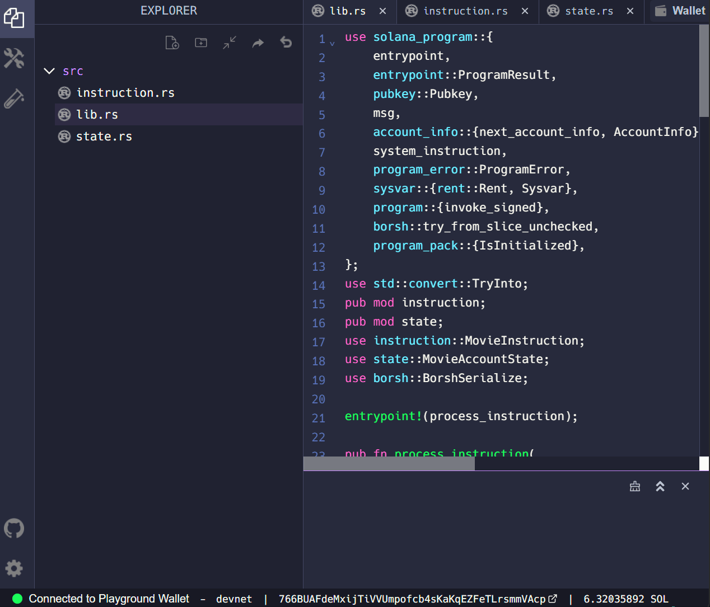

# TL;DR

-   El estado del programa se almacena en otras cuentas en lugar de en el propio programa.
-   Una dirección derivada de programa (PDA) se deriva de un ID de programa y una lista opcional de semillas. Una vez obtenidos, los PDA se utilizan posteriormente como la dirección para una cuenta de almacenamiento.
-   Crear una cuenta requiere que calculemos el espacio requerido y el alquiler correspondiente para asignar a la nueva cuenta
-   Crear una nueva cuenta requiere una Invocación de Programa Cruzado (CPI) a la `create_account` instrucción en el Programa del Sistema
-   La actualización del campo de datos en una cuenta requiere que serialicemos (convertir a matriz de bytes) los datos en la cuenta

# Descripción general

Solana mantiene la velocidad, la eficiencia y la extensibilidad en parte al hacer que los programas sean apátridas. En lugar de tener el estado almacenado en el propio programa, los programas utilizan el modelo de cuenta de Solana para leer el estado y escribir el estado en cuentas PDA separadas.

Si bien este es un modelo extremadamente flexible, también es un paradigma en el que puede ser difícil trabajar si no es familiar. ¡Pero no te preocupes! Comenzaremos de manera simple en esta lección y trabajaremos en programas más complejos en el siguiente módulo.

En esta lección aprenderemos los conceptos básicos de la administración del estado para un programa de Solana, incluida la representación del estado como un tipo de óxido, la creación de cuentas utilizando direcciones derivadas del programa y la serialización de los datos de la cuenta.

## Estado del programa

Todas las cuentas de Solana tienen un `data` campo que contiene una matriz de bytes. Esto hace que las cuentas sean tan flexibles como los archivos en un ordenador. Puede almacenar literalmente cualquier cosa en una cuenta (siempre y cuando la cuenta tenga el espacio de almacenamiento para ello).

Así como los archivos en un sistema de archivos tradicional se ajustan a formatos de datos específicos como PDF o MP3, los datos almacenados en una cuenta de Solana deben seguir algún tipo de patrón para que los datos puedan recuperarse y deserializarse en algo utilizable.

### Representar el estado como un tipo de óxido

Al escribir un programa en Rust, normalmente creamos este "formato" definiendo un tipo de datos Rust. Si pasaste por el[primera parte de esta lección](basic-program-pt-1), esto es muy similar a lo que hicimos cuando creamos un enum para representar instrucciones discretas.

Si bien este tipo debe reflejar la estructura de sus datos, para la mayoría de los casos de uso es suficiente una estructura simple. Por ejemplo, un programa de toma de notas que almacena notas en cuentas separadas probablemente tendría datos para un título, cuerpo y tal vez una identificación de algún tipo. Podríamos crear una estructura para representar eso de la siguiente manera:

```rust
struct NoteState {
    title: String,
    body: String,
    id: u64
}
```

### Uso de Borsh para serialización y deserialización

Al igual que con los datos de instrucción, necesitamos un mecanismo para convertir de nuestro tipo de datos Rust a una matriz de bytes, y viceversa. **Serialización** es el proceso de convertir un objeto en una matriz de bytes. **Deserialización** es el proceso de reconstruir un objeto a partir de una matriz de bytes.

Continuaremos usando Borsh para serialización y deserialización. En Rust, podemos usar la `borsh` caja para acceder a los `BorshDeserialize` rasgos `BorshSerialize` y. A continuación, podemos aplicar esos rasgos utilizando la macro de `derive` atributos.

```rust
use borsh::{BorshSerialize, BorshDeserialize};

#[derive(BorshSerialize, BorshDeserialize)]
struct NoteState {
    title: String,
    body: String,
    id: u64
}
```

Estos rasgos proporcionarán métodos `NoteState` que podemos usar para serializar y deserializar los datos según sea necesario.

## Crear cuentas

Antes de que podamos actualizar el campo de datos de una cuenta, primero tenemos que crear esa cuenta.

Para crear una nueva cuenta dentro de nuestro programa debemos:

1. Calcular el espacio y el alquiler necesarios para la cuenta
2. Tener una dirección para asignar la nueva cuenta
3. Invocar el programa del sistema para crear la nueva cuenta

### Espacio y alquiler

Recordemos que el almacenamiento de datos en la red de Solana requiere que los usuarios asignen el alquiler en forma de lamports. La cantidad de alquiler requerida por una nueva cuenta depende de la cantidad de espacio que le gustaría asignar a esa cuenta. Eso significa que necesitamos saber antes de crear la cuenta cuánto espacio asignar.

Tenga en cuenta que el alquiler es más como un depósito. Todas las lámparas asignadas para el alquiler se pueden reembolsar en su totalidad cuando se cierra una cuenta. Además, ahora se requiere que todas las cuentas nuevas lo sean[exento de alquiler](https://twitter.com/jacobvcreech/status/1524790032938287105), lo que significa que las lámparas no se deducen de la cuenta con el tiempo. Una cuenta se considera exenta de alquiler si tiene al menos 2 años de alquiler. En otras palabras, las cuentas se almacenan en cadena permanentemente hasta que el propietario cierra la cuenta y retira el alquiler.

En nuestro ejemplo de aplicación para tomar notas, la `NoteState` estructura especifica tres campos que deben almacenarse en una cuenta: `title`, `body`, y `id`. Para calcular el tamaño que debe tener la cuenta, simplemente debe sumar el tamaño requerido para almacenar los datos en cada campo.

Para datos dinámicos, como cadenas, Borsh añade 4 bytes adicionales al principio para almacenar la longitud de ese campo en particular. Eso significa `body` que cada `title` uno tiene 4 bytes más sus respectivos tamaños. El `id` campo es un entero de 64 bits, u 8 bytes.

Puede sumar esas longitudes y luego calcular la renta requerida para esa cantidad de espacio utilizando la `minimum_balance` función del `rent` módulo de la `solana_program` caja.

```rust
// Calculate account size required for struct NoteState
let account_len: usize = (4 + title.len()) + (4 + body.len()) + 8;

// Calculate rent required
let rent = Rent::get()?;
let rent_lamports = rent.minimum_balance(account_len);
```

### Direcciones derivadas del programa (PDA)

Antes de crear una cuenta, también necesitamos tener una dirección para asignar la cuenta. Para las cuentas propiedad del programa, esta será una dirección derivada del programa (PDA) que se encuentra utilizando la `find_program_address` función.

Como su nombre lo indica, los PDA se derivan utilizando el ID del programa (dirección del programa que crea la cuenta) y una lista opcional de "semillas". Las semillas opcionales son entradas adicionales utilizadas en la `find_program_address` función para derivar el PDA. La función utilizada para derivar PDA devolverá la misma dirección cada vez que se le den las mismas entradas. Esto nos da la capacidad de crear cualquier número de cuentas PDA y una forma determinista de encontrar cada cuenta.

Además de las semillas que proporciona para derivar un PDA, la `find_program_address` función proporcionará una "semilla de protuberancia" adicional. Lo que hace que las PDA sean únicas de otras direcciones de cuenta de Solana es que no tienen una clave secreta correspondiente. Esto asegura que sólo el programa que posee la dirección puede firmar en nombre de la PDA. Cuando la `find_program_address` función intenta derivar un PDA usando las semillas proporcionadas, pasa en el número 255 como la "semilla de protuberancia". Si la dirección resultante no es válida (es decir, tiene una clave secreta correspondiente), entonces la función disminuye la semilla de bump en 1 y deriva un nuevo PDA con esa semilla de bump. Una vez que se encuentra un PDA válido, la función devuelve tanto el PDA como el bache que se utilizó para derivar el PDA.

Para nuestro programa de toma de notas, utilizaremos la clave pública del creador de notas y el ID como semillas opcionales para derivar el PDA. Derivar el PDA de esta manera nos permite encontrar de manera determinista la cuenta para cada nota.

```rust
let (note_pda_account, bump_seed) = Pubkey::find_program_address(&[note_creator.key.as_ref(), id.as_bytes().as_ref(),], program_id);
```

### Invocación cruzada del programa (CPI)

Una vez que hemos calculado el alquiler requerido para nuestra cuenta y hemos encontrado un PDA válido para asignar como la dirección de la nueva cuenta, finalmente estamos listos para crear la cuenta. Crear una nueva cuenta dentro de nuestro programa requiere una Invocación de Programa Cruzado (CPI). Un CPI es cuando un programa invoca una instrucción en otro programa. Para crear una nueva cuenta dentro de nuestro programa, vamos a invocar la `create_account` instrucción en el programa del sistema.

Los CPI se pueden hacer usando cualquiera `invoke` o `invoke_signed`.

```rust
pub fn invoke(
    instruction: &Instruction,
    account_infos: &[AccountInfo<'_>]
) -> ProgramResult
```

```rust
pub fn invoke_signed(
    instruction: &Instruction,
    account_infos: &[AccountInfo<'_>],
    signers_seeds: &[&[&[u8]]]
) -> ProgramResult
```

Para esta lección vamos a utilizar `invoke_signed`. A diferencia de una firma regular donde se usa una clave privada para firmar, `invoke_signed` usa las semillas opcionales, la semilla de bump y el ID de programa para derivar un PDA y firmar una instrucción. Esto se hace comparando el PDA derivado con todas las cuentas pasadas a la instrucción. Si alguna de las cuentas coincide con el PDA, entonces el campo de firmante para esa cuenta se establece en true.

Un programa puede firmar transacciones de forma segura de esta manera porque `invoke_signed` genera el PDA utilizado para firmar con el ID de programa del programa que invoca la instrucción. Por lo tanto, no es posible que un programa genere un PDA coincidente para firmar una cuenta con un PDA derivado usando otro ID de programa.

```rust
invoke_signed(
    // instruction
    &system_instruction::create_account(
        note_creator.key,
        note_pda_account.key,
        rent_lamports,
        account_len.try_into().unwrap(),
        program_id,
    ),
    // account_infos
    &[note_creator.clone(), note_pda_account.clone(), system_program.clone()],
    // signers_seeds
    &[&[note_creator.key.as_ref(), note_id.as_bytes().as_ref(), &[bump_seed]]],
)?;
```

## Serialización y deserialización de datos de cuentas

Una vez que hemos creado una nueva cuenta, necesitamos acceder y actualizar el campo de datos de la cuenta. Esto significa deserializar su matriz de bytes en una instancia del tipo que creamos, actualizar los campos en esa instancia y luego serializar esa instancia en una matriz de bytes.

### Deserializar los datos de la cuenta

El primer paso para actualizar los datos de una cuenta es deserializar su matriz de `data` bytes en su tipo Rust. Puede hacerlo tomando prestado primero el campo de datos de la cuenta. Esto le permite acceder a los datos sin tomar posesión.

A continuación, puede utilizar la `try_from_slice_unchecked` función para deserializar el campo de datos de la cuenta prestada utilizando el formato del tipo que creó para representar los datos. Esto le da una instancia de su tipo de óxido para que pueda actualizar fácilmente los campos utilizando la notación de puntos. Si tuviéramos que hacer esto con el ejemplo de la aplicación para tomar notas que hemos estado usando, se vería así:

```rust
let mut account_data = try_from_slice_unchecked::<NoteState>(note_pda_account.data.borrow()).unwrap();

account_data.title = title;
account_data.body = rating;
account_data.id = id;
```

### Serializar los datos de la cuenta

Una vez que la instancia de Rust que representa los datos de la cuenta se ha actualizado con los valores apropiados, puede "guardar" los datos en la cuenta.

Esto se hace con la `serialize` función en la instancia del tipo de óxido que creó. Tendrá que pasar una referencia mutable a los datos de la cuenta. La sintaxis aquí es complicada, así que no te preocupes si no la entiendes completamente. Los préstamos y las referencias son dos de los conceptos más difíciles en Rust.

```rust
account_data.serialize(&mut &mut note_pda_account.data.borrow_mut()[..])?;
```

El ejemplo anterior convierte el `account_data` objeto en una matriz de bytes y lo establece en la `data` propiedad on `note_pda_account`. Esto guarda efectivamente la `account_data` variable actualizada en el campo de datos de la nueva cuenta. Ahora, cuando un usuario recupera `note_pda_account` y deserializa los datos, mostrará los datos actualizados que hemos serializado en la cuenta.

## Iteradores

Es posible que haya notado en los ejemplos anteriores que hicimos referencia `note_creator` y no mostramos de dónde vino eso.

Para obtener acceso a esta y otras cuentas, utilizamos un[Iterator](https://doc.rust-lang.org/std/iter/trait.Iterator.html). Un iterador es un rasgo de óxido utilizado para dar acceso secuencial a cada elemento en una colección de valores. Los iteradores se utilizan en los programas de Solana para iterar de forma segura sobre la lista de cuentas pasadas al punto de entrada del programa a través del `accounts` argumento.

### Rust iterator

El patrón iterador le permite realizar alguna tarea en una secuencia de elementos. El `iter()` método crea un objeto iterador que hace referencia a una colección. Un iterador es responsable de la lógica de iterar sobre cada elemento y determinar cuándo ha terminado la secuencia. En Rust, los iteradores son perezosos, lo que significa que no tienen efecto hasta que llama a los métodos que consumen el iterador para usarlo. Una vez que haya creado un iterador, debe llamar a la `next()` función en él para obtener el siguiente elemento.

```rust
let v1 = vec![1, 2, 3];

// create the iterator over the vec
let v1_iter = v1.iter();

// use the iterator to get the first item
let first_item = v1_iter.next();

// use the iterator to get the second item
let second_item = v1_iter.next();
```

### Iterador de cuentas Solana

Recuerde que `AccountInfo` para todas las cuentas requeridas por una instrucción se está pasando por un solo `accounts` argumento. Para analizar las cuentas y usarlas dentro de nuestras instrucciones, necesitaremos crear un iterador con una referencia mutable a la `accounts`.

En ese momento, en lugar de usar el iterador directamente, lo pasamos a la `next_account_info` función desde el `account_info` módulo proporcionado por la `solana_program` caja.

Por ejemplo, la instrucción para crear una nueva nota en un programa de toma de notas requeriría como mínimo las cuentas para el usuario que crea la nota, un PDA para almacenar la nota y `system_program` la inicialización de una nueva cuenta. Las tres cuentas se pasarían al punto de entrada del programa a través del `accounts` argumento. Un iterador de `accounts` se utiliza entonces para separar el `AccountInfo` asociado con cada cuenta para procesar la instrucción.

Tenga en cuenta que `&mut` significa una referencia mutable al `accounts` argumento. Puede leer más sobre las referencias en Rust [here](https://doc.rust-lang.org/book/ch04-02-references-and-borrowing.html) y la `mut` palabra clave[here](https://doc.rust-lang.org/std/keyword.mut.html).

```rust
// Get Account iterator
let account_info_iter = &mut accounts.iter();

// Get accounts
let note_creator = next_account_info(account_info_iter)?;
let note_pda_account = next_account_info(account_info_iter)?;
let system_program = next_account_info(account_info_iter)?;
```

# Demostración

Esta visión general cubrió muchos conceptos nuevos. Practiquemos juntos al continuar trabajando en el programa de revisión de películas de la última lección. No se preocupe si solo está saltando a esta lección sin haber hecho la lección anterior: debería ser posible seguir cualquier camino. Utilizaremos el [Parque infantil Solana](https://beta.solpg.io) para escribir, construir e implementar nuestro código.

Como actualización, estamos construyendo un programa de Solana que permite a los usuarios revisar películas. En la última lección, deserializamos los datos de instrucción transmitidos por el usuario, pero aún no hemos almacenado estos datos en una cuenta. Ahora actualicemos nuestro programa para crear nuevas cuentas para almacenar la reseña de la película del usuario.

### 1. Obtener el código de inicio

Si no completaste la demostración de la última lección o simplemente quieres asegurarte de que no te perdiste nada, puedes hacer referencia al código de inicio[here](https://beta.solpg.io/6295b25b0e6ab1eb92d947f7).

Nuestro programa actualmente incluye el `instruction.rs` archivo que usamos para deserializar el `instruction_data` pasado en el punto de entrada del programa. También hemos completado el `lib.rs` archivo hasta el punto en que podemos imprimir nuestros datos de instrucción deserializados en el registro del programa utilizando la `msg!` macro.

### 2. Crear estructura para representar los datos de la cuenta

Comencemos por crear un nuevo archivo llamado `state.rs`.

Este archivo:

1. Definir la estructura que utiliza nuestro programa para rellenar el campo de datos de una nueva cuenta
2. Añadir `BorshSerialize` y `BorshDeserialize` rasgos a esta estructura

En primer lugar, vamos a poner en alcance todo lo que necesitaremos de la `borsh` caja.

```rust
use borsh::{BorshSerialize, BorshDeserialize};
```

A continuación, vamos a crear nuestra `MovieAccountState` estructura. Esta estructura definirá los parámetros que cada nueva cuenta de revisión de películas almacenará en su campo de datos. Nuestra `MovieAccountState` estructura requerirá los siguientes parámetros:

-   `is_initialized` - muestra si la cuenta se ha inicializado o no
-   `rating` - Valoración del usuario de la película
-   `description` - Descripción del usuario de la película
-   `title` - título de la película que el usuario está revisando

```rust
#[derive(BorshSerialize, BorshDeserialize)]
pub struct MovieAccountState {
    pub is_initialized: bool,
    pub rating: u8,
    pub title: String,
    pub description: String
}
```

### 3. Actualizar `lib.rs`

A continuación, actualicemos nuestro `lib.rs` archivo. Primero, pondremos en alcance todo lo que necesitaremos para completar nuestro programa de Revisión de Películas. Puede leer más sobre los detalles de cada artículo que estamos utilizando desde la `solana_program` caja[here](https://docs.rs/solana-program/latest/solana_program/).

```rust
use solana_program::{
    entrypoint,
    entrypoint::ProgramResult,
    pubkey::Pubkey,
    msg,
    account_info::{next_account_info, AccountInfo},
    system_instruction,
    program_error::ProgramError,
    sysvar::{rent::Rent, Sysvar},
    program::{invoke_signed},
    borsh::try_from_slice_unchecked,
};
use std::convert::TryInto;
pub mod instruction;
pub mod state;
use instruction::MovieInstruction;
use state::MovieAccountState;
use borsh::BorshSerialize;
```

### 4. Iterar a través de `accounts`

A continuación, continuemos desarrollando nuestra `add_movie_review` función. Recuerde que una serie de cuentas se pasa a la `add_movie_review` función a través de un solo `accounts` argumento. Para procesar nuestra instrucción, necesitaremos iterar `accounts` y asignar la `AccountInfo` para cada cuenta a su propia variable.

```rust
// Get Account iterator
let account_info_iter = &mut accounts.iter();

// Get accounts
let initializer = next_account_info(account_info_iter)?;
let pda_account = next_account_info(account_info_iter)?;
let system_program = next_account_info(account_info_iter)?;
```

### 5. Derivar PDA

A continuación, dentro de nuestra `add_movie_review` función, vamos a derivar de forma independiente el PDA que esperamos que el usuario haya pasado. Tendremos que proporcionar la semilla de bump para la derivación más adelante, por lo que aunque `pda_account` debamos hacer referencia a la misma cuenta, todavía tenemos que llamar `find_program_address`.

Tenga en cuenta que derivamos el PDA para cada nueva cuenta utilizando la clave pública del inicializador y el título de la película como semillas opcionales. Configurar el PDA de esta manera restringe a cada usuario a solo una revisión para cualquier título de película. Sin embargo, todavía permite que el mismo usuario revise películas con diferentes títulos y que diferentes usuarios revisen películas con el mismo título.

```rust
// Derive PDA and check that it matches client
let (pda, bump_seed) = Pubkey::find_program_address(&[initializer.key.as_ref(), title.as_bytes().as_ref(),], program_id);
```

### 6. Calcula el espacio y el alquiler

A continuación, vamos a calcular el alquiler que nuestra nueva cuenta necesitará. Recordemos que el alquiler es la cantidad de lamports que un usuario debe asignar a una cuenta para almacenar datos en la red de Solana. Para calcular el alquiler, primero debemos calcular la cantidad de espacio que requiere nuestra nueva cuenta.

La `MovieAccountState` estructura tiene cuatro campos. Asignaremos 1 byte cada uno para `rating` y `is_initialized`. Para ambos `title` y `description` asignaremos un espacio igual a 4 bytes más la longitud de la cadena.

```rust
// Calculate account size required
let account_len: usize = 1 + 1 + (4 + title.len()) + (4 + description.len());

// Calculate rent required
let rent = Rent::get()?;
let rent_lamports = rent.minimum_balance(account_len);
```

### 7. Crear nueva cuenta

Una vez que hayamos calculado el alquiler y verificado el PDA, estamos listos para crear nuestra nueva cuenta. Para crear una nueva cuenta, debemos llamar a la `create_account` instrucción del programa del sistema. Hacemos esto con una Invocación de Programa Cruzado (CPI) usando la `invoke_signed` función. Usamos `invoke_signed` porque estamos creando la cuenta usando un PDA y necesitamos el programa de revisión de películas para "firmar" la instrucción.

```rust
// Create the account
invoke_signed(
    &system_instruction::create_account(
        initializer.key,
        pda_account.key,
        rent_lamports,
        account_len.try_into().unwrap(),
        program_id,
    ),
    &[initializer.clone(), pda_account.clone(), system_program.clone()],
    &[&[initializer.key.as_ref(), title.as_bytes().as_ref(), &[bump_seed]]],
)?;

msg!("PDA created: {}", pda);
```

### 8. Actualizar datos de la cuenta

Ahora que hemos creado una nueva cuenta, estamos listos para actualizar el campo de datos de la nueva cuenta utilizando el formato de la `MovieAccountState` estructura de nuestro `state.rs` archivo. Primero deserializamos los datos de la cuenta del `pda_account` uso `try_from_slice_unchecked`, luego establecemos los valores de cada campo.

```rust
msg!("unpacking state account");
let mut account_data = try_from_slice_unchecked::<MovieAccountState>(&pda_account.data.borrow()).unwrap();
msg!("borrowed account data");

account_data.title = title;
account_data.rating = rating;
account_data.description = description;
account_data.is_initialized = true;
```

Por último, serializamos el actualizado `account_data` en el campo de datos de nuestro `pda_account`.

```rust
msg!("serializing account");
account_data.serialize(&mut &mut pda_account.data.borrow_mut()[..])?;
msg!("state account serialized");
```

### 9. Construir e implementar

¡Estamos listos para construir e implementar nuestro programa!



Puede probar su programa enviando una transacción con los datos de instrucción correctos. Para eso, siéntase libre de usar [este script](https://github.com/Unboxed-Software/solana-movie-client) o [el frontend](https://github.com/Unboxed-Software/solana-movie-frontend) construimos en el[Deserializar la lección de datos de instrucción personalizada](deserialize-custom-data). En ambos casos, asegúrese de copiar y pegar el ID de programa para su programa en el área apropiada del código fuente para asegurarse de que está probando el programa correcto.

Si usa el frontend, simplemente reemplace los `Form.tsx` componentes `MOVIE_REVIEW_PROGRAM_ID` in the `MovieList.tsx` y por la dirección del programa que ha implementado. A continuación, ejecute el frontend, envíe una vista y actualice el navegador para ver la revisión.

Si necesita más tiempo con este proyecto para sentirse cómodo con estos conceptos, eche un vistazo a la [código de solución](https://beta.solpg.io/62b23597f6273245aca4f5b4) antes de continuar.

# Desafío

Ahora es tu turno de construir algo de forma independiente. Equipado con los conceptos introducidos en esta lección, ahora sabe todo lo que necesitará para recrear la totalidad del programa de Introducción al Estudiante del Módulo 1.

El programa Student Intro es un programa de Solana que permite a los estudiantes presentarse. El programa toma el nombre de un usuario y un mensaje corto como el `instruction_data` y crea una cuenta para almacenar los datos en la cadena.

Usando lo que has aprendido en esta lección, desarrolla este programa. Además de tomar un nombre de un mensaje corto como datos de instrucción, el programa debe:

1. Crear una cuenta separada para cada estudiante
2. Almacenar `is_initialized` como un booleano, `name` como una cadena y `msg` como una cadena en cada cuenta

Puede probar su programa construyendo el [frontend](https://github.com/Unboxed-Software/solana-student-intros-frontend) que creamos en el[Lección de datos de cuenta personalizada de página, pedido y filtro](./paging-ordering-filtering-data). Recuerde reemplazar el ID del programa en el código del frontend con el que ha implementado.

¡Intenta hacerlo de forma independiente si puedes! Pero si te quedas atascado, siéntete libre de hacer referencia a la[código de solución](https://beta.solpg.io/62b11ce4f6273245aca4f5b2).
