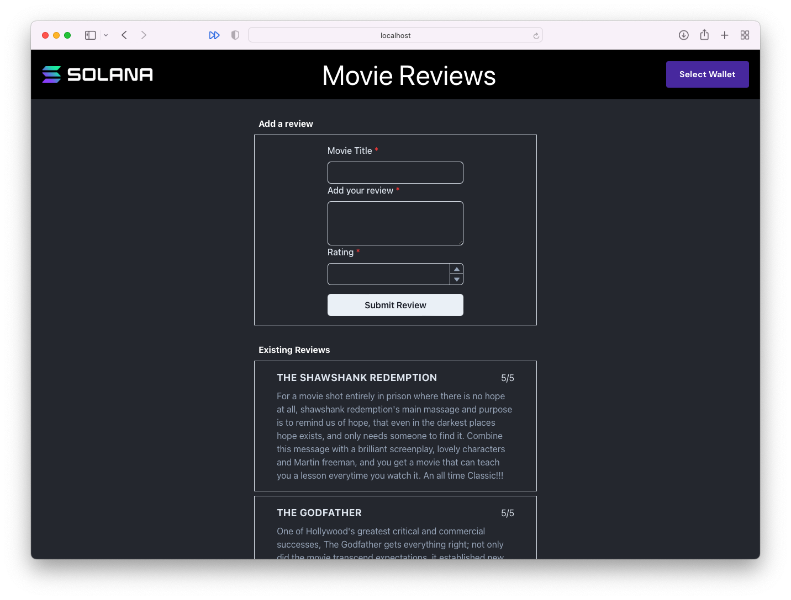
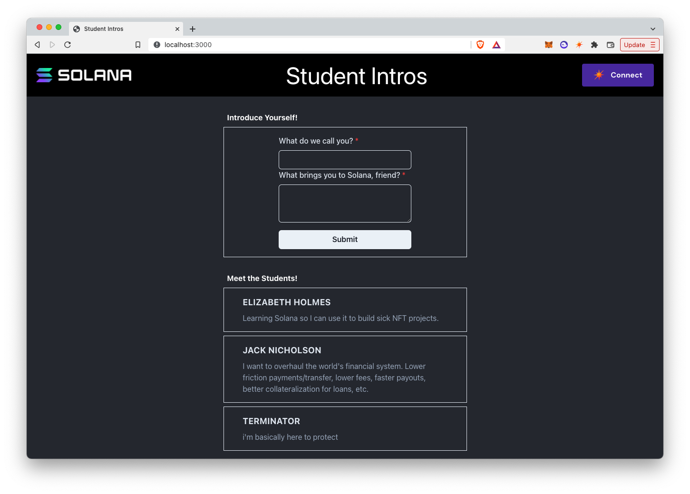

# TL;DR

-   Las transacciones se componen de una serie de instrucciones, una sola transacción puede tener cualquier número de instrucciones, cada una dirigida a su propio programa. Cuando se envía una transacción, el tiempo de ejecución de Solana procesará sus instrucciones en orden y de forma atómica, lo que significa que si alguna de las instrucciones falla por cualquier motivo, toda la transacción no se procesará.
-   Cada uno _instrucción_ se compone de 3 componentes: el ID del programa previsto, una matriz de todas las cuentas involucradas y un búfer de bytes de datos de instrucciones.
-   Cada uno _transacción_ contiene: una matriz de todas las cuentas de las que tiene la intención de leer o escribir, una o más instrucciones, un blockhash reciente y una o más firmas.
-   Con el fin de pasar los datos de instrucciones de un cliente, debe ser serializado en un búfer de bytes. Para facilitar este proceso de serialización, estaremos utilizando[Borsh](https://borsh.io/).
-   Las transacciones pueden no ser procesadas por la cadena de bloques por varias razones, discutiremos algunas de las más comunes aquí.

# Descripción general

## Transacciones

Las transacciones son la forma en que enviamos información a la cadena de bloques para que sea procesada. Hasta ahora, hemos aprendido cómo crear transacciones muy básicas con funcionalidad limitada. Pero las transacciones, y los programas a los que se envían, pueden diseñarse para ser mucho más flexibles y manejar mucha más complejidad de la que hemos tratado hasta ahora.

### Contenido de la transacción

Cada transacción contiene:

-   Una matriz que incluye todas las cuentas de las que tiene la intención de leer o escribir
-   Una o más instrucciones
-   Un blockhash reciente
-   Una o más firmas

`@solana/web3.js` simplifica este proceso para que todo lo que realmente necesita para centrarse en es la adición de instrucciones y firmas. La biblioteca construye la matriz de cuentas basadas en esa información y maneja la lógica para incluir un blockhash reciente.

## Instrucciones

Cada instrucción contiene:

-   El ID del programa (clave pública) del programa previsto
-   Una matriz que enumera cada cuenta que se leerá o escribirá durante la ejecución
-   Una memoria intermedia de bytes de datos de instrucción

La identificación del programa por su clave pública asegura que la instrucción se lleva a cabo por el programa correcto.

Incluir una matriz de cada cuenta que se leerá o escribirá permite a la red realizar una serie de optimizaciones que permiten una alta carga de transacciones y una ejecución más rápida.

El búfer de bytes le permite pasar datos externos a un programa.

Puede incluir varias instrucciones en una sola transacción. El tiempo de ejecución de Solana procesará estas instrucciones en orden y de forma atómica. En otras palabras, si cada instrucción tiene éxito, entonces la transacción en su conjunto tendrá éxito, pero si una sola instrucción falla, entonces toda la transacción fallará inmediatamente sin efectos secundarios.

Una nota sobre la matriz de cuentas y la optimización:

No es solo una matriz de las claves públicas de las cuentas. Cada objeto en la matriz incluye la clave pública de la cuenta, ya sea o no un firmante en la transacción, y si se puede escribir o no. Incluir si una cuenta se puede escribir o no durante la ejecución de una instrucción permite que el tiempo de ejecución facilite el procesamiento paralelo de contratos inteligentes. Debido a que debe definir qué cuentas son de solo lectura y en qué escribirá, el tiempo de ejecución puede determinar qué transacciones no se superponen o son de solo lectura y permitir que se ejecuten simultáneamente. Para obtener más información sobre el tiempo de ejecución de Solana, consulte esto[blog post](https://solana.com/news/sealevel---parallel-processing-thousands-of-smart-contracts).

### Datos de la instrucción

La capacidad de agregar datos arbitrarios a una instrucción garantiza que los programas puedan ser lo suficientemente dinámicos y flexibles para casos de uso amplios de la misma manera que el cuerpo de una solicitud HTTP le permite crear API REST dinámicas y flexibles.

Así como la estructura del cuerpo de una solicitud HTTP depende del punto final al que desea llamar, la estructura de la memoria intermedia de bytes utilizada como datos de instrucción depende completamente del programa receptor. Si está creando una dApp de pila completa por su cuenta, deberá copiar la misma estructura que utilizó al crear el programa en el código del lado del cliente. Si está trabajando con otro desarrollador que se encarga del desarrollo del programa, puede coordinarse para garantizar que los diseños del búfer coincidan.

Pensemos en un ejemplo concreto. Imagine trabajar en un juego de Web3 y ser responsable de escribir código del lado del cliente que interactúa con un programa de inventario de jugadores. El programa fue diseñado para permitir al cliente:

-   Añadir inventario basado en los resultados del juego de un jugador
-   Transferir inventario de un jugador a otro
-   Equipar a un jugador con elementos de inventario seleccionados

Este programa se habría estructurado de tal manera que cada uno de estos se encapsula en su propia función.

Cada programa, sin embargo, sólo tiene un punto de entrada. Le indicaría al programa en cuál de estas funciones debe ejecutar los datos de instrucción.

También incluiría en los datos de instrucción cualquier información que la función necesite para ejecutarse correctamente, por ejemplo, la ID de un elemento de inventario, un reproductor al que transferir el inventario, etc.

Exactamente _cómo_ estos datos se estructurarían dependiendo de cómo se escribió el programa, pero es común que el primer campo en los datos de instrucción sea un número que el programa pueda asignar a una función, después de lo cual los campos adicionales actúan como argumentos de función.

## Serialización

Además de saber qué información incluir en un búfer de datos de instrucciones, también debe serializarla correctamente. El serializador más común utilizado en Solana es[Borsh](https://borsh.io). Según el sitio web:

> Borsh significa Binary Object Representation Serializer for Hashing (Serializador de Representación de Objetos Binarios para Hashing). Está destinado a ser utilizado en proyectos críticos para la seguridad, ya que prioriza la consistencia, la seguridad y la velocidad; y viene con una especificación estricta.

Borsh mantiene un [JS library](https://github.com/near/borsh-js) que maneja la serialización de tipos comunes en un búfer. También hay otros paquetes construidos en la parte superior de borsh que tratan de hacer este proceso aún más fácil. Vamos a utilizar la `@coral-xyz/borsh` biblioteca que se puede instalar utilizando `npm`.

Basándonos en el ejemplo anterior del inventario del juego, veamos un escenario hipotético en el que estamos instruyendo al programa para que equipe a un jugador con un elemento determinado. Supongamos que el programa está diseñado para aceptar un búfer que representa una estructura con las siguientes propiedades:

1.  `variant` como un entero sin signo de 8 bits que indica al programa qué instrucción, o función, ejecutar.
2.  `playerId` como un número entero de 16 bits sin signo que representa el ID de jugador del jugador que se va a equipar con el elemento dado.
3.  `itemId` como un número entero de 256 bits sin signo que representa el ID de elemento del elemento que se equipará para el reproductor dado.

Todo esto se pasará como un búfer de bytes que se leerá en orden, por lo que es crucial garantizar el orden adecuado de diseño del búfer. Crearía el esquema de diseño del búfer o la plantilla para lo anterior de la siguiente manera:

```tsx
import * as borsh from "@coral-xyz/borsh";

const equipPlayerSchema = borsh.struct([
    borsh.u8("variant"),
    borsh.u16("playerId"),
    borsh.u256("itemId"),
]);
```

A continuación, puede codificar datos utilizando este esquema con el `encode` método. Este método acepta como argumentos un objeto que representa los datos a ser serializados y un búfer. En el siguiente ejemplo, asignamos un nuevo búfer que es mucho más grande de lo necesario, luego codificamos los datos en ese búfer y lo dividimos en un nuevo búfer que es solo tan grande como sea necesario.

```tsx
import * as borsh from "@coral-xyz/borsh";

const equipPlayerSchema = borsh.struct([
    borsh.u8("variant"),
    borsh.u16("playerId"),
    borsh.u256("itemId"),
]);

const buffer = Buffer.alloc(1000);
equipPlayerSchema.encode(
    { variant: 2, playerId: 1435, itemId: 737498 },
    buffer,
);

const instructionBuffer = buffer.slice(0, equipPlayerSchema.getSpan(buffer));
```

Una vez que se crea correctamente un búfer y los datos se serializan, todo lo que queda es construir la transacción. Esto es similar a lo que has hecho en lecciones anteriores. El siguiente ejemplo asume que:

-   `player`, `playerInfoAccount`, y ya `PROGRAM_ID` están definidos en algún lugar fuera del fragmento de código
-   `player` es la clave pública de un usuario
-   `playerInfoAccount` es la clave pública de la cuenta donde se escribirán los cambios de inventario
-   `SystemProgram` se utilizará en el proceso de ejecución de la instrucción.

```tsx
import * as borsh from "@coral-xyz/borsh";
import * as web3 from "@solana/web3.js";

const equipPlayerSchema = borsh.struct([
    borsh.u8("variant"),
    borsh.u16("playerId"),
    borsh.u256("itemId"),
]);

const buffer = Buffer.alloc(1000);
equipPlayerSchema.encode(
    { variant: 2, playerId: 1435, itemId: 737498 },
    buffer,
);

const instructionBuffer = buffer.slice(0, equipPlayerSchema.getSpan(buffer));

const endpoint = web3.clusterApiUrl("devnet");
const connection = new web3.Connection(endpoint);

const transaction = new web3.Transaction();
const instruction = new web3.TransactionInstruction({
    keys: [
        {
            pubkey: player.publicKey,
            isSigner: true,
            isWritable: false,
        },
        {
            pubkey: playerInfoAccount,
            isSigner: false,
            isWritable: true,
        },
        {
            pubkey: web3.SystemProgram.programId,
            isSigner: false,
            isWritable: false,
        },
    ],
    data: instructionBuffer,
    programId: PROGRAM_ID,
});

transaction.add(instruction);

web3.sendAndConfirmTransaction(connection, transaction, [player]).then(
    (txid) => {
        console.log(
            `Transaction submitted: https://explorer.solana.com/tx/${txid}?cluster=devnet`,
        );
    },
);
```

# Demostración

Practiquemos esto juntos construyendo una aplicación de revisión de películas que permita a los usuarios enviar una revisión de películas y almacenarla en la red de Solana. Vamos a construir esta aplicación un poco a la vez en las próximas lecciones, añadiendo nuevas funcionalidades en cada lección.



La clave pública del programa Solana que usaremos para esta aplicación es `CenYq6bDRB7p73EjsPEpiYN7uveyPUTdXkDkgUduboaN`.

### 1. Descarga el código de inicio

Antes de comenzar, siga adelante y descargue el[código de inicio](https://github.com/Unboxed-Software/solana-movie-frontend/tree/starter).

El proyecto es una aplicación Next.js bastante simple. Incluye el `WalletContextProvider` que creamos en la lección Wallets, un `Card` componente para mostrar una reseña de película, un `MovieList` componente que muestra reseñas en una lista, un `Form` componente para enviar una nueva reseña y un `Movie.ts` archivo que contiene una definición de clase para un `Movie` objeto.

Tenga en cuenta que por ahora, las películas que se muestran en la página cuando se ejecuta `npm run dev` son burlas. En esta lección, nos centraremos en añadir una nueva evaluación, pero en realidad no podremos verla. La próxima lección, nos centraremos en deserializar datos personalizados de cuentas en cadena.

### 2. Crear el diseño del búfer

Recuerde que para interactuar adecuadamente con un programa de Solana, necesita saber cómo espera que se estructuren los datos. Nuestro programa de revisión de películas espera que los datos de instrucción contengan:

1.  `variant` como un número entero de 8 bits sin signo que representa qué instrucción debe ejecutarse (en otras palabras, qué función en el programa debe llamarse).
2.  `title` como una cadena que representa el título de la película que está revisando.
3.  `rating` como un número entero de 8 bits sin signo que representa la calificación de 5 que le está dando a la película que está revisando.
4.  `description` como una cadena que representa la parte escrita de la reseña que está dejando para la película.

Configuremos un `borsh` diseño en la `Movie` clase. Comience por importar `@coral-xyz/borsh`. A continuación, cree una `borshInstructionSchema` propiedad y configúrela en la `borsh` estructura apropiada que contenga las propiedades enumeradas anteriormente.

```tsx
import * as borsh from '@coral-xyz/borsh'

export class Movie {
	title: string;
	rating: number;
	description: string;

	...

	borshInstructionSchema = borsh.struct([
		borsh.u8('variant'),
		borsh.str('title'),
		borsh.u8('rating'),
		borsh.str('description'),
	])
}
```

Ten en cuenta eso*cuestiones de orden*. Si el orden de las propiedades aquí difiere de cómo está estructurado el programa, la transacción fallará.

### 3. Crear un método para serializar datos

Ahora que tenemos configurado el diseño del búfer, vamos a crear un método en `Movie` llamado `serialize()` que devolverá a `Buffer` con las propiedades de un `Movie` objeto codificadas en el diseño apropiado.

```tsx
import * as borsh from '@coral-xyz/borsh'

export class Movie {
	title: string;
	rating: number;
	description: string;

	...

	borshInstructionSchema = borsh.struct([
		borsh.u8('variant'),
		borsh.str('title'),
		borsh.u8('rating'),
		borsh.str('description'),
	])

	serialize(): Buffer {
		const buffer = Buffer.alloc(1000)
		this.borshInstructionSchema.encode({ ...this, variant: 0 }, buffer)
		return buffer.slice(0, this.borshInstructionSchema.getSpan(buffer))
	}
}
```

El método mostrado anteriormente crea primero una memoria intermedia lo suficientemente grande para nuestro objeto, luego codifica `{...this, variant: 0}` en la memoria intermedia. Debido a que la definición de `Movie` clase contiene 3 de las 4 propiedades requeridas por el diseño del búfer y usa el mismo nombre, podemos usarla directamente con el operador spread y simplemente agregar la `variant` propiedad. Finalmente, el método devuelve un nuevo búfer que deja fuera la parte no utilizada del original.

### 4. Enviar transacción cuando el usuario envía el formulario

Ahora que tenemos los bloques de construcción para los datos de instrucción, podemos crear y enviar la transacción cuando un usuario envía el formulario. Abra `Form.tsx` y localice la `handleTransactionSubmit` función. Esto se llama `handleSubmit` cada vez que un usuario envía el formulario de revisión de la película.

Dentro de esta función, crearemos y enviaremos la transacción que contiene los datos enviados a través del formulario.

Comience por importar `@solana/web3.js` e importar `useConnection` y `useWallet` desde `@solana/wallet-adapter-react`.

```tsx
import { FC } from "react";
import { Movie } from "../models/Movie";
import { useState } from "react";
import {
    Box,
    Button,
    FormControl,
    FormLabel,
    Input,
    NumberDecrementStepper,
    NumberIncrementStepper,
    NumberInput,
    NumberInputField,
    NumberInputStepper,
    Textarea,
} from "@chakra-ui/react";
import * as web3 from "@solana/web3.js";
import { useConnection, useWallet } from "@solana/wallet-adapter-react";
```

A continuación, antes de la `handleSubmit` función, llame `useConnection()` para obtener un `connection` objeto y llame `useWallet()` para obtener `publicKey` y `sendTransaction`.

```tsx
import { FC } from 'react'
import { Movie } from '../models/Movie'
import { useState } from 'react'
import { Box, Button, FormControl, FormLabel, Input, NumberDecrementStepper, NumberIncrementStepper, NumberInput, NumberInputField, NumberInputStepper, Textarea } from '@chakra-ui/react'
import * as web3 from '@solana/web3.js'
import { useConnection, useWallet } from '@solana/wallet-adapter-react'

const MOVIE_REVIEW_PROGRAM_ID = 'CenYq6bDRB7p73EjsPEpiYN7uveyPUTdXkDkgUduboaN'

export const Form: FC = () => {
	const [title, setTitle] = useState('')
	const [rating, setRating] = useState(0)
	const [message, setMessage] = useState('')

	const { connection } = useConnection();
	const { publicKey, sendTransaction } = useWallet();

	const handleSubmit = (event: any) => {
		event.preventDefault()
		const movie = new Movie(title, rating, description)
		handleTransactionSubmit(movie)
	}

	...
}
```

Antes de ponerlo en práctica `handleTransactionSubmit`, hablemos de lo que hay que hacer. Necesitamos:

1. Compruebe que `publicKey` existe para asegurarse de que el usuario ha conectado su billetera.
2. Llame `serialize()` `movie` para obtener un búfer que represente los datos de instrucción.
3. Crear un `Transaction` objeto nuevo.
4. Obtenga todas las cuentas en las que la transacción leerá o escribirá.
5. Cree un nuevo `Instruction` objeto que incluya todas estas cuentas en el `keys` argumento, incluya el búfer en el `data` argumento e incluya la clave pública del programa en el `programId` argumento.
6. Agregue la instrucción del último paso a la transacción.
7. Llamada `sendTransaction`, pasando en la transacción ensamblada.

¡Eso es mucho que procesar! Pero no te preocupes, se hace más fácil cuanto más lo haces. Comencemos con los primeros 3 pasos de arriba:

```tsx
const handleTransactionSubmit = async (movie: Movie) => {
    if (!publicKey) {
        alert("Please connect your wallet!");
        return;
    }

    const buffer = movie.serialize();
    const transaction = new web3.Transaction();
};
```

El siguiente paso es obtener todas las cuentas que la transacción leerá o escribirá. En lecciones anteriores, se le ha proporcionado la cuenta donde se almacenarán los datos. Esta vez, la dirección de la cuenta es más dinámica, por lo que debe calcularse. Cubriremos esto en profundidad en la próxima lección, pero por ahora puede usar lo siguiente, donde `pda` está la dirección de la cuenta donde se almacenarán los datos:

```tsx
const [pda] = await web3.PublicKey.findProgramAddress(
    [publicKey.toBuffer(), Buffer.from(movie.title)],
    new web3.PublicKey(MOVIE_REVIEW_PROGRAM_ID),
);
```

Además de esta cuenta, el programa también tendrá que leer de `SystemProgram`, por lo que nuestra matriz tiene que incluir `web3.SystemProgram.programId` también.

Con eso, podemos terminar los pasos restantes:

```tsx
const handleTransactionSubmit = async (movie: Movie) => {
    if (!publicKey) {
        alert("Please connect your wallet!");
        return;
    }

    const buffer = movie.serialize();
    const transaction = new web3.Transaction();

    const [pda] = await web3.PublicKey.findProgramAddress(
        [publicKey.toBuffer(), new TextEncoder().encode(movie.title)],
        new web3.PublicKey(MOVIE_REVIEW_PROGRAM_ID),
    );

    const instruction = new web3.TransactionInstruction({
        keys: [
            {
                pubkey: publicKey,
                isSigner: true,
                isWritable: false,
            },
            {
                pubkey: pda,
                isSigner: false,
                isWritable: true,
            },
            {
                pubkey: web3.SystemProgram.programId,
                isSigner: false,
                isWritable: false,
            },
        ],
        data: buffer,
        programId: new web3.PublicKey(MOVIE_REVIEW_PROGRAM_ID),
    });

    transaction.add(instruction);

    try {
        let txid = await sendTransaction(transaction, connection);
        console.log(
            `Transaction submitted: https://explorer.solana.com/tx/${txid}?cluster=devnet`,
        );
    } catch (e) {
        alert(JSON.stringify(e));
    }
};
```

¡Y eso es todo! Ahora debería poder usar el formulario en el sitio para enviar una reseña de una película. Si bien no verá la actualización de la interfaz de usuario para reflejar la nueva revisión, puede consultar los registros del programa de la transacción en Solana Explorer para ver que se realizó correctamente.

Si necesitas un poco más de tiempo con este proyecto para sentirte cómodo, echa un vistazo al completo[código de solución](https://github.com/Unboxed-Software/solana-movie-frontend/tree/solution-serialize-instruction-data).

# Desafío

Ahora es tu turno de construir algo de forma independiente. ¡Crea una aplicación que permita a los estudiantes de este curso presentarse! El programa de Solana que apoya esto está en `HdE95RSVsdb315jfJtaykXhXY478h53X6okDupVfY9yf`.



1. Puede construir esto desde cero o puede descargar el código de inicio[here](https://github.com/Unboxed-Software/solana-student-intros-frontend/tree/starter).
2. Cree el diseño del búfer de instrucciones en `StudentIntro.ts`. El programa espera que los datos de instrucción contengan:
    1. `variant` como un entero sin signo de 8 bits que representa la instrucción a ejecutar (debería ser 0).
    2. `name` como una cadena que representa el nombre del estudiante.
    3. `message` como una cadena que representa el mensaje que el estudiante está compartiendo sobre su viaje de Solana.
3. Cree un método en el `StudentIntro.ts` que se utilizará el diseño del búfer para serializar un `StudentIntro` objeto.
4. En el `Form` componente, implemente la `handleTransactionSubmit` función para que serialice a `StudentIntro`, cree las instrucciones de transacción y transacción apropiadas y envíe la transacción a la billetera del usuario.
5. ¡Ahora debería poder enviar presentaciones y tener la información almacenada en la cadena! Asegúrese de registrar el ID de transacción y mírelo en Solana Explorer para verificar que funcionó.

Si te quedas realmente perplejo, puedes consultar el código de la solución[here](https://github.com/Unboxed-Software/solana-student-intros-frontend/tree/solution-serialize-instruction-data).

Siéntase libre de ser creativo con estos desafíos y llevarlos aún más lejos. ¡Las instrucciones no están aquí para detenerte!
