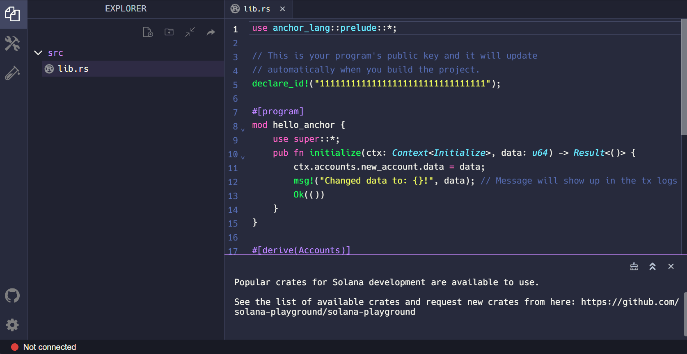
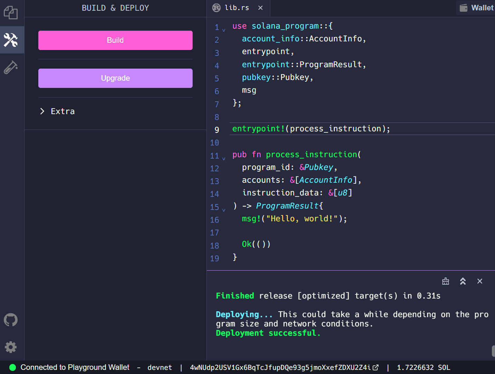
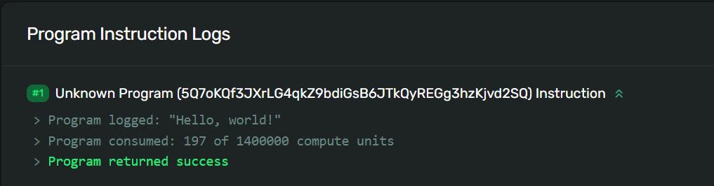

# TL;DR

- **Mga Programa** sa Solana ay isang partikular na uri ng account na nag-iimbak at nagpapatupad ng lohika ng pagtuturo
- Ang mga programang Solana ay may iisang **entry point** upang iproseso ang mga tagubilin
- Pinoproseso ng isang program ang isang pagtuturo gamit ang **program_id**, listahan ng **accounts**, at **instruction_data** na kasama sa pagtuturo

# Lesson

Ang kakayahan ni Solana na magpatakbo ng arbitrary executable code ay bahagi ng kung bakit ito napakalakas. Ang mga programang Solana, na katulad ng "mga matalinong kontrata" sa iba pang mga kapaligiran ng blockchain, ay literal na backbone ng Solana ecosystem. At ang koleksyon ng mga programa ay lumalaki araw-araw habang ang mga developer at tagalikha ay nangangarap at naglalagay ng mga bagong programa.

Ang araling ito ay magbibigay sa iyo ng pangunahing panimula sa pagsulat at pag-deploy ng isang programang Solana gamit ang Rust programming language. Upang maiwasan ang pagkagambala ng pag-set up ng isang lokal na kapaligiran sa pag-unlad, gagamit kami ng isang browser-based na IDE na tinatawag na Solana Playground.

## Rust Basics

Bago kami sumisid sa gusali ang aming "Hello, world!" programa, talakayin muna natin ang ilang pangunahing kaalaman sa Rust. Kung gusto mong maghukay ng mas malalim sa Rust, tingnan ang [Rust language book](https://doc.rust-lang.org/book/ch00-00-introduction.html).

### Module System

Inaayos ng Rust ang code gamit ang tinatawag na "module system".

Kabilang dito ang:

- **Mga Module** - Pinaghihiwalay ng isang module ang code sa mga lohikal na unit upang magbigay ng mga nakahiwalay na namespace para sa organisasyon, saklaw, at privacy ng mga landas
- **Crates** - Ang isang crate ay alinman sa isang library o isang executable program. Ang source code para sa isang crate ay karaniwang nahahati sa maramihang mga module.
- **Packages** - Ang isang package ay naglalaman ng isang koleksyon ng mga crates pati na rin isang manifest file para sa pagtukoy ng metadata at mga dependency sa pagitan ng mga package

Sa buong araling ito, magtutuon tayo sa paggamit ng mga crates at module.

### Paths and scope

Ang mga Crates sa Rust ay naglalaman ng mga module na tumutukoy sa functionality na maaaring ibahagi sa maraming proyekto. Kung gusto nating mag-access ng item sa loob ng isang module, kailangan nating malaman ang "path" nito (tulad ng kapag nagna-navigate tayo sa isang filesystem).

Isipin ang istraktura ng crate bilang isang puno kung saan ang crate ang base at ang mga module ay mga sanga, na ang bawat isa ay maaaring magkaroon ng mga submodules o mga item na karagdagang mga sanga.

Ang path sa isang partikular na module o item ay ang pangalan ng bawat hakbang mula sa crate patungo sa module na iyon kung saan ang bawat isa ay pinaghihiwalay ng `::`. Bilang halimbawa, tingnan natin ang sumusunod na istraktura:

1. Ang base crate ay `solana_program`
2. Ang `solana_program` ay naglalaman ng module na pinangalanang `account_info`
3. Ang `account_info` ay naglalaman ng struct na pinangalanang `AccountInfo`

Ang path patungo sa `AccountInfo` ay magiging `solana_program::account_info::AccountInfo`.

Kung wala sa anumang iba pang mga keyword, kakailanganin naming i-reference ang buong path na ito upang magamit ang `AccountInfo` sa aming code.

Gayunpaman, gamit ang keyword na [`use`](https://doc.rust-lang.org/stable/book/ch07-04-bringing-paths-into-scope-with-the-use-keyword.html) ay maaaring magdala ng isang item sa saklaw upang maaari itong magamit muli sa kabuuan ng isang file nang hindi tinukoy ang buong path sa bawat oras. Karaniwang makakita ng serye ng mga command na `use` sa itaas ng isang Rust file.

```rust
use solana_program::account_info::AccountInfo
```

### Declaring Functions in Rust

Tinutukoy namin ang isang function sa Rust sa pamamagitan ng paggamit sa `fn` na keyword na sinusundan ng pangalan ng function at isang hanay ng mga panaklong.

```rust
fn process_instruction()
```

Pagkatapos ay maaari tayong magdagdag ng mga argumento sa ating function sa pamamagitan ng pagsasama ng mga variable na pangalan at pagtukoy sa kaukulang uri ng data nito sa loob ng mga panaklong.

Ang Rust ay kilala bilang isang "statically typed" na wika at bawat value sa Rust ay nasa isang partikular na "uri ng data." Nangangahulugan ito na dapat malaman ni Rust ang mga uri ng lahat ng mga variable sa oras ng pag-compile. Sa mga kaso kapag maraming uri ang posible, dapat kaming magdagdag ng uri ng anotasyon sa aming mga variable.

Sa halimbawa sa ibaba, gumawa kami ng function na pinangalanang `process_instruction` na nangangailangan ng mga sumusunod na argumento:

- `program_id` - kinakailangang maging uri ng `&Pubkey`
- `accounts` - kinakailangang maging uri `&[AccountInfo]`
- `instruction_data` - kinakailangang maging uri `&[u8]`

Tandaan ang `&` sa harap ng uri para sa bawat argument na nakalista sa function na `process_instruction`. Sa Rust, ang `&` ay kumakatawan sa isang "reference" sa isa pang variable. Nagbibigay-daan ito sa iyong sumangguni sa ilang halaga nang hindi inaako ang pagmamay-ari nito. Ang "reference" ay ginagarantiyahan na tumuturo sa isang wastong halaga ng isang partikular na uri. Ang pagkilos ng paggawa ng reference sa Rust ay tinatawag na "pahiram."

Sa halimbawang ito, kapag tinawag ang function na `process_instruction`, dapat na ipasa ng user ang mga value para sa mga kinakailangang argumento. Ang function na `process_instruction` ay nagre-reference sa mga value na ipinasa ng user, at ginagarantiyahan na ang bawat value ay ang tamang uri ng data na tinukoy sa function na `process_instruction`.

Bukod pa rito, tandaan ang mga bracket na `[]` sa paligid ng `&[AccountInfo]` at `&[u8]`. Nangangahulugan ito na ang mga argumento ng `accounts` at `instruction_data` ay umaasa ng “mga hiwa” ng mga uri ng `AccountInfo` at `u8`, ayon sa pagkakabanggit. Ang isang "hiwa" ay katulad ng isang array (koleksyon ng mga bagay ng parehong uri), maliban kung ang haba ay hindi alam sa oras ng pag-compile. Sa madaling salita, ang mga argumento ng `accounts` at `instruction_data` ay umaasa ng mga input na hindi alam ang haba.

```rust
fn process_instruction(
    program_id: &Pubkey,
    accounts: &[AccountInfo],
    instruction_data: &[u8],
)
```

Maaari naming ibalik ang mga halaga ng aming mga function sa pamamagitan ng pagdedeklara ng uri ng pagbabalik gamit ang isang arrow `->` pagkatapos ng function.

Sa halimbawa sa ibaba, ang function na `process_instruction` ay magbabalik na ngayon ng value ng uri ng `ProgramResult`. Tatalakayin natin ito sa susunod na seksyon.

```rust
fn process_instruction(
    program_id: &Pubkey,
    accounts: &[AccountInfo],
    instruction_data: &[u8],
) -> ProgramResult
```

### Result enum

Ang `Result` ay isang karaniwang uri ng library na kumakatawan sa dalawang discrete na resulta: tagumpay (`Ok`) o pagkabigo (`Err`). Pag-uusapan natin ang higit pa tungkol sa mga enum sa isang aralin sa hinaharap, ngunit makikita mo ang `Ok` na ginamit sa ibang pagkakataon sa araling ito kaya mahalagang masakop ang mga pangunahing kaalaman.

Kapag gumamit ka ng `Ok` o `Err`, dapat kang magsama ng value, ang uri nito ay tinutukoy ng konteksto ng code. Halimbawa, ang isang function na nangangailangan ng return value na may uri na `Result<String, i64>` ay nagsasabi na ang function ay maaaring magbalik ng `Ok` na may naka-embed na string value o `Err` na may naka-embed na integer. Sa halimbawang ito, ang integer ay isang error code na maaaring magamit upang wastong pangasiwaan ang error.

Upang magbalik ng success case na may string value, gagawin mo ang sumusunod:

```rust
Ok(String::from("Success!"));
```

Upang magbalik ng error na may integer, gagawin mo ang sumusunod:

```rust
Err(404);
```

## Solana Programs

Alalahanin na ang lahat ng data na nakaimbak sa network ng Solana ay nakapaloob sa tinatawag na mga account. Ang bawat account ay may sariling natatanging address na ginagamit upang kilalanin at i-access ang data ng account. Ang mga program ng Solana ay isang partikular na uri lamang ng Solana account na nag-iimbak at nagsasagawa ng mga tagubilin.

### Solana Program Crate

Upang magsulat ng mga programang Solana gamit ang Rust, ginagamit namin ang `solana_program` library crate. Ang `solana_program` crate ay gumaganap bilang isang karaniwang library para sa mga program ng Solana. Ang karaniwang library na ito ay naglalaman ng mga module at macro na gagamitin namin upang bumuo ng aming mga programa sa Solana. Kung gusto mong maghukay ng mas malalim sa `solana_program` crate, tingnan [sa `solana_program` crate documentation](https://docs.rs/solana-program/latest/solana_program/index.html).

Para sa isang pangunahing programa, kakailanganin naming ibigay sa saklaw ang mga sumusunod na item mula sa `solana_program` crate:

```rust
use solana_program::{
    account_info::AccountInfo,
    entrypoint,
    entrypoint::ProgramResult,
    pubkey::Pubkey,
    msg
};
```

- `AccountInfo` - isang struct sa loob ng `account_info` module na nagbibigay-daan sa amin na ma-access ang impormasyon ng account
- `entrypoint` - isang macro na nagdedeklara ng entry point ng program
- `ProgramResult` - isang uri sa loob ng `entrypoint` module na nagbabalik ng `Result` o `ProgramError`
- `Pubkey` - isang struct sa loob ng `pubkey` module na nagbibigay-daan sa amin na i-access ang mga address bilang pampublikong key
- `msg` - isang macro na nagpapahintulot sa amin na mag-print ng mga mensahe sa log ng programa

### Solana Program Entry Point

Ang mga programa ng Solana ay nangangailangan ng isang entry point upang maproseso ang mga tagubilin ng programa. Idineklara ang entry point gamit ang `entrypoint!` macro.

Ang entry point sa isang Solana program ay nangangailangan ng function na `process_instruction` na may mga sumusunod na argumento:

- `program_id` - ang address ng account kung saan naka-store ang program
- `accounts` - ang listahan ng mga account na kinakailangan upang iproseso ang pagtuturo
- `instruction_data` - ang serialized, data na tukoy sa pagtuturo

```rust
entrypoint!(process_instruction);

fn process_instruction(
    program_id: &Pubkey,
    accounts: &[AccountInfo],
    instruction_data: &[u8],
) -> ProgramResult;
```

Alalahanin na ang mga account ng programa ng Solana ay nag-iimbak lamang ng lohika upang iproseso ang mga tagubilin. Nangangahulugan ito na ang mga program account ay "read-only" at "stateless". Ang "estado" (ang hanay ng data) na kinakailangan ng isang programa upang maproseso ang isang pagtuturo ay naka-imbak sa mga account ng data (hiwalay sa account ng programa).

Upang maproseso ang isang tagubilin, ang mga data account na kinakailangan ng isang tagubilin ay dapat na tahasang ipasa sa programa sa pamamagitan ng argumento ng `mga account`. Ang anumang karagdagang input ay dapat na maipasa sa pamamagitan ng argumentong `instruction_data`.

Kasunod ng pagpapatupad ng program, dapat magbalik ang program ng value na may uri ng `ProgramResult`. Ang uri na ito ay isang `Resulta` kung saan ang naka-embed na value ng isang success case ay `()` at ang naka-embed na value ng isang failure case ay `ProgramError`. Ang `()` ay isang walang laman na value at ang `ProgramError` ay isang uri ng error na tinukoy sa `solana_program` crate.

...at nariyan ka na - alam mo na ngayon ang lahat ng mga bagay na kailangan mo para sa mga pundasyon ng paglikha ng isang programang Solana gamit ang Rust. Isagawa natin ang natutunan natin sa ngayon!

# Demo

Bubuo tayo ng "Hello, World!" programa gamit ang Solana Playground. Ang Solana Playground ay isang tool na nagbibigay-daan sa iyong magsulat at mag-deploy ng mga programang Solana mula sa browser.

### 1. Setup

Buksan ang [Solana Playground](https://beta.solpg.io/). Susunod, sige at tanggalin ang lahat sa default na `lib.rs` file at gumawa ng Playground wallet.



### 2. Solana Program Crate

Una, dalhin natin sa saklaw ang lahat ng kakailanganin natin mula sa `solana_program` crate.

```rust
use solana_program::{
    account_info::AccountInfo,
    entrypoint,
    entrypoint::ProgramResult,
    pubkey::Pubkey,
    msg
};
```

Susunod, i-set up natin ang entry point sa ating program gamit ang `entrypoint!` macro at likhain ang `process_instruction` function. Ang macro na `msg!` ay nagbibigay-daan sa amin na i-print ang "Hello, world!" sa log ng program kapag na-invoke ang program.

### 3. Entry Point

```rust
entrypoint!(process_instruction);

pub fn process_instruction(
    program_id: &Pubkey,
    accounts: &[AccountInfo],
    instruction_data: &[u8]
) -> ProgramResult{
    msg!("Hello, world!");

    Ok(())
}
```

Sama-sama, ang "Kumusta, mundo!" magiging ganito ang program:

```rust
use solana_program::{
    account_info::AccountInfo,
    entrypoint,
    entrypoint::ProgramResult,
    pubkey::Pubkey,
    msg
};

entrypoint!(process_instruction);

pub fn process_instruction(
    program_id: &Pubkey,
    accounts: &[AccountInfo],
    instruction_data: &[u8]
) -> ProgramResult{
    msg!("Hello, world!");

    Ok(())
}
```

### 4. Build and Deploy

Ngayon, buuin at i-deploy natin ang ating programa gamit ang Solana Playground.



### 5. Invoke Program

Panghuli, tawagan natin ang aming programa mula sa panig ng kliyente. Ang pokus ng araling ito ay ang pagbuo ng aming programang Solana, kaya nagpatuloy kami at ibinigay [ang client code para i-invoke ang aming "Hello, world!" program](https://github.com/Unboxed-Software/solana-hello-world-client) para i-download mo.

Kasama sa ibinigay na code ang isang `sayHello` helper function na bumubuo at nagsusumite ng aming transaksyon. Pagkatapos ay tinatawagan namin ang `sayHello` sa pangunahing function at mag-print ng Solana Explorer URL upang tingnan ang aming mga detalye ng transaksyon sa browser.

Buksan ang `index.ts` file na dapat mong makita ang isang variable na pinangalanang `programId`. Sige at i-update ito gamit ang program ID ng program na “Hello, world!" na kaka-deploy mo lang gamit ang Solana Playground.

```tsx
let programId = new web3.PublicKey("<YOUR_PROGRAM_ID>");
```

Maaari mong mahanap ang program ID sa Solana Playground na tumutukoy sa larawan sa ibaba.


Susunod, i-install ang mga module ng Node na may `npm i`.

Ngayon, sige at patakbuhin ang `npm start`. Ang utos na ito ay:
1. Bumuo ng bagong keypair at gumawa ng `.env` file kung wala pa
2. Airdrop devnet SOL
3. Ipatawag ang “Hello, world!” programa
4. I-output ang URL ng transaksyon upang tingnan sa Solana Explorer

Kopyahin ang URL ng transaksyon na naka-print sa console sa iyong browser. Mag-scroll pababa para makita ang “Hello, world!” sa ilalim ng Mga Log ng Instruksyon ng Programa.



Binabati kita, matagumpay mong nagawa at nai-deploy ang isang programa ng Solana!

# Challenge

Ngayon ay iyong pagkakataon na bumuo ng isang bagay nang nakapag-iisa. Dahil nagsisimula kami sa napakasimpleng mga programa, ang sa iyo ay magmumukhang halos magkapareho sa kung ano ang nilikha namin. Kapaki-pakinabang na subukan at makarating sa punto kung saan maaari mong isulat ito mula sa simula nang hindi tinutukoy ang naunang code, kaya subukang huwag kopyahin at i-paste dito.

1. Sumulat ng bagong program na gumagamit ng `msg!` na macro upang i-print ang iyong sariling mensahe sa log ng programa.
2. Buuin at i-deploy ang iyong programa tulad ng ginawa namin sa demo.
3. I-invoke ang iyong bagong deployed program at gamitin ang Solana Explorer para tingnan kung ang iyong mensahe ay naka-print sa log ng program.

Gaya ng dati, maging malikhain sa mga hamong ito at dalhin ang mga ito sa kabila ng mga pangunahing tagubilin kung gusto mo - at magsaya!
