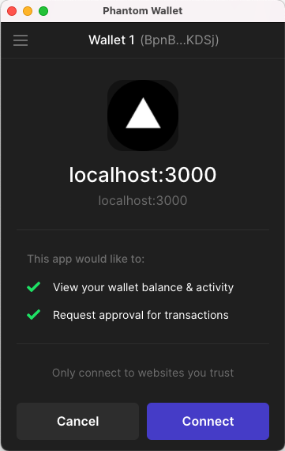

# TL;DR

- **Ang mga Wallet** ay nag-iimbak ng iyong sikretong susi at pinangangasiwaan ang secure na pag-sign ng transaksyon
- **Ang mga wallet ng hardware** ay nag-iimbak ng iyong sikretong key sa isang hiwalay na device
- **Software wallet** gamitin ang iyong computer para sa secure na storage
- Ang mga software wallet ay kadalasang **mga extension ng browser** na nagpapadali sa pagkonekta sa mga website
- Pinapasimple ng **Wallet-Adapter library** ni Solana ang suporta ng mga extension ng browser ng wallet, na nagbibigay-daan sa iyong bumuo ng mga website na maaaring humiling ng address ng wallet ng user at magmungkahi ng mga transaksyon para lagdaan nila

# Lesson

## Wallets

Sa nakaraang dalawang aralin ay tinalakay natin ang mga keypair. Ginagamit ang mga keypair upang mahanap ang mga account at pumirma ng mga transaksyon. Habang ang pampublikong susi ng isang keypair ay ganap na ligtas na ibahagi, ang sikretong susi ay dapat palaging itago sa isang secure na lokasyon. Kung malantad ang lihim na susi ng isang user, maaaring maubos ng isang malisyosong aktor ang kanilang account sa lahat ng asset at magsagawa ng mga transaksyon nang may awtoridad ng user na iyon.

Ang "wallet" ay tumutukoy sa anumang bagay na nag-iimbak ng isang lihim na susi upang mapanatili itong secure. Ang mga secure na opsyon sa storage na ito ay karaniwang maaaring ilarawan bilang alinman sa "hardware" o "software" na mga wallet. Ang mga wallet ng hardware ay mga storage device na hiwalay sa iyong computer. Ang mga wallet ng software ay application na maaari mong i-install sa iyong (mga) kasalukuyang device.

Ang mga wallet ng software ay kadalasang nanggagaling sa anyo ng isang extension ng browser. Ginagawa nitong posible para sa mga website na madaling makipag-ugnayan sa wallet. Ang ganitong mga pakikipag-ugnayan ay karaniwang limitado sa:

1. Nakikita ang pampublikong susi (address) ng pitaka
2. Pagsusumite ng mga transaksyon para sa pag-apruba ng isang user
3. Pagpapadala ng naaprubahang transaksyon sa network

Kapag naisumite na ang isang transaksyon, maaaring "kumpirmahin" ng end user ang transaksyon at ipadala ito sa network kasama ang kanilang "pirma."

Ang pag-sign sa mga transaksyon ay nangangailangan ng paggamit ng iyong sikretong key. Sa pamamagitan ng pagpayag sa isang site na magsumite ng isang transaksyon sa iyong wallet at pagkakaroon ng wallet na pangasiwaan ang pagpirma, tinitiyak mong hindi mo kailanman ilantad ang iyong sikretong susi sa website. Sa halip, ibinabahagi mo lamang ang sikretong susi sa application ng wallet.

Maliban na lang kung ikaw mismo ang gumagawa ng wallet application, hindi dapat kailanganin ng iyong code na hilingin sa isang user ang kanilang sikretong key. Sa halip, maaari mong hilingin sa mga user na kumonekta sa iyong site gamit ang isang kagalang-galang na wallet.
## Phantom Wallet

Ang isa sa pinakamalawak na ginagamit na software wallet sa Solana ecosystem ay [Phantom](https://phantom.app). Sinusuportahan ng Phantom ang ilan sa mga pinakasikat na browser at may mobile app para sa pagkonekta on the go. Malamang na gusto mong suportahan ng iyong mga desentralisadong aplikasyon ang maraming wallet, ngunit ang kursong ito ay tututuon sa Phantom.

## Solana’s Wallet-Adapter

Ang Solana's Wallet-Adapter ay isang hanay ng mga library na magagamit mo upang pasimplehin ang proseso ng pagsuporta sa mga extension ng browser ng wallet.

Ang Solana's Wallet-Adapter ay binubuo ng maraming modular na pakete. Ang pangunahing functionality ay matatagpuan sa `@solana/wallet-adapter-base` at `@solana/wallet-adapter-react`.

Mayroon ding mga package na nagbibigay ng mga bahagi para sa mga karaniwang UI framework. Sa araling ito at sa buong kursong ito, gagamit kami ng mga bahagi mula sa `@solana/wallet-adapter-react-ui`.

Sa wakas, may mga pakete na mga adaptor para sa mga partikular na wallet, kabilang ang Phantom. Maaari mong gamitin ang `@solana/wallet-adapter-wallet` para isama ang lahat ng sinusuportahang wallet, o maaari kang pumili ng partikular na wallet package tulad ng `@solana/wallet-adapter-phantom`.

### Install Wallet-Adapter Libraries

Kapag nagdaragdag ng suporta sa wallet sa isang umiiral nang react app, magsisimula ka sa pamamagitan ng pag-install ng mga naaangkop na package. Kakailanganin mo ang `@solana/wallet-adapter-base`, `@solana/wallet-adapter-react`. Kung plano mong gamitin ang ibinigay na mga bahagi ng reaksyon, kakailanganin mo ring magdagdag ng `@solana/wallet-adapter-react-ui`.

Ang lahat ng wallet na sumusuporta sa [wallet standard](https://github.com/wallet-standard/wallet-standard) ay sinusuportahan out of the box, at halos lahat ng kasalukuyang Solana wallet ay sumusuporta sa wallet standard. Gayunpaman kung nais mong magdagdag ng suporta para sa anumang mga wallet na hindi sumusuporta sa pamantayan, magdagdag ng isang pakete para sa kanila.

```
npm install @solana/wallet-adapter-base \
    @solana/wallet-adapter-react \
    @solana/wallet-adapter-react-ui
```

### Connect To Wallets

Binibigyang-daan kami ng `@solana/wallet-adapter-react` na magpatuloy at ma-access ang mga estado ng koneksyon ng wallet sa pamamagitan ng mga hook at provider ng konteksto, katulad ng:

- `useWallet`
- `WalletProvider`
- `useConnection`
- `ConnectionProvider`

Para gumana nang maayos ang mga ito, anumang paggamit ng `useWallet` at `useConnection` ay dapat na nakabalot sa `WalletProvider` at `ConnectionProvider`. Isa sa mga pinakamahusay na paraan upang matiyak na ito ay ang pagbalot ng iyong buong app sa `ConnectionProvider` at `WalletProvider`:

```tsx
import { NextPage } from "next";
import { FC, ReactNode } from "react";
import {
  ConnectionProvider,
  WalletProvider,
} from "@solana/wallet-adapter-react";
import { PhantomWalletAdapter } from "@solana/wallet-adapter-phantom";
import * as web3 from "@solana/web3.js";

export const Home: NextPage = (props) => {
  const endpoint = web3.clusterApiUrl("devnet");
  const wallet = new PhantomWalletAdapter();

  return (
    <ConnectionProvider endpoint={endpoint}>
      <WalletProvider wallets={[wallet]}>
        <p>Put the rest of your app here</p>
      </WalletProvider>
    </ConnectionProvider>
  );
};

```

Tandaan na ang `ConnectionProvider` ay nangangailangan ng `endpoint` na property at ang `WalletProvider` ay nangangailangan ng isang `wallet` na property. Patuloy naming ginagamit ang endpoint para sa Devnet cluster, at sa ngayon ginagamit lang namin ang `PhantomWalletAdapter` para sa `wallet`.

Sa puntong ito maaari kang kumonekta sa `wallet.connect()`, na magtuturo sa wallet na i-prompt ang user para sa pahintulot na tingnan ang kanilang pampublikong key at humiling ng pag-apruba para sa mga transaksyon.



Bagama't magagawa mo ito sa isang `useEffect` hook, karaniwang gusto mong magbigay ng mas sopistikadong functionality. Halimbawa, maaaring gusto mong pumili ang mga user mula sa isang listahan ng mga sinusuportahang wallet, o idiskonekta pagkatapos nilang kumonekta.

### `@solana/wallet-adapter-react-ui`

You can create custom components for this, or you can leverage components provided by `@solana/wallet-adapter-react-ui`. The simplest way to provide extensive options is to use `WalletModalProvider` and `WalletMultiButton`:

```tsx
import { NextPage } from "next";
import { FC, ReactNode } from "react";
import {
  ConnectionProvider,
  WalletProvider,
} from "@solana/wallet-adapter-react";
import {
  WalletModalProvider,
  WalletMultiButton,
} from "@solana/wallet-adapter-react-ui";
import { PhantomWalletAdapter } from "@solana/wallet-adapter-phantom";
import * as web3 from "@solana/web3.js";

const Home: NextPage = (props) => {
  const endpoint = web3.clusterApiUrl("devnet");
  const wallet = new PhantomWalletAdapter();

  return (
    <ConnectionProvider endpoint={endpoint}>
      <WalletProvider wallets={[wallet]}>
        <WalletModalProvider>
          <WalletMultiButton />
          <p>Put the rest of your app here</p>
        </WalletModalProvider>
      </WalletProvider>
    </ConnectionProvider>
  );
};

export default Home;

```

Ang `WalletModalProvider` ay nagdaragdag ng functionality para sa pagpapakita ng modal screen para sa mga user upang piliin kung aling wallet ang gusto nilang gamitin. Ang `WalletMultiButton` ay nagbabago ng gawi upang tumugma sa katayuan ng koneksyon:


You can also use more granular components if you need more specific functionality:

- `WalletConnectButton`
- `WalletModal`
- `WalletModalButton`
- `WalletDisconnectButton`
- `WalletIcon`

### Access Account Info

Kapag nakakonekta na ang iyong site sa isang wallet, kukuha ang `useConnection` ng object na `Connection` at makukuha ng `useWallet` ang `WalletContextState`. Ang `WalletContextState` ay may property na `publicKey` na `null` kapag hindi nakakonekta sa isang wallet at mayroong pampublikong key ng account ng user kapag nakakonekta ang isang wallet. Gamit ang isang pampublikong key at isang koneksyon, maaari kang kumuha ng impormasyon ng account at higit pa.

```tsx
import { useConnection, useWallet } from "@solana/wallet-adapter-react";
import { LAMPORTS_PER_SOL } from "@solana/web3.js";
import { FC, useEffect, useState } from "react";

export const BalanceDisplay: FC = () => {
  const [balance, setBalance] = useState(0);
  const { connection } = useConnection();
  const { publicKey } = useWallet();

  useEffect(() => {
    if (!connection || !publicKey) {
      return;
    }

    connection.onAccountChange(
      publicKey,
      (updatedAccountInfo) => {
        setBalance(updatedAccountInfo.lamports / LAMPORTS_PER_SOL);
      },
      "confirmed",
    );

    connection.getAccountInfo(publicKey).then((info) => {
      setBalance(info.lamports);
    });
  }, [connection, publicKey]);

  return (
    <div>
      <p>{publicKey ? `Balance: ${balance / LAMPORTS_PER_SOL} SOL` : ""}</p>
    </div>
  );
};
```

Tandaan ang tawag sa connection.onAccountChange(), na nag-a-update sa balanse ng account na ipinapakita kapag nakumpirma ng network ang transaksyon.

### Send Transactions

Nagbibigay din ang `WalletContextState` ng function na `sendTransaction` na magagamit mo upang magsumite ng mga transaksyon para sa pag-apruba.

```tsx
const { publicKey, sendTransaction } = useWallet();
const { connection } = useConnection();

const sendSol = (event) => {
  event.preventDefault();

  const transaction = new web3.Transaction();
  const recipientPubKey = new web3.PublicKey(event.target.recipient.value);

  const sendSolInstruction = web3.SystemProgram.transfer({
    fromPubkey: publicKey,
    toPubkey: recipientPubKey,
    lamports: LAMPORTS_PER_SOL * 0.1,
  });

  transaction.add(sendSolInstruction);
  sendTransaction(transaction, connection).then((sig) => {
    console.log(sig);
  });
};

```

Kapag tinawag ang function na ito, ipapakita ng konektadong wallet ang transaksyon para sa pag-apruba ng user. Kung naaprubahan, pagkatapos ay ipapadala ang transaksyon.


# Demo

Kunin natin ang Ping program mula sa huling aralin at bumuo ng frontend na nagbibigay-daan sa mga user na aprubahan ang isang transaksyon na nag-ping sa program. Bilang paalala, ang pampublikong key ng programa ay `ChT1B39WKLS8qUrkLvFDXMhEJ4F1XZzwUNHUt4AU9aVa` at ang pampublikong key para sa data account ay `Ah9K7dQ8EHaZqcAsgBW8w37yN2eAy3koFmUn`4.


### 1. Download the Phantom browser extension and set it to Devnet

Kung wala ka pa nito, i-download ang [Phantom browser extension](https://phantom.app/download). Sa oras ng pagsulat, sinusuportahan nito ang mga browser ng Chrome, Brave, Firefox, at Edge, kaya kakailanganin mo ring i-install ang isa sa mga browser na iyon. Sundin ang mga tagubilin ng Phantom para sa paggawa ng bagong account at bagong wallet.

Kapag mayroon ka nang wallet, i-click ang gear ng mga setting sa kanang ibaba sa Phantom UI. Mag-scroll pababa at mag-click sa line item na "Baguhin ang Network" at piliin ang "Devnet." Tinitiyak nito na ang Phantom ay makokonekta sa parehong network na gagamitin namin sa demo na ito.

### 2. Download the starter code

I-download ang [starter code para sa proyektong ito](https://github.com/Unboxed-Software/solana-ping-frontend/tree/starter). Ang proyektong ito ay isang simpleng Next.js application. Ito ay halos walang laman maliban sa `AppBar` na bahagi. Bubuo kami ng natitira sa buong demo na ito.

Makikita mo ang kasalukuyang estado nito gamit ang command na `npm run dev` sa console.

### 3. Wrap the app in context providers

Upang magsimula, gagawa kami ng bagong bahagi upang maglaman ng iba't ibang provider ng Wallet-Adapter na aming gagamitin. Gumawa ng bagong file sa loob ng folder na `mga component` na tinatawag na `WalletContextProvider.tsx`.

Magsimula tayo sa ilan sa boilerplate para sa isang functional na bahagi:

```tsx
import { FC, ReactNode } from "react";

const WalletContextProvider: FC<{ children: ReactNode }> = ({ children }) => {
  return (

  ));
};

export default WalletContextProvider;
```

Para maayos na makakonekta sa wallet ng user, kakailanganin namin ng `ConnectionProvider`, `WalletProvider` at `WalletModalProvider`. Magsimula sa pamamagitan ng pag-import ng mga bahaging ito mula sa `@solana/wallet-adapter-react` at `@solana/wallet-adapter-react-ui`. Pagkatapos ay idagdag ang mga ito sa bahaging `WalletContextProvider`. Tandaan na ang `ConnectionProvider` ay nangangailangan ng `endpoint` na parameter at ang `WalletProvider` ay nangangailangan ng array ng `wallet`. Sa ngayon, gumamit lamang ng isang walang laman na string at isang walang laman na hanay, ayon sa pagkakabanggit.

```tsx
import { FC, ReactNode } from "react";
import {
  ConnectionProvider,
  WalletProvider,
} from "@solana/wallet-adapter-react";
import { WalletModalProvider } from "@solana/wallet-adapter-react-ui";

const WalletContextProvider: FC<{ children: ReactNode }> = ({ children }) => {
  return (
    <ConnectionProvider endpoint={""}>
      <WalletProvider wallets={[]}>
        <WalletModalProvider>{children}</WalletModalProvider>
      </WalletProvider>
    </ConnectionProvider>
  );
};

export default WalletContextProvider;

```

Ang mga huling bagay na kailangan namin ay isang aktwal na endpoint para sa `ConnectionProvider` at ang mga sinusuportahang wallet para sa `WalletProvider`.

Para sa endpoint, gagamitin namin ang parehong function na `clusterApiUrl` mula sa library na `@solana/web3.js` na ginamit namin noon kaya kakailanganin mong i-import ito. Para sa hanay ng mga wallet, kakailanganin mo ring i-import ang library ng `@solana/wallet-adapter-wallets`.

Pagkatapos i-import ang mga library na ito, gumawa ng pare-parehong `endpoint` na gumagamit ng function na `clusterApiUrl` para makuha ang url para sa Devnet. Pagkatapos ay gumawa ng pare-parehong `mga wallet` at itakda ito sa isang array na naglalaman ng bagong gawang `PhantomWalletAdapter`. Panghuli, palitan ang walang laman na string at walang laman na array sa `ConnectionProvider` at `WalletProvider`, ayon sa pagkakabanggit.

Upang kumpletuhin ang bahaging ito, idagdag ang `require('@solana/wallet-adapter-react-ui/styles.css');` sa ibaba ng iyong mga pag-import upang matiyak ang wastong istilo at gawi ng mga bahagi ng library ng Wallet Adapter.

```tsx
import { FC, ReactNode } from "react";
import {
  ConnectionProvider,
  WalletProvider,
} from "@solana/wallet-adapter-react";
import { WalletModalProvider } from "@solana/wallet-adapter-react-ui";
import * as web3 from "@solana/web3.js";
import * as walletAdapterWallets from "@solana/wallet-adapter-wallets";
require("@solana/wallet-adapter-react-ui/styles.css");

const WalletContextProvider: FC<{ children: ReactNode }> = ({ children }) => {
  const endpoint = web3.clusterApiUrl("devnet");
  const wallets = [new walletAdapterWallets.PhantomWalletAdapter()];

  return (
    <ConnectionProvider endpoint={endpoint}>
      <WalletProvider wallets={wallets}>
        <WalletModalProvider>{children}</WalletModalProvider>
      </WalletProvider>
    </ConnectionProvider>
  );
};

export default WalletContextProvider;

```

### 4. Add wallet multi-button

Susunod, i-set up natin ang button na Connect. Ang kasalukuyang button ay isang placeholder lamang dahil sa halip na gumamit ng karaniwang button o gumawa ng custom na bahagi, gagamitin namin ang "multi-button" ng Wallet-Adapter. Ang button na ito ay nakikipag-ugnayan sa mga provider na na-set up namin sa `WalletContextProvider` at hinahayaan ang mga user na pumili ng wallet, kumonekta sa isang wallet, at magdiskonekta mula sa isang wallet. Kung kailangan mo ng higit pang custom na functionality, maaari kang lumikha ng custom na component para mahawakan ito.

Bago namin idagdag ang "multi-button," kailangan naming i-wrap ang app sa `WalletContextProvider`. Gawin ito sa pamamagitan ng pag-import nito sa `index.tsx` at pagdaragdag nito pagkatapos ng pansarang tag na `</Head>`:

```tsx
import { NextPage } from 'next'
import styles from '../styles/Home.module.css'
import WalletContextProvider from '../components/WalletContextProvider'
import { AppBar } from '../components/AppBar'
import Head from 'next/head'
import { PingButton } from '../components/PingButton'

const Home: NextPage = (props) => {

    return (
        <div className={styles.App}>
            <Head>
                <title>Wallet-Adapter Example</title>
                <meta
                    name="description"
                    content="Wallet-Adapter Example"
                />
            </Head>
            <WalletContextProvider>
                <AppBar />
                <div className={styles.AppBody}>
                    <PingButton/>
                </div>
            </WalletContextProvider >
        </div>
    );
}

export default Home
```

Kung patakbuhin mo ang app, dapat ay pareho pa rin ang hitsura ng lahat dahil ang kasalukuyang button sa kanang itaas ay isang placeholder pa rin. Upang ayusin ito, buksan ang `AppBar.tsx` at palitan ang `<button>Connect</button>` ng `<WalletMultiButton/>`. Kakailanganin mong mag-import ng `WalletMultiButton` mula sa `@solana/wallet-adapter-react-ui`.

```tsx
import { FC } from "react";
import styles from "../styles/Home.module.css";
import Image from "next/image";
import { WalletMultiButton } from "@solana/wallet-adapter-react-ui";

export const AppBar: FC = () => {
  return (
    <div className={styles.AppHeader}>
      <Image src="/solanaLogo.png" height={30} width={200} />
      <span>Wallet-Adapter Example</span>
      <WalletMultiButton />
    </div>
  );
};
```

Sa puntong ito, dapat mong patakbuhin ang app at makipag-ugnayan sa multi-button sa kanang tuktok ng screen. Dapat itong basahin ngayon, "Piliin ang Wallet." Kung mayroon kang Phantom extension at naka-sign in ka, dapat mong maikonekta ang iyong Phantom wallet sa site gamit ang bagong button na ito.

### 5. Create button to ping program

Ngayong makakakonekta na ang aming app sa Phantom wallet, gawin natin ang "Ping!" ang pindutan ay talagang gumawa ng isang bagay.

Magsimula sa pamamagitan ng pagbubukas ng `PingButton.tsx` file. Papalitan namin ang `console.log` sa loob ng `onClick` ng code na lilikha ng transaksyon at isusumite ito sa extension ng Phantom para sa pag-apruba ng end user.

Una, kailangan namin ng koneksyon, pampublikong key ng wallet, at function na `sendTransaction` ng Wallet-Adapter. Para makuha ito, kailangan naming mag-import ng `useConnection` at `useWallet` mula sa `@solana/wallet-adapter-react`. Habang narito tayo, mag-import din tayo ng `@solana/web3.js` dahil kakailanganin natin ito para magawa ang ating transaksyon.

```tsx
import { useConnection, useWallet } from '@solana/wallet-adapter-react'
import * as web3 from '@solana/web3.js'
import { FC, useState } from 'react'
import styles from '../styles/PingButton.module.css'

export const PingButton: FC = () => {

  const onClick = () => {
    console.log('Ping!')
  }

  return (
    <div className={styles.buttonContainer} onClick={onClick}>
      <button className={styles.button}>Ping!</button>
    </div>
  )
}
```

Ngayon, gamitin ang `useConnection` hook para gumawa ng `connection` constant at ang `useWallet` hook para gumawa ng `publicKey` at `sendTransaction` constants.

```tsx
import { useConnection, useWallet } from "@solana/wallet-adapter-react";
import * as web3 from "@solana/web3.js";
import { FC, useState } from "react";
import styles from "../styles/PingButton.module.css";

export const PingButton: FC = () => {
  const { connection } = useConnection();
  const { publicKey, sendTransaction } = useWallet();

  const onClick = () => {
    console.log("Ping!");
  };

  return (
    <div className={styles.buttonContainer} onClick={onClick}>
      <button className={styles.button}>Ping!</button>
    </div>
  );
};
```

Sa pamamagitan nito, maaari nating punan ang katawan ng `onClick`.

Una, tingnan kung parehong umiiral ang `koneksyon` at `publicKey` (kung ang alinman sa wala ay hindi pa nakakonekta ang wallet ng user).

Susunod, bumuo ng dalawang instance ng `PublicKey`, isa para sa program ID `ChT1B39WKLS8qUrkLvFDXMhEJ4F1XZzwUNHUt4AU9aVa` at isa para sa data account na `Ah9K7dQ8EHaZqcAsgBW8w37yCm2eAdy`.

Susunod, bumuo ng `Transaction`, pagkatapos ay isang bagong `TransactionInstruction` na kinabibilangan ng data account bilang writable key.

Susunod, idagdag ang pagtuturo sa transaksyon.

Panghuli, tawagan ang `sendTransaction`.

```tsx
const onClick = () => {
  if (!connection || !publicKey) {
    return;
  }

  const programId = new web3.PublicKey(PROGRAM_ID);
  const programDataAccount = new web3.PublicKey(DATA_ACCOUNT_PUBKEY);
  const transaction = new web3.Transaction();

  const instruction = new web3.TransactionInstruction({
    keys: [
      {
        pubkey: programDataAccount,
        isSigner: false,
        isWritable: true,
      },
    ],
    programId,
  });

  transaction.add(instruction);
  sendTransaction(transaction, connection).then((sig) => {
    console.log(sig);
  });
};
```

At iyon na! Kung nire-refresh mo ang page, ikonekta ang iyong wallet, at i-click ang ping button, dapat ipakita sa iyo ng Phantom ang isang popup para sa pagkumpirma ng transaksyon.

### 6. Add some polish around the edges

Marami kang magagawa para mapaganda pa ang karanasan ng user dito. Halimbawa, maaari mong baguhin ang UI upang ipakita lamang sa iyo ang Ping button kapag nakakonekta ang isang wallet at magpakita ng iba pang prompt kung hindi man. Maaari kang mag-link sa transaksyon sa Solana Explorer pagkatapos makumpirma ng isang user ang isang transaksyon upang madali nilang tingnan ang mga detalye ng transaksyon. Kapag mas nag-eeksperimento ka dito, mas magiging komportable ka, kaya maging malikhain!

Maaari mo ring i-download ang [buong source code mula sa demo na ito](https://github.com/Unboxed-Software/solana-ping-frontend) upang maunawaan ang lahat ng ito sa konteksto.

# Challenge

Ngayon ay iyong pagkakataon na bumuo ng isang bagay nang nakapag-iisa. Gumawa ng application na nagbibigay-daan sa isang user na ikonekta ang kanilang Phantom wallet at ipadala ang SOL sa isa pang account.


1. Magagawa mo ito mula sa simula o maaari mong [i-download ang starter code](https://github.com/Unboxed-Software/solana-send-sol-frontend/tree/starter).
2. I-wrap ang starter application sa naaangkop na mga provider ng konteksto.
3. Sa bahagi ng form, i-set up ang transaksyon at ipadala ito sa wallet ng user para sa pag-apruba.
4. Maging malikhain gamit ang karanasan ng user. Magdagdag ng link upang hayaan ang user na tingnan ang transaksyon sa Solana Explorer o iba pang bagay na mukhang cool sa iyo!

Kung talagang nalilito ka, huwag mag-atubiling [tingnan ang code ng solusyon](https://github.com/Unboxed-Software/solana-send-sol-frontend/tree/main).
