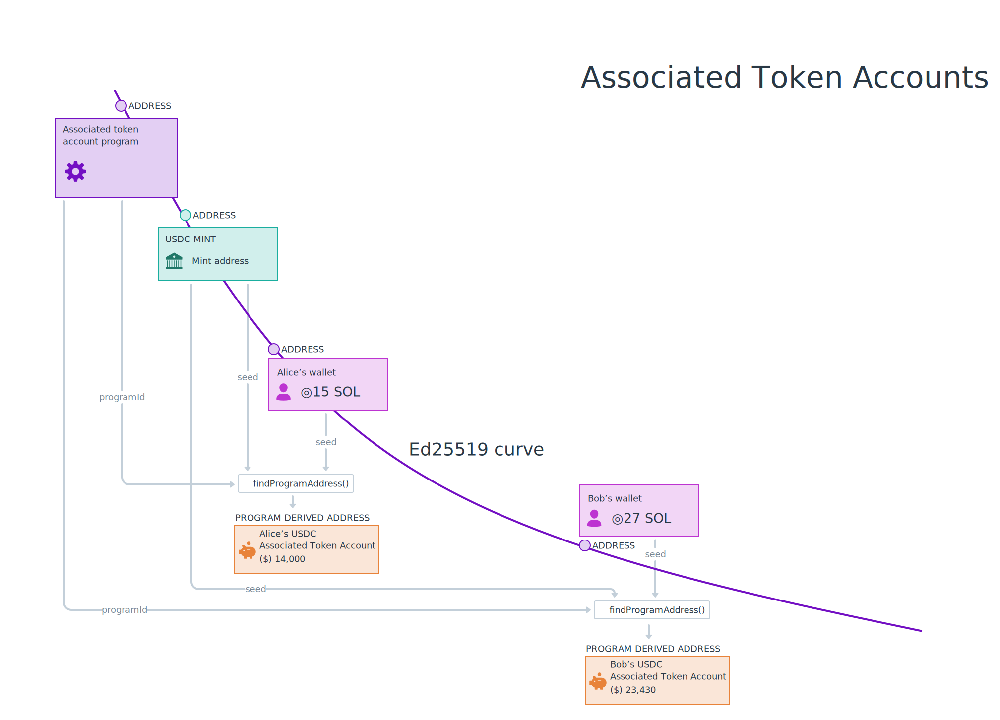

# TL;DR

- Ang **SPL-Tokens** ay kumakatawan sa lahat ng hindi katutubong token sa network ng Solana. Ang parehong fungible at non-fungible token (NFTs) sa Solana ay SPL-Tokens
- Ang **Token Program** ay naglalaman ng mga tagubilin para sa paglikha at pakikipag-ugnayan sa SPL-Tokens
- **Token Mints** ay mga account na nagtataglay ng data tungkol sa isang partikular na Token, ngunit hindi nagtataglay ng Token
- **Token Accounts** ay ginagamit upang maghawak ng mga Token ng isang partikular na Token Mint
- Ang paggawa ng Mga Token Mint at Token Account ay nangangailangan ng paglalaan ng **renta** sa SOL. Ang renta para sa isang Token Account ay maaaring i-refund kapag ang account ay sarado, gayunpaman, ang Token Mint ay kasalukuyang hindi maaaring isara

# Lesson

Ang Token Program ay isa sa maraming programa na ginawang available ng Solana Program Library (SPL). Naglalaman ito ng mga tagubilin para sa paglikha at pakikipag-ugnayan sa SPL-Tokens. Ang mga token na ito ay kumakatawan sa lahat ng hindi katutubong (i.e. hindi SOL) na mga token sa network ng Solana.

Ang araling ito ay tumutuon sa mga pangunahing kaalaman sa paglikha at pamamahala ng isang bagong SPL-Token gamit ang Token Program:
1. Paglikha ng bagong Token Mint
2. Paglikha ng Mga Token Account
3. Pagmimina
4. Paglilipat ng mga token mula sa isang may hawak patungo sa isa pa
5. Nagsusunog ng mga token

Lalapitan namin ito mula sa client-side ng proseso ng pag-develop gamit ang `@solana/spl-token` Javascript library.

## Token Mint

Upang lumikha ng bagong SPL-Token kailangan mo munang lumikha ng Token Mint. Ang Token Mint ay ang account na nagtataglay ng data tungkol sa isang partikular na token.

Bilang halimbawa, tingnan natin ang [USD Coin (USDC) sa Solana Explorer](https://explorer.solana.com/address/EPjFWdd5AufqSSqeM2qN1xzybapC8G4wEGGkZwyTDt1v). Ang address ng Token Mint ng USDC ay `EPjFWdd5AufqSSqeM2qN1xzybapC8G4wEGGkZwyTDt1v`. Sa explorer, makikita natin ang mga partikular na detalye tungkol sa Token Mint ng USDC tulad ng kasalukuyang supply ng mga token, ang mga address ng mint at freeze na awtoridad, at ang desimal na katumpakan ng token:


Upang lumikha ng bagong Token Mint, kailangan mong ipadala ang tamang mga tagubilin sa transaksyon sa Token Program. Upang gawin ito, gagamitin namin ang function na `createMint` mula sa `@solana/spl-token`.

```tsx
const tokenMint = await createMint(
    connection,
    payer,
    mintAuthority,
    freezeAuthority,
    decimal
);
```

Ibinabalik ng function na `createMint` ang `publicKey` ng bagong token mint. Ang function na ito ay nangangailangan ng mga sumusunod na argumento:

- `koneksyon` - ang JSON-RPC na koneksyon sa cluster
- `payer` - ang pampublikong susi ng nagbabayad para sa transaksyon
- `mintAuthority` - ang account na pinahintulutang gawin ang aktwal na pag-minting ng mga token mula sa token mint.
- `freezeAuthority` - isang account na pinahintulutan na i-freeze ang mga token sa isang token account. Kung ang pagyeyelo ay hindi isang nais na katangian, ang parameter ay maaaring itakda sa null
- `decimals` - tumutukoy sa nais na katumpakan ng decimal ng token

Kapag gumagawa ng bagong mint mula sa isang script na may access sa iyong sikretong key, maaari mo lang gamitin ang function na `createMint`. Gayunpaman, kung bubuo ka ng isang website upang payagan ang mga user na lumikha ng bagong token mint, kakailanganin mong gawin ito gamit ang sikretong key ng user nang hindi nila inilalantad ito sa browser. Sa kasong iyon, gugustuhin mong bumuo at magsumite ng transaksyon na may mga tamang tagubilin.

Sa ilalim ng hood, ang function na `createMint` ay gumagawa lang ng transaksyon na naglalaman ng dalawang tagubilin:
1. Gumawa ng bagong account
2. Magsimula ng bagong mint

Ito ay magiging ganito ang hitsura:

```tsx
import * as web3 from '@solana/web3'
import * as token from '@solana/spl-token'

async function buildCreateMintTransaction(
    connection: web3.Connection,
    payer: web3.PublicKey,
    decimals: number
): Promise<web3.Transaction> {
    const lamports = await token.getMinimumBalanceForRentExemptMint(connection);
    const accountKeypair = web3.Keypair.generate();
    const programId = token.TOKEN_PROGRAM_ID

    const transaction = new web3.Transaction().add(
        web3.SystemProgram.createAccount({
            fromPubkey: payer,
            newAccountPubkey: accountKeypair.publicKey,
            space: token.MINT_SIZE,
            lamports,
            programId,
        }),
        token.createInitializeMintInstruction(
            accountKeypair.publicKey,
            decimals,
            payer,
            payer,
            programId
        )
    );

    return transaction
}
```

Kapag manu-manong ginagawa ang mga tagubilin para gumawa ng bagong token mint, tiyaking idagdag mo ang mga tagubilin para sa paggawa ng account at pagsisimula ng mint sa *parehong transaksyon*. Kung gagawin mo ang bawat hakbang sa isang hiwalay na transaksyon, sa teoryang posible para sa ibang tao na kunin ang account na iyong ginawa at simulan ito para sa kanilang sariling mint.

### Rent and Rent Exemption
Tandaan na ang unang linya sa body ng function ng nakaraang snippet ng code ay naglalaman ng isang tawag sa `getMinimumBalanceForRentExemptMint`, ang resulta nito ay ipinapasa sa function na `createAccount`. Ito ay bahagi ng pagsisimula ng account na tinatawag na rent exemption.

Hanggang kamakailan lamang, ang lahat ng mga account sa Solana ay kinakailangang gawin ang isa sa mga sumusunod upang maiwasang ma-deallocate:
1. Magbayad ng upa sa mga partikular na agwat
2. Magdeposito ng sapat na SOL sa pagsisimula upang ituring na rent-exempt

Kamakailan, ang unang opsyon ay tinanggal at naging kinakailangan na magdeposito ng sapat na SOL para sa pagbubukod sa upa kapag nagpasimula ng bagong account.

Sa kasong ito, gumagawa kami ng bagong account para sa isang token mint kaya ginagamit namin ang `getMinimumBalanceForRentExemptMint` mula sa `@solana/spl-token` library. Gayunpaman, nalalapat ang konseptong ito sa lahat ng account at magagamit mo ang mas generic na paraan ng `getMinimumBalanceForRentExemption` sa `Connection` para sa iba pang account na maaaring kailanganin mong gawin.

## Token Account

Bago ka makapag-mint ng mga token (mag-isyu ng bagong supply), kailangan mo ng Token Account para mahawakan ang mga bagong ibinigay na token.

Ang isang Token Account ay nagtataglay ng mga token ng isang partikular na "mint" at may tinukoy na "may-ari" ng account. Ang may-ari lang ang may pahintulot na bawasan ang balanse ng Token Account (ilipat, i-burn, atbp.) habang ang sinuman ay maaaring magpadala ng mga token sa Token Account upang madagdagan ang balanse nito.

Maaari mong gamitin ang `createAccount` function ng `spl-token` library upang lumikha ng bagong Token Account:

```tsx
const tokenAccount = await createAccount(
    connection,
    payer,
    mint,
    owner,
    keypair
);
```

Ibinabalik ng function na `createAccount` ang `publicKey` ng bagong token account. Ang function na ito ay nangangailangan ng mga sumusunod na argumento:

- `connection` - ang JSON-RPC na koneksyon sa cluster
- `payer` - ang account ng nagbabayad para sa transaksyon
- `mint` - ang token mint kung saan nauugnay ang bagong token account
- `may-ari` - ang account ng may-ari ng bagong token account
- `keypair` - isa itong opsyonal na parameter para sa pagtukoy ng bagong address ng token account. Kung walang ibinigay na keypair, ang function na `createAccount` ay magde-default sa isang derivation mula sa nauugnay na `mint` at `may-ari` na account.

Pakitandaan na ang function na `createAccount` na ito ay iba sa function na `createAccount` na ipinapakita sa itaas noong tumingin kami sa ilalim ng hood ng function na `createMint`. Noong nakaraan, ginamit namin ang function na `createAccount` sa `SystemProgram` upang ibalik ang pagtuturo para sa paggawa ng lahat ng account. Ang `createAccount` function dito ay isang helper function sa `spl-token` library na nagsusumite ng transaksyon na may dalawang tagubilin. Ang una ay gumagawa ng account at ang pangalawa ay nagpapasimula ng account bilang isang Token Account.

Tulad ng paggawa ng Token Mint, kung kailangan naming buuin ang transaksyon para sa `createAccount` nang manu-mano maaari naming i-duplicate kung ano ang ginagawa ng function sa ilalim ng hood:
1. Gamitin ang `getMint` upang kunin ang data na nauugnay sa `mint`
2. Gamitin ang `getAccountLenForMint` upang kalkulahin ang puwang na kailangan para sa token account
3. Gamitin ang `getMinimumBalanceForRentExemption` para kalkulahin ang mga lamport na kailangan para sa exemption sa upa
4. Gumawa ng bagong transaksyon gamit ang `SystemProgram.createAccount` at `createInitializeAccountInstruction`. Tandaan na ang `createAccount` na ito ay mula sa `@solana/web3.js` at ginamit para gumawa ng generic na bagong account. Ginagamit ng `createInitializeAccountInstruction` ang bagong account na ito upang simulan ang bagong token account

```tsx
import * as web3 from '@solana/web3'
import * as token from '@solana/spl-token'

async function buildCreateTokenAccountTransaction(
    connection: web3.Connection,
    payer: web3.PublicKey,
    mint: web3.PublicKey
): Promise<web3.Transaction> {
    const mintState = await token.getMint(connection, mint)
    const accountKeypair = await web3.Keypair.generate()
    const space = token.getAccountLenForMint(mintState);
    const lamports = await connection.getMinimumBalanceForRentExemption(space);
    const programId = token.TOKEN_PROGRAM_ID

    const transaction = new web3.Transaction().add(
        web3.SystemProgram.createAccount({
            fromPubkey: payer,
            newAccountPubkey: accountKeypair.publicKey,
            space,
            lamports,
            programId,
        }),
        token.createInitializeAccountInstruction(
            accountKeypair.publicKey,
            mint,
            payer,
            programId
        )
    );

    return transaction
}
```

### Associated Token Account

Ang Associated Token Account ay isang Token Account kung saan ang address ng Token Account ay hinango gamit ang pampublikong key ng may-ari at isang token mint. Ang Associated Token Accounts ay nagbibigay ng isang tiyak na paraan upang mahanap ang Token Account na pagmamay-ari ng isang partikular na `publicKey` para sa isang partikular na token mint. Kadalasan, gagawa ka ng Token Account, gugustuhin mong maging Associated Token Account ito.



Katulad sa itaas, maaari kang lumikha ng nauugnay na token account gamit ang `createAssociatedTokenAccount` function ng `spl-token` library.

```tsx
const associatedTokenAccount = await createAssociatedTokenAccount(
    connection,
	payer,
	mint,
	owner,
);
```

Ibinabalik ng function na ito ang `publicKey` ng bagong nauugnay na token account at nangangailangan ng mga sumusunod na argumento:

- `koneksyon` - ang JSON-RPC na koneksyon sa cluster
- `payer` - ang account ng nagbabayad para sa transaksyon
- `mint` - ang token mint kung saan nauugnay ang bagong token account
- `may-ari` - ang account ng may-ari ng bagong token account

Maaari mo ring gamitin ang `getOrCreateAssociatedTokenAccount` upang makuha ang Token Account na nauugnay sa isang ibinigay na address o gawin ito kung wala ito. Halimbawa, kung nagsusulat ka ng code sa mga airdrop na token sa isang partikular na user, malamang na gagamitin mo ang function na ito upang matiyak na ang token account na nauugnay sa ibinigay na user ay malilikha kung hindi pa ito umiiral.

Sa ilalim ng hood, ang `createAssociatedTokenAccount` ay gumagawa ng dalawang bagay:

1. Paggamit ng `getAssociatedTokenAddress` upang makuha ang nauugnay na token account address mula sa `mint` at `may-ari`
2. Pagbuo ng transaksyon gamit ang mga tagubilin mula sa `createAssociatedTokenAccountInstruction`

```tsx
import * as web3 from '@solana/web3'
import * as token from '@solana/spl-token'

async function buildCreateAssociatedTokenAccountTransaction(
    payer: web3.PublicKey,
    mint: web3.PublicKey
): Promise<web3.Transaction> {
    const associatedTokenAddress = await token.getAssociatedTokenAddress(mint, payer, false);

    const transaction = new web3.Transaction().add(
        token.createAssociatedTokenAccountInstruction(
            payer,
            associatedTokenAddress,
            payer,
            mint
        )
    )

    return transaction
}
```

## Mint Tokens

Ang minting token ay ang proseso ng pag-isyu ng mga bagong token sa sirkulasyon. Kapag nag-mint ka ng mga token, tinataasan mo ang supply ng token mint at ide-deposito ang mga bagong mint na token sa isang token account. Tanging ang awtoridad ng mint ng isang token mint ang pinapayagang mag-mint ng mga bagong token.

Upang mag-mint ng mga token gamit ang `spl-token` library, maaari mong gamitin ang `mintTo` function.

```tsx
const transactionSignature = await mintTo(
    connection,
    payer,
    mint,
    destination,
    authority,
    amount
);
```

Ang `mintTo` function ay nagbabalik ng `TransactionSignature` na maaaring tingnan sa Solana Explorer. Ang `mintTo` function ay nangangailangan ng mga sumusunod na argumento:

- `koneksyon` - ang JSON-RPC na koneksyon sa cluster
- `payer` - ang account ng nagbabayad para sa transaksyon
- `mint` - ang token mint kung saan nauugnay ang bagong token account
- `destination` - ang token account kung saan ilalagay ang mga token
- `authority` - ang account na pinahintulutan na gumawa ng mga token
- `amount` - ang raw na dami ng mga token na i-mint sa labas ng mga decimal, hal. kung ang mga decimal na ari-arian ng Scrooge Coin mint ay itinakda sa 2 para makakuha ng 1 buong Scrooge Coin kakailanganin mong itakda ang property na ito sa 100

Karaniwang i-update ang awtoridad ng mint sa isang token mint sa null pagkatapos ma-mint ang mga token. Magtatakda ito ng pinakamataas na supply at masisigurong walang mga token na maaaring i-mint sa hinaharap. Sa kabaligtaran, ang awtoridad sa pagmimina ay maaaring ibigay sa isang programa upang ang mga token ay maaaring awtomatikong ma-minted sa mga regular na agwat o ayon sa mga kundisyon na naa-program.

Sa ilalim ng hood, ang function na `mintTo` ay gumagawa lamang ng isang transaksyon gamit ang mga tagubiling nakuha mula sa function na `createMintToInstruction`.

```tsx
import * as web3 from '@solana/web3'
import * as token from '@solana/spl-token'

async function buildMintToTransaction(
    authority: web3.PublicKey,
    mint: web3.PublicKey,
    amount: number,
    destination: web3.PublicKey
): Promise<web3.Transaction> {
    const transaction = new web3.Transaction().add(
        token.createMintToInstruction(
            mint,
            destination,
            authority,
            amount
        )
    )

    return transaction
}
```

## Transfer Tokens

Ang mga paglilipat ng SPL-Token ay nangangailangan ng parehong nagpadala at tumanggap ng mga token account para sa mint ng mga token na inililipat. Ang mga token ay inililipat mula sa token account ng nagpadala patungo sa token account ng tatanggap.

Maaari mong gamitin ang `getOrCreateAssociatedTokenAccount` kapag kinukuha ang nauugnay na token account ng receiver upang matiyak na umiiral ang kanilang token account bago ang paglipat. Tandaan lamang na kung ang account ay wala na, ang function na ito ay gagawa nito at ang nagbabayad sa transaksyon ay made-debit ang mga laport na kinakailangan para sa paggawa ng account.

Kapag nalaman mo na ang address ng token account ng receiver, maglilipat ka ng mga token gamit ang `transfer` function ng `spl-token` library.

```tsx
const transactionSignature = await transfer(
    connection,
    payer,
    source,
    destination,
    owner,
    amount
)
```

Ang function na `transfer` ay nagbabalik ng `TransactionSignature` na maaaring tingnan sa Solana Explorer. Ang function na `transfer` ay nangangailangan ng mga sumusunod na argumento:

- `koneksyon` ang JSON-RPC na koneksyon sa cluster
- `payer` ang account ng nagbabayad para sa transaksyon
- `source` ang token account na nagpapadala ng mga token
- `destination` ang token account na tumatanggap ng mga token
- `may-ari` ang account ng may-ari ng token account na `pinagmulan`
- `amount` ang halaga ng mga token na ililipat


Sa ilalim ng hood, ang function na `transfer` ay gumagawa lamang ng isang transaksyon gamit ang mga tagubiling nakuha mula sa function na `createTransferInstruction`:

```tsx
import * as web3 from '@solana/web3'
import * as token from '@solana/spl-token'

async function buildTransferTransaction(
    source: web3.PublicKey,
    destination: web3.PublicKey,
    owner: web3.PublicKey,
    amount: number
): Promise<web3.Transaction> {
    const transaction = new web3.Transaction().add(
        token.createTransferInstruction(
            source,
            destination,
            owner,
            amount,
        )
    )

    return transaction
}
```

## Burn Tokens

Ang pagsunog ng mga token ay ang proseso ng pagpapababa ng supply ng token ng isang ibinigay na token mint. Ang mga nasusunog na token ay nag-aalis sa kanila mula sa ibinigay na token account at mula sa mas malawak na sirkulasyon.

Upang mag-burn ng mga token gamit ang library ng `spl-token`, gagamitin mo ang function na `burn`.

```tsx
const transactionSignature = await burn(
    connection,
    payer,
    account,
    mint,
    owner,
    amount
)
```

Ang function na `burn` ay nagbabalik ng `TransactionSignature` na maaaring tingnan sa Solana Explorer. Ang function na `burn` ay nangangailangan ng mga sumusunod na argumento:

- `koneksyon` ang JSON-RPC na koneksyon sa cluster
- `payer` ang account ng nagbabayad para sa transaksyon
- `account` ang token account kung saan magsu-burn ng mga token
- `mint` ang token mint na nauugnay sa token account
- `may-ari` ang account ng may-ari ng token account
- `amount` ang halaga ng mga token na susunugin

Sa ilalim ng hood, ang function na `burn` ay lumilikha ng isang transaksyon na may mga tagubiling nakuha mula sa function na `createBurnInstruction`:

```tsx
import * as web3 from '@solana/web3'
import * as token from '@solana/spl-token'

async function buildBurnTransaction(
    account: web3.PublicKey,
    mint: web3.PublicKey,
    owner: web3.PublicKey,
    amount: number
): Promise<web3.Transaction> {
    const transaction = new web3.Transaction().add(
        token.createBurnInstruction(
            account,
            mint,
            owner,
            amount
        )
    )

    return transaction
}
```

## Approve Delegate

Ang pag-apruba sa isang delegado ay ang proseso ng pagpapahintulot sa isa pang account na maglipat o magsunog ng mga token mula sa isang token account. Kapag gumagamit ng isang delegado, ang awtoridad sa token account ay nananatili sa orihinal na may-ari. Ang maximum na halaga ng mga token na maaaring ilipat o masunog ng isang delegado ay tinukoy sa oras na aprubahan ng may-ari ng token account ang delegado. Tandaan na maaari lamang magkaroon ng isang delegadong account na nauugnay sa isang token account sa anumang partikular na oras.

Upang aprubahan ang isang delegado gamit ang `spl-token` na library, gagamitin mo ang function na `approve`.

```tsx
const transactionSignature = await approve(
    connection,
    payer,
    account,
    delegate,
    owner,
    amount
  )
```

Ang function na `aprubahan` ay nagbabalik ng isang `TransactionSignature` na maaaring tingnan sa Solana Explorer. Ang function na `aprubahan` ay nangangailangan ng mga sumusunod na argumento:

- `koneksyon` ang JSON-RPC na koneksyon sa cluster
- `payer` ang account ng nagbabayad para sa transaksyon
- `account` ang token account kung saan magde-delegate ng mga token
- `delegate` ang account na pinahihintulutan ng may-ari na maglipat o mag-burn ng mga token
- `may-ari` ang account ng may-ari ng token account
- `amount` ang maximum na bilang ng mga token na maaaring ilipat o i-burn ng delegado

Sa ilalim ng hood, ang function na `approve` ay gumagawa ng isang transaksyon na may mga tagubiling nakuha mula sa function na `createApproveInstruction`:

```tsx
import * as web3 from '@solana/web3'
import * as token from '@solana/spl-token'

async function buildApproveTransaction(
    account: web3.PublicKey,
    delegate: web3.PublicKey,
    owner: web3.PublicKey,
    amount: number
): Promise<web3.Transaction> {
    const transaction = new web3.Transaction().add(
        token.createApproveInstruction(
            account,
            delegate,
            owner,
            amount
        )
    )

    return transaction
}
```

## Revoke Delegate

Ang isang dating naaprubahang delegado para sa isang token account ay maaaring bawiin sa ibang pagkakataon. Sa sandaling binawi ang isang delegado, hindi na makakapaglipat ang delegado ng mga token mula sa token account ng may-ari. Ang anumang natitirang halaga na hindi nailipat mula sa dating naaprubahang halaga ay hindi na mailipat ng delegado.

Upang bawiin ang isang delegado gamit ang `spl-token` na library, gagamitin mo ang function na `revoke`.

```tsx
const transactionSignature = await revoke(
    connection,
    payer,
    account,
    owner,
  )
```

Ang `revoke` function ay nagbabalik ng `TransactionSignature` na maaaring tingnan sa Solana Explorer. Ang `revoke` function ay nangangailangan ng mga sumusunod na argumento:

- `koneksyon` ang JSON-RPC na koneksyon sa cluster
- `payer` ang account ng nagbabayad para sa transaksyon
- `account` ang token account upang bawiin ang delegadong awtoridad mula sa
- `may-ari` ang account ng may-ari ng token account

Sa ilalim ng hood, ang function na `revoke` ay lumilikha ng isang transaksyon na may mga tagubiling nakuha mula sa function na `createRevokeInstruction`:

```tsx
import * as web3 from '@solana/web3'
import * as token from '@solana/spl-token'

async function buildRevokeTransaction(
    account: web3.PublicKey,
    owner: web3.PublicKey,
): Promise<web3.Transaction> {
    const transaction = new web3.Transaction().add(
        token.createRevokeInstruction(
            account,
            owner,
        )
    )

    return transaction
}
```

# Demo

Gagawa kami ng script na nakikipag-ugnayan sa mga tagubilin sa Token Program. Gagawa kami ng Token Mint, gagawa ng Token Accounts, mint token, mag-aaprubahan ng delegado, maglilipat ng mga token, at mag-burn ng mga token.

### 1. Basic scaffolding

Magsimula tayo sa ilang pangunahing scaffolding. Maaari mong i-set up ang iyong proyekto gayunpaman, sa palagay mo ay pinakaangkop para sa iyo, ngunit gagamit kami ng isang simpleng Typescript na proyekto na may dependency sa `@solana/web3.js` at `@solana/spl-token` na mga pakete.

Maaari mong gamitin ang `npx create-solana-client [INSERT_NAME_HERE] --initialize-keypair` sa command line upang i-clone ang template na ating sisimulan. O maaari mong [manu-manong i-clone ang template](https://github.com/Unboxed-Software/solana-npx-client-template/tree/with-keypair-env). Tandaan kung direktang gagamitin mo ang git repository bilang iyong panimulang punto na magsisimula kami sa `with-keypair-env` branch.

Kakailanganin mong magdagdag ng dependency sa `@solana/spl-token`. Mula sa command line sa loob ng bagong likhang direktoryo, gamitin ang command na `npm install @solana/spl-token`.

### 2. Create Token Mint

We'll be using the `@solana/spl-token` library, so let's start by importing it at the top of the file.

```tsx
import * as token from '@solana/spl-token'
```

Susunod, magdeklara ng bagong function na `createNewMint` na may mga parameter na `connection`, `payer`, `mintAuthority`, `freezeAuthority`, at `decimals`.

Sa katawan ng pag-andar
Mag-import ng `createMint` mula sa `@solana/spl-token` at pagkatapos ay lumikha ng isang function upang tawagan ang `createMint`:

```tsx
async function createNewMint(
    connection: web3.Connection,
    payer: web3.Keypair,
    mintAuthority: web3.PublicKey,
    freezeAuthority: web3.PublicKey,
    decimals: number
): Promise<web3.PublicKey> {

    const tokenMint = await token.createMint(
        connection,
        payer,
        mintAuthority,
        freezeAuthority,
        decimals
    );

    console.log(
        `Token Mint: https://explorer.solana.com/address/${tokenMint}?cluster=devnet`
    );

    return tokenMint;
}
```

Kapag nakumpleto na ang function na iyon, tawagan ito mula sa katawan ng `main`, na nagtatakda ng `user` bilang `payer`, `mintAuthority`, at `freezeAuthority`.

Pagkatapos gawin ang bagong mint, kunin natin ang data ng account gamit ang function na `getMint` at iimbak ito sa isang variable na tinatawag na `mintInfo`. Gagamitin namin ang data na ito sa ibang pagkakataon upang ayusin ang input `amount` para sa desimal na katumpakan ng mint.

```tsx
async function main() {
    const connection = new web3.Connection(web3.clusterApiUrl("devnet"))
    const user = await initializeKeypair(connection)

    const mint = await createNewMint(
        connection,
        user,
        user.publicKey,
        user.publicKey,
        2
    )

    const mintInfo = await token.getMint(connection, mint);
}
```

### 3. Create Token Account

Ngayong nagawa na natin ang mint, gumawa tayo ng bagong Token Account, na tumutukoy sa `user` bilang `may-ari`.

Ang function na `createAccount` ay lumilikha ng bagong Token Account na may opsyon na tukuyin ang address ng Token Account. Tandaan na kung walang ibinigay na address, ang `createAccount` ay magiging default sa paggamit ng nauugnay na token account na nakuha gamit ang `mint` at `may-ari`.

Bilang kahalili, ang function na `createAssociatedTokenAccount` ay gagawa din ng nauugnay na token account na may parehong address na nagmula sa `mint` at `may-ari` na pampublikong key.

Para sa aming demo, gagamitin namin ang function na`getOrCreateAssociatedTokenAccount` upang gawin ang aming token account. Nakukuha ng function na ito ang address ng isang Token Account kung mayroon na ito. Kung hindi, lilikha ito ng bagong Associated Token Account sa naaangkop na address.

```tsx
async function createTokenAccount(
    connection: web3.Connection,
    payer: web3.Keypair,
    mint: web3.PublicKey,
    owner: web3.PublicKey
) {
    const tokenAccount = await token.getOrCreateAssociatedTokenAccount(
        connection,
        payer,
        mint,
        owner
    )

    console.log(
        `Token Account: https://explorer.solana.com/address/${tokenAccount.address}?cluster=devnet`
    )

    return tokenAccount
}
```

Magdagdag ng tawag sa `createTokenAccount` sa `main`, na ipinapasa ang mint na ginawa namin sa nakaraang hakbang at itinatakda ang `user` bilang `nagbabayad` at `may-ari`.

```tsx
async function main() {
    const connection = new web3.Connection(web3.clusterApiUrl("devnet"))
    const user = await initializeKeypair(connection)

    const mint = await createNewMint(
        connection,
        user,
        user.publicKey,
        user.publicKey,
        2
    )

    const mintInfo = await token.getMint(connection, mint);

    const tokenAccount = await createTokenAccount(
        connection,
        user,
        mint,
        user.publicKey
    )
}
```

### 4. Mint Tokens

Ngayong mayroon na tayong token mint at token account, hayaan ang mga token ng mint sa token account. Tandaan na ang `mintAuthority` lang ang makakapag-mint ng mga bagong token sa isang token account. Tandaan na itinakda namin ang `user` bilang `mintAuthority` para sa `mint` na aming ginawa.

Lumikha ng function na `mintTokens` na gumagamit ng `spl-token` function na `mintTo` upang mag-mint ng mga token:

```tsx
async function mintTokens(
    connection: web3.Connection,
    payer: web3.Keypair,
    mint: web3.PublicKey,
    destination: web3.PublicKey,
    authority: web3.Keypair,
    amount: number
) {
    const transactionSignature = await token.mintTo(
        connection,
        payer,
        mint,
        destination,
        authority,
        amount
    )

    console.log(
        `Mint Token Transaction: https://explorer.solana.com/tx/${transactionSignature}?cluster=devnet`
    )
}
```

Tawagan natin ang function sa `main` gamit ang `mint` at `tokenAccount` na ginawa dati.

Tandaan na kailangan nating ayusin ang input `amount` para sa desimal na katumpakan ng mint. Ang mga token mula sa aming `mint` ay may desimal na katumpakan na 2. Kung tutukuyin lamang namin ang 100 bilang input na `amount`, pagkatapos ay 1 token lang ang ilalagay sa aming token account.

```tsx
async function main() {
    const connection = new web3.Connection(web3.clusterApiUrl("devnet"))
    const user = await initializeKeypair(connection)

    const mint = await createNewMint(
        connection,
        user,
        user.publicKey,
        user.publicKey,
        2
    )

    const mintInfo = await token.getMint(connection, mint);

    const tokenAccount = await createTokenAccount(
        connection,
        user,
        mint,
        user.publicKey
    )

    await mintTokens(
        connection,
        user,
        mint,
        tokenAccount.address,
        user,
        100 * 10 ** mintInfo.decimals
    )
}
```

### 5. Approve Delegate

Ngayong mayroon na tayong token mint at token account, hayaan ang isang delegado na maglipat ng mga token sa ngalan natin.

Lumikha ng function na `approveDelegate` na gumagamit ng `spl-token` function na `approve` upang mag-mint ng mga token:

```tsx
async function approveDelegate(
    connection: web3.Connection,
    payer: web3.Keypair,
    account: web3.PublicKey,
    delegate: web3.PublicKey,
    owner: web3.Signer | web3.PublicKey,
    amount: number
) {
    const transactionSignature = await token.approve(
        connection,
        payer,
        account,
        delegate,
        owner,
        amount
  )

    console.log(
        `Approve Delegate Transaction: https://explorer.solana.com/tx/${transactionSignature}?cluster=devnet`
    )
}
```

Sa `pangunahin`, hayaang bumuo ng bagong `Keypair` upang kumatawan sa delegadong account. Pagkatapos, tawagan natin ang aming bagong function na `approveDelegate` at pahintulutan ang delegado na maglipat ng hanggang 50 token mula sa token account ng `user`. Tandaang isaayos ang `halaga` para sa desimal na katumpakan ng `mint`.

```tsx
async function main() {
    const connection = new web3.Connection(web3.clusterApiUrl("devnet"))
    const user = await initializeKeypair(connection)

    const mint = await createNewMint(
        connection,
        user,
        user.publicKey,
        user.publicKey,
        2
    )

    const mintInfo = await token.getMint(connection, mint);

    const tokenAccount = await createTokenAccount(
        connection,
        user,
        mint,
        user.publicKey
    )

    await mintTokens(
        connection,
        user,
        mint,
        tokenAccount.address,
        user,
        100 * 10 ** mintInfo.decimals
    )

    const delegate = web3.Keypair.generate();

    await approveDelegate(
      connection,
      user,
      tokenAccount.address,
      delegate.publicKey,
      user.publicKey,
      50 * 10 ** mintInfo.decimals
    )
}
```

### 6. Transfer Tokens

Susunod, hayaang ilipat ang ilan sa mga token na kakagawa lang namin gamit ang `transfer` function ng `spl-token` library.

```tsx
async function transferTokens(
    connection: web3.Connection,
    payer: web3.Keypair,
    source: web3.PublicKey,
    destination: web3.PublicKey,
    owner: web3.Keypair,
    amount: number
) {
    const transactionSignature = await token.transfer(
        connection,
        payer,
        source,
        destination,
        owner,
        amount
    )

    console.log(
        `Transfer Transaction: https://explorer.solana.com/tx/${transactionSignature}?cluster=devnet`
    )
}
```

Bago namin matawagan ang bagong function na ito, kailangan naming malaman ang account kung saan namin ililipat ang mga token.

Sa `pangunahin`, hayaang makabuo ng bagong `Keypair` upang maging tatanggap (ngunit tandaan na ito ay para lamang gayahin ang pagkakaroon ng taong magpadala ng mga token - sa isang tunay na aplikasyon kailangan mong malaman ang wallet address ng taong tumatanggap ng mga token).

Pagkatapos, gumawa ng token account para sa tatanggap. Panghuli, tawagan natin ang aming bagong function na `transferTokens` para maglipat ng mga token mula sa token account ng `user` patungo sa token account ng `receiver`. Gagamitin namin ang `delegate` na inaprubahan namin sa nakaraang hakbang upang maisagawa ang paglipat sa ngalan namin.

```tsx
async function main() {
    const connection = new web3.Connection(web3.clusterApiUrl("devnet"))
    const user = await initializeKeypair(connection)

    const mint = await createNewMint(
        connection,
        user,
        user.publicKey,
        user.publicKey,
        2
    )

    const tokenAccount = await createTokenAccount(
        connection,
        user,
        mint,
        user.publicKey
    )

    const mintInfo = await token.getMint(connection, mint);

    await mintTokens(
        connection,
        user,
        mint,
        tokenAccount.address,
        user,
        100 * 10 ** mintInfo.decimals
    )

    const receiver = web3.Keypair.generate().publicKey
    const receiverTokenAccount = await createTokenAccount(
        connection,
        user,
        mint,
        receiver
    )

    const delegate = web3.Keypair.generate();
    await approveDelegate(
        connection,
        user,
        tokenAccount.address,
        delegate.publicKey,
        user.publicKey,
        50 * 10 ** mintInfo.decimals
    )

    await transferTokens(
        connection,
        user,
        tokenAccount.address,
        receiverTokenAccount.address,
        delegate,
        50 * 10 ** mintInfo.decimals
    )
}
```

### 7. Revoke Delegate

Ngayong tapos na kaming maglipat ng mga token, bawiin natin ang `delegate` gamit ang `revoke` function ng `spl-token` library.

```tsx
async function revokeDelegate(
    connection: web3.Connection,
    payer: web3.Keypair,
    account: web3.PublicKey,
    owner: web3.Signer | web3.PublicKey,
) {
    const transactionSignature = await token.revoke(
        connection,
        payer,
        account,
        owner,
  )

    console.log(
        `Revote Delegate Transaction: https://explorer.solana.com/tx/${transactionSignature}?cluster=devnet`
    )
}
```

Ang pagbawi ay magtatakda ng delegado para sa token account sa null at i-reset ang nakalaang halaga sa 0. Ang kailangan lang namin para sa function na ito ay ang token account at user. Tawagan natin ang aming bagong function na `revokeDelegate` para bawiin ang delegate mula sa token account ng `user`.

```tsx
async function main() {
    const connection = new web3.Connection(web3.clusterApiUrl("devnet"))
    const user = await initializeKeypair(connection)

    const mint = await createNewMint(
        connection,
        user,
        user.publicKey,
        user.publicKey,
        2
    )

    const mintInfo = await token.getMint(connection, mint);

    const tokenAccount = await createTokenAccount(
        connection,
        user,
        mint,
        user.publicKey
    )

    await mintTokens(
        connection,
        user,
        mint,
        tokenAccount.address,
        user,
        100 * 10 ** mintInfo.decimals
    )

    const receiver = web3.Keypair.generate().publicKey
    const receiverTokenAccount = await createTokenAccount(
        connection,
        user,
        mint,
        receiver
    )

    const delegate = web3.Keypair.generate();
    await approveDelegate(
        connection,
        user,
        tokenAccount.address,
        delegate.publicKey,
        user.publicKey,
        50 * 10 ** mintInfo.decimals
    )

    await transferTokens(
        connection,
        user,
        tokenAccount.address,
        receiverTokenAccount.address,
        delegate,
        50 * 10 ** mintInfo.decimals
    )

    await revokeDelegate(
        connection,
        user,
        tokenAccount.address,
        user.publicKey,
    )
}
```

### 8. Burn Tokens

Panghuli, alisin natin ang ilang mga token sa sirkulasyon sa pamamagitan ng pagsunog sa kanila.

Gumawa ng function na `burnTokens` na gumagamit ng function na `burn` ng library ng `spl-token` upang alisin ang kalahati ng iyong mga token mula sa sirkulasyon.

```tsx
async function burnTokens(
    connection: web3.Connection,
    payer: web3.Keypair,
    account: web3.PublicKey,
    mint: web3.PublicKey,
    owner: web3.Keypair,
    amount: number
) {
    const transactionSignature = await token.burn(
        connection,
        payer,
        account,
        mint,
        owner,
        amount
    )

    console.log(
        `Burn Transaction: https://explorer.solana.com/tx/${transactionSignature}?cluster=devnet`
    )
}
```

Ngayon tawagan ang bagong function na ito sa `pangunahing` upang masunog ang 25 sa mga token ng user. Tandaang isaayos ang `halaga` para sa desimal na katumpakan ng `mint`.

```tsx
async function main() {
    const connection = new web3.Connection(web3.clusterApiUrl("devnet"))
    const user = await initializeKeypair(connection)

    const mint = await createNewMint(
        connection,
        user,
        user.publicKey,
        user.publicKey,
        2
    )

    const mintInfo = await token.getMint(connection, mint);

    const tokenAccount = await createTokenAccount(
        connection,
        user,
        mint,
        user.publicKey
    )

    await mintTokens(
        connection,
        user,
        mint,
        tokenAccount.address,
        user,
        100 * 10 ** mintInfo.decimals
    )

    const receiver = web3.Keypair.generate().publicKey
    const receiverTokenAccount = await createTokenAccount(
        connection,
        user,
        mint,
        receiver
    )

    const delegate = web3.Keypair.generate();
    await approveDelegate(
        connection,
        user,
        tokenAccount.address,
        delegate.publicKey,
        user.publicKey,
        50 * 10 ** mintInfo.decimals
    )

    await transferTokens(
        connection,
        user,
        tokenAccount.address,
        receiverTokenAccount.address,
        delegate,
        50 * 10 ** mintInfo.decimals
    )

    await revokeDelegate(
        connection,
        user,
        tokenAccount.address,
        user.publicKey,
    )

    await burnTokens(
        connection, 
        user, 
        tokenAccount.address, 
        mint, user, 
        25 * 10 ** mintInfo.decimals
    )
}
```
### 9. Test it all out

Gamit iyon, patakbuhin ang `npm start`. Dapat mong makita ang isang serye ng mga link ng Solana Explorer na naka-log sa console. Mag-click sa kanila at tingnan kung ano ang nangyari sa bawat hakbang ng paraan! Gumawa ka ng bagong token mint, gumawa ng token account, gumawa ng 100 token, inaprubahan ang isang delegado, naglipat ng 50 gamit ang isang delegado, binawi ang delegado, at nagsunog ng 25 pa. Malapit ka nang maging eksperto sa token.

Kung kailangan mo ng kaunting oras sa proyektong ito para kumportable, tingnan ang kumpletong [code ng solusyon](https://github.com/Unboxed-Software/solana-token-client)

# Challenge

Ngayon ay iyong pagkakataon na bumuo ng isang bagay nang nakapag-iisa. Gumawa ng application na nagbibigay-daan sa mga user na gumawa ng bagong mint, gumawa ng token account, at mint token.

Tandaan na hindi mo direktang magagamit ang mga function ng helper na napuntahan namin sa demo. Upang makipag-ugnayan sa Token Program gamit ang Phantom wallet adapter, kakailanganin mong buuin nang manu-mano ang bawat transaksyon at isumite ang transaksyon sa Phantom para sa pag-apruba.


1. Magagawa mo ito mula sa simula o maaari mong [i-download ang starter code](https://github.com/Unboxed-Software/solana-token-frontend/tree/starter).
2. Gumawa ng bagong Token Mint sa bahagi ng `CreateMint`.
     Kung kailangan mo ng refresher sa kung paano magpadala ng mga transaksyon sa isang wallet para sa pag-apruba, tingnan ang [aralin sa Wallets](./interact-with-wallets.md).

     Kapag gumagawa ng bagong mint, kailangan ding lagdaan ng bagong nabuong `Keypair` ang transaksyon. Kapag kailangan ng mga karagdagang pumirma bilang karagdagan sa nakakonektang wallet, gamitin ang sumusunod na format:

    ```tsx
    sendTransaction(transaction, connection, {
        signers: [Keypair],
    })
    ```
3. Gumawa ng bagong Token Account sa bahagi ng `CreateTokenAccount`.
4. Mint token sa bahagi ng `MintToForm`.

Kung nalilito ka, huwag mag-atubiling sumangguni sa [code ng solusyon](https://github.com/ZYJLiu/solana-token-frontend).

At tandaan, maging malikhain sa mga hamong ito at gawin itong sarili mo!
