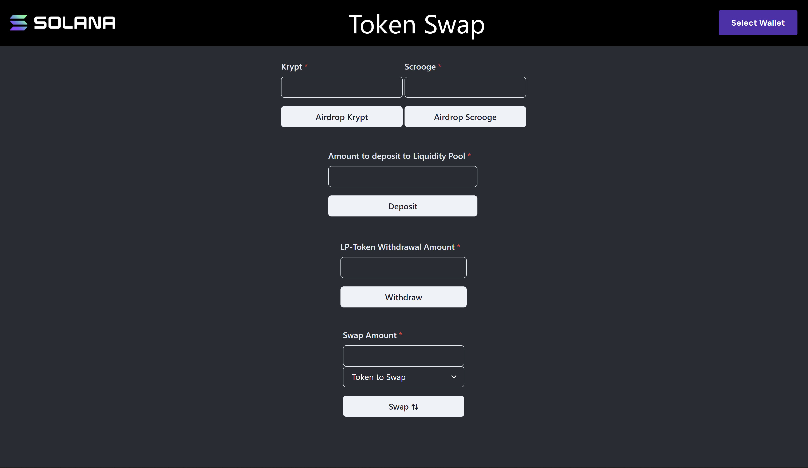

# TL;DR

- Ang **Token Swap Program** ay isang kontrata ng SPL na naka-deploy sa Devnet na magagamit para sa pagsubok at eksperimento ng mga developer at protocol. Para sa mga kaso ng paggamit sa produksyon, gamitin ang iyong sariling deployment o isa na regular na pinapanatili ng isang mapagkakatiwalaang serbisyo.
- Ang programa ay tumatanggap ng anim na magkakaibang **mga tagubilin**, lahat ng ito ay ating tuklasin sa araling ito.
- Nagagawa ng mga developer na lumikha at gumamit ng **mga liquidity pool** upang magpalit sa pagitan ng anumang SPL token na gusto nila.
- Gumagamit ang program ng mathematical formula na tinatawag na "**curve**" para kalkulahin ang presyo ng lahat ng trade. Nilalayon ng mga curves na gayahin ang normal na dynamics ng market: halimbawa, habang bumibili ang mga trader ng maraming isang uri ng token, tumataas ang halaga ng ibang uri ng token.

# Lesson

## Swap Pools

Bago tayo pumasok sa kung paano gumawa at makipag-ugnayan sa mga swap pool sa Solana, mahalagang maunawaan natin ang mga pangunahing kaalaman kung ano ang swap pool. Ang swap pool ay isang pagsasama-sama ng dalawang magkaibang token na may layuning magbigay ng pagkatubig upang mapadali ang pagpapalitan sa pagitan ng bawat token.

Nagbibigay ang mga user ng liquidity sa mga pool na ito sa pamamagitan ng pagdeposito ng sarili nilang mga token sa bawat pool. Ang mga user na ito ay tinatawag na liquidity providers. Kapag ang isang liquidity provider (o LP) ay nagdeposito ng ilang mga token sa swap pool, ang mga LP-token ay mined na kumakatawan sa fractional na pagmamay-ari ng LP sa pool.

Karamihan sa mga swap pool ay naniningil ng trading fee para sa pagpapadali sa bawat swap. Ang mga bayarin na ito ay binabayaran sa mga LP ayon sa proporsyon ng halaga ng pagkatubig na ibinibigay nila sa pool. Nagbibigay ito ng insentibo para sa mga LP na magbigay ng pagkatubig sa pool.

Kapag handa na ang isang LP na bawiin ang kanilang idinepositong liquidity, ang kanilang LP-token ay sinusunog at ang mga token mula sa pool (proporsyonal sa dami ng LP-token na nasunog) ay ipinapadala sa kanilang wallet.

Ang layunin ng mga swap pool ay upang mapadali ang desentralisadong kalakalan sa pagitan ng mga user. Sa tradisyunal na pananalapi, ang mga user ay nagsasagawa ng mga trade na tulad nito sa pamamagitan ng isang sentralisadong palitan sa gitnang limitasyon [order book](https://www.investopedia.com/terms/o/order-book.asp). Sa pangkalahatan, nangangailangan ito ng pinagkakatiwalaang tagapamagitan ng third-party.

Dahil sa desentralisadong katangian ng cryptocurrency, gayunpaman, mayroon na tayong bagong paraan upang mapadali ang mga pangangalakal. Maraming mga protocol na desentralisadong palitan ang binuo upang samantalahin ito. Ang [Project Serum](https://www.projectserum.com/) ay isang halimbawa ng naturang desentralisadong aklat ng order ng sentral na limitasyon na binuo sa Solana.

Dahil ang mga swap pool ay ganap na desentralisado, kahit sino ay maaaring magbigay ng mga tagubilin sa swap program upang lumikha ng bagong swap pool sa pagitan ng anumang SPL token na gusto nila. Isa itong napakalaking pagtaas na lampas sa tradisyonal na pananalapi. Ang mga swap pool at Automated Market Makers (AMMs) ay isa sa mga pinakakaakit-akit at kumplikadong paksa ng DeFi. Ang mga nakakatuwang detalye ng kung paano gumagana ang mga ito ay nasa labas ng saklaw ng araling ito, ngunit mayroong isang toneladang materyal sa labas na magagamit mo kung interesado kang matuto nang higit pa. Halimbawa, ang Programa ng Solana Token Swap ay lubos na binigyang inspirasyon ng [Uniswap](https://uniswap.org/) at [Balancer](https://balancer.fi/), bawat isa ay nagbibigay ng mahusay na dokumentasyon na mababasa mo sa pamamagitan ng.

## Token Swap Program and `@solana/spl-token-swap`

Hindi tulad ng Token Program, walang Solana-maintained deployment ng Token Swap Program. Sa halip, nagbibigay si Solana ng [source code](https://github.com/solana-labs/solana-program-library/tree/master/token-swap/program) para sa Token Swap Program bilang isang reference na pagpapatupad na maaari mong i-fork at i-deploy ang iyong sarili. Maaari ka ring gumamit ng token swap program na pinapanatili ng isang third party na organisasyon na pinagkakatiwalaan mo. Sa buong araling ito, gagamitin namin ang deployment na pinananatili ng Serum sa address na `SwaPpA9LAaLfeLi3a68M4DjnLqgtticKg6CnyNwgAC8`.

Pinapanatili din ni Solana ang library ng `@solana/spl-token-swap` na JS. Nagbibigay ang library na ito ng mga function ng helper para sa pakikipag-ugnayan sa isang token swap program. Ang bawat helper function ay tumatagal ng argumento na kumakatawan sa isang token swap program ID. Hangga't tinatanggap ng program na iyong ginagamit ang mga tagubilin sa Token Swap, maaari mong gamitin ang library na `@solana/spl-token-swap` kasama nito.

## Creating a Swap Pool

Ang paggawa ng mga swap pool gamit ang SPL Token Swap Program ay talagang nagpapakita ng account, pagtuturo, at mga modelo ng awtorisasyon sa Solana. Ang araling ito ay pagsasama-samahin at bubuo sa ibabaw ng maraming natutunan natin sa ngayon sa kurso. Para sa mga operasyong partikular sa Token Swap Program, gagamitin namin ang library na `@solana/spl-token-swap`.

Habang pinag-uusapan natin ang paggawa ng swap pool, ipagpalagay natin na gumagawa tayo ng swap pool para sa dalawang token na pinangalanang Token A at Token B. Ang paggawa ng swap pool gamit ang `spl-token-swap` library ay kasing simple ng pagpapadala ng transaksyon na may tagubiling ginawa gamit ang function na `TokenSwap.createInitSwapInstruction`. Gayunpaman, mayroong ilang mga account na kailangan mong gawin o kunin nang maaga na kakailanganin kapag gumagawa ng tagubiling iyon:
1. **Token swap state account** - nagtataglay ng impormasyon tungkol sa swap pool
2. **Swap pool authority** - ang PDA na ginamit upang pumirma ng mga transaksyon sa ngalan ng swap program
3. **Mga token account para sa Token A at Token B** - mga token account na magtataglay ng mga token A at B para sa pool
4. **Pool token mint** - ang mint para sa LP-token ng swap pool
5. **Pool token account** - ang token account para sa paunang paggawa ng pool token mint kapag ginawa ang swap account
6. **Pool token fee account** - ang account na binabayaran ng swap pool's trading fees

### Token Swap State Account

Bago ka makagawa ng swap pool, kakailanganin mong gumawa ng token swap state account. Gagamitin ang account na ito para magkaroon ng impormasyon tungkol sa swap pool mismo.

Upang lumikha ng token swap state account, gagamitin mo ang tagubiling `SystemProgram` na `createAccount`.

```tsx
import * as web3 from '@solana/web3'
import { TokenSwap, TOKEN_SWAP_PROGRAM_ID, TokenSwapLayout } from "@solana/spl-token-swap"

const transaction = new Web3.Transaction()
const tokenSwapStateAccount = Web3.Keypair.generate()
const rent = TokenSwap.getMinBalanceRentForExemptTokenSwap(connection)
const tokenSwapStateAccountInstruction = await Web3.SystemProgram.createAccount({
    newAccountPubkey: tokenSwapStateAccount.publicKey,
    fromPubkey: wallet.publicKey,
    lamports: rent,
    space: TokenSwapLayout.span,
    programId: TOKEN_SWAP_PROGRAM_ID
})
transaction.add(tokenSwapStateAccountInstruction)
```

Ilang item na dapat tandaan mula sa halimbawang ito:
1. Makukuha mo ang bilang ng mga lamport na kinakailangan para sa exemption sa upa gamit ang `TokenSwap.getMinBalanceRentForExemptTokenSwap` mula sa library ng `spl-token-swap`.
2. Katulad nito, maaari mong gamitin ang `TokenSwapLayout.span` para sa kinakailangang espasyo sa account.
3. Ang `programId` ay dapat itakda sa `TOKEN_SWAP_PROGRAM_ID`. Itinatakda nito na ang may-ari ng bagong account ay ang Token Swap Program mismo. Ang Token Swap Program ay kailangang magsulat ng data sa bagong account at sa gayon ay dapat itakda bilang may-ari.

### Swap Pool Authority

Ang awtoridad sa swap pool ay ang account na ginamit upang mag-sign para sa mga transaksyon sa ngalan ng swap program. Ang account na ito ay isang Program Derived Address (PDA) na nagmula sa Token Swap Program at ang token swap state account.

Ang mga PDA ay maaari lamang gawin sa pamamagitan ng kanilang pagmamay-ari na programa, kaya hindi mo kailangang direktang gawin ang account na ito. Gayunpaman, kailangan mong malaman ang pampublikong susi nito. Maaari mo itong matuklasan gamit ang function ng `@solana/web3` library na `PublicKey.findProgramAddress`.

```tsx
const [swapAuthority, bump] = await Web3.PublicKey.findProgramAddress(
    [tokenSwapStateAccount.publicKey.toBuffer()],
    TOKEN_SWAP_PROGRAM_ID,
)
```

Ang magreresultang public key ay gagamitin bilang awtoridad sa ilang mga account na kasunod.

### Token accounts for Token A and Token B

Ang Token A at Token B account ay nauugnay na mga token account na ginagamit para sa aktwal na swap pool. Ang mga account na ito ay dapat maglaman ng ilang bilang ng A/B token ayon sa pagkakabanggit at ang swap authority PDA ay dapat markahan bilang may-ari ng bawat isa upang ang Token Swap Program ay makapag-sign para sa mga transaksyon at maglipat ng mga token mula sa bawat account.

```tsx
let tokenAAccountAddress = await token.getAssociatedTokenAddress(
    tokenAMint, // mint
    swapAuthority, // owner
    true // allow owner off curve
)

const tokenAAccountInstruction = await token.createAssociatedTokenAccountInstruction(
    wallet.publicKey, // payer
    tokenAAccountAddress, // ata
    swapAuthority, // owner
    tokenAMint // mint
)

transaction.add(tokenAAccountInstruction)
```

Kung kailangan mo ng refresher sa paggawa ng mga token account, tingnan ang [aralin sa Token Program](../token-program.md).

### Pool Token Mint

Ang pool token mint ay ang mint ng LP-token na kumakatawan sa pagmamay-ari ng isang LP sa pool. Ginagawa mo ang mint na ito sa paraang natutunan mo sa [aralin sa Token Program](../token-program.md). Para gumana ang swap pool, ang mint authority ay dapat ang swap authority account.

```tsx
const poolTokenMint = await token.createMint(
    connection,
    wallet,
    swapAuthority,
    null,
    2
)
```

### Pool Token Account

Ang pool token account ay ang account kung saan na-minted ang mga paunang liquidity pool token noong unang ginawa ang swap account. Ang kasunod na pag-minting ng mga LP-token ay direktang ilalagay sa account ng user na nagdaragdag ng liquidity sa pool. Ang mga token ng liquidity pool ay kumakatawan sa pagmamay-ari sa nadepositong liquidity sa pool.

```tsx
const tokenAccountPool = Web3.Keypair.generate()
const rent = await token.getMinimumBalanceForRentExemptAccount(connection)
const createTokenAccountPoolInstruction = Web3.SystemProgram.createAccount({
    fromPubkey: wallet.publicKey,
    newAccountPubkey: tokenAccountPool.publicKey,
    space: token.ACCOUNT_SIZE,
    lamports: rent,
    programId: token.TOKEN_PROGRAM_ID,
})
const initializeTokenAccountPoolInstruction = token.createInitializeAccountInstruction(
    tokenAccountPool.publicKey,
    poolTokenMint,
    wallet.publicKey
)

transaction.add(createTokenAccountPoolInstruction)
transaction.add(initializeTokenAccountPoolInstruction)
```

### Pool Token Fee Account

Ang pool token fee account ay ang token account kung saan binabayaran ang mga bayarin para sa mga token swaps. Para sa Serum deployment ng Token Swap Program na ginagamit namin, ang account na ito ay dapat na pagmamay-ari ng isang partikular na account na tinukoy sa swap program: [HfoTxFR1Tm6kGmWgYWD6J7YHVy1UwqSULUGVLXkJqaKN](https://explorer.solana.com/address/HfoTxFR1TmYGWGWJWGWysGWGWJGWGWGWGWJSULU KN?cluster=devnet ).

```tsx
const feeOwner = new web3.PublicKey('HfoTxFR1Tm6kGmWgYWD6J7YHVy1UwqSULUGVLXkJqaKN')

let tokenFeeAccountAddress = await token.getAssociatedTokenAddress(
    poolTokenMint, // mint
    feeOwner, // owner
    true // allow owner off curve
)

const tokenFeeAccountInstruction = await token.createAssociatedTokenAccountInstruction(
    wallet.publicKey, // payer
    tokenFeeAccountAddress, // ata
    feeOwner, // owner
    poolTokenMint // mint
)

transaction.add(tokenFeeAccountInstruction)
```

### Create the swap pool

Sa lahat ng kinakailangang account na ginawa, maaari kang gumawa ng swap pool initialization instruction gamit ang `TokenSwap.createInitSwapInstruction` mula sa `spl-token-swap` library.

Ang function na ito ay tumatagal ng *maraming* ng mga argumento. Pag-usapan natin sila.

Ang unang 7 argumento ay ang mga kinakailangang token account na tinalakay lang natin.

Pagkatapos nito, darating ang constant na kumakatawan sa Token Program ID na sinusundan ng constant na kumakatawan sa Token Swap Program ID.

Susunod, mayroong 4 na pares ng mga argumento ng numero na kumakatawan sa mga numerator at denominator para sa bayad sa kalakalan, bayad sa kalakalan ng may-ari, bayad sa pag-withdraw ng may-ari, at bayad sa host. Ang pagtuturo ay gumagamit ng numerator at denominator para sa bawat isa upang kalkulahin ang porsyento ng bayad. Ipaliwanag natin ang bawat isa sa mga bayarin:

1. **Trade fee** - mga bayarin na pinapanatili ng mga swap pool token account sa panahon ng isang trade at pinapataas ang nare-redeem na halaga ng LP-token. Ang bayad na ito ay nagbibigay ng reward sa mga user para sa pagbibigay ng liquidity sa swap pool.
2. **Bayaran sa pangangalakal ng may-ari** - mga bayarin na pinapanatili ng mga swap pool token account sa panahon ng isang kalakalan, na may katumbas na LP-token na ibinibigay sa may-ari ng programa
3. **Bayaran sa pag-withdraw ng may-ari** - mga dagdag na LP-token na ipinapadala sa may-ari sa bawat pag-withdraw
4. **Host fee** - isang proporsyon ng mga bayarin sa pangangalakal ng may-ari, na ipinadala sa isang karagdagang host token account na ibinigay sa panahon ng kalakalan. Ang bayad na ito ay nagbibigay ng insentibo sa mga panlabas na partido (tulad ng isang desentralisadong palitan) na magbigay ng mga frontend para sa swap pool at bigyan sila ng isang bahagi.

Kapag gumagamit ng swap program na na-deploy at pinananatili ng isang third party, ang mga bayarin na ito ay maaaring maayos o hindi upang *dapat* ipasok mo ang mga tamang argumento. Kakailanganin mong suriin ang pagpapatupad ng backing program.

Panghuli, mayroong uri ng kurba, na tatalakayin pa natin sa susunod na aralin.

```tsx
const createSwapInstruction = TokenSwap.createInitSwapInstruction(
    tokenSwapStateAccount,      // Token swap state account
    swapAuthority,              // Swap pool authority
    poolTokenA,                 // Token A token account
    poolTokenB,                 // Token B token account
    poolTokenMint,              // Swap pool token mint
    tokenFeeAccountAddress,     // Token fee account
    tokenAccountPool.publicKey, // Swap pool token account
    token.TOKEN_PROGRAM_ID,     // Token Program ID
    TOKEN_SWAP_PROGRAM_ID,      // Token Swap Program ID
    0,                          // Trade fee numerator
    10000,                      // Trade fee denominator
    5,                          // Owner trade fee numerator
    10000,                      // Owner trade fee denominator
    0,                          // Owner withdraw fee numerator
    0,                          // Owner withdraw fee denominator
    20,                         // Host fee numerator
    100,                        // Host fee denominator
    CurveType.ConstantProduct   // Curve type
)

transaction.add(createSwapInstruction)
```

Kapag matagumpay na naisagawa ang isang transaksyon sa mga tagubiling ito, ang swap pool ay gagawin at handa nang gamitin.

## Interacting with Swap Pools

Kapag nasimulan na ang swap pool, ang Token Swap Program ay may ilang magkakaibang mga tagubilin para sa paggamit ng swap pool. Kabilang dito ang:
1. Pagsasagawa ng swap
2. Pagdeposito ng pagkatubig
3. Pag-withdraw ng pagkatubig

### Execute a swap

Makakapagsimula kaagad ang mga user sa pangangalakal sa isang swap pool gamit ang tagubilin sa swap. Ang pagtuturo ng swap ay naglilipat ng mga pondo mula sa token account ng isang user papunta sa token account ng swap pool. Ang swap pool ay nagmi-mint ng LP-token sa LP-token account ng user.

Dahil kinakailangan ng mga programang Solana na ideklara ang lahat ng account sa pagtuturo, kailangan ng mga user na ipunin ang lahat ng impormasyon ng account mula sa token swap state account: ang token A at B account, pool token mint, at fee account.

Nagpapalit kami ng mga token gamit ang `TokenSwap.swapInstruction` helper function na nangangailangan ng mga sumusunod na argumento:
1. `tokenSwap` - ang token swap state account
2. `authority` - ang swap pool authority
3. `userTransferAuthority` - ang delegado sa token account ng user
4. `userSource` - user token account para maglipat ng mga token sa swap
5. `poolSource` - swap pool token account upang makatanggap ng mga token na inilipat mula sa user
6. `poolDestination` - swap pool token account upang magpadala ng mga token sa user
7. `userDestination` - token account ng user para makatanggap ng mga token na ipinadala mula sa swap pool
8. `poolMint` - ang LP-token mint address
9. `feeAccount` - ang token account na tumatanggap ng mga bayarin sa pangangalakal ng may-ari
10. `hostFeeAccount` - ang token account na tumatanggap ng host trade fees (opsyonal na parameter), nakatakda sa null kung walang ibinigay
11. `swapProgramId` - ang address ng Token Swap Program
12. `tokenProgramId` - ang address ng Token Program
13. `amountIn` - halaga ng mga token na gustong ilipat ng user sa swap pool
14. `minimumAmountOut` - pinakamababang halaga ng mga token na ipinapadala sa token account ng user. Ang parameter na ito ay ginagamit upang isaalang-alang ang slippage. Ang slippage ay ang pagkakaiba sa pagitan ng halaga ng isang token kapag isinumite mo ang transaksyon kumpara sa kung kailan natupad ang order. Sa kasong ito, mas mababa ang numero, mas maraming slippage ang posibleng mangyari nang hindi nabigo ang transaksyon. Sa buong araling ito, gagamitin namin ang 0 para sa mga swap dahil ang pagkalkula ng slippage ay nasa labas ng saklaw ng araling ito. Sa isang production app, gayunpaman, mahalagang hayaan ang mga user na tukuyin ang dami ng slippage kung saan sila komportable.

Ang pagtuturo para sa pagpapalit ng token A para sa token B ay magiging ganito:

```tsx
const swapInstruction = TokenSwap.swapInstruction(
    tokenSwapStateAccount,
    swapAuthority,
    userPublicKey,
    userTokenA,
    poolTokenA,
    poolTokenB,
    userTokenB,
    poolMint,
    feeAccount,
    null,
    TOKEN_SWAP_PROGRAM_ID,
    TOKEN_PROGRAM_ID,
    amount * 10 ** MintInfoTokenA.decimals,
    0
)

transaction.add(swapInstruction)
```

### Deposit liquidity

Ang Token Swap Program ay may dalawang variation ng mga tagubilin sa deposito. Pinapayagan ng isa ang mga user na magdeposito lang ng mga token sa isang bahagi ng swap pool sa bawat pagkakataon. Ang isa ay nagbibigay-daan para sa mga user na magdeposito sa magkabilang panig ng swap pool nang sabay.

Para makapagdeposito ng liquidity sa magkabilang panig ng swap pool, ang wallet ng user ay dapat may sapat na halaga ng bawat token. Kapag nagdedeposito ng parehong token, sa halip na ibigay ang halaga ng bawat token na idedeposito, tinutukoy ng user ang halaga ng LP-token na gusto nilang matanggap. Pagkatapos ay kinakalkula ng Token Swap Program ang halaga ng bawat token na matatanggap ng isang depositor dahil sa curve ng pool at kasalukuyang pagkatubig.

Maaari naming ideposito ang parehong mga token nang sabay-sabay gamit ang function na helper na `TokenSwap.depositAllTokenTypesInstruction` na nangangailangan ng mga sumusunod na argumento:
1. `tokenSwap` - ang token swap state account
2. `authority` - ang swap pool authority
3. `userTransferAuthority` - ang awtoridad sa mga token account ng user
4. `sourceA` - user token Isang account para maglipat ng mga token sa swap pool token A account
5. `sourceB` - user token B account para maglipat ng mga token sa swap pool token B account
6. `intoA` - swap pool token account A para makatanggap ng token A ng user
7. `intoB` - swap pool token account B upang makatanggap ng token B ng user
8. `poolToken` - ang LP-token mint address
9. `poolAccount` - user LP-token account ang swap pool ay mints ang LP-token sa
10. `swapProgramId` - ang address ng Token Swap Program
11. `tokenProgramId` - ang address ng Token Program
12. `poolTokenAmount` - halaga ng LP-token na inaasahan na matatanggap ng depositor
13. `maximumTokenA` - maximum na halaga ng token A na pinapayagang magdeposito
14. `maximumTokenB` - maximum na halaga ng token A na pinapayagang magdeposito

Ang mga argumentong `maximumTokenA` at `maximumTokenB` ay ginagamit upang maiwasan ang pagkadulas. Kung mas mataas ang numero, mas maraming slippage ang posibleng mangyari nang walang pagkabigo sa transaksyon. Para sa pagiging simple, gagamit kami ng napakalaking numero para sa mga argumentong ito.

Ang pagtuturo para sa pagdeposito ng parehong token A at token B ay magiging ganito:

```tsx
const instruction = TokenSwap.depositAllTokenTypesInstruction(
    tokenSwapStateAccount,
    swapAuthority,
    userPublicKey,
    userTokenA,
    userTokenB,
    poolTokenA,
    poolTokenB,
    poolMint,
    userPoolToken,
    TOKEN_SWAP_PROGRAM_ID,
    TOKEN_PROGRAM_ID,
    poolTokenAmount * 10 ** MintInfoPoolToken.decimals,
    100e9,
    100e9
)

transaction.add(instruction)
```

Maaari kaming magdeposito ng mga token sa isang bahagi lamang ng swap pool sa katulad na paraan gamit ang `TokenSwap.depositSingleTokenTypeExactAmountInInstruction`. Ang pangunahing pagkakaiba ay ang huling argumento sa pagtuturo ay `minimumPoolTokenAmount`. Kapag nagdedeposito sa isang bahagi lamang ng swap pool, eksaktong tinukoy ng user kung gaano karaming mga token ang idedeposito. Kaugnay nito, kinakalkula ng Token Swap Program ang halaga ng mga LP-token upang i-mint ang user para sa kanilang deposito. Ang isang tagubilin na nagdedeposito lamang ng Token A ay magiging ganito:

```tsx
const instruction = TokenSwap.depositSingleTokenTypeExactAmountInInstruction(
    tokenSwapStateAccount,
    swapAuthority,
    userPublicKey,
    userTokenA,
    poolTokenA,
    poolMint,
    userPoolToken,
    TOKEN_SWAP_PROGRAM_ID,
    TOKEN_PROGRAM_ID,
    DepositAmountTokenA * 10 ** MintInfoTokenA.decimals,
    0,
)

transaction.add(instruction)
```

### Withdraw liquidity

Kapalit ng pagbibigay ng liquidity, ang mga depositor ay tumatanggap ng LP-token na kumakatawan sa kanilang fractional na pagmamay-ari ng lahat ng A at B na token sa pool. Sa anumang oras, maaaring i-redeem ng mga provider ng liquidity ang kanilang LP-token kapalit ng mga token A at B sa kasalukuyang "patas" na halaga ng palitan ayon sa tinutukoy ng curve. Kapag na-withdraw ang liquidity, ililipat ang mga token A at/o B sa mga token account ng user at masusunog ang LP-token ng user.

Ang Token Swap Program ay may dalawang variation ng withdraw instructions. Ang isa ay nagpapahintulot sa mga user na mag-withdraw lamang ng mga token mula sa isang bahagi ng swap pool sa isang pagkakataon. Ang isa ay nagbibigay-daan para sa pag-withdraw mula sa magkabilang panig ng swap pool sa parehong oras.

Maaari naming i-withdraw ang parehong mga token nang sabay-sabay gamit ang `TokenSwap.withdrawAllTokenTypesInstruction` helper function na nangangailangan ng mga sumusunod na argumento:
1. `tokenSwap` - ang token swap state account
2. `authority` - ang swap pool authority
3. `userTransferAuthority` - ang awtoridad sa mga token account ng user
4. `poolMint` - ang LP-token mint address
5. `feeAccount` - ang token account na tumatanggap ng mga bayad sa withdraw ng may-ari
6. `sourcePoolAccount` - user LP-token account para mag-burn ng pool token LP-token mula sa
7. `fromA` - swap pool token Isang account kung saan aalisin
8. `fromB` - swap pool token B account upang bawiin
9. `userAccountA` - user token Isang account para makatanggap ng mga token na na-withdraw mula sa swap pool token Isang account
10. `userAccountB` - user token B account para makatanggap ng mga token na na-withdraw mula sa swap pool token B account
11. `swapProgramId` - ang address ng Token Swap Program
12. `tokenProgramId` - ang address ng Token Program
13. `poolTokenAmount` - halaga ng LP-token na inaasahan ng user na masunog sa pag-withdraw
14. `minimumTokenA` - pinakamababang halaga ng token A na bawiin
15. `minimumTokenB` - pinakamababang halaga ng token B na bawiin

Ang mga argumentong `minimumTokenA` at `minimumTokenB` ay ginagamit upang maiwasan ang pagkadulas. Kung mas mababa ang numero, mas maraming slippage ang posibleng mangyari. Para sa pagiging simple, gagamitin namin ang 0 para sa mga argumentong ito.

Ang pagtuturo para sa pagdeposito ng parehong token A at token B ay magiging ganito:

```tsx
const instruction = TokenSwap.withdrawAllTokenTypesInstruction(
    tokenSwapStateAccount,
    swapAuthority,
    userPublicKey,
    poolMint,
    feeAccount,
    userPoolToken,
    poolTokenA,
    poolTokenB,
    userTokenA,
    userTokenB,
    TOKEN_SWAP_PROGRAM_ID,
    TOKEN_PROGRAM_ID,
    poolTokenAmount * 10 ** MintInfoPoolToken.decimals,
    0,
    0
)

transaction.add(instruction)
```

Maaari kaming mag-withdraw ng mga token mula sa isang bahagi lamang ng swap pool sa katulad na paraan gamit ang `TokenSwap.withdrawSingleTokenTypeExactAmountOut`. Ang pangunahing pagkakaiba ay ang huling argumento sa pagtuturo ay `maximumPoolTokenAmount`. Kapag nag-withdraw lamang ng isang bahagi ng swap pool, tinutukoy ng user kung gaano karaming mga token ang aalisin. Kaugnay nito, kinakalkula ng Token Swap Program ang halaga ng mga LP-token na dapat sunugin ng user. Ang isang pagtuturo na nag-withdraw lamang ng Token B ay magiging ganito:

```tsx
const instruction = TokenSwap.depositSingleTokenTypeExactAmountInInstruction(
    tokenSwapStateAccount,
    swapAuthority,
    userPublicKey,
    poolMint,
    feeAccount,
    poolTokenB,
    userTokenB,
    TOKEN_SWAP_PROGRAM_ID,
    TOKEN_PROGRAM_ID,
    WithdrawAmountTokenB * 10 ** MintInfoTokenB.decimals,
    100e9,
)

transaction.add(instruction)
```

## Curves

Ang mga curve ng kalakalan ay nasa core ng kung paano gumagana ang mga swap pool at AMM (Automated Market Makers). Ang trading curve ay ang function na ginagamit ng Token Swap Program upang kalkulahin kung gaano karami sa isang destination token ang ibibigay na may halaga ng source token. Itinatakda ng curve ang presyo sa merkado ng mga token sa pool.

Gumagamit ang pool na makikipag-ugnayan tayo sa araling ito ng [Constant Product](https://spl.solana.com/token-swap#curves) Curve Function. Ang pare-parehong curve ng produkto ay ang kilalang Uniswap at Balancer style curve na nagpapanatili ng invariant sa lahat ng swap. Ang invariant na ito ay maaaring ipahayag bilang produkto ng dami ng token A at token B sa swap pool.

```tsx
A_total * B_total = invariant
```

Kung mayroon tayong 100 token A at 5,000 token B, ang ating invariant ay 500,000.

Ngayon, kung nais ng isang mangangalakal na maglagay ng isang tiyak na halaga ng token A para sa ilang halaga ng token B, ang pagkalkula ay magiging isang bagay sa paglutas ng "B_out" kung saan:

```tsx
(A_total + A_in) * (B_total - B_out) = invariant
```

Ang paglalagay ng 10 token A kasama ang aming invariant na kalahating milyon, kakailanganin naming lutasin ang "B_out" tulad nito:

```tsx
(100 + 10) * (5,000 - B_out) = 500,000
5,000 - B_out = 500,000 / 110
5,000 - (500,000 / 110) = B_out
B_out = 454.5454...
```

Ang produkto ng halaga ng token A at token B ay dapat palaging katumbas ng isang pare-pareho, kaya't ang pangalan ay 'Constant Product'. Higit pang impormasyon ang makikita sa [Uniswap whitepaper](https://uniswap.org/whitepaper.pdf) at sa [Balancer whitepaper](https://balancer.fi/whitepaper.pdf).

Kung ang mga kurba ay walang kahulugan, huwag mag-alala! Bagama't hindi masakit ang pag-aaral ng higit pa tungkol sa kung paano gumagana ang mga ito, hindi mo kailangang maunawaan ang kabuuan ng matematika upang maipatupad ang mga karaniwang kurba.

# Demo

Para sa demo na ito, isang token pool ng dalawang bagong token ang nagawa at live sa Devnet. Tatalakayin namin ang pagbuo ng isang frontend UI upang makipag-ugnayan sa swap pool na ito! Dahil ang pool ay ginawa na, hindi namin kailangang mag-alala tungkol sa pagsisimula ng pool at pagpopondo dito ng mga token. Sa halip, magtutuon kami sa pagbuo ng mga tagubilin para sa

- pagdeposito ng pagkatubig sa pool
- pag-withdraw ng iyong idineposito na pagkatubig
- pagpapalit mula sa isang token patungo sa isa pa



### 1. Download the starter code

Bago tayo magsimula, magpatuloy at i-download ang [starter code](https://github.com/Unboxed-Software/solana-token-swap-frontend/tree/starter).

Ang proyekto ay isang medyo simpleng Next.js na application na muling gumagamit ng marami sa kung ano ang dating binuo para sa demo sa [aralin sa Token Program](./token-program.md). Tulad ng nakikita mo mula sa larawan sa itaas, mayroong ilang iba't ibang mga input ng teksto at mga pindutan - lahat ng ito ay magsusumite ng mga transaksyon sa blockchain sa ngalan ng gumagamit. Ang aming pagtuon sa demo na ito ay ang paggawa ng mga tagubilin na isusumite ng huling tatlong button.

Naipatupad na ang mga button ng airdrop at dapat gumana sa labas ng kahon. Gumagamit sila ng isang airdrop program na naka-deploy sa Devnet sa address na [CPEV4ibq2VUv7UnNpkzUGL82VRzotbv2dy8vGwRfh3H3](https://explorer.solana.com/address/CPEV4ibq2VUv7UnNpkzUGL82fVRzotb3dev? Maaari kang mag-mint ng maraming token hangga't gusto mo sa iyong wallet upang makipag-ugnayan sa pool.

### 2. Create the Deposit Instruction

Sa dalawang variation ng mga tagubilin sa deposito sa Token Swap Program, gagamitin namin ang variation na nagbibigay ng liquidity sa magkabilang panig ng swap pool nang sabay-sabay: `TokenSwap.depositAllTokenTypesInstruction`.

Dapat idagdag ang pagtuturo ng deposito sa loob ng `/components/Deposit.tsx` file sa loob ng function na `handleTransactionSubmit`. Ang function na ito ay tinatawag kapag ang user ay nag-click sa Deposit button.

Magsisimula tayo sa pagkuha ng tatlong nauugnay na address ng token account:
1. Ang nauugnay na token account na naaayon sa wallet address ng user at Krypt Coin
2. Ang nauugnay na token account na naaayon sa wallet address ng user at Scrooge Coin
3. Ang nauugnay na token account na naaayon sa wallet address ng user at ang swap pools LP token

Mayroong ilang mga paraan upang gawin ito, ngunit gagamitin namin ang helper function na `getAssociatedTokenAddress` mula sa `spl-token` library.

Kakailanganin din namin ang data na nauugnay sa pool token mint para isaayos ang input ng user para sa mga decimal ng pool token. Para ma-access ang data ng token mint, gagamitin namin ang helper function na `getMint` mula sa `spl-token` library.

```tsx
const handleTransactionSubmit = async (deposit: DepositAllSchema) => {
    if (!publicKey) {
        alert('Please connect your wallet!')
        return
    }
	// these are the accounts that hold the tokens
    const kryptATA = await token.getAssociatedTokenAddress(kryptMint, publicKey)
    const scroogeATA = await token.getAssociatedTokenAddress(ScroogeCoinMint, publicKey)
	const tokenAccountPool = await token.getAssociatedTokenAddress(pool_mint, publicKey)

    // poolMintInfo holds data we've fetched for the pool token mint
    const poolMintInfo = await token.getMint(connection, poolMint)
}
```

Susunod, kailangan naming suriin kung ang `tokenAccountPool` na address na kakakuha lang namin ay nagawa na. Gagamitin namin ang function na `getAccountInfo` mula sa library ng `@solana/web3` upang makuha ang impormasyon ng account na nauugnay sa `tokenAccountPool`. Ang function na ito ay magbabalik ng `AccountInfo` struct kung ang account ay umiiral o `null` kung hindi. Kung ibinalik ang `null`, kakailanganin naming gawin ang account.

Dahil ang function na `handleTransactionSubmit` ay magsusumite na ng transaksyon, idaragdag lang namin ang tagubilin para sa paggawa ng nauugnay na account sa parehong transaksyon sa halip na magsumite ng maraming transaksyon.

```tsx
const handleTransactionSubmit = async () => {
    if (!publicKey) {
        alert('Please connect your wallet!')
        return
    }

    const kryptATA = await token.getAssociatedTokenAddress(kryptMint, publicKey)
    const scroogeATA = await token.getAssociatedTokenAddress(ScroogeCoinMint, publicKey)
    const tokenAccountPool = await token.getAssociatedTokenAddress(pool_mint, publicKey)

    const poolMintInfo = await token.getMint(connection, poolMint)

    const transaction = new Web3.Transaction()

    let account = await connection.getAccountInfo(tokenAccountPool)

    if (account == null) {
        const createATAInstruction =
            token.createAssociatedTokenAccountInstruction(
                publicKey,
                tokenAccountPool,
                publicKey,
                pool_mint
            )
        transaction.add(createATAInstruction)
    }
}
```

Sa wakas, maaari tayong lumikha ng pagtuturo ng deposito gamit ang function ng helper na `TokenSwap.depositAllTokenTypesInstruction` library ng `spl-token-swap`. Pagkatapos ay idinagdag namin ang pagtuturo at isumite ang transaksyon.

```tsx
const handleTransactionSubmit = async () => {
    if (!publicKey) {
        alert("Please connect your wallet!")
        return
    }

    const kryptATA = await token.getAssociatedTokenAddress(
        kryptMint,
        publicKey
    )

    const scroogeATA = await token.getAssociatedTokenAddress(
        ScroogeCoinMint,
        publicKey
    )

    const tokenAccountPool = await token.getAssociatedTokenAddress(
        poolMint,
        publicKey
    )

    const poolMintInfo = await token.getMint(connection, poolMint)

    const transaction = new Web3.Transaction()

    let account = await connection.getAccountInfo(tokenAccountPool)

    if (account == null) {
        const createATAInstruction =
            token.createAssociatedTokenAccountInstruction(
                publicKey,
                tokenAccountPool,
                publicKey,
                poolMint
            )
        transaction.add(createATAInstruction)
    }

    const instruction = TokenSwap.depositAllTokenTypesInstruction(
        tokenSwapStateAccount,
        swapAuthority,
        publicKey,
        kryptATA,
        scroogeATA,
        poolKryptAccount,
        poolScroogeAccount,
        poolMint,
        tokenAccountPool,
        TOKEN_SWAP_PROGRAM_ID,
        token.TOKEN_PROGRAM_ID,
        poolTokenAmount * 10 ** poolMintInfo.decimals,
        100e9,
        100e9
    )

    transaction.add(instruction)

    try {
        let txid = await sendTransaction(transaction, connection)
        alert(
            `Transaction submitted: https://explorer.solana.com/tx/${txid}?cluster=devnet`
        )
        console.log(
            `Transaction submitted: https://explorer.solana.com/tx/${txid}?cluster=devnet`
        )
    } catch (e) {
        console.log(JSON.stringify(e))
        alert(JSON.stringify(e))
    }
}
```

Maliban sa `publickey` ng user at sa kanilang mga nakuhang nauugnay na token account (para sa Krypt Coin, Scrooge Coin, at LP-token ng pool), pansinin na ang lahat ng mga account ay mga constant para sa swap pool na ito at tinukoy sa `const. ts` file.

Sa puntong ito, dapat mong mai-airdrop ang iyong sarili ng ilang mga token at pagkatapos ay ideposito ang mga ito sa swap pool!

### 3. Create the Withdrawal Instruction

Ang pagtuturo sa pag-withdraw ay halos kapareho sa pagtuturo ng deposito, ngunit may ilang mga banayad na pagkakaiba. Tulad ng mga deposito, ang Token Swap Program ay tumatanggap ng dalawang variation ng pagtuturo sa pag-withdraw. Maaari mong i-withdraw ang liquidity mula sa isang bahagi ng swap pool, o maaari mong bawiin ang iyong idinepositong liquidity mula sa magkabilang panig nang sabay-sabay.

Sa dalawang variation ng mga tagubilin sa pag-withdraw sa Token Swap Program, gagamitin namin ang variation na nag-aalis ng liquidity sa magkabilang panig ng swap pool nang sabay-sabay: `TokenSwap.withdrawAllTokenTypesInstruction`.

Dapat idagdag ang tagubilin sa pag-withdraw sa loob ng file na `/components/Withdraw.tsx` sa loob ng function na `handleTransactionSubmit`. Tinatawag ang function na ito kapag na-click ng user ang button na Withdraw.

Magsisimula kami sa pamamagitan ng pagkuha ng tatlong nauugnay na token account address, pagkuha ng pool token mint data, at pagsuri sa `tokenAccountPool` na address sa parehong paraan na ginawa namin para sa pagtuturo ng deposito.

```tsx
const handleTransactionSubmit = async () => {
    if (!publicKey) {
        alert('Please connect your wallet!')
        return
    }

    const kryptATA = await token.getAssociatedTokenAddress(kryptMint, publicKey)
    const scroogeATA = await token.getAssociatedTokenAddress(ScroogeCoinMint, publicKey)
    const tokenAccountPool = await token.getAssociatedTokenAddress(pool_mint, publicKey)

    const poolMintInfo = await token.getMint(connection, poolMint)

    const transaction = new Web3.Transaction()

    let account = await connection.getAccountInfo(tokenAccountPool)

    if (account == null) {
        const createATAInstruction =
            token.createAssociatedTokenAccountInstruction(
                publicKey,
                tokenAccountPool,
                publicKey,
                pool_mint
            )
        transaction.add(createATAInstruction)
    }
}
```

Susunod, gagawa kami ng tagubilin sa pag-withdraw gamit ang function ng helper na `TokenSwap.withdrawAllTokenTypesInstruction` ng library ng `spl-token-swap`. Pagkatapos ay idinagdag namin ang pagtuturo at isumite ang transaksyon.

```tsx
const handleTransactionSubmit = async () => {
    if (!publicKey) {
        alert("Please connect your wallet!")
        return
    }

    const kryptATA = await token.getAssociatedTokenAddress(
        kryptMint,
        publicKey
    )
    const scroogeATA = await token.getAssociatedTokenAddress(
        ScroogeCoinMint,
        publicKey
    )
    const tokenAccountPool = await token.getAssociatedTokenAddress(
        poolMint,
        publicKey
    )

    const poolMintInfo = await token.getMint(connection, poolMint)

    const transaction = new Web3.Transaction()

    let account = await connection.getAccountInfo(tokenAccountPool)

    if (account == null) {
        const createATAInstruction =
            token.createAssociatedTokenAccountInstruction(
                publicKey,
                tokenAccountPool,
                publicKey,
                poolMint
            )
        transaction.add(createATAInstruction)
    }

    const instruction = TokenSwap.withdrawAllTokenTypesInstruction(
        tokenSwapStateAccount,
        swapAuthority,
        publicKey,
        poolMint,
        feeAccount,
        tokenAccountPool,
        poolKryptAccount,
        poolScroogeAccount,
        kryptATA,
        scroogeATA,
        TOKEN_SWAP_PROGRAM_ID,
        TOKEN_PROGRAM_ID,
        poolTokenAmount * 10 ** poolMintInfo.decimals,
        0,
        0
    )

    transaction.add(instruction)
    try {
        let txid = await sendTransaction(transaction, connection)
        alert(
            `Transaction submitted: https://explorer.solana.com/tx/${txid}?cluster=devnet`
        )
        console.log(
            `Transaction submitted: https://explorer.solana.com/tx/${txid}?cluster=devnet`
        )
    } catch (e) {
        console.log(JSON.stringify(e))
        alert(JSON.stringify(e))
    }
}
```

Pansinin na ang pagkakasunud-sunod ng mga account ay iba para sa transaksyon sa pag-withdraw at mayroong karagdagang `feeAccount` na ibinigay sa oras na ito. Ang `feeAccount` na ito ay ang destinasyon para sa bayad na dapat bayaran ng user para sa pag-withdraw ng liquidity mula sa mga pool.

### 4. Create the Swap Instruction

Ngayon ay oras na upang ipatupad ang aktwal na layunin ng programang ito - ang pagtuturo ng swap!

Tandaan na ang aming UI ay may dropdown upang payagan ang mga user na pumili kung aling token ang gusto nilang palitan *mula sa*, kaya kailangan naming gumawa ng aming pagtuturo sa ibang paraan batay sa kung ano ang pipiliin ng user.

Gagawin namin ito sa loob ng function na `handleTransactionSubmit` ng `/components/Swap.tsx` file. Muli, kakailanganin nating kunin ang `Mga Kaugnay na Token Address` ng user para sa bawat token mint (Krypt Coin, Scrooge Coin, at Pool Token) at likhain ang `tokenAccountPool` kung wala pa ito. Bukod pa rito, kukunin namin ang data para sa parehong Krypt Coin at Scrooge Coin upang i-account ang desimal na katumpakan ng mga token.

```tsx
const handleTransactionSubmit = async () => {
    if (!publicKey) {
      alert("Please connect your wallet!")
      return
    }

    const kryptMintInfo = await token.getMint(connection, kryptMint)
    const ScroogeCoinMintInfo = await token.getMint(connection, ScroogeCoinMint)

    const kryptATA = await token.getAssociatedTokenAddress(kryptMint, publicKey)
    const scroogeATA = await token.getAssociatedTokenAddress(ScroogeCoinMint, publicKey)
    const tokenAccountPool = await token.getAssociatedTokenAddress(poolMint, publicKey)
}
```

Mula dito, matutukoy ng input ng user ang aming landas ng pagpapatupad. Ang pinili ng user ay ise-save sa `mint` property, kaya gagamitin namin ito sa sangay sa pagitan ng bawat posibleng pagtuturo.

```tsx
const handleTransactionSubmit = async () => {
    if (!publicKey) {
        alert("Please connect your wallet!")
        return
    }

    const kryptMintInfo = await token.getMint(connection, kryptMint)
    const ScroogeCoinMintInfo = await token.getMint(
        connection,
        ScroogeCoinMint
    )

    const kryptATA = await token.getAssociatedTokenAddress(
        kryptMint,
        publicKey
    )
    const scroogeATA = await token.getAssociatedTokenAddress(
        ScroogeCoinMint,
        publicKey
    )
    const tokenAccountPool = await token.getAssociatedTokenAddress(
        poolMint,
        publicKey
    )

    const transaction = new Web3.Transaction()

    let account = await connection.getAccountInfo(tokenAccountPool)

    if (account == null) {
        const createATAInstruction =
            token.createAssociatedTokenAccountInstruction(
                publicKey,
                tokenAccountPool,
                publicKey,
                poolMint
            )
        transaction.add(createATAInstruction)
    }

    // check which direction to swap
    if (mint == "option1") {
        const instruction = TokenSwap.swapInstruction(
            tokenSwapStateAccount,
            swapAuthority,
            publicKey,
            kryptATA,
            poolKryptAccount,
            poolScroogeAccount,
            scroogeATA,
            poolMint,
            feeAccount,
            null,
            TOKEN_SWAP_PROGRAM_ID,
            TOKEN_PROGRAM_ID,
            amount * 10 ** kryptMintInfo.decimals,
            0
        )

        transaction.add(instruction)
    } else if (mint == "option2") {
        const instruction = TokenSwap.swapInstruction(
            tokenSwapStateAccount,
            swapAuthority,
            publicKey,
            scroogeATA,
            poolScroogeAccount,
            poolKryptAccount,
            kryptATA,
            poolMint,
            feeAccount,
            null,
            TOKEN_SWAP_PROGRAM_ID,
            TOKEN_PROGRAM_ID,
            amount * 10 ** ScroogeCoinMintInfo.decimals,
            0
        )

        transaction.add(instruction)
    }

    try {
        let txid = await sendTransaction(transaction, connection)
        alert(
            `Transaction submitted: https://explorer.solana.com/tx/${txid}?cluster=devnet`
        )
        console.log(
            `Transaction submitted: https://explorer.solana.com/tx/${txid}?cluster=devnet`
        )
    } catch (e) {
        console.log(JSON.stringify(e))
        alert(JSON.stringify(e))
    }
}
```

At iyon na! Kapag naipatupad mo na ang pagtuturo ng swap, dapat na ganap na gumana ang UI at maaari kang mag-airdrop ng iyong sarili ng mga token, magdeposito ng liquidity, mag-withdraw ng iyong liquidity, at magpalit mula sa token patungo sa token!

Mangyaring maglaan ng oras sa code na ito at sa mga konsepto sa araling ito. Ang mga swap pool ay maaaring maging mas kumplikado kaysa sa ipinatupad namin ngayon kaya mahalagang maunawaan ang mga pangunahing kaalaman. Kung kailangan mo ng mas maraming oras sa demo, kunin ito! At kung kailangan mo, tingnan ang [code ng solusyon dito](https://github.com/Unboxed-Software/solana-token-swap-frontend).

# Challenge

Ngayong magkasama kaming nagsagawa ng demo, subukan at gawin ito nang higit pa gamit ang sarili mong mga token!

Sa [aralin ng Token Program](../token-program.md) gumawa ka ng ilang mga token. Ngayon gumawa ng swap pool para sa mga token na iyon at baguhin ang code mula sa demo ng araling ito upang magamit ang iyong mga token at bagong likhang swap pool. Walang code ng solusyon para dito dahil partikular ito sa iyong mga token, kaya dahan-dahan at gawin ito nang paisa-isa. Nakuha mo na ito!