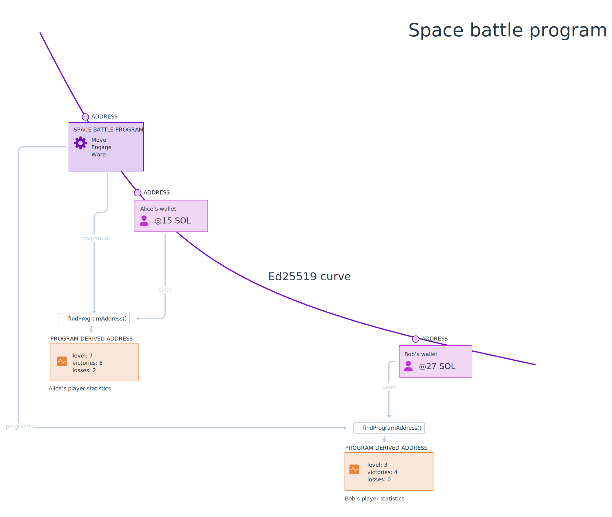

# Résumé

- Les programmes stockent des données dans des PDA, qui signifie **Program Derived Address**.
- Les PDA n'ont pas de clé secrète correspondante.
- Pour stocker et localiser des données, dérivez une PDA en utilisant la méthode `findProgramAddress(seeds, programid)`.
- Vous pouvez obtenir les comptes appartenant à un programme en utilisant `getProgramAccounts(programId)`.
- Les données de compte doivent être désérialisées en utilisant la même structure utilisée pour les stocker en premier lieu. Vous pouvez utiliser `@coral-xyz/borsh` pour créer un schéma.

# Aperçu général

Dans la dernière leçon, nous avons sérialisé les données du programme qui ont ensuite été stockées sur la chaîne par un programme Solana. Dans cette leçon, nous couvrirons en détail comment les programmes stockent les données sur la chaîne, comment récupérer les données et comment désérialiser les données qu'ils stockent.

## Programmes

Comme on dit, tout dans Solana est un compte. Même les programmes. Les programmes sont des comptes qui stockent du code et sont marqués comme exécutables. Ce code peut être exécuté par le runtime Solana lorsqu'il est instruit de le faire. Une adresse de programme est une clé publique sur la courbe elliptique Ed25519. Comme toutes les clés publiques, elles ont des clés secrètes correspondantes.

Les programmes stockent des données séparément de leur code. Les programmes stockent des données dans des PDA, qui signifie **Program Derived Address**. Les PDA sont un concept unique à Solana, mais le modèle est familier :

 - Vous pouvez considérer les PDA comme un magasin de clés, où l'adresse est la clé et les données à l'intérieur du compte sont la valeur.
 - Vous pouvez également considérer les PDA comme des enregistrements dans une base de données, l'adresse étant la clé primaire utilisée pour rechercher les valeurs à l'intérieur.

Les PDA combinent une adresse de programme et quelques seeds choisies par le développeur pour créer des adresses qui stockent des données individuelles. Étant donné que les PDA sont des adresses qui se trouvent *hors* de la courbe elliptique Ed25519, les PDA n'ont pas de clés secrètes. Au lieu de cela, les PDA peuvent être signées par l'adresse de programme utilisée pour les créer.

Les PDA et les données à l'intérieur peuvent être trouvés de manière cohérente en fonction de l'adresse du programme, de sa version et des seeds. Pour trouver une PDA, l'ID du programme et les seeds choisies par le développeur (comme une chaîne de texte) sont transmis à travers la fonction [`findProgramAddress()`](https://solana-labs.github.io/solana-web3.js/classes/PublicKey.html#findProgramAddress).

Jetons un coup d'œil à quelques exemples...

#### Exemple : programme avec état global

Un programme simple qui a un état global - comme notre compteur de ping - pourrait souhaiter n'utiliser qu'une seule PDA, basée sur une phrase de seed simple comme `"GLOBAL_STATE"`. Si le client voulait lire des données de cette PDA, il pourrait dériver l'adresse en utilisant l'ID du programme et cette même seed.

```typescript
const [pda, bump] = await findProgramAddress(Buffer.from("GLOBAL_STATE"), programId)
```


#### Exemple : programme avec des données spécifiques à l'utilisateur

Dans les programmes qui stockent des données spécifiques à un utilisateur, il est courant d'utiliser la clé publique de l'utilisateur comme seed. Cela sépare les données de chaque utilisateur dans sa propre PDA. Cette séparation permet au client de localiser les données de chaque utilisateur en trouvant l'adresse en utilisant l'ID du programme et la clé publique de l'utilisateur.

```typescript
const [pda, bump] = await web3.PublicKey.findProgramAddress(
  [
    publicKey.toBuffer()
  ],
  programId
)
```



#### Exemple : programme avec plusieurs éléments de données par utilisateur

Lorsqu'il y a plusieurs éléments de données par utilisateur, un programme peut utiliser plus de seeds pour créer et identifier des comptes. Par exemple, dans une application de prise de notes, il peut y avoir un compte par note où chaque PDA est dérivée avec la clé publique de l'utilisateur et le titre de la note.

```typescript
const [pda, bump] = await web3.PublicKey.findProgramAddress(
  [
    publicKey.toBuffer(), 
    Buffer.from("Liste de courses")
  ],
  programId,
);
```


Dans cet exemple, nous pouvons voir qu'Alice et Bob ont tous deux une note appelée "Liste de courses", mais comme nous utilisons leur adresse de portefeuille comme l'une des seeds, ces deux notes peuvent coexister en même temps.

### Obtenir plusieurs comptes de programme

En plus de dériver des adresses, vous pouvez récupérer tous les comptes créés par un programme en utilisant `connection.getProgramAccounts(programId)`. Cela renvoie un tableau d'objets où chaque objet a une propriété `pubkey` représentant la clé publique du compte et une propriété `account` de type `AccountInfo`. Vous pouvez utiliser la propriété `account` pour obtenir les données du compte.

```typescript
const accounts = connection.getProgramAccounts(programId).then(accounts => {
  accounts.map(({ pubkey, account }) => {
    console.log('Compte:', pubkey)
    console.log('Tampon de données:', account.data)
  })
})
```

## Désérialiser les données du programme

La propriété `data` sur un objet `AccountInfo` est un tampon. Pour l'utiliser efficacement, vous devrez écrire du code qui le désérialise en quelque chose de plus utilisable. C'est similaire au processus de sérialisation que nous avons couvert dans la dernière leçon. Comme auparavant, nous utiliserons [Borsh](https://borsh.io/) et `@coral-xyz/borsh`. Si vous avez besoin d'un rappel sur l'un ou l'autre de ces éléments, consultez la leçon précédente.

La désérialisation nécessite de connaître la disposition du compte à l'avance. Lors de la création de vos propres programmes, vous définirez comment cela est fait dans le cadre de ce processus. De nombreux programmes ont également une documentation sur la manière de désérialiser les données du compte. Sinon, si le code du programme est disponible, vous pouvez le consulter et déterminer la structure de cette manière.

Pour désérialiser correctement les données d'un programme sur la chaîne, vous devrez créer un schéma côté client qui reflète la manière dont les données sont stockées dans le compte. Par exemple, voici le schéma pour un compte stockant des métadonnées sur un joueur dans un jeu sur la chaîne.

```typescript
import * as borsh from "@coral-xyz/borsh";

borshAccountSchema = borsh.struct([
  borsh.bool("initialized"),
  borsh.u16("playerId"),
  borsh.str("name"),
]);

```

Une fois votre disposition définie, appelez simplement `.decode(buffer)` sur le schéma.

```typescript
import * as borsh from "@coral-xyz/borsh";

borshAccountSchema = borsh.struct([
  borsh.bool("initialized"),
  borsh.u16("playerId"),
  borsh.str("name"),
]);

const { playerId, name } = borshAccountSchema.decode(buffer);

```

# Laboratoire

Pratiquons ensemble en continuant à travailler sur l'application de critique de film de la dernière leçon. Pas de soucis si vous venez juste de commencer cette leçon - il devrait être possible de suivre de toute façon.

Pour rappel, ce projet utilise un programme Solana déployé sur Devnet qui permet aux utilisateurs de critiquer des films. La dernière leçon, nous avons ajouté des fonctionnalités à l'ossature du frontend permettant aux utilisateurs de soumettre des critiques de film mais la liste des critiques montre toujours des données fictives. Corrigeons cela en récupérant les comptes de stockage du programme et en désérialisant les données stockées là-bas.


### 1. Téléchargez le code de départ

Si vous n'avez pas terminé le laboratoire de la dernière leçon ou si vous voulez simplement vous assurer de ne rien avoir manqué, vous pouvez télécharger le [code de départ](https://github.com/Unboxed-Software/solana-movie-frontend/tree/solution-serialize-instruction-data).

Le projet est une application Next.js assez simple. Il comprend le `WalletContextProvider` que nous avons créé dans la leçon Wallets, un composant `Card` pour afficher une critique de film, un composant `MovieList` qui affiche les critiques dans une liste, un composant `Form` pour soumettre une nouvelle critique, et un fichier `Movie.ts` qui contient une définition de classe pour un objet `Movie`.

Notez que lorsque vous exécutez `npm run dev`, les critiques affichées sur la page sont des exemples. Nous allons les remplacer par les vraies critiques.

### 2. Créez la disposition du tampon

Rappelez-vous que pour interagir correctement avec un programme Solana, vous devez savoir comment ses données sont structurées. Un rappel :


Les données exécutables du programme sont dans un compte de programme, mais les critiques individuelles sont conservées dans des PDA. Nous utilisons `findProgramAddress()` pour créer une PDA qui est unique pour chaque portefeuille, pour chaque titre de film. Nous stockerons les données suivantes dans la `data` de la PDA :

1. `initialized`, un booléen représentant si le compte a été initialisé ou non.
2. `rating`, un entier non signé sur 8 bits représentant la note sur 5 que le critique a donnée au film.
3. `title`, une chaîne représentant le titre du film critiqué.
4. `description`, une chaîne représentant la partie écrite de la critique.

Configurer une structure `borsh` dans la classe `Movie` pour représenter la disposition des données du compte de film. Commencez par importer `@coral-xyz/borsh`. Ensuite, créez une propriété statique `borshAccountSchema` et définissez-la sur la structure `borsh` appropriée contenant les propriétés énumérées ci-dessus.

```tsx
import * as borsh from '@coral-xyz/borsh'

export class Movie {
  title: string;
  rating: number;
  description: string;

  ...

  static borshAccountSchema = borsh.struct([
    borsh.bool('initialized'),
    borsh.u8('rating'),
    borsh.str('title'),
    borsh.str('description'),
  ])
}
```

Rappelez-vous, l'ordre ici *importe*. Il doit correspondre à la structure des données du compte.
### 3. Créez une méthode pour désérialiser les données

Maintenant que nous avons configuré la disposition du tampon, créons une méthode statique dans `Movie` appelée `deserialize` qui prendra éventuellement un `Buffer` en argument et renverra un objet `Movie` ou `null`.

```typescript
import * as borsh from '@coral-xyz/borsh'

export class Movie {
  title: string;
  rating: number;
  description: string;

  ...

  static borshAccountSchema = borsh.struct([
    borsh.bool('initialized'),
    borsh.u8('rating'),
    borsh.str('title'),
    borsh.str('description'),
  ])

  static deserialize(buffer?: Buffer): Movie|null {
    if (!buffer) {
      return null
    }

    try {
      const { title, rating, description } = this.borshAccountSchema.decode(buffer)
      return new Movie(title, rating, description)
    } catch(error) {
      console.log('Erreur lors de la désérialisation:', error)
      return null
    }
  }
}
```

La méthode vérifie d'abord si le tampon existe ou non et renvoie `null` s'il n'existe pas. Ensuite, elle utilise la disposition que nous avons créée pour décoder le tampon, puis utilise les données pour construire et renvoyer une instance de `Movie`. Si le décodage échoue, la méthode enregistre l'erreur et renvoie `null`.

### 4. Récupérez les comptes de critique de film

Maintenant que nous avons un moyen de désérialiser les données du compte, nous devons réellement récupérer les comptes. Ouvrez `MovieList.tsx` et importez `@solana/web3.js`. Ensuite, créez une nouvelle `Connection` à l'intérieur du composant `MovieList`. Enfin, remplacez la ligne `setMovies(Movie.mocks)` à l'intérieur de `useEffect` par un appel à `connection.getProgramAccounts`. Prenez le tableau résultant et convertissez-le en un tableau de films et appelez `setMovies`.

```typescript
import { Card } from './Card'
import { FC, useEffect, useState } from 'react'
import { Movie } from '../models/Movie'
import * as web3 from '@solana/web3.js'
import { useConnection } from "@solana/wallet-adapter-react"

const MOVIE_REVIEW_PROGRAM_ID = 'CenYq6bDRB7p73EjsPEpiYN7uveyPUTdXkDkgUduboaN'

export const MovieList: FC = () => {
  const { connection } = useConnection()
  const [movies, setMovies] = useState<Movie[]>([])

  useEffect(() => {
    connection.getProgramAccounts(new web3.PublicKey(MOVIE_REVIEW_PROGRAM_ID)).then(async (accounts) => {
      const movies: Movie[] = accounts.map(({ account }) => {
        return Movie.deserialize(account.data)
      })

      setMovies(movies)
    })
  }, [])

  return (
    <div>
      {
        movies.map((movie, i) => <Card key={i} movie={movie} /> )
      }
    </div>
  )
}
```

À ce stade, vous devriez pouvoir exécuter l'application et voir la liste des critiques de film récupérées à partir du programme !

En fonction du nombre de critiques soumises, cela peut prendre beaucoup de temps à charger ou bloquer entièrement votre navigateur. Mais ne vous inquiétez pas — la prochaine leçon nous apprendrons à paginer et filtrer les comptes pour que vous puissiez être plus chirurgical avec ce que vous chargez.

Si vous avez besoin de plus de temps avec ce projet pour vous sentir à l'aise avec ces concepts, jetez un œil au [code de solution](https://github.com/Unboxed-Software/solana-movie-frontend/tree/solution-deserialize-account-data) avant de continuer.

# Défi

Maintenant, c'est à vous de construire quelque chose de manière indépendante. Lors de la dernière leçon, vous avez travaillé sur l'application Student Intros pour sérialiser les données d'instruction et envoyer une nouvelle introduction sur le réseau. Maintenant, il est temps de récupérer et de désérialiser les données de compte du programme. Rappelez-vous, le programme Solana qui prend en charge cela est à `HdE95RSVsdb315jfJtaykXhXY478h53X6okDupVfY9yf`.


1. Vous pouvez construire cela à partir de zéro ou vous pouvez [télécharger le code de départ](https://github.com/Unboxed-Software/solana-student-intros-frontend/tree/solution-serialize-instruction-data).
2. Créez la disposition du tampon de compte dans `StudentIntro.ts`. Les données du compte contiennent :
   1. `initialized` en tant qu'entier non signé sur 8 bits représentant l'instruction à exécuter (doit être 1).
   2. `name` en tant que chaîne représentant le nom de l'étudiant.
   3. `message` en tant que chaîne représentant le message que l'étudiant a partagé sur son parcours Solana.
3. Créez une méthode statique dans `StudentIntro.ts` qui utilisera la disposition du tampon pour désérialiser un tampon de données de compte en un objet `StudentIntro`.
4. Dans `useEffect` du composant `StudentIntroList`, obtenez les comptes du programme et désérialisez leurs données en une liste d'objets `StudentIntro`.
5. Au lieu de données fictives, vous devriez maintenant voir des présentations d'étudiants provenant du réseau !

Si vous êtes vraiment bloqué, n'hésitez pas à [consulter le code de solution](https://github.com/Unboxed-Software/solana-student-intros-frontend/tree/solution-deserialize-account-data).

Comme toujours, soyez créatif avec ces défis et allez au-delà des instructions si vous le souhaitez !

## Vous avez fini le laboratoire ?

Poussez votre code sur GitHub et [dites-nous ce que vous avez pensé de cette leçon](https://form.typeform.com/to/IPH0UGz7#answers-lesson=9cb89e09-2c97-4185-93b0-c89f7aca7677) !