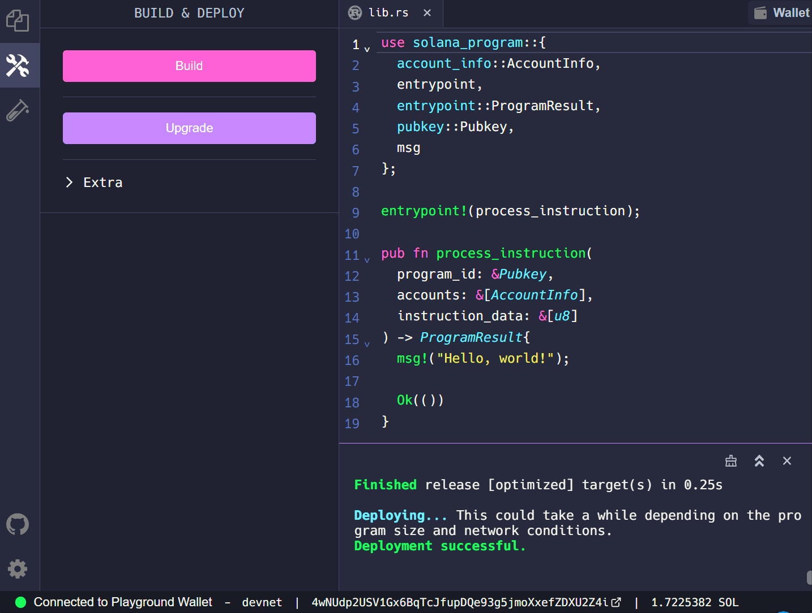

# Hello World

# Lesson Objectives

*By the end of this lesson, you will be able to:*

- Describe the Solana account model
- Explain the entry point to a Solana program
- Submit a transaction to invoke our “Hello, world!” program

# TL;DR

- **Accounts** on Solana each have a unique address, store data, and are owned by a program
- **Programs** on Solana are a particular type of account that is marked as executable and which stores instruction logic
- **Transactions** on Solana are made up of instructions which are executed by programs

# Overview

In this lesson we'll be using the Rust programming language to write a Solana program. We will also be using the Solana Playground to deploy a Solana program.

Solana programs are stored in accounts with a unique address. This unique address is referred to as the program id.

To understand programs on Solana we must first understand the basics of Solana’s account model. Once we understand Solana's account model, then we will be able to see how Solana programs (which are similar to "smart contracts" on the Ethereum blockchain) are just a particular type of Solana account that can execute instructions.

## Account Model

As you'll recall from the [Read data from the network](./intro-to-reading-data.md) lesson, accounts are like the files in Solana’s network ledger. All data stored on the Solana network are contained in what are referred to as accounts. Each account has its own unique address which is used to identify and access the account data.

There are two main categories of Solana accounts:

- Data accounts
- Program accounts

Note that data accounts must be owned by a program account.

Data accounts store state (e.g. name, count). There are two types of data accounts:

- Data accounts owned by the System Program (e.g. user wallets)
- Data accounts owned by any other program

Program accounts store the executable programs (e.g. instruction logic) and process instructions. There are two types of program accounts:

- Solana's native program accounts (e.g. the System, Stake, or BPF Loader Programs)
- All other program accounts (these are owned by the BPF - Berkeley Packet Filter - Loader Program)

The diagram below demonstrates the relationship between program accounts and data accounts:


Note that a *program's ownership* of an account differs from a *user's authority* over an account.

For example, a user wallet with authority over a token account must sign a transaction in order to send tokens from the token account. The signed transaction then authorizes the token program (which owns the token account) to transfer tokens to another token account.

## Solana Programs

To write Solana programs with Rust, we use the [solana_program](https://docs.rs/solana-program/latest/solana_program/index.html) library crate. Crates in Rust define functionality that can be shared with multiple projects. The `solana_program` crate acts as a standard library for Solana programs. This standard library contains the modules and macros that we'll use to develop our Solana programs. You can read more about Rust crates [here](https://doc.rust-lang.org/book/ch07-01-packages-and-crates.html).

### Pathways and scope

To tell Rust where to find an item in a module tree, we use a path just like when we're navigating a filesystem. If we want to call a particular function within a module, then we need to know the pathway to it.

To "use" a module available within the `solana_program` crate we'll need to know:

1. How to invoke the module by its path
2. How bring it into the scope of our program.

Paths are brought into scope with the [use](https://doc.rust-lang.org/stable/book/ch07-04-bringing-paths-into-scope-with-the-use-keyword.html) keyword. In the example below, we bring into scope the [AccountInfo](https://docs.rs/solana-program/latest/solana_program/account_info/struct.AccountInfo.html) struct from the `account_info` module within the `solana_program` crate.

```rust
use solana_program::account_info::AccountInfo
```

You can read more about Rust modules [here](https://doc.rust-lang.org/book/ch07-02-defining-modules-to-control-scope-and-privacy.html).

For a basic program we will need to use all of the following paths:

```rust
use solana_program::{
    account_info::AccountInfo,
    entrypoint,
    entrypoint::ProgramResult,
    pubkey::Pubkey,
    msg
};
```

### Entry points

Solana programs require a single entry point to process program instructions. The entry point is declared using the [entrypoint!](https://docs.rs/solana-program/latest/solana_program/macro.entrypoint.html) macro. You can read more about Rust macros [here](https://doc.rust-lang.org/book/ch19-06-macros.html).

The entry point to a Solana program requires a `process_instruction` function with the following arguments:

- `program_id` - the address of the account where the program is stored
- `accounts` - the list of data accounts required to process the instruction
- `instruction_data` - the serialized, instruction-specific data

```rust
entrypoint!(process_instruction);

fn process_instruction(
    program_id: &Pubkey,
    accounts: &[AccountInfo],
    instruction_data: &[u8],
) -> ProgramResult;
```

Recall that Solana program accounts only store the logic for processing instructions. Program accounts are "read-only" accounts. This means that programs are “stateless”. The “state” (the set of data) that a program requires in order to process an instruction is stored in data accounts (separate from the program account).

In order to process an instruction, the data accounts that an instruction requires must be explicitly passed into the program through the `accounts` argument. Any additional inputs must be passed in through the `instruction_data` argument.

## Transactions

In order to execute Solana program instructions, clients must build and submit a transaction. Recall that transactions are made up of one more or instructions. Transactions process instructions in order and atomistically. This means that if any one, single instruction within the transaction fails, then the entire transaction will fail. This provides users with the certainty that if a transaction is confirmed, then all of the instructions within the transaction were processed successfully.

Building a basic transaction requires the following steps:

1. Create a new transaction
2. Create an instruction
3. Add the instruction to the transaction
4. Submit the transaction to be processed by the Solana network

### Create a new transaction

First, we must create a new transaction using the `Transaction` function from `@solana/web3.js`.

```tsx
import web3 = require("@solana/web3.js")

const transaction = new web3.Transaction()
```

### Create an instruction

Next, we build the instruction using the `TransactionInstruction` function.

The `keys` field is where the accounts required by the instruction are listed.

```tsx
const instruction = new web3.TransactionInstruction({
    keys: [],
    programId,
    data: Buffer.alloc(0),
})
```

Note that the format for building a new instruction here on the client side matches the arguments required by the `process_instruction` function passed into the program entry point.

### Add the instruction to the transaction

Once we’ve built our instruction, we add the instruction to our transaction. This process can be repeated if a transaction requires multiple instructions.

```tsx
transaction.add(instruction)
```

### Submit the transaction

Lastly, we send the new transaction to be processed by the Solana network.

```tsx
const transactionSignature = await web3.sendAndConfirmTransaction(
    connection,
    transaction,
    [payer]
)
```

...and there you have it - you now know all the things you need for the foundations of creating a Solana program using Rust. Let’s practice what we’ve learned so far!

# Demo

We're going to build a "Hello, World!" program using Solana Playground. Solana Playground is a tool that allows you to write and deploy Solana programs from the browser.

Click [here](https://beta.solpg.io/) to open Solana Playground. Next, delete everything in the default `lib.rs` file and create a Playground wallet.


First, let's bring into scope everything we’ll need from the `solana_program` crate.

- `AccountInfo` - a struct within the `account_info` module that allows us to access account information
- `entrypoint` - a macro that declares the entry point of the program
- `ProgramResult` - a type within the `entrypoint` module that returns either a `Result` or `ProgramError`
- `Pubkey` - a struct within the `pubkey` module that allows us to access addresses as a public key
- `msg` - a macro allows us to print messages to the program log

```rust
use solana_program::{
    account_info::AccountInfo,
    entrypoint,
    entrypoint::ProgramResult,
    pubkey::Pubkey,
    msg
};
```

Next, let's set up the entry point to our program using the `entrypoint!` macro and create the `process_instruction` function. The `msg!` macro then allows us to print “Hello, world!” to the program log when the program is invoked.

```rust
entrypoint!(process_instruction);

pub fn process_instruction(
    program_id: &Pubkey,
    accounts: &[AccountInfo],
    instruction_data: &[u8]
) -> ProgramResult{
    msg!("Hello, world!");

    Ok(())
}
```

All together, the “Hello, world!” program will look like this:

```rust
use solana_program::{
    account_info::AccountInfo,
    entrypoint,
    entrypoint::ProgramResult,
    pubkey::Pubkey,
    msg
};

entrypoint!(process_instruction);

pub fn process_instruction(
    program_id: &Pubkey,
    accounts: &[AccountInfo],
    instruction_data: &[u8]
) -> ProgramResult{
    msg!("Hello, world!");

    Ok(())
}
```

Now let's build and deploy our program using Solana Playground.


Finally, let's invoke our program from the client side. Download the code [here](https://github.com/ZYJLiu/solana-hello-world-client).

The focus of this lesson is to build our Solana program, so we’ve gone ahead and provided the client code to invoke our  “Hello, world!” program. The code provided includes a `sayHello` helper function that builds and submits our transaction. We then call `sayHello` in the main function and print a Solana Explorer URL to view our transaction details in the browser.

In the `index.ts` file you should see the following:

```tsx
import web3 = require("@solana/web3.js");
import Dotenv from "dotenv";
Dotenv.config();

let programId = new web3.PublicKey("<YOUR_PROGRAM_ID>");

let payer = initializeKeypair();
let connection = new web3.Connection(web3.clusterApiUrl("devnet"));

async function main() {
    await connection.requestAirdrop(payer.publicKey, web3.LAMPORTS_PER_SOL * 1);

    const transactionSignature = await sayHello();

    console.log(
        `Transaction: https://explorer.solana.com/tx/${transactionSignature}?cluster=custom&customUrl=http%3A%2F%2Flocalhost%3A8899`
    );
}

main()
    .then(() => {
        console.log("Finished successfully");
    })
    .catch((error) => {
        console.error(error);
    });

export async function sayHello(): Promise<web3.TransactionSignature> {
    const transaction = new web3.Transaction();

    const instruction = new web3.TransactionInstruction({
        keys: [],
        programId,
        data: Buffer.alloc(0),
    });

    transaction.add(instruction);

    const transactionSignature = await web3.sendAndConfirmTransaction(
        connection,
        transaction,
        [payer]
);

    return transactionSignature;
}

function initializeKeypair(): web3.Keypair {
    const secret = JSON.parse(process.env.PRIVATE_KEY ?? "") as number[];
    const secretKey = Uint8Array.from(secret);
    const keypairFromSecretKey = web3.Keypair.fromSecretKey(secretKey);
    return keypairFromSecretKey;
}
```

Update the `programId` with the your program id from Solana Playground.

```rust
let programId = new web3.PublicKey("<YOUR_PROGRAM_ID>");
```



Next, run `npm start`.


Lastly, copy the transaction URL printed in the console into your browser. Scroll down to see “Hello, world!” under Program Instruction Logs.


Congratulations, you’ve just successfully built and deployed a Solana program!

# Challenge

Now it’s your turn to build something independently.

1. Write a new program that uses the `msg!` macro to print your own message to the program log.
2. Build and deploy your program like we did in the demo.
3. Invoke your newly deployed program and use Solana Explorer to check that your message was printed in the program log.

As always, get creative with these challenges and take them beyond the basic instructions if you want - and have fun!
