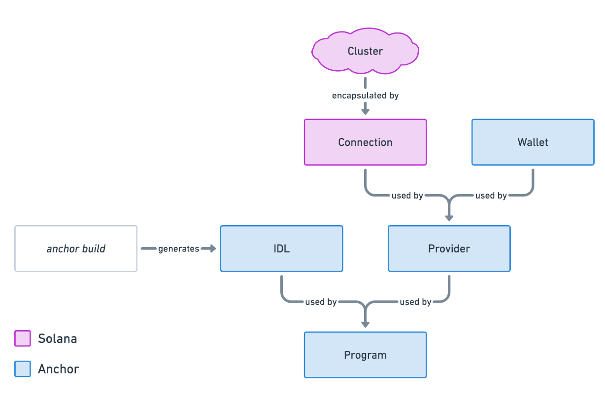
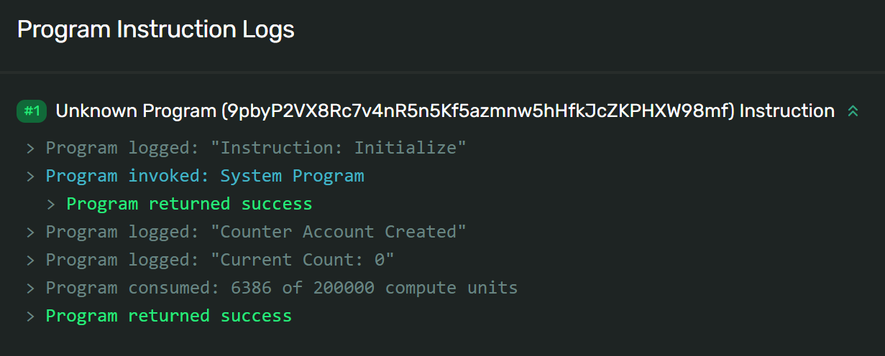

# Summary

- An **IDL** is a file representing the structure of a Solana program. Programs written and built using Anchor automatically generate a corresponding IDL. IDL stands for Interface Description Language.
- `@coral-xyz/anchor` is a Typescript client that includes everything you’ll need to interact with Anchor programs
- An **Anchor `Provider`** object combines a `connection` to a cluster and a specified `wallet` to enable transaction signing
- An **Anchor `Program`** object provides a custom API to interact with a specific program. You create a `Program` instance using a program's IDL and `Provider`.
- The **Anchor `MethodsBuilder`** provides a simple interface through `Program` for building instructions and transactions

# Lesson

Anchor simplifies the process of interacting with Solana programs from the client by providing an Interface Description Language (IDL) file that reflects the structure of a program. Using the IDL in conjunction with Anchor's Typescript library (`@coral-xyz/anchor`) provides a simplified format for building instructions and transactions.

```tsx
// sends transaction
await program.methods
  .instructionName(instructionDataInputs)
  .accounts({})
  .signers([])
  .rpc()
```

This works from any Typescript client, whether it's a frontend or integration tests. In this lesson we'll go over how to use `@coral-xyz/anchor` to simplify your client-side program interaction.

## Anchor client-side structure

Let's start by going over the basic structure of Anchor's Typescript library. The primary object you'll be using is the `Program` object. A `Program` instance represents a specific Solana program and provides a custom API for reading and writing to the program.

To create an instance of `Program`, you'll need the following:

- IDL - file representing the structure of a program
- `Connection` - the cluster connection
- `Wallet` - default keypair used to pay for and sign transactions
- `Provider` - encapsulates the `Connection` to a Solana cluster and a `Wallet`
- `ProgramId` - the program’s onchain address



The above image shows how each of these pieces are combined to create a `Program` instance. We'll go over each of them individually to get a better idea of how everything ties together.

### Interface Description Language (IDL)

When you build an Anchor program, Anchor generates both a JSON and Typescript file representing your program's IDL. The IDL represents the structure of the program and can be used by a client to infer how to interact with a specific program.

While it isn't automatic, you can also generate an IDL from a native Solana program using tools like [shank](https://github.com/metaplex-foundation/shank) by Metaplex. 

To get an idea of the information an IDL provides, here is the IDL for the counter program you built previously:

```json
{
  "version": "0.1.0",
  "name": "counter",
  "instructions": [
    {
      "name": "initialize",
      "accounts": [
        { "name": "counter", "isMut": true, "isSigner": true },
        { "name": "user", "isMut": true, "isSigner": true },
        { "name": "systemProgram", "isMut": false, "isSigner": false }
      ],
      "args": []
    },
    {
      "name": "increment",
      "accounts": [
        { "name": "counter", "isMut": true, "isSigner": false },
        { "name": "user", "isMut": false, "isSigner": true }
      ],
      "args": []
    }
  ],
  "accounts": [
    {
      "name": "Counter",
      "type": {
        "kind": "struct",
        "fields": [{ "name": "count", "type": "u64" }]
      }
    }
  ]
}
```

Inspecting the IDL, you can see that this program contains two instructions (`initialize` and `increment`).

Notice that in addition to specifying the instructions, it species the accounts and inputs for each instruction. The `initialize` instruction requires three accounts:

1. `counter` - the new account being initialized in the instruction
2. `user` - the payer for the transaction and initialization
3. `systemProgram` - the system program is invoked to initialize a new account

And the `increment` instruction requires two accounts:

1. `counter` - an existing account to increment the count field
2. `user` - the payer from the transaction

Looking at the IDL, you can see that in both instructions the `user` is required as a signer because the `isSigner` flag is marked as `true`. Additionally, neither instructions require any additional instruction data since the `args` section is blank for both.

Looking further down at the `accounts` section, you can see that the program contains one account type named `Counter` with a single `count` field of type `u64`.

Although the IDL does not provide the implementation details for each instruction, we can get a basic idea of how the onchain program expects instructions to be constructed and see the structure of the program accounts.

Regardless of how you get it, you *need* an IDL file to interact with a program using the `@coral-xyz/anchor` package. To use the IDL, you'll need to include the IDL file in your project and then import the file.

```tsx
import idl from "./idl.json"
```

### Provider

Before you can create a `Program` object using the IDL, you first need to create an Anchor `Provider` object.

The `Provider` object combines two things:

- `Connection` - the connection to a Solana cluster (i.e. localhost, devnet, mainnet)
- `Wallet` - a specified address used to pay for and sign transactions

The `Provider` is then able to send transactions to the Solana blockchain on behalf of a `Wallet` by including the wallet’s signature to outgoing transactions. When using a frontend with a Solana wallet provider, all outgoing transactions must still be approved by the user via their wallet browser extension.

Setting up the `Wallet` and `Connection` would look something like this:

```tsx
import { useAnchorWallet, useConnection } from "@solana/wallet-adapter-react"

const { connection } = useConnection()
const wallet = useAnchorWallet()
```

To set up the connection, you can use the `useConnection` hook from `@solana/wallet-adapter-react` to get the `Connection` to a Solana cluster.

Note that the `Wallet` object provided by the `useWallet` hook from `@solana/wallet-adapter-react` is not compatible with the `Wallet` object that the Anchor `Provider` expects. However, `@solana/wallet-adapter-react` also provides a `useAnchorWallet` hook.

For comparison, here is the `AnchorWallet` from `useAnchorWallet`:

```tsx
export interface AnchorWallet {
  publicKey: PublicKey
  signTransaction(transaction: Transaction): Promise<Transaction>
  signAllTransactions(transactions: Transaction[]): Promise<Transaction[]>
}
```

And the `WalletContextState` from `useWallet`:

```tsx
export interface WalletContextState {
  autoConnect: boolean
  wallets: Wallet[]
  wallet: Wallet | null
  publicKey: PublicKey | null
  connecting: boolean
  connected: boolean
  disconnecting: boolean
  select(walletName: WalletName): void
  connect(): Promise<void>
  disconnect(): Promise<void>
  sendTransaction(
    transaction: Transaction,
    connection: Connection,
    options?: SendTransactionOptions
  ): Promise<TransactionSignature>
  signTransaction: SignerWalletAdapterProps["signTransaction"] | undefined
  signAllTransactions:
    | SignerWalletAdapterProps["signAllTransactions"]
    | undefined
  signMessage: MessageSignerWalletAdapterProps["signMessage"] | undefined
}
```

The `WalletContextState` provides much more functionality compared to the `AnchorWallet`, but the `AnchorWallet` is required to set up the `Provider` object.

To create the `Provider` object you use `AnchorProvider` from `@coral-xyz/anchor`.

The `AnchorProvider` constructor takes three parameters:

- `connection` - the `Connection` to the Solana cluster
- `wallet` - the `Wallet` object
- `opts` - optional parameter that specifies the confirmation options, using a default setting if one is not provided

Once you’ve created the `Provider` object, you then set it as the default provider using `setProvider`.

```tsx
import { useAnchorWallet, useConnection } from "@solana/wallet-adapter-react"
import { AnchorProvider, setProvider } from "@coral-xyz/anchor"

const { connection } = useConnection()
const wallet = useAnchorWallet()
const provider = new AnchorProvider(connection, wallet, {})
setProvider(provider)
```

### Program

Once you have the IDL and a provider, you can create an instance of `Program`. The constructor requires three parameters:

- `idl` - the IDL as type `Idl`
- `programId` - the onchain address of the program as a `string` or `PublicKey`
- `Provider` - the provider discussed in the previous section

The `Program` object creates a custom API you can use to interact with a Solana program. This API is the one stop shop for all things related to communicating with onchain programs. Among other things, you can send transactions, fetch deserialized accounts, decode instruction data, subscribe to account changes, and listen to events. You can also [learn more about the `Program` class](https://coral-xyz.github.io/anchor/ts/classes/Program.html#constructor).

To create the `Program` object, first import `Program` and `Idl` from `@coral-xyz/anchor`. `Idl` is a type you can use when working with Typescript.

Next, specify the `programId` of the program. We have to explicitly state the `programId` since there can be multiple programs with the same IDL structure (i.e. if the same program is deployed multiple times using different addresses). When creating the `Program` object, the default `Provider` is used if one is not explicitly specified.

All together, the final setup looks something like this:

```tsx
import idl from "./idl.json"
import { useAnchorWallet, useConnection } from "@solana/wallet-adapter-react"
import {
  Program,
  Idl,
  AnchorProvider,
  setProvider,
} from "@coral-xyz/anchor"

const { connection } = useConnection()
const wallet = useAnchorWallet()

const provider = new AnchorProvider(connection, wallet, {})
setProvider(provider)

const programId = new PublicKey("JPLockxtkngHkaQT5AuRYow3HyUv5qWzmhwsCPd653n")
const program = new Program(idl as Idl, programId)
```

## Anchor `MethodsBuilder`

Once the `Program` object is set up, you can use the Anchor Methods Builder to build instructions and transactions related to the program. The `MethodsBuilder` uses the IDL to provide a simplified format for building transactions that invoke program instructions.

Note that the camel case naming convention is used when interacting with a program from the client, compared to the snake case naming convention used when the writing the program in rust.

The basic `MethodsBuilder` format looks like this:

```tsx
// sends transaction
await program.methods
  .instructionName(instructionDataInputs)
  .accounts({})
  .signers([])
  .rpc()
```

Going step by step, you:

1. Call `methods` on `program` - this is the builder API for creating instruction calls related to the program's IDL
2. Call the instruction name as `.instructionName(instructionDataInputs)` - simply call the instruction using dot syntax and the instruction's name, passing in any instruction arguments as comma-separated values
3. Call `accounts` - using dot syntax, call `.accounts`, passing in an object with each account the instruction expects based on the IDL
4. Optionally call `signers` - using dot syntax, call `.signers`, passing in an array of additional signers required by the instruction
5. Call `rpc` - this method creates and sends a signed transaction with the specified instruction and returns a `TransactionSignature`. When using `.rpc`, the `Wallet` from the `Provider` is automatically included as a signer and does not have to be listed explicitly.

Note that if no additional signers are required by the instruction other than the `Wallet` specified with the `Provider`, the `.signer([])` line can be excluded.

You can also build the transaction directly by changing `.rpc()` to `.transaction()`. This builds a `Transaction` object using the instruction specified.

```tsx
// creates transaction
const transaction = await program.methods
  .instructionName(instructionDataInputs)
  .accounts({})
  .transaction()

await sendTransaction(transaction, connection)
```

Similarly, you can use the same format to build an instruction using `.instruction()` and then manually add the instructions to a new transaction. This builds a `TransactionInstruction` object using the instruction specified.

```tsx
// creates first instruction
const instructionOne = await program.methods
  .instructionOneName(instructionOneDataInputs)
  .accounts({})
  .instruction()

// creates second instruction
const instructionTwo = await program.methods
  .instructionTwoName(instructionTwoDataInputs)
  .accounts({})
  .instruction()

// add both instruction to one transaction
const transaction = new Transaction().add(instructionOne, instructionTwo)

// send transaction
await sendTransaction(transaction, connection)
```

In summary, the Anchor `MethodsBuilder` provides a simplified and more flexible way to interact with onchain programs. You can build an instruction, a transaction, or build and send a transaction using basically the same format without having to manually serialize or deserialize the accounts or instruction data.

## Fetch program accounts

The `Program` object also allows you to easily fetch and filter program accounts. Simply call `account` on `program` and then specify the name of the account type as reflected on the IDL. Anchor then deserializes and returns all accounts as specified.

The example below shows how you can fetch all existing `counter` accounts for the Counter program.

```tsx
const accounts = await program.account.counter.all()
```

You can also apply a filter by using `memcmp` and then specifying an `offset` and the `bytes` to filter for. 

The example below fetches all `counter` accounts with a `count` of 0. Note that the `offset` of 8 is for the 8 byte discriminator Anchor uses to identify account types. The 9th byte is where the `count` field begins. You can refer to the IDL to see that the next byte stores the `count` field of type `u64`. Anchor then filters for and returns all accounts with matching bytes in the same position.

```tsx
const accounts = await program.account.counter.all([
    {
        memcmp: {
            offset: 8,
            bytes: bs58.encode((new BN(0, 'le')).toArray()),
        },
    },
])
```

Alternatively, you can also get the deserialized account data for a specific account using `fetch` if you know the address of the account you're looking for. 

```tsx
const account = await program.account.counter.fetch(ACCOUNT_ADDRESS)
```

Similarly, you can fetch multiple accounts using `fetchMultiple`.

```tsx
const accounts = await program.account.counter.fetchMultiple([ACCOUNT_ADDRESS_ONE, ACCOUNT_ADDRESS_TWO])
```

# Lab

Let’s practice this together by building a frontend for the Counter program from last lesson. As a reminder, the Counter program has two instructions:

- `initialize` - initializes a new `Counter` account and sets the `count` to `0`
- `increment` - increments the `count` on an existing `Counter` account

### 1. Download the starter code

Download [the starter code for this project](https://github.com/Unboxed-Software/anchor-ping-frontend/tree/starter). Once you have the starter code, take a look around. Install the dependencies with `npm install` and then run the app with `npm run dev`.

This project is a simple Next.js application. It includes the `WalletContextProvider` we created in the [Wallets lesson](https://github.com/Unboxed-Software/solana-course/blob/main/content/interact-with-wallets), the `idl.json` file for the Counter program, and the `Initialize` and `Increment` components we’ll be building throughout this lab. The `programId` of the program we’ll be invoking is also included in the starter code.

### 2. `Initialize`

To begin, let’s complete the setup to create the `Program` object in `Initialize.tsx` component.

Remember, we’ll need an instance of `Program` to use the Anchor `MethodsBuilder` to invoke the instructions on our program. For that, we'll need an Anchor wallet and a connection, which we can get from the `useAnchorWallet` and `useConnection` hooks. Let's also create a `useState` to capture the program instance.

```tsx
export const Initialize: FC<Props> = ({ setCounter }) => {
  const [program, setProgram] = useState("")

  const { connection } = useConnection()
  const wallet = useAnchorWallet()

  ...
}
```

With that, we can work on creating the actual `Program` instance. Let's do this in a `useEffect`.

First we need to either get the default provider if it already exists, or create it if it doesn't. We can do that by calling `getProvider` inside a try/catch block. If an error is thrown, that means there is no default provider and we need to create one.

Once we have a provider, we can construct a `Program` instance.

```tsx
useEffect(() => {
  let provider: anchor.Provider

  try {
    provider = anchor.getProvider()
  } catch {
    provider = new anchor.AnchorProvider(connection, wallet, {})
    anchor.setProvider(provider)
  }

  const program = new anchor.Program(idl as anchor.Idl, PROGRAM_ID)
  setProgram(program)
}, [])
```

Now that we've finished the Anchor setup, we can actually invoke the program's `initialize` instruction. We'll do this inside the `onClick` function.

First, we’ll need to generate a new `Keypair` for the new `Counter` account since we are initializing an account for the first time.

Then we can use the Anchor `MethodsBuilder` to create and send a new transaction. Remember, Anchor can infer some of the accounts required, like the `user` and `systemAccount` accounts. However, it can't infer the `counter` account because we generate that dynamically, so you'll need to add it with `.accounts`. You'll also need to add that keypair as a sign with `.signers`. Lastly, you can use `.rpc()` to submit the transaction to the user's wallet.

Once the transaction goes through, call `setUrl` with the explorer URL and then call `setCounter`, passing in the counter account.

```tsx
const onClick = async () => {
  const sig = await program.methods
    .initialize()
    .accounts({
      counter: newAccount.publicKey,
      user: wallet.publicKey,
      systemAccount: anchor.web3.SystemProgram.programId,
    })
    .signers([newAccount])
    .rpc()

    setTransactionUrl(`https://explorer.solana.com/tx/${sig}?cluster=devnet`)
    setCounter(newAccount.publicKey)
}
```

### 3. `Increment`

Next, let’s move on the the `Increment.tsx` component. Just as before, complete the setup to create the `Program` object. In addition to calling `setProgram`, the `useEffect` should call `refreshCount`.

Add the following code for the initial set up:

```tsx
export const Increment: FC<Props> = ({ counter, setTransactionUrl }) => {
  const [count, setCount] = useState(0)
  const [program, setProgram] = useState<anchor.Program>()
  const { connection } = useConnection()
  const wallet = useAnchorWallet()

  useEffect(() => {
    let provider: anchor.Provider

    try {
      provider = anchor.getProvider()
    } catch {
      provider = new anchor.AnchorProvider(connection, wallet, {})
      anchor.setProvider(provider)
    }

    const program = new anchor.Program(idl as anchor.Idl, PROGRAM_ID)
    setProgram(program)
    refreshCount(program)
  }, [])
  ...
}
```

Next, let’s use the Anchor `MethodsBuilder` to build a new instruction to invoke the `increment` instruction. Again, Anchor can infer the `user` account from the wallet so we only need to include the `counter` account.

```tsx
const incrementCount = async () => {
  const sig = await program.methods
    .increment()
    .accounts({
      counter: counter,
      user: wallet.publicKey,
    })
    .rpc()

  setTransactionUrl(`https://explorer.solana.com/tx/${sig}?cluster=devnet`)
}
```

### 4. Display the correct count

Now that we can initialize the counter program and increment the count, we need to get our UI to show the count stored in the counter account.

We'll show how to observe account changes in a future lesson, but for now we just have a button that calls `refreshCount` so you can click it to show the new count after each `increment` invocation.

Inside `refreshCount`, let's use `program` to fetch the counter account, then use `setCount` to set the count to the number stored on the program:

```tsx
const refreshCount = async (program) => {
  const counterAccount = await program.account.counter.fetch(counter)
  setCount(counterAccount.count.toNumber())
}
```

Super simple with Anchor!

### 5. Test the frontend

At this point, everything should work! You can test the frontend by running `npm run dev`.

1. Connect your wallet and you should see the `Initialize Counter` button
2. Click the `Initialize Counter` button, and then approve the transaction
3. You should then see a link at the bottom of the screen to Solana Explorer for the `initialize` transaction. The `Increment Counter` button, `Refresh Count` button, and the count should also all appear.
4. Click the `Increment Counter` button, and then approve the transaction
5. Wait a few seconds and click `Refresh Count`. The count should increment on the screen.


Feel free to click the links to inspect the program logs from each transaction!




Congratulations, you now know how to set up a frontend to invoke a Solana program using an Anchor IDL.

If you need more time with this project to feel comfortable with these concepts, feel free to have a look at the [solution code on the `solution-increment` branch](https://github.com/Unboxed-Software/anchor-ping-frontend/tree/solution-increment) before continuing.

# Challenge

Now it’s your turn to build something independently. Building on top of what we’ve done in the lab, try to create a new component in the frontend that implements a button to decrements the counter.

Before building the component in the frontend, you’ll first need to:

1. Build and deploy a new program that implements a `decrement` instruction
2. Update the IDL file in the frontend with the one from your new program
3. Update the `programId` with the one from your new program

If you need some help, feel free to [reference this program](https://github.com/Unboxed-Software/anchor-counter-program/tree/solution-decrement).

Try to do this independently if you can! But if you get stuck, feel free to reference the [solution code](https://github.com/Unboxed-Software/anchor-ping-frontend/tree/solution-decrement).


## Completed the lab?

Push your code to GitHub and [tell us what you thought of this lesson](https://form.typeform.com/to/IPH0UGz7#answers-lesson=774a4023-646d-4394-af6d-19724a6db3db)!
