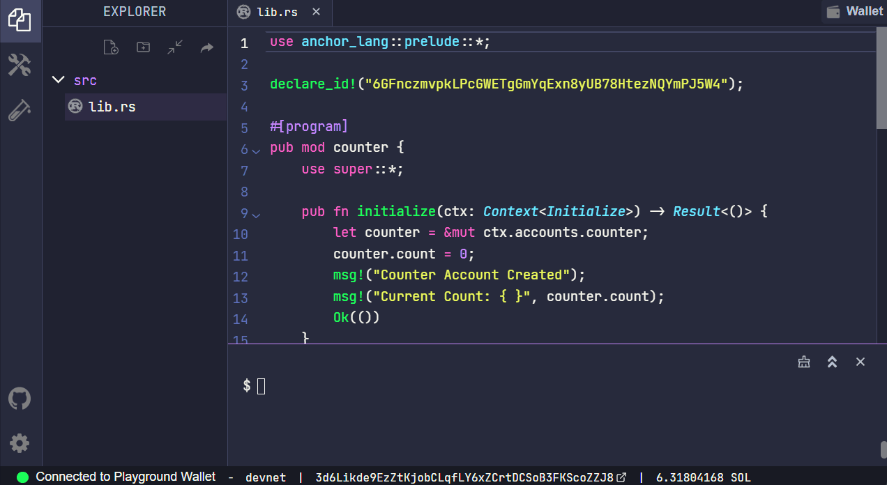
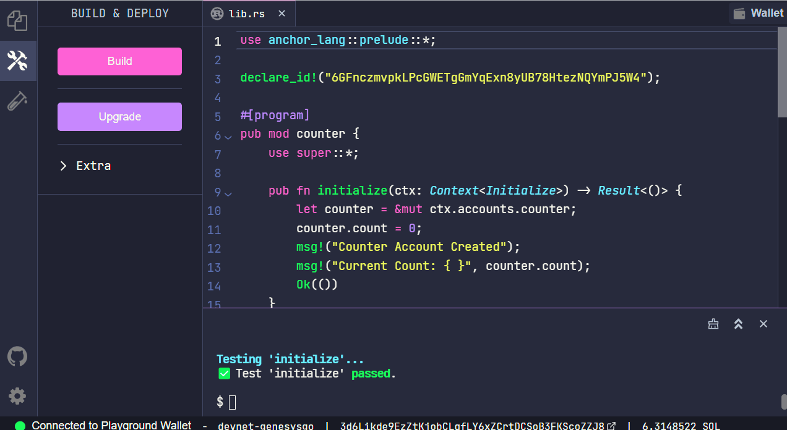

# Anchor Program Structure

# Lesson Objectives

_By the end of this lesson, you will be able to:_

- Use the Anchor framework to build a basic program
- Describe the basic structure of an Anchor program
- Explain how to implement basic account validation and security checks with Anchor

# TL;DR

- **Anchor** is a framework building Solana programs
- **Anchor** macros speed up the process of building Solana programs by abstracting away a significant amount of boilerplate code
- **Anchor** allows you to more easily build secure programs by performing certain security checks, requiring account validation, and providing a simple way to implement additional checks.

# Overview

## What is Anchor?

Anchor is a framework for building Solana programs. The Anchor framework organizes a program into distinct sections that separates the instruction logic from account validation and security checks.

Anchor also enables you to quickly build Solana programs by abstracting away various tasks such as the serialization and deserialization of an account. This is accomplished by bundling boilerplate code into macros, allowing you to focus on the business logic of your program. Additionally, Anchor is designed to inherently handle many common security checks while allowing you to easily define additional checks to help you build more secure programs.

The organization and abstraction capabilities of Anchor, make Solana programs much easier to read and write.

## Anchor program structure

An Anchor program has four basic sections

- `declare_id!` - the program’s on-chain address
- `#[program]` - the program’s instruction logic
- `#[derive(Accounts)]` - list, validate, and deserialize accounts passed into an instruction
- `#[account]` - define custom account types for the program

Below is an example of a basic Anchor program with a single instruction that:

- Initializes a new account
- Updates the data field on the account with the instruction data passed into the instruction

```rust
// Use this import to gain access to common anchor features
use anchor_lang::prelude::*;

// Program on-chain address
declare_id!("Fg6PaFpoGXkYsidMpWTK6W2BeZ7FEfcYkg476zPFsLnS");

// Instruction logic
#[program]
mod program_module_name {
    use super::*;
    pub fn instruction_one(ctx: Context<InstructionAccounts>, instruction_data: u64) -> Result<()> {
		ctx.accounts.account_name.data = instruction_data;
        Ok(())
    }
}

// Validate incoming accounts for instructions
#[derive(Accounts)]
pub struct InstructionAccounts<'info> {
	#[account(init, payer = user, space = 8 + 8)]
    pub account_name: Account<'info, AccountStruct>,
	#[account(mut)]
    pub user: Signer<'info>,
    pub system_program: Program<'info, System>,

}

// Define custom program account type
#[account]
pub struct AccountStruct {
	data: u64
}

```

## `declare_id!`

The `declare_id!` macro is used to specify the on-chain address of the program (i.e. the `programId`). A new keypair is generated when an Anchor program is built for the first time. This keypair will be the default keypair used to deploy the program. The corresponding publickey is used as the `programId` specified in the `declare_id!` macro.

```rust
declare_id!("Fg6PaFpoGXkYsidMpWTK6W2BeZ7FEfcYkg476zPFsLnS");
```

## `#[program]`

The `#[program]` attribute defines the module containing all the program instructions. This is where you implement the business logic for each instruction in your program. In an Anchor program, account validation and security checks are generally separated from the instruction logic.

If your instructions require instruction data, include additional function parameters after the context argument. Anchor will then automatically deserialize the instruction data.

```rust
#[program]
mod program_module_name {
    use super::*;

    pub fn instruction_one(ctx: Context<InstructionAccounts>, instruction_data: u64) -> Result<()> {
		ctx.accounts.account_name.data = instruction_data;
        Ok(())
    }
}

...
```

### Instruction `Context`

All Anchor instructions require a `Context` type as the first parameter. The instruction `Context` is used to specify the accounts an instruction requires.

```rust
pub struct Context<'a, 'b, 'c, 'info, T> {
    /// Currently executing program id.
    pub program_id: &'a Pubkey,
    /// Deserialized accounts.
    pub accounts: &'b mut T,
    /// Remaining accounts given but not deserialized or validated.
    /// Be very careful when using this directly.
    pub remaining_accounts: &'c [AccountInfo<'info>],
    /// Bump seeds found during constraint validation. This is provided as a
    /// convenience so that handlers don't have to recalculate bump seeds or
    /// pass them in as arguments.
    pub bumps: BTreeMap<String, u8>,
}
```

The `Context` type `T` defines the list of accounts an instruction requires. Through this context argument the instruction can then access:

- The accounts passed into the instruction (`ctx.accounts`)
- The program id (`ctx.program_id`) of the executing program
- The remaining accounts (`ctx.remaining_accounts`). The `remaining_accounts` is a vector that contains all accounts that were passed into the instruction but are not declared in the `Accounts` struct.
- The bumps for any PDAs accounts (`ctx.bumps`)

Next, let’s discuss how a `Context` type is implemented in an Anchor program using the `Accounts` trait.

## `#[derive(Accounts)]`

The `Accounts` trait is a data structure of validated accounts that can be deserialized from the instruction `Context` to a program.

With Anchor, you no longer have to manually deserialize the `AccountInfo` for each account. The `#[derive(Accounts)]` macro implements an `Accounts` deserializer on the given struct. Implementations of the `Accounts` trait also performs all requisite constraint checks to ensure the accounts meet conditions required for the program to run securely.

For example, `instruction_one` requires a `Context` argument of type `InstructionAccounts`. The `#[derive(Accounts)]` macro is used to implement the `InstructionAccounts` struct which includes three accounts: `account_name`, `user`, `system_program`.

```rust
#[program]
mod program_module_name {
    use super::*;
    pub fn instruction_one(ctx: Context<InstructionAccounts>, instruction_data: u64) -> Result<()> {
				...
        Ok(())
    }
}

#[derive(Accounts)]
pub struct InstructionAccounts {
	#[account(init, payer = user, space = 8 + 8)]
    pub account_name: Account<'info, AccountStruct>,
	#[account(mut)]
    pub user: Signer<'info>,
    pub system_program: Program<'info, System>,

}
```

When `instruction_one` is invoked, the program:

- Checks that the accounts passed into the instruction match the account types specified in the `InstructionAccounts` struct
- Checks the accounts against any additional constraints specified

If any accounts passed into `instruction_one` fail the account validation or security checks specified in the `InstructionAccounts` struct, then the instruction fails before even reaching the program logic.

In the next sections we’ll discuss how basic account validation and additional constraints are implemented in an Anchor program.

## Account Validation

Anchor provides a list of Account types that can be used in the account validation struct. We’ll go over a few of the common types you may encounter, but feel free to look through the full list of Account types that can be used in the account validation struct [here](https://docs.rs/anchor-lang/latest/anchor_lang/accounts/index.html).

### `Account`

`Account` is a wrapper around `AccountInfo` that verifies program ownership and deserializes the underlying data into a Rust type.

```rust
// Deserializes this info
pub struct AccountInfo<'a> {
    pub key: &'a Pubkey,
    pub is_signer: bool,
    pub is_writable: bool,
    pub lamports: Rc<RefCell<&'a mut u64>>,
    pub data: Rc<RefCell<&'a mut [u8]>>,    <---- deserializes account data
    pub owner: &'a Pubkey,    <---- checks owner program
    pub executable: bool,
    pub rent_epoch: u64,
}
```

For the `account_name` account, the `Account` wrapper deserializes the `data` in the format of type `AccountStruct` and check the program owner of the account also matches the specified account type. When the account type specified in the `Account` wrapper is defined within the same crate using the `#[account]` macro, the program ownership check is against the `programId` defined in the `declare_id!` macro.

```rust
pub account_name: Account<'info, AccountStruct>,
```

```rust
// Checks
Account.info.owner == T::owner()
!(Account.info.owner == SystemProgram && Account.info.lamports() == 0)
```

### `Signer`

The `Signer` type validates that an account signed the transaction. No other ownership or type checks are done. The `Signer` type is used if underlying account data is not required in the instruction.

For the `user` account, the `Signer` type is used to specify that the `user` account must be a signer of the instruction.

```rust
pub user: Signer<'info>,
```

```rust
// Checks
Signer.info.is_signer == true
```

### `Program`

The `Program` type validates that the account is a certain program.

For the `system_program` account, the `Program` type is used to specify the program should be the system program. Anchor provides a `System` type which includes the `programId` of the system program to check against.

```rust
pub system_program: Program<'info, System>
```

```rust
//Checks
account_info.key == expected_program
account_info.executable == true
```

Next, we’ll discuss how to provide further functionality through the use of the `#[account(..)]` attribute.

## `#[account(...)]`

The `#[account(..)]` attribute is used to apply different types of constraints to accounts. You can look over the full list of constraints that can be applied with the `#[account(..)]` attribute [here](https://docs.rs/anchor-lang/latest/anchor_lang/derive.Accounts.html). We’ll go over a few examples here and discuss constraints more in depth in a later lesson.

For `account_name`, we can see that the `#[account(..)]` attribute specifies the following:

```rust
#[account(init, payer = user, space = 8 + 8)]
pub account_name: Account<'info, AccountStruct>,
#[account(mut)]
pub user: Signer<'info>,
```

- `init` - creates the account via a CPI to the system program and initializes it (sets its account discriminator)
- `payer` - specifies `payer` for the initialization as the `user` account defined in the struct
- `space`- specifies the `space` that allocated for the account is 8 + 8 bytes. The first 8 bytes is a discriminator that Anchor automatically adds to identify the account type. The next 8 bytes allocates space for the data stored on the account as defined in the `AccountStruct` type.

For `user` we use the `#[account(..)]` attribute to specify that the given account is mutable. The `user` account must be marked as mutable because lamports will be deducted from the account to pay for the initialization of `account_name`.

```rust
#[account(mut)]
pub user: Signer<'info>,
```

Lastly, let’s go over the `#[account]` attribute.

## `#[account]`

The `#[account]` attribute is used to represent the data structure of a Solana account and implements the following traits:

- `AccountSerialize`
- `AccountDeserialize`
- `AnchorSerialize`
- `AnchorDeserialize`
- `Clone`
- `Discriminator`
- `Owner`

You can read more about the details of each trait [here](https://docs.rs/anchor-lang/latest/anchor_lang/attr.account.html). In summary, the `#[account]` attribute enables serialization and deserialization, and implements the discriminator and owner traits for an account.

The discriminator is an 8 byte unique identifier for an account type and derived from first 8 bytes of the SHA256 of the account’s Rust ident. When implementing account serialization traits the first 8 bytes are reserved for the account discriminator.

As a result, any calls to `AccountDeserialize`’s `try_deserialize` will check this discriminator. If it doesn’t match, an invalid account was given, and the account deserialization will exit with an error.

The `#[account]` attribute also implements the `Owner` trait for a struct using the `programId` declared by `declareId` of the crate `#[account]` is used in. In other words, all accounts initialized using an account type defined using the `#[account]` attribute within the program are also owned by the program.

For example, the `#[account]` attribute to define a `AccountStruct` type that has one field `data`.

```rust
#[account]
pub struct AccountStruct {
	data: u64
}
```

Together with `InstructionAccounts` struct, we specify that we are initializing an account with data type of `AccountStruct`.

When the `account_name` account is initialized:

- The first 8 bytes is set as the `AccountStruct` discriminator
- The data field of the account will match `AccountStruct`
- The account owner set as the `programId` in `declare_id!`

```rust
#[derive(Accounts)]
pub struct InstructionAccounts {
	#[account(init, payer = user, space = 8 + 8)]
    pub account_name: Account<'info, AccountStruct>,
	...
}

#[account]
pub struct AccountStruct {
		data: u64
}
```

You are now ready to build your own Solana program using the Anchor framework!

# Demo

We're going to build a simple Anchor program using Solana Playground. The Solana Playground is a tool that allows you to write and deploy Solana programs from the browser.

We’ll be creating a simple program with two instructions:

- The first instruction will initialize a counter account
- The second instruction will increment the count stored on a counter account

### 1. Setup

Click [here](https://beta.solpg.io/62f120cbf6273245aca4f635) to open Solana Playground. You should see the following starter code:

```rust
use anchor_lang::prelude::*;

declare_id!("11111111111111111111111111111111");

#[program]
pub mod counter {
    use super::*;


}
```

The `programId` in `declare_id!` will automatically be updated when you build the program.

### 2. Add `initialize` instruction

First, let’s implement the `initialize` instruction within `#[program]`. This instruction requires a `Context` of type `Initialize` and takes no additional instruction data. In the instruction logic, we are simply setting the `counter` account’s `count` field to `0`.

```rust
pub fn initialize(ctx: Context<Initialize>) -> Result<()> {
    let counter = &mut ctx.accounts.counter;
    counter.count = 0;
    msg!("Counter Account Created");
    msg!("Current Count: { }", counter.count);
    Ok(())
}
```

### 3. Implement `Context` type `Initialize`

Next, using the `#[derive(Accounts)]` macro, let’s implement the `Initialize` `Context` type that lists the accounts that the `initialize` instruction requires.

- `counter` - the counter account initialized in the instruction
- `user` - payer for the initialization
- `system_program` - the system program is required for the initialization of any new accounts

Additionally, we’ll need to specify the Account types for account validation and define any additional constraints using the `#[account(..)]` attribute:

```rust
#[derive(Accounts)]
pub struct Initialize<'info> {
    #[account(init, payer = user, space = 8 + 8)]
    pub counter: Account<'info, Counter>,
    #[account(mut)]
    pub user: Signer<'info>,
    pub system_program: Program<'info, System>,
}
```

### 4. Implement `Counter`

Next, use the `#[account]` attribute to define a new `Counter` account type which automatically implements the traits required for serialization and deserialization. The `Counter` struct defines one `count` field of type `u64`. This means that we can expect any new accounts initialized as a `Counter` type to have a matching data structure. The `#[account]` attribute also automatically sets the discriminator for a new account and sets the owner of the account as the `programId` from the `declare_id!` macro.

```rust
#[account]
pub struct Counter {
    pub count: u64,
}
```

### 5. Add `increment` instruction

Within `#[program]`, let’s implement an `increment` instruction to increment the `count` once a `counter` account is initialized with the first instruction. This instruction requires a `Context` of type `Update`, which we’ll implement next and takes no additional instruction data. In the instruction logic, we are simply incrementing an existing `counter` account’s `count` field by `1`.

```rust
pub fn increment(ctx: Context<Update>) -> Result<()> {
    let counter = &mut ctx.accounts.counter;
    msg!("Previous Count: { }", counter.count);
    counter.count += 1;
    msg!("Counter Incremented");
    msg!("Current Count: { }", counter.count);
    Ok(())
}
```

### 6. Implement `Context` type `Update`

Lastly, using the `#[derive(Accounts)]` macro again, let’s implement the `Update` `Context` type that lists the accounts that the `increment` instruction requires.

- `counter` - an existing counter account to increment
- `user` - payer for the transaction fee

Again, we’ll need to specify the Account types for account validation and define any additional constraints using the `#[account(..)]` attribute:

```rust
#[derive(Accounts)]
pub struct Update<'info> {
    #[account(mut)]
    pub counter: Account<'info, Counter>,
    pub user: Signer<'info>,
}
```

### 7. Build and deploy on Solana Playground

All together, the complete program will look like this:

```rust
use anchor_lang::prelude::*;

declare_id!("11111111111111111111111111111111");

#[program]
pub mod counter {
    use super::*;

    pub fn initialize(ctx: Context<Initialize>) -> Result<()> {
        let counter = &mut ctx.accounts.counter;
        counter.count = 0;
        msg!("Counter Account Created");
        msg!("Current Count: { }", counter.count);
        Ok(())
    }

    pub fn increment(ctx: Context<Update>) -> Result<()> {
        let counter = &mut ctx.accounts.counter;
        msg!("Previous Count: { }", counter.count);
        counter.count += 1;
        msg!("Counter Incremented");
        msg!("Current Count: { }", counter.count);
        Ok(())
    }
}

#[derive(Accounts)]
pub struct Initialize<'info> {
    #[account(init, payer = user, space = 8 + 8)]
    pub counter: Account<'info, Counter>,
    #[account(mut)]
    pub user: Signer<'info>,
    pub system_program: Program<'info, System>,
}

#[derive(Accounts)]
pub struct Update<'info> {
    #[account(mut)]
    pub counter: Account<'info, Counter>,
    pub user: Signer<'info>,
}

#[account]
pub struct Counter {
    pub count: u64,
}
```

You are now ready to build and the deploy the program with Solana Playground!



### 8. Test on Solana Playground

Solana Playground also provides a convenient UI for testing programs built using the Anchor framework.

Test the `initialize` instruction by:

- Creating a random `publickey` for the `counter` account
- Select `My address` for the `user` account

Test the `increment` instruction by:

- Copy and pasting the `counter` account address from the `initialize` instruction
- Select `My address` for the `user` account

Feel free to check the program logs on Solana Explorer after invoking each instruction!



Congratulations, you just deployed a Solana program using the Anchor framework! Feel free to look at the [solution code](https://beta.solpg.io/62efe772f6273245aca4f631).

# Challenge

Now it’s your turn to build something independently. Because we're starting with very simple programs, yours will look almost identical to what we just created. It's useful to try and get to the point where you can write it from scratch without referencing prior code, so try not to copy and paste here.

1. Write a new program that initializes a `counter` account and set the `count` field using the an instruction data argument passed into the instruction
2. Implement both an `increment` and `decrement` instruction
3. Build and deploy your program like we did in the demo
4. Test your newly deployed program and use Solana Explorer to check the program logs

As always, get creative with these challenges and take them beyond the basic instructions if you want - and have fun!

Try to do this independently if you can! But if you get stuck, feel free to reference the [solution code](https://beta.solpg.io/62f14c6df6273245aca4f636).
