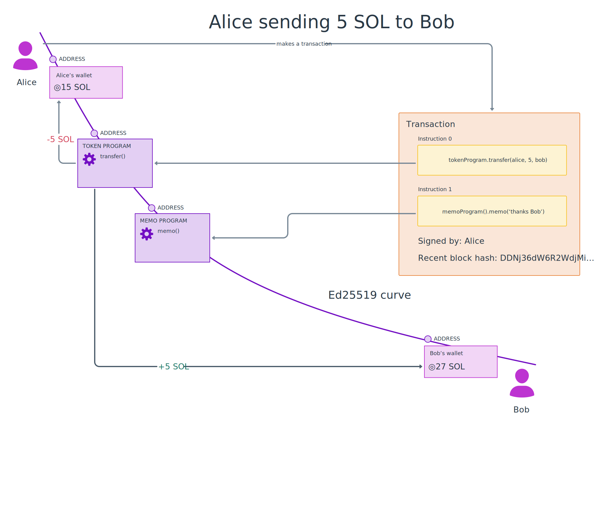

# Summary

- **Onchain programs** are programs that run on Solana. 
- Programs have one or more **instruction handlers**. Instruction handlers are functions that process the **instructions** in Solana transactions.
- Instruction handlers write their data to Solana **accounts** and then either succeed or fail. 
- Solana programs are most commonly written in **Rust**, typically with the **Anchor** framework.
- Anchor programs have IDLs, which are small JSON files describing programs. IDLs can be used to automatically create JS/TS libraries for a program.  

# Overview

Each Solana cluster (`mainnet-beta`, `testnet`, `devnet`, `localnet`) is effectively a single computer with a globally synchronized state. The programs that run on Solana - the ones that create tokens, swap tokens, art marketplaces, escrows, market makers, DePIN apps, auctions, retail payments platforms, etc - are called **Solana apps**.

The most popular way to build onchain apps is using **Rust** language and the **Anchor** framework. 

These frameworks implement common security checks automatically, and handle common tasks like:
 - sending incoming instructions to the right instruction handlers
 - deserializing data from incoming transactions
 - checking the accounts provided with incoming instructions, for example, to check that certain accounts are of a particular type, or are distinct from other accounts.

Regardless of the language and framework you choose, Solana works the same. Let's refresh how programs work on Solana.



## Programs are deployed at addresses

In the same way that we can send tokens to users using their public key, we can find programs using the program's public key. When using Anchor, a keypair is created during `anchor init`, and the private key is saved in the `target/deploy` directory of your project.

A program's public key is sometimes called a 'program ID' or 'program address'.

## Programs have instruction handlers

For example, a Solana client making a transaction transferring some USDC with a memo saying 'thanks' would have two instructions:
  - one instruction for the Token program's `transfer` instruction handler
  - the other instruction for the Memo program's `memo` instruction handler. 

Both these instructions must be completed successfully for the transaction to execute.

Instruction handlers are how blockchain programs process the instructions from clients. Every exchange, lending protocol, escrow, oracle, etc. provides their functionality by instruction handlers. 

## Instruction handlers write their state to Solana accounts

If you have previously done web development, you can think of instruction handlers like an HTTP route handler, and incoming instructions like HTTP requests. 

But unlike HTTP route handlers, Solana instruction handlers don't return data. Instead, the instruction handlers write their data to accounts on Solana.

Programs on Solana can transfer tokens, which end up in user wallet addresses (for SOL) for the user's token accounts (for other tokens). 

But more importantly, programs on Solana can create additional addresses as needed, to store items of data. 

## Programs store data in Program Derived Addresses (PDAs), a key-value store

Data for Solana programs are stored in **program-derived addresses (PDAs)**. Solana's PDAs can be thought of as a **key/value store**:

 - The 'key' is the address of the PDA, which is determined by `seeds` chosen by you, the programmer. 
   - Want an account to store USD to AUD exchange rate? Your program can use the seeds `USD` and `AUD` to make a Program Derived Address
   - Want to store information about the relationship of two users? You can use **both those users' wallet addresses** as seeds to make a PDA to store that information.
   - Want an account to store Steve's review of Titanic? Your program can use Steve's **wallet address** and the string `titanic` (or maybe the IMDB ID if you prefer) to make a Program Derived Address.
   - Want some global information for your entire program? You can use a string like `'config'`. Your program's PDAs are unique, so they won't conflict with other programs. 
 - The value is the data inside the account at the given address.
   - The data inside the PDA is determined by you, the programmer.

Key value stores allow your onchain program, and client software, to consistently determine the address for a data item because the same seeds will always return the same address.

## Solana instructions need to specify all the accounts they will use

As you may already know, Solana is fast because it can process transactions that don't overlap at the same time. I.e., just like in the real world, Alice sending to Bob doesn't stop Chris from sending something to Diana. Your front-end apps need to specify the addresses of all the accounts they will use. 

This includes the PDAs you make. Thankfully, you can calculate the address for PDAs in your front-end code before you write data there!

```typescript
// There's nothing at this address right now, but we're going to use in our transaction 
const address = findProgramAddressSync(
  ['seed', 'another seed'],
  PROGRAM_ID
)
```

## There are multiple ways to build onchain, but we recommend Anchor

You currently have two options for onchain program development:

 - We recommend new onchain programmers [start with Anchor](./intro-to-anchor). Anchor's defaults make it easy to create safe programs. 
 - This course also covers [native onchain program development](./hello-world-program).

Whichever way you pick, Solana Foundation maintains [examples in both languages](https://github.com/solana-developers/program-examples), and [Solana Stack Exchange](https://solana.stackexchange.com/) is there to help.

For now, let's [set up your computer](./local-setup)!
