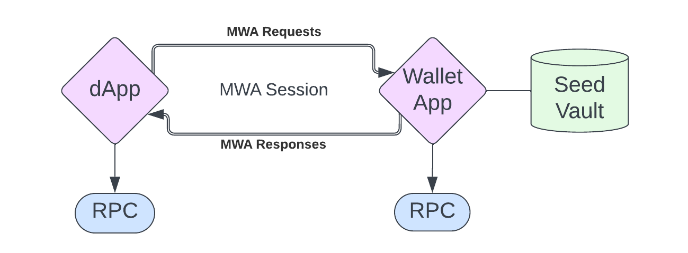
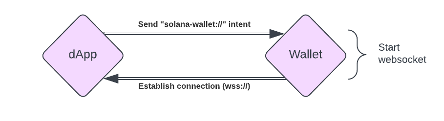
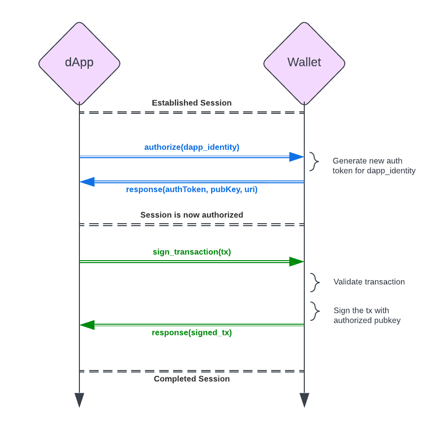
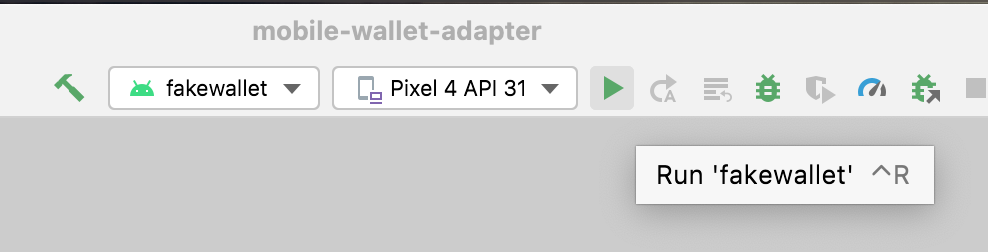
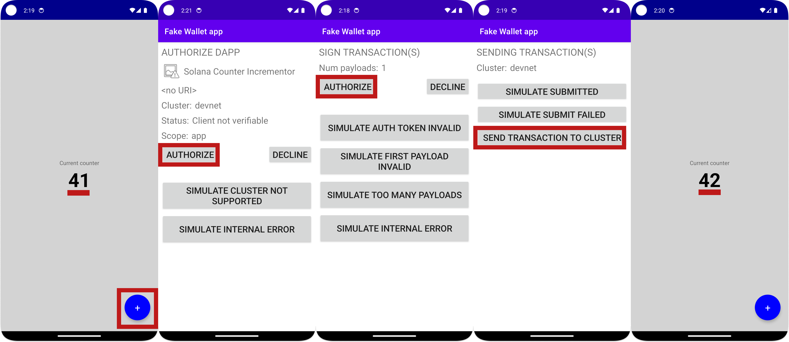

# Summary

- The Solana Mobile Wallet Adapter (MWA) creates a web socket connection between mobile apps and mobile wallets, allowing native mobile apps to submit transactions for signing
- The simplest way to get started creating Solana mobile applications is with Solana Mobile's [React Native packages](https://docs.solanamobile.com/react-native/setup) `@solana-mobile/mobile-wallet-adapter-protocol` and `@solana-mobile/mobile-wallet-adapter-protocol-web3js`
- React Native is very similar to React with a few mobile quirks

# Lesson

Solana Mobile Stack (SMS) is designed to help developers create mobile dApps with a seamless UX. It consists of the [Mobile Wallet Adapter (MWA)](https://docs.solanamobile.com/getting-started/overview#mobile-wallet-adapter), [Seed Vault](https://docs.solanamobile.com/getting-started/overview#seed-vault), and the [Solana dApp Store](https://docs.solanamobile.com/getting-started/overview#solana-dapp-store).

Most relevant to your development journey is the Mobile Wallet Adapter (MWA). The simplest way to get started is to use the Mobile Wallet Adapter with React Native to create a simple Android app. This lesson assumes you're familiar with React and Solana programming. If that's not the case, [start our course from the beginning](./intro-to-cryptography) and come back here when you feel ready!

## Intro To Solana Mobile

In these units, we'll develop mobile apps that interact with the Solana network. This opens up a whole new paradigm of crypto use cases and behaviors.

### Solana Mobile Use Cases

Here are a few examples of what Solana mobile development can unlock:

**Mobile Banking and Trading (DeFi)**

Most traditional banking right now happens on on native mobile apps. With SMS, you can now bank and trade using native mobile apps with your own wallet, where you hold your own keys.

**Mobile Gaming with Solana Micropayments**

Mobile games account for roughly 50% of the video game industry’s total value, largely due to small in-game purchases. However, payment processing fees usually mean these in-game purchases have a minimum of $0.99 USD. With Solana, it's possible to unlock true micropayments. Need an extra life? That'll be 0.0001 SOL.

**Mobile E-Commerce** 

SMS can enable a new wave of mobile e-commerce shoppers to pay directly from their favorite Solana wallet. Imagine a world where you can use your Solana wallet as seamlessly as you can use Apple Pay.

To summarize, mobile crypto opens up many doors. Let’s dive in and learn how we can be part of it:

### How Solana development differs between native mobile apps and web

Solana wallet interaction differs slightly on mobile compared to the web. The core wallet functionality is the same: the wallet holds your private keys and uses them to sign and send transactions. To avoid having different interfaces between wallets, developers abstracted that functionality into the Solana Wallet Adapter standard. This remains the standard on the web. The mobile counterpart is the Mobile Wallet Adapter (MWA).

The differences between the two standards are due to the different construction of web vs mobile wallets. Web wallets are just browser extensions that inject wallet adapter functions into the `window` object of your webpage. This gives your site access to them. Mobile wallets, however, are native applications on a mobile operating system. There's no way to surface functions from one native application to another. The Mobile Wallet Adapter exists to enable any app, written in any language, to connect to a native wallet app.

We'll dig into the specifics of the Mobile Wallet Adapter in a [later lesson](./mwa-deep-dive), but it effectively opens a WebSocket between applications to facilitate communication. That way a separate app can provide the wallet app with the transaction to be signed and sent, and the wallet app can respond with appropriate status updates.

### Supported Operating Systems

At the time of writing, Android is the only mobile OS supported by the Mobile Wallet Adapter.

On Android, a WebSocket connection can persist between apps, even when the wallet app is in the background.

On iOS, the lifetime of a connection between apps is purposefully limited by the operating system. Specifically, iOS will quickly suspend connections when an app is pushed to the background. This kills the MWA WebSocket connection. This is an inherent design difference between iOS and Android (probably made to preserve battery, network usage, etc).

However, this doesn’t mean that Solana dApps can’t run on iOS at all. You can still create a Mobile Web App using the [standard wallet adapter](https://github.com/solana-labs/wallet-adapter) library. Your users can then install a mobile-friendly wallet like the [Glow Wallet](https://glow.app/).

The remainder of this lesson will focus on developing Android apps with the MWA.

### Supported Frameworks

Solana Mobile supports a number of different frameworks. Officially supported are React Native and native Android, with community SDKs for Flutter, Unity, and Unreal Engine.

**Solana SDKs:**

- [React Native](https://docs.solanamobile.com/react-native/quickstart) ( Regular and Expo )
- [Android](https://docs.solanamobile.com/android-native/quickstart)

**Community SDKs:**

- [Flutter](https://docs.solanamobile.com/flutter/overview)
- [Unity](https://docs.solanamobile.com/unity/unity_sdk)
- [Unreal Engine](https://docs.solanamobile.com/unreal/unreal_sdk)

To keep the development experience as close as possible to other lessons, we'll be working exclusively with React Native.

## From React to React Native

React Native takes the React web framework and applies it to mobile applications. However, while React and React Native feel very similar, there are differences. The best way to understand these differences is to experience them while coding. But, to give you a head start here is a list of some differences to keep in mind:

- React Native compiles down to native iOS and Android applications while React compiles down to a collection of web pages. 
- In React, you use JSX to program with HTML and CSS. With React Native, you use similar syntax to manipulate native UI components. It's more like using a UI library like Chakra or Tailwind UI. Instead of `<div>`, `<p>`, and `` you'll be using `<View>`, `<Text>`, and `<Image>`.
- Interactions are different. Instead of `onClick`, you'll use `onPress` and other gestures.
- Many standard React and Node packages may not be compatible with React Native. Fortunately, there are React Native counterparts to the most popular libraries and you can often use polyfills to make Node packages available. If you're not familiar with polyfills, take a look at the [MDN docs](https://developer.mozilla.org/en-US/docs/Glossary/Polyfill). In short, polyfills actively replace Node-native libraries to make them work anywhere Node is not running.
- Setting up a development environment in React Native can be challenging. This will require setting up Android Studio to compile to Android and XCode for iOS. React Native has a [really good guide](https://reactnative.dev/docs/environment-setup?guide=native) for this.
- For regular development and testing, you'll use a physical mobile device or an emulator to run your code. This relies on a tool called Metro that comes pre-installed. React Native's setup guide also covers this.
- React Native gives you access to the phone's hardware that React can't provide. This includes things like the phone's camera, accelerometer, and more.
- React Native introduces new config files and build folders. For example, the `ios` and `android` directories contain platform-specific information. Additionally, there are config files like `Gemfile` and `metro.config.js`. Generally, leave all configurations alone and just worry about writing your code, the starting point for which will be in `App.tsx`.

There is a learning curve, but if you know React you're not nearly as far from being able to develop mobile apps as you think! It may feel jarring to start, but after a few hours of React Native development, you'll start to feel much more comfortable. You'll likely feel much more confident even after [this lesson's lab](#lab).

## Creating a Solana dApp with React Native

Solana React Native dApps are virtually identical to React dApps. The primary difference is in the wallet interaction. Instead of the wallet being available in the browser, your dApp will create an MWA session with the wallet app of your choosing using a WebSocket. Fortunately, this is abstracted for you in the MWA library. The only difference you'll need to know is anytime you need to make a call to the wallet you'll be using the `transact` function, which we'll talk about soon.



### Reading data

Reading data from a Solana cluster in React Native is the exact same as in React. You use the `useConnection` hook to grab the `Connection` object. Using that, you can get account info. Since reading is free, we don’t need to actually connect to the wallet.

```tsx
const account = await connection.getAccountInfo(account);
```

If you need a refresher on this, check out our [lesson on reading data from the blockchain](./intro-to-reading-data).

### Connecting to a wallet

Writing data to the blockchain has to happen through a transaction. Transactions have to be signed by one or more private keys and sent to an RPC provider. This virtually always happens through a wallet application.

Typical wallet interaction happens by calling out to a browser extension. On mobile, you use a WebSocket to start an MWA session. Specifically, you use Android intents where the dApp broadcasts its intent with the `solana-wallet://` scheme. 



When the wallet app receives this intent, it opens a connection with the dApp that initiated the session. Your dApp sends this intent using the `transact` function:

```tsx
transact(async (wallet: Web3MobileWallet) => {
	// Wallet Action code here
}
```

This will give you access to the `Web3MobileWallet` object. You can then use this to send transactions to the wallet. Again, when you want to access the wallet, it has to be through the function `transact` function's callback.

### Signing and sending transactions

Sending a transaction happens inside the `transact` callback. The flow is as follows:

1. Establish a session with a wallet using `transact` which will have a callback of `async (wallet: Web3MobileWallet) => {...}`.
2. Inside the callback, request authorization with the `wallet.authorize` or `wallet.reauthorize` method depending on the state of the wallet.
3. Sign the transaction with `wallet.signTransactions` or sign and send with `wallet.signAndSendTransactions`. 



Note: You may want to create a `useAuthorization()` hook to manage the wallet's authorization state. We'll practice this in the [Lab](#lab).

Here is an example of sending a transaction using MWA:
```tsx
const { authorizeSession } = useAuthorization();
const { connection } = useConnection();

const sendTransactions = (transaction: Transaction)=> {

	transact(async (wallet: Web3MobileWallet) => {
		const latestBlockhashResult = await connection.getLatestBlockhash();
		const authResult = await authorizeSession(wallet);

		const updatedTransaction = new Transaction({
      ...transaction,
      ...latestBlockhashResult,
      feePayer: authResult.publicKey,
    });

		const signature = await wallet.signAndSendTransactions({
      transactions: [transaction],
    });
	})
}
```

### Debugging

Since two applications are involved in sending transactions, debugging can be tricky. Specifically, you won’t be able to see the wallet's debug logs the way you can see your dApps logs.

Fortunately, [Logcat on Android Studio](https://developer.android.com/studio/debug/logcat) makes it possible to see logs from all applications on your device.

If you prefer not to use Logcat, the other method you could try is to only use the wallet to sign transactions, and then send them in your code. This allows you to better debug the transaction if you’re running into problems.

### Releasing

Deploying mobile applications can be difficult on its own. It's often even more difficult when it's a crypto app. There are two main reasons for this: customer safety and financial incentives.

First, most of the mobile app marketplaces have policies restricting blockchain involvement. Crypto is new enough that it's a regulatory wildcard. Platforms feel they're protecting users by being strict with blockchain-related apps.

Second, if you use crypto for "purchases" in-app, you’ll be seen as circumnavigating the platform’s fee (anywhere from 15-30%). This is explicitly against app store policies as the platform is trying to protect its revenue stream.

These are hurdles for sure, but there's hope. Here are some things to keep in mind for each marketplace:

- **App Store (iOS) -** We only talked about Android today for the technical MWA reason. However, their policies are also some of the most strict and make it hard for Solana dApps to exist. For now, Apple has some pretty strict anti-crypto policies. Wallets seem to be fine, but they'll flag and likely reject anything that seems like a purchase using crypto.
- **Google Play (Android) -** Google is generally more relaxed, but there are still a few things to be aware of. As of this writing in November ‘23, Google is rolling out [new crypto policies](https://www.theverge.com/2023/7/12/23792720/android-google-play-blockchain-crypto-nft-apps) to make it more clear what they will and will not allow. Take a look.
- **Steam -** Does not allow crypto games at all
    > “built on blockchain technology that issue or allow the exchange of cryptocurrencies or NFTs.”
- **Download Sites / Your Site -** Depending on the target platform, you can make your dApp available for download on your own site. However, most users are wary of downloading mobile applications from websites.
- **dApp Store (Solana) -** Solana saw the issues with mobile dApp distribution on other platform app stores and decided to make their own. As part of the SMS stack, they created the [Solana dApp Store](https://docs.solanamobile.com/getting-started/overview#solana-dapp-store).

## Conclusion

Getting started with mobile Solana development is fairly straightforward thanks to SMS. While React Native is slightly different than React, the code you have to write is more similar than different. The primary difference is that the portion of your code that interacts with wallets will exist within the `transact` callback. Remember to look at our other lessons if you need a refresher on Solana development more broadly.

# Lab

Let's practice this together by building a simple Android mobile counter dApp with React Native. The app will interact with the Anchor counter program that we made in the [Intro to client-side Anchor development](https://www.soldev.app/course/intro-to-anchor-frontend) lesson. This dApp simply displays a counter and allows users to increment the count through a Solana program. In this app, we’ll be able to see the current count, connect our wallet, and increment the count. We’ll be doing this all on Devnet and will be compiling only for Android. 

This program already exists and is already deployed on Devnet. Feel free to check out the [deployed program's code](https://github.com/Unboxed-Software/anchor-ping-frontend/tree/solution-decrement) if you want more context.

We’ll write this application in vanilla React Native without a starting template. Solana Mobile provides a [React Native template](https://docs.solanamobile.com/react-native/react-native-scaffold) that shortcuts some of the boilerplate, but there's no better way to learn than to do something from scratch.

### 0. Prerequisites

React Native allows us to write mobile applications using similar patterns as React. However, under the hood, our React code needs to be compiled down to languages and frameworks that work with the device's native OS. This requires a few prerequisite setup items:

1. [Set up a React Native dev environment](https://reactnative.dev/docs/environment-setup?guide=native#creating-a-new-application). Go through the [***entire article***](https://reactnative.dev/docs/environment-setup?guide=native#creating-a-new-application), using Android as the target OS. For convenience, we've typed out the high-level steps below. Keep in mind that the source article might change from the time of writing to when you're reading this. The source article is your source of truth here.
    1. Install dependencies
    2. Install Android Studio
    3. Configure **ANDROID_HOME** environment variable 
    4. Create a new sample project (this is only used to set up the emulator)
        1. If you run into the error `✖ Copying template`, add the `--npm` flag at the end
        
            ```bash
            npx react-native@latest init AwesomeProject
            ✔ Downloading template
            ✖ Copying template
            
            npx react-native@latest init AwesomeProject --npm
            ✔ Downloading template
            ✔ Copying template
            ```
        
    5. Run and compile the sample project on your emulator 
2. Install and run the Solana fake wallet
    1. Install the repo
        
        ```bash
        git clone https://github.com/solana-mobile/mobile-wallet-adapter.git
        ```
        
    2. In Android Studio, `Open project > Navigate to the cloned directory > Select mobile-wallet-adapter/android`
    3. After Android Studio finishes loading the project, select `fakewallet` in the build/run configuration dropdown in the top right
        
        
        
    4. For debugging, you’ll want to use `Logcat`. Now that your fake wallet is running on the emulator, go to `View -> Tool Windows -> Logcat`. This will open up a console logging out what’s happening with fake wallet.
 3. (Optional) Install other Solana wallets like Phantom on the Google Play store.

Lastly, if you run into Java versioning issues - you’ll want to be on Java version 11. To check what you’re currently running type `java --version` in your terminal.

### 1. Plan out the App's Structure

Before we do any coding, let's conceptualize the outline of the app. Again, this app will connect to and interact with the counter program we've already deployed to Devnet. To do this, we'll need the following:

- A `Connection` object to interact with Solana (`ConnectionProvider.tsx`)
- Access to our counter program (`ProgramProvider.tsx`)
- Authorization for a wallet to sign and send requests (`AuthProvider.tsx`)
- Text to display our counter value (`CounterView.tsx`)
- A button to press to increment our count (`CounterButton.tsx`)
  
There will be more files and considerations, but these are the most important files we'll be creating and working with.

### 2. Create the App

Now that we've got some of the basic setup and structure down, let’s scaffold a new app with the following command:

```bash
npx react-native@latest init counter --npm
```

This scaffolds a new React Native project for us called `counter`.

Let's make sure everything is set up properly by starting the default app and running it on our Android emulator.

```bash
cd counter
npm run android
```

This should open and run the app in your Android emulator. If you run into problems, check to make sure you’ve accomplished everything in the [prerequisites section](#0-prerequisites).

### 3. Install Dependencies

We’ll need to add in our Solana dependencies. [The Solana Mobile docs provide a nice list of packages](https://docs.solanamobile.com/react-native/setup) and explanations for why we need them: 

- `@solana-mobile/mobile-wallet-adapter-protocol`: A React Native/Javascript API enabling interaction with MWA-compatible wallets
- `@solana-mobile/mobile-wallet-adapter-protocol-web3js`: A convenience wrapper to use common primitives from [@solana/web3.js](https://github.com/solana-labs/solana-web3.js), such as `Transaction` and `Uint8Array`
- `@solana/web3.js`: Solana Web Library for interacting with the Solana network through the [JSON RPC API](https://docs.solana.com/api/http)
- `react-native-get-random-values` Secure random number generator polyfill for `web3.js` underlying Crypto library on React Native
- `buffer`: Buffer polyfill; also needed for `web3.js` on React Native

In addition to this list, we'll add two more packages:
- `@coral-xyz/anchor`: The Anchor TS client.
- `assert`: A polyfill that lets Anchor do its thing.
- `text-encoding-polyfill`: A polyfill needed to create the `Program` object

If you’re not familiar: polyfills actively replace Node-native libraries to make them work anywhere Node is not running. We’ll finish our polyfill setup shortly. For now, install dependencies using the following command:

```bash
npm install \
  @solana/web3.js \
  @solana-mobile/mobile-wallet-adapter-protocol-web3js \
  @solana-mobile/mobile-wallet-adapter-protocol \
  react-native-get-random-values \
  buffer \
  @coral-xyz/anchor \
  assert \
  text-encoding-polyfill
```

### 4. Create ConnectionProvider.tsx

Let’s start adding our Solana functionality. Create a new folder called `components` and within it, a file called `ConnectionProvider.tsx`. This provider will wrap the entire application and make our `Connection` object available throughout. Hopefully, you're noticing a pattern: this is identical to the React patterns we've used throughout the course.

```tsx
import {Connection, ConnectionConfig} from '@solana/web3.js';
import React, {ReactNode, createContext, useContext, useMemo} from 'react';

export interface ConnectionProviderProps {
  children: ReactNode;
  endpoint: string;
  config?: ConnectionConfig;
}

export interface ConnectionContextState {
  connection: Connection;
}

const ConnectionContext = createContext<ConnectionContextState>(
  {} as ConnectionContextState,
);

export function ConnectionProvider(props: ConnectionProviderProps){
  const {children, endpoint, config = {commitment: 'confirmed'}} = {...props};
  const connection = useMemo(
    () => new Connection(endpoint, config),
    [config, endpoint],
  );

  return (
    <ConnectionContext.Provider value={{connection}}>
      {children}
    </ConnectionContext.Provider>
  );
};

export const useConnection = (): ConnectionContextState =>
  useContext(ConnectionContext);
```

### 5. Create AuthProvider.tsx

The next Solana provision we’ll need is the auth provider. This is one of the main differences between mobile and web development. What we’re implementing here is roughly equivalent to the `WalletProvider` that we’re used to in web apps. However, since we're using Android and its natively installed wallets, the flow to connect and utilize them is a bit different. Most notably, we need to follow the MWA protocol. 

We do this by providing the following in our `AuthProvider`:

- `accounts`: If the user has multiple wallets, different accounts are maintained in this array of Accounts.
- `selectedAccount`: The current selected account for the transaction.
- `authorizeSession(wallet)`: Authorizes (or reauthorizes, if token is expired) the `wallet` for the user and returns an account which will act as the selected account for the session. The `wallet` variable is from the callback of the `transact` function you call independently anytime you want to interact with a wallet.
- `deauthorizeSession(wallet)`: Deauthorizes the `wallet`.
- `onChangeAccount`: Acts as a handler when `selectedAccount` is changed.

We’re also going to throw in some utility methods:

- `getPublicKeyFromAddress(base64Address)`: Creates a new Public Key object from the Base64 address given from the `wallet` object
- `getAuthorizationFromAuthResult`: Handles the authorization result, extracts relevant data from the result, and returns the `Authorization` context object

We’ll expose all of this through a `useAuthorization` hook.

Since this provider is the same across virtually all apps, we're going to give you the full implementation that you can copy/paste. We'll dig into the details of MWA in a future lesson. 

Create the file `AuthProvider.tsx` in the `components` and paste in the following:

```tsx
import {Cluster, PublicKey} from '@solana/web3.js';
import {
  Account as AuthorizedAccount,
  AuthorizationResult,
  AuthorizeAPI,
  AuthToken,
  Base64EncodedAddress,
  DeauthorizeAPI,
  ReauthorizeAPI,
} from '@solana-mobile/mobile-wallet-adapter-protocol';
import {toUint8Array} from 'js-base64';
import {useState, useCallback, useMemo, ReactNode} from 'react';
import React from 'react';

export const AuthUtils = {
  getAuthorizationFromAuthResult: (
    authResult: AuthorizationResult,
    previousAccount?: Account,
  ): Authorization => {
    let selectedAccount: Account;
    if (
      //no wallet selected yet
      previousAccount === null ||
      //the selected wallet is no longer authorized
      !authResult.accounts.some(
        ({address}) => address === previousAccount.address,
      )
    ) {
      const firstAccount = authResult.accounts[0];
      selectedAccount = AuthUtils.getAccountFromAuthorizedAccount(firstAccount);
    } else {
      selectedAccount = previousAccount;
    }
    return {
      accounts: authResult.accounts.map(
        AuthUtils.getAccountFromAuthorizedAccount,
      ),
      authToken: authResult.auth_token,
      selectedAccount,
    };
  },

  getAccountFromAuthorizedAccount: (
    authAccount: AuthorizedAccount,
  ): Account => {
    return {
      ...authAccount,
      publicKey: AuthUtils.getPublicKeyFromAddress(authAccount.address),
    };
  },

  getPublicKeyFromAddress: (address: Base64EncodedAddress) => {
    return new PublicKey(toUint8Array(address));
  },
};

export type Account = Readonly<{
  address: Base64EncodedAddress;
  label?: string;
  publicKey: PublicKey;
}>;

type Authorization = Readonly<{
  accounts: Account[];
  authToken: AuthToken;
  selectedAccount: Account;
}>;

export const AppIdentity = {
  name: 'Solana Counter Incrementor',
};

export type AuthorizationProviderContext = {
  accounts: Account[] | null;
  authorizeSession: (wallet: AuthorizeAPI & ReauthorizeAPI) => Promise<Account>;
  deauthorizeSession: (wallet: DeauthorizeAPI) => void;
  onChangeAccount: (nextSelectedAccount: Account) => void;
  selectedAccount: Account | null;
};

const AuthorizationContext = React.createContext<AuthorizationProviderContext>({
  accounts: null,
  authorizeSession: (_wallet: AuthorizeAPI & ReauthorizeAPI) => {
    throw new Error('Provider not initialized');
  },
  deauthorizeSession: (_wallet: DeauthorizeAPI) => {
    throw new Error('Provider not initialized');
  },
  onChangeAccount: (_nextSelectedAccount: Account) => {
    throw new Error('Provider not initialized');
  },
  selectedAccount: null,
});

export type AuthProviderProps = {
  children: ReactNode;
  cluster: Cluster;
};

export function AuthorizationProvider(props: AuthProviderProps) {
  const {children, cluster} = {...props};
  const [authorization, setAuthorization] = useState<Authorization | null>(
    null,
  );

  const handleAuthorizationResult = useCallback(
    async (authResult: AuthorizationResult): Promise<Authorization> => {
      const nextAuthorization = AuthUtils.getAuthorizationFromAuthResult(
        authResult,
        authorization?.selectedAccount,
      );
      setAuthorization(nextAuthorization);

      return nextAuthorization;
    },
    [authorization, setAuthorization],
  );

  const authorizeSession = useCallback(
    async (wallet: AuthorizeAPI & ReauthorizeAPI) => {
      const authorizationResult = await (authorization
        ? wallet.reauthorize({
            auth_token: authorization.authToken,
            identity: AppIdentity,
          })
        : wallet.authorize({cluster, identity: AppIdentity}));
      return (await handleAuthorizationResult(authorizationResult))
        .selectedAccount;
    },
    [authorization, handleAuthorizationResult],
  );

  const deauthorizeSession = useCallback(
    async (wallet: DeauthorizeAPI) => {
      if (authorization?.authToken === null) {
        return;
      }

      await wallet.deauthorize({auth_token: authorization.authToken});
      setAuthorization(null);
    },
    [authorization, setAuthorization],
  );

  const onChangeAccount = useCallback(
    (nextAccount: Account) => {
      setAuthorization(currentAuthorization => {
        if (
          //check if the account is no longer authorized
          !currentAuthorization?.accounts.some(
            ({address}) => address === nextAccount.address,
          )
        ) {
          throw new Error(`${nextAccount.address} is no longer authorized`);
        }

        return {...currentAuthorization, selectedAccount: nextAccount};
      });
    },
    [setAuthorization],
  );

  const value = useMemo(
    () => ({
      accounts: authorization?.accounts ?? null,
      authorizeSession,
      deauthorizeSession,
      onChangeAccount,
      selectedAccount: authorization?.selectedAccount ?? null,
    }),
    [authorization, authorizeSession, deauthorizeSession, onChangeAccount],
  );

  return (
    <AuthorizationContext.Provider value={value}>
      {children}
    </AuthorizationContext.Provider>
  );
}

export const useAuthorization = () => React.useContext(AuthorizationContext);
```

### 6. Create ProgramProvider.tsx

The last provider we need is our program provider. This will expose the counter program we want to interact with.

Since we're using the Anchor TS client to interact with our program, we need the program's IDL. Start by creating a root-level folder called `models`, then create a new file `anchor-counter.ts`. Paste the contents of the [Anchor Counter IDL](../assets/counter-rn-idl.ts) into this new file.

Next, create the file `ProgramProvider.tsx` inside of `components`. Inside we'll create the program provider to surface our program and the counter PDA:

```tsx
import {AnchorProvider, IdlAccounts, Program, setProvider} from '@coral-xyz/anchor';
import {Keypair, PublicKey} from '@solana/web3.js';
import {AnchorCounter, IDL} from '../models/anchor-counter';
import React, {
  ReactNode,
  createContext,
  useCallback,
  useContext,
  useEffect,
  useMemo,
  useState,
} from 'react';
import {useConnection} from './ConnectionProvider';

export type CounterAccount = IdlAccounts<AnchorCounter>['counter'];

export type ProgramContextType = {
  program: Program<AnchorCounter> | null;
  counterAddress: PublicKey | null;
};

export const ProgramContext = createContext<ProgramContextType>({
  program: null,
  counterAddress: null,
});

export type ProgramProviderProps = {
  children: ReactNode;
};

export function ProgramProvider(props: ProgramProviderProps) {
  const { children } = props;
  const {connection} = useConnection();
  const [program, setProgram] = useState<Program<AnchorCounter> | null>(null);
  const [counterAddress, setCounterAddress] = useState<PublicKey | null>(null);

  const setup = useCallback(async () => {
    const programId = new PublicKey(
      'ALeaCzuJpZpoCgTxMjJbNjREVqSwuvYFRZUfc151AKHU',
    );

    const MockWallet = {
      signTransaction: () => Promise.reject(),
      signAllTransactions: () => Promise.reject(),
      publicKey: Keypair.generate().publicKey,
    };

    const provider = new AnchorProvider(connection, MockWallet, {});
    setProvider(provider);

    const programInstance = new Program<AnchorCounter>(
      IDL,
      programId,
      provider,
    );

    const [counterProgramAddress] = PublicKey.findProgramAddressSync(
      [Buffer.from('counter')],
      programId,
    );

    setProgram(programInstance);
    setCounterAddress(counterProgramAddress);
  }, [connection]);

  useEffect(() => {
    setup();
  }, [setup]);

  const value: ProgramContextType = useMemo(
    () => ({
      program,
      counterAddress,
    }),
    [program, counterAddress],
  );

  return (
    <ProgramContext.Provider value={value}>{children}</ProgramContext.Provider>
  );
}

export const useProgram = () => useContext(ProgramContext);
```

### 7. Modify App.tsx

Now that we have all our providers, let’s wrap our app with them. We're going to re-write the default `App.tsx` with the following changes:

- Import our providers and add in our polyfills
- Wrap the app first with `ConnectionProvider`, then `AuthorizationProvider`, and finally `ProgramProvider`
- Pass in our Devnet endpoint to the `ConnectionProvider`
- Pass our cluster to the `AuthorizationProvider`
- Replace the default internal `<View>` with `<MainScreen />`, a screen we'll build in the next step

```tsx
// Polyfills at the top
import "text-encoding-polyfill";
import "react-native-get-random-values";
import { Buffer } from "buffer";
global.Buffer = Buffer;

import { clusterApiUrl } from "@solana/web3.js";
import { ConnectionProvider } from "./components/ConnectionProvider";
import { AuthorizationProvider } from "./components/AuthProvider";
import { ProgramProvider } from "./components/ProgramProvider";
import { MainScreen } from "./screens/MainScreen"; // Going to make this
import React from "react";

export default function App() {
  const cluster = "devnet";
  const endpoint = clusterApiUrl(cluster);

  return (
    <ConnectionProvider
      endpoint={endpoint}
      config={{ commitment: "processed" }}
    >
      <AuthorizationProvider cluster={cluster}>
        <ProgramProvider>
          <MainScreen />
        </ProgramProvider>
      </AuthorizationProvider>
    </ConnectionProvider>
  );
}
```

### 8. Create MainScreen.tsx

Now, let’s put everything together to create our UI. Create a new folder called `screens` and a new file called `MainScreen.tsx` inside of it. In this file, we are only structuring the screen to display two yet-to-be-created components: `CounterView` and `CounterButton`.

Additionally, in this file, we're introducing React Native's `StyleSheet`. This is another difference from regular React. Don't worry, it behaves very similarly to CSS. 

In `screens/MainScreen.tsx` paste the following:
```tsx
import { StatusBar, StyleSheet, View } from 'react-native';
import { CounterView } from '../components/CounterView';
import { CounterButton } from '../components/CounterButton';
import React from 'react';

const mainScreenStyles = StyleSheet.create({
  container: {
    height: '100%',
    width: '100%',
    backgroundColor: 'lightgray',
  },

  incrementButtonContainer: {position: 'absolute', right: '5%', bottom: '3%'},
  counterContainer: {
    alignContent: 'center',
    alignItems: 'center',
    justifyContent: 'center',
  },
});

export function MainScreen() {
  return (
    <View style={mainScreenStyles.container}>
      <StatusBar barStyle="light-content" backgroundColor="darkblue" />
      <View
        style={{
          ...mainScreenStyles.container,
          ...mainScreenStyles.counterContainer,
        }}>
        <CounterView />
      </View>
      <View style={mainScreenStyles.incrementButtonContainer}>
        <CounterButton />
      </View>
    </View>
  );
}
```

### 9. Create CounterView.tsx

The `CounterView` is the first of our two program-specific files. `CounterView`'s only job is to fetch and listen for updates on our `Counter` account. Since we’re only listening here, we don’t have to do anything MWA-related. It should look identical to a web application. We'll use our `Connection` object to listen for the `programAddress` specified in `ProgramProvider.tsx`. When the account is changed, we update the UI.

In `components/CounterView.tsx` paste the following:

```tsx
import {View, Text, StyleSheet} from 'react-native';
import {useConnection} from './ConnectionProvider';
import {useProgram, CounterAccount} from './ProgramProvider';
import {useEffect, useState} from 'react';
import {AccountInfo} from '@solana/web3.js';
import React from 'react';

const counterStyle = StyleSheet.create({
  counter: {
    fontSize: 48,
    fontWeight: 'bold',
    color: 'black',
    textAlign: 'center',
  },
});

export function CounterView() {
  const {connection} = useConnection();
  const {program, counterAddress} = useProgram();
  const [counter, setCounter] = useState<CounterAccount>();

  // Fetch Counter Info
  useEffect(() => {
    if (!program || !counterAddress) return;

    program.account.counter.fetch(counterAddress).then(setCounter);

    const subscriptionId = connection.onAccountChange(
      counterAddress,
      (accountInfo: AccountInfo<Buffer>) => {
        try {
          const data = program.coder.accounts.decode(
            'counter',
            accountInfo.data,
          );
          setCounter(data);
        } catch (e) {
          console.log('account decoding error: ' + e);
        }
      },
    );

    return () => {
      connection.removeAccountChangeListener(subscriptionId);
    };
  }, [program, counterAddress, connection]);

  if (!counter) return <Text>Loading...</Text>;

  return (
    <View>
      <Text>Current counter</Text>
      <Text style={counterStyle.counter}>{counter.count.toString()}</Text>
    </View>
  );
}
```

### 10. Create CounterButton.tsx

Finally, we have our last component, the `CounterButton`. This floating action button will do the following in a new function `incrementCounter`:

- Call `transact` to get access to a mobile wallet
- Authorize the session with `authorizeSession` from the `useAuthorization` hook
- Request a Devnet airdrop to fund the transaction if not enough Devnet SOL is available 
- Create an `increment` transaction
- Call `signAndSendTransactions` to have the wallet sign and send the transaction

Note: The fake Solana wallet we use generates a new keypair every time you restart the fake wallet app, requiring that we want to check for funds and airdrop every time. This is for demo purposes only, you can't do this in production.

Create the file `CounterButton.tsx` and paste in the following:

```tsx
import {
  Alert,
  Platform,
  Pressable,
  StyleSheet,
  Text,
  ToastAndroid,
} from 'react-native';
import { useAuthorization } from './AuthProvider';
import { useProgram } from './ProgramProvider';
import { useConnection } from './ConnectionProvider';
import {
  transact,
  Web3MobileWallet,
} from '@solana-mobile/mobile-wallet-adapter-protocol-web3js';
import { LAMPORTS_PER_SOL, Transaction } from '@solana/web3.js';
import { useState } from 'react';
import React from 'react';

const floatingActionButtonStyle = StyleSheet.create({
  container: {
    height: 64,
    width: 64,
    alignItems: 'center',
    borderRadius: 40,
    justifyContent: 'center',
    elevation: 4,
    marginBottom: 4,
    backgroundColor: 'blue',
  },

  text: {
    fontSize: 24,
    color: 'white',
  },
});

export function CounterButton() {
  const {authorizeSession} = useAuthorization();
  const {program, counterAddress} = useProgram();
  const {connection} = useConnection();
  const [isTransactionInProgress, setIsTransactionInProgress] = useState(false);

  const showToastOrAlert = (message: string) => {
    if (Platform.OS === 'android') {
      ToastAndroid.show(message, ToastAndroid.SHORT);
    } else {
      Alert.alert(message);
    }
  };

  const incrementCounter = () => {
    if (!program || !counterAddress) return;

    if (!isTransactionInProgress) {
      setIsTransactionInProgress(true);

      transact(async (wallet: Web3MobileWallet) => {
        const authResult = await authorizeSession(wallet);
        const latestBlockhashResult = await connection.getLatestBlockhash();

        const ix = await program.methods
          .increment()
          .accounts({counter: counterAddress, user: authResult.publicKey})
          .instruction();

        const balance = await connection.getBalance(authResult.publicKey);

        console.log(
          `Wallet ${authResult.publicKey} has a balance of ${balance}`,
        );

        // When on Devnet you may want to transfer SOL manually per session, due to Devnet's airdrop rate limit
        const minBalance = LAMPORTS_PER_SOL / 1000;

        if (balance < minBalance) {
          console.log(
            `requesting airdrop for ${authResult.publicKey} on ${connection.rpcEndpoint}`,
          );
          await connection.requestAirdrop(authResult.publicKey, minBalance * 2);
        }

        const transaction = new Transaction({
          ...latestBlockhashResult,
          feePayer: authResult.publicKey,
        }).add(ix);
        const signature = await wallet.signAndSendTransactions({
          transactions: [transaction],
        });

        showToastOrAlert(`Transaction successful! ${signature}`);
      })
        .catch(e => {
          console.log(e);
          showToastOrAlert(`Error: ${JSON.stringify(e)}`);
        })
        .finally(() => {
          setIsTransactionInProgress(false);
        });
    }
  };

  return (
    <>
      <Pressable
        style={floatingActionButtonStyle.container}
        onPress={incrementCounter}>
        <Text style={floatingActionButtonStyle.text}>+</Text>
      </Pressable>
    </>
  );
}
```

### 11. Build and Run

Now it’s time to test that everything works! Build and run with the following command:

```bash
npm run android
```

This will open the app in your emulator, click the + button in the bottom right. This will open up the "fake wallet". The "fake wallet" has various options to assist in debugging. The image below outlines the buttons to tap to properly test your app:



If you run into problems, here are some examples of what they could be and how to fix them:

- Application does not build → Exit Metro with ctrl+c and try again
- Nothing happens when you press the `CounterButton` → Make sure you have Solana wallet installed ( like the fake wallet we installed in Prerequisites )
- You get stuck in a forever loop while calling `increment` → This is likely due to you reaching a Devnet airdrop rate limit. Take out the airdrop section in `CounterButton` and manually send some Devnet sol to your wallet’s address (printed in the console)

That's it! You've made your first Solana Mobile dApp. If you get stuck, feel free to check out the [full solution code](https://github.com/Unboxed-Software/solana-react-native-counter) on the `main` branch of the repository.

# Challenge

Your challenge today is to take our app and add a decrement function. Simply add another button and call the `decrement` function on our program. This instruction already exists on the program and its IDL, so you simply need to write client code to call it.

After you give it a try on your own, feel free to take a look at the [solution code on the `solution` branch](https://github.com/Unboxed-Software/solana-react-native-counter/tree/solution).

## Completed the lab?

Push your code to GitHub and [tell us what you thought of this lesson](https://form.typeform.com/to/IPH0UGz7#answers-lesson=c15928ce-8302-4437-9b1b-9aa1d65af864)!