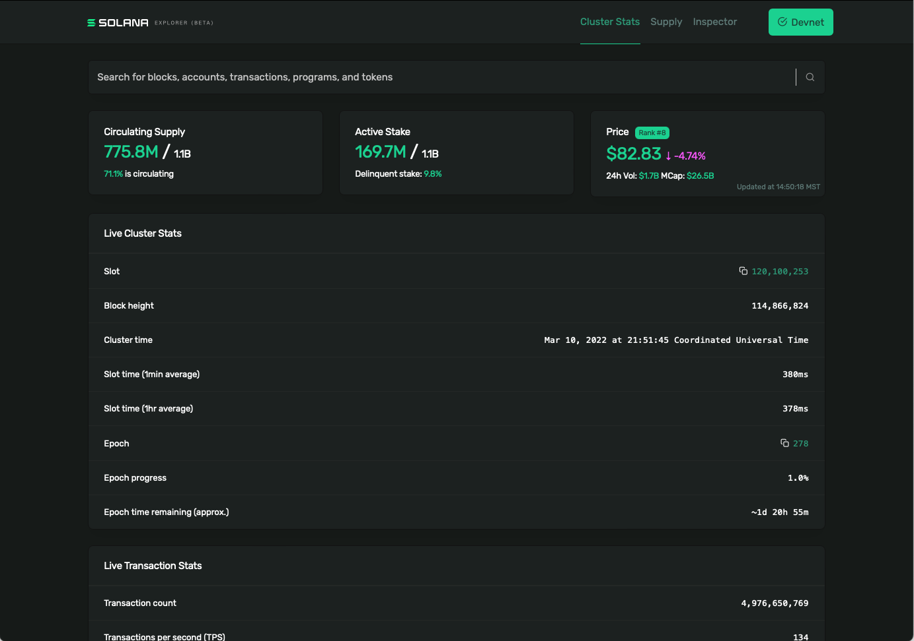
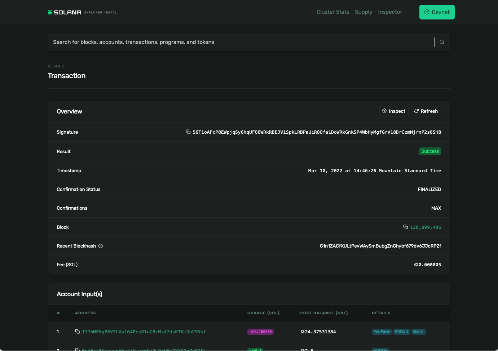

# TL;DR

- **Keypair** ay tumutukoy sa isang pagpapares ng pampubliko at lihim na mga susi. Ang pampublikong key ay ginagamit bilang isang "address" na tumuturo sa isang account sa network ng Solana. Ang lihim na susi ay ginagamit upang i-verify ang pagkakakilanlan o awtoridad. Gaya ng ipinahihiwatig ng pangalan, dapat mong palaging panatilihing *pribado* ang mga lihim na susi. Ang `@solana/web3.js` ay nagbibigay ng mga function ng helper para sa paglikha ng bagong keypair, o para sa pagbuo ng keypair gamit ang isang umiiral nang secret key.
- Ang **Transactions** ay epektibong isang bundle ng mga tagubilin na humihimok ng mga programang Solana. Ang resulta ng bawat transaksyon ay depende sa program na tinatawag. Ang lahat ng mga pagbabago sa on-chain na data ay nangyayari sa pamamagitan ng mga transaksyon. Halimbawa:
    ```tsx
    const transaction = new Transaction()

    const sendSolInstruction = SystemProgram.transfer({
        fromPubkey: sender,
        toPubkey: recipient,
        lamports: LAMPORTS_PER_SOL * amount
    })

    transaction.add(sendSolInstruction)

    const signature = sendAndConfirmTransaction(
        connection,
        transaction,
        [senderKeypair]
    )
    ```

# Pangkalahatang-ideya

## Keypair

Gaya ng ipinahihiwatig ng pangalan, ang keypair ay isang pares ng mga susi: isang pampublikong susi at isang lihim na susi.

- Ang pampublikong susi ay ginagamit bilang isang "address" na tumuturo sa isang account sa network ng Solana.
- Ang lihim na susi ay ginagamit upang i-verify ang pagkakakilanlan o awtoridad. Gaya ng ipinahihiwatig ng pangalan, dapat mong palaging panatilihing *pribado* ang mga lihim na susi.

Ang keypair ay *kinakailangan* para sa karamihan ng mga pakikipag-ugnayan sa loob ng network ng Solana. Kung wala ka pang keypair, o kung gusto mong bumuo ng bago para sa isang partikular na layunin, ang `@solana/web3.js` ay nagbibigay ng helper function para sa paggawa ng bagong keypair.

```tsx
const ownerKeypair = Keypair.generate()
```

Ang keypair ay nasa uri ng data na `Keypair` at maaaring i-deconstruct sa isang pampublikong key:

```tsx
const publicKey = ownerKeypair.publicKey
```

... o ang secret key:

```tsx
const secretKey = ownerKeypair.secretKey
```

Kung mayroon ka nang keypair na gusto mong gamitin, maaari kang lumikha ng `Keypair` mula sa secret key gamit ang `Keypair.fromSecretKey()` function. Upang matiyak na mananatiling secure ang iyong sikretong key, inirerekomenda namin ang pag-inject nito sa pamamagitan ng isang environment variable at hindi i-commit ang iyong `.env` file.

```tsx
const secret = JSON.parse(process.env.PRIVATE_KEY ?? "") as number[]
const secretKey = Uint8Array.from(secret)
const keypairFromSecretKey = Keypair.fromSecretKey(secretKey)
```

## Mga Transaksyon

Ang anumang pagbabago sa on-chain na data ay nangyayari sa pamamagitan ng mga transaksyong ipinadala sa mga programa.

Ang mga tagubilin sa transaksyon ay naglalaman ng:

- isang identifier ng program na balak mong gamitin
- isang hanay ng mga account na babasahin mula sa at/o isusulat sa
- data na nakabalangkas bilang isang byte array na tinukoy sa program na ini-invoke

Kapag nagpadala ka ng transaksyon sa isang Solana cluster, ang isang Solana program ay ini-invoke kasama ang mga tagubiling kasama sa transaksyon.

Gaya ng maaari mong asahan, ang `@solana/web3.js` ay nagbibigay ng mga function ng helper para sa paggawa ng mga transaksyon at mga tagubilin. Maaari kang gumawa ng bagong transaksyon kasama ang constructor, `new Transaction()`. Kapag nagawa na, maaari kang magdagdag ng mga tagubilin sa transaksyon gamit ang pamamaraang `add()`.

Maaaring maging kumplikado ang mga instruction kapag nagtatrabaho sa mga custom na programa. Sa kabutihang palad, ang `@solana/web3.js` ay may mga function ng kaginhawahan para sa ilan sa mga katutubong programa at pangunahing operasyon ng Solana, tulad ng paglilipat ng SOL:

```tsx
const transaction = new Transaction()

const sendSolInstruction = SystemProgram.transfer({
    fromPubkey: sender,
    toPubkey: recipient,
    lamports: LAMPORTS_PER_SOL * amount
})

transaction.add(sendSolInstruction)
```

Ang function na `SystemProgram.transfer()` ay nangangailangan na ipasa mo bilang mga parameter:

- isang pampublikong susi na naaayon sa account ng nagpadala
- isang pampublikong susi na naaayon sa account ng tatanggap
- ang halaga ng SOL na ipapadala sa lamports.

Ibinabalik ng function na ito ang pagtuturo para sa pagpapadala ng SOL mula sa nagpadala sa tatanggap, pagkatapos nito ay maaaring idagdag ang pagtuturo sa transaksyon.

Kapag nagawa na, kailangang ipadala ang isang transaksyon sa cluster at kumpirmahin:

```tsx
const signature = sendAndConfirmTransaction(
    connection,
    transaction,
    [senderKeypair]
)
```

Ang mga function na `sendAndConfirmTransaction()` ay tumatagal bilang mga parameter

- isang kumpol na koneksyon
- isang transaksyon
- isang hanay ng mga keypair na magsisilbing mga lumagda sa transaksyon - sa halimbawang ito, mayroon lang kaming isang pumirma: ang nagpadala.

### Mga tagubilin

Ang halimbawa ng pagpapadala ng SOL ay mahusay para sa pagpapakilala sa iyo sa pagpapadala ng mga transaksyon, ngunit maraming web3 development ang magsasangkot ng pagtawag sa mga hindi katutubong programa. Sa halimbawa sa itaas, tinitiyak ng function na `SystemProgram.transfer()` na maipapasa mo ang lahat ng kinakailangang data na kinakailangan upang gawin ang pagtuturo, pagkatapos ay gagawa ito ng pagtuturo para sa iyo. Kapag nagtatrabaho sa mga hindi katutubong programa, gayunpaman, kakailanganin mong maging napaka-espesipiko tungkol sa paggawa ng mga tagubilin na nakabalangkas upang tumugma sa kaukulang programa.

Sa `@solana/web3.js`, makakagawa ka ng mga hindi katutubong tagubilin gamit ang constructor ng `TransactionInstruction`. Ang constructor na ito ay tumatagal ng isang argument ng uri ng data na `TransactionInstructionCtorFields`.

```tsx
export type TransactionInstructionCtorFields = {
  keys: Array<AccountMeta>;
  programId: PublicKey;
  data?: Buffer;
};
```

Alinsunod sa kahulugan sa itaas, ang bagay na ipinasa sa `TransactionInstruction` constructor ay nangangailangan ng:

- isang hanay ng mga key na may uri ng `AccountMeta`
- ang pampublikong susi para sa programang tinatawag
- isang opsyonal na `Buffer` na naglalaman ng data na ipapasa sa program.

Babalewalain natin ang field ng `data` sa ngayon at muli itong babalikan sa susunod na aralin.

Ang field ng `programId` ay medyo nagpapaliwanag sa sarili: ito ang pampublikong susi na nauugnay sa programa. Kakailanganin mong malaman ito nang maaga sa pagtawag sa programa sa parehong paraan na kailangan mong malaman ang pampublikong susi ng isang taong gusto mong padalhan ng SOL.

Ang hanay ng `keys` ay nangangailangan ng kaunting paliwanag. Ang bawat bagay sa array na ito ay kumakatawan sa isang account na babasahin o isusulat sa panahon ng pagpapatupad ng isang transaksyon. Nangangahulugan ito na kailangan mong malaman ang pag-uugali ng program na iyong tinatawagan at tiyaking ibibigay mo ang lahat ng kinakailangang mga account sa array.

Ang bawat bagay sa hanay ng `keys` ay dapat may kasamang sumusunod:
- `pubkey` - ang pampublikong susi ng account
- `isSigner` - isang boolean na kumakatawan kung ang account ay isang lumagda sa transaksyon o hindi
- `isWritable` - isang boolean na kumakatawan kung ang account ay isinulat o hindi sa panahon ng pagpapatupad ng transaksyon

Kung pinagsama-sama ito, maaari tayong magkaroon ng isang bagay tulad ng sumusunod:

```tsx
async function callProgram(
    connection: web3.Connection,
    payer: web3.Keypair,
    programId: web3.PublicKey,
    programDataAccount: web3.PublicKey
) {
    const instruction = new web3.TransactionInstruction({
        keys: [
            {
                pubkey: programDataAccount,
                isSigner: false,
                isWritable: true
            },
        ],
        programId
    })

    const signature = await web3.sendAndConfirmTransaction(
        connection,
        new web3.Transaction().add(instruction),
        [payer]
    )

    console.log(signature)
}
```

### Bayarin sa transaksyon

Ang mga bayarin sa transaksyon ay binuo sa ekonomiya ng Solana bilang kabayaran sa validator network para sa mga mapagkukunan ng CPU at GPU na kinakailangan sa pagproseso ng mga transaksyon. Hindi tulad ng maraming network na may market ng bayad kung saan maaaring magbayad ang mga user ng mas matataas na bayarin upang mapataas ang kanilang pagkakataong mapabilang sa susunod na block, ang mga bayarin sa transaksyon sa Solana ay deterministiko.

Ang unang lumagda na kasama sa hanay ng mga pumirma sa isang transaksyon ay may pananagutan sa pagbabayad ng bayarin sa transaksyon. Kung ang signer na ito ay walang sapat na SOL sa kanilang account upang mabayaran ang bayad sa transaksyon ang transaksyon ay ibababa.

Kapag sumusubok, lokal man o sa devnet, maaari mong gamitin ang Solana CLI command na `solana airdrop 1` upang makakuha ng libreng pagsubok na SOL sa iyong account para sa pagbabayad ng mga bayarin sa transaksyon.

### Solana Explorer



Ang lahat ng mga transaksyon sa blockchain ay makikita ng publiko sa [Solana Explorer](http://explorer.solana.com). Halimbawa, maaari mong kunin ang pirmang ibinalik ng `sendAndConfirmTransaction()` sa halimbawa sa itaas, hanapin ang pirmang iyon sa Solana Explorer, pagkatapos ay tingnan ang:

- kapag nangyari ito
- saang block ito kasama
- ang bayad sa transaksyon
- at iba pa!



# Demo

Gagawa kami ng script para i-ping ang isang simpleng program na nagdaragdag ng counter sa tuwing na-ping ito. Ang program na ito ay umiiral sa Solana Devnet sa address na `ChT1B39WKLS8qUrkLvFDXMhEJ4F1XZzwUNHUt4AU9aVa`. Iniimbak ng program ang data ng pagbilang sa isang partikular na account sa address na `Ah9K7dQ8EHaZqcAsgBW8w37yN2eAy3koFmUn4x3CJtod`.

### 1. Basic scaffolding

Magsimula tayo sa ilang pangunahing scaffolding. Malugod kang i-set up ang iyong proyekto gayunpaman, sa tingin mo ay pinakaangkop, ngunit gagamit kami ng isang simpleng Typescript na proyekto na may dependency sa @solana/web3.js package. Kung gusto mong gamitin ang aming scaffolding, maaari mong gamitin ang mga sumusunod na command sa command line:

```bash
mkdir -p solana-ping-client/src && \
	cd solana-ping-client && \
	touch src/index.ts && \
	git init && touch .gitignore && \
	npm init -y && \
	npm install --save-dev typescript && \
  npm install --save-dev ts-node && \
	npx tsc --init && \
	npm install @solana/web3.js && \
	npm install dotenv && \
	touch .env
```

Ito ay:

1. gumawa ng bagong direktoryo para sa proyekto na may subdirectory na `src`
2. ilipat ang command line prompt sa loob ng direktoryo ng proyekto
3. gumawa ng `index.ts` file sa loob ng `src`
4. magpasimula ng git repository na may `.gitignore` file
5. gumawa ng bagong `npm` package
6. magdagdag ng dependency ng developer sa typescript
7. magdagdag ng dependency ng developer sa `ts-node`
8. lumikha ng `.tsconfig` file
9. i-install ang `@solana/web3.js` dependency
10. i-install ang `.dotenv` dependency
11. gumawa ng `.env` file

Kung gusto mong itugma nang eksakto ang aming code, palitan ang mga nilalaman ng `tsconfig.json` ng sumusunod:

```json
{
  "compilerOptions": {
    "target": "es5",
    "module": "commonjs",
    "strict": true,
    "esModuleInterop": true,
    "skipLibCheck": true,
    "forceConsistentCasingInFileNames": true,
    "outDir": "dist"
  },
  "include": [ "./src/**/*" ]
}
```

Idagdag ang sumusunod sa `.gitignore`:

```
node_modules/
dist/
.env
```

At sa wakas, idagdag ang sumusunod sa object na `scripts` sa `package.json`:

```json
"start": "ts-node src/index.ts"
```

### 2. Bumuo ng bagong keypair

Bago mo magawa ang anuman, kakailanganin mo ng keypair. Pumunta tayo sa `index.ts` file at bumuo ng isa:

```tsx
import web3 = require('@solana/web3.js')
import Dotenv from 'dotenv'
Dotenv.config()

async function main() {
    const newKeypair = web3.Keypair.generate()
    console.log(newKeypair.secretKey.toString())
}

main().then(() => {
    console.log("Finished successfully")
}).catch((error) => {
    console.error(error)
})
```

Karamihan sa code na ito ay boilerplate lamang upang patakbuhin nang maayos ang file. Ang mga linya sa loob ng function na `main()` ay bumubuo ng bagong keypair at i-log ang secret key sa console.

Patakbuhin ang `npm start` pagkatapos i-save ang file na ito at dapat mong makita ang isang hanay ng mga numero na naka-print sa console. Ang array na ito ay kumakatawan sa sikretong key para sa iyong bagong keypair. **Huwag** gamitin ang keypair na ito para sa mga pagpapatakbo ng Mainnet. **Gamitin lang ang keypair na ito para sa pagsubok.**

Kopyahin ang secret key array mula sa console log at i-paste ito sa `.env` file bilang environment variable na tinatawag na, `PRIVATE_KEY`. Sa ganitong paraan maaari naming muling gamitin ang keypair na ito sa hinaharap na pagbuo sa halip na bumuo ng bagong keypair sa tuwing magpapatakbo kami ng isang bagay. Dapat itong magmukhang ganito ngunit may magkakaibang mga numero:

```
PRIVATE_KEY=[56,83,31,62,66,154,33,74,106,59,111,224,176,237,89,224,10,220,28,222,128,36,138,89,30,252,100,209,206,155,154,65,98,194,97,182,98,162,107,238,61,183,163,215,44,6,10,49,218,156,5,131,125,253,247,190,181,196,0,249,40,149,119,246]
```

### 3. Simulan ang Keypair mula sa lihim

Ngayong matagumpay na kaming nakabuo ng keypair at nakopya ito sa `.env` file, maaari naming alisin ang code sa loob ng `main()` function.

Babalik tayo sa function na `main()` sa lalong madaling panahon, ngunit sa ngayon ay gumawa tayo ng bagong function sa labas ng `main()` na tinatawag na `initializeKeypair()`. Sa loob ng bagong function na ito:

1. i-parse ang `PRIVATE_KEY` na environment variable bilang `number[]`
2. gamitin ito upang simulan ang isang `Uint8Array`
3. simulan at ibalik ang isang `Keypair` gamit ang `Uint8Array` na iyon.

```tsx
function initializeKeypair(): web3.Keypair {
    const secret = JSON.parse(process.env.PRIVATE_KEY ?? "") as number[]
    const secretKey = Uint8Array.from(secret)
    const keypairFromSecretKey = web3.Keypair.fromSecretKey(secretKey)
    return keypairFromSecretKey
}
```

### 4. Ping program

Ngayon na mayroon na kaming paraan ng pagsisimula ng aming keypair, kailangan naming magtatag ng koneksyon sa Devnet ni Solana. Sa `main()`, tawagin natin ang `initializeKeypair()` at gumawa ng koneksyon:

```tsx
async function main() {
    const payer = initializeKeypair()
    const connection = new web3.Connection(web3.clusterApiUrl('devnet'))
}
```

Gumawa ngayon ng async function sa labas ng `main()` na tinatawag na `pingProgram()` na may dalawang parameter na nangangailangan ng koneksyon at keypair ng nagbabayad bilang mga argumento:

```tsx
async function pingProgram(connection: web3.Connection, payer: web3.Keypair) { }
```

Sa loob ng function na ito, kailangan nating:

1. gumawa ng transaksyon
2. gumawa ng panuto
3. idagdag ang pagtuturo sa transaksyon
4. ipadala ang transaksyon.

Tandaan, ang pinaka-mapanghamong piraso dito ay ang pagsasama ng tamang impormasyon sa pagtuturo. Alam namin ang address ng programa na aming tinatawagan. Alam din namin na ang program ay nagsusulat ng data sa isang hiwalay na account na ang address ay mayroon din kami. Idagdag natin ang mga string na bersyon ng pareho ng mga iyon bilang mga constant sa itaas ng `index.ts` file:

```tsx
const PROGRAM_ADDRESS = 'ChT1B39WKLS8qUrkLvFDXMhEJ4F1XZzwUNHUt4AU9aVa'
const PROGRAM_DATA_ADDRESS = 'Ah9K7dQ8EHaZqcAsgBW8w37yN2eAy3koFmUn4x3CJtod'
```

Ngayon, sa function na `pingProgram()`, gumawa tayo ng bagong transaksyon, pagkatapos ay magpasimula ng `PublicKey` para sa program account, at isa pa para sa data account.

```tsx
async function pingProgram(connection: web3.Connection, payer: web3.Keypair) {
    const transaction = new web3.Transaction()

    const programId = new web3.PublicKey(PROGRAM_ADDRESS)
    const programDataPubkey = new web3.PublicKey(PROGRAM_DATA_ADDRESS)
}
```

Susunod, gawin natin ang pagtuturo. Tandaan, kailangang isama ng pagtuturo ang pampublikong susi para sa programa at kailangan din nitong magsama ng array kasama ang lahat ng account na babasahin o isusulat. Sa halimbawang programang ito, tanging ang data account na tinukoy sa itaas ang kailangan.

```tsx
async function pingProgram(connection: web3.Connection, payer: web3.Keypair) {
    const transaction = new web3.Transaction()

    const programId = new web3.PublicKey(PROGRAM_ADDRESS)
    const programDataPubkey = new web3.PublicKey(PROGRAM_DATA_ADDRESS)

    const instruction = new web3.TransactionInstruction({
        keys: [
            {
                pubkey: programDataPubkey,
                isSigner: false,
                isWritable: true
            },
        ],
        programId
    })
}
```

Susunod, idagdag natin ang pagtuturo sa transaksyon na ginawa namin sa simula ng function. Pagkatapos, tumawag sa `sendAndConfirmTransaction()` sa pamamagitan ng pagpasa sa koneksyon, transaksyon, at nagbabayad. Panghuli, i-log natin ang resulta ng tawag sa function na iyon para mahanap natin ito sa Solana Explorer.

```tsx
async function pingProgram(connection: web3.Connection, payer: web3.Keypair) {
    const transaction = new web3.Transaction()

    const programId = new web3.PublicKey(PROGRAM_ADDRESS)
    const programDataPubkey = new web3.PublicKey(PROGRAM_DATA_ADDRESS)

    const instruction = new web3.TransactionInstruction({
        keys: [
            {
                pubkey: programDataPubkey,
                isSigner: false,
                isWritable: true
            },
        ],
        programId
    })

    transaction.add(instruction)

    const signature = await web3.sendAndConfirmTransaction(
        connection,
        transaction,
        [payer]
    )

    console.log(signature)
}
```
Panghuli, i-invoke natin ang `pingProgram()` sa loob ng `main()` gamit ang `connection` at `payer`:

```tsx
async function main() {
    const payer = initializeKeypair()
    const connection = new web3.Connection(web3.clusterApiUrl('devnet'))
    await pingProgram(connection, payer)
}
```

### 5. Airdrop

Ngayon patakbuhin ang code gamit ang `npm start` at tingnan kung gumagana ito. Maaari kang magkaroon ng sumusunod na error sa console:

> Nabigo ang simulation ng transaksyon: Subukang mag-debit ng isang account ngunit walang nakitang talaan ng isang naunang kredito.

Kung makuha mo ang error na ito, ito ay dahil ang iyong keypair ay bago at walang anumang SOL upang masakop ang mga bayarin sa transaksyon. Ayusin natin ito sa pamamagitan ng pagdaragdag ng sumusunod na linya sa `main()` bago ang tawag sa `pingProgram()`:

```tsx
await connection.requestAirdrop(payer.publicKey, web3.LAMPORTS_PER_SOL*1)
```

Ito ay magdeposito ng 1 SOL sa iyong account na magagamit mo para sa pagsubok. Hindi ito gagana sa Mainnet kung saan ito ay talagang may halaga. Ngunit ito ay hindi kapani-paniwalang maginhawa para sa pagsubok sa lokal at sa Devnet.

### 6. Suriin ang Solana explorer

Ngayon patakbuhin muli ang code. Maaaring tumagal ng isang sandali o dalawa, ngunit ngayon ay dapat gumana ang code at dapat mong makita ang isang mahabang string na naka-print sa console, tulad ng sumusunod:

```
55S47uwMJprFMLhRSewkoUuzUs5V6BpNfRx21MpngRUQG3AswCzCSxvQmS3WEPWDJM7bhHm3bYBrqRshj672cUSG
```

Kopyahin itong pirma ng kumpirmasyon. Magbukas ng browser at pumunta sa [https://explorer.solana.com/?cluster=devnet](https://explorer.solana.com/?cluster=devnet) (siguraduhin ng parameter ng query sa dulo ng URL na tutuklasin mo ang mga transaksyon sa Devnet sa halip na sa Mainnet). I-paste ang signature sa search bar sa tuktok ng Devnet explorer ni Solana at pindutin ang enter. Dapat mong makita ang lahat ng mga detalye tungkol sa transaksyon. Kung mag-scroll ka hanggang sa ibaba, makikita mo ang `Program Logs`, na nagpapakita kung gaano karaming beses na-ping ang program kasama ang iyong ping.


Kung gusto mong gawing mas madali ang pagtingin sa Solana Explorer para sa mga transaksyon sa hinaharap, palitan lang ang iyong `console.log` sa `pingProgram()` sa sumusunod:

```tsx
console.log(`You can view your transaction on the Solana Explorer at:\nhttps://explorer.solana.com/tx/${sig}?cluster=devnet`)
```

At tulad niyan tumatawag ka sa mga programa sa network ng Solana at nagsusulat ng data sa chain!

Sa susunod na ilang mga aralin, matututunan mo kung paano

1. gawin ito nang ligtas mula sa browser sa halip na mula sa pagpapatakbo ng script
2. magdagdag ng custom na data sa iyong mga tagubilin
3. deserialize ang data mula sa chain

# Hamon

Sige at gumawa ng script mula sa simula na magbibigay-daan sa iyong ilipat ang SOL mula sa isang account patungo sa isa pa sa Devnet. Siguraduhing i-print ang lagda ng transaksyon upang makita mo ito sa Solana Explorer.

Kung natigil ka huwag mag-atubiling tingnan ang [code ng solusyon](https://github.com/Unboxed-Software/solana-send-sol-client).
