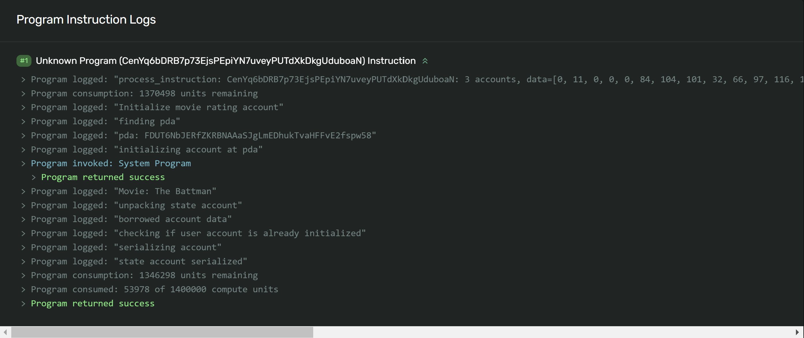

# Movie Review Program Pt1

### List links for further reading here:

- [Rust book](https://doc.rust-lang.org/stable/book/)
- [Rust by Example](https://doc.rust-lang.org/rust-by-example/index.html)
- [On-Chain Solana Docs](https://docs.solana.com/developing/on-chain-programs/overview)

# Lesson Objectives

*By the end of this lesson, you will be able to:*

- Deserialize Instruction Data
- Deserialize Account Data
- Iterate over Accounts
- Log messages within a Program
- Learn the Structure of a Smart Contract on Solana

# TL;DR

- The focus over the next three lessons will be to walk you through how the Movie Review program that was used in the first module was created. This is split up over multiple lessons to make the information a little more digestible.
- In the previous lesson, the Hello World demo was confined to a single file. Going forward we'll be separating our smart contract code into multiple files where the code in each file serves a specific purpose.
- Logging helpful and relevant information is good for troubleshooting during development and for users who will interact with the program because they are visible in the explorer.

# Overview

## Program Structure

Last lesson, we learned about some Rust primitives like Crates and Macros, both of which will be relevant going forward. But, last lesson’s program was simple enough that it could be confined to one file - while you can write almost any smart contract program in one file on Solana, it’s much easier to understand and follow if you break it up across a few different ones.

For this lesson, we will be splitting up this program across 3 different files:

- **lib.rs**
- **instruction.rs**
- **state.rs**

Many Solana smart contract tutorials out there follow the general program architecture that splits the programs across 6 files. While working your way through these, it’s very easy to get carried away and get confused on what each of these files is used for. We felt following this same practice right now might be too much new information to really comprehend how they all fit together, so we are keeping it to 3 files for this lesson - but don’t worry, we will teach you the common program architecture after we’re sure you’ve got the basics.

## Lib

### Entrypoint

In the previous lesson, we learned that Solana programs require a single entry point to process program instructions. The entry point is declared using the [entrypoint!](https://docs.rs/solana-program/latest/solana_program/macro.entrypoint.html) macro.

The entry point to a Solana program requires a function defined with the following parameters:

- `program_id` is the address of the account the program is stored at
- `accounts` is the array of accounts submitted in the transaction
- `instruction_data` is the serialized instruction-specific data

Once the entry point function is defined, it will be passed as an arugment into the `entrypoint!` macro which signifies where the program logic will start where the `program_id`, `accounts`, and `instruction_data` are all passed in as parameters. A simple entrypoint to a program may look like this:

```rust
// bring in crates that will be used
use solana_program::{
    account_info::AccountInfo, entrypoint::ProgramResult,
    pubkey::Pubkey,
    msg,
};
use crate::processor::Processor;
use solana_program::entrypoint;
use instruction::TestInstruction;

// process_instruction funciton passed into entrypoint macro
entrypoint!(process_instruction);

// process_instuction defined, this will be the first block of code to
// execute in the contract
pub fn process_instruction(
  program_id: &Pubkey,
  accounts: &[AccountInfo],
  instruction_data: &[u8]
) -> ProgramResult {
// some logic here
let instruction = ExampleInstruction::unpack(instruction_data)?;
}
```

The entry point and program logic will live inside the lib.rs file.

## Instruction

The instruction.rs file is where you write the logic for deserializing the instruction data to whatever struct your program expects the data to be. Notice in the example above, we brought in a Crate from the instruction.rs file

`use instruction::TestInstruction;`

 there we have written an `unpack` function that will try to deserialize whatever data was passed in as instruction data to the data struct it expects.

To do so, we’ll first define an [enum](https://doc.rust-lang.org/std/keyword.enum.html) that will hold the various different data structs our program can expect to receive.

```rust
use borsh::{BorshDeserialize};
use solana_program::{program_error::ProgramError};

// only one data struct in this enum, but could have as many options
// as we want
pub enum ExampleInstruction {
    TestStruct {
        name: String,
        age: u8,
        bio: String,
    }
}

#[derive(BorshDeserialize)]
struct PostIxPayload {
    name: String,
    age: u8,
    bio: String,
}
```

Next, we can implement the `unpack` function on the `ExampleInstruction` enum that was called in the `process_instruction` function above. This is where we will use borsh to deserialize the `instruction_data` into the `PostIxPayload` struct defined above and create a `TestStruct` from the payload.

```rust
impl ExampleInstruction {
/// Unpack inbound buffer to associated Instruction
/// The expected format for input is a Borsh serialized vector
  pub fn unpack(input: &[u8]) -> Result<Self, ProgramError> {
// take the first byte as the variant to determine which instruction to
//  execute
        let (&variant, rest) = input.split_first().ok_or(ProgramError::InvalidInstructionData)?;
// use the temporary payload struct to deserialize
        let payload = PostIxPayload::try_from_slice(rest).unwrap();
// match the variant to determine which data struct is expected by
// the function and return the TestStruct or an error
        Ok(match variant {
            0 => Self::TestStruct {
                name: payload.name,
                age: payload.age,
                bio: payload.bio},
            _ => return Err(ProgramError::InvalidInstructionData)
        })
    }
}
```

## Lib Cont.

After our instruction data has been deserialized into a struct, our execution is returned back to the `process_instruction` function in the lib.rs file because that’s where the `unpack` function was called. Then, we will match what was returned in our instruction to what the program expects, this will determine where the flow of execution will go next. Match statements in Rust are similar to if/else statements or a switch statement, to learn more about them [check this out](https://doc.rust-lang.org/rust-by-example/flow_control/match.html).

```rust
// inside lib.rs
// crates
use solana_program::{
    entrypoint,
    pubkey::Pubkey,
    msg,
    account_info::{next_account_info, AccountInfo},
    program_error::ProgramError,
};
pub mod instruction;
use instruction::MovieInstruction;

entrypoint!(process_instruction);

pub fn process_instruction(
  program_id: &Pubkey,
  accounts: &[AccountInfo],
  instruction_data: &[u8]
) -> ProgramResult {
// call unpack to deserialize instruction_data
  let instruction = ExampleInstruction::unpack(instruction_data)?;
// match the returned data struct to what you expect
  match instruction {
    ExampleInstruction::TestStruct { name, age, bio } => {
			// make call to a function to execute some logic with the
			// the accounts and the deserialized instruction data
      do_something(program_id, accounts, name, age, bio)
    }
  }
}
```

For simple programs where there is only one or two instructions to execute, it’s fine to write the logic inside the match statement. For programs with many different possible instructions to match against, it’s much easier to read/understand if the logic is executed in a separate function that’s called in the match statement. As you can see, we are following the latter practice here by making a call to a function called `do_something` that will execute some more logic.

When it’s time to write logic code, you are generally going to want access to the accounts passed in with the transaction. Right now, the `accounts` variable is an array of `AccountInfos`. Remember that all accounts necessary for Solana programs must be provided as input and in the order that they are expected. Because of this, as developers we do not need to worry about writing generic code to handle all situations - if something in the `accounts` array is not what’s expected we can just return an error.

So, to get the accounts passed in we’ll have to iterate over each account one by one and store them in a temporary variable whose scope is within this function. We can do this using an [iterator](https://doc.rust-lang.org/rust-by-example/trait/iter.html?highlight=iter#iterators) which is a programming concept unique to Rust. Normally, we’d have to write some type of for/while loop to iterate over items in an array, but with Rust there is functionality built in to do just that without looping.

```rust
pub fn do_something(
  program_id: &Pubkey,
  accounts: &[AccountInfo],
  name: String,
  age: u8,
  bio: String
) -> ProgramResult {
	// Get Account iterator
	let account_info_iter = &mut accounts.iter();

	// Get first account
	let fee_payer = next_account_info(account_info_iter)?;
	// Get second account
	let user_account = next_account_info(account_info_iter)?;
	....

}
```

The [next_account_info](https://docs.rs/solana-program/latest/solana_program/account_info/fn.next_account_info.html) function from the `solana_program` crate defines how to fetch the next item in an `AccountInfo` iterator.  Depending on how many accounts your program expects, you will have to do this for each one. The `fee_payer` and `user_account` variables are of type [AccountInfo](https://docs.rs/solana-program/latest/solana_program/account_info/struct.AccountInfo.html) that has the following properties:

```rust
pub struct AccountInfo<'a> {
    pub key: &'a Pubkey,
    pub is_signer: bool,
    pub is_writable: bool,
    pub lamports: Rc<RefCell<&'a mut u64>>,
    pub data: Rc<RefCell<&'a mut [u8]>>,
    pub owner: &'a Pubkey,
    pub executable: bool,
    pub rent_epoch: Epoch,
}
```

Luckily for us, the `next_account_info` function handles everything behind the scenes for us here. Once you’ve called this function and passed in an iterator over an array of `AccountInfos`, all of these properties will be available to you. Using our example above, that would look like:

```rust
...

// Get Account iterator
let account_info_iter = &mut accounts.iter();

// Get first account
let fee_payer = next_account_info(account_info_iter)?;
// Get second account
let user_account = next_account_info(account_info_iter)?;


// check if account signed the transaction
if !fee_payer.is_signer {
	msg!("Fee payer is not signer");
  return Err(ProgramError::MissingRequiredSignature);
}

....

```

## State

By now, we should be familiar with the fact that programs on Solana are stateless, so the only way to persist state is with accounts. This is done by writing state to the data fields of System Accounts, but remember this field is just bytes of data. In order for us to be able to read/update this field in the program, we should have a way to deserialize a specific account’s data field similarly to how we will deserialize the `instruction_data` passed in. That logic for how a specific account (say an account representing a MovieReview) will live inside the state.rs file.

In order to deserialize account data, we must first define how that data should be deserialized. To do that, we’ll need to create a struct inside state.rs that will represent what we want the byte buffer to be deserialized into. Again, we’ll be using some Borsh macros to make this process a little easier.

```rust
// inside state.rs
// bring in crates
use solana_program::{
    program_pack::{IsInitialized, Sealed},
};
use borsh::{BorshDeserialize, BorshSerialize};

#[derive(BorshSerialize, BorshDeserialize)]
pub struct UserInfo {
    pub is_initialized: bool,
    pub age: u8,
    pub name: String,
    pub bio: String,
}

impl IsInitialized for UserInfo {
    fn is_initialized(&self) -> bool {
        self.is_initialized
    }
}
```

Because we used the Borsh macro on this struct, there are some functions that are implemented for it that will help with the deserialization part. Now that the state is defined, we can deserialize an account’s data field into this struct and have access to that information in a much easier to read format.

```rust
// inside lib.rs
use crate::state::UserInfo

...

// iterator over the accounts array created
let account_info_iter = &mut accounts.iter();
// get accounts
let fee_payer = next_account_info(account_info_iter)?;
let user_account = next_account_info(account_info_iter)?;
// using try_from_slice_unchecked Borsh can deserialize the byte
// buffer into our UserInfo struct
let account_data = try_from_slice_unchecked::<UserInfo>(&user_account.data.borrow()).unwrap();

// if successful, account_data is now a UserInfo struct

...
```

## Lib Cont.

In the previous lesson, the Hello World demo only had one file. Now, we’re learning how to split programs up across three separate files. Once you start splitting your program up like this you will need to make sure you register all of the files in one central location, we’ll be doing this in lib.rs as well. **You must register every file in your program like this.**

```rust
// this would be inside lib.rs
pub mod instruction;
pub mod state;
```

## Program Logs

Logging is a very important part of software development and that’s no different for Smart Contract development. Logs are useful for developers when writing Smart Contracts, as well as for users of the contract. Program logs in Solana are visible in the block explorer when viewing a transaction all the way at the bottom of the page. Scroll to the bottom of [this transaction](https://explorer.solana.com/tx/4txDU5oBtjHQxWKJj1AnoDSfEQUurE6kBoiGqDprX6fBL2rEnLK5qJqLc2f1i9zMauYSSRq1nQJjeJzCCFF7BVsU?cluster=devnet) in the Solana Explorer to view the logs from a transaction sent to the Movie Review program.



To write logs like this, all you have to do is bring in `msg` function from the `solana_program` crate.

```rust
use solana::program::msg;
// write a log
msg!("This is a test log");
// log with data in it, the data will be where the {} are
msg!("Data from the program: {}", test_struct.key);
```

## Demo

For this lesson’s demo, we’ll be building out the first half of the Movie Review program with a focus on deserializing instruction data, iterating over accounts, deserializing account data, and creating program logs. The following lesson will focus on the second half of this program.

### 1. Entry Point
We’ll be using [SolPG](https://beta.solpg.io/) again to build out this program. SolPG saves state in your browser, so everything you did in the previous lesson should still be there. To get started, we’re going clear everything out from the current [lib.rs](http://lib.rs) file.

Inside lib.rs, we’re going to bring in the following crates and define where we’d like our entry point to the program to be with the `entrypoint` macro.

```rust
use solana_program::{
    entrypoint,
    entrypoint::ProgramResult,
    pubkey::Pubkey,
    msg,
    account_info::{next_account_info, AccountInfo},
    system_instruction,
    program_error::ProgramError,
    sysvar::{rent::Rent, Sysvar},
    program::{invoke_signed},
    borsh::try_from_slice_unchecked,
    program_pack::{IsInitialized},
};
use std::convert::TryInto;
pub mod instruction;
pub mod state;
use instruction::MovieInstruction;
use state::MovieAccountState;
use borsh::BorshSerialize;

// entry point is a function call process_instruction
entrypoint!(process_instruction);
```

Using the `entrypoint` macro, we determined `process_instruction` as the program entry point, now we can define this function below.

```rust
// inside lib.rs
pub fn process_instruction(
  program_id: &Pubkey,
  accounts: &[AccountInfo],
  instruction_data: &[u8]
) -> ProgramResult {
// makes call to unpack function, which undefined at the moment
  let instruction = MovieInstruction::unpack(instruction_data)?;

}
```

### 2. Deserialize Instruction Data
Now, before we continue with the processor logic, the rest will make more sense if we implement the `unpack` function we just added above. Create a new file called instruction.rs and add the following:

```rust
use borsh::{BorshDeserialize};
use solana_program::{program_error::ProgramError};

pub enum MovieInstruction {
  AddMovieReview {
    title: String,
    rating: u8,
    description: String
  }
}

#[derive(BorshDeserialize)]
struct MovieReviewPayload {
  title: String,
  rating: u8,
  description: String
}
```

We just brought in the crates we’ll need for this file and defined the structs we’ll be using to deserialize the `instruction_data` into. Notice the `#derive(….)]` above the payload struct, this is known as an [attribute](https://doc.rust-lang.org/rust-by-example/attribute.html) in Rust. Specifically, the [derive attribute](https://doc.rust-lang.org/rust-by-example/trait/derive.html) allows the compiler to provide some basic implementations that can be used on the data structure with this attribute. We’re deriving some traits that make deserialization with Borsh much easier. It is also helpful to note that you can define your own customized versions of these implementations if you’d like, but for our purposes the basic ones will do the trick.

Finally, we’ll implement and define the `unpack` function on the `IntroInstruction` enum.

```rust
...
// inside instruction.rs
impl MovieInstruction {
/// Unpack inbound buffer to associated Instruction
/// The expected format for input is a Borsh serialized vector
  pub fn unpack(input: &[u8]) -> Result<Self, ProgramError> {
				// split the first byte of data
        let (&variant, rest) = input.split_first().ok_or(ProgramError::InvalidInstructionData)?;
				// try_from_slice is one of the implementations from the BorshDeserialization trait
				// deserializes instruction byte data into the payload struct
        let payload = MovieReviewPayload::try_from_slice(rest).unwrap();
				// match the first byte and return the AddMovieReview struct
        Ok(match variant {
            0 => Self::AddMovieReview {
                title: payload.title,
                rating: payload.rating,
                description: payload.description },
            _ => return Err(ProgramError::InvalidInstructionData)
        })
    }
}
```

And that’s it for the instruction file! Now, remember we left the lib.rs file partially finished to come and write the implementation on the unpack function.
### 3. Program Logic
Now that that’s done, we know how the `unpack` function will deserialize the data and the struct we expect to receive. So, let’s add it to our match instruction inside lib.rs.

```rust
// inside lib.rs
pub fn process_instruction(
  program_id: &Pubkey,
  accounts: &[AccountInfo],
  instruction_data: &[u8]
) -> ProgramResult {
// unpack called
  let instruction = MovieInstruction::unpack(instruction_data)?;
// match against the data struct returned into `instruction` variable
  match instruction {
    MovieInstruction::AddMovieReview { title, rating, description } => {
			// make a call to `add_move_review` function
      add_movie_review(program_id, accounts, title, rating, description)
    }
  }
}
```

Next, we’ll write the logic for the `add_movie_review` function that we’re calling in the code above. Notice, that we passed in the `program_id` , `accounts` , and the deserialized `instruction_data`  to this function.

The first thing we’ll do inside the `add_movie_review` function is iterate over our array of `AccountInfos` that was passed in the function using `next_account_info`. For this demo, we’ll expect two accounts to be passed in - the payer of the transaction and the movie review account. The actual movie review program will require more that we will discuss in the next lesson because that focuses on creating new movie reviews. The purpose of this lesson is to just fetch a movie review account that has already been created and log the account’s data.

```rust
pub fn add_movie_review(
  program_id: &Pubkey,
  accounts: &[AccountInfo],
  title: String,
  rating: u8,
  description: String
) -> ProgramResult {

    // Get Account iterator
    let account_info_iter = &mut accounts.iter();

    // Get accounts
    let initializer = next_account_info(account_info_iter)?;
    let movie_review = next_account_info(account_info_iter)?;
}
```

### 4. Deserialize State
Once we have grabbed the `AccountInfos` from the array, we can define how we want to deserialize its data. Create a new file called state.rs and add the following:

```rust
// inside state.rs
use borsh::{BorshSerialize, BorshDeserialize};
use solana_program::{
    program_pack::{IsInitialized, Sealed},
};

#[derive(BorshSerialize, BorshDeserialize)]
pub struct MovieAccountState {
    pub is_initialized: bool,
    pub rating: u8,
    pub title: String,
    pub description: String
}

impl Sealed for MovieAccountState {}

impl IsInitialized for MovieAccountState {
    fn is_initialized(&self) -> bool {
        self.is_initialized
    }
}
```
### 5. Program Logic Continued
Finally, let’s deserialize the movie review account’s data and log it!

```rust
// inside lib.rs
pub fn add_movie_review(
  program_id: &Pubkey,
  accounts: &[AccountInfo],
  title: String,
  rating: u8,
  description: String
) -> ProgramResult {
// logging instruction data that was passed in
msg!("Adding movie review...");
msg!("Title: {}", title);
msg!("Rating: {}", rating);
msg!("Description: {}", description);

// Get Account iterator
let account_info_iter = &mut accounts.iter();

// Get accounts
let initializer = next_account_info(account_info_iter)?;
let movie_review = next_account_info(account_info_iter)?;
// deserialize the account data of the already made MovieReview account
let account_data = try_from_slice_unchecked::<MovieAccountState>(&movie_review.data.borrow()).unwrap();

// logging the already made MovieReview account's data
msg!("Fetching movie review...");
msg!("Title: {}", account_data.title);
msg!("Rating: {}", account_data.rating);
msg!("Description: {}", account_data.description);

  Ok(())
}
```

Now, you can build and deploy your program from SolPG just like in the last lesson. This will deploy your program to the same program id from the previous lesson if you went through the Hello World demo already. You can either upgrade your Hello World demo by just following the same steps as before or you can generate a new program id through SolPG and deploy to that one instead.

Notice that while we went over how to deserialize the `instruction_data` , we never actually used it. The reason for this is because you’ll go over how to use this data in the next lesson when you complete the movie review program by creating new review accounts with it!

Test your program with [this script](https://github.com/ixmorrow/movie-review-pt1-testing-script/tree/master), make sure to paste the program id of your program into the script which you can see by going to Extra → Program Credentials in the ‘Build & Deploy’ page of the side bar! Check out the program [solution code](https://github.com/ixmorrow/movie-program-pt1) if you get stuck along the way

# Challenge

For this lessons challenge, try writing your own script to interact with the program you’ve just deployed!
