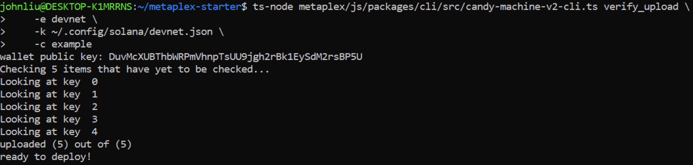
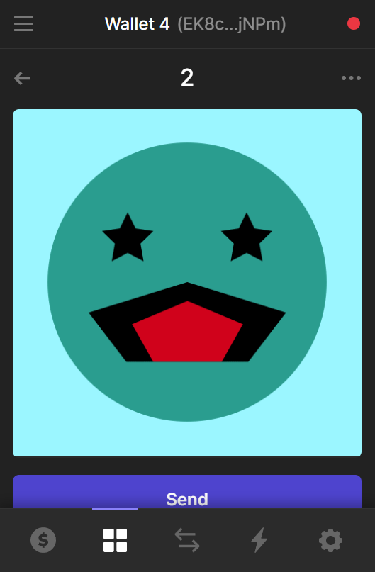
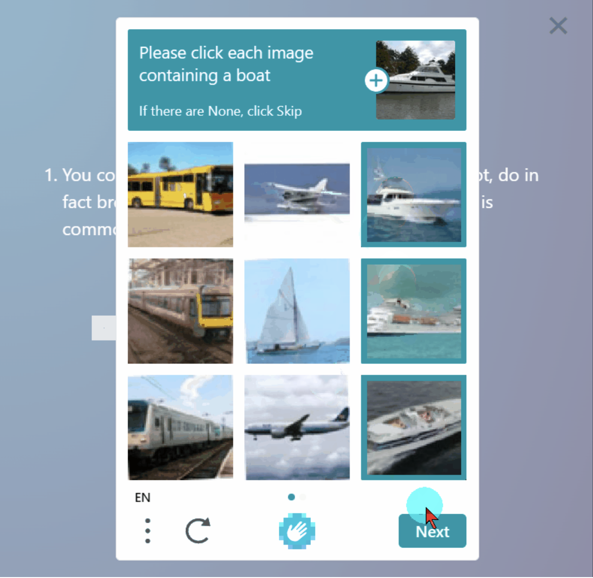
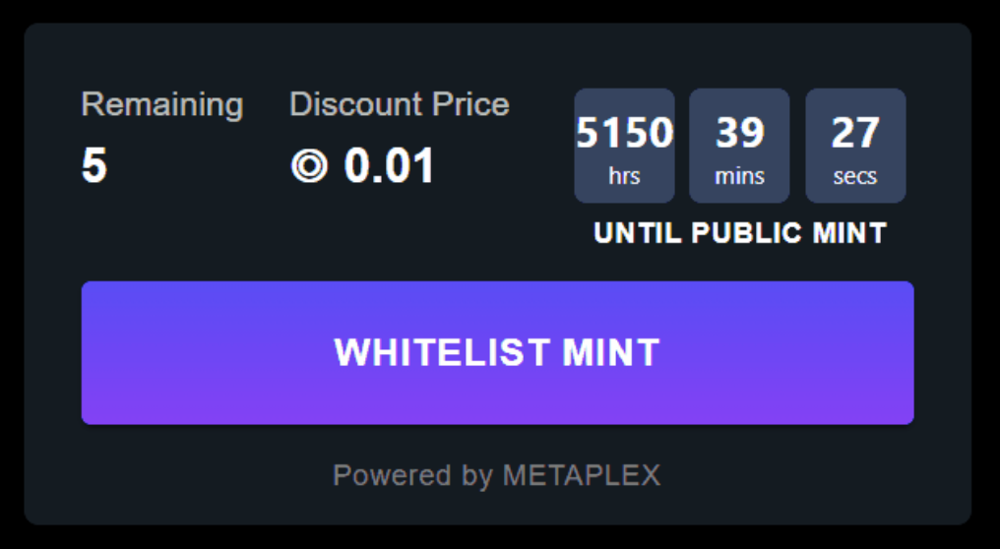

# Create Solana NFTs With Metaplex

# Lesson Objectives

*By the end of this lesson, you will be able to:*

- Explain NFTs and how they're supported by the Solana network
- Understand the role of Metaplex in the Solana NFT ecosystem
- Use Candy Machine v2 to create and distribute an NFT collection
- Use Candy Machine UI to mint NFTs from a candy machine

# TL;DR

- **Non-Fungible Tokens (NFTs)** are represented on Solana as SPL Tokens with an associated metadata account, 0 decimals, and a maximum supply of 1
- **Metaplex** is a collection of tools that simplify the creation and distribution of NFTs on the Solana blockchain
- **Candy Machine v2** is an NFT distribution program by Metaplex used to mint NFTs from a collection

# Overview

Solana Non-Fungible Tokens (NFTs) are SPL tokens created using the Token Program. These tokens, however, also have an additional metadata account associated with each token mint. This allows for a wide variety of use cases for tokens. You can effectively tokenize anything, from game inventory to art.

While a deep dive on the use cases for NFTs would be fascinating, this lesson will focus on the creation and distribution of NFTs.

In this lesson, we'll cover the basics of how NFTs are represented on Solana, as well as how to create, distribute, and update a new NFT collection.

## NFTs on Solana

A Solana NFT is a non-divisible token with associated metadata that comes from a token mint with a maximum supply of 1. Let's break that down a bit. An NFT is a standard token from the Token Program. What makes it unique is that it:

1. Has 0 decimals so that it cannot be divided into parts
2. Comes from a token mint with supply of 1 so that only 1 of these tokens exists
3. Comes from a token mint whose authority is set to `null` (to ensure that the supply never changes)
4. Has an associated account that stores metadata

While the first three points are standard features that can be achieved with the SPL Token Program, the associated metadata requires some additional functionality.

Typically, an NFT’s metadata has both an on-chain and off-chain component. The on-chain metadata is stored in an account associated with the token mint and contains a URI attribute that points to an off-chain JSON file. The off-chain component stores additional data and a link to the image. Permanent data storage systems such as Arweave are often used to store the off-chain component of NFT metadata.

Below is an example of the relationship between on-chain and off-chain metadata. The on-chain metadata contains a URI field that points to an off-chain `.json` file that stores the link to the image of the NFT and additional metadata.


## Metaplex

The de facto standard tools for NFTs on Solana are provided by an organization called Metaplex. Metaplex is an organization that provides a suite of tools that simplify the creation and distribution of NFTs on the Solana blockchain. These tools are very comprehensive for most use cases and allow you to easily manage the entire NFT process:

1. Creating an NFT collection
2. Minting an NFT collection
3. Signing for minted NFTs

One of the core programs provided by Metaplex is the Token Metadata Program. The Token Metadata Program standardizes the process of associating metadata to an NFT. When you create an NFT with Metaplex, the Token Metadata Program creates a metadata account using a Program Derived Address (PDA) with the token mint as a seed. This allows the metadata account for any NFT to be located deterministically using the address of the token mint.

In addition to the Token Metadata Program, Metaplex provides Candy Machine v2. Candy Machine v2 leverages the Token Metadata Program to create tokens, manage their metadata, and customize their distribution.

You can use Metaplex's tools by cloning the [Metaplex repository](https://github.com/metaplex-foundation/metaplex.git) and executing certain commands. We'll go over the commands here in the Overview and then walk through actually executing them in the Demo.

## Create an NFT with Metaplex

Candy Machine v2 simplifies the process of creating an NFT so you can focus on what's important: the NFT metadata and assets. Creating the NFT involves:

1. Preparing assets and metadata
2. Configuring your candy machine
3. Uploading your candy machine

### Prepare assets and metadata

Before creating a collection you need to prepare the assets and metadata for your collection. The metadata is simply a JSON file that includes the following attributes:

- `name` - the name of the NFT that will display on-chain.
- `symbol` - the optional symbol of the NFT that will display on-chain.
- `description` - the description of the NFT.
- `seller_fee_basis_points` - the fee collected upon sale of the NFT which is split between the creators.
- `image` - the file name of the corresponding image that the NFT will display.
- `attributes` - an array of attributes for the NFT where each item in the array is an object with `trait_type` and `value` properties.
- `properties` - an object with `files` and `creators` properties. `files` is a list of files included with the metadata and `creators` is a list of objects representing the creators of the NFTs and their share of seller fee basis points. Here's an example:
    ```json
    {
        "files": [{ "uri": "some-image.png", "type": "image/png" }],
        "creators": [
            {
                "address": "8T9YDcm5zFMRNiUS4aohgVxkqCNAFbnvvzBbxBzkRFck",
                "share": 100
            }
        ]
    }
    ```
- `collection` - an object with `name` and `family` properties representing the name and family of the NFT collection.

The metadata file will look like this:

```json
{
    "name": "Number #0001",
    "symbol": "NB",
    "description": "Collection of 10 numbers on the blockchain. This is the number 1/10.",
    "seller_fee_basis_points": 500,
    "image": "0.png",
    "attributes": [
        {"trait_type": "Layer-1", "value": "0"},
        {"trait_type": "Layer-2", "value": "0"},
        {"trait_type": "Layer-3", "value": "0"},
        {"trait_type": "Layer-4", "value": "1"}
    ],
    "properties": {
        "creators": [{"address": "N4f6zftYsuu4yT7icsjLwh4i6pB1zvvKbseHj2NmSQw", "share": 100}],
        "files": [{"uri": "0.png", "type": "image/png"}]
    },
    "collection": {"name": "numbers", "family": "numbers"}
}
```

### Configure a candy machine

With the NFT metadata prepared, you can use Candy Machine v2 to configure and create your NFT's "candy machine."

Configuration happens through a simple JSON file. When you use Candy Machine v2 to create your candy machine, the JSON in this configuration file is stored in an account on-chain where the configuration fields can then be updated using the Candy Machine CLI. The properties in this configuration file are:

- `price` - the amount to charge for each NFT minted from the candy machine.
- `number` - the number of NFTs in the candy machine. This number must match the number of asset pairings you’ve created for your collection.
- `gatekeeper` - enables CAPTCHA verification before minting from the candy machine. The address of the currently supported provider network can be found on the Metaplex documentation [here](https://docs.metaplex.com/candy-machine-v2/configuration).  Note that a gatekeeper won't work with a whitelist presale enabled.
    ```json
    "gatekeeper": {
        "gatekeeperNetwork": "<PROVIDER_NETWORK_ADDRESS>",
        "expireOnUse": true
    }
    ```
- `solTreasuryAccount` - the address that SOL payments from the mint will be sent to.
- `splTokenAccount` - the token account which you want the payments to be sent to if an SPL token is used as payment instead of SOL.
- `splToken` - the token mint address of the SPL token that is accepted as payment. Note that the address in the `splTokenAccount` field must be a token account for the token mint specified in the `splToken` field.
- `goLiveDate` - the date the mint goes live for public minting.
- `endSettings` - indicates when the minting should end. This can either be set to a specified date, or after a certain amount of NFTs are minted.
    ```json
    "endSettings": {
        "endSettingType": { "date":true },
        "value": "25 Dec 2021 23:59:00 GMT"
    }
    ```
    ```json
    "endSettings": {
        "endSettingType": { "amount":true },
        "value": 10
    }
    ```
- `whitelistMintSettings` - allows you to configure whitelist settings. Specify the following properties to enable whitelist settings:
    - `mode` - where you specify whether the whitelist token is burned upon minting.
        - The `burnEveryTime: true` setting will burn the whitelist token upon mint. Note that the whitelist token must have 0 decimals, otherwise only a partial token will be burned upon minting.
        - The `neverBurn: true` setting allows whitelist token holders to mint as many times as they wish.
    - `mint` - the whitelist token mint address
    - `presale` - determines if whitelist token holders can mint before the `goLiveDate`
    - `discountPrice` - an optional discounted price offered to whitelist token holders
    ```json
    "whitelistMintSettings": {
        "mode": { "burnEveryTime": true },
        "mint": "7nE1GmnMmDKiycFkpHF7mKtxt356FQzVonZqBWsTWZNf",
        "presale": true,
        "discountPrice": 0.5
    }
    ```
- `hiddenSettings` - can be used for hide-and-reveal drops (where the image of an NFT is revealed after the mint is complete). Using the `hiddenSettings` is outside the scope of this lesson, but you can read more about it [here](https://docs.metaplex.com/candy-machine-v2/configuration).
    ```json
    "hiddenSettings": {
        "name": "My Hidden Collection ",
        "uri": "uri",
        "hash": "44kiGWWsSgdqPMvmqYgTS78Mx2BKCWzd"
    }
    ```
- `storage` - specifies the service provider for storing the off-chain component of our NFT's data. For this lesson we'll set the value to `arweave`. Arweave is a decentralized storage network that stores data permanently. Note that Arweave files are only stored for seven days on Devnet. If you would like to use Arweave to store your NFT data on Mainnet, set the `storage` field to `arweave-sol` instead of `arweave`. You can the review list of supported storage types [here](https://docs.metaplex.com/candy-machine-v2/configuration).
- `noRetainAuthority` - indicates whether the candy machine authority has the update authority for each mint or if it is transferred to the minter. This should be kept as `false` for the vast majority of cases. Setting `noRetainAuthority` to `true` would allow the minter of the NFT to change the metadata.
- `noMutable` - indicates whether or not the NFT's metadata is mutable after minting. If set to `false`, the metadata can later be updated. If set to `true`, the metadata cannot be updated later and the setting cannot be reset to `false`.

All put together, this is what a configuration file looks like:

```json
{
    "price": 1,
    "number": 5,
    "gatekeeper": null,
    "solTreasuryAccount": "8T9YDcm5zFMRNiUS4aohgVxkqCNAFbnvvzBbxBzkRFck",
    "splTokenAccount": null,
    "splToken": null,
    "goLiveDate": "25 Dec 2021 00:00:00 GMT",
    "endSettings": null,
    "whitelistMintSettings": {
        "mode": { "burnEveryTime": true },
        "mint": "CNDCM9RsbUcjX4V12wgJ6QjLyjvRyzyWwLu8eLKh6aSu",
        "presale": true,
        "discountPrice": 0.01
    },
    "hiddenSettings": null,
    "storage": "arweave",
    "ipfsInfuraProjectId": null,
    "ipfsInfuraSecret": null,
    "awsS3Bucket": null,
    "nftStorageKey": null,
    "noRetainAuthority": false,
    "noMutable": false
}
```

You can read more about Candy Machine configurations [here](https://docs.metaplex.com/candy-machine-v2/configuration).

### Upload a candy machine

Once the assets for a collection and the candy machine configuration file are prepared, the next step is to create the candy machine. This is done using the `upload` command from the Candy Machine CLI. The `upload` command does two things:

1. Uploads the asset files to the specified storage type and creates a `.cache` file
2. Creates an on-chain account referred to as a candy machine that temporarily stores the links to the uploaded collection and correspond to the `.cache` file. The on-chain candy machine account is then used to distribute the collection once minting goes live.

After running the `upload` command, it is best practice to also run the `verify_upload` command. This command will check that each entry in the `.cache` file matches the on-chain candy machine account. If any of the URI entries do not match the information stored on on-chain, you will need to re-run the upload command.

## Mint Process

Once the upload has been successfully verified, the candy machine is ready to mint tokens. The candy machine configuration settings will determine how tokens are minted. Minting is often done through a frontend UI and split between whitelist and public minting.

For testing, you can mint a token directly from the Candy Machine v2 CLI using the `mint_one_token` command.

### Mint using the Candy Machine UI

In addition to Candy Machine v2's command line tools, Metaplex also makes it easy to create a frontend for minting using Candy Machine UI. 

The directory in the Metaplex repository with the Candy Machine UI has a `.env.example` file with an example of the environment variables you need to run the frontend project. 

While creating a candy machine, you'll receive an address of the candy machine account. You simply need to change the name of `.env.example` to `.env` and update the `REACT_APP_CANDY_MACHINE_ID` environment variable to be the address of the candy machine account.

At that point, you can simply use `yarn start` or `npm start` to run the frontend project and start minting on localhost. For production use cases, you can adapt this code or deploy it as is.

### Mint using CAPTCHA

There are a few things you can do to customize the minting process. One of them is adding CAPTCHA verification. For this, simply open the the candy machine's configuration file and update the `gatekeeper` field to the following:

```json
    "gatekeeper": {
        "gatekeeperNetwork": "ignREusXmGrscGNUesoU9mxfds9AiYTezUKex2PsZV6",
        "expireOnUse": true
    }
```

You can then update the candy machine by running the `update_candy_machine` command. At that point, minting with the candy machine's UI will require CAPTCHA verification.

### Allow whitelisted mints

You can also allow whitelisted mints by issuing a token that can be exchanged for early access to a mint. To do this, you simply create a standard SPL token, then adjust the `whitelistMintSettings` in the candy machine configuration file:

```json
    "whitelistMintSettings": {
        "mode": { "burnEveryTime": true },
        "mint": "<WHITELIST_TOKEN_ADDRESS>",
        "presale": true,
        "discountPrice": 0.01
    }
```

The example above will burn an SPL token from the address specified in the `mint` field in exchange for access to an otherwise restricted mint.

It's important to note that if both whitelisting and gatekeeping are enabled then minting will not work. So if you enable whitelisted mints, be sure to set `gatekeeper` to `null`.

After updating the configuration, simply update the candy machine again by running the `update_candy_machine` command.

## Withdraw candy machine rent

Once a candy machine is fully minted, the data stored in the candy machine account is no longer relevant. At that point, the account can be closed and the rent for the account recovered using the `withdraw` command. The `withdraw` command must be executed with the keypair that created the Candy Machine.

## Sign the NFT Collection

The final step in creating an NFT collection is for the creator to sign the NFTs. This verifies them as the creator, thereby preventing fraudulent collections. Since the `creator` field of a collection can specify any address, signing an NFT proves that the creator specified in the creator field also verified that the NFT was actually created by them. This step is usually performed after all NFTs have been minted from the candy machine since it will only sign the NFTs that have already been minted.

You can sign a collection using the Candy Machine v2 CLI `sign_all` command.

# Demo

Let’s put all of this into practice by creating a candy machine and minting our collection using the Candy Machine UI.

### 1. Download the starter code

Let's begin by downloading the [starter code](https://github.com/Unboxed-Software/solana-metaplex-intro). The starter code includes an `assets` folder and the configuration file for our candy machine, `config.json`. Additionally, it includes two helper scripts. One creates a new keypair we will use for this lesson. The other creates the whitelist token we will later use to enable whitelist settings.

### 2. Setup

While in the project's root directory, let's first install the dependencies for our starter code:

```sh
npm install
```

Next, let's set up a new keypair to use for this lesson and airdrop some SOL using our helper script. Run the following command:

```sh
npm start
```

You should now see a new `private-key.json` file. Copy the keypair from the new file and import it into Phantom.


### 3. Download Metaplex

Now that our project has a new keypair, we're ready to set up the Metaplex helpers. While in the project's root directory, clone the Metaplex repository:

```sh
git clone https://github.com/metaplex-foundation/metaplex.git
```

This repository contains the Candy Machine v2 CLI tools. If you want to have a look at them more closely, you can find them in `metaplex/js/packages/cli/src/candy-machine-cli-v2.ts`.

We'll be using `ts-node` to run commands. If you don't have `typescript` and `ts-node` installed globally, install it now:

```sh
npm install -g typescript
npm install -g ts-node
```

Next, install the Metaplex package dependencies:

```sh
yarn install --cwd metaplex/js/
```

Finally, let's confirm that everything is working by checking the Candy Machine v2 version:

```sh
ts-node metaplex/js/packages/cli/src/candy-machine-v2-cli.ts --version
```

If this command logs a version number to the console, you should be good to go. If not, you'll have to debug the problem(s) before moving on. Check the logs if you're having issues.

Note that this and all subsequent commands include paths to their source files starting from our project's root directory. If at any point you change your command line's working directory, you'll need to adjust the path on the command.

### 4. Candy Machine Configuration

Now that we have installed Metaplex, it's time to configure our candy machine.

Open the `config.json` located in our project's root directory. Copy and paste the configurations below into `config.json`:

```json
{
    "price": 1,
    "number": 5,
    "gatekeeper": null,
    "solTreasuryAccount": "<YOUR_WALLET_ADDRESS>",
    "splTokenAccount": null,
    "splToken": null,
    "goLiveDate": "25 Dec 2020 00:00:00 GMT",
    "endSettings": null,
    "whitelistMintSettings": null,
    "hiddenSettings": null,
    "storage": "arweave",
    "ipfsInfuraProjectId": null,
    "ipfsInfuraSecret": null,
    "awsS3Bucket": null,
    "nftStorageKey": null,
    "noRetainAuthority": false,
    "noMutable": false
}
```

Update the `solTreasuryAccount` field with the wallet address we imported to Phantom. This will be the only setting we change for now.

Let's walk through the values we have real quick:

- `price` is set to `1`, meaning each NFT will cost 1 SOL
- `number` is set to `5`, meaning the collection has 5 NFTs total
- `goLiveDate` is set to a date in the past so that the collection will be live as soon as we upload it
- `storage` is set to `arweave` which means the metadata will be stored for 7 days on arweave. Remember, if we were doing this for Mainnet we would use `arweave-sol` to make the storage permanent.
- `noRetainAuthority` is set to `false` so that the minter of the NFT cannot change the metadata
- `noMutable` is set to `false` so that we can update the metadata after the fact if we need to

### 5. Prepare Assets

Now let's prepare the assets for our candy machine. The starter code includes an `assets` folder that holds the images and the metadata files we'll use for our collection.

Open the `0.json` file. Notice that all of the fields are already filled out except for the `address` field under `creators`. You'll need to set this to the address we imported to Phantom. Do this for the remaining `.json` files in the `assets` folder.

```json
{
    "name": "1",
    "symbol": "TEST",
    "image": "0.png",
    "properties": {
        "files": [{ "uri": "0.png", "type": "image/png" }],
        "category": "image",
        "creators": [
            {
                "address": "<YOUR_WALLET_ADDRESS>",
                "share": 100
            }
        ]
    },
    "description": "",
    "seller_fee_basis_points": 500,
    "attributes": [
        { "trait_type": "background", "value": "blue" },
        { "trait_type": "eyes", "value": "star-eyes" },
        { "trait_type": "mouth", "value": "triangle-mouth" },
        { "trait_type": "face", "value": "teal-face" }
    ],
    "collection": { "name": "NAME", "family": "FAMILY" }
}
```

Once you’ve updated the `address` field for each `.json` file, we can verify that the assets are ready for upload by running Candy Machine's `verify_assets` command.

The `verify_assets` command will check that:

1. Files types are supported
2. Each image has a corresponding `.json` metadata file with the correct index naming
3. The `creators` field is consistent across all `.json` files

```sh
ts-node metaplex/js/packages/cli/src/candy-machine-v2-cli.ts verify_assets ./assets
```

The output should look something like this:


### 6. Create Candy Machine

Now that we’ve configured our candy machine and verified that our assets are ready for upload, let's upload our assets and create our candy machine by running the `upload` command.

```sh
ts-node metaplex/js/packages/cli/src/candy-machine-v2-cli.ts upload \
    -r, --rpc-url https://metaplex.devnet.rpcpool.com\
    -k ./private-key.json \
    -cp config.json \
    -c example \
    ./assets
```

The output should look something like this:


There will now be a `.cache` folder with a `devnet-example.json` file that includes the address of our candy machine and Arweave links corresponding to the metadata of each NFT in our candy machine. When we run the upload command, the images and metadata files in our `assets` folder are uploaded to Arweave in preparation for minting. These Arweave links represent the off-chain component of each NFT's metadata.

The `devnet-example.json` file will look something like this, but with different links and addresses:

```json
{
    "program": {
        "uuid": "GSSEGg",
        "candyMachine": "GSSEGgeCvndhjd3GGNs8VM65qHPAiBF8cF2EWTZ3bm8k",
        "collection": "4cXtoUxF9C3nYxo31Hku6gFYDEcnidqSScbctfY17HZr"
    },
    "items": {
        "0": {
            "link": "https://arweave.net/nk7VSghTt9iP6cVYnVxo4SAN_t6RPxE6iESP-Z49s4s",
            "imageLink": "https://arweave.net/8Y9i5mvF3u_3XHzSAfiDxt8pUubGB8HwXTTEnD4Kp7c?ext=png",
            "name": "1",
            "onChain": true,
            "verifyRun": false
        },
        "1": {
            "link": "https://arweave.net/LEbsEUVr-oMCgVkZlvSEmOoBRR7QcoFG-won6tZD16g",
            "imageLink": "https://arweave.net/T78LQZsteVWK83g49wy-Lt3cig3w8N1kAXyZiU5Pxdg?ext=png",
            "name": "2",
            "onChain": true,
            "verifyRun": false
        },
        "2": {
            "link": "https://arweave.net/0D-klGK9bceLNm0Bxo4ua59RlLq1i0cM1A31Smsgvwo",
            "imageLink": "https://arweave.net/GbPL0RTX_IEJvbcAEwqGI2nyzsT6IXRHDgk_o_fdwJQ?ext=png",
            "name": "3",
            "onChain": true,
            "verifyRun": false
        },
        "3": {
            "link": "https://arweave.net/hz0lrDqCvtVnvToHjmSCDlSF7feCcu8KX_zJDq_BBRc",
            "imageLink": "https://arweave.net/mhxIIf-U4xwA1yFouxZx1eUmpMOr-7gz9a377fwbO8w?ext=png",
            "name": "4",
            "onChain": true,
            "verifyRun": false
        },
        "4": {
            "link": "https://arweave.net/MQsmrTW6BIufImiDjHY3py3dM1w8DdowKGtJ307MQW4",
            "imageLink": "https://arweave.net/otRFxnPyLW_fmbUvskf4DE63n8dUurHt5Qm--gWWOdA?ext=png",
            "name": "5",
            "onChain": true,
            "verifyRun": false
        }
    },
    "env": "devnet",
    "cacheName": "example"
}
```

Next, let's verify our upload by running the `verify_upload` command.

This verifies that each entry in the `devnet-example.json` file has been successfully uploaded and matches the URI stored on-chain.

```sh
ts-node metaplex/js/packages/cli/src/candy-machine-v2-cli.ts verify_upload \
    -r, --rpc-url https://metaplex.devnet.rpcpool.com\
    -k ./private-key.json \
    -c example
```

The output should look something like this:



Now let's mint an NFT from our candy machine by running the `mint_one_token` command:

```sh
ts-node metaplex/js/packages/cli/src/candy-machine-v2-cli.ts mint_one_token \
    -r, --rpc-url https://metaplex.devnet.rpcpool.com\
    -k ./private-key.json \
    -c example
```

You should now be able to see the newly minted NFT in the Phantom wallet.



### 7. Candy Machine UI

Now that we know our candy machine works, let's set up a frontend to mint our NFTs using the Candy Machine UI.

Navigate to the `candy-machine-ui` folder using the following path: `/metaplex/js/packages/candy-machine-ui`.

1. Locate the `.env.example` file
2. Rename this file to `.env`
3. Open the `.env` file and update `REACT_APP_CANDY_MACHINE_ID` with the address of the `candyMachine` from the `devnet-example.json` file.

```
REACT_APP_CANDY_MACHINE_ID=<YOUR CANDY MACHINE PROGRAM ID>

REACT_APP_SOLANA_NETWORK=devnet
REACT_APP_SOLANA_RPC_HOST=https://metaplex.devnet.rpcpool.com/
```

From within the `candy-machine-ui` folder, run the following command:

```sh
yarn install && yarn start
```

Navigate to [localhost:3000](http://localhost:3000) in the browser and click "MINT" to mint an NFT from your candy machine!

### 8. Enable Gatekeeper

Now that we have our candy machine's UI working, let's update our candy machine to enable the gatekeeper setting.

Open the `config.json` file and update the `gatekeeper` field to enable CAPTCHA:

```json
    "gatekeeper": {
        "gatekeeperNetwork": "ignREusXmGrscGNUesoU9mxfds9AiYTezUKex2PsZV6",
        "expireOnUse": true
    }
```

Update the candy machine by running the `update_candy_machine` command:

```sh
ts-node metaplex/js/packages/cli/src/candy-machine-v2-cli.ts update_candy_machine \
    -r, --rpc-url https://metaplex.devnet.rpcpool.com\
    -k ./private-key.json \
    -cp config.json \
    -c example
```

Note that the path in the command above starts from the root directory of your project. If your command line's working directory is different, you'll need to adjust the path accordingly.

Refresh [localhost:3000](http://localhost:3000) in the browser and click the mint button. It should now require a CAPTCHA verification before minting.



### 9. Enable Whitelist

Next, let's update our candy machine to enable whitelist settings.

We'll start by creating our whitelist token using a helper script included in the starter code.

The script will:

1. Create a new token mint
2. Create a new token account
3. Mint tokens to the token account
4. Print the whitelist token address to the console

The whitelist tokens will be minted to the wallet address we've imported into Phantom. Go ahead and run the following command and copy the whitelist token address:

```sh
npm run whiteListToken
```

Next, open the `config.json` file and reset the `gatekeeper` field to `null`:

```json
    "gatekeeper": null
```

Update the `goLiveDate` to sometime in the future:

```json
    "goLiveDate": "25 Dec 2050 00:00:00 GMT"
```

Update `whitelistMintSettings` and set the `mint` field to the address of the token we just created:

```json
    "whitelistMintSettings": {
        "mode": { "burnEveryTime": true },
        "mint": "<WHITELIST_TOKEN_ADDRESS>",
        "presale": true,
        "discountPrice": 0.01
    }
```

Update the candy machine again by running the `update_candy_machine` command:

```sh
ts-node metaplex/js/packages/cli/src/candy-machine-v2-cli.ts update_candy_machine \
    -r, --rpc-url https://metaplex.devnet.rpcpool.com\
    -k ./private-key.json \
    -cp config.json \
    -c example
```

Refresh [localhost:3000](http://localhost:3000) in the browser and mint from a wallet that holds the whitelist token:



Go ahead and mint out the candy machine from a wallet with the whitelist token until the button says it's sold out.

### 10. Withdraw Rent

Now that our candy machine is fully minted, the rent used for the candy machine can be retrieved by running the `withdraw` command. You'll need to replace `<candy_machine_id>` with the address of the candy machine from `devnet-example.json` before running the command below.

```sh
ts-node metaplex/js/packages/cli/src/candy-machine-v2-cli.ts withdraw <candy_machine_id> \
    -r, --rpc-url https://metaplex.devnet.rpcpool.com\
    -k ./private-key.json
```

### 11. Signing NFTs

Finally, sign the NFTs to verify yourself as the creator of the collection by running the `sign_all` command:

```sh
ts-node metaplex/js/packages/cli/src/candy-machine-v2-cli.ts sign_all \
    -r, --rpc-url https://metaplex.devnet.rpcpool.com\
    -k ./private-key.json \
    -c example
```

Awesome work! While Metaplex makes it straightforward to create an NFT collection, it's still difficult to get some of these command line tools working. If you run into any snags, be patient with yourself while you debug the problem.

# Challenge

Now it’s your turn to build something independently. Create a new candy machine using your own images, metadata, and configuration.

Recall that the sequence of steps are as follows:

1. Configure the collection's candy machine
2. Prepare collection assets and metadata
3. Verify assets
4. Upload newly configured candy machine
5. Verify the upload
6. Mint some NFTs
7. Close the candy machine account and withdraw the rent
8. Sign collection

Have some fun with this! This will be your first independently created NFT collection!