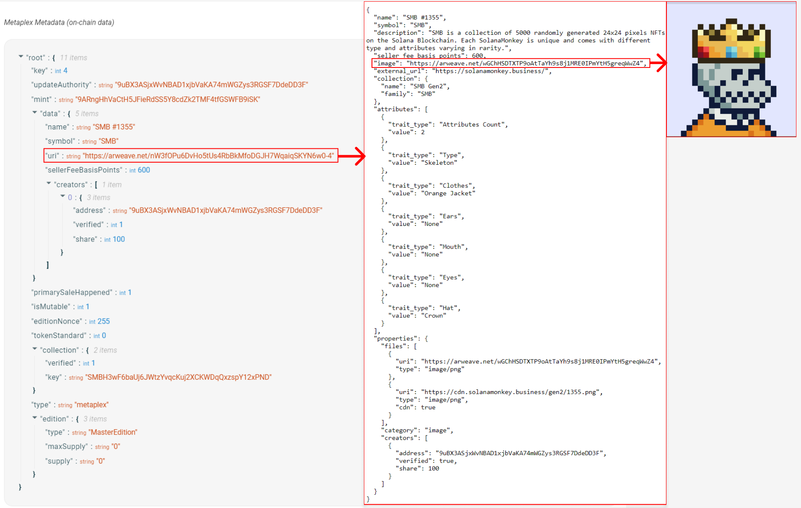

# Create Solana NFTs With Metaplex

# Lesson Objectives

_By the end of this lesson, you will be able to:_

-   Explain NFTs and how they're represented on the Solana network
-   Understand the role of Metaplex in the Solana NFT ecosystem
-   Understand the basic functionality of Token Metadata program, Candy Machine program, and Sugar CLI as tools that assist in creating and distributing NFTs on Solana.
-   Create and update NFTs using the Metaplex SDK

# TL;DR

-   **Non-Fungible Tokens (NFTs)** are represented on Solana as SPL Tokens with an associated metadata account, 0 decimals, and a maximum supply of 1
-   **Metaplex** offers a collection of tools that simplify the creation and distribution of NFTs on the Solana blockchain
-   The **Token Metadata** program standardizes the process of attaching metadata to SPL Tokens
-   The **Candy Machine** program is an NFT distribution tool used to create and mint NFTs from a collection
-   **Sugar CLI** is a tool that simplifies the process of uploading media/metadata files and creating a Candy Machine for a collection
-   The **Metaplex SDK** is a tool that offers user-friendly APIs to assist developers in utilizing the on-chain tools provided by Metaplex.

# Overview

Solana Non-Fungible Tokens (NFTs) are SPL tokens created using the Token program. These tokens, however, also have an additional metadata account associated with each token mint. This allows for a wide variety of use cases for tokens. You can effectively tokenize anything, from game inventory to art.

In this lesson, we will focus on the basics of creating NFTs on the Solana blockchain. We will cover the basics of how NFTs are represented on Solana and how to create and update them using the Metaplex SDK. Additionally, we will briefly introduce tools such as Token Metadata program, Candy Machine program, and Sugar CLI that assist in creating and distributing NFTs on Solana. Note that this lesson will not extensively cover or demonstrate their use in the demo.

## NFTs on Solana

A Solana NFT is a non-divisible token with associated metadata that comes from a token mint with a maximum supply of 1. Let's break that down a bit. An NFT is a standard token from the Token Program. What makes it unique is that it:

1. Has 0 decimals so that it cannot be divided into parts
2. Comes from a token mint with supply of 1 so that only 1 of these tokens exists
3. Comes from a token mint whose authority is set to `null` (to ensure that the supply never changes)
4. Has an associated account that stores metadata

While the first three points are standard features that can be achieved with the SPL Token Program, the associated metadata requires some additional functionality.

Typically, an NFT’s metadata has both an on-chain and off-chain component. The on-chain metadata is stored in an account associated with the token mint and contains a URI attribute that points to an off-chain JSON file. The off-chain component stores additional data and a link to the image. Permanent data storage systems such as Arweave are often used to store the off-chain component of NFT metadata.

Below is an example of the relationship between on-chain and off-chain metadata. The on-chain metadata contains a URI field that points to an off-chain `.json` file that stores the link to the image of the NFT and additional metadata.



## **Metaplex**

Metaplex is an organization that provides a suite of tools that simplify the creation and distribution of NFTs on the Solana blockchain. These tools cater to a wide range of use cases and allow you to easily manage the entire NFT process of creating and minting an NFT collection.

One of the essential programs offered by Metaplex is the Token Metadata program, which standardizes the process of attaching metadata to SPL Tokens. When creating an NFT with Metaplex, the Token Metadata program creates a metadata account using a Program Derived Address (PDA) with the token mint as a seed. This allows the metadata account for any NFT to be located deterministically using the address of the token mint. To learn more about the Token Metadata program, you can refer to the Metaplex [documentation](https://docs.metaplex.com/programs/token-metadata/).

Another essential program offered by Metaplex is the Candy Machine program, which is the leading minting and distribution program for NFT collection launches on Solana. You can learn more about the current version of the Candy Machine program by visiting the Metaplex [documentation](https://docs.metaplex.com/programs/candy-machine/overview).

Metaplex also provides a tool called Sugar, a CLI used to simplify the process of uploading media/metadata files and deploying a Candy Machine. You can learn more about how to use Sugar by visiting the Metaplex [documentation](https://docs.metaplex.com/developer-tools/sugar/).

To explore the full range of tools offered by Metaplex, you can view the [Metaplex repository](https://github.com/metaplex-foundation/metaplex) on GitHub. In the following sections, we will cover the basics of creating an NFT using the Metaplex SDK and demonstrate how to execute the process in the demo.

## Metaplex SDK

The Metaplex SDK is designed to assist developers in utilizing the on-chain tools offered by Metaplex. It offers a user-friendly API that focuses on popular use cases and allows for easy integration with third-party plugins. To learn more about the capabilities of the Metaplex SDK, you can refer to the [README](https://github.com/metaplex-foundation/js#readme).

### Metaplex instance

A `Metaplex` instance serves as the entry point for accessing the Metaplex SDK APIs. This instance accepts a connection used to communicate with the cluster. Additionally, developers can customize the SDK's interactions by specifying an "Identity Driver" for the SDK to act on behalf of and a "Storage Driver" for uploading assets. The `bundlrStorage` driver is the default option and it uploads assets to Arweave.

Below is an example of how you can set up the `Metaplex` instance for devnet.

```tsx
import {
    Metaplex,
    keypairIdentity,
    bundlrStorage,
} from "@metaplex-foundation/js";
import { Connection, clusterApiUrl, Keypair } from "@solana/web3.js";

const connection = new Connection(clusterApiUrl("devnet"));
const wallet = Keypair.generate();

const metaplex = Metaplex.make(connection)
    .use(keypairIdentity(wallet))
    .use(
        bundlrStorage({
            address: "https://devnet.bundlr.network",
            providerUrl: "https://api.devnet.solana.com",
            timeout: 60000,
        }),
    );
```

### Upload Image

Before creating an NFT, the initial step is to upload the image for the NFT. This process involves converting the image to a buffer, then converting it to a `Metaplex` file, and finally uploading it to the designated "Storage Driver".

The Metaplex SDK supports the creation of a `MetaplexFile` from either files present on your local computer or those uploaded by a user through a browser. You can do the former by using `fs.readFileSync` to read the image file, convert it into a `MetaplexFile` using `toMetaplexFile`.

```tsx
const buffer = fs.readFileSync("/path/to/image.png");
const file = toMetaplexFile(buffer, "image.png");

const imageUri = await metaplex.storage().upload(file);
```

This will give you the URI of the image uploaded to the storage service.

### Upload Metadata

After uploading an image, the next step is to use the image URI to upload the NFT metadata. This will create a metadata URI which includes the image URI and additional information such as the name and description of the NFT. This URI will represent the off-chain portion of the NFT metadata.

To create the metadata, use the `uploadMetadata` method provided by the SDK. This method accepts a metadata object and returns a URI that points to the uploaded metadata.

```tsx
const { uri } = await metaplex.nfts().uploadMetadata({
    name: "My NFT",
    description: "My description",
    image: imageUri,
});
```

### Create NFT

After uploading the NFT's metadata, the next step is to create a new NFT. The SDK's `create` method allows you to create a new NFT with minimal configuration. This method will handle the creation of the mint account, token account, metadata account, and the master edition account for you. The data provided to this method will represent the on-chain portion of the NFT metadata. You can explore the SDK to see all the other input that can be optionally provided to this method.

```tsx
const { nft } = await metaplex.nfts().create(
    {
        uri: uri,
        name: "My NFT",
        sellerFeeBasisPoints: 0,
    },
    { commitment: "finalized" },
);
```

The method returns an object containing information about the newly created NFT. By default, the SDK sets the `isMutable` property to true, allowing for updates to be made to the NFT's metadata. However, you can choose to set `isMutable` to false, making the NFT's metadata immutable.

### Update NFT

Once you have created an NFT, you may want to update its metadata. The SDK's `update` method allows you to update the metadata of an existing NFT. This method allows you to change both the on-chain and off-chain portions of the NFT's metadata. To update the off-chain metadata, you will need to repeat the steps of uploading a new image and metadata URI as outlined in the previous steps and provide the new metadata URI to this method. This will change the URI that the on-chain metadata points to, effectively updating the off-chain metadata as well.

```tsx
const nft = await metaplex.nfts().findByMint({ mintAddress });

const { response } = await metaplex.nfts().update(
    {
        nftOrSft: nft,
        name: "Updated Name",
        uri: uri,
        sellerFeeBasisPoints: 100,
    },
    { commitment: "finalized" },
);
```

The `update` method returns a response object containing the transaction signature of the update transaction.

# Demo

In this demonstration, we will go through the steps of creating an NFT using the Metaplex SDK, and then how to change the NFT's metadata. By the end, you will have a basic understanding of how to use the Metaplex SDK interact with NFTs on Solana.

### 1. Starter

To begin, download the start code [here](https://github.com/Unboxed-Software/solana-metaplex).

The file contains two images that we will be using for the NFTs. In the `index.ts` file, you will find the following code snippet which includes sample data for the NFT we’ll be creating and updating.

```tsx
interface NftData {
    name: string;
    symbol: string;
    description: string;
    sellerFeeBasisPoints: number;
    imageFile: string;
}

// example data for a new NFT
const nftData = {
    name: "Name",
    symbol: "SYMBOL",
    description: "Description",
    sellerFeeBasisPoints: 0,
    imageFile: "solana.png",
};

// example data for updating an existing NFT
const updateNftData = {
    name: "Update",
    symbol: "UPDATE",
    description: "Update Description",
    sellerFeeBasisPoints: 100,
    imageFile: "success.png",
};

async function main() {
    // create a new connection to the cluster's API
    const connection = new Connection(clusterApiUrl("devnet"));

    // initialize a keypair for the user
    const user = await initializeKeypair(connection);

    console.log("PublicKey:", user.publicKey.toBase58());
}
```

To install the necessary dependencies, run `npm install` in the command line.

Next, execute the code by running `npm start`. This will create a new keypair, write it to the `.env` file, and airdrop devnet SOL to the keypair.

```tsx
Current balance is 0
Airdropping 1 SOL...
New balance is 1
PublicKey: GdLEz23xEonLtbmXdoWGStMst6C9o3kBhb7nf7A1Fp6F
Finished successfully
```

### 2. Set up Metaplex

Before we start creating and updating NFTs, we need to set up the Metaplex instance. Update the `main()` function with the following:

```tsx
async function main() {
    // create a new connection to the cluster's API
    const connection = new Connection(clusterApiUrl("devnet"));

    // initialize a keypair for the user
    const user = await initializeKeypair(connection);

    console.log("PublicKey:", user.publicKey.toBase58());

    // metaplex set up
    const metaplex = Metaplex.make(connection)
        .use(keypairIdentity(user))
        .use(
            bundlrStorage({
                address: "https://devnet.bundlr.network",
                providerUrl: "https://api.devnet.solana.com",
                timeout: 60000,
            }),
        );
}
```

### 3. `uploadMetadata` helper function

Next, we will create a helper function to handle the process of uploading an image and metadata, and returning the metadata URI. This function will take in the Metaplex instance and NFT data as input, and return the metadata URI as output.

```tsx
// helper function to upload image and metadata
async function uploadMetadata(
    metaplex: Metaplex,
    nftData: NftData,
): Promise<string> {
    // file to buffer
    const buffer = fs.readFileSync("src/" + nftData.imageFile);

    // buffer to metaplex file
    const file = toMetaplexFile(buffer, nftData.imageFile);

    // upload image and get image uri
    const imageUri = await metaplex.storage().upload(file);
    console.log("image uri:", imageUri);

    // upload metadata and get metadata uri (off chain metadata)
    const { uri } = await metaplex.nfts().uploadMetadata({
        name: nftData.name,
        symbol: nftData.symbol,
        description: nftData.description,
        image: imageUri,
    });

    console.log("metadata uri:", uri);
    return uri;
}
```

This function will read an image file, convert it to a buffer, then upload it to get an image URI. It will then upload the NFT metadata, which includes the name, symbol, description, and image URI, and get a metadata URI. This URI is the off-chain metadata. This function will also log the image URI and metadata URI for reference.

### 5. `createNft` helper function

Next, let's create a helper function to handle creating the NFT. This function takes in the Metaplex instance, metadata URI and NFT data as inputs. It uses the `create` method of the SDK to create the NFT, passing in the metadata URI, name, seller fee, and symbol as parameters.

```tsx
// helper function create NFT
async function createNft(
    metaplex: Metaplex,
    uri: string,
    nftData: NftData,
): Promise<NftWithToken> {
    const { nft } = await metaplex.nfts().create(
        {
            uri: uri, // metadata URI
            name: nftData.name,
            sellerFeeBasisPoints: nftData.sellerFeeBasisPoints,
            symbol: nftData.symbol,
        },
        { commitment: "finalized" },
    );

    console.log(
        `Token Mint: https://explorer.solana.com/address/${nft.address.toString()}?cluster=devnet`,
    );

    return nft;
}
```

The function `createNft` logs the token mint URL and returns the an `nft` object containing information about the newly created NFT. The NFT will be minted to the user set as the "Identity Driver" in the Metaplex instance.

### 6. Create NFT

Now that we have set up the Metaplex instance and created helper functions for uploading metadata and creating NFTs, we can test these functions by creating an NFT. In the `main()` function, call the `uploadMetadata` function to upload the NFT data and get the URI for the metadata. Then, use the `createNft` function and metadata URI to create an NFT.

```tsx
async function main() {
	...

  // upload the NFT data and get the URI for the metadata
  const uri = await uploadMetadata(metaplex, nftData)

  // create an NFT using the helper function and the URI from the metadata
  const nft = await createNft(metaplex, uri, nftData)
}
```

Run `npm start` in the command line to execute the `main` function. You should see output similar to the following:

```tsx
Current balance is 1.770520342
PublicKey: GdLEz23xEonLtbmXdoWGStMst6C9o3kBhb7nf7A1Fp6F
image uri: https://arweave.net/j5HcSX8qttSgJ_ZDLmbuKA7VGUo7ZLX-xODFU4LFYew
metadata uri: https://arweave.net/ac5fwNfRckuVMXiQW_EAHc-xKFCv_9zXJ-1caY08GFE
Token Mint: https://explorer.solana.com/address/QdK4oCUZ1zMroCd4vqndnTH7aPAsr8ApFkVeGYbvsFj?cluster=devnet
Finished successfully
```

Feel free to inspect the generated URIs for the image and metadata, as well as view the NFT on the Solana explorer by visiting the URL provided in the output.

### 7. `updateNft` helper function

Next, let's create a helper function to handle updating an existing NFT. This function will take in the Metaplex instance, metadata URI, mint address of the NFT, and updated NFT data as inputs. It uses the `findByMint` method of the SDK to fetch the existing NFT data using the mint address, and then uses the `update` method to update the metadata with the provided URI and NFT data. Finally, it will log the token mint URL and transaction signature for reference.

```tsx
// helper function update NFT
async function updateNft(
    metaplex: Metaplex,
    uri: string,
    mintAddress: PublicKey,
    nftData: NftData,
) {
    // fetch NFT data using mint address
    const nft = await metaplex.nfts().findByMint({ mintAddress });

    // update the NFT metadata
    const { response } = await metaplex.nfts().update(
        {
            nftOrSft: nft,
            symbol: nftData.symbol,
            name: nftData.name,
            uri: uri,
            sellerFeeBasisPoints: nftData.sellerFeeBasisPoints,
        },
        { commitment: "finalized" },
    );

    console.log(
        `Token Mint: https://explorer.solana.com/address/${nft.address.toString()}?cluster=devnet`,
    );

    console.log(
        `Transaction: https://explorer.solana.com/tx/${response.signature}?cluster=devnet`,
    );
}
```

### 8. Update NFT

To update an existing NFT, we will first need to upload new metadata for the NFT and get the new URI. In the `main()` function, call the `uploadMetadata` function again to upload the updated NFT data and get the new URI for the metadata. Then, we can use the `updateNft` helper function, passing in the Metaplex instance, the new URI from the metadata, the mint address of the NFT, and the updated NFT data to update the NFT. The `nft.address` is from the output of the `createNft` function.

```tsx
async function main() {
	...

  // upload updated NFT data and get the new URI for the metadata
  const updatedUri = await uploadMetadata(metaplex, updateNftData)

  // update the NFT using the helper function and the new URI from the metadata
  await updateNft(metaplex, updatedUri, nft.address, updateNftData)
}
```

Run `npm start` in the command line to execute the `main` function. You should see additional output similar to the following:

```tsx
...
Token Mint: https://explorer.solana.com/address/6R9egtNxbzHr5ksnGqGNHXzKuKSgeXAbcrdRUsR1fkRM?cluster=devnet
Transaction: https://explorer.solana.com/tx/5VkG47iGmECrqD11zbF7psaVqFkA4tz3iZar21cWWbeySd66fTkKg7ni7jiFkLqmeiBM6GzhL1LvNbLh4Jh6ozpU?cluster=devnet
Finished successfully
```

You can also view the NFTs in Phantom wallet by importing the `PRIVATE_KEY` from the .env file.

Congratulations! You have successfully learned how to use the Metaplex SDK to create and update NFTs. Now you can use this knowledge to create and update your own NFTs.

If you want to take a look at the final solution code you can find it on the solution branch of the same [repository](https://github.com/Unboxed-Software/solana-metaplex/tree/solution).

# Challenge

To deepen your understanding of the Metaplex tools, dive into the Metaplex documentation and familiarize yourself with the various programs and tools offered by Metaplex. For instance, you can delve into learning about the Candy Machine program to understand its functionality. Once you have an understanding how the the Candy Machine program works, put your knowledge to the test by using the Sugar CLI to create a Candy Machine for your own collection. This hands-on experience will not only reinforce your understanding of the tools, but also boost your confidence in your ability to use them effectively in the future.

Have some fun with this! This will be your first independently created NFT collection! With this you'll complete Module 2; hope you're feeling the process! Feel free to share some quick feedback [here](https://airtable.com/shrOsyopqYlzvmXSC?prefill_Module=Module%202), so that we can continue to improve the course!
