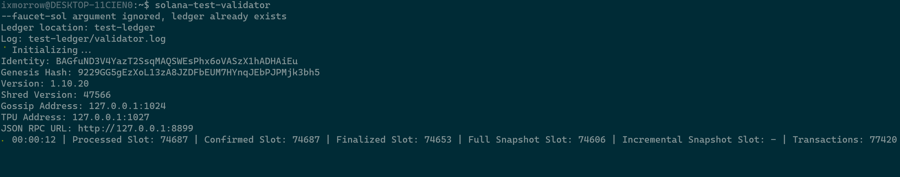

# Program Testing

# Lesson Objectives

*By the end of this lesson, you will be able to:*

- Describe various ways to test Solana programs
- Explain the difference between unit tests, integration tests, and RPC tests
- Debug Solana programs

# TL;DR

- Testing is a **key component** of smart contract development, it ensures the code works as intended before releasing it to the public.
- Solana programs support three different types of tests (unit, integration, and client-side) all of which have a specific purpose.

# Overview

Testing in software is very common and there are actually entire careers fields dedicated to just creating and running tests. A robust testing process can minimize the amount of bugs developers introduce into production code by catching them before they pose a real issue. You obviously cannot test *everything*, but it’s important to try to think of all the ways you can try to break your program or cause some unintended actions with your tests. This is especially imperative when developing smart contracts because a single bug can lead to millions of dollars lost or stolen.

Think back to what was discussed in the [Basic Security](./program-security.md) lesson, how can we write tests that determine if the security checks we've implemented actually work as intended and are sufficient? Program security and testing go hand in hand. To write good tests, it's helpful to think like an attacker. To reiterate some of what was discussed in that lesson, the goal is to not just "get the code working", but to ensure it works properly and is robust enough to properly handle malicious input.

The rust package manager, Cargo, natively has some tools built into it to help developers write their own automated tests. Whenever we make a new library project with `cargo new --lib`, a test module with a test function in it is automatically generated for us. You can run tests with Cargo with either `cargo test` or `cargo test-bpf`.

The Rust community thinks about tests in terms of two main categories: unit tests and integration tests. *Unit tests* are small and more focused, testing one module in isolation at a time, and can test private interfaces. *Integration tests* are entirely external to your library and use your code in the same way any other external code would, using only the public interface and potentially exercising multiple modules per test.

## Unit tests

### What are unit tests?

The purpose of unit tests is to test each unit of code in isolation from the rest of the code to quickly pinpoint where code is and isn’t working as expected. Unit tests reside in the `src` directory in the file with the code they are testing. Unit tests are declared inside a module named `tests` annotated with `cfg(test)`. At its simplest, a test in Rust is a function that’s annotated with the `#[test]` attribute.

```rust
// Example testing module with a single test
#[cfg(test)]
mod tests {
    #[test]
    fn it_works() {
        let result = 2 + 2;
        assert_eq!(result, 4);
    }
}
```

The `cfg` attribute stands for *configuration* and tells Rust that the following item should only be included given a certain configuration option. In this case, the `#[cfg(test)]` annotation tells Cargo to compile our test code only if we actively run the tests with `cargo test`, this way the testing code is not run when you call `cargo build` which saves on compile time.

Tests are defined in the `tests` module with the `#[test]` attribute. When running `cargo test`, every function inside this module marked as a test will be run. You can also create helper functions that are not tests in the module, just don’t annotate them with the `#[test]` attribute.

### How to build unit tests

To build integration and unit tests in Rust, you will have to use the [`solana_sdk`](https://docs.rs/solana-sdk/latest/solana_sdk/) crate. This crate is essentially the same thing as the `@solana/web3.js` package that we’ve been using in Typescript and gives us a way to interact with Solana programs in Rust. There is another crate that will be useful and was made specifically for testing Solana programs, [`solana_program_test`](https://docs.rs/solana-program-test/latest/solana_program_test/#) contains a BanksClient-based testing framework.

A simple example of a unit test residing inside a `processor.rs` file may look like

```rust
// Inside processor.rs
#[cfg(test)]
mod tests {
    use {
        super::*,
        assert_matches::*,
        solana_program::instruction::{AccountMeta, Instruction},
        solana_program_test::*,
        solana_sdk::{signature::Signer, transaction::Transaction, signer::keypair::Keypair},
    };

    #[tokio::test]
    async fn it_works() {
        let program_id = Pubkey::new_unique();

        let (mut banks_client, payer, recent_blockhash) = ProgramTest::new(
            "bpf_program_template",
            program_id,
            processor!(process_instruction),
        )
        .start()
        .await;

        let test_acct = Keypair::new();

        let mut transaction = Transaction::new_with_payer(
            &[Instruction {
                program_id,
                accounts: vec![
                    AccountMeta::new(payer.pubkey(), true),
                    AccountMeta::new(test_acct.pubkey(), true)
                ],
                data: vec![1, 2, 3],
            }],
            Some(&payer.pubkey()),
        );
        transaction.sign(&[&payer, &test_acct], recent_blockhash);

        assert_matches!(banks_client.process_transaction(transaction).await, Ok(_);
    }
}
```

In the code snippet, we created a public key to use as our `program_id` and then initialized a `ProgramTest`. Then, we create a second `Keypair` and built our `Transaction` with the appropriate parameters. Finally, we used the `banks_client` that was returned when calling `ProgramTest::new` to process this transaction and check that the return value is equal to `Ok(_)`. This is a very simple test, but from the code snippet you can see how you would go about creating more complex tests that involve more accounts and data similar to how you would client side.

## Integration tests

### What are integration tests?

Integration tests on the other hand, are meant to be entirely external to the code they are testing. These tests are meant to interact with your code via its public interface in the manner that it’s intended to be accessed by others. Their purpose is to test whether many parts of your library work together correctly. Units of code that work correctly on their own could have problems when integrated, so test coverage of the integrated code is important as well.

To create integration tests, you first need to create a `tests` directory at the top level of your project’s directory. We can then make as many test files as we want inside this `tests` directory, each file will act as its own integration test.

```rust
// Example of integration test inside /tests/integration_test.rs file
use example_lib;

#[test]
fn it_adds_two() {
    assert_eq!(4, example_lib::add_two(2));
}
```

Each file in the `tests` directory is a separate crate, so we will need to bring our library of code that we want to test into each file’s scope - that’s what the `use example_lib` line is doing.

We don’t need to annotate the tests in the `tests` directory with `#[cfg(test)]` because Cargo will only compile files inside the `tests` directory when we run `cargo test`. Cargo is pretty smart, right?

Once you have tests written (either unit, integration, or both), all you need to do is run `cargo test-bpf` or `cargo test` and they will execute. A successful completion of a single unit and single integration test will output something like this to the command line.

```sh
cargo test
   Compiling adder v0.1.0 (file:///projects/adder)
    Finished test [unoptimized + debuginfo] target(s) in 1.31s
     Running unittests (target/debug/deps/adder-1082c4b063a8fbe6)

running 1 test
test tests::it_works ... ok

test result: ok. 1 passed; 0 failed; 0 ignored; 0 measured; 0 filtered out; finished in 0.00s

     Running tests/integration_test.rs (target/debug/deps/integration_test-1082c4b063a8fbe6)

running 1 test
test it_adds_two ... ok

test result: ok. 1 passed; 0 failed; 0 ignored; 0 measured; 0 filtered out; finished in 0.00s

   Doc-tests adder

running 0 tests

test result: ok. 0 passed; 0 failed; 0 ignored; 0 measured; 0 filtered out; finished in 0.00s
```

The three sections of output include the unit tests, the integration test, and the doc tests.

As a side note, if the program you are testing creates a new account at all (i.e. creates a PDA), then the command `cargo test` will not work and the program will fail to complete with an error like the following.

```rust
Account data resizing not supported yet: 0 -> 1000. Consider making this test conditional on `#[cfg(feature = "test-bpf")]`
```

If you come across this, try using `cargo test-bpf` instead.

## RPC tests

### What are RPC tests?

Solana programs support unit and integration tests in Rust like we just discussed, but there is also a third way to test your programs that is unique to smart contract development. The alternative method is to test your program is by deploying it to either Devnet or a local validator and sending transactions to it from some client that you created. Deploying to Devnet and then sending transactions to the program is essentially what we have been doing for the entirety of this course so you should be pretty familiar with that already and the first lesson of this module covered deploying to a local validator.

As a reminder, the Solana CLI has a command that, when run, will start a full-featured, single-node cluster on the your workstation that you can then deploy programs and submit transactions to. To start the local validator, simply run `solana-test-validator`.

When running a local validator, you will have to allow it to run in its own terminal window. Once it’s no longer needed, you can stop it with ctrl-c.



To interact with a running local validator, you'd have to configure your Solana CLI to target your localhost.

```sh
solana config set --url localhost
```

You can even open a third terminal to monitor logs that your program generates by running `solana logs`.

At this point, building and deploying your programs is the same as before, except now they are just deployed to your local computer and not Devnet. To send transactions to programs deployed locally, you’ll have to ensure that whatever client you’re submitting the transaction from is targeting your local cluster.

```tsx
// In a Typescript client
// Targeting your local host instead of Devnet
const RPC_ENDPOINT_URL = "http://127.0.0.1:8899"
const commitment = 'confirmed'
const connection = new web3.Connection(RPC_ENDPOINT_URL, commitment)
```

When you’re done with local host, don’t forget to change the RPC configuration for your CLI and client back to whatever cluster you want to target! Forgetting that you changed these to local host can cause you a lot of pain and frustration down the road.

`solana config set --url devnet`

`const RPC_ENDPOINT_URL = "https://api.devnet.solana.com"`

Feel free to read up on the [Solana Test Validator docs](https://docs.solana.com/developing/test-validator).

### How to build RPC tests

As stated before, you don’t have to write your unit tests in Rust - you can actually write them in just about any language you want by deploying the program to a cluster and submitting transactions from a client for the program to process. The most common way of conducting tests like this is by deploying to a local validator and writing a client testing script in Typescript using the [Mocha testing framework](https://mochajs.org/) paired with the [Chai assertion library](https://www.chaijs.com/) (it’s important to note that you can use just about any testing framework or any language for these tests, as long as there are Solana SDKs available to use).

Install mocha and chai with `npm install mocha chai`

Then, you would add the following to the `package.json` file inside your typescript project. This tells the compiler to execute the Typescript file or files inside the `/test` directory when the command `npm run test` is run. You’ll have to make sure the path here is the correct path to where your testing script is located.

```tsx
// Inside package.json
...
"scripts": {
        "test": "mocha -r ts-node/register ./test/*.ts"
    },
...
```

A test in Typescript with Mocha has a couple of new concepts involved. Mocha testing sections are declared with the `describe` keyword, which tells the compiler that mocha tests are inside of it.

```tsx
describe("begin tests", async () => {

    // Tests go here
    ...

})
```

Inside the `describe` section, each test is designated with `it`

```tsx
describe("begin tests", async () => {
    // first Mocha test
    it('first test', async () => {
            ...
        })
        // Second Mocha test
        it('second test', async () => {
            ...
        })
        ...
})
```

The Chai package is used to determine whether or not each test passes, it has an `expect` function that can easily compare values. You would use Chai to verify that whatever operation your test was supposed to execute returns the expected value or updated some data correctly.

```tsx
describe("begin tests", async () => {
    // First Mocha test
    it('first test', async () => {
        // Initialization code here to send the transaction
        ...
        // Fetch account info and deserialize
        const acct_info = await connection.getAccountInfo(pda)
        const acct = acct_struct.decode(acct_info.data)

        // Compare the value in the account to what you expect it to be
        chai.expect(acct.num).to.equal(1)
    })
})
```

Running `npm run test` will execute all of the tests inside the `describe` block and return something like this indicating whether or not each one has passed or failed.

```sh
> scripts@1.0.0 test
> mocha -r ts-node/register ./test/*.ts

    ✔ first test (1308ms)
    ✔ second test

    2 passing (1s)
```

## Debugging

When testing a program, you may run into errors or output that is unexpected, that’s where debugging comes into play. Debugging refers to the process of finding and resolving errors or unintended behavior of software programs.

### Error codes

When writing programs in general, it is inevitable that you will spend a good portion of your time debugging. There are program errors that you may come across from time to time and they can be a little confusing. Some program errors have a hexadecimal code associated with them that looks something along the lines of `Program [program_id] failed: custom program error: 0x01` which might not seem to make any sense. This error code is actually a hexadecimal representation of this error’s decimal index inside the error enum of the program that returned it. So, if an error is returned in your program with a hexadecimal code and no message, try converting that hexadecimal number *x* to decimal *y* and looking up the corresponding error at *y* index of the program’s error enum.

For example, if you were to receive an error sending a transaction to the SPL Token Program with the error code `0x01`, the decimal equivalent of this is 1. [Looking at the source code of the Token Program](https://github.com/solana-labs/solana-program-library/blob/master/token/program/src/error.rs), we can see that the error located at this index in the program's error enum is `InsufficientFunds`. You'll need to have access to the source code of any program that returns a custom program error code to translate it.

### Program logs

Another helpful tool when debugging is logging. Solana makes it very easy to create new custom logs with the `msg!()` macro and, as you’ve seen in this course, you can even log data from accounts inside the program. This is probably one of the most helpful tools when it comes to debugging because you can see exactly how your program is interacting with the accounts involved and if it’s doing what is expected by logging data throughout the program.

When writing unit tests in Rust, you cannot use the `msg!()` macro to log information within the test itself, instead you'll have to use the Rust native `println!()` macro. `msg!()` statements inside the program code will still work, you just can't log within the test with it.

### Compute budget

Developing on a blockchain comes with some unique constraints, one of those on Solana is the compute budget. All Solana transactions are restricted to a per instruction compute budget (with plans of moving this to a per transaction basis), the compute budget is meant to prevent a program from abusing resources. Every instruction has a budget of 200,000 compute units and different actions consume different amounts of compute units.

As an instruction executes and the program performs various actions, it consumes this compute budget by using up computation units. When the program consumes its entire budget or exceeds a bound, the runtime halts the program and returns an error. The function `sol_log_compute_units()` is available to use to print exactly how many compute units are remaining for the program to consume within the current instruction.

```rust
use solana_program::log::sol_log_compute_units;

pub fn process_instruction(
    program_id: &Pubkey,
    accounts: &[AccountInfo],
    instruction_data: &[u8],
) -> ProgramResult {

    sol_log_compute_units();

...
}
```

For some more detailed information regarding the compute budget [check out the docs](https://docs.solana.com/developing/programming-model/runtime#compute-budget).

### Stack size

Every program has access to [4KB of stack frame size when executing]("https://docs.solana.com/developing/on-chain-programs/overview#stack"). This is a different concept from the compute budget we just discussed because the stack size limit is focused solely on memory, while the compute budget is meant to limit computationally intensive actions. Many programming languages don’t require you to think about the stack and the heap very often. But in a systems programming language like Rust, whether a value is on the stack or the heap can make a large difference - especially when working within a constrained environment like a blockchain. If you aren't familiar with the differences between the two, [the Rust book has a great explanation](https://doc.rust-lang.org/stable/book/ch04-01-what-is-ownership.html).

All values in Rust are stack allocated by default. You'll start to run into issues with using up all of the 4KB of memory when working with larger, more complex programs. This is often called "blowing the stack". Programs can reach the stack limit two ways: either some dependent crates may include functionality that violates the stack frame restrictions, or the program itself can reach the stack limit at runtime.

This is an example of the error message you might see when the stack violation is originating from a dependent crate.

```text
Error: Function _ZN16curve25519_dalek7edwards21EdwardsBasepointTable6create17h178b3d2411f7f082E Stack offset of -30728 exceeded max offset of -4096 by 26632 bytes, please minimize large stack variables
```

If a program reaches it's 4KB stack at runtime, it will halt and return an `AccessViolation` error.

```text
Program failed to complete: Access violation in stack frame 3 at address 0x200003f70 of size 8 by instruction #5128
```

To get around this, you can either refactor your code to make it more memory efficient or allocate some memory to the heap instead. All programs have access to a 32KB runtime heap that can help you free up some memory on the stack. To do so, you'll have to make use of the [Box<T>](https://doc.rust-lang.org/std/boxed/struct.Box.html) struct. A box is a smart pointer to a heap allocated value of type `T`. Boxed values can be dereferenced using the `*` operator.

```rust
let authority_pubkey = Box::new(Pubkey::create_program_address(authority_signer_seeds, program_id)?);

if *authority_pubkey != *authority_info.key {
      msg!("Derived lending market authority {} does not match the lending market authority provided {}");
      return Err();
}
```

You simply wrap whatever variables you'd like to remove from the stack in the `Box` struct, and the compiler will allocate memory on the heap and place the value of what's wrapped inside the `Box` there.

In this example, the value returned from the `Pubkey::create_program_address`, which is just a public key, will be stored on the heap and the `authority_pubkey` variable will hold a pointer to the location on the heap where the public key is stored. You can read more about this in [the Rust book](https://doc.rust-lang.org/stable/book/ch15-01-box.html).

# Demo

Since we have basically been testing programs via a client or script for this whole course, this demo is going to focus on writing a unit tests in Rust. We'll be writing some tests for the Movie Review program that we've been working on. If you've been following along then you probably already have the starter code, as we'll just be picking up where we left off with the CPI lesson.

### 1. Clone starter code

No worries if you don't already have the code locally, you can [clone the starter code from Github](https://github.com/ixmorrow/movie-review-tokens).

### 2. Initialize testing framework

Now we’re going to focus on writing some unit tests for this program. Our tests will focus on whether or not the program works as intended when provided the proper data, as well as how it handles unexpected or malicious input. Remember, our goal when testing is to try to catch bugs and ensure security so it’s important to also write tests that are *supposed* to fail. We’re not just focused on testing if the code works, we’re also interested in testing the robustness of our code.

To get started, we’re going to declare a section of the `processor.rs` file for testing and import the necessary crates.

```rust
// At bottom of processor.rs
#[cfg(test)]
mod tests {
    use {
        super::*,
        assert_matches::*,
        solana_program::{
            instruction::{AccountMeta, Instruction},
            program_pack::Pack,
            system_program::ID as SYSTEM_PROGRAM_ID,
        },
        solana_program_test::*,
        solana_sdk::{
            signature::Signer, signer::keypair::Keypair,
            system_instruction::create_account, transaction::Transaction,
        },
        spl_associated_token_account::{
            get_associated_token_address,
            instruction::create_associated_token_account,
        },
        spl_token::{instruction::initialize_mint, state::Mint, ID as TOKEN_PROGRAM_ID},
    };
}
```

Next, we’ll declare our first unit test and initialize the testing environment.

```rust
#[cfg(test)]
mod tests {
    use {
        super::*,
        assert_matches::*,
        solana_program::{
            instruction::{AccountMeta, Instruction},
            system_program
        },
        solana_program_test::*,
        solana_sdk::{signature::Signer, transaction::Transaction},
        spl_token::*,
    };

    // First unit test
    #[tokio::test]
    async fn it_works() {
        let program_id = Pubkey::new_unique();
        let (mut banks_client, payer, recent_blockhash) = ProgramTest::new(
            "bpf_program_template",
            program_id,
            processor!(process_instruction),
        )
        .start()
        .await;

        ...
    }
}
```

### 3. Construct transaction

Our first unit test will test whether or not our program is actually functioning as intended, to test this we’ll need to create a transaction to submit to the program. We'll be making use of the `solana_sdk` crate to help us do this, it may help to think about the steps you would need to go through to build this transaction from a typescript client when doing this.

The code in the remainder of the demo should go inside the `it_works()` testing function we just created.

First, we are going to create a token mint and assign the mint authority to a PDA of the Movie Review program so that it has the capability of minting tokens to users.

```rust
// Derive PDA for token mint authority
let (mint_auth, _bump_seed) = Pubkey::find_program_address(&[b"tokens"], &program_id);

// Create mint account
let mint_keypair = Keypair::new();
let rent = banks_client.get_rent().await.unwrap();
let mint_rent = rent.minimum_balance(Mint::LEN);
let create_mint_acct_ix = create_account(
    &payer.pubkey(),
    &mint_keypair.pubkey(),
    mint_rent,
    Mint::LEN.try_into().unwrap(),
    &TOKEN_PROGRAM_ID,
);
// Create initialize mint instruction
let init_mint_ix = initialize_mint(
    &TOKEN_PROGRAM_ID,
    &mint_keypair.pubkey(),
    &mint_auth,
    Some(&mint_auth),
    9,
)
.unwrap();
```

We use two functions that we've imported from Solana crates to help create the `create_account` and `initialize_mint` instructions.

Next, we need to create/derive the review, comment counter, and user associated token account addresses.

```rust
// Create review PDA
let title: String = "Captain America".to_owned();
const RATING: u8 = 3;
let review: String = "Liked the movie".to_owned();
let (review_pda, _bump_seed) =
    Pubkey::find_program_address(&[payer.pubkey().as_ref(), title.as_bytes()], &program_id);

// Create comment PDA
let (comment_pda, _bump_seed) =
    Pubkey::find_program_address(&[review_pda.as_ref(), b"comment"], &program_id);

// Create user associate token account of token mint
let init_ata_ix: Instruction = create_associated_token_account(
    &payer.pubkey(),
    &payer.pubkey(),
    &mint_keypair.pubkey(),
);

let user_ata: Pubkey =
    get_associated_token_address(&payer.pubkey(), &mint_keypair.pubkey());
```

Once we have all of the accounts initialized, we can put it all together into a single transaction.

```rust
// Concat data to single buffer
let mut data_vec = vec![0];
data_vec.append(
    &mut (TryInto::<u32>::try_into(title.len()).unwrap().to_le_bytes())
        .try_into()
        .unwrap(),
);
data_vec.append(&mut title.into_bytes());
data_vec.push(RATING);
data_vec.append(
    &mut (TryInto::<u32>::try_into(review.len())
        .unwrap()
        .to_le_bytes())
    .try_into()
    .unwrap(),
);
data_vec.append(&mut review.into_bytes());

// Create transaction object with instructions, accounts, and input data
let mut transaction = Transaction::new_with_payer(
    &[
      create_mint_acct_ix,
      init_mint_ix,
      init_ata_ix,
      Instruction {
          program_id: program_id,
          accounts: vec![
              AccountMeta::new_readonly(payer.pubkey(), true),
              AccountMeta::new(review_pda, false),
              AccountMeta::new(comment_pda, false),
              AccountMeta::new(mint_keypair.pubkey(), false),
              AccountMeta::new_readonly(mint_auth, false),
              AccountMeta::new(user_ata, false),
              AccountMeta::new_readonly(SYSTEM_PROGRAM_ID, false),
              AccountMeta::new_readonly(TOKEN_PROGRAM_ID, false),
          ],
          data: data_vec,
      },
    ],
    Some(&payer.pubkey()),
);
transaction.sign(&[&payer, &mint_keypair], recent_blockhash);

// Process transaction and compare the result
assert_matches!(banks_client.process_transaction(transaction).await, Ok(_));
```

You can now run this test with `cargo test-bpf` and if it’s successful, you’ll be able to see the program logs and the final test result in the terminal. It may take a while to compile and run the test. Feel free to take a look at the solution code here.

Take a look at the testing script in the `ts` directory and compare it to what we just wrote in Rust. They are doing almost the exact same thing, but seeing how the code differs between Typescript and Rust can be eye-opening sometimes.

# Challenge

We just wrote a single unit test in Rust, but a proper testing architecture is made up of more than just one test. As a challenge, build on top of what we just did and write some unit tests in Rust (or Typescript if you've seen enough Rust for the day) that test the other instructions in the program and also think about how you can write some tests with malicious or inaccurate code that's supposed to return an error from the program.
