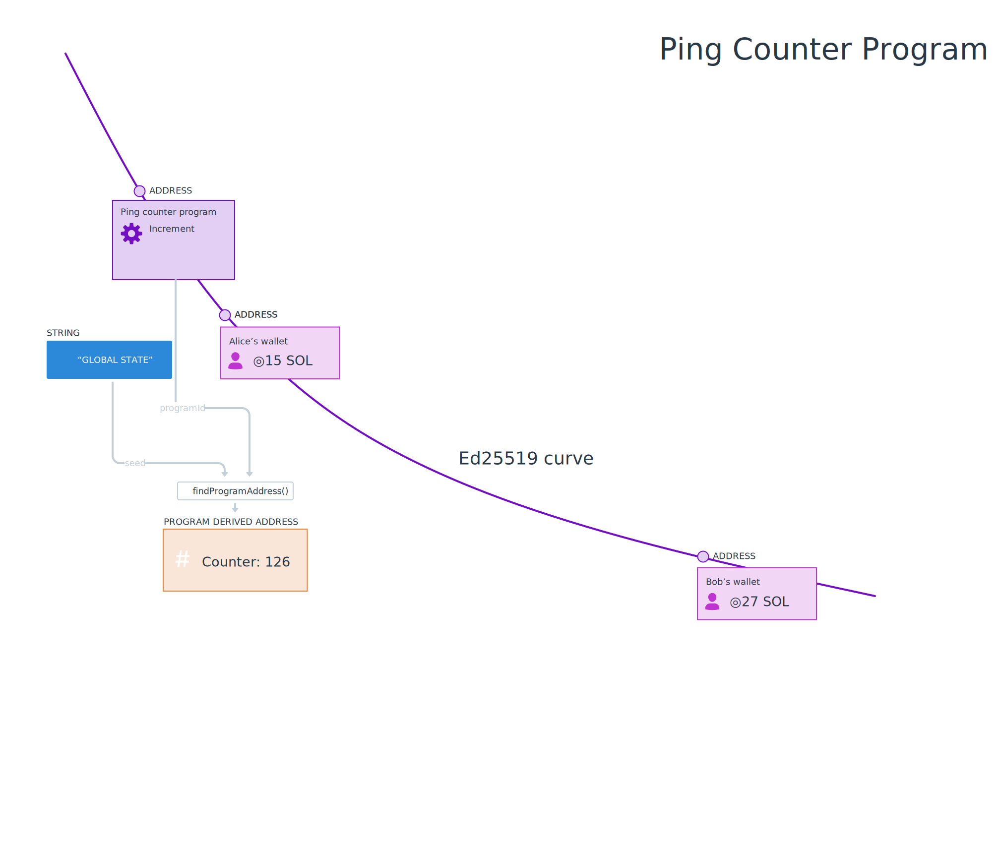
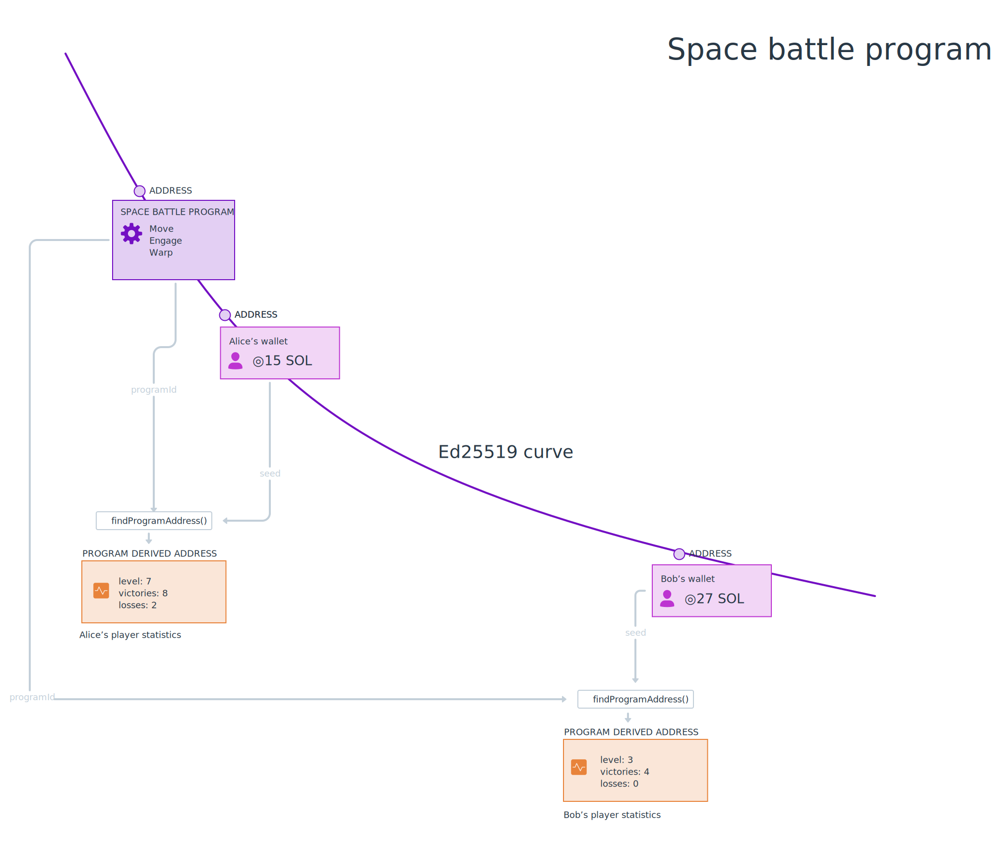
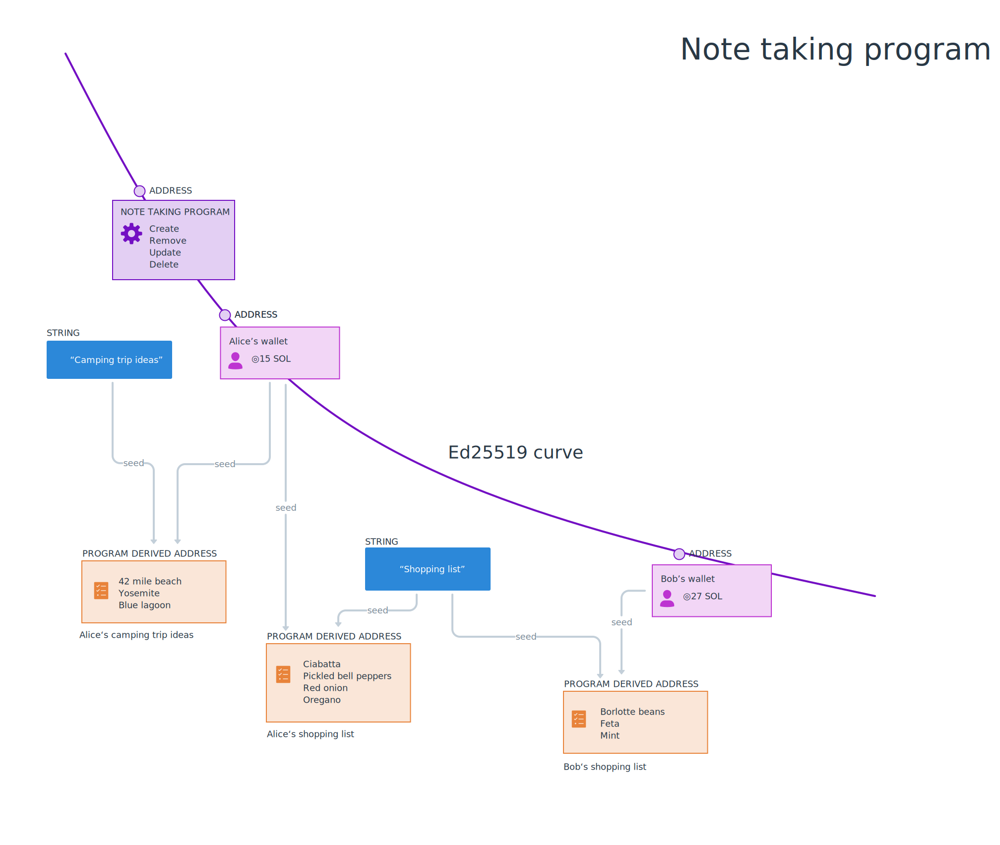

# RESUMO

- Os programas armazenam dados em PDAs, que significam **Endereço Derivado de Programa**. 
- Os PDAs não têm uma chave secreta correspondente. 
- Para armazenar e localizar dados, derive um PDA usando o método `findProgramAddress(seeds, programid)`. 
- Você pode obter as contas pertencentes a um programa usando o método `getProgramAccounts(programId)`.
- Os dados da conta precisam ser desserializados usando o mesmo layout utilizado para armazená-los em primeiro lugar. Você pode usar `@project-serum/borsh` para criar um esquema.

# Visão Geral

Na última lição, serializamos os dados do programa que foram posteriormente armazenados na cadeia por um programa Solana. Nesta lição, abordaremos com mais detalhes como os programas armazenam dados na cadeia, como recuperar dados e como desserializar os dados armazenados.
## Programas

Como diz o ditado, tudo na Solana é uma conta. Até mesmo os programas. Os programas são contas que armazenam código e são indicados como executáveis. Esse código pode ser executado pelo tempo de execução da Solana quando instruído a fazê-lo. Um endereço de programa é uma chave pública na curva elíptica Ed25519. Como todas as chaves públicas, elas têm chaves secretas correspondentes.

Os programas armazenam dados separadamente de seu código. Os programas armazenam dados em PDAs, que significa **Endereço Derivado de Programa**. Os PDAs são um conceito exclusivo da Solana, mas o padrão é familiar: 

 - Você pode pensar nos PDAs como um armazenamento de valor-chave, em que o endereço é a chave e os dados dentro da conta são o valor.
 - Também é possível considerar os PDAs como registros em um banco de dados, sendo o endereço a chave primária usada para procurar os valores dentro do banco.
 
Os PDAs combinam os endereços de um programa e algumas sementes escolhidas pelo desenvolvedor para criar endereços que armazenam partes individuais de dados. Como os PDAs são endereços que ficam *fora* da curva elíptica Ed25519, os PDAs não têm chaves secretas. Em vez disso, os PDAs podem ser assinados pelo endereço do programa usado para criá-los.

Os PDAs e os dados contidos neles podem ser encontrados de forma consistente com base no endereço do programa, no bump e nas sementes. Para localizar um PDA, a ID do programa e as sementes escolhidas pelo desenvolvedor (como uma string de texto) são passadas pela função [`findProgramAddress()`](https://solana-labs.github.io/solana-web3.js/classes/PublicKey.html#findProgramAddress). 

Vamos dar uma olhada em alguns exemplos...

#### Exemplo: programa com estado global 

Um programa simples que tenha estado global - como o nosso contador de ping - pode desejar usar apenas um único PDA, com base em uma frase-semente simples como `"GLOBAL_STATE"`. Se o cliente quisesse ler dados desse PDA, poderia derivar o endereço usando o ID do programa e essa mesma semente.

```typescript
const [pda, bump] = await findProgramAddress(Buffer.from("GLOBAL_STATE"), programId)
```



#### Exemplo: programa com dados específicos de usuário

Em programas que armazenam dados específicos de usuário, é comum usar a chave pública de um usuário como semente. Isso separa os dados de cada usuário em seu próprio PDA. A separação permite que o cliente localize os dados de cada usuário encontrando o endereço, usando o ID do programa e a chave pública do usuário.

```typescript
const [pda, bump] = await web3.PublicKey.findProgramAddress(
  [
    publicKey.toBuffer()
  ],
  programId
)
```


### Exemplo: programa com vários itens de dados por usuário

Quando há vários itens de dados por usuário, um programa pode usar mais sementes para criar e identificar contas. Por exemplo, em um aplicativo de anotações, pode haver uma conta por anotação em que cada PDA é derivado com a chave pública do usuário e o título da anotação.

```typescript
const [pda, bump] = await web3.PublicKey.findProgramAddress(
  [
    publicKey.toBuffer(), 
    Buffer.from("Shopping list")
  ],
  programId,
);
```



Neste exemplo, podemos ver que tanto Alice quanto Bob têm uma nota chamada "Lista de compras", mas como usamos o endereço da carteira deles como uma das sementes, essas duas notas podem existir ao mesmo tempo.

### Obtendo Várias Contas de Programa

Além de derivar endereços, você pode obter todas as contas criadas por um programa usando `connection.getProgramAccounts(programId)`. Isso retorna um array de objetos em que cada objeto tem a propriedade `pubkey` que representa a chave pública da conta e uma propriedade `account` do tipo `AccountInfo`. Você pode usar a propriedade `account` para obter os dados da conta.

```typescript
const accounts = connection.getProgramAccounts(programId).then(accounts => {
  accounts.map(({ pubkey, account }) => {
    console.log('Account:', pubkey)
    console.log('Data buffer:', account.data)
  })
})
```

## Desserialização dos dados do programa

A propriedade `data` em um objeto `AccountInfo` é um buffer. Para usá-lo com eficiência, você precisará escrever um código que o desserialize em algo mais utilizável. Isso é semelhante ao processo de serialização que abordamos na última lição. Assim como antes, usaremos o [Borsh](https://borsh.io/) e o `@project-serum/borsh`. Se precisar de uma atualização sobre qualquer um desses assuntos, dê uma olhada na lição anterior.

A desserialização requer conhecimento prévio do layout da conta. Ao criar seus próprios programas, você definirá como isso será feito como parte do processo. Muitos programas também têm documentação sobre como desserializar os dados da conta. De outro modo, se o código do programa estiver disponível, você poderá examinar a fonte e determinar a estrutura dessa forma.

Para desserializar corretamente os dados de um programa na cadeia, você terá de criar um esquema no lado do cliente que reflita como os dados são armazenados na conta. Por exemplo, o esquema a seguir pode ser o esquema de uma conta que armazena metadados sobre um jogador em um jogo onchain.

```typescript
import * as borsh from "@project-serum/borsh";

borshAccountSchema = borsh.struct([
  borsh.bool("initialized"),
  borsh.u16("playerId"),
  borsh.str("name"),
]);

```

Depois de definir o layout, basta chamar `.decode(buffer)` no esquema.

```typescript
import * as borsh from "@project-serum/borsh";

borshAccountSchema = borsh.struct([
  borsh.bool("initialized"),
  borsh.u16("playerId"),
  borsh.str("name"),
]);

const { playerId, name } = borshAccountSchema.decode(buffer);

```

# Demonstração

Vamos praticar isso juntos, continuando a trabalhar no aplicativo Movie Review da última lição. Não se preocupe se estiver apenas começando esta lição - deve ser possível acompanhar de qualquer maneira.

Para relembrar, esse projeto usa um programa Solana implantado na Devnet que permite aos usuários avaliar filmes. Na última lição, adicionamos uma funcionalidade ao esqueleto do frontend que permite que os usuários enviem avaliações de filmes, mas a lista de avaliações ainda está mostrando dados simulados. Vamos corrigir isso buscando as contas de armazenamento do programa e desserializando os dados armazenados nelas.


### 1. Fazer download do código inicial

Se você não concluiu a demonstração da última lição ou apenas quer ter certeza de que não perdeu nada, pode fazer o download do arquivo [código inicial](https://github.com/Unboxed-Software/solana-movie-frontend/tree/solution-serialize-instruction-data).

O projeto é um aplicativo Next.js bastante simples. Ele inclui o `WalletContextProvider` que criamos na lição Wallets, um componente `Card` para exibir uma avaliação de filme, um componente `MovieList` que exibe avaliações em uma lista, um componente `Form` para enviar uma nova avaliação e um arquivo `Movie.ts` que contém uma definição de classe para um objeto `Movie`.

Observe que, quando você executa o `npm run dev`, as revisões exibidas na página são simulações. Vamos trocá-las pelas verdadeiras.

### 2. Criar o layout do buffer

Lembre-se de que, para interagir adequadamente com um programa Solana, você precisa saber como seus dados estão estruturados. Um lembrete:


Os dados executáveis do programa estão em uma conta de programa, mas as avaliações individuais são mantidas em PDAs. Usamos `findProgramAddress()` para criar um PDA que seja exclusivo para cada carteira, para cada título de filme. Armazenaremos os seguintes dados no `data` do PDA:

1. `initialized` como um booleano que indica se a conta foi inicializada ou não.
2. `rating` como um número inteiro de 8 bits sem sinal que representa a classificação até 5 que o avaliador deu ao filme.
3. `title` como uma string que representa o título do filme analisado.
4. `description` como uma string que representa a parte escrita da avaliação.

Vamos configurar um layout `borsh` na classe `Movie` para representar o layout de dados da conta do filme. Comece importando `@project-serum/borsh`. Em seguida, crie uma propriedade estática `borshAccountSchema` e defina-a como a struct `borsh` apropriada que contém as propriedades listadas acima.

```tsx
import * as borsh from '@project-serum/borsh'

export class Movie {
  title: string;
  rating: number;
  description: string;

  ...

  static borshAccountSchema = borsh.struct([
    borsh.bool('initialized'),
    borsh.u8('rating'),
    borsh.str('title'),
    borsh.str('description'),
  ])
}
```

Lembre-se de que a ordem aqui *importa*. Ela precisa corresponder à forma como os dados da conta estão estruturados.
### 3. Crie um método para desserializar dados

Agora que temos o layout do buffer configurado, vamos criar um método estático no `Movie` chamado `deserialize` que receberá um `Buffer` opcional e retornará um objeto `Movie` ou `null`.

```typescript
import * as borsh from '@project-serum/borsh'

export class Movie {
  title: string;
  rating: number;
  description: string;

  ...

  static borshAccountSchema = borsh.struct([
    borsh.bool('initialized'),
    borsh.u8('rating'),
    borsh.str('title'),
    borsh.str('description'),
  ])

  static deserialize(buffer?: Buffer): Movie|null {
    if (!buffer) {
      return null
    }

    try {
      const { title, rating, description } = this.borshAccountSchema.decode(buffer)
      return new Movie(title, rating, description)
    } catch(error) {
      console.log('Deserialization error:', error)
      return null
    }
  }
}
```

O método primeiro verifica se o buffer existe ou não e retorna `null` se não existir. Em seguida, ele usa o layout que criamos para decodificar o buffer e, depois, usa os dados para construir e retornar uma instância de `Movie`. Se a decodificação falhar, o método registrará o erro e retornará `null`.

### 4. Obter contas de avaliações de filmes

Agora que temos uma maneira de desserializar os dados da conta, precisamos de fato obter as contas. Abra o arquivo `MovieList.tsx` e importe o `@solana/web3.js`. Em seguida, crie uma nova `Connection` dentro do componente `MovieList`. Por fim, substitua a linha `setMovies(Movie.mocks)` dentro de `useEffect` por uma chamada para `connection.getProgramAccounts`. Pegue o array resultante, converta-o em um array de filmes e chame `setMovies`.

```typescript
import { Card } from './Card'
import { FC, useEffect, useState } from 'react'
import { Movie } from '../models/Movie'
import * as web3 from '@solana/web3.js'

const MOVIE_REVIEW_PROGRAM_ID = 'CenYq6bDRB7p73EjsPEpiYN7uveyPUTdXkDkgUduboaN'

export const MovieList: FC = () => {
  const connection = new web3.Connection(web3.clusterApiUrl('devnet'))
  const [movies, setMovies] = useState<Movie[]>([])

  useEffect(() => {
    connection.getProgramAccounts(new web3.PublicKey(MOVIE_REVIEW_PROGRAM_ID)).then(async (accounts) => {
      const movies: Movie[] = accounts.map(({ account }) => {
        return Movie.deserialize(account.data)
      })

      setMovies(movies)
    })
  }, [])

  return (
    <div>
      {
        movies.map((movie, i) => <Card key={i} movie={movie} /> )
      }
    </div>
  )
}
```

Nesse ponto, você deve conseguir executar o aplicativo e ver a lista de avaliações de filmes recuperadas do programa!

Dependendo de quantas avaliações foram enviadas, isso pode levar muito tempo para carregar ou pode travar seu navegador completamente. Mas não se preocupe - na próxima lição, aprenderemos como paginar e filtrar as contas para que você possa ser mais criterioso com o que carrega.

Se precisar de mais tempo com este projeto para se sentir confortável com esses conceitos, dê uma olhada no [código de solução](https://github.com/Unboxed-Software/solana-movie-frontend/tree/solution-deserialize-account-data) antes de continuar.

# Desafio

Agora é sua vez de criar algo de forma independente. Na última lição, você trabalhou no aplicativo Student Intros para serializar os dados de instrução e enviar uma nova apresentação para a rede. Agora, é hora de buscar e desserializar os dados da conta do programa. Lembre-se de que o programa Solana que dá suporte a isso está em `HdE95RSVsdb315jfJtaykXhXY478h53X6okDupVfY9yf`.


1. Você pode construir isso do zero ou pode [fazer download do código inicial](https://github.com/Unboxed-Software/solana-student-intros-frontend/tree/solution-serialize-instruction-data).
2. Crie o layout do buffer da conta em `StudentIntro.ts`. Os dados da conta contêm:
   1. `initialized` como um número inteiro de 8 bits sem sinal que representa a instrução a ser executada (deve ser 1).
   2. `name` como uma string que representa o nome do aluno.
   3. `message` como uma string que representa a mensagem que o aluno compartilhou sobre sua jornada na Solana.
3. Crie um método estático em `StudentIntro.ts` que usará o layout do buffer para desserializar um buffer de dados de conta em um objeto `StudentIntro`.
4. No `useEffect` do componente `StudentIntroList`, obtenha as contas do programa e desserialize seus dados em uma lista de objetos `StudentIntro`.
5. Em vez de dados simulados, agora você deve estar vendo as apresentações dos alunos na rede!

Se você ficar realmente confuso, sinta-se à vontade para [consultar o código de solução](https://github.com/Unboxed-Software/solana-student-intros-frontend/tree/solution-deserialize-account-data).

Como sempre, seja criativo com esses desafios e leve-os além das instruções, se quiser!
