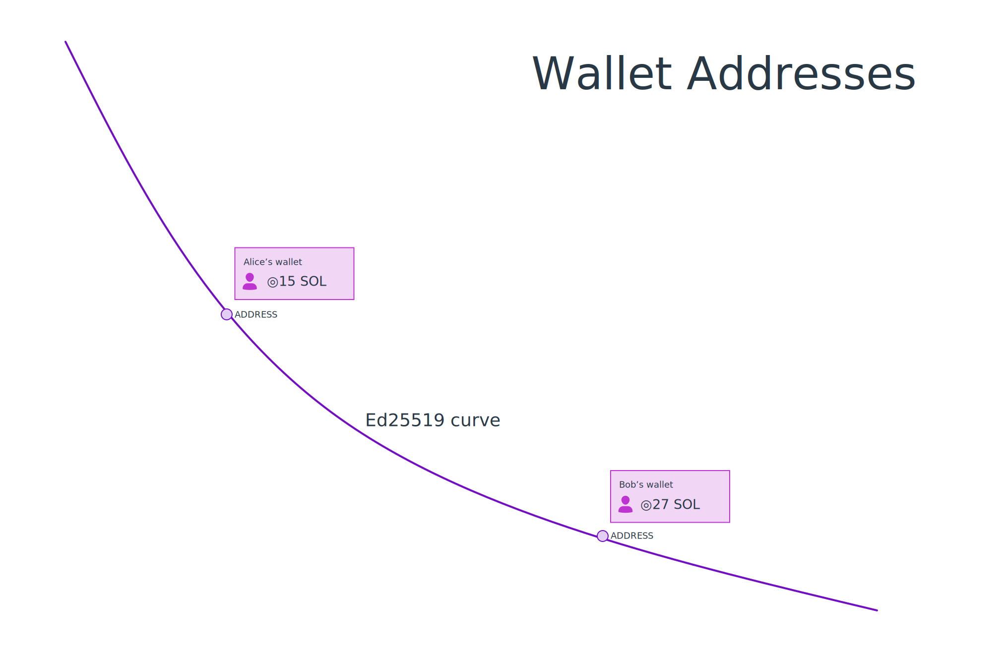

# Resumo

- Um **par de chaves** é um par correspondente de **chave pública** e **chave secreta**.
- A **chave pública** é usada como um “endereço” que aponta para uma conta na rede Solana. Uma chave pública pode ser compartilhada com qualquer pessoa.
- A **chave secreta** é usada para verificar a autoridade sobre a conta. Como o nome sugere, você deve sempre manter as chaves secretas *em segredo*.
- `@solana/web3.js` fornece funções auxiliares para criar um novo par de chaves ou para construir um par de chaves usando uma chave secreta existente.

# Visão Geral

## Criptografia Simétrica e Assimétrica

'Criptografia' é literalmente o estudo de esconder informações. Há dois tipos principais de criptografia que você encontrará no dia a dia:

**Criptografia Simétrica** é onde a mesma chave é usada para criptografar e descriptografar. Tem centenas de anos e foi usada por todos, desde os antigos egípcios até a Rainha Elizabeth I.

Há uma variedade de algoritmos de criptografia simétrica, mas os mais comuns que você verá hoje são AES e Chacha20.

**Criptografia Assimétrica**

- Criptografia assimétrica - também chamada de '[criptografia de chave pública](https://en.wikipedia.org/wiki/Public-key_cryptography)' foi desenvolvida nos anos 1970. Na criptografia assimétrica, os participantes têm pares de chaves (ou **keypairs**). Cada par de chaves consiste em uma **chave secreta** e uma **chave pública**. A criptografia assimétrica funciona de maneira diferente da criptografia simétrica e pode fazer coisas diferentes:

  - **Encriptação**: se algo for criptografado com uma chave pública, apenas a chave secreta do mesmo par de chaves pode ser usada para lê-lo.
  - **Assinaturas**: se algo for criptografado com uma chave secreta, a chave pública do mesmo par de chaves pode ser usada para provar que o titular da chave secreta a assinou.
  - Você pode até usar criptografia assimétrica para descobrir uma boa chave para usar na criptografia simétrica! Isso é chamado de **troca de chaves** onde você usa suas chaves públicas e uma chave pública do destinatário para criar uma chave de 'sessão'.
  - Há uma variedade de algoritmos de criptografia simétrica, mas os mais comuns que você verá hoje são variantes de ECC ou RSA.

A criptografia assimétrica é muito popular:
 - Seu cartão bancário tem uma chave secreta dentro dele, que é usada para assinar transações.

   Seu banco pode confirmar que você fez a transação verificando-as com a chave pública correspondente.
 - Os sites incluem uma chave pública em seu certificado, seu navegador usará esta chave pública para criptografar os dados (como informações pessoais, detalhes de login e números de cartão de crédito) que envia para a página da web.

   O site tem a chave privada correspondente, então o site pode ler os dados.
 - Seu passaporte eletrônico foi assinado pelo país que o emitiu, para garantir que o passaporte não seja falsificado.

   Os portões de passaporte eletrônico podem confirmar isso usando a chave pública do seu país de emissão.
 - Os aplicativos de mensagens no seu telefone usam troca de chaves para fazer uma chave de sessão.

Em resumo, a criptografia está em toda parte. Solana, assim como outras blockchains, é apenas um dos usos da criptografia.

## Solana usa chaves públicas como endereços



Pessoas participando da rede Solana têm pelo menos um par de chaves. Na Solana:

- A **chave pública** é usada como um "endereço" que aponta para uma conta na rede Solana. Mesmo nomes amigáveis - como `example.sol` - apontam para endereços como `dDCQNnDmNbFVi8cQhKAgXhyhXeJ625tvwsunRyRc7c8`

- A **chave secreta** é usada para verificar a autoridade sobre esse par de chaves. Se você tem a chave secreta de um endereço, você controla os tokens dentro desse endereço. Por essa razão, como o nome sugere, você deve sempre manter as chaves secretas *em segredo*.
## Usando @solana/web3.js para criar um par de chaves

Você pode usar a blockchain Solana tanto do navegador quanto do node.js com o módulo npm `@solana/web3.js`. Configure um projeto como você normalmente faria, e então [use o `npm`](https://nodesource.com/blog/an-absolute-beginners-guide-to-using-npm/) para instalar `@solana/web3.js`

```
npm i @solana/web3.js
```

Vamos cobrir muitos aspectos do [web3.js](https://docs.solana.com/developing/clients/javascript-reference) gradualmente ao longo deste curso, mas você também pode conferir a [documentação oficial do web3.js](https://docs.solana.com/developing/clients/javascript-reference).

Para enviar tokens, enviar NFTS ou ler e escrever dados na Solana, você precisará do seu próprio par de chaves. Para criar um novo par de chaves, use a função `Keypair.generate()` do `@solana/web3.js`:

```typescript
import { Keypair } from "@solana/web3.js";

const keypair = Keypair.generate();

console.log(`A chave pública é: `, keypair.publicKey.toBase58());
console.log(`A chave secreta é: `, keypair.secretKey);
```

## ⚠️ Não inclua chaves secretas no seu código-fonte

Uma vez que o par de chaves pode ser regenerado a partir da chave secreta, normalmente armazenamos apenas a chave secreta e restauramos o par de chaves a partir da chave secreta.

Adicionalmente, como a chave secreta dá autoridade sobre o endereço, não armazenamos chaves secretas no código-fonte. Em vez disso, nós:

- Colocamos chaves secretas em um arquivo `.env`
- Adicionamos `.env` ao `.gitignore` para que não seja feito o commit do arquivo `.env`.

## Carregando um par de chaves existente

Se você já tem um par de chaves que gostaria de usar, pode carregar um `Keypair` de uma chave secreta existente armazenada no sistema de arquivos ou em um arquivo `.env`. No node.js, o pacote npm `@solana-developers/helpers` inclui algumas funções extras:

 - Para usar um arquivo `.env`, use `getKeypairFromEnvironment()`
 - Para usar um arquivo da CLI da Solana, use `getKeypairFromFile()`

```typescript
import * as dotenv from "dotenv";
import { getKeypairFromEnvironment } from "@solana-developers/helpers";

dotenv.config();

const keypair = getKeypairFromEnvironment("SECRET_KEY");
```

Agora você sabe como criar e carregar pares de chaves! Vamos praticar o que aprendemos.

# Demonstração

### Instalação

Crie um novo diretório, instale o TypeScript, o Solana web3.js e o esrun:

```bash
mkdir generate-keypair
cd generate-keypair
npm init -y
npm install typescript @solana/web3.js @digitak/esrun @solana-developers/helpers
```

Crie um novo arquivo chamado `generate-keypair.ts`:

```typescript
import { Keypair } from "@solana/web3.js";
const keypair = Keypair.generate();
console.log(`✅ Par de chaves gerado!`)
```

Execute `npx esrun generate-keypair.ts`. Você deverá ver o texto:

```
✅ Par de chaves gerado!
```

Cada `Keypair` tem uma propriedade `publicKey` e `secretKey`. Atualize o arquivo:

```typescript
import { Keypair } from "@solana/web3.js";

const keypair = Keypair.generate();

console.log(`A chave pública é: `, keypair.publicKey.toBase58());
console.log(`A chave secreta é: `, keypair.secretKey);
console.log(`✅ Finalizado!`);
```

Execute `npx esrun generate-keypair.ts`. Você deverá ver o texto:

```
A chave pública é:  764CksEAZvm7C1mg2uFmpeFvifxwgjqxj2bH6Ps7La4F
A chave secreta é:  Uint8Array(64) [
  (uma longa série de números) 
]
✅ Finalizado!
```

## Carregando um par de chaves existente de um arquivo .env

Para garantir que sua chave secreta permaneça segura, recomendamos injetar a chave secreta usando um arquivo `.env`:

Crie um novo arquivo chamado `.env` com o conteúdo da chave que você fez anteriormente:

```env
SECRET_KEY="[(uma série de números)]"
```

Então podemos carregar o par de chaves do ambiente. Atualize `generate-keypair.ts`:

```typescript
import * as dotenv from "dotenv";
import { getKeypairFromEnvironment } from "@solana-developers/helpers";

dotenv.config();

const keypair = getKeypairFromEnvironment("SECRET_KEY");

console.log(
  `✅ Pronto! Carregamos nossa chave secreta com segurança, usando um arquivo env!`
);
```

Execute `npx esrun generate-keypair.ts`. Você deverá ver o seguinte resultado:

```text
✅ Pronto! Carregamos nossa chave secreta com segurança, usando um arquivo env!
```

Agora aprendemos sobre pares de chaves e como armazenar chaves secretas de forma segura na Solana. No próximo capítulo, vamos usá-las! 
