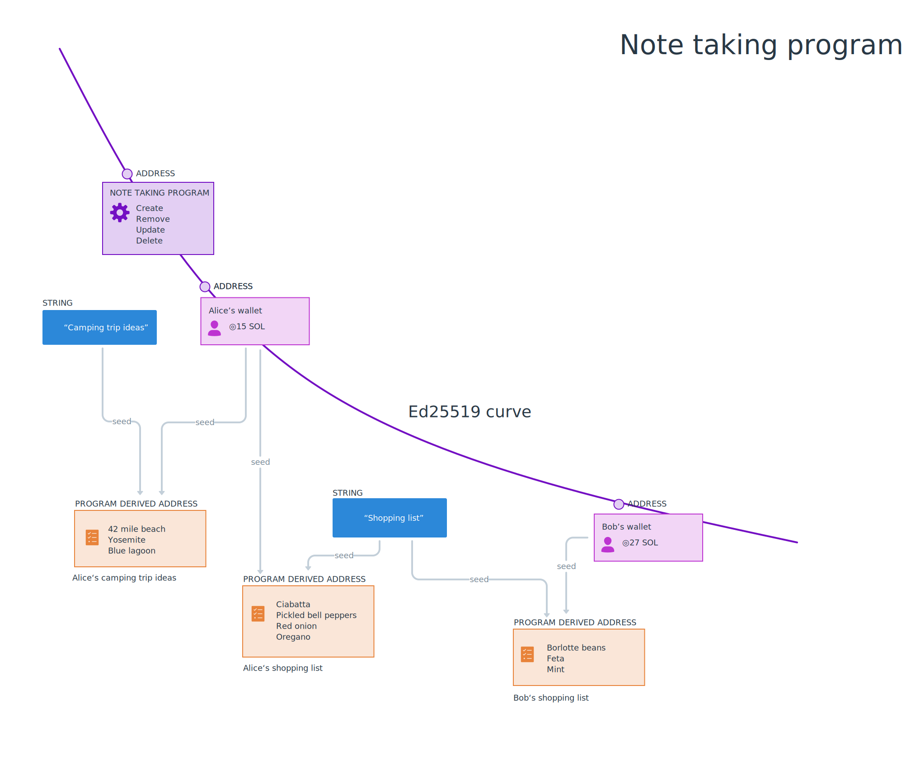

# Resumo

Todas as modificações de dados na cadeia ocorrem através de **transações**. As transações são principalmente um conjunto de instruções que invocam programas Solana. As transações são atômicas, o que significa que elas ou têm sucesso - se todas as instruções forem executadas corretamente - ou falham, como se a transação não tivesse sido executada.

# Visão Geral

## Transações

Qualquer modificação de dados na cadeia ocorre através de transações enviadas para programas.

As instruções da transação contêm:

- um identificador do programa que você pretende invocar
- um array de contas que serão lidas e/ou escritas
- dados estruturados como um array de bytes que são especificados para o programa sendo invocado

Quando você envia uma transação para um cluster Solana, um programa Solana é invocado com as instruções incluídas na transação.

Como esperado, `@solana/web3.js` fornece funções auxiliares para criar transações e instruções. Você pode criar uma nova transação com o construtor `new Transaction()` e, uma vez criada, você pode adicionar instruções à transação com o método `add()`.

Uma dessas funções auxiliares é `SystemProgram.transfer()`, que faz uma instrução para transferir SOL:

```typescript
const transaction = new Transaction()

const sendSolInstruction = SystemProgram.transfer({
  fromPubkey: sender,
  toPubkey: recipient,
  lamports: LAMPORTS_PER_SOL * amount
})

transaction.add(sendSolInstruction)
```

A função `SystemProgram.transfer()` requer:

- uma chave pública correspondente à conta do remetente
- uma chave pública correspondente à conta do destinatário
- a quantidade de SOL a ser enviada em lamports.

`SystemProgram.transfer()` retorna a instrução para enviar SOL do remetente para o destinatário. A instrução pode então ser adicionada à transação.

Uma vez que todas as instruções foram adicionadas, uma transação precisa ser enviada para o cluster e confirmada:

```typescript
const signature = sendAndConfirmTransaction(
  connection,
  transaction,
  [senderKeypair]
)
```

A função `sendAndConfirmTransaction()` recebe como parâmetros:

- uma conexão com o cluster
- uma transação
- um array de pares de chaves que atuarão como signatários na transação - neste exemplo, temos apenas um signatário: o remetente.

### Instruções

O exemplo de enviar SOL é ótimo para introduzi-lo ao envio de transações, mas grande parte do desenvolvimento web3 envolverá a chamada de programas não nativos. No exemplo acima, a função `SystemProgram.transfer()` garante que você passe todos os dados necessários para criar a instrução, e então ela cria a instrução para você. No entanto, ao trabalhar com programas não nativos, você precisará ser muito específico ao criar instruções que estejam estruturadas para corresponder ao programa correspondente.

Com `@solana/web3.js`, você pode criar instruções não nativas com o construtor `TransactionInstruction`. Este construtor recebe um único argumento do tipo de dados `TransactionInstructionCtorFields`.

```tsx
export type TransactionInstructionCtorFields = {
  keys: Array<AccountMeta>;
  programId: PublicKey;
  data?: Buffer;
};
```

Conforme a definição acima, o objeto passado para o construtor `TransactionInstruction` requer:

- um array de chaves do tipo `AccountMeta`
- a chave pública para o programa que está sendo chamado
- um `Buffer` opcional contendo dados para passar para o programa.

Vamos ignorar o campo `data` por enquanto e revisá-lo em uma lição futura.

O campo `programId` é bastante autoexplicativo: é a chave pública associada ao programa. Você precisará saber isso antecipadamente antes de chamar o programa, da mesma forma que precisaria conhecer a chave pública de alguém para quem deseja enviar SOL.

O array `keys` requer um pouco mais de explicação. Cada objeto neste array representa uma conta que será lida ou escrita durante a execução de uma transação. Isso significa que você precisa conhecer o comportamento do programa que está chamando e garantir que forneceu todas as contas necessárias no array.

Cada objeto no array `keys` deve incluir o seguinte:
- `pubkey` - a chave pública da conta
- `isSigner` - um booleano que representa se a conta é ou não signatária da transação
- `isWritable` - um booleano que representa se a conta é ou não escrita durante a execução da transação

Juntando tudo isso, podemos acabar com algo como o seguinte:

```tsx
async function callProgram(
  connection: web3.Connection,
  payer: web3.Keypair,
  programId: web3.PublicKey,
  programDataAccount: web3.PublicKey,
) {
  const instruction = new web3.TransactionInstruction({
    keys: [
      {
        pubkey: programDataAccount,
        isSigner: false,
        isWritable: true,
      },
    ],
    programId,
  });

  const transaction = new web3.Transaction().add(instruction)

  const signature = await web3.sendAndConfirmTransaction(
    connection,
    transaction,
    [payer],
  );

  console.log(`✅ Sucesso! A assinatura da transação é: ${signature}`);
}
```

### Taxas de Transação

As taxas de transação são incorporadas à economia da Solana como compensação à rede de validadores pelos recursos de CPU e GPU necessários no processamento de transações. As taxas de transação da Solana são determinísticas.

O primeiro signatário incluído no array de signatários de uma transação é responsável por pagar a taxa de transação. Se este signatário não tiver SOL suficiente em sua conta para cobrir a taxa de transação, a transação será descartada.

Ao testar, seja localmente ou na devnet, você pode usar o comando da CLI da Solana `solana airdrop 1` para obter SOL de teste gratuito em sua conta para pagar taxas de transação.

### Explorador Solana


Todas as transações na blockchain são visíveis publicamente no [Explorador Solana](http://explorer.solana.com). Por exemplo, você poderia pegar a assinatura retornada por `sendAndConfirmTransaction()` no exemplo acima, procurar por essa assinatura no Explorador Solana e ver:

- quando ocorreu
- em qual bloco foi incluída
- a taxa de transação
- e mais!


# Demonstração

Vamos criar um script para acionar um programa onchain que incrementa um contador cada vez que é acionado. Este programa existe na Devnet da Solana no endereço `ChT1B39WKLS8qUrkLvFDXMhEJ4F1XZzwUNHUt4AU9aVa`. O programa armazena seus dados em uma conta específica no endereço `Ah9K7dQ8EHaZqcAsgBW8w37yN2eAy3koFmUn4x3CJtod`.



### 1. Estrutura Básica

Começaremos usando os mesmos pacotes e arquivo `.env` que fizemos anteriormente em [introdução à criptografia](./intro-to-cryptography.md):

```typescript
import { Keypair } from "@solana/web3.js";
import * as dotenv from "dotenv";
import base58 from "bs58";
import { getKeypairFromEnvironment } from "@solana-developers/helpers"

dotenv.config();

const payer = getKeypairFromEnvironment('SECRET_KEY')
const connection = new web3.Connection(web3.clusterApiUrl('devnet'))

```

### 4. Programa Ping

Agora que carregamos nosso par de chaves, precisamos nos conectar à Devnet da Solana. Vamos criar uma conexão:

```typescript
const connection = new web3.Connection(web3.clusterApiUrl('devnet'))
```

Agora crie uma função assíncrona chamada `sendPingTransaction()` com dois parâmetros exigindo uma conexão e o par de chaves do pagador como argumentos:

```tsx
async function sendPingTransaction(connection: web3.Connection, payer: web3.Keypair) { }
```

Dentro desta função, precisamos:

1. criar uma transação
2. criar uma instrução
3. adicionar a instrução à transação
4. enviar a transação.

Lembre-se, a parte mais desafiadora aqui é incluir as informações corretas na instrução. Sabemos o endereço do programa que estamos chamando. Também sabemos que o programa escreve dados em uma conta separada, cujo endereço também temos. Vamos adicionar as versões em string de ambos como constantes no topo do arquivo `index.ts`:

```typescript
const PING_PROGRAM_ADDRESS = new web3.PublicKey('ChT1B39WKLS8qUrkLvFDXMhEJ4F1XZzwUNHUt4AU9aVa')
const PING_PROGRAM_DATA_ADDRESS =  new web3.PublicKey('Ah9K7dQ8EHaZqcAsgBW8w37yN2eAy3koFmUn4x3CJtod')
```

Agora, na função `sendPingTransaction()`, vamos criar uma nova transação, inicializar uma `PublicKey` para a conta do programa e outra para a conta de dados.

```tsx
const transaction = new web3.Transaction()
const programId = new web3.PublicKey(PING_PROGRAM_ADDRESS)
const pingProgramDataId = new web3.PublicKey(PING_PROGRAM_DATA_ADDRESS)
```

Em seguida, vamos criar a instrução. Lembre-se, a instrução precisa incluir a chave pública para o programa Ping e também precisa incluir um array com todas as contas que serão lidas ou escritas. Neste programa de exemplo, apenas a conta de dados referenciada acima é necessária.

```typescript
const transaction = new web3.Transaction()

const programId = new web3.PublicKey(PING_PROGRAM_ADDRESS)
const pingProgramDataId = new web3.PublicKey(PING_PROGRAM_DATA_ADDRESS)

const instruction = new web3.TransactionInstruction({
  keys: [
    {
      pubkey: pingProgramDataId,
      isSigner: false,
      isWritable: true
    },
  ],
  programId
})
```

Depois, vamos adicionar a instrução à transação que criamos. Então, chame `sendAndConfirmTransaction()` passando a conexão, a transação e o pagador. Finalmente, vamos registrar o resultado dessa chamada de função para que possamos procurá-lo no Explorador Solana.

```typescript
const transaction = new web3.Transaction()

const programId = new web3.PublicKey(PING_PROGRAM_ADDRESS)
const pingProgramDataId = new web3.PublicKey(PING_PROGRAM_DATA_ADDRESS)

const instruction = new web3.TransactionInstruction({
  keys: [
    {
      pubkey: pingProgramDataId,
      isSigner: false,
      isWritable: true
    },
  ],
  programId
})

transaction.add(instruction)

const signature = await web3.sendAndConfirmTransaction(
  connection,
  transaction,
  [payer]
)

console.log(`✅ Transação concluída! A assinatura é ${signature}`)
```

### 5. Airdrop

Agora execute o código com `npx esrun send-ping-instruction.ts` e veja se funciona. Você pode acabar com o seguinte erro no console:

```
> Transaction simulation failed: Attempt to debit an account but found no record of a prior credit (A simulação de transação falhou: Tentativa de débito em conta, mas não encontrou registro de crédito anterior.)
```

Se você receber este erro, é porque seu par de chaves é novo e não possui SOL suficiente para cobrir as taxas de transação. Vamos resolver isso adicionando a seguinte linha antes da chamada para `sendPingTransaction()`:

```typescript
await connection.requestAirdrop(payer.publicKey, web3.LAMPORTS_PER_SOL*1)
```

Isso depositará 1 SOL em sua conta, que você pode usar para testes. Isso não funcionará na Mainnet, onde teria valor real. Mas é incrivelmente conveniente para testar localmente e na Devnet.

### 6. Verificando o explorador Solana

Agora execute o código novamente. Pode demorar um ou dois minutos, mas agora o código deve funcionar e você deve ver uma longa string impressa no console, como a seguinte:

```
✅ Transação concluída! A assinatura é 55S47uwMJprFMLhRSewkoUuzUs5V6BpNfRx21MpngRUQG3AswCzCSxvQmS3WEPWDJM7bhHm3bYBrqRshj672cUSG
```

Copie a assinatura da transação. Abra um navegador e vá para [https://explorer.solana.com/?cluster=devnet](https://explorer.solana.com/?cluster=devnet) (o parâmetro de consulta no final do URL garantirá que você explore transações na Devnet em vez da Mainnet). Cole a assinatura na barra de pesquisa na parte superior do explorador da Devnet da Solana e pressione "enter". Você deve ver todos os detalhes sobre a transação. Se você rolar até o final, verá `Program Logs`, que mostram quantas vezes o programa recebeu ping, incluindo o seu ping.


Percorra o Explorador e observe o que você está vendo:
 - As **Entradas de Conta** incluirão: 
  - O endereço do seu pagador - sendo debitado 5000 lamports pela transação
  - O endereço do programa para o programa Ping
  - O endereço de dados para o programa Ping
 - A seção **Instrução** conterá uma única instrução, sem dados - o programa Ping é um programa bastante simples, então não precisa de dados.
 - Os **Logs de Instrução do Programa** mostram os logs do programa Ping.

[//]: # "TODO: these would make a good question-and-answer interactive once we have this content hosted on solana.com, and can support adding more interactive content easily."

Se você quiser facilitar a visualização de transações no Explorador Solana no futuro, simplesmente altere seu `console.log` em `sendPingTransaction()` para o seguinte:

```typescript
console.log(`Você pode visualizar sua transação no Explorador Solana em:\nhttps://explorer.solana.com/tx/${signature}?cluster=devnet`)
```

E é assim que você chama programas na rede Solana e escreve dados na cadeia!

### Próximos passos

Nas próximas lições, você aprenderá a:

1. Enviar transações com segurança a partir do navegador em vez de executar um script
2. Adicionar dados personalizados às suas instruções
3. Desserializar dados da cadeia

# Desafio

Vá em frente e crie um script do zero que permitirá transferir SOL de uma conta para outra na Devnet. Certifique-se de imprimir a assinatura da transação para que você possa visualizá-la no Explorador Solana.

Se você ficar preso, fique à vontade para dar uma olhada no [código da solução](https://github.com/Unboxed-Software/solana-ping-client).