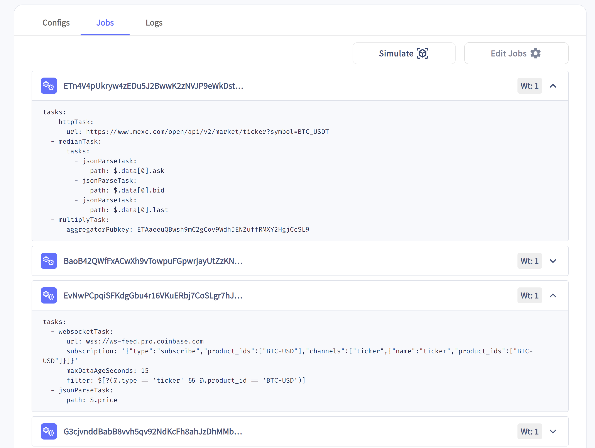
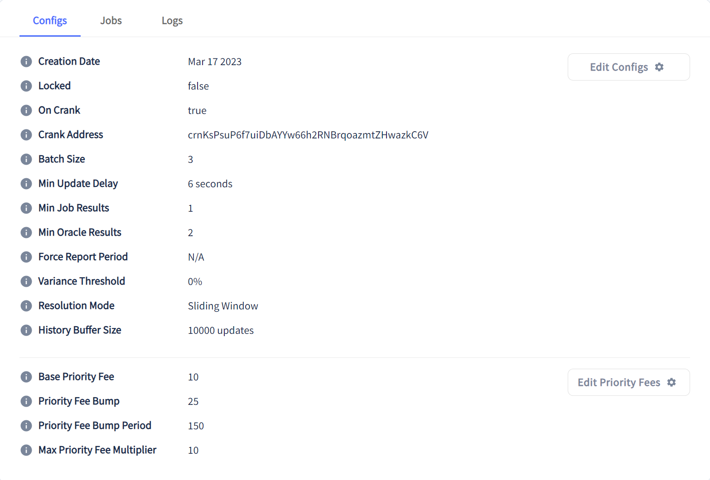

# Resumo

- Oráculos são serviços que fornecem dados externos a uma rede blockchain
- Existem dois principais provedores de Oráculos na Solana: **Switchboard** e **Pyth**
- Você pode construir seu próprio Oráculo para criar um feed de dados personalizado
- Você deve ter cuidado ao escolher seus provedores de feed de dados

# Visão Geral

Oráculos são serviços que fornecem dados externos a uma rede blockchain. Blockchains por natureza são ambientes isolados que não têm conhecimento do mundo exterior. Essa limitação inerentemente coloca um limite nos casos de uso para aplicações descentralizadas (dApps). Os oráculos fornecem uma solução para essa limitação, criando uma maneira descentralizada de obter dados do mundo real onchain.

Os oráculos podem fornecer praticamente qualquer tipo de dado onchain. Exemplos incluem:

- Resultados de eventos esportivos
- Dados meteorológicos
- Resultados de eleições políticas
- Dados de mercado
- Aleatoriedade

Embora a implementação exata possa variar de blockchain para blockchain, geralmente os Oráculos funcionam da seguinte forma:

1. Dados são obtidos off-chain.
2. Esses dados são publicados onchain em uma transação e armazenados em uma conta.
3. Programas podem ler os dados armazenados na conta e usá-los em sua lógica.

Esta lição abordará os fundamentos de como os oráculos funcionam, o estado dos oráculos na Solana e como usar efetivamente oráculos no seu desenvolvimento na Solana.

## Confiança e Redes de Oráculos

O principal obstáculo que os oráculos precisam superar é o da confiança. Já que as blockchains executam transações financeiras irreversíveis, desenvolvedores e usuários precisam saber que podem confiar na validade e precisão dos dados dos oráculos. O primeiro passo para confiar em um oráculo é entender como ele é implementado.

Falando de forma geral, existem três tipos de implementação:

1. Um único oráculo centralizado publica dados onchain.
    1. Pró: É simples; há uma única fonte de verdade.
    2. Contra: Não há nada que impeça o provedor do oráculo de fornecer dados imprecisos.
2. Rede de oráculos publica dados e um mecanismo de consenso é usado para determinar o resultado final.
    1. Pró: O consenso torna menos provável que dados ruins sejam enviados para a cadeia.
    2. Contra: Não há como desincentivar atores maliciosos de publicar dados ruins e tentar influenciar o consenso.
3. Rede de oráculos com algum tipo de mecanismo de prova de participação. Ou seja, exigir que os oráculos coloquem tokens em stake para participar do mecanismo de consenso. A cada resposta, se um oráculo desviar por algum limiar do intervalo aceito de resultados, seu stake é tomado pelo protocolo e eles não podem mais relatar.
    1. Pró: Garante que nenhum oráculo individual possa influenciar o resultado final drasticamente, incentivando ações honestas e precisas.
    2. Contra: Construir redes descentralizadas é desafiador, os incentivos precisam ser configurados adequadamente e ser suficientes para obter participação, etc.

Dependendo do caso de uso de um oráculo, qualquer uma das soluções acima pode ser a abordagem correta. Por exemplo, você pode estar perfeitamente disposto a participar de um jogo baseado em blockchain que utiliza oráculos centralizados para publicar informações do jogo na cadeia.

Por outro lado, você pode estar menos disposto a confiar em um oráculo centralizado fornecendo informações de preço para aplicações de negociação.

Você pode acabar criando muitos oráculos independentes para suas próprias aplicações simplesmente como uma forma de obter acesso a informações off-chain que você precisa. No entanto, esses oráculos dificilmente serão usados pela comunidade mais ampla onde a descentralização é um princípio fundamental. Você também deve hesitar em usar oráculos centralizados de terceiros.

Em um mundo perfeito, todos os dados importantes e/ou valiosos seriam fornecidos onchain através de uma rede de oráculos altamente eficiente por meio de um mecanismo de consenso de prova de participação confiável. Ao introduzir um mecanismo de stake, é do melhor interesse dos provedores de oráculos garantir que seus dados sejam precisos para manter seus fundos em stake.

Mesmo quando uma rede de oráculos afirma ter tal mecanismo de consenso, certifique-se de conhecer os riscos envolvidos ao usar a rede. Se o valor total envolvido das aplicações downstream for maior do que o stake alocado do oráculo, os oráculos ainda podem ter incentivo suficiente para conspirar.

É seu trabalho saber como a Rede de Oráculos está configurada e fazer um julgamento sobre se eles podem ser confiáveis. Geralmente, oráculos devem ser usados apenas para funções não críticas à missão e cenários de pior caso devem ser considerados.

## Oráculos na Solana

[Pyth](https://pyth.network) e [Switchboard](https://switchboard.xyz) são os dois principais provedores de oráculos na Solana atualmente. Cada um é único e segue escolhas de design ligeiramente diferentes.

O **Pyth** é principalmente focado em dados financeiros publicados por instituições financeiras de primeira linha. Os provedores de dados do Pyth publicam as atualizações de dados de mercado. Essas atualizações são então agregadas e publicadas na cadeia pelo programa Pyth. Os dados provenientes do Pyth não são completamente descentralizados, pois apenas provedores de dados aprovados podem publicar dados. O ponto forte do Pyth é que seus dados são diretamente verificados pela plataforma e originados de instituições financeiras, garantindo maior qualidade.

O **Switchboard** é uma rede de oráculos completamente descentralizada e tem dados de todos os tipos disponíveis. Confira todos os feeds [no site deles](https://app.switchboard.xyz/solana/devnet/explore) Além disso, qualquer pessoa pode executar um oráculo Switchboard e qualquer um pode consumir seus dados. Isso significa que você terá que ser diligente ao pesquisar feeds. Falaremos mais sobre o que procurar mais tarde na lição.

O Switchboard segue uma variação da rede de oráculos ponderada por stake descrita na terceira opção da seção anterior. Ele faz isso introduzindo o que são chamados de TEEs (Ambientes de Execução Confiáveis). TEEs são ambientes seguros isolados do resto do sistema onde código sensível pode ser executado. Em termos simples, dado um programa e uma entrada, TEEs podem executar e gerar uma saída junto com uma prova. Se você gostaria de saber mais sobre TEEs, por favor leia [a documentação do Switchboard](https://docs.switchboard.xyz/functions).

Ao introduzir TEEs em cima de oráculos ponderados por stake, o Switchboard é capaz de verificar o software de cada oráculo para permitir a participação na rede. Se um operador de oráculo agir maliciosamente e tentar alterar a operação do código aprovado, a verificação da cotação de dados falhará. Isso permite que os oráculos do Switchboard operem além do relatório de valores quantitativos, como funções -- executando cálculos confidenciais e personalizados off-chain.

## Oráculos Switchboard

Os oráculos do Switchboard armazenam dados na Solana usando feeds de dados. Esses feeds de dados, também chamados de agregadores, são cada um uma coleção de trabalhos que são agregados para produzir um único resultado. Esses agregadores são representados na cadeia como uma conta regular da Solana gerenciada pelo programa Switchboard. Quando um oráculo é atualizado, ele escreve os dados diretamente nessas contas. Vamos revisar alguns termos para entender como o Switchboard funciona:

- **[Agregador (Feed de Dados)](https://github.com/switchboard-xyz/sbv2-solana/blob/0b5e0911a1851f9ca37042e6ff88db4cd840067b/rust/switchboard-solana/src/oracle_program/accounts/aggregator.rs#L60)** - Contém a configuração do feed de dados, ditando como as atualizações do feed de dados são solicitadas, atualizadas e resolvidas na cadeia a partir de sua fonte atribuída. O Agregador é a conta de propriedade do programa Solana do Switchboard e é onde os dados são publicados na cadeia.
- **[Trabalho (Job)](https://github.com/switchboard-xyz/sbv2-solana/blob/0b5e0911a1851f9ca37042e6ff88db4cd840067b/rust/switchboard-solana/src/oracle_program/accounts/job.rs)** - Cada fonte de dados deve corresponder a uma conta de trabalho. A conta de trabalho é uma coleção de tarefas do Switchboard usadas para instruir os oráculos sobre como buscar e transformar dados. Em outras palavras, armazena os planos de como os dados são buscados off-chain para uma fonte de dados específica.
- **Oráculo** - Um programa separado que fica entre a internet e a blockchain e facilita o fluxo de informações. Um oráculo lê as definições de trabalho de um feed, calcula o resultado e submete sua resposta onchain.
- **Fila de Oráculos** - Um grupo de oráculos que são atribuídos para atualizar solicitações em uma ordem de rodízio. Os oráculos na fila devem estar ativamente pulsando na cadeia para fornecer atualizações. Dados e configurações para esta fila são armazenados onchain em uma [conta de propriedade do programa Switchboard](https://github.com/switchboard-xyz/solana-sdk/blob/9dc3df8a5abe261e23d46d14f9e80a7032bb346c/javascript/solana.js/src/generated/oracle-program/accounts/OracleQueueAccountData.ts#L8).
- **Consenso de Oráculos** - Determina como os oráculos chegam a um acordo sobre o resultado aceito onchain. Os oráculos do Switchboard usam a resposta mediana do oráculo como o resultado aceito. Uma autoridade de feed pode controlar quantos oráculos são solicitados e quantos devem responder para influenciar sua segurança.

Os oráculos do Switchboard são incentivados a atualizar feeds de dados porque são recompensados por fazer isso com precisão. Cada feed de dados tem uma conta `LeaseContract`. O contrato de arrendamento é uma conta de custódia pré-financiada para recompensar os oráculos por cumprirem solicitações de atualização. Apenas a `leaseAuthority` pré-definida pode retirar fundos do contrato, mas qualquer um pode contribuir para ele. Quando uma nova rodada de atualizações é solicitada para um feed de dados, o usuário que solicitou a atualização é recompensado da custódia. Isso é para incentivar os usuários e os giradores de manivela (qualquer um que execute software para enviar sistematicamente solicitações de atualização aos Oráculos) a manter os feeds atualizados com base nas configurações de um feed. Uma vez que uma solicitação de atualização tenha sido cumprida com sucesso e submetida onchain pelos oráculos na fila, os oráculos também recebem uma recompensa da custódia. Esses pagamentos garantem participantes ativos.

Além disso, os oráculos têm que colocar tokens em stake antes que possam atender solicitações de atualização e submeter respostas onchain. Se um oráculo submeter um resultado na cadeia que fique fora dos parâmetros configurados da fila, seu stake será cortado (se a fila tiver `slashingEnabled`). Isso ajuda a garantir que os oráculos estejam respondendo de boa fé com informações precisas.

Agora que você entende a terminologia e a economia, vamos ver como os dados são publicados na cadeia:

1. Configuração da fila de oráculos - Quando uma atualização é solicitada de uma fila, os próximos `N` oráculos são atribuídos à solicitação de atualização e ciclados para o fim da fila. Cada fila de oráculos na rede Switchboard é independente e mantém sua própria configuração. A configuração influencia seu nível de segurança. Esta escolha de design permite que os usuários adaptem o comportamento da fila de oráculos para corresponder ao seu caso de uso específico. Uma fila de oráculos é armazenada na cadeia como uma conta e contém metadados sobre a fila. Uma fila é criada invocando a [instrução oracleQueueInit](https://github.com/switchboard-xyz/solana-sdk/blob/9dc3df8a5abe261e23d46d14f9e80a7032bb346c/javascript/solana.js/src/generated/oracle-program/instructions/oracleQueueInit.ts#L13) no programa Solana do Switchboard.
    1. Algumas configurações relevantes da Fila de Oráculos:
        1. `oracle_timeout` - Intervalo em que oráculos desatualizados serão removidos se falharem em pulsar.
        2. `reward` - Recompensas para fornecer oráculos e abridores de rodada nesta fila.
        3. `min_stake` - A quantidade mínima de stake que os oráculos devem fornecer para permanecer na fila.
        4. `size` - O número atual de oráculos em uma fila.
        5. `max_size` - O número máximo de oráculos que uma fila pode suportar.
2. Configuração do Agregador/Feed de Dados - A conta do agregador/feed é criada. Um feed pertence a uma única fila de oráculos. A configuração do feed dita como as solicitações de atualização são invocadas e encaminhadas pela rede.
3. Configuração da Conta de Trabalho - Além do feed, uma conta de trabalho para cada fonte de dados deve ser configurada. Isso define como os oráculos podem cumprir as solicitações de atualização do feed. Isso inclui definir de onde os oráculos devem buscar os dados que o feed está solicitando.
4. Atribuição de Solicitação - Uma vez que uma atualização foi solicitada com a conta do feed, a fila de oráculos atribui a solicitação a diferentes oráculos/nós na fila para cumprir. Os oráculos buscarão os dados da fonte de dados definida em cada uma das contas de trabalho do feed. Cada conta de trabalho tem um peso associado a ela. O oráculo calculará a mediana ponderada dos resultados de todos os trabalhos.
5. Após receber respostas `minOracleResults`, o programa onchain calcula o resultado usando a mediana das respostas dos oráculos. Os oráculos que responderam dentro dos parâmetros configurados da fila são recompensados, enquanto os oráculos que respondem fora deste limite são cortados (se a fila tiver `slashingEnabled`).
6. O resultado atualizado é armazenado na conta do feed de dados para que possa ser lido/consumido na cadeia.

### Como usar os Oráculos Switchboard

Para usar oráculos Switchboard e incorporar dados off-chain em um programa Solana, você primeiro precisa encontrar um feed que forneça os dados de que precisa. Os feeds do Switchboard são públicos e há muitos [já disponíveis que você pode escolher](https://app.switchboard.xyz/solana/devnet/explore). Ao procurar um feed, você precisa decidir quão preciso/confiável você quer o feed, de onde você quer obter os dados, bem como a cadência de atualização do feed. Ao consumir um feed publicamente disponível, você não tem controle sobre essas coisas, então escolha com cuidado!

Por exemplo, há um feed [BTC_USD](https://app.switchboard.xyz/solana/devnet/feed/8SXvChNYFhRq4EZuZvnhjrB3jJRQCv4k3P4W6hesH3Ee) patrocinado pelo Switchboard. Este feed está disponível na devnet/mainnet da Solana com a chave pública `8SXvChNYFhRq4EZuZvnhjrB3jJRQCv4k3P4W6hesH3Ee`. Ele fornece o preço atual do Bitcoin em USD na cadeia.

Os dados reais onchain para uma conta de feed do Switchboard são mais ou menos assim:

```rust
// do programa Solana do Switchboard
// https://github.com/switchboard-xyz/sbv2-solana/blob/0b5e0911a1851f9ca37042e6ff88db4cd840067b/rust/switchboard-solana/src/oracle_program/accounts/aggregator.rs#L60

pub struct AggregatorAccountData {
    /// Nome do agregador para armazenar onchain.
    pub name: [u8; 32],
    ...
    ...
    /// Chave pública da fila à qual o agregador pertence.
    pub queue_pubkey: Pubkey,
    ...
    /// Número mínimo de respostas de oráculos necessárias antes que uma rodada seja validada.
    pub min_oracle_results: u32,
    /// Número mínimo de resultados de trabalhos antes que um oráculo aceite um resultado.
    pub min_job_results: u32,
    /// Número mínimo de segundos necessários entre as rodadas do agregador.
    pub min_update_delay_seconds: u32,
    ...
    /// Porcentagem de variação necessária entre uma rodada anterior e a rodada atual. Se a porcentagem de variação não for atendida, rejeite novas respostas do oráculo.
    pub variance_threshold: SwitchboardDecimal,
    ...
    /// Último resultado confirmado de solicitação de atualização que foi aceito como válido. Aqui é onde você encontrará os dados que está solicitando em latest_confirmed_round.result
    pub latest_confirmed_round: AggregatorRound,
    ...
    /// O resultado da rodada confirmada anterior.
    pub previous_confirmed_round_result: SwitchboardDecimal,
    /// O slot quando a rodada confirmada anterior foi aberta.
    pub previous_confirmed_round_slot: u64,
    ...
}
```

Você pode visualizar o código completo para esta estrutura de dados no [programa Switchboard aqui](https://github.com/switchboard-xyz/sbv2-solana/blob/0b5e0911a1851f9ca37042e6ff88db4cd840067b/rust/switchboard-solana/src/oracle_program/accounts/aggregator.rs#L60).

Alguns campos e configurações relevantes no tipo `AggregatorAccountData` são:

- `min_oracle_results` - Número mínimo de respostas dos oráculos necessárias antes que uma rodada seja validada.
- `min_job_results` - Número mínimo de resultados de trabalhos antes que um oráculo aceite um resultado.
- `variance_threshold` - Porcentagem de variação necessária entre uma rodada anterior e a rodada atual. Se a porcentagem de variação não for atendida, rejeite novas respostas de oráculos.
- `latest_confirmed_round` - Último resultado confirmado de solicitação de atualização aceito como válido. Aqui é onde você encontrará os dados do feed em `latest_confirmed_round.result`
- `min_update_delay_seconds` - Número mínimo de segundos necessários entre as rodadas do agregador.

As três primeiras configurações listadas acima estão diretamente relacionadas à precisão e confiabilidade de um feed de dados.

O campo `min_job_results` representa a quantidade mínima de respostas bem-sucedidas de fontes de dados que um oráculo deve receber antes de poder submeter sua resposta onchain. Isso significa que se `min_job_results` for três, cada oráculo tem que buscar dados de três fontes de trabalho. Quanto maior esse número, mais confiáveis e precisos serão os dados no feed. Isso também limita o impacto que uma única fonte de dados pode ter no resultado.

O campo `min_oracle_results` é o número mínimo de respostas de oráculos necessárias para que uma rodada seja bem-sucedida. Lembre-se, cada oráculo em uma fila busca dados de cada fonte definida como um trabalho. O oráculo então tira a mediana ponderada das respostas das fontes e submete essa mediana onchain. O programa então espera por `min_oracle_results` de medianas ponderadas e tira a mediana disso, que é o resultado final armazenado na conta do feed de dados.

O campo `min_update_delay_seconds` está diretamente relacionado à cadência de atualização de um feed. `min_update_delay_seconds` deve ter passado entre uma rodada de atualizações e a próxima antes que o programa Switchboard aceite resultados.

Pode ser útil olhar para a aba de trabalhos de um feed no explorador do Switchboard. Por exemplo, você pode olhar para o [feed BTC_USD no explorador](https://app.switchboard.xyz/solana/devnet/feed/8SXvChNYFhRq4EZuZvnhjrB3jJRQCv4k3P4W6hesH3Ee). Cada trabalho listado define a fonte de onde os oráculos buscarão dados e a ponderação de cada fonte. Você pode visualizar os pontos de extremidade de API reais que fornecem os dados para este feed específico. Ao determinar qual feed de dados usar em seu programa, coisas assim são muito importantes a considerar.

Abaixo está uma captura de tela de dois dos trabalhos relacionados ao feed BTC_USD. Ela mostra duas fontes de dados: [MEXC](https://www.mexc.com/) e [Coinbase](https://www.coinbase.com/).



Depois de escolher um feed para usar, você pode começar a ler os dados nesse feed. Você faz isso simplesmente desserializando e lendo o estado armazenado na conta. A maneira mais fácil de fazer isso é usando a estrutura `AggregatorAccountData` que definimos acima do crate `switchboard_v2` em seu programa. 

```rust
// importar crates do Anchor e do Switchboard
use {
    anchor_lang::prelude::*,
    switchboard_v2::AggregatorAccountData,
};

...

#[derive(Accounts)]
pub struct ConsumeDataAccounts<'info> {
	// passe a conta do feed de dados e desserialize para AggregatorAccountData
	pub feed_aggregator: AccountLoader<'info, AggregatorAccountData>,
	...
}
```

Observe que usamos o tipo `AccountLoader` aqui em vez do tipo normal `Account` para desserializar a conta do agregador. Devido ao tamanho de `AggregatorAccountData`, a conta usa o que é chamado de zero-copy. Isso, em combinação com `AccountLoader`, impede que a conta seja carregada na memória e dá ao nosso programa acesso direto aos dados em vez disso. Ao usar `AccountLoader`, podemos acessar os dados armazenados na conta de uma das três maneiras:

- `load_init` após inicializar uma conta (isso ignorará o discriminador de conta ausente que é adicionado apenas após o código de instrução do usuário)
- `load` quando a conta não é mutável
- `load_mut` quando a conta é mutável

Se você quiser aprender mais, confira a lição [Arquitetura Avançada do Programa](./program-architecture.md) onde abordamos `Zero-Copy` e `AccountLoader`.

Com a conta do agregador passada para o seu programa, você pode usá-la para obter o último resultado do oráculo. Especificamente, você pode usar o método `get_result()` do tipo:

```rust
// dentro de um programa Anchor
...

let feed = &ctx.accounts.feed_aggregator.load()?;
// obtenha o resultado
let val: f64 = feed.get_result()?.try_into()?;
```

O método `get_result()` definido na struct `AggregatorAccountData` é mais seguro do que buscar os dados com `latest_confirmed_round.result` porque o Switchboard implementou algumas verificações de segurança inteligentes.

```rust
// do programa Switchboard
// https://github.com/switchboard-xyz/sbv2-solana/blob/0b5e0911a1851f9ca37042e6ff88db4cd840067b/rust/switchboard-solana/src/oracle_program/accounts/aggregator.rs#L195

pub fn get_result(&self) -> anchor_lang::Result<SwitchboardDecimal> {
    if self.resolution_mode == AggregatorResolutionMode::ModeSlidingResolution {
        return Ok(self.latest_confirmed_round.result);
    }
    let min_oracle_results = self.min_oracle_results;
    let latest_confirmed_round_num_success = self.latest_confirmed_round.num_success;
    if min_oracle_results > latest_confirmed_round_num_success {
        return Err(SwitchboardError::InvalidAggregatorRound.into());
    }
    Ok(self.latest_confirmed_round.result)
}
```

Você também pode visualizar o valor atual armazenado em uma conta `AggregatorAccountData` do lado do cliente em TypeScript.

```tsx
import { AggregatorAccount, SwitchboardProgram} from '@switchboard-xyz/solana.js'

...
...
// criar par de chaves para usuário de teste
let user = new anchor.web3.Keypair()

// buscar objeto devnet do programa Switchboard
switchboardProgram = await SwitchboardProgram.load(
  "devnet",
  new anchor.web3.Connection("https://api.devnet.solana.com"),
  user
)

// passar objeto do programa Switchboard e chave pública do feed para o construtor AggregatorAccount
aggregatorAccount = new AggregatorAccount(switchboardProgram, solUsedSwitchboardFeed)

// buscar preço mais recente do SOL
const solPrice: Big | null = await aggregatorAccount.fetchLatestValue()
if (solPrice === null) {
  throw new Error('O Agregador não tem valor')
}
```

Lembre-se, os feeds de dados do Switchboard são apenas contas que são atualizadas por terceiros (oráculos). Dado isso, você pode fazer qualquer coisa com a conta que normalmente faria com contas externas ao seu programa.

### Melhores Práticas e Armadilhas Comuns

Ao incorporar feeds do Switchboard em seus programas, há dois grupos de preocupações a considerar: escolher um feed e consumir os dados desse feed.

Sempre audite as configurações de um feed antes de decidir incorporá-lo em um programa. Configurações como **Atraso Mínimo de Atualização**, **Resultados Mínimos de Trabalho** e **Resultados Mínimos de Oráculos** podem afetar diretamente os dados que são eventualmente persistidos onchain na conta do agregador. Por exemplo, olhando para a seção de configuração do [feed BTC_USD](https://app.switchboard.xyz/solana/devnet/feed/8SXvChNYFhRq4EZuZvnhjrB3jJRQCv4k3P4W6hesH3Ee) você pode ver suas configurações relevantes.



O feed BTC_USD tem Atraso Mínimo de Atualização = 6 segundos. Isso significa que o preço do BTC é atualizado no mínimo a cada 6 segundos neste feed. Isso provavelmente é adequado para a maioria dos casos de uso, mas se você quiser usar este feed para algo sensível à latência, provavelmente não é uma boa escolha.

Também vale a pena auditar as fontes de um feed na seção de Trabalhos (Jobs) do explorador de oráculos. Como o valor que é persistido na cadeia é o resultado mediano ponderado que os oráculos puxam de cada fonte, as fontes influenciam diretamente o que é armazenado no feed. Verifique links suspeitos e potencialmente execute as APIs você mesmo por um tempo para ganhar confiança nelas.

Uma vez que você encontrou um feed que se adequa às suas necessidades, você ainda precisa ter certeza de que está usando o feed adequadamente. Por exemplo, você ainda deve implementar verificações de segurança necessárias na conta passada para a sua instrução. Qualquer conta pode ser passada para as instruções do seu programa, então você deve verificar se é a conta que você espera que seja.

No Anchor, se você desserializar a conta para o tipo `AggregatorAccountData` do crate `switchboard_v2`, o Anchor verifica que a conta é de propriedade do programa Switchboard. Se o seu programa espera que apenas um feed de dados específico seja passado na instrução, então você também pode verificar se a chave pública da conta passada corresponde ao que deveria ser. Uma maneira de fazer isso é codificar rigidamente o endereço no programa em algum lugar e usar restrições de conta para verificar se o endereço passado corresponde ao esperado.

```rust
use {
  anchor_lang::prelude::*,
  solana_program::{pubkey, pubkey::Pubkey},
	switchboard_v2::{AggregatorAccountData},
};

pub static BTC_USDC_FEED: Pubkey = pubkey!("8SXvChNYFhRq4EZuZvnhjrB3jJRQCv4k3P4W6hesH3Ee");

...
...

#[derive(Accounts)]
pub struct TestInstruction<'info> {
	// Agregador de feed SOL do Switchboard
	#[account(
	    address = BTC_USDC_FEED
	)]
	pub feed_aggregator: AccountLoader<'info, AggregatorAccountData>,
}
```

Além de garantir que a conta do feed é a que você espera, você também pode fazer algumas verificações nos dados armazenados no feed na lógica de instrução do seu programa. Duas coisas comuns a verificar são a desatualização dos dados e o intervalo de confiança.

Cada feed de dados atualiza o valor atual armazenado nele quando acionado pelos oráculos. Isso significa que as atualizações dependem dos oráculos na fila a que está atribuído. Dependendo da finalidade para a qual você pretende usar o feed de dados, pode ser benéfico verificar se o valor armazenado na conta foi atualizado recentemente. Por exemplo, um protocolo de empréstimo que precisa determinar se a garantia de um empréstimo caiu abaixo de um certo nível pode exigir que os dados não tenham mais que alguns segundos. Você pode fazer seu código verificar a marca temporal (timestamp) da atualização mais recente armazenada na conta do agregador. O seguinte trecho de código verifica se a marca temporal da atualização mais recente no feed de dados não ocorreu há mais de 30 segundos.

```rust
use {
    anchor_lang::prelude::*,
    anchor_lang::solana_program::clock,
    switchboard_v2::{AggregatorAccountData, SwitchboardDecimal},
};

...
...

let feed = &ctx.accounts.feed_aggregator.load()?;
if (clock::Clock::get().unwrap().unix_timestamp - feed.latest_confirmed_round.round_open_timestamp) <= 30{
      valid_transfer = true;
  }
```

O campo `latest_confirmed_round` na struct `AggregatorAccountData`, que é do tipo `AggregatorRound`, é definido como:

```rust
// https://github.com/switchboard-xyz/sbv2-solana/blob/0b5e0911a1851f9ca37042e6ff88db4cd840067b/rust/switchboard-solana/src/oracle_program/accounts/aggregator.rs#L17

pub struct AggregatorRound {
    /// Mantém o número de respostas bem-sucedidas recebidas dos nós.
    /// Os nós podem enviar uma resposta bem-sucedida por rodada.
    pub num_success: u32,
    /// Número de respostas de erro.
    pub num_error: u32,
    /// Se uma rodada de solicitação de atualização terminou.
    pub is_closed: bool,
    /// Mantém o `solana_program::clock::Slot` em que a rodada foi aberta.
    pub round_open_slot: u64,
    /// Mantém o `solana_program::clock::UnixTimestamp;` em que a rodada foi aberta.
    pub round_open_timestamp: i64,
    /// Mantém a mediana atual de todas as respostas bem-sucedidas da rodada.
    pub result: SwitchboardDecimal,
    /// Desvio padrão dos resultados aceitos na rodada.
    pub std_deviation: SwitchboardDecimal,
    /// Mantém a resposta mínima do nó nesta rodada.
    pub min_response: SwitchboardDecimal,
    /// Mantém a resposta máxima do nó nesta rodada.
    pub max_response: SwitchboardDecimal,
    /// Chaves públicas dos oráculos que cumprem esta rodada.
    pub oracle_pubkeys_data: [Pubkey; 16],
    /// Representa todas as respostas bem-sucedidas dos nós nesta rodada. `NaN` se estiver vazio.
    pub medians_data: [SwitchboardDecimal; 16],
    /// Pagamentos/cortes (slashes) atuais que os oráculos receberam nesta rodada.
    pub current_payout: [i64; 16],
    /// Acompanha quais respostas estão cumpridas aqui.
    pub medians_fulfilled: [bool; 16],
    /// Acompanha quais erros estão cumpridos aqui.
    pub errors_fulfilled: [bool; 16],
}
```

Há alguns outros campos relevantes que podem ser do seu interesse na conta Aggregator, como `num_success`, `medians_data`, `std_deviation`, etc. `num_success` é o número de respostas bem-sucedidas recebidas dos oráculos nesta rodada de atualizações. `medians_data` é um array de todas as respostas bem-sucedidas recebidas dos oráculos nesta rodada. Este é o conjunto de dados usado para derivar a mediana e o resultado final. `std_deviation` é o desvio padrão dos resultados aceitos nesta rodada. Você pode querer verificar se há um desvio padrão baixo, o que significa que todas as respostas dos oráculos foram semelhantes. O programa Switchboard é responsável por atualizar os campos relevantes nesta struct toda vez que recebe uma atualização de um oráculo.


O `AggregatorAccountData` também possui um método `check_confidence_interval()` que você pode usar como outra verificação nos dados armazenados no feed. O método permite que você insira um `max_confidence_interval`. Se o desvio padrão dos resultados recebidos do oráculo for maior que o `max_confidence_interval` dado, ele retorna um erro.

```rust
// https://github.com/switchboard-xyz/sbv2-solana/blob/0b5e0911a1851f9ca37042e6ff88db4cd840067b/rust/switchboard-solana/src/oracle_program/accounts/aggregator.rs#L228

pub fn check_confidence_interval(
    &self,
    max_confidence_interval: SwitchboardDecimal,
) -> anchor_lang::Result<()> {
    if self.latest_confirmed_round.std_deviation > max_confidence_interval {
        return Err(SwitchboardError::ConfidenceIntervalExceeded.into());
    }
    Ok(())
}
```

Você pode incorporar isso ao seu programa da seguinte maneira:

```rust
use {
    crate::{errors::*},
    anchor_lang::prelude::*,
    std::convert::TryInto,
    switchboard_v2::{AggregatorAccountData, SwitchboardDecimal},
};

...
...

let feed = &ctx.accounts.feed_aggregator.load()?;

// verifica se o feed não excede o max_confidence_interval
feed.check_confidence_interval(SwitchboardDecimal::from_f64(max_confidence_interval))
    .map_err(|_| error!(ErrorCode::ConfidenceIntervalExceeded))?;
```

Por último, é importante planejar cenários de pior caso em seus programas. Planeje que os feeds de dados fiquem desatualizados e planeje para o caso de contas de feeds serem fechadas.

## Conclusão

Se você deseja programas funcionais que possam realizar ações com base em dados do mundo real, você terá que usar oráculos. Felizmente, existem algumas redes de oráculos confiáveis, como o Switchboard, que tornam o uso de oráculos mais fácil do que seria de outra forma. No entanto, certifique-se de fazer sua devida diligência nos oráculos que você usa. Você é, em última análise, responsável pelo comportamento do seu programa!

# Demonstração

Vamos praticar o uso de oráculos! Construiremos um programa "Michael Burry Escrow" que trava SOL em uma conta de custódia até que o SOL esteja acima de um determinado valor em USD. Isso é nomeado em homenagem ao investidor [Michael Burry](https://en.wikipedia.org/wiki/Michael_Burry), famoso por prever a crise imobiliária de 2008.

Estaremos usando o oráculo [SOL_USD](https://app.switchboard.xyz/solana/devnet/feed/GvDMxPzN1sCj7L26YDK2HnMRXEQmQ2aemov8YBtPS7vR) da devnet do Switchboard. O programa terá duas instruções principais:

- Depósito - Bloqueie o SOL e defina um preço em USD para desbloqueá-lo.
- Retirada - Verifique o preço em USD e retire o SOL se o preço for atingido.

### 1. Configuração do Programa

Para começar, vamos criar o programa com:

```zsh
anchor init burry-escrow
```

Em seguida, substitua o ID do programa em `lib.rs` e `Anchor.toml` com o ID do programa mostrado quando você executar `anchor keys list`.

Em seguida, adicione o seguinte ao final do seu arquivo Anchor.toml. Isso dirá ao Anchor como configurar nosso ambiente de teste local. Isso nos permitirá testar nosso programa localmente sem ter que implantar e enviar transações para a devnet.

```zsh
# parte inferior do arquivo Anchor.toml
[test.validator]
url="https://api.devnet.solana.com"

[test]
startup_wait = 10000

[[test.validator.clone]] # programID sbv2 da devnet
address = "SW1TCH7qEPTdLsDHRgPuMQjbQxKdH2aBStViMFnt64f"

[[test.validator.clone]] # IDL sbv2 da devnet
address = "Fi8vncGpNKbq62gPo56G4toCehWNy77GgqGkTaAF5Lkk"

[[test.validator.clone]] # Feed sbv2 SOL/USD
address="GvDMxPzN1sCj7L26YDK2HnMRXEQmQ2aemov8YBtPS7vR"
```

Além disso, queremos importar o crate `switchboard-v2` no nosso arquivo `Cargo.toml`. Certifique-se de que suas dependências se pareçam com o trecho abaixo:

```toml
[dependencies]
anchor-lang = "0.28.0"
switchboard-v2 = "0.4.0"
```

Antes de começarmos com a lógica, vamos revisar a estrutura do nosso programa. Com programas pequenos, é muito fácil adicionar todo o código do contrato inteligente em um único arquivo `lib.rs` e encerrar o dia. No entanto, para manter tudo mais organizado, é útil dividir em diferentes arquivos. Nosso programa terá os seguintes arquivos dentro do diretório `programs/src`:

`/instructions/deposit.rs`

`/instructions/withdraw.rs`

`/instructions/mod.rs`

`errors.rs`

`state.rs`

`lib.rs`

O arquivo `lib.rs` ainda servirá como ponto de entrada para o nosso programa, mas a lógica para cada instrução estará contida em seu próprio arquivo separado. Prossiga com a elaboração da arquitetura do programa conforme mencionado anteriormente e, após isso, daremos início ao processo.

### 2. `lib.rs`

Antes de escrevermos qualquer lógica, vamos configurar todas as nossas informações básicas. Começando com `lib.rs`. Nossa lógica real viverá no diretório `/instructions`.

O arquivo `lib.rs` servirá como ponto de entrada para o nosso programa. Ele definirá os pontos de extremidade da API pelos quais todas as transações devem passar.

```rust
use anchor_lang::prelude::*;
use instructions::deposit::*;
use instructions::withdraw::*;
use state::*;

pub mod instructions;
pub mod state;
pub mod errors;

declare_id!("SUA_CHAVE_DE_PROGRAMA_AQUI");

#[program]
mod burry_oracle_program {

    use super::*;

    pub fn deposit(ctx: Context<Deposit>, escrow_amt: u64, unlock_price: u64) -> Result<()> {
        deposit_handler(ctx, escrow_amt, unlock_price)
    }

    pub fn withdraw(ctx: Context<Withdraw>) -> Result<()> {
        withdraw_handler(ctx)
    }
}
```

### 3. `state.rs`

Em seguida, vamos definir nossa conta de dados para este programa: `EscrowState`. Nossa conta de dados armazenará duas informações:

- `unlock_price` - O preço do SOL em USD no qual você pode retirar; você pode codificá-lo rigidamente para o valor que desejar (por exemplo, $21.53)
- `escrow_amount` - Mantém o controle de quantos lamports estão armazenados na conta de custódia

Também vamos definir nossa semente PDA de `"MICHAEL BURRY"` e nossa chave pública do oráculo SOL_USD codificada rigidamente, `SOL_USDC_FEED`.

```rust
// em state.rs
use anchor_lang::prelude::*;

pub const ESCROW_SEED: &[u8] = b"MICHAEL BURRY";
pub const SOL_USDC_FEED: &str = "GvDMxPzN1sCj7L26YDK2HnMRXEQmQ2aemov8YBtPS7vR";

#[account]
pub struct EscrowState {
    pub unlock_price: f64,
    pub escrow_amount: u64,
}
```

### 4. Erros

Vamos definir os erros personalizados que usaremos em todo o programa. Dentro do arquivo `errors.rs`, cole o seguinte:

```rust
use anchor_lang::prelude::*;

#[error_code]
#[derive(Eq, PartialEq)]
pub enum EscrowErrorCode {
    #[msg("Não é uma conta válida do Switchboard")]
    InvalidSwitchboardAccount,
    #[msg("O feed do Switchboard não foi atualizado nos últimos 5 minutos")]
    StaleFeed,
    #[msg("O feed do Switchboard excedeu o intervalo de confiança fornecido")]
    ConfidenceIntervalExceeded,
    #[msg("O preço atual do SOL não está acima do preço de desbloqueio da Custódia.")]
    SolPriceAboveUnlockPrice,
}
```

### 5. `mod.rs`

Vamos configurar nosso arquivo `instructions/mod.rs`.

```rust
// dentro de mod.rs
pub mod deposit;
pub mod withdraw;
```

### 6. Depósito

Agora que temos toda a estrutura repetitiva de lado, vamos passar para nossa instrução de Depósito. Isso viverá no arquivo `/src/instructions/deposit.rs`. Quando um usuário realiza um depósito, uma PDA é criada utilizando a string "MICHAEL BURRY" e a chave pública do usuário como sementes. Isso significa inherentemente que um usuário só pode abrir uma conta de custódia por vez. A instrução deve inicializar uma conta nessa PDA e enviar a quantidade de SOL que o usuário deseja bloquear para ela. O usuário precisará ser um signatário.

Vamos construir primeiro a estrutura do Contexto de Depósito. Para fazer isso, precisamos pensar em quais contas serão necessárias para esta instrução. Começamos com o seguinte:

```rust
//dentro de deposit.rs
use crate::state::*;
use anchor_lang::prelude::*;
use anchor_lang::solana_program::{
    system_instruction::transfer,
    program::invoke
};

#[derive(Accounts)]
pub struct Deposit<'info> {
    // conta do usuário
    #[account(mut)]
    pub user: Signer<'info>,
    #[account(
      init,
      seeds = [ESCROW_SEED, user.key().as_ref()],
      bump,
      payer = user,
      space = std::mem::size_of::<EscrowState>() + 8
    )]
    pub escrow_account: Account<'info, EscrowState>,
		// programa do sistema
    pub system_program: Program<'info, System>,
}
```

Observe as restrições que adicionamos às contas:
- Como estaremos transferindo SOL da conta do Usuário para a conta `escrow_state`, ambas precisam ser mutáveis.
- Sabemos que a `escrow_account` deve ser uma PDA derivada com a string “MICHAEL BURRY” e chave pública do usuário. Podemos usar as restrições de conta do Anchor para garantir que o endereço passado realmente atenda a esse requisito.
- Também sabemos que temos que inicializar uma conta nessa PDA para armazenar algum estado para o programa. Usamos a restrição `init` aqui.

Vamos passar para a lógica real. Tudo o que precisamos fazer é inicializar o estado da conta `escrow_state` e transferir o SOL. Esperamos que o usuário passe a quantidade de SOL que deseja bloquear em custódia e o preço para desbloqueá-lo. Armazenaremos esses valores na conta `escrow_state`.

Após isso, o método deve executar a transferência. Este programa estará bloqueando SOL nativo. Por causa disso, não precisamos usar contas de token ou o programa de token da Solana. Teremos que usar o `system_program` para transferir os lamports que o usuário deseja bloquear em custódia e invocar a instrução de transferência.

```rust
pub fn deposit_handler(ctx: Context<Deposit>, escrow_amt: u64, unlock_price: u64) -> Result<()> {
		msg!("Depositando fundos em custódia...");

    let escrow_state = &mut ctx.accounts.escrow_account;
    escrow_state.unlock_price = unlock_price;
    escrow_state.escrow_amount = escrow_amount;

    let transfer_ix = transfer(
      &ctx.accounts.user.key(),
      &escrow_state.key(),
      escrow_amount
    );

    invoke(
        &transfer_ix,
        &[
            ctx.accounts.user.to_account_info(),
            ctx.accounts.escrow_account.to_account_info(),
            ctx.accounts.system_program.to_account_info()
        ]
    )?;

    msg!("Transferência completa. A custódia desbloqueará o SOL em {}", &ctx.accounts.escrow_account.unlock_price);
}
```

Esse é o resumo da instrução de depósito! O resultado final do arquivo `deposit.rs` deve ser o seguinte:

```rust
use crate::state::*;
use anchor_lang::prelude::*;
use anchor_lang::solana_program::{
    system_instruction::transfer,
    program::invoke
};

pub fn deposit_handler(ctx: Context<Deposit>, escrow_amount: u64, unlock_price: f64) -> Result<()> {
    msg!("Depositando fundos em custódia...");

    let escrow_state = &mut ctx.accounts.escrow_account;
    escrow_state.unlock_price = unlock_price;
    escrow_state.escrow_amount = escrow_amount;

    let transfer_ix = transfer(
        &ctx.accounts.user.key(),
        &escrow_state.key(),
        escrow_amount
    );

    invoke(
        &transfer_ix,
        &[
            ctx.accounts.user.to_account_info(),
            ctx.accounts.escrow_account.to_account_info(),
            ctx.accounts.system_program.to_account_info()
        ]
    )?;

    msg!("Transferência completa. A custódia desbloqueará o SOL em {}", &ctx.accounts.escrow_account.unlock_price);

    Ok(())
}

#[derive(Accounts)]
pub struct Deposit<'info> {
    // conta do usuário
    #[account(mut)]
    pub user: Signer<'info>,
    // conta para armazenar SOL em custódia
    #[account(
        init,
        seeds = [ESCROW_SEED, user.key().as_ref()],
        bump,
        payer = user,
        space = std::mem::size_of::<EscrowState>() + 8
    )]
    pub escrow_account: Account<'info, EscrowState>,

    pub system_program: Program<'info, System>,
}
```

**Retirada**

A instrução de retirada exigirá as mesmas três contas que a instrução de depósito, além da conta do feed SOL_USDC do Switchboard. Este código irá no arquivo `withdraw.rs`. 

```rust
use crate::state::*;
use crate::errors::*;
use std::str::FromStr;
use anchor_lang::prelude::*;
use switchboard_v2::AggregatorAccountData;
use anchor_lang::solana_program::clock::Clock;

#[derive(Accounts)]
pub struct Withdraw<'info> {
    // conta do usuário
    #[account(mut)]
    pub user: Signer<'info>,
    // conta da custódia
    #[account(
        mut,
        seeds = [ESCROW_SEED, user.key().as_ref()],
        bump,
        close = user
    )]
    pub escrow_account: Account<'info, EscrowState>,
    // Agregador de feeds SOL do Switchboard
    #[account(
        address = Pubkey::from_str(SOL_USDC_FEED).unwrap()
    )]
    pub feed_aggregator: AccountLoader<'info, AggregatorAccountData>,
    pub system_program: Program<'info, System>,
}
```

Observe que estamos usando a restrição de fechamento porque, uma vez que a transação for concluída, queremos fechar a `escrow_account`. O SOL usado como aluguel na conta será transferido para a conta do usuário.

Também usamos as restrições de endereço para verificar se a conta do feed passada é realmente o feed `usdc_sol` e não algum outro feed (temos o endereço SOL_USDC_FEED codificado rigidamente). Além disso, a estrutura `AggregatorAccountData` que desserializamos vem do crate Rust do Switchboard. Ela verifica se a conta dada é propriedade do programa Switchboard e nos permite olhar facilmente seus valores. Você notará que ela está envolvida em um `AccountLoader`. Isso porque o feed é, na verdade, uma conta bem grande e precisa passar pelo processo de zero-copy.

Agora vamos implementar a lógica da instrução de retirada. Primeiro, verificamos se o feed está desatualizado. Depois, buscamos o preço atual do SOL armazenado na conta `feed_aggregator`. Por último, queremos verificar se o preço atual está acima do `unlock_price` da custódia. Se estiver, então transferimos o SOL da conta de custódia de volta para o usuário e fechamos a conta. Se não estiver, então a instrução deve terminar e retornar um erro.

```rust
pub fn withdraw_handler(ctx: Context<Withdraw>, params: WithdrawParams) -> Result<()> {
    let feed = &ctx.accounts.feed_aggregator.load()?;
    let escrow_state = &ctx.accounts.escrow_account;

    // obtenha o resultado
    let val: f64 = feed.get_result()?.try_into()?;

    // verificar se o feed foi atualizado nos últimos 300 segundos
    feed.check_staleness(Clock::get().unwrap().unix_timestamp, 300)
    .map_err(|_| error!(EscrowErrorCode::StaleFeed))?;

    msg!("O resultado atual do feed é {}!", val);
    msg!("O preço de desbloqueio é {}", escrow_state.unlock_price);

    if val < escrow_state.unlock_price as f64 {
        return Err(EscrowErrorCode::SolPriceAboveUnlockPrice.into())
    }

	....
}
```

Para finalizar a lógica, executaremos a transferência, mas desta vez vamos transferir os fundos de uma maneira diferente. Como estamos transferindo de uma conta que também armazena dados, não podemos usar o método `system_program::transfer` como antes. Se tentarmos, a instrução falhará em executar com o seguinte erro.

```zsh
'Transfer: `from` must not carry data'
```

Para contornar isso, usaremos `try_borrow_mut_lamports()` em cada conta e adicionaremos/subtrairemos a quantidade de lamports armazenada em cada conta. 

```rust
// 'Transfer: `from` must not carry data'
  **escrow_state.to_account_info().try_borrow_mut_lamports()? = escrow_state
      .to_account_info()
      .lamports()
      .checked_sub(escrow_state.escrow_amount)
      .ok_or(ProgramError::InvalidArgument)?;

  **ctx.accounts.user.to_account_info().try_borrow_mut_lamports()? = ctx.accounts.user
      .to_account_info()
      .lamports()
      .checked_add(escrow_state.escrow_amount)
      .ok_or(ProgramError::InvalidArgument)?;
```

O método de retirada final no arquivo `withdraw.rs` deve ser assim:

```rust
use crate::state::*;
use crate::errors::*;
use std::str::FromStr;
use anchor_lang::prelude::*;
use switchboard_v2::AggregatorAccountData;
use anchor_lang::solana_program::clock::Clock;

pub fn withdraw_handler(ctx: Context<Withdraw>) -> Result<()> {
    let feed = &ctx.accounts.feed_aggregator.load()?;
    let escrow_state = &ctx.accounts.escrow_account;

    // obtenha o resultado
    let val: f64 = feed.get_result()?.try_into()?;

    // verificar se o feed foi atualizado nos últimos 300 segundos
    feed.check_staleness(Clock::get().unwrap().unix_timestamp, 300)
    .map_err(|_| error!(EscrowErrorCode::StaleFeed))?;

    msg!("O resultado atual do feed é {}!", val);
    msg!("O preço de desbloqueio é {}", escrow_state.unlock_price);

    if val < escrow_state.unlock_price as f64 {
        return Err(EscrowErrorCode::SolPriceAboveUnlockPrice.into())
    }

    // 'Transfer: `from` must not carry data'
    **escrow_state.to_account_info().try_borrow_mut_lamports()? = escrow_state
        .to_account_info()
        .lamports()
        .checked_sub(escrow_state.escrow_amount)
        .ok_or(ProgramError::InvalidArgument)?;

    **ctx.accounts.user.to_account_info().try_borrow_mut_lamports()? = ctx.accounts.user
        .to_account_info()
        .lamports()
        .checked_add(escrow_state.escrow_amount)
        .ok_or(ProgramError::InvalidArgument)?;

    Ok(())
}

#[derive(Accounts)]
pub struct Withdraw<'info> {
    // conta do usuário
    #[account(mut)]
    pub user: Signer<'info>,
    // conta da custódia
    #[account(
        mut,
        seeds = [ESCROW_SEED, user.key().as_ref()],
        bump,
        close = user
    )]
    pub escrow_account: Account<'info, EscrowState>,
    // Agregador de feeds SOL do Switchboard
    #[account(
        address = Pubkey::from_str(SOL_USDC_FEED).unwrap()
    )]
    pub feed_aggregator: AccountLoader<'info, AggregatorAccountData>,
    pub system_program: Program<'info, System>,
}
```

E é isso para o programa! Neste ponto, você deve ser capaz de executar `anchor build` sem quaisquer erros.

Nota: se você vir um erro como o apresentado abaixo, pode ignorá-lo com segurança.

```bash
Compiling switchboard-v2 v0.4.0
Error: Function _ZN86_$LT$switchboard_v2..aggregator..AggregatorAccountData$u20$as$u20$core..fmt..Debug$GT$3fmt17hea9f7644392c2647E Stack offset of 4128 exceeded max offset of 4096 by 32 bytes, please minimize large stack variables
```

### 7. Testes

Vamos escrever alguns testes. Deveríamos ter quatro deles:

- Criar uma Custódia com o preço de desbloqueio ***abaixo*** do preço atual do Sol para podermos testar a retirada
- Retirar e fechar a custódia acima
- Criar uma Custódia com o preço de desbloqueio ***acima*** do preço atual do Sol para podermos testar a retirada
- Tentar retirar e falhar na custódia acima

Observe que só pode haver uma custódia por usuário, então a ordem acima importa.

Forneceremos todo o código de teste em um único trecho. Revise para ter certeza de que entendeu antes de executar `anchor test`.

```typescript
// tests/burry-escrow.ts

import * as anchor from "@coral-xyz/anchor";
import { Program } from "@coral-xyz/anchor";
import { BurryEscrow } from "../target/types/burry_escrow";
import { Big } from "@switchboard-xyz/common";
import { AggregatorAccount, AnchorWallet, SwitchboardProgram } from "@switchboard-xyz/solana.js"
import { assert } from "chai";

export const solUsedSwitchboardFeed = new anchor.web3.PublicKey("GvDMxPzN1sCj7L26YDK2HnMRXEQmQ2aemov8YBtPS7vR")

describe("burry-escrow", () => {
  // Configure o cliente para usar o cluster local.
  anchor.setProvider(anchor.AnchorProvider.env());
  const provider = anchor.AnchorProvider.env()
  const program = anchor.workspace.BurryEscrow as Program<BurryEscrow>;
  const payer = (provider.wallet as AnchorWallet).payer

  it("Create Burry Escrow Below Price", async () => {
    // busque o objeto devnet do programa Switchboard
    const switchboardProgram = await SwitchboardProgram.load(
      "devnet",
      new anchor.web3.Connection("https://api.devnet.solana.com"),
      payer
    )
    const aggregatorAccount = new AggregatorAccount(switchboardProgram, solUsedSwitchboardFeed)

    // derive a conta de estado da custódia
    const [escrowState] = await anchor.web3.PublicKey.findProgramAddressSync(
      [Buffer.from("MICHAEL BURRY"), payer.publicKey.toBuffer()],
      program.programId
    )

    // busque o preço mais recente do SOL
    const solPrice: Big | null = await aggregatorAccount.fetchLatestValue()
    if (solPrice === null) {
      throw new Error('O Agregador não tem valor')
    }
    const failUnlockPrice = solPrice.minus(10).toNumber()
    const amountToLockUp = new anchor.BN(100)

    // Envie a transação
    try {
      const tx = await program.methods.deposit(
        amountToLockUp, 
        failUnlockPrice
      )
      .accounts({
        user: payer.publicKey,
        escrowAccount: escrowState,
        systemProgram: anchor.web3.SystemProgram.programId
      })
      .signers([payer])
      .rpc()

      await provider.connection.confirmTransaction(tx, "confirmed")

      // Busque a conta criada
      const newAccount = await program.account.escrowState.fetch(
        escrowState
      )

      const escrowBalance = await provider.connection.getBalance(escrowState, "confirmed")
      console.log("Preço de desbloqueio onchain:", newAccount.unlockPrice)
      console.log("Quantidade em custódia:", escrowBalance)

      // Verifique se os dados onchain são iguais aos 'dados' locais
      assert(failUnlockPrice == newAccount.unlockPrice)
      assert(escrowBalance > 0)
    } catch (e) {
      console.log(e)
      assert.fail(e)
    }
  })

  it("Retirar da custódia", async () => {
    // derive o endereço da custódia
    const [escrowState] = await anchor.web3.PublicKey.findProgramAddressSync(
      [Buffer.from("MICHAEL BURRY"), payer.publicKey.toBuffer()],
      program.programId
    )
    
    // envie a transação
    const tx = await program.methods.withdraw()
    .accounts({
      user: payer.publicKey,
      escrowAccount: escrowState,
      feedAggregator: solUsedSwitchboardFeed,
      systemProgram: anchor.web3.SystemProgram.programId
  })
    .signers([payer])
    .rpc()

    await provider.connection.confirmTransaction(tx, "confirmed")

    // confirme que a conta de custódia foi fechada
    let accountFetchDidFail = false;
    try {
      await program.account.escrowState.fetch(escrowState)
    } catch(e){
      accountFetchDidFail = true;
    }

    assert(accountFetchDidFail)
 
  })

  it("Criar Custódia Burry Acima do Preço", async () => {
    // busque o objeto devnet do programa Switchboard
    const switchboardProgram = await SwitchboardProgram.load(
      "devnet",
      new anchor.web3.Connection("https://api.devnet.solana.com"),
      payer
    )
    const aggregatorAccount = new AggregatorAccount(switchboardProgram, solUsedSwitchboardFeed)

    // derive a conta de estado da custódia
    const [escrowState] = await anchor.web3.PublicKey.findProgramAddressSync(
      [Buffer.from("MICHAEL BURRY"), payer.publicKey.toBuffer()],
      program.programId
    )
    console.log("Conta da custódia: ", escrowState.toBase58())

    // busque o preço mais recente do SOL
    const solPrice: Big | null = await aggregatorAccount.fetchLatestValue()
    if (solPrice === null) {
      throw new Error('O Agregador não tem valor')
    }
    const failUnlockPrice = solPrice.plus(10).toNumber()
    const amountToLockUp = new anchor.BN(100)

    // Envie a transação
    try {
      const tx = await program.methods.deposit(
        amountToLockUp, 
        failUnlockPrice
      )
      .accounts({
        user: payer.publicKey,
        escrowAccount: escrowState,
        systemProgram: anchor.web3.SystemProgram.programId
      })
      .signers([payer])
      .rpc()

      await provider.connection.confirmTransaction(tx, "confirmed")
      console.log("Sua assinatura de transação", tx)

      // Busque a conta criada
      const newAccount = await program.account.escrowState.fetch(
        escrowState
      )

      const escrowBalance = await provider.connection.getBalance(escrowState, "confirmed")
      console.log("Preço de desbloqueio onchain:", newAccount.unlockPrice)
      console.log("Quantidade em custódia:", escrowBalance)

      // Verifique se os dados onchain são iguais aos 'dados' locais
      assert(failUnlockPrice == newAccount.unlockPrice)
      assert(escrowBalance > 0)
    } catch (e) {
      console.log(e)
      assert.fail(e)
    }
  })

  it("Tentar retirar enquanto o preço está abaixo do UnlockPrice", async () => {
    let didFail = false;

    // derive o endereço da custódia
    const [escrowState] = await anchor.web3.PublicKey.findProgramAddressSync(
      [Buffer.from("MICHAEL BURRY"), payer.publicKey.toBuffer()],
      program.programId
    )
    
    // envie a transação
    try {
      const tx = await program.methods.withdraw()
      .accounts({
        user: payer.publicKey,
        escrowAccount: escrowState,
        feedAggregator: solUsedSwitchboardFeed,
        systemProgram: anchor.web3.SystemProgram.programId
    })
      .signers([payer])
      .rpc()

      await provider.connection.confirmTransaction(tx, "confirmed")
      console.log("Sua assinatura de transação", tx)

    } catch (e) {
      // verifique se a tx retorna o erro esperado
      didFail = true;
      console.log(e.error.errorMessage)
      assert(e.error.errorMessage == 'O preço atual do SOL não está acima do preço de desbloqueio da Custódia.')
    }

    assert(didFail)
  })
});
```

Se você se sente confiante na lógica de teste, vá em frente e execute `anchor test` no seu shell de escolha. Você deve obter quatro testes aprovados.

Se algo deu errado, volte pelo demo e verifique se você acertou tudo. Preste muita atenção na intenção por trás do código, em vez de apenas copiar/colar. Além disso, sinta-se à vontade para revisar o código funcional [na `main branch` do repositório Github](https://github.com/Unboxed-Software/michael-burry-escrow).

## Desafio

Como um desafio independente, crie um plano de contingência se o feed de dados parar de funcionar. Se a fila do Oráculo não atualizar a conta do agregador em X tempo ou se a conta do feed de dados não existir mais, retire os fundos em custódia do usuário.

Uma solução potencial para este desafio pode ser encontrada [no repositório do Github na `branch challenge-solution`](https://github.com/Unboxed-Software/michael-burry-escrow/tree/challenge-solution).