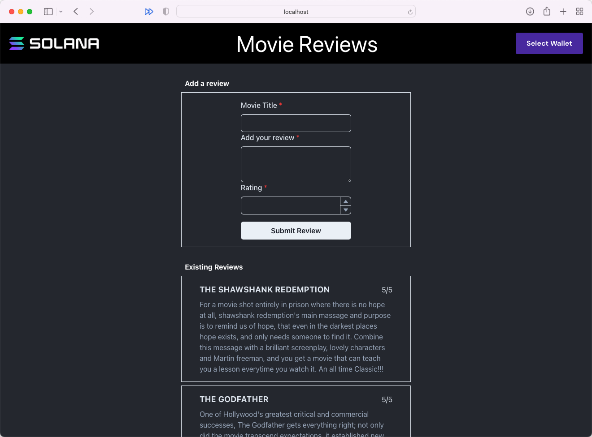

# Resumo

- Esta lição se aprofunda em algumas funcionalidades das chamadas RPC que usamos na lição de desserialização de dados de conta
- Para economizar tempo de computação, você pode buscar um grande número de contas sem seus dados, filtrando-as para retornar apenas um array de chaves públicas
- Uma vez que você tem uma lista filtrada de chaves públicas, você pode ordená-las e buscar os dados das contas a que pertencem

# Visão Geral

Você deve ter notado na última lição que, embora pudéssemos buscar e exibir uma lista de dados de conta, não tínhamos controle granular sobre quantas contas buscar ou sua ordem. Nesta lição, aprenderemos sobre algumas opções de configuração para a função `getProgramAccounts` que permitirão coisas como paginação, ordenação de contas e filtragem.

## Usando `dataSlice` para buscar apenas os dados necessários

Imagine o aplicativo de Avaliação de Filmes no qual trabalhamos em lições passadas tendo quatro milhões de avaliações de filmes e que a média de cada avaliação é de 500 bytes. Isso faria com que o download total de todas as contas de avaliação fosse mais de 2GB. Definitivamente, não é algo que você quer que seu frontend baixe toda vez que a página é atualizada.

Felizmente, a função `getProgramAccounts` que você usa para obter todas as contas aceita um objeto de configuração como argumento. Uma das opções de configuração é `dataSlice`, que permite fornecer duas coisas:

- `offset` - o deslocamento a partir do início do buffer de dados para iniciar o recorte
- `length` - o número de bytes a serem retornados, começando a partir do deslocamento fornecido

Quando você inclui um `dataSlice` no objeto de configuração, a função retornará apenas o subconjunto do buffer de dados que você especificou.

### Paginação de Contas

Uma área onde isso se torna útil é na paginação. Se você deseja ter uma lista que exibe todas as contas, mas existem tantas contas que você não deseja extrair todos os dados de uma vez, você pode buscar todas as contas, mas não buscar seus dados, usando um `dataSlice` de `{ offset: 0, length: 0 }`. Você pode, então, mapear o resultado para uma lista de chaves de conta cujos dados você pode buscar apenas quando necessário.

```tsx
const accountsWithoutData = await connection.getProgramAccounts(
  programId,
  {
    dataSlice: { offset: 0, length: 0 }
  }
)

const accountKeys = accountsWithoutData.map(account => account.pubkey)
```

Com esta lista de chaves, você pode então buscar dados da conta em “páginas” usando o método `getMultipleAccountsInfo`:

```tsx
const paginatedKeys = accountKeys.slice(0, 10)
const accountInfos = await connection.getMultipleAccountsInfo(paginatedKeys)
const deserializedObjects = accountInfos.map((accountInfo) => {
  // insira a lógica para desserializar os dados de accountInfo.data aqui
})
```

### Ordenação de Contas

A opção `dataSlice` também é útil quando você precisa ordenar uma lista de contas durante a paginação. Você ainda não quer buscar todos os dados de uma vez, mas precisa de todas as chaves e uma maneira de ordená-las antecipadamente. Neste caso, você precisa entender a estrutura dos dados da conta e configurar o corte de dados para ser apenas os dados que você precisa usar para ordenar.

Por exemplo, você pode ter uma conta que armazena informações de contato assim:

- `initialized` como um booleano
- `phoneNumber` como um inteiro sem sinal de 64 bits
- `firstName` como uma string
- `secondName` como uma string

Se você deseja ordenar todas as chaves de conta alfabeticamente com base no primeiro nome do usuário, você precisa descobrir o deslocamento onde o nome começa. O primeiro campo, `initialized`, ocupa o primeiro byte, então `phoneNumber` ocupa mais 8, então o campo `firstName` começa no deslocamento `1 + 8 = 9`. No entanto, campos de dados dinâmicos em Borsh usam os primeiros 4 bytes para registrar o comprimento dos dados, então podemos pular mais 4 bytes, fazendo com que o deslocamento seja 13.

Você então precisa determinar o comprimento para fazer o corte de dados. Como o comprimento é variável, não podemos saber com certeza antes de buscar os dados. Mas você pode escolher um comprimento que seja grande o suficiente para cobrir a maioria dos casos e curto o suficiente para não ser um grande fardo na busca. 15 bytes é suficiente para a maioria dos primeiros nomes, mas resultaria em um download suficientemente pequeno mesmo com um milhão de usuários.

Uma vez que você tenha buscado as contas com o corte de dados fornecido, você pode usar o método `sort` para ordenar o array antes de mapeá-lo para um array de chaves públicas.

```tsx
const accounts = await connection.getProgramAccounts(
  programId,
  {
    dataSlice: { offset: 13, length: 15 }
  }
)

  accounts.sort( (a, b) => {
    const lengthA = a.account.data.readUInt32LE(0)
    const lengthB = b.account.data.readUInt32LE(0)
    const dataA = a.account.data.slice(4, 4 + lengthA)
    const dataB = b.account.data.slice(4, 4 + lengthB)
    return dataA.compare(dataB)
  })

const accountKeys = accounts.map(account => account.pubkey)
```

Observe que no trecho acima não comparamos os dados conforme fornecidos. Isso acontece porque para tipos de tamanho dinâmico, como strings, o Borsh coloca um inteiro sem sinal de 32 bits (4 bytes) no início para indicar o comprimento dos dados que representam aquele campo. Então, para comparar os primeiros nomes diretamente, precisamos obter o comprimento de cada um, e então criar um corte de dados com um deslocamento de 4 bytes e o comprimento apropriado.

## Usando `filters` para recuperar apenas contas específicas

Limitar os dados recebidos por conta é ótimo, mas e se você quiser retornar apenas contas que correspondam a um critério específico, em vez de todas? É aí que entra a opção de configuração `filters`. Esta opção é um array que pode ter objetos correspondendo ao seguinte:

- `memcmp` - compara uma série de bytes fornecidos com os dados da conta do programa em um deslocamento específico. Campos:
    - `offset` - o número para deslocar nos dados da conta do programa antes de comparar os dados
    - `bytes` - uma string codificada em base-58 representando os dados a serem correspondidos; limitada a menos de 129 bytes
- `dataSize` - compara o comprimento dos dados da conta do programa com o tamanho de dados fornecido

Esses filtros permitem que você selecione contas com base na correspondência de dados e/ou no tamanho total dos dados.

Por exemplo, você poderia procurar por uma lista de contatos incluindo um filtro `memcmp`:

```tsx
async function fetchMatchingContactAccounts(connection: web3.Connection, search: string): Promise<(web3.AccountInfo<Buffer> | null)[]> {
  const accounts = await connection.getProgramAccounts(
    programId,
    {
      dataSlice: { offset: 0, length: 0 },
      filters: [
        {
          memcmp:
            {
              offset: 13,
              bytes: bs58.encode(Buffer.from(search))
            }
        }
      ]
    }
  )
}
```

Duas coisas a observar no exemplo acima:

1. Estamos definindo o deslocamento para 13 porque determinamos anteriormente que o deslocamento para `firstName` na estrutura de dados é 9 e queremos pular adicionalmente os primeiros 4 bytes que indicam o comprimento da string.
2. Estamos usando uma biblioteca de terceiros `bs58` para realizar a codificação base-58 no termo de busca. Você pode instalá-la usando `npm install bs58`.

# Demonstração

Lembra daquele aplicativo de Avaliação de Filmes em que trabalhamos nas duas últimas lições? Vamos incrementá-lo um pouco, paginando a lista de avaliações, ordenando as avaliações para que não fiquem tão aleatórias, e adicionando alguma funcionalidade básica de busca. Não se preocupe se você está apenas entrando nesta lição sem ter visto as anteriores - desde que você tenha o conhecimento prévio, você deve ser capaz de seguir a demonstração sem ter trabalhado neste projeto específico ainda.



### 1. Código inicial

Se você não concluiu a demonstração da última lição ou apenas quer ter certeza de que não perdeu nada, você pode baixar o [código inicial aqui](https://github.com/Unboxed-Software/solana-movie-frontend/tree/solution-deserialize-account-data).

O projeto é uma aplicação Next.js bastante simples. Ele inclui o `WalletContextProvider` que criamos na lição sobre Carteiras, um componente `Card` para exibir uma avaliação de filme, um componente `MovieList` que exibe avaliações em uma lista, um componente `Form` para enviar uma nova avaliação e um arquivo `Movie.ts` que contém uma definição de classe para um objeto `Movie`.

### 2. Adicionando paginação às avaliações

Primeiro, vamos criar um espaço para encapsular o código de busca de dados da conta. Crie um novo arquivo `MovieCoordinator.ts` e declare uma classe `MovieCoordinator`. Em seguida, mova a constante `MOVIE_REVIEW_PROGRAM_ID` de `MovieList` para este novo arquivo, pois moveremos todas as referências a ela.

```tsx
const MOVIE_REVIEW_PROGRAM_ID = 'CenYq6bDRB7p73EjsPEpiYN7uveyPUTdXkDkgUduboaN'

export class MovieCoordinator { }
```

Agora podemos usar o `MovieCoordinator` para criar uma implementação de paginação. Uma observação rápida antes de começarmos: esta será a implementação de paginação mais simples possível, para que possamos nos concentrar na parte complexa de interagir com as contas Solana. Você pode, e deve, fazer melhor para um aplicativo de produção.

Com isso esclarecido, vamos criar uma propriedade estática `accounts` do tipo `web3.PublicKey[]`, uma função estática `prefetchAccounts(connection: web3.Connection)`, e uma função estática `fetchPage(connection: web3.Connection, page: number, perPage: number): Promise<Movie[]>`. Você também precisará importar `@solana/web3.js` e `Movie`.

```tsx
import * as web3 from '@solana/web3.js'
import { Movie } from '../models/Movie'

const MOVIE_REVIEW_PROGRAM_ID = 'CenYq6bDRB7p73EjsPEpiYN7uveyPUTdXkDkgUduboaN'

export class MovieCoordinator {
  static accounts: web3.PublicKey[] = []

  static async prefetchAccounts(connection: web3.Connection) {

  }

  static async fetchPage(connection: web3.Connection, page: number, perPage: number): Promise<Movie[]> {

  }
}
```

A chave para a paginação é pré-carregar todas as contas sem dados. Vamos preencher o corpo da função `prefetchAccounts` para fazer isso e definir as chaves públicas recuperadas na propriedade estática `accounts`.

```tsx
static async prefetchAccounts(connection: web3.Connection) {
  const accounts = await connection.getProgramAccounts(
    new web3.PublicKey(MOVIE_REVIEW_PROGRAM_ID),
    {
      dataSlice: { offset: 0, length: 0 },
    }
  )

  this.accounts = accounts.map(account => account.pubkey)
}
```

Agora, vamos preencher o método `fetchPage`. Primeiro, se as contas ainda não foram pré-carregadas, precisamos fazer isso. Em seguida, podemos obter as chaves públicas das contas que correspondem à página solicitada e chamar `connection.getMultipleAccountsInfo`. Por fim, desserializamos os dados da conta e retornamos os objetos `Movie` correspondentes.

```tsx
static async fetchPage(connection: web3.Connection, page: number, perPage: number): Promise<Movie[]> {
  if (this.accounts.length === 0) {
    await this.prefetchAccounts(connection)
  }

  const paginatedPublicKeys = this.accounts.slice(
    (page - 1) * perPage,
    page * perPage,
  )

  if (paginatedPublicKeys.length === 0) {
    return []
  }

  const accounts = await connection.getMultipleAccountsInfo(paginatedPublicKeys)

  const movies = accounts.reduce((accum: Movie[], account) => {
    const movie = Movie.deserialize(account?.data)
    if (!movie) {
      return accum
    }

    return [...accum, movie]
  }, [])

  return movies
}
```

Feito isso, podemos reconfigurar a `MovieList` para usar esses métodos. Em `MovieList.tsx`, adicione `const [page, setPage] = useState(1)` perto das chamadas existentes de `useState`. Em seguida, atualize o `useEffect` para chamar `MovieCoordinator.fetchPage` em vez de buscar as contas diretamente.

```tsx
const connection = new web3.Connection(web3.clusterApiUrl('devnet'))
const [movies, setMovies] = useState<Movie[]>([])
const [page, setPage] = useState(1)

useEffect(() => {
  MovieCoordinator.fetchPage(
    connection,
    page,
    10
  ).then(setMovies)
}, [page, search])
```

Por fim, precisamos adicionar botões na parte inferior da lista para navegar entre as diferentes páginas:

```tsx
return (
  <div>
    {
      movies.map((movie, i) => <Card key={i} movie={movie} /> )
    }
    <Center>
      <HStack w='full' mt={2} mb={8} ml={4} mr={4}>
        {
          page > 1 && <Button onClick={() => setPage(page - 1)}>Previous</Button>
        }
        <Spacer />
        {
          MovieCoordinator.accounts.length > page * 2 &&
            <Button onClick={() => setPage(page + 1)}>Next</Button>
        }
      </HStack>
    </Center>
  </div>
)
```

Neste ponto, você deverá ser capaz de executar o projeto e clicar entre as páginas!

### 3. Ordenando as avaliações alfabeticamente por título

Se você olhar as avaliações, pode notar que elas não estão em nenhuma ordem específica. Podemos corrigir isso adicionando apenas dados suficientes em nossa fatia de dados para nos ajudar a fazer alguma ordenação. As várias propriedades no buffer de dados de avaliação de filme são dispostas da seguinte forma:

- `initialized` - inteiro sem sinal de 8 bits; 1 byte
- `rating` - inteiro sem sinal de 8 bits; 1 byte
- `title` - string; número desconhecido de bytes
- `description` - string; número desconhecido de bytes

Com base nisso, o deslocamento que precisamos fornecer para a fatia de dados para acessar `title` é 2. O comprimento, no entanto, é indeterminado, então podemos fornecer o que parece ser um comprimento razoável. Vou manter 18, pois isso cobrirá o comprimento da maioria dos títulos sem buscar muitos dados toda vez.

Depois de modificarmos a fatia de dados em `getProgramAccounts`, precisamos realmente ordenar o array retornado. Para fazer isso, precisamos comparar a parte do buffer de dados que corresponde ao `title`. Os primeiros 4 bytes de um campo dinâmico em Borsh são usados para armazenar o comprimento do campo em bytes. Portanto, em qualquer buffer `data` dado que seja fatiado da maneira que discutimos acima, a parte da string é `data.slice(4, 4 + data[0])`.

Agora que resolvemos isso, vamos modificar a implementação de `prefetchAccounts` em `MovieCoordinator`:

```tsx
static async prefetchAccounts(connection: web3.Connection, filters: AccountFilter[]) {
  const accounts = await connection.getProgramAccounts(
    new web3.PublicKey(MOVIE_REVIEW_PROGRAM_ID),
    {
      dataSlice: { offset: 2, length: 18 },
    }
  )

  accounts.sort( (a, b) => {
    const lengthA = a.account.data.readUInt32LE(0)
    const lengthB = b.account.data.readUInt32LE(0)
    const dataA = a.account.data.slice(4, 4 + lengthA)
    const dataB = b.account.data.slice(4, 4 + lengthB)
    return dataA.compare(dataB)
  })

  this.accounts = accounts.map(account => account.pubkey)
}
```

E assim, você deve ser capaz de executar o aplicativo e ver a lista de avaliações de filmes ordenada alfabeticamente.

### 4. Adicionando capacidade de pesquisa

A última coisa que faremos para melhorar este aplicativo é adicionar alguma capacidade de pesquisa básica. Vamos adicionar um parâmetro `search` a `prefetchAccounts` e reconfigurar o corpo da função para usá-lo.

Podemos usar a propriedade `filters` do parâmetro `config` de `getProgramAccounts` para filtrar contas por dados específicos. O deslocamento para os campos `title` é 2, mas os primeiros 4 bytes são o comprimento do título, então o deslocamento real para a string em si é 6. Lembre-se de que os bytes precisam ser codificados em base 58, então vamos instalar e importar `bs58`.

```tsx
import bs58 from 'bs58'

...

static async prefetchAccounts(connection: web3.Connection, search: string) {
  const accounts = await connection.getProgramAccounts(
    new web3.PublicKey(MOVIE_REVIEW_PROGRAM_ID),
    {
      dataSlice: { offset: 2, length: 18 },
      filters: search === '' ? [] : [
        {
          memcmp:
            {
              offset: 6,
              bytes: bs58.encode(Buffer.from(search))
            }
        }
      ]
    }
  )

  accounts.sort( (a, b) => {
    const lengthA = a.account.data.readUInt32LE(0)
    const lengthB = b.account.data.readUInt32LE(0)
    const dataA = a.account.data.slice(4, 4 + lengthA)
    const dataB = b.account.data.slice(4, 4 + lengthB)
    return dataA.compare(dataB)
  })

  this.accounts = accounts.map(account => account.pubkey)
}
```

Agora, adicione um parâmetro `search` a `fetchPage` e atualize sua chamada para `prefetchAccounts` para passá-lo adiante. Também precisaremos adicionar um parâmetro booleano `reload` a `fetchPage` para que possamos forçar uma atualização do pré-carregamento das contas sempre que o valor da busca mudar.

```tsx
static async fetchPage(connection: web3.Connection, page: number, perPage: number, search: string, reload: boolean = false): Promise<Movie[]> {
  if (this.accounts.length === 0 || reload) {
    await this.prefetchAccounts(connection, search)
  }

  const paginatedPublicKeys = this.accounts.slice(
    (page - 1) * perPage,
    page * perPage,
  )

  if (paginatedPublicKeys.length === 0) {
    return []
  }

  const accounts = await connection.getMultipleAccountsInfo(paginatedPublicKeys)

  const movies = accounts.reduce((accum: Movie[], account) => {
    const movie = Movie.deserialize(account?.data)
    if (!movie) {
      return accum
    }

    return [...accum, movie]
  }, [])

  return movies
}
```

Com isso implementado, vamos atualizar o código em `MovieList` para chamar isso corretamente.

Primeiro, adicione `const [search, setSearch] = useState('')` perto das outras chamadas de `useState`. Em seguida, atualize a chamada para `MovieCoordinator.fetchPage` no `useEffect` para passar o parâmetro `search` e recarregar quando `search !== ''`.

```tsx
const connection = new web3.Connection(web3.clusterApiUrl('devnet'))
const [movies, setMovies] = useState<Movie[]>([])
const [page, setPage] = useState(1)
const [search, setSearch] = useState('')

useEffect(() => {
  MovieCoordinator.fetchPage(
    connection,
    page,
    2,
    search,
    search !== ''
  ).then(setMovies)
}, [page, search])
```

Por fim, adicione uma barra de pesquisa que definirá o valor de `search`:

```tsx
return (
  <div>
    <Center>
      <Input
        id='search'
        color='gray.400'
        onChange={event => setSearch(event.currentTarget.value)}
        placeholder='Search'
        w='97%'
        mt={2}
        mb={2}
      />
    </Center>

  ...

  </div>
)
```

E é isso! O aplicativo agora possui avaliações ordenadas, paginação e pesquisa.

Foi bastante conteúdo para absorver, mas você conseguiu. Se precisar de mais tempo com os conceitos, sinta-se à vontade para reler as seções que foram mais desafiadoras para você e/ou dar uma olhada no [código de solução](https://github.com/Unboxed-Software/solana-movie-frontend/tree/solution-paging-account-data).

# Desafio

Agora é sua vez de tentar fazer isso por conta própria. Usando o aplicativo Student Intros da última lição, adicione paginação, ordenação alfabética por nome e pesquisa por nome.


1. Você pode construir isso do zero ou baixar o [código inicial aqui](https://github.com/Unboxed-Software/solana-student-intros-frontend/tree/solution-deserialize-account-data).
2. Adicione paginação ao projeto pré-carregando contas sem dados e, em seguida, buscando os dados da conta para cada conta quando necessário.
3. Ordene as contas exibidas no aplicativo alfabeticamente por nome.
4. Adicione a capacidade de pesquisar introduções pelo nome do aluno.

Isso é desafiador. Se você tiver dúvidas, sinta-se à vontade para consultar o [código de solução](https://github.com/Unboxed-Software/solana-student-intros-frontend/tree/solution-paging-account-data). Com isso, você completa o Módulo 1! Como foi sua experiência? Sinta-se à vontade para [compartilhar um feedback rápido](https://airtable.com/shrOsyopqYlzvmXSC?prefill_Module=Module%201), para que possamos continuar a melhorar o curso!

Como sempre, seja criativo com esses desafios e leve-os além das instruções, se desejar! 
