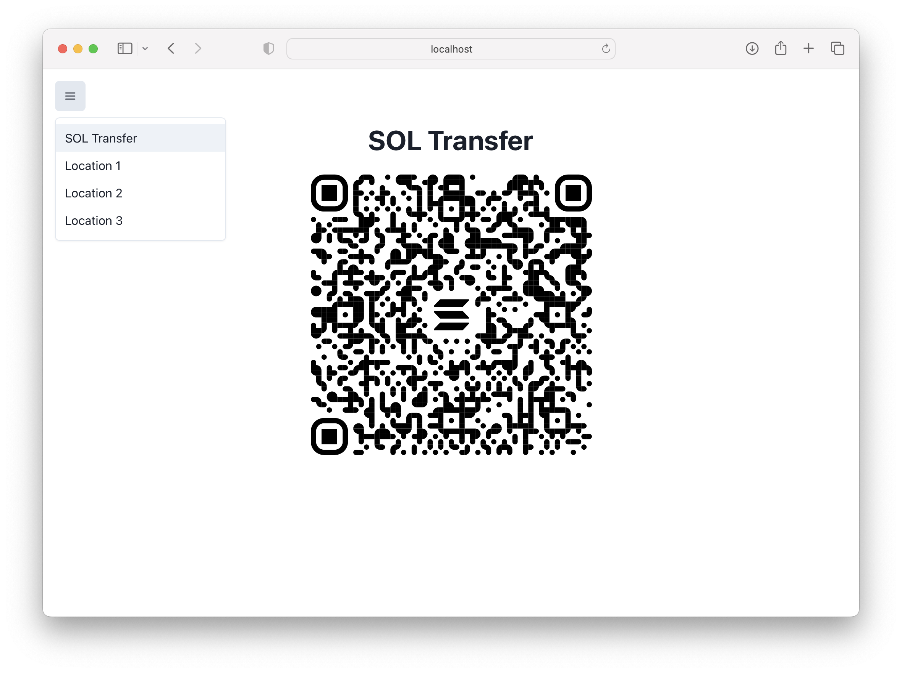

# Resumo

- **Solana Pay** é uma especificação para codificar solicitações de transações da Solana dentro de URLs, possibilitando solicitações de transações padronizadas em diferentes apps e carteiras Solana
- **Assinatura parcial** de transações permite a criação de transações que requerem múltiplas assinaturas antes de serem enviadas para a rede
- **Controle de transações** envolve implementar regras que determinam se certas transações são permitidas ou não, baseadas em condições específicas ou na presença de dados específicos na transação

# Visão Geral

A comunidade Solana está continuamente melhorando e expandindo a funcionalidade da rede. Mas isso nem sempre significa desenvolver novas tecnologias. Às vezes, significa aproveitar os recursos existentes da rede de maneiras novas e interessantes.

Solana Pay é um ótimo exemplo disso. Ao invés de adicionar novas funcionalidades à rede, o Solana Pay utiliza os recursos de assinatura existentes da rede de uma maneira única para permitir que comerciantes e aplicativos solicitem transações e construam mecanismos de controle para tipos específicos de transações.

Ao longo desta lição, você aprenderá a usar o Solana Pay para criar solicitações de transferência e transação, codificar essas solicitações como um código QR, assinar parcialmente transações e controlar transações com base em condições que você escolher. Mais do que isso, esperamos que você veja isso como um exemplo de aproveitar recursos existentes de maneiras novas e interessantes, usando-o como uma plataforma de lançamento para suas próprias interações únicas com a rede do lado do cliente.

## Solana Pay

A [especificação Solana Pay](https://docs.solanapay.com/spec) é um conjunto de padrões que permitem aos usuários solicitar pagamentos e iniciar transações usando URLs de uma forma uniforme em vários aplicativos e carteiras Solana.

URLs de solicitação são prefixados com `solana:` para que plataformas possam direcionar o link para o aplicativo apropriado. Por exemplo, em dispositivos móveis, um URL que começa com `solana:` será direcionado para aplicativos de carteira que suportam a especificação Solana Pay. A partir daí, a carteira pode usar o restante do URL para lidar adequadamente com a solicitação.

Existem dois tipos de solicitações definidas pela especificação Solana Pay:

1. Solicitação de Transferência: usada para transferências simples de SOL ou Tokens SPL
2. Solicitação de Transação: usada para solicitar qualquer tipo de transação Solana

### Solicitações de transferência

A especificação de solicitação de transferência descreve uma solicitação não interativa para transferência de SOL ou token SPL. URLs de solicitação de transferência seguem o formato `solana:<destinatário>?<parâmetros-de-consulta-opcionais>`.

O valor de `destinatário` é obrigatório e deve ser uma chave pública codificada em base58 da conta da qual se está solicitando uma transferência. Além disso, os seguintes parâmetros de consulta opcionais são suportados:

- `amount` - um valor inteiro ou decimal não negativo indicando a quantidade de tokens a serem transferidos
- `spl-token` - uma chave pública codificada em base58 de uma conta de cunhagem de Token SPL, se a transferência for de um Token SPL e não de SOL
- `reference` - valores de referência opcionais como arrays de 32 bytes codificados em base58. Isso pode ser usado por um cliente para identificar a transação na rede, já que o cliente não terá a assinatura da transação.
- `label` - uma string UTF-8 codificada em URL que descreve a origem da solicitação de transferência
- `message` - uma string UTF-8 codificada em URL que descreve a natureza da solicitação de transferência
- `memo` - uma string UTF-8 codificada em URL que deve ser incluída na instrução de memo SPL na transação de pagamento

Como exemplo, aqui está um URL descrevendo uma solicitação de transferência de 1 SOL:

```text
solana:mvines9iiHiQTysrwkJjGf2gb9Ex9jXJX8ns3qwf2kN?amount=1&label=Michael&message=Thanks%20for%20all%20the%20fish&memo=OrderId12345
```

E aqui está um URL descrevendo uma solicitação de transferência de 0,1 USDC:

```text
solana:mvines9iiHiQTysrwkJjGf2gb9Ex9jXJX8ns3qwf2kN?amount=0.01&spl-token=EPjFWdd5AufqSSqeM2qN1xzybapC8G4wEGGkZwyTDt1v
```

### Solicitações de transação

A solicitação de transação do Solana Pay é semelhante à solicitação de transferência, pois é simplesmente um URL que pode ser consumido por uma carteira compatível. No entanto, essa solicitação é interativa e o formato é mais aberto:

```text
solana:<link>
```

O valor de `link` deve ser um URL para o qual a carteira consumidora pode fazer uma requisição HTTP. Ao invés de conter todas as informações necessárias para uma transação, uma solicitação de transação usa esse URL para buscar a transação que deve ser apresentada ao usuário.

Quando uma carteira recebe um URL de Solicitação de Transação, quatro coisas acontecem:

1. A carteira envia uma solicitação GET para o aplicativo no URL `link` fornecido para recuperar um rótulo e uma imagem de ícone para exibir ao usuário.
2. A carteira então envia uma solicitação POST com a chave pública do usuário final.
3. Usando a chave pública do usuário final (e quaisquer informações adicionais fornecidas em `link`), o aplicativo cria a transação e responde com uma transação serializada codificada em base64.
4. A carteira decodifica e desserializa a transação, permitindo que o usuário assine e envie a transação.

Dado que as solicitações de transação são mais complexas do que as solicitações de transferência, o restante desta lição focará na criação de solicitações de transação.

## Criando uma solicitação de transação

### Definindo o ponto de extremidade da API

A principal coisa que você, o desenvolvedor, precisa fazer para que o fluxo de solicitação de transação funcione é configurar um ponto de extremidade REST de API no URL que você planeja incluir na solicitação de transação. Nesta lição, usaremos as [Rotas de API do Next.js](https://nextjs.org/docs/api-routes/introduction) para nossos pontos de extremidades, mas fique à vontade para usar a pilha e as ferramentas com as quais você está mais confortável.

No Next.js, você faz isso adicionando um arquivo à pasta `pages/api` e exportando uma função que lida com a solicitação e a resposta.

```typescript
import { NextApiRequest, NextApiResponse } from "next"

export default async function handler(
    req: NextApiRequest,
    res: NextApiResponse,
) {
    // Lidar com a solicitação
}
```

### Lidando com uma solicitação GET

A carteira que consumir o URL da sua solicitação de transação primeiro emitirá uma requisição GET para este ponto de extremidade. Você vai querer que seu ponto de extremidade retorne um objeto JSON com dois campos:

1. `label` - uma string que descreve a origem da solicitação de transação
2. `icon` - um URL para uma imagem que pode ser exibida ao usuário

Continuando com o ponto de extremidade vazio de antes, nosso código pode ficar assim:

```typescript
import { NextApiRequest, NextApiResponse } from "next"

export default async function handler(
    req: NextApiRequest,
    res: NextApiResponse,
) {
    if (req.method === "GET") {
        return get(res)
    } else {
        return res.status(405).json({ error: "Método não permitido" })
    }
}

function get(res: NextApiResponse) {
    res.status(200).json({
        label: "Nome da Loja",
        icon: "https://solana.com/src/img/branding/solanaLogoMark.svg",
    });
}
```

Quando a carteira faz uma requisição GET para o ponto de extremidade da API, a função `get` é chamada, retornando uma resposta com um código de status 200 e o objeto JSON contendo `label` e `icon`.

### Lidando com uma requisição POST e criando a transação

Após emitir uma requisição GET, a carteira emitirá uma requisição POST para o mesmo URL. Seu ponto de extremidade deve esperar que o `corpo` da requisição POST contenha um objeto JSON com um campo `account` fornecido pela carteira solicitante. O valor de `account` será uma string representando a chave pública do usuário final.

Com essa informação e quaisquer parâmetros adicionais fornecidos, você pode criar a transação e devolvê-la à carteira para assinatura ao:

1. Conectar à rede Solana e obter o último `blockhash`.
2. Criar uma nova transação usando o `blockhash`.
3. Adicionar instruções à transação.
4. Serializar a transação e devolvê-la em um objeto `PostResponse` junto com uma mensagem para o usuário.

```typescript
import { NextApiRequest, NextApiResponse } from "next"

export default async function handler(
    req: NextApiRequest,
    res: NextApiResponse,
) {
    if (req.method === "GET") {
        return get(res)
    } else if (req.method === "POST") {
        return post(req, res)
    } else {
        return res.status(405).json({ error: "Método não permitido" })
    }
}

function get(res: NextApiResponse) {
    res.status(200).json({
        label: "Nome da Loja",
        icon: "https://solana.com/src/img/branding/solanaLogoMark.svg",
    });
}
async function post(
    req: PublicKey,
    res: PublicKey,
) {
    const { account, reference } = req.body

    const connection = new Connection(clusterApiUrl("devnet"));

    const { blockhash } = await connection.getLatestBlockhash();

    const transaction = new Transaction({
        recentBlockhash: blockhash,
        feePayer: account,
    });

    const instruction = SystemProgram.transfer({
        fromPubkey: account,
        toPubkey: Keypair.generate().publicKey,
        lamports: 0.001 * LAMPORTS_PER_SOL,
    });

    transaction.add(instruction);

    transaction.keys.push({
        pubkey: reference,
        isSigner: false,
        isWritable: false,
    })

    const serializedTransaction = transaction.serialize({
        requireAllSignatures: false,
    });
    const base64 = serializedTransaction.toString("base64");

    const message = "Transferência simples de 0,001 SOL";

    res.send(200).json({
        transaction: base64,
        message,
    })
}
```

Não há nada fora do comum aqui. É a mesma construção de transação que você usaria em uma aplicação cliente padrão. A única diferença é que, em vez de assinar e enviar para a rede, você envia a transação como uma string codificada em base64 na resposta HTTP. A carteira que emitiu a solicitação pode então apresentar a transação ao usuário para assinatura.

### Confirmando a transação

Você pode ter notado que o exemplo anterior presumiu que um `reference` foi fornecido como um parâmetro de consulta. Embora este *não* seja um valor fornecido pela carteira solicitante, ele *é* útil para configurar seu URL inicial de solicitação de transação para conter esse parâmetro de consulta.

Como seu aplicativo não é o que submete uma transação à rede, seu código não terá acesso a uma assinatura de transação. Seria dessa forma que seu aplicativo normalmente encontraria uma transação na rede e veria seu status.

Para contornar isso, você pode incluir um valor `reference` como um parâmetro de consulta para cada solicitação de transação. Esse valor deve ser um array de 32 bytes codificado em base58 que pode ser incluído como uma chave não signatária na transação. Isso permite que seu aplicativo use o método RPC `getSignaturesForAddress` para localizar a transação. Seu aplicativo pode então adaptar sua interface de usuário de acordo com o status de uma transação.

Se você usar a biblioteca `@solana/pay`, pode usar a função auxiliar `findReference` em vez de usar `getSignaturesForAddress` diretamente.

## Transações com controle de acesso

Mencionamos anteriormente como o Solana Pay é um exemplo de capacidade de fazer coisas novas e legais com a rede, sendo criativo com as funcionalidade existentes. Outro pequeno exemplo de como fazer isso dentro das capacidades do Solana Pay é disponibilizar certas transações apenas quando certas condições forem atendidas.

Como você controla o ponto de extremidade que cria a transação, você pode determinar quais critérios devem ser atendidos antes que uma transação seja criada. Por exemplo, você pode usar o campo `account` fornecido na requisição POST para verificar se o usuário final possui um NFT de uma coleção específica ou se aquela chave pública está em uma lista predeterminada de contas que podem fazer essa transação específica.

```typescript
// recuperar array de NFTs pertencentes à carteira fornecida
const nfts = await metaplex.nfts().findAllByOwner({ owner: account }).run();

// iterar sobre o array de NFTs
for (let i = 0; i < nfts.length; i++) {
    // verificar se o NFT atual tem um campo de coleção com o valor desejado
    if (nfts[i].collection?.address.toString() == collection.toString()) {
        // criar a transação
    } else {
        // retornar um erro
    }
}
```

### Assinatura Parcial

Se você deseja que certas transações estejam por trás de algum tipo de mecanismo de controle, essa funcionalidade também terá que ser aplicada na cadeia de blocos. Retornar um erro do seu ponto de extremidade Solana Pay torna mais difícil para os usuários finais realizarem a transação, mas eles ainda poderiam criá-la manualmente.

Isso significa que a(s) instrução(ões) chamada(s) deve(m) requerer algum tipo de assinatura "admin" que apenas seu aplicativo pode fornecer. Ao fazer isso, no entanto, você terá feito com que nossos exemplos anteriores não funcionem. A transação é criada e enviada à carteira solicitante para a assinatura do usuário final, mas a transação enviada falhará sem a assinatura do admin.

Felizmente, a Solana permite a composição de assinaturas com assinatura parcial.

Assinar parcialmente uma transação multiassinatura permite que os signatários adicionem sua assinatura antes de a transação ser transmitida na rede. Isso pode ser útil em várias situações, incluindo:

- Aprovar transações que requerem a assinatura de várias partes, como um comerciante e um comprador que precisam confirmar os detalhes de um pagamento.
- Invocar programas personalizados que requerem as assinaturas de um usuário e um administrador. Isso pode ajudar a limitar o acesso às instruções do programa e garantir que apenas as partes autorizadas possam executá-las.

```typescript
const { blockhash, lastValidBlockHeight } = await connection.getLatestBlockhash()

const transaction = new Transaction({
  feePayer: account,
  blockhash,
  lastValidBlockHeight,
})

...

transaction.partialSign(adminKeypair)
```

A função `partialSign` é usada para adicionar uma assinatura a uma transação sem substituir quaisquer assinaturas anteriores na transação. Se você estiver criando uma transação com vários signatários, é importante lembrar que se você não especificar um `feePayer` para a transação, o primeiro signatário será usado como pagador da taxa da transação. Para evitar qualquer confusão ou comportamento inesperado, certifique-se de definir explicitamente o pagador da taxa quando necessário.

No nosso exemplo de permitir uma solicitação de transação somente quando o usuário final possui um NFT específico, você simplesmente adicionaria sua assinatura de admin à transação usando `partialSign` antes de codificar a transação como uma string codificada em base64 e emitir a resposta HTTP.

## Códigos QR do Solana Pay

Uma das características de destaque do Solana Pay é sua fácil integração com códigos QR. Como as solicitações de transferência e transação são simplesmente URLs, você pode incorporá-las em códigos QR disponibilizados em seu aplicativo ou em outros lugares.

A biblioteca `@solana/pay` simplifica isso com a função auxiliar fornecida, `createQR`. Esta função precisa que você forneça o seguinte:

- `url` - o URL da solicitação de transação.
- `size` (opcional) - a largura e altura do código QR em pixels. Padrão é 512.
- `background` (opcional) - a cor de fundo. Padrão é branco.
- `color` (opcional) - a cor do primeiro plano. Padrão é preto.

```typescript
const qr = createQR(url, 400, 'transparent')
```

# Demonstração

Agora que você tem uma compreensão conceitual do Solana Pay, vamos colocar tudo em prática. Usaremos o Solana Pay para gerar uma série de códigos QR para uma caça ao tesouro. Os participantes devem visitar cada local da caça ao tesouro em ordem. Em cada local, eles usarão o código QR fornecido para enviar a transação apropriada ao contrato inteligente da caça ao tesouro, que acompanha o progresso do usuário.

### 1. Código inicial

Para começar, baixe o código inicial na branch `starter` deste [repositório](https://github.com/Unboxed-Software/solana-scavenger-hunt-app/tree/starter). O código inicial é um aplicativo Next.js que exibe um código QR do Solana Pay. Observe que a barra de menu permite alternar entre diferentes códigos QR. A opção padrão é uma simples transferência de SOL para fins ilustrativos. Ao longo do tempo, vamos adicionando funcionalidades às opções de localização na barra de menu.



Para fazer isso, criaremos um novo ponto de extremidade para uma solicitação de transação que cria uma transação para invocar um programa Anchor na Devnet. Este programa foi feito especificamente para este aplicativo de "caça ao tesouro" e possui duas instruções: `initialize` e `check_in`. A instrução `initialize` é usada para configurar o estado do usuário, enquanto a instrução `check_in` é usada para registrar um check-in em um local da caça ao tesouro. Não faremos alterações no programa nesta demonstração, mas sinta-se à vontade para conferir o [código fonte](https://github.com/Unboxed-Software/anchor-scavenger-hunt) se quiser se familiarizar com o programa.

Antes de prosseguir, certifique-se de estar familiarizado com o código inicial do aplicativo da Caça ao Tesouro. Observar `pages/index.tsx`, `utils/createQrCode/simpleTransfer` e `/utils/checkTransaction` permitirá que você veja como a solicitação de transação para enviar SOL é configurada. Seguiremos um padrão semelhante para a solicitação de transação para fazer check-in em um local.

### 2. Configuração

Antes de prosseguirmos, vamos garantir que você possa executar o aplicativo localmente. Comece renomeando o arquivo `.env.example` no diretório frontend para `.env`. Este arquivo contém um par de chaves que será usado nesta demonstração para assinar parcialmente transações.

Em seguida, instale as dependências com `yarn`, depois use `yarn dev` e abra seu navegador em `localhost:3000` (ou a porta indicada no console se 3000 já estiver em uso).

Agora, se você tentar escanear o código QR mostrado na página do seu dispositivo móvel, você receberá um erro. Isso porque o código QR está configurado para enviar você para o `localhost:3000` do seu computador, que não é um endereço que seu telefone pode acessar. Além disso, o Solana Pay precisa usar um URL HTTPS para funcionar.

Para contornar isso, você pode usar o [ngrok](https://ngrok.com/). Você precisará instalá-lo se nunca o usou antes. Depois de instalado, execute o seguinte comando no seu terminal, substituindo `3000` pela porta que você está usando para este projeto:

```bash
ngrok http 3000
```

Isso fornecerá um URL exclusivo que você pode usar para acessar seu servidor local remotamente. A saída será semelhante a esta:

```bash
Session Status                online
Account                       your_email@gmail.com (Plan: Free)
Update                        update available (version 3.1.0, Ctrl-U to update)
Version                       3.0.6
Region                        United States (us)
Latency                       45ms
Web Interface                 http://127.0.0.1:4040
Forwarding                    https://7761-24-28-107-82.ngrok.io -> http://localhost:3000
```

Agora, abra o URL HTTPS do ngrok mostrado no seu console no navegador (por exemplo, https://7761-24-28-107-82.ngrok.io). Isso permitirá que você escaneie códigos QR do seu dispositivo móvel enquanto testa localmente.

No momento da escrita, esta demonstração funciona melhor com o Solflare. Algumas carteiras exibirão uma mensagem de aviso incorreta ao escanear um código QR do Solana Pay. Independentemente da carteira que você usar, certifique-se de mudar para devnet na carteira. Em seguida, escaneie o código QR na página inicial rotulado “Transferência de SOL”. Este código QR é uma implementação de referência para uma solicitação de transação que realiza uma simples transferência de SOL. Ele também chama a função `requestAirdrop` para adicionar fundos à sua carteira de dispositivo móvel com SOL da Devnet, já que a maioria das pessoas não tem SOL da Devnet disponível para testes.

Se você conseguiu executar com sucesso a transação usando o código QR, está pronto para prosseguir!

### 3. Criando um ponto de extremidade de solicitação de transação para check-in

Agora que você está pronto para começar, é hora de criar um ponto de extremidade que suporte solicitações de transação para check-in de localização usando o programa Caça ao Tesouro.

Comece abrindo o arquivo em `pages/api/checkIn.ts`. Observe que ele tem uma função auxiliar para inicializar `eventOrganizer` a partir de uma variável de ambiente de chave secreta. A primeira coisa que faremos neste arquivo é o seguinte:

1. Exportar uma função `handler` para lidar com uma solicitação HTTP arbitrária
2. Adicionar funções `get` e `post` para lidar com esses métodos HTTP
3. Adicionar lógica ao corpo da função `handler` para chamar `get`, `post`, ou retornar um erro 405 baseado no método da solicitação HTTP

```typescript
import { NextApiRequest, NextApiResponse } from "next"

export default async function handler(
    req: NextApiRequest,
    res: NextApiResponse
) {
    if (req.method === "GET") {
        return get(res)
    } else if (req.method === "POST") {
        return await post(req, res)
    } else {
        return res.status(405).json({ error: "Método não permitido" })
    }
}

function get(res: NextApiResponse) {}

async function post(req: NextApiRequest, res: NextApiResponse) {}
```

### 4. Atualizar a função `get`

Lembre-se, a primeira solicitação de uma carteira será uma requisição GET esperando que o ponto de extremidade retorne um rótulo e um ícone. Atualize a função `get` para enviar uma resposta com um rótulo "Caça ao Tesouro!" e um ícone do logo Solana.

```jsx
function get(res: NextApiResponse) {
    res.status(200).json({
        label: "Caça ao Tesouro!",
        icon: "https://solana.com/src/img/branding/solanaLogoMark.svg",
    });
}
```

### 5. Atualizar a função `post`

Após a requisição GET, uma carteira emitirá uma requisição POST para o ponto de extremidade. O `corpo` da requisição conterá um objeto JSON com um campo `account` representando a chave pública do usuário final.

Além disso, os parâmetros da consulta conterão o que você codificou no código QR. Se você der uma olhada em `utils/createQrCode/checkIn.ts`, notará que este aplicativo específico inclui parâmetros para `reference` e `id` da seguinte forma:

1. `reference` - uma chave pública gerada aleatoriamente, usada para identificar a transação
2. `id` - o id da localização como um inteiro

Vá em frente e atualize a função `post` para extrair `account`, `reference` e `id` da solicitação. Você deve responder com um erro se algum desses estiver faltando.

Em seguida, adicione uma declaração `try catch` onde o bloco `catch` responde com um erro e o bloco `try` chama uma nova função `buildTransaction`. Se `buildTransaction` for bem-sucedido, responda com um 200 e um objeto JSON com a transação e uma mensagem declarando que o usuário encontrou a localização indicada. Não se preocupe com a lógica para a função `buildTransaction` por enquanto - faremos isso a seguir.

Observe que você também precisará importar `PublicKey` e `Transaction` de `@solana/web3.js` aqui.

```typescript
import { NextApiRequest, NextApiResponse } from "next"
import { PublicKey, Transaction } from "@solana/web3.js"
...

async function post(req: NextApiRequest, res: NextApiResponse) {
    const { account } = req.body
    const { reference, id } = req.query

    if (!account || !reference || !id) {
        res.status(400).json({ error: "Parâmetro(s) obrigatório(s) ausente(s)" })
        return
    }

    try {
        const transaction = await buildTransaction(
            new PublicKey(account),
            new PublicKey(reference),
            id.toString()
        )

        res.status(200).json({
            transaction: transaction,
            message: `Você encontrou a localização ${id}!`,
        })
    } catch (err) {
        console.log(err)
        let error = err as any
        if (error.message) {
            res.status(200).json({ transaction: "", message: error.message })
        } else {
            res.status(500).json({ error: "erro ao criar transação" })
        }
    }
}

async function buildTransaction(
    account: PublicKey,
    reference: PublicKey,
    id: string
): Promise<string> {
    return new Transaction()
}
```

### 6. Implementando a função `buildTransaction`

Em seguida, vamos implementar a função `buildTransaction`. Ela deve construir, assinar parcialmente e retornar a transação de check-in. A sequência de itens que ela precisa realizar é:

1. Buscar o estado do usuário.
2. Usar a função auxiliar `locationAtIndex` e o id da localização para obter um objeto Location.
3. Verificar se o usuário está no local correto.
4. Obter o hash de bloco atual e a última altura de bloco válida da conexão.
5. Criar um novo objeto de transação.
6. Adicionar uma instrução de inicialização à transação se o estado do usuário não existir.
7. Adicionar uma instrução de check-in à transação.
8. Adicionar a chave pública `reference` à instrução de check-in.
9. Assinar parcialmente a transação com o par de chaves do organizador do evento.
10. Serializar a transação com codificação base64 e retornar a transação.

Embora cada um desses passos seja direto, são muitos passos. Para simplificar a função, vamos criar funções auxiliares vazias que preencheremos mais tarde para os passos 1, 3, 6 e 7-8. Vamos chamá-las de `fetchUserState`, `verifyCorrectLocation`, `createInitUserInstruction` e `createCheckInInstruction`, respectivamente.

Também adicionaremos as seguintes importações:

```typescript
import { NextApiRequest, NextApiResponse } from "next"
import { PublicKey, Transaction, TransactionInstruction } from "@solana/web3.js"
import { locationAtIndex, Location, locations } from "../../utils/locations"
import { connection, gameId, program } from "../../utils/programSetup"
```

Usando as funções auxiliares vazias e as novas importações, podemos preencher a função `buildTransaction`:

```typescript
async function buildTransaction(
    account: PublicKey,
    reference: PublicKey,
    id: string
): Promise<string> {
    const userState = await fetchUserState(account)

    const currentLocation = locationAtIndex(new Number(id).valueOf())

    if (!currentLocation) {
        throw { message: "ID de localização inválido" }
    }

    if (!verifyCorrectLocation(userState, currentLocation)) {
        throw { message: "Você deve visitar cada localização em ordem!" }
    }

    const { blockhash, lastValidBlockHeight } =
        await connection.getLatestBlockhash()

    const transaction = new Transaction({
        feePayer: account,
        blockhash,
        lastValidBlockHeight,
    })

    if (!userState) {
        transaction.add(await createInitUserInstruction(account))
    }

    transaction.add(
        await createCheckInInstruction(account, reference, currentLocation)
    )

    transaction.partialSign(eventOrganizer)

    const serializedTransaction = transaction.serialize({
        requireAllSignatures: false,
    })

    const base64 = serializedTransaction.toString("base64")

    return base64
}

interface UserState {
    user: PublicKey
    gameId: PublicKey
    lastLocation: PublicKey
}

async function fetchUserState(account: PublicKey): Promise<UserState | null> {
    return null
}

function verifyCorrectLocation(
    userState: UserState | null,
    currentLocation: Location
): boolean {
    return false
}

async function createInitUserInstruction(
    account: PublicKey
): Promise<TransactionInstruction> {
    throw ""
}

async function createCheckInInstruction(
    account: PublicKey,
    reference: PublicKey,
    location: Location
): Promise<TransactionInstruction> {
    throw ""
}
```

### 7. Implementando a função `fetchUserState`

Com a função `buildTransaction` finalizada, podemos começar a implementar as funções auxiliares vazias que criamos, começando com `fetchUserState`. Esta função usa o `gameId` e a `account` do usuário para derivar o PDA do estado do usuário e, em seguida, busca essa conta, retornando `null` se ela não existir.

```typescript
async function fetchUserState(account: PublicKey): Promise<UserState | null> {
    const userStatePDA = PublicKey.findProgramAddressSync(
        [gameId.toBuffer(), account.toBuffer()],
        program.programId
    )[0]

    try {
        return await program.account.userState.fetch(userStatePDA)
    } catch {
        return null
    }
}
```

### 8. Implementando a função `verifyCorrectLocation`

Em seguida, vamos implementar a função auxiliar `verifyCorrectLocation`. Esta função é usada para verificar se um usuário está na localização correta em um jogo de caça ao tesouro.

Se `userState` for `null`, isso significa que o usuário deve visitar a primeira localização. Caso contrário, o usuário deve visitar a localização cujo índice é 1 a mais do que seu último local visitado.

Se essas condições forem satisfeitas, a função retornará `true`. Caso contrário, retornará `false`.

```typescript
function verifyCorrectLocation(
    userState: UserState | null,
    currentLocation: Location
): boolean {
    if (!userState) {
        return currentLocation.index === 1
    }

    const lastLocation = locations.find(
        (location) => location.key.toString() === userState.lastLocation.toString()
    )

    if (!lastLocation || currentLocation.index !== lastLocation.index + 1) {
        return false
    } else {
        return true
    }
}
```

### 9. Implementando as funções de criação de instruções

Por último, vamos implementar `createInitUserInstruction` e `createCheckInInstruction`. Estas funções podem usar o Anchor para gerar e retornar as instruções correspondentes. A única ressalva é que `createCheckInInstruction` precisa adicionar `reference` à lista de chaves das instruções.

```typescript
async function createInitUserInstruction(
    account: PublicKey
): Promise<TransactionInstruction> {
    const initializeInstruction = await program.methods
        .initialize(gameId)
        .accounts({ user: account })
        .instruction()

    return initializeInstruction
}

async function createCheckInInstruction(
    account: PublicKey,
    reference: PublicKey,
    location: Location
): Promise<TransactionInstruction> {
    const checkInInstruction = await program.methods
        .checkIn(gameId, location.key)
        .accounts({
            user: account,
            eventOrganizer: eventOrganizer.publicKey,
        })
        .instruction()

    checkInInstruction.keys.push({
        pubkey: reference,
        isSigner: false,
        isWritable: false,
    })

    return checkInInstruction
}
```

### 10. Testando o aplicativo

Neste ponto, seu aplicativo deve estar funcionando! Vá em frente e teste-o usando sua carteira móvel. Comece escaneando o código QR para `Localização 1`. Lembre-se de garantir que seu frontend esteja rodando usando o URL ngrok, e não `localhost`.

Após escanear o código QR, você deve ver uma mensagem indicando que está na localização 1. A partir daí, escaneie o código QR na página `Localização 2`. Você pode precisar esperar alguns segundos para a transação anterior finalizar antes de continuar.

Parabéns, você concluiu com sucesso a demonstração da caça ao tesouro usando o Solana Pay! Dependendo do seu conhecimento prévio, isso pode não parecer intuitivo ou direto. Se esse for o caso, sinta-se à vontade para passar pela demonstração novamente ou fazer algo por conta própria. O Solana Pay abre muitas portas para preencher a lacuna entre a vida real e a interação com a blockchain.

Se quiser dar uma olhada no código da solução final, você pode encontrá-lo na branch de solução do [mesmo repositório](https://github.com/Unboxed-Software/solana-scavenger-hunt-app/tree/solution).

# Desafio

É hora de experimentar tudo isso por conta própria. Sinta-se à vontade para desenvolver uma ideia própria usando o Solana Pay. Ou, se precisar de inspiração, você pode usar o prompt abaixo.

Desenvolva um aplicativo usando o Solana Pay (ou modifique o da demonstração) para cunhar um NFT para usuários. Para aumentar o desafio, só permita a transação se o usuário atender a uma ou mais condições (por exemplo, possuir um NFT de uma coleção específica, já estar em uma lista predeterminada, etc.).

Seja criativo com isso! A especificação Solana Pay abre muitas portas para casos de uso únicos.