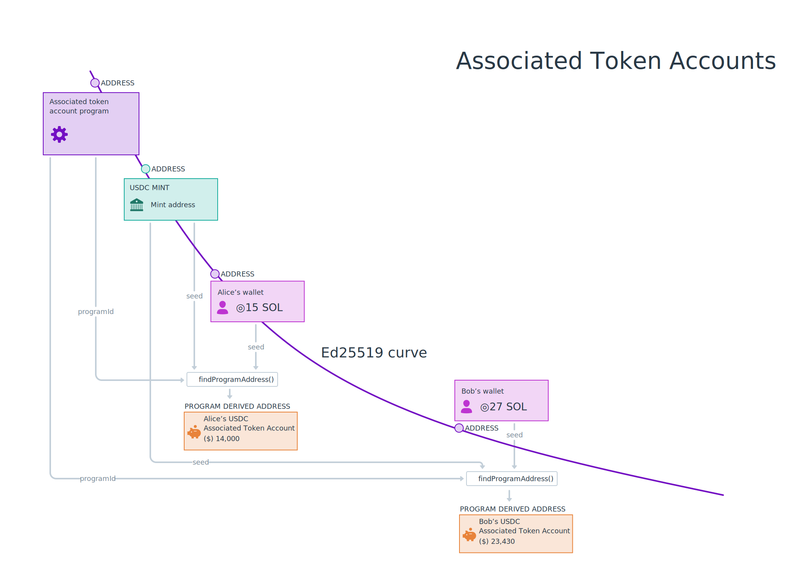

# Resumo

- **Tokens SPL** representam todos os tokens não nativos na rede Solana. Tanto tokens fungíveis quanto não fungíveis (NFTs) na Solana são Tokens SPL
- O **Programa de Token** contém instruções para criar e interagir com Tokens SPL
- As **Cunhagens de Token** (Token Mints) são contas que detêm dados sobre um Token específico, mas não armazenam Tokens
- **Contas de Token** são usadas para armazenar Tokens de uma Cunhagem de Token específico
- Criar Cunhagens de Token e Contas de Token requer alocar **aluguel** em SOL. O aluguel de uma Conta de Token pode ser reembolsado quando a conta é fechada, no entanto, contas de Cunhagens de Token atualmente não podem ser fechadas

# Visão Geral

O Programa de Token é um dos muitos programas disponibilizados pela Biblioteca de Programas da Solana (SPL). Ele contém instruções para criar e interagir com Tokens SPL. Esses tokens representam todos os tokens não nativos (ou seja, não SOL) na rede Solana.

Esta lição focará nos fundamentos de criar e gerenciar um novo Token SPL usando o Programa de Token:
1. Criando uma nova Cunhagem de Token
2. Criando Contas de Token
3. Cunhando tokens
4. Transferindo tokens de um detentor para outro
5. Queimando tokens

Abordaremos isso do lado do cliente do processo de desenvolvimento usando a biblioteca Javascript `@solana/spl-token`.

## Cunhagem de Token

Para criar um novo Token SPL, você primeiro precisa criar uma Cunhagem de Token. Uma Cunhagem de Token é a conta que detém dados sobre um token específico.

Como exemplo, vamos olhar para o [USD Coin (USDC) no Explorador Solana](https://explorer.solana.com/address/EPjFWdd5AufqSSqeM2qN1xzybapC8G4wEGGkZwyTDt1v). O endereço da cunhagem de Token do USDC é `EPjFWdd5AufqSSqeM2qN1xzybapC8G4wEGGkZwyTDt1v`. Com o explorador, podemos ver os detalhes específicos sobre a cunhagem de Token do USDC, como o fornecimento atual de tokens, os endereços das autoridades de cunhagem e congelamento e a precisão decimal do token:


Para criar uma nova Cunhagem de Token, você precisa enviar as instruções de transação corretas para o Programa de Token. Para fazer isso, usaremos a função `createMint` do `@solana/spl-token`.

```tsx
const tokenMint = await createMint(
    connection,
    payer,
    mintAuthority,
    freezeAuthority,
    decimal
);
```

 A função `createMint` retorna a `publicKey` da nova cunhagem de token. Esta função requer os seguintes argumentos:

- `connection` - a conexão JSON-RPC com o cluster
- `payer` - a chave pública do pagador da transação
- `mintAuthority` - a conta autorizada a realizar a própria cunhagem de tokens da Cunhagem de Token
- `freezeAuthority` - uma conta autorizada a congelar os tokens em uma conta de token. Se o congelamento não for um atributo desejado, o parâmetro pode ser definido como nulo
- `decimals` - especifica a precisão decimal desejada do token

Ao criar uma nova cunhagem a partir de um script que tem acesso à sua chave secreta, você pode simplesmente usar a função `createMint`. No entanto, se você fosse construir um site para permitir que os usuários criem uma nova cunhagem de token, você precisaria fazer isso com a chave secreta do usuário sem expô-la ao navegador. Nesse caso, você desejaria criar e enviar uma transação com as instruções corretas.

Internamente, a função `createMint` está simplesmente criando uma transação que contém duas instruções:
1. Criar uma nova conta.
2. Inicializar uma nova cunhagem.

Isso ficaria da seguinte maneira:

```tsx
import * as web3 from '@solana/web3'
import * as token from '@solana/spl-token'

async function buildCreateMintTransaction(
    connection: web3.Connection,
    payer: web3.PublicKey,
    decimals: number
): Promise<web3.Transaction> {
    const lamports = await token.getMinimumBalanceForRentExemptMint(connection);
    const accountKeypair = web3.Keypair.generate();
    const programId = token.TOKEN_PROGRAM_ID

    const transaction = new web3.Transaction().add(
        web3.SystemProgram.createAccount({
            fromPubkey: payer,
            newAccountPubkey: accountKeypair.publicKey,
            space: token.MINT_SIZE,
            lamports,
            programId,
        }),
        token.createInitializeMintInstruction(
            accountKeypair.publicKey,
            decimals,
            payer,
            payer,
            programId
        )
    );

    return transaction
}
```

Ao construir manualmente as instruções para criar uma nova cunhagem de token, certifique-se de adicionar as instruções para criar a conta e inicializar a cunhagem na *mesma transação*. Se você fizesse cada etapa em uma transação separada, seria teoricamente possível que outra pessoa pegasse a conta que você criou e a inicializasse para sua própria cunhagem.

### Aluguel e Isenção de Aluguel
Observe que a primeira linha no corpo da função do trecho de código anterior contém uma chamada para `getMinimumBalanceForRentExemptMint`, cujo resultado é passado para a função `createAccount`. Isso faz parte da inicialização da conta chamada isenção de aluguel.

Até recentemente, todas as contas na Solana eram obrigadas a fazer uma das seguintes coisas para evitar serem desalocadas:
1. Pagar aluguel em intervalos específicos.
2. Depositar SOL suficiente na inicialização para ser considerada isenta de aluguel.

Recentemente, a primeira opção foi abolida e tornou-se um requisito depositar SOL suficiente para isenção de aluguel ao inicializar uma nova conta.

Neste caso, estamos criando uma nova conta para uma cunhagem de token, então usamos `getMinimumBalanceForRentExemptMint` da biblioteca `@solana/spl-token`. No entanto, esse conceito se aplica a todas as contas e você pode usar o método mais genérico `getMinimumBalanceForRentExemption` em `Connection` para outras contas que você possa precisar criar.

## Conta de Token

Antes de poder cunhar tokens (emitir um novo suprimento), você precisa de uma Conta de Token para armazenar os tokens recém-emitidos.

Uma Conta de Token armazena tokens de uma "cunhagem" específica e tem um "proprietário" especificado da conta. Apenas o proprietário está autorizado a diminuir o saldo da Conta de Token (transferir, queimar, etc.), enquanto qualquer pessoa pode enviar tokens para a Conta de Token para aumentar seu saldo.

Você pode usar a função `createAccount` da biblioteca `spl-token` para criar a nova Conta de Token:

```tsx
const tokenAccount = await createAccount(
    connection,
    payer,
    mint,
    owner,
    keypair
);
```

A função `createAccount` retorna a `publicKey` da nova conta de token. Esta função requer os seguintes argumentos:

- `connection` - a conexão JSON-RPC com o cluster.
- `payer` - a conta do pagador da transação.
- `mint` - a cunhagem de token com o qual a nova conta de token está associada.
- `owner` - a conta do proprietário da nova conta de token.
- `keypair` - este é um parâmetro opcional para especificar o endereço da nova conta de token. Se nenhum par de chaves for fornecido, a função `createAccount` usa por padrão uma derivação das contas associadas `mint` e `owner`.

Observe que esta função `createAccount` é diferente da função `createAccount` demonstrada acima, quando olhamos internamente a função `createMint`. Anteriormente, usamos a função `createAccount` em `SystemProgram` para retornar a instrução para criar todas as contas. A função `createAccount` aqui é uma função auxiliar na biblioteca `spl-token` que envia uma transação com duas instruções. A primeira cria a conta e a segunda inicializa a conta como uma Conta de Token.

Assim como na criação de uma cunhagem de Token, se precisássemos construir manualmente a transação para `createAccount`, poderíamos duplicar o que a função está fazendo internamente:
1. Usar `getMint` para recuperar os dados associados à cunhagem (`mint`)
2. Usar `getAccountLenForMint` para calcular o espaço necessário para a conta de token
3. Usar `getMinimumBalanceForRentExemption` para calcular os lamports necessários para isenção de aluguel
4. Criar uma nova transação usando `SystemProgram.createAccount` e `createInitializeAccountInstruction`. Observe que este `createAccount` é de `@solana/web3.js` e é usado para criar uma nova conta genérica. A `createInitializeAccountInstruction` usa esta nova conta para inicializar a nova conta de token

```tsx
import * as web3 from '@solana/web3'
import * as token from '@solana/spl-token'

async function buildCreateTokenAccountTransaction(
    connection: web3.Connection,
    payer: web3.PublicKey,
    mint: web3.PublicKey
): Promise<web3.Transaction> {
    const mintState = await token.getMint(connection, mint)
    const accountKeypair = await web3.Keypair.generate()
    const space = token.getAccountLenForMint(mintState);
    const lamports = await connection.getMinimumBalanceForRentExemption(space);
    const programId = token.TOKEN_PROGRAM_ID

    const transaction = new web3.Transaction().add(
        web3.SystemProgram.createAccount({
            fromPubkey: payer,
            newAccountPubkey: accountKeypair.publicKey,
            space,
            lamports,
            programId,
        }),
        token.createInitializeAccountInstruction(
            accountKeypair.publicKey,
            mint,
            payer,
            programId
        )
    );

    return transaction
}
```

### Conta de Token Associada

Uma Conta de Token Associada (Associated Token Account, ou ATA) é uma Conta de Token onde o endereço da Conta de Token é derivado usando a chave pública de um proprietário e uma cunhagem de token. As Contas de Token Associadas oferecem uma maneira determinística de encontrar a Conta de Token de propriedade de uma `publicKey` específica para uma cunhagem de token específica. Na maioria das vezes, quando você cria uma Conta de Token, vai querer que ela seja uma Conta de Token Associada.



De maneira semelhante ao que foi descrito anteriormente, você pode criar uma conta de token associada usando a função `createAssociatedTokenAccount` da biblioteca `spl-token`.

```tsx
const associatedTokenAccount = await createAssociatedTokenAccount(
    connection,
	payer,
	mint,
	owner,
);
```

Esta função retorna a `publicKey` da nova conta de token associada e requer os seguintes argumentos:

- `connection` - a conexão JSON-RPC com o cluster
- `payer` - a conta do pagador da transação
- `mint` - a cunhagem de token com a qual a nova conta de token está associada
- `owner` - a conta do proprietário da nova conta de token

Você também pode usar `getOrCreateAssociatedTokenAccount` para obter a Conta de Token associada a um endereço específico ou criá-la se ela não existir. Por exemplo, se você estivesse escrevendo um código para fazer um airdrop de tokens para um usuário específico, você provavelmente usaria esta função para garantir que a conta de token associada ao usuário especificado seja criada se ela ainda não existir.

Internamente, `createAssociatedTokenAccount` está fazendo duas coisas:

1. Usando `getAssociatedTokenAddress` para derivar o endereço da conta de token associada a partir de `mint` e `owner`.
2. Construindo uma transação usando instruções de `createAssociatedTokenAccountInstruction`.

```tsx
import * as web3 from '@solana/web3'
import * as token from '@solana/spl-token'

async function buildCreateAssociatedTokenAccountTransaction(
    payer: web3.PublicKey,
    mint: web3.PublicKey
): Promise<web3.Transaction> {
    const associatedTokenAddress = await token.getAssociatedTokenAddress(mint, payer, false);

    const transaction = new web3.Transaction().add(
        token.createAssociatedTokenAccountInstruction(
            payer,
            associatedTokenAddress,
            payer,
            mint
        )
    )

    return transaction
}
```

## Cunhando Tokens

A cunhagem de tokens é o processo de emissão de novos tokens em circulação. Ao cunhar tokens, você aumenta a oferta da Cunhagem de Token e deposita os tokens recém-cunhados em uma conta de token. Somente a autoridade de cunhagem de uma cunhagem de token tem permissão para cunhar novos tokens.

Para cunhar tokens usando a biblioteca `spl-token`, você pode usar a função `mintTo`.

```tsx
const transactionSignature = await mintTo(
    connection,
    payer,
    mint,
    destination,
    authority,
    amount
);
```

A função `mintTo` retorna uma `TransactionSignature` que pode ser visualizada no Explorador Solana. A função `mintTo` requer os seguintes argumentos:

- `connection` - a conexão JSON-RPC com o cluster.
- `payer` - a conta do pagador da transação
- `mint` - a cunhagem de token com a qual a nova conta de token está associada
- `destination` - a conta de token onde os tokens serão cunhados
- `authority` - a conta autorizada a cunhar tokens
- `amount` - a quantidade bruta de tokens a serem cunhados fora dos decimais, por ex. se a propriedade de decimais da cunhagem do Scrooge Coin fosse definida como 2, então para obter 1 Scrooge Coin completo, você precisaria definir esta propriedade como 100

Não é incomum atualizar a autoridade de cunhagem em uma cunhagem de token para nulo depois que os tokens forem cunhados. Isso definiria um fornecimento máximo e garantiria que nenhum token pudesse ser cunhado no futuro. Por outro lado, a autoridade de cunhagem poderia ser concedida a um programa para que os tokens pudessem ser cunhados automaticamente em intervalos regulares ou de acordo com condições programáveis.

Internamente, a função `mintTo` simplesmente cria uma transação com as instruções obtidas da função `createMintToInstruction`.

```tsx
import * as web3 from '@solana/web3'
import * as token from '@solana/spl-token'

async function buildMintToTransaction(
    authority: web3.PublicKey,
    mint: web3.PublicKey,
    amount: number,
    destination: web3.PublicKey
): Promise<web3.Transaction> {
    const transaction = new web3.Transaction().add(
        token.createMintToInstruction(
            mint,
            destination,
            authority,
            amount
        )
    )

    return transaction
}
```

## Transferindo Tokens

As transferências de Tokens SPL exigem que tanto o remetente quanto o destinatário tenham contas de token para a cunhagem dos tokens que estão sendo transferidos. Os tokens são transferidos da conta de token do remetente para a conta de token do destinatário.

Você pode usar `getOrCreateAssociatedTokenAccount` ao obter a conta de token associada do destinatário para garantir que sua conta de token exista antes da transferência. Lembre-se de que, se a conta ainda não existir, essa função a criará e o pagador da transação será debitado dos lamports necessários para a criação da conta.

Quando você souber o endereço da conta de token do destinatário, transfira os tokens usando a função `transfer` da biblioteca `spl-token`.

```tsx
const transactionSignature = await transfer(
    connection,
    payer,
    source,
    destination,
    owner,
    amount
)
```

A função `transfer` retorna uma `TransactionSignature` que pode ser visualizada no Explorador Solana. A função `transfer` requer os seguintes argumentos:

- `connection` a conexão JSON-RPC com o cluster
- `payer` a conta do pagador da transação
- `source` a conta de token que envia tokens
- `destination` a conta de token que recebe tokens
- `owner` a conta do proprietário da conta de token `source`
- `amount` a quantidade de tokens a serem transferidos

Internamente, a função `transfer` simplesmente cria uma transação com as instruções obtidas da função `createTransferInstruction`.

```tsx
import * as web3 from '@solana/web3'
import * as token from '@solana/spl-token'

async function buildTransferTransaction(
    source: web3.PublicKey,
    destination: web3.PublicKey,
    owner: web3.PublicKey,
    amount: number
): Promise<web3.Transaction> {
    const transaction = new web3.Transaction().add(
        token.createTransferInstruction(
            source,
            destination,
            owner,
            amount,
        )
    )

    return transaction
}
```

## Queimando Tokens

Queimar tokens é o processo de diminuir o fornecimento de tokens de uma cunhagem de token específica. Queimar tokens os remove da conta de token fornecida e da circulação mais ampla.

Para queimar tokens usando a biblioteca `spl-token`, utilize a função `burn`.

```tsx
const transactionSignature = await burn(
    connection,
    payer,
    account,
    mint,
    owner,
    amount
)
```

A função `burn` retorna uma `TransactionSignature` que pode ser visualizada no Explorador Solana. A função `burn` requer os seguintes argumentos:

- `connection` a conexão JSON-RPC com o cluster
- `payer` a conta do pagador da transação
- `account` a conta de token de onde os tokens serão queimados
- `mint` a cunhagem de token associada à conta de token
- `owner` a conta do proprietário da conta de token
- `amount` a quantidade de tokens a serem queimados

Internamente, a função `burn` cria uma transação com instruções obtidas da função `createBurnInstruction`:

```tsx
import * as web3 from '@solana/web3'
import * as token from '@solana/spl-token'

async function buildBurnTransaction(
    account: web3.PublicKey,
    mint: web3.PublicKey,
    owner: web3.PublicKey,
    amount: number
): Promise<web3.Transaction> {
    const transaction = new web3.Transaction().add(
        token.createBurnInstruction(
            account,
            mint,
            owner,
            amount
        )
    )

    return transaction
}
```

## Aprovando um Delegado

Aprovar um delegado é o processo de autorizar outra conta a transferir ou queimar tokens de uma conta de token. Ao usar um delegado, a autoridade sobre a conta de token permanece com o proprietário original. A quantidade máxima de tokens que um delegado pode transferir ou queimar é especificada no momento em que o proprietário da conta de token aprova o delegado. Observe que só pode haver uma conta de delegado associada a uma conta de token em qualquer momento.

Para aprovar um delegado usando a biblioteca `spl-token`, utilize a função `approve`.

```tsx
const transactionSignature = await approve(
    connection,
    payer,
    account,
    delegate,
    owner,
    amount
  )
```

A função `approve` retorna uma `TransactionSignature` que pode ser visualizada no Explorador Solana. A função `approve` requer os seguintes argumentos:

- `connection` a conexão JSON-RPC com o cluster
- `payer` a conta do pagador da transação
- `account` a conta de token de onde os tokens serão delegados
- `delegate` a conta que o proprietário está autorizando a transferir ou queimar tokens
- `owner` a conta do proprietário da conta de token
- `amount` o número máximo de tokens que o delegado pode transferir ou queimar

Internamente, a função `approve` cria uma transação com instruções obtidas da função `createApproveInstruction`.

```tsx
import * as web3 from '@solana/web3'
import * as token from '@solana/spl-token'

async function buildApproveTransaction(
    account: web3.PublicKey,
    delegate: web3.PublicKey,
    owner: web3.PublicKey,
    amount: number
): Promise<web3.Transaction> {
    const transaction = new web3.Transaction().add(
        token.createApproveInstruction(
            account,
            delegate,
            owner,
            amount
        )
    )

    return transaction
}
```

## Revogando um Delegado

Um delegado previamente aprovado para uma conta de token pode ser posteriormente revogado. Uma vez que um delegado é revogado, ele não pode mais transferir tokens da conta de token do proprietário. Qualquer quantidade restante não transferida do montante previamente aprovado não pode mais ser transferida pelo delegado.

Para revogar um delegado usando a biblioteca `spl-token`, utilize a função `revoke`.

```tsx
const transactionSignature = await revoke(
    connection,
    payer,
    account,
    owner,
  )
```

A função `revoke` retorna uma `TransactionSignature` que pode ser visualizada no Explorador Solana. A função `revoke` requer os seguintes argumentos:

- `connection` a conexão JSON-RPC com o cluster
- `payer` a conta do pagador da transação
- `account` a conta de token de onde a autoridade do delegado será revogada
- `owner` a conta do proprietário da conta de token

Internamente, a função `revoke` cria uma transação com instruções obtidas da função `createRevokeInstruction`:

```tsx
import * as web3 from '@solana/web3'
import * as token from '@solana/spl-token'

async function buildRevokeTransaction(
    account: web3.PublicKey,
    owner: web3.PublicKey,
): Promise<web3.Transaction> {
    const transaction = new web3.Transaction().add(
        token.createRevokeInstruction(
            account,
            owner,
        )
    )

    return transaction
}
```

# Demonstração

Vamos criar um script que interage com instruções no Programa de Token. Criaremos uma Cunhagem de Token, criaremos Contas de Token, cunharemos tokens, aprovaremos um delegado, transferiremos tokens e queimaremos tokens.

### 1. Estrutura Básica

Vamos começar com uma estrutura básica. Sinta-se à vontade para configurar seu projeto da maneira que achar mais apropriada, mas estaremos usando um projeto simples em Typescript com uma dependência nos pacotes `@solana/web3.js` e `@solana/spl-token`.

Você pode usar `npx create-solana-client [INSIRA_O_NOME_AQUI] --initialize-keypair` na linha de comando para clonar o modelo do qual estaremos partindo. Ou você pode [clonar manualmente o modelo](https://github.com/Unboxed-Software/solana-npx-client-template/tree/with-keypair-env). Observe que, se você usar o repositório git diretamente como ponto de partida, começaremos a partir da branch `with-keypair-env`.

Você precisará então adicionar uma dependência em `@solana/spl-token`. A partir da linha de comando dentro do diretório recém-criado, use o comando `npm install @solana/spl-token`.

### 2. Criando uma Cunhagem de Token

Vamos usar a biblioteca `@solana/spl-token`, então começaremos importando-a no topo do arquivo.

```tsx
import * as token from '@solana/spl-token'
```

Em seguida, declare uma nova função `createNewMint` com os parâmetros `connection`, `payer`, `mintAuthority`, `freezeAuthority` e `decimals`.

No corpo da função, importe `createMint` de `@solana/spl-token` e, em seguida, crie uma função para chamar `createMint`:


```tsx
async function createNewMint(
    connection: web3.Connection,
    payer: web3.Keypair,
    mintAuthority: web3.PublicKey,
    freezeAuthority: web3.PublicKey,
    decimals: number
): Promise<web3.PublicKey> {

    const tokenMint = await token.createMint(
        connection,
        payer,
        mintAuthority,
        freezeAuthority,
        decimals
    );

    console.log(
        `Cunhagem de Token: https://explorer.solana.com/address/${tokenMint}?cluster=devnet`
    );

    return tokenMint;
}
```

Com essa função concluída, chame-a a partir do corpo da `main`, definindo `user` como `payer`, `mintAuthority` e `freezeAuthority`.

Após criar a nova cunhagem, vamos buscar os dados da conta usando a função `getMint` e armazená-los em uma variável chamada `mintInfo`. Usaremos esses dados mais tarde para ajustar a quantidade (`amount`) de entrada para a precisão decimal da cunhagem.

```tsx
async function main() {
    const connection = new web3.Connection(web3.clusterApiUrl("devnet"))
    const user = await initializeKeypair(connection)

    const mint = await createNewMint(
        connection,
        user,
        user.publicKey,
        user.publicKey,
        2
    )

    const mintInfo = await token.getMint(connection, mint);
}
```

### 3. Criando a Conta de Token

Agora que criamos a cunhagem, vamos criar uma nova Conta de Token, especificando `user` como `owner`.

A função `createAccount` cria uma nova Conta de Token com a opção de especificar o endereço da Conta de Token. Lembre-se de que, se nenhum endereço for fornecido, `createAccount` usará por padrão a conta de token associada derivada usando `mint` e `owner`.

Alternativamente, a função `createAssociatedTokenAccount` também criará uma conta de token associada com o mesmo endereço derivado das chaves públicas `mint` e `owner`.

Para nossa demonstração, usaremos a função `getOrCreateAssociatedTokenAccount` para criar nossa conta de token. Esta função obtém o endereço de uma Conta de Token, se ela já existir. Se não, ela criará uma nova Conta de Token Associada no endereço apropriado.

```tsx
async function createTokenAccount(
    connection: web3.Connection,
    payer: web3.Keypair,
    mint: web3.PublicKey,
    owner: web3.PublicKey
) {
    const tokenAccount = await token.getOrCreateAssociatedTokenAccount(
        connection,
        payer,
        mint,
        owner
    )

    console.log(
        `Conta de Token: https://explorer.solana.com/address/${tokenAccount.address}?cluster=devnet`
    )

    return tokenAccount
}
```

Adicione uma chamada para `createTokenAccount` na `main`, passando a cunhagem que criamos na etapa anterior e definindo o `user` como `payer` e `owner`.

```tsx
async function main() {
    const connection = new web3.Connection(web3.clusterApiUrl("devnet"))
    const user = await initializeKeypair(connection)

    const mint = await createNewMint(
        connection,
        user,
        user.publicKey,
        user.publicKey,
        2
    )

    const mintInfo = await token.getMint(connection, mint);

    const tokenAccount = await createTokenAccount(
        connection,
        user,
        mint,
        user.publicKey
    )
}
```

### 4. Cunhando os Tokens

Agora que temos uma cunhagem de token e uma conta de token, vamos cunhar tokens para a conta do token. Observe que apenas `mintAuthority` pode cunhar novos tokens para uma conta de token. Lembre-se que definimos o `user` como `mintAuthority` para o `mint` que criamos.

Crie uma função `mintTokens` que usa a função `mintTo` da biblioteca `spl-token` para cunhar tokens:

```tsx
async function mintTokens(
    connection: web3.Connection,
    payer: web3.Keypair,
    mint: web3.PublicKey,
    destination: web3.PublicKey,
    authority: web3.Keypair,
    amount: number
) {
    const transactionSignature = await token.mintTo(
        connection,
        payer,
        mint,
        destination,
        authority,
        amount
    )

    console.log(
        `Transação da Cunhagem de Token: https://explorer.solana.com/tx/${transactionSignature}?cluster=devnet`
    )
}
```

Vamos chamar a função na `main` usando `mint` e `tokenAccount`, criados anteriormente.

Note que temos que ajustar o `amount` de entrada para a precisão decimal da cunhagem. Tokens do nosso `mint` têm uma precisão decimal de 2. Se especificarmos apenas 100 como `amount` de entrada, então apenas 1 token será cunhado para nossa conta de token.

```tsx
async function main() {
    const connection = new web3.Connection(web3.clusterApiUrl("devnet"))
    const user = await initializeKeypair(connection)

    const mint = await createNewMint(
        connection,
        user,
        user.publicKey,
        user.publicKey,
        2
    )

    const mintInfo = await token.getMint(connection, mint);

    const tokenAccount = await createTokenAccount(
        connection,
        user,
        mint,
        user.publicKey
    )

    await mintTokens(
        connection,
        user,
        mint,
        tokenAccount.address,
        user,
        100 * 10 ** mintInfo.decimals
    )
}
```

### 5. Aprovando o Delegado

Agora que temos uma cunhagem de token e uma conta de token, vamos autorizar um delegado para transferir tokens em nosso nome.

Crie uma função `approveDelegate` que usa a função `approve` da biblioteca `spl-token` para cunhar tokens:

```tsx
async function approveDelegate(
    connection: web3.Connection,
    payer: web3.Keypair,
    account: web3.PublicKey,
    delegate: web3.PublicKey,
    owner: web3.Signer | web3.PublicKey,
    amount: number
) {
    const transactionSignature = await token.approve(
        connection,
        payer,
        account,
        delegate,
        owner,
        amount
  )

    console.log(
        `Aprovar transação de delegado: https://explorer.solana.com/tx/${transactionSignature}?cluster=devnet`
    )
}
```

Na `main`, vamos gerar um novo `Keypair` para representar a conta do delegado. Então, vamos chamar nossa nova função `approveDelegate` e autorizar o delegado a transferir até 50 tokens da conta de token do `user`. Lembre-se de ajustar o `amount` para a precisão decimal do `mint`.

```tsx
async function main() {
    const connection = new web3.Connection(web3.clusterApiUrl("devnet"))
    const user = await initializeKeypair(connection)

    const mint = await createNewMint(
        connection,
        user,
        user.publicKey,
        user.publicKey,
        2
    )

    const mintInfo = await token.getMint(connection, mint);

    const tokenAccount = await createTokenAccount(
        connection,
        user,
        mint,
        user.publicKey
    )

    await mintTokens(
        connection,
        user,
        mint,
        tokenAccount.address,
        user,
        100 * 10 ** mintInfo.decimals
    )

    const delegate = web3.Keypair.generate();

    await approveDelegate(
      connection,
      user,
      tokenAccount.address,
      delegate.publicKey,
      user.publicKey,
      50 * 10 ** mintInfo.decimals
    )
}
```

### 6. Transferindo Tokens

Em seguida, vamos transferir alguns dos tokens que acabamos de cunhar usando a função `transfer` da biblioteca `spl-token`.

```tsx
async function transferTokens(
    connection: web3.Connection,
    payer: web3.Keypair,
    source: web3.PublicKey,
    destination: web3.PublicKey,
    owner: web3.Keypair,
    amount: number
) {
    const transactionSignature = await token.transfer(
        connection,
        payer,
        source,
        destination,
        owner,
        amount
    )

    console.log(
        `Transação de Transferência: https://explorer.solana.com/tx/${transactionSignature}?cluster=devnet`
    )
}
```

Antes de podermos chamar essa nova função, precisamos saber a conta para a qual transferiremos os tokens.

Na `main`, vamos gerar um novo `Keypair` para ser o destinatário (mas lembre-se de que isso é apenas para simular ter alguém para enviar tokens - em uma aplicação real, você precisaria saber o endereço da carteira da pessoa que está recebendo os tokens).

Depois, crie uma conta de token para o destinatário. Finalmente, vamos chamar nossa nova função `transferTokens` para transferir tokens da conta de token do `user` para a conta de token do `receiver`. Usaremos o `delegate` que aprovamos na etapa anterior para realizar a transferência em nosso nome.

```tsx
async function main() {
    const connection = new web3.Connection(web3.clusterApiUrl("devnet"))
    const user = await initializeKeypair(connection)

    const mint = await createNewMint(
        connection,
        user,
        user.publicKey,
        user.publicKey,
        2
    )

    const tokenAccount = await createTokenAccount(
        connection,
        user,
        mint,
        user.publicKey
    )

    const mintInfo = await token.getMint(connection, mint);

    await mintTokens(
        connection,
        user,
        mint,
        tokenAccount.address,
        user,
        100 * 10 ** mintInfo.decimals
    )

    const receiver = web3.Keypair.generate().publicKey
    const receiverTokenAccount = await createTokenAccount(
        connection,
        user,
        mint,
        receiver
    )

    const delegate = web3.Keypair.generate();
    await approveDelegate(
        connection,
        user,
        tokenAccount.address,
        delegate.publicKey,
        user.publicKey,
        50 * 10 ** mintInfo.decimals
    )

    await transferTokens(
        connection,
        user,
        tokenAccount.address,
        receiverTokenAccount.address,
        delegate,
        50 * 10 ** mintInfo.decimals
    )
}
```

### 7. Revogando o Delegado

Agora que terminamos de transferir os tokens, vamos revogar o `delegate` usando a função `revoke` da biblioteca `spl-token`.

```tsx
async function revokeDelegate(
    connection: web3.Connection,
    payer: web3.Keypair,
    account: web3.PublicKey,
    owner: web3.Signer | web3.PublicKey,
) {
    const transactionSignature = await token.revoke(
        connection,
        payer,
        account,
        owner,
  )

    console.log(
        `Revogar transação de delegado: https://explorer.solana.com/tx/${transactionSignature}?cluster=devnet`
    )
}
```

Revogar irá definir o delegado da conta de token para nulo e redefinir o montante delegado para 0. Tudo o que precisaremos para esta função é a conta de token e o usuário. Vamos chamar nossa nova função `revokeDelegate` para revogar o delegado da conta de token do `user`.

```tsx
async function main() {
    const connection = new web3.Connection(web3.clusterApiUrl("devnet"))
    const user = await initializeKeypair(connection)

    const mint = await createNewMint(
        connection,
        user,
        user.publicKey,
        user.publicKey,
        2
    )

    const mintInfo = await token.getMint(connection, mint);

    const tokenAccount = await createTokenAccount(
        connection,
        user,
        mint,
        user.publicKey
    )

    await mintTokens(
        connection,
        user,
        mint,
        tokenAccount.address,
        user,
        100 * 10 ** mintInfo.decimals
    )

    const receiver = web3.Keypair.generate().publicKey
    const receiverTokenAccount = await createTokenAccount(
        connection,
        user,
        mint,
        receiver
    )

    const delegate = web3.Keypair.generate();
    await approveDelegate(
        connection,
        user,
        tokenAccount.address,
        delegate.publicKey,
        user.publicKey,
        50 * 10 ** mintInfo.decimals
    )

    await transferTokens(
        connection,
        user,
        tokenAccount.address,
        receiverTokenAccount.address,
        delegate,
        50 * 10 ** mintInfo.decimals
    )

    await revokeDelegate(
        connection,
        user,
        tokenAccount.address,
        user.publicKey,
    )
}
```

### 8. Queimando Tokens

Por fim, vamos tirar alguns tokens de circulação queimando-os.

Crie uma função `burnTokens` que usa a função `burn` da biblioteca `spl-token` para remover metade dos seus tokens da circulação.

```tsx
async function burnTokens(
    connection: web3.Connection,
    payer: web3.Keypair,
    account: web3.PublicKey,
    mint: web3.PublicKey,
    owner: web3.Keypair,
    amount: number
) {
    const transactionSignature = await token.burn(
        connection,
        payer,
        account,
        mint,
        owner,
        amount
    )

    console.log(
        `Transação de queima: https://explorer.solana.com/tx/${transactionSignature}?cluster=devnet`
    )
}
```

Agora chame esta nova função na `main` para queimar 25 dos tokens do usuário. Lembre-se de ajustar o `amount` para a precisão decimal do `mint`.

```tsx
async function main() {
    const connection = new web3.Connection(web3.clusterApiUrl("devnet"))
    const user = await initializeKeypair(connection)

    const mint = await createNewMint(
        connection,
        user,
        user.publicKey,
        user.publicKey,
        2
    )

    const mintInfo = await token.getMint(connection, mint);

    const tokenAccount = await createTokenAccount(
        connection,
        user,
        mint,
        user.publicKey
    )

    await mintTokens(
        connection,
        user,
        mint,
        tokenAccount.address,
        user,
        100 * 10 ** mintInfo.decimals
    )

    const receiver = web3.Keypair.generate().publicKey
    const receiverTokenAccount = await createTokenAccount(
        connection,
        user,
        mint,
        receiver
    )

    const delegate = web3.Keypair.generate();
    await approveDelegate(
        connection,
        user,
        tokenAccount.address,
        delegate.publicKey,
        user.publicKey,
        50 * 10 ** mintInfo.decimals
    )

    await transferTokens(
        connection,
        user,
        tokenAccount.address,
        receiverTokenAccount.address,
        delegate,
        50 * 10 ** mintInfo.decimals
    )

    await revokeDelegate(
        connection,
        user,
        tokenAccount.address,
        user.publicKey,
    )

    await burnTokens(
        connection, 
        user, 
        tokenAccount.address, 
        mint, user, 
        25 * 10 ** mintInfo.decimals
    )
}
```
### 9. Testando tudo

Com isso, execute `npm start`. Você deverá ver uma série de links do Explorador Solana registrados no console. Clique neles e veja o que aconteceu em cada etapa do caminho! Você criou uma nova cunhagem de token, criou uma conta de token, cunhou 100 tokens, aprovou um delegado, transferiu 50 tokens usando um delegado, revogou o delegado e queimou mais 25. Você está no caminho certo para se tornar um especialista em tokens.

Se você precisar de mais tempo com este projeto para se sentir confortável, dê uma olhada no [código da solução completa](https://github.com/Unboxed-Software/solana-token-client)

# Desafio

Agora é a sua vez de construir algo independentemente. Crie uma aplicação que permite aos usuários criar uma nova cunhagem, criar uma conta de token e cunhar tokens.

Note que você não poderá usar diretamente as funções auxiliares que revisamos na demonstração. Para interagir com o Programa de Token usando o adaptador da carteira Phantom, você terá que construir cada transação manualmente e submeter a transação para aprovação pela Phantom.


1. Você pode construir tudo isso do zero ou pode [baixar o código inicial aqui](https://github.com/Unboxed-Software/solana-token-frontend/tree/starter).
2. Crie uma nova Cunhagem de Token no componente `CreateMint`.
   Se precisar de uma revisão sobre como enviar transações para uma carteira para aprovação, dê uma olhada na [lição sobre Carteiras](./interact-with-wallets.md).

   Ao criar uma nova cunhagem, o `Keypair` recém-gerado também terá que assinar a transação. Quando signatários adicionais forem necessários além da carteira conectada, use o seguinte formato:

    ```tsx
    sendTransaction(transaction, connection, {
        signers: [Keypair],
    })
    ```
3. Crie uma nova Conta de Token no componente `CreateTokenAccount`.
4. Cunhe tokens no componente `MintToForm`.

Se você ficar confuso, fique à vontade para consultar o [código da solução](https://github.com/ZYJLiu/solana-token-frontend).

E lembre-se, seja criativo com esses desafios e torne-os seus!
