# Solana NFTs

# Lesson Objectives

*By the end of this lesson, you will be able to:*

- Understand the role of Metaplex in the Solana NFT ecosystem
- Use Candy Machine v2 to create an NFT collection
- Use a frontend UI to mint NFTs from a Candy Machine

# TL;DR

- **Non Fungible Tokens (NFTs)** are represented on Solana as SPL Tokens with an associated metadata account, 0 decimals, and a max supply of 1
- **Metaplex** is a collection of tools that simplify the creation and distribution of NFTs on the Solana blockchain
- **CandyMachineV2** is a NFT distribution program by Metaplex used to mint NFTs from a collection

# Overview

Solana NFTs are also SPL tokens created using the Token Program. However, these tokens have an additional metadata account associated with each token mint allowing for more flexible use cases.

This lesson will focus on the basics of creating and distributing a new NFT collection using the Candy Machine v2:

1. Configuring a Candy Machine
2. Preparing NFT assets for a collection
3. Creating a Candy Machine
4. Minting NFTs from a Candy Machine

We'll be approaching this from the client-side of the development process using the existing tools created by Metaplex.

### Metaplex

Metaplex provides a suite of tools that simplify the creation and distribution of NFTs on the Solana blockchain. One of the core programs by Metaplex is the Token Metadata program. The Token Metadata program standardizes the process of associating metadata to an NFT.

Candy Machine v2 is a distribution tool offered by Metaplex used to create and mint an NFT collection. Candy Machine v2 leverages the Token Metadata program to upload the NFT assets for a collection and allows creators to customize the distribution configurations.

### Non Fungible Tokens (NFTs)

NFTs on Solana are simply SPL tokens with the following properties:

1. token with 0 decimals
2. token mint with supply of 1
3. token mint authority set to null
4. metadata associated with token mint

In other words, a Solana NFT is a token from a token mint where only 1 token was minted and cannot be divided into smaller units.

The Token Metadata Program creates a metadata account using a Program Derived Address (PDA) with the token mint as a seed. This allows the metadata account for any NFT to be located deterministically using the address of the token mint.

An NFT’s metadata has both an on-chain and off-chain component. The on-chain metadata account contains a URI attribute that points to an off-chain JSON file. The off-chain component stores additional data and a link to the image. Permanent data storage system such as Arweave are often used to store the off-chain component of NFT metadata.

Below is an example of the on-chain metadata associated with an NFT:

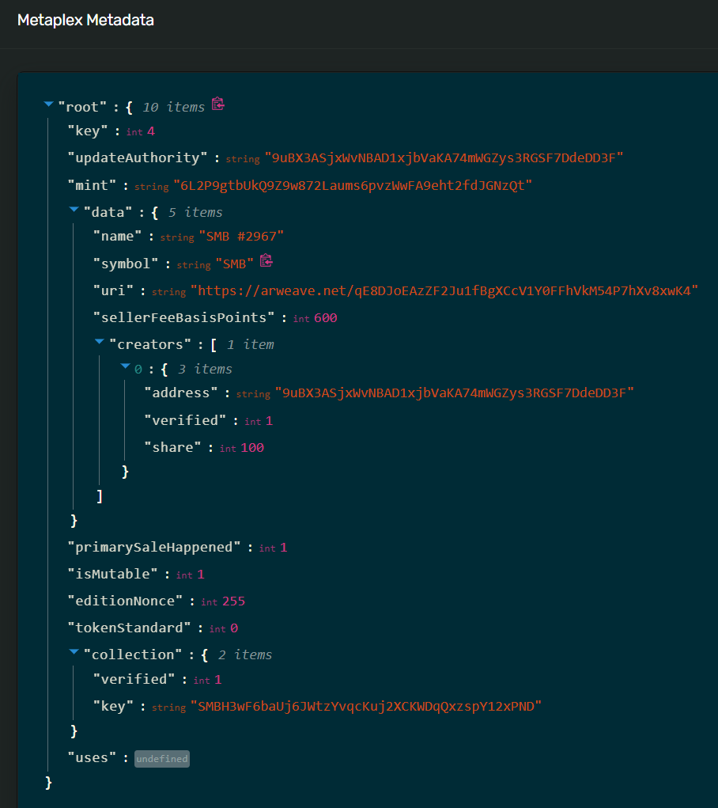

Similarly, below is the corresponding off-chain metadata:

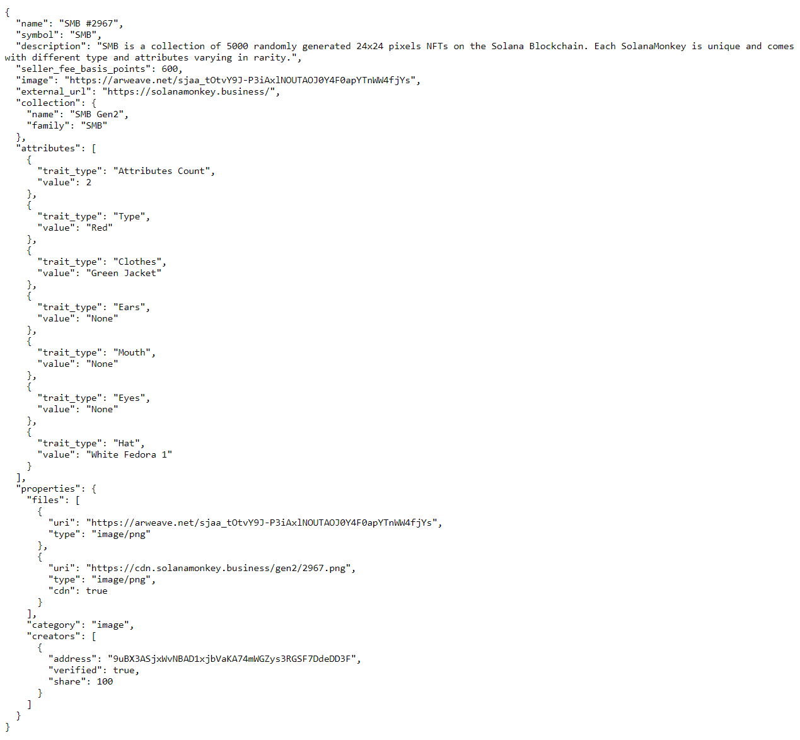

### Assets

Before creating a collection you must prepare the assets for your collection. The assets are the images and metadata associated with each NFT. An NFT is created using a pairing of an image and a file containing its metadata.

The metadata should include the following attributes:

- `"name"` the name of the NFT that will display on-chain
- `"symbol"` the optional symbol of the NFT that will display on-chain
- `"description"` the description of NFT
- `"seller_fee_basis_points"` the fee collected on sale of the NFT split between the creators
- `"image"` the file name of the corresponding image that the NFT will display
- `"attributes"` the attributes of the NFT
- `"properties"` the creators that share of seller fee basis points. If there multiple creators, the total “share” must add to 100
- `"collection"` the “name” and “family” of the NFT collection

The metadata file will look something like the following:

```tsx
{
    "name": "Number #0001",
    "symbol": "NB",
    "description": "Collection of 10 numbers on the blockchain. This is the number 1/10.",
    "seller_fee_basis_points": 500,
    "image": "0.png",
    "attributes": [
        {"trait_type": "Layer-1", "value": "0"},
        {"trait_type": "Layer-2", "value": "0"}, 
        {"trait_type": "Layer-3", "value": "0"},
        {"trait_type": "Layer-4", "value": "1"}
    ],
    "properties": {
        "creators": [{"address": "N4f6zftYsuu4yT7icsjLwh4i6pB1zvvKbseHj2NmSQw", "share": 100}],
        "files": [{"uri": "0.png", "type": "image/png"}]
    },
    "collection": {"name": "numbers", "family": "numbers"}
}
```

### Candy Machine v2

Candy Machine v2 is an NFT distribution program by Metaplex. A Candy Machine is configured using a JSON file that can be reused across multiple drops. When a new Candy Machine is created, the configurations are stored in an account on-chain where the configuration fields can be updated using the Candy Machine CLI.

Below is the basic format of the configuration file:

```tsx
{
    "price": 1.0,
    "number": 10,
    "gatekeeper": null,
    "solTreasuryAccount": "<YOUR WALLET ADDRESS>",
    "splTokenAccount": null,
    "splToken": null,
    "goLiveDate": "25 Dec 2021 00:00:00 GMT",
    "endSettings": null,
    "whitelistMintSettings": null,
    "hiddenSettings": null,
    "storage": "arweave-sol",
    "ipfsInfuraProjectId": null,
    "ipfsInfuraSecret": null,
    "nftStorageKey": null,
    "awsS3Bucket": null,
    "noRetainAuthority": false,
    "noMutable": false
}
```

The `price` is the amount to charge for each NFT minted from the Candy Machine.

```tsx
"price": 1.0
```

The `number` is the amount of NFTs in the Candy Machine and must match the number of asset pairings you’ve created for your collection.

```tsx
"number": 10
```

The `gatekeeper` enables captcha verification before minting from the Candy Machine.

```tsx
"gatekeeper": {
    "gatekeeperNetwork" : "<PROVIDER NETWORK ADDRESS>",
    "expireOnUse" : true
}
```

The `solTreasuryAccount` is the address SOL payments from the mint will be sent.

```tsx
 "solTreasuryAccount": "<YOUR WALLET ADDRESS>",
```

The Candy Machine can also be set to receive payment using an SPL token. The `splTokenAccount` is the token account you want the SPL token payments to be sent. The `splToken` is the token mint address of the SPL token accepted as payment. Note that the address in the `splTokenAccount` field must be a token account for the token mint specified in the `splToken` field.

```tsx
"splTokenAccount": "<TOKEN ACCOUNT ADDRESS>",
"splToken": "<TOKEN MINT ADDRESS>",
```

The `goLiveDate` is the date the mint goes live for public mint.

```tsx
"goLiveDate": "25 Dec 2021 00:00:00 GMT",
```

The `endSettings` is the settings you want minting to stop. It can either be a specified date or after a certain amount of NFTs are minted.

```tsx
"endSettings": {
    "endSettingType": { "date":true },
    "value":"25 Dec 2021 23:59:00 GMT"
}
```

```tsx
"endSettings": {
    "endSettingType": { "amount":true },
    "value":10
}
```

The `whitelistMintSettings` allows you to configure whitelist settings.

- `mode` is where you specific if the whitelist token is burned upon minting.
  - The `"burnEveryTime": true` setting will be burn the whitelist token upon mint. Note that the whitelist token must have 0 decimals, otherwise only a partial token will be burned upon minting.
  - The `“neverBurn” : true` setting allows whitelist token holders to mints as many times as they wish.
- `mint` is the whitelist token mint address
- `discountPrice` is an optional discounted price offered to whitelist token holders
- `presale` settings determine if whitelist token holders can mint before the `goLiveDate`

```tsx
"whitelistMintSettings": {
    "mode" : { "burnEveryTime": true },
    "mint" : "7nE1GmnMmDKiycFkpHF7mKtxt356FQzVonZqBWsTWZNf",
    "presale" : true,
    "discountPrice" : 0.5
}
```

The `hiddenSettings` can be used for hidden drop reveals. On initial mint all holders see the same image specified in `uri` field, which can then can be later revealed to the actual NFT image.

The `hash` can be used to prove to holders that no modified were made after minting by hashing the cache file output by the Candy Machine containing the mapping between mint number and metadata.

```tsx
"hiddenSettings": {
    "name":"My Hidden Collection ",
    "uri":"uri",
    "hash":"44kiGWWsSgdqPMvmqYgTS78Mx2BKCWzd"
}
```

Below are storage options for the collection. Note that `arweave` files are only stored for 7 days on devnet.

```tsx
 "storage": "arweave",
 "ipfsInfuraProjectId": null,
 "ipfsInfuraSecret": null,
 "nftStorageKey": null,
 "awsS3Bucket": null,
```

The `noRetainAuthority` field indicates whether the candy machine authority has the update authority for each mint or if it is transferred to the minter. This should be kept as `false` for the vast majority of cases.

```tsx
 "noRetainAuthority": false,
```

The `noMutable` field indicates whether the NFTs' metadata is mutable or not after having been minted. If set to false, the candy machine configurations can be updated. If set to true, candy machine configurations cannot be updated and cannot be reset to true.

```tsx
"noMutable": false
```

# Demo

Let’s practice this together by creating a Candy Machine and minting our collection using the Candy Machine UI.

### 1. Download the starter code

**Demo Starter Code:** [https://github.com/ZYJLiu/metaplex-starter](https://github.com/ZYJLiu/metaplex-starter)

Lets begin by downloading the starter code. The starter code includes an assets folder and the configuration file for our candy machine.

```tsx
git clone <starter code>
```

Lets navigate to the <starter code folder>

```tsx
cd <starter code folder>
```

### 2. Setup

Next lets set up a new keypair to use for this lesson and connect to devnet using the endpoint provided by Metaplex.

Generate a new keypair that we will use for the project:

```tsx
solana-keygen new --outfile ~/.config/solana/devnet.json
```

Set the new keypair as the default keypair:

```tsx
solana config set --keypair ~/.config/solana/devnet.json
```

Set our connection to devnet using metaplex rpc:

```tsx
solana config set --url https://metaplex.devnet.rpcpool.com/
```

Airdrop devnet SOL to new test wallet:

```tsx
solana airdrop 2
```

Copy the keypair from `.config/solana/devnet.json` and import to Phantom


### 3. Download Metaplex

While in the start code folder clone the Metaplex repo:

```tsx
git clone https://github.com/metaplex-foundation/metaplex.git
```

Next, install Metaplex dependencies:

```tsx
yarn install --cwd metaplex/js/
```

Check that Candy Machine was installed:

```tsx
ts-node metaplex/js/packages/cli/src/candy-machine-v2-cli.ts --version
```

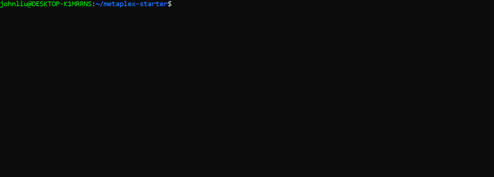

### 4. Candy Machine Configuration

Now that we have installed Metaplex, lets configure our Candy Machine.

Open the `config.json` located in our starter code folder:

```tsx
{
  "price": 1,
  "number": 5,
  "gatekeeper": null,
  "solTreasuryAccount": "<YOUR WALLET ADDRESS>",
  "splTokenAccount": null,
  "splToken": null,
  "goLiveDate": "25 Dec 2020 00:00:00 GMT",
  "endSettings": null,
  "whitelistMintSettings": null,
  "hiddenSettings": null,
  "storage": "arweave",
  "ipfsInfuraProjectId": null,
  "ipfsInfuraSecret": null,
  "awsS3Bucket": null,
  "nftStorageKey": null,
  "noRetainAuthority": false,
  "noMutable": false
}
```

Update the `"solTreasuryAccount"` field with the wallet address we imported to Phantom. This will be the only setting we change for now.

```bash
"solTreasuryAccount": "<YOUR WALLET ADDRESS>",
```

### 5. Prepare Assets

Next, lets prepare the assets for our Candy Machine. The starter code includes an `assets` folder that has the images and metadata we will be using for our collection.

Open each `.json` file and update the `"address"` field with the wallet address we imported to Phantom.

```tsx
{
  "name": "1",
  "symbol": "TEST",
  "image": "0.png",
  "properties": {
    "files": [{ "uri": "0.png", "type": "image/png" }],
    "category": "image",
    "creators": [
      {
        "address": "<YOUR WALLET ADDRESS>",
        "share": 100
      }
    ]
  },
  "description": "",
  "seller_fee_basis_points": 500,
  "attributes": [
    { "trait_type": "background", "value": "blue" },
    { "trait_type": "eyes", "value": "star-eyes" },
    { "trait_type": "mouth", "value": "triangle-mouth" },
    { "trait_type": "face", "value": "teal-face" }
  ],
  "collection": { "name": "NAME", "family": "FAMILY" }
}
```

Once you’ve updated the `"address"` field for each `.json` file, lets verify that the assets are ready for upload by running the `verify_assets` command.

This will check that:

1. Files types are supported
2. Each image has a corresponding `.json` metadata file with the correct index naming
3. The `"creators"` field is consistent across all `.json` files

```tsx
ts-node metaplex/js/packages/cli/src/candy-machine-v2-cli.ts verify_assets ./assets
```

The output should look something like this:

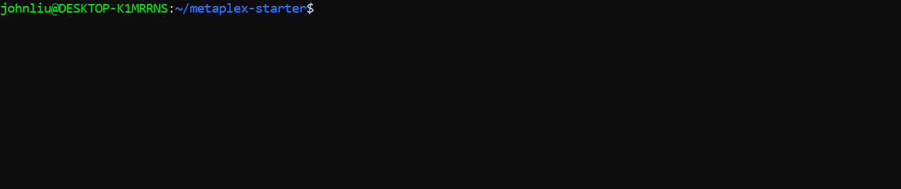

### 6. Create Candy Machine

Now that we’ve configured our Candy Machine and verified our assets are ready for upload, lets upload our assets and create our Candy Machine by running the `upload` command.

```tsx
ts-node metaplex/js/packages/cli/src/candy-machine-v2-cli.ts upload \
    -e devnet \
    -k ~/.config/solana/devnet.json \
    -cp config.json \
    -c example \
    ./assets
```

The output should look something like this:


There will now be a `.cache` folder with a `devnet-example.json` file which includes the address of our Candy Machine and the uploaded arweave link for each NFT.

The `devnet-example.json` file will look something like this, but with different links and addresses:

```tsx
{
  "program": {
    "uuid": "GSSEGg",
    "candyMachine": "GSSEGgeCvndhjd3GGNs8VM65qHPAiBF8cF2EWTZ3bm8k",
    "collection": "4cXtoUxF9C3nYxo31Hku6gFYDEcnidqSScbctfY17HZr"
  },
  "items": {
    "0": {
      "link": "https://arweave.net/nk7VSghTt9iP6cVYnVxo4SAN_t6RPxE6iESP-Z49s4s",
      "imageLink": "https://arweave.net/8Y9i5mvF3u_3XHzSAfiDxt8pUubGB8HwXTTEnD4Kp7c?ext=png",
      "name": "1",
      "onChain": true,
      "verifyRun": false
    },
    "1": {
      "link": "https://arweave.net/LEbsEUVr-oMCgVkZlvSEmOoBRR7QcoFG-won6tZD16g",
      "imageLink": "https://arweave.net/T78LQZsteVWK83g49wy-Lt3cig3w8N1kAXyZiU5Pxdg?ext=png",
      "name": "2",
      "onChain": true,
      "verifyRun": false
    },
    "2": {
      "link": "https://arweave.net/0D-klGK9bceLNm0Bxo4ua59RlLq1i0cM1A31Smsgvwo",
      "imageLink": "https://arweave.net/GbPL0RTX_IEJvbcAEwqGI2nyzsT6IXRHDgk_o_fdwJQ?ext=png",
      "name": "3",
      "onChain": true,
      "verifyRun": false
    },
    "3": {
      "link": "https://arweave.net/hz0lrDqCvtVnvToHjmSCDlSF7feCcu8KX_zJDq_BBRc",
      "imageLink": "https://arweave.net/mhxIIf-U4xwA1yFouxZx1eUmpMOr-7gz9a377fwbO8w?ext=png",
      "name": "4",
      "onChain": true,
      "verifyRun": false
    },
    "4": {
      "link": "https://arweave.net/MQsmrTW6BIufImiDjHY3py3dM1w8DdowKGtJ307MQW4",
      "imageLink": "https://arweave.net/otRFxnPyLW_fmbUvskf4DE63n8dUurHt5Qm--gWWOdA?ext=png",
      "name": "5",
      "onChain": true,
      "verifyRun": false
    }
  },
  "env": "devnet",
  "cacheName": "example"
}
```

Next, lets verify our upload by running the `verify_upload` command.

This verifies that each entry in the `devnet-example.json` file has been successfully uploaded and matches the URI stored on-chain.

```tsx
ts-node metaplex/js/packages/cli/src/candy-machine-v2-cli.ts verify_upload \
    -e devnet \
    -k ~/.config/solana/devnet.json \
    -c example
```

The output should look something like this:

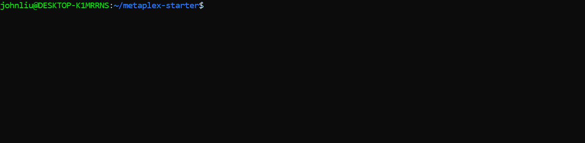

Now lets mint an NFT from our Candy Machine by running the `mint_one_token` command:

```tsx
ts-node metaplex/js/packages/cli/src/candy-machine-v2-cli.ts mint_one_token \
    -e devnet \
    -k ~/.config/solana/devnet.json \
    -c example
```


You should now be able to see view the newly minted NFT in the Phantom wallet.


### 7. Candy Machine UI

Now that we have our Candy Machine, lets set up a frontend to mint our NFTs using the Candy Machine UI.

Navigate to the candy-machine-ui folder using the following path: `/metaplex/js/packages/candy-machine-ui`.

1. Locate the `.env.example` file
2. Rename this file to `.env`
3. Open the `.env` file and update `REACT_APP_CANDY_MACHINE_ID` with the address of the Candy Machine from `devnet-example.json`

```tsx
REACT_APP_CANDY_MACHINE_ID=<YOUR CANDY MACHINE PROGRAM ID>

REACT_APP_SOLANA_NETWORK=devnet
REACT_APP_SOLANA_RPC_HOST=https://metaplex.devnet.rpcpool.com/
```

While in the `candy-machine-ui` folder, run following command:

```tsx
yarn install && yarn start
```

Navigate to `[localhost:3000](http://localhost:3000)` in the browser and click mint to mint an NFT from the Candy Machine!

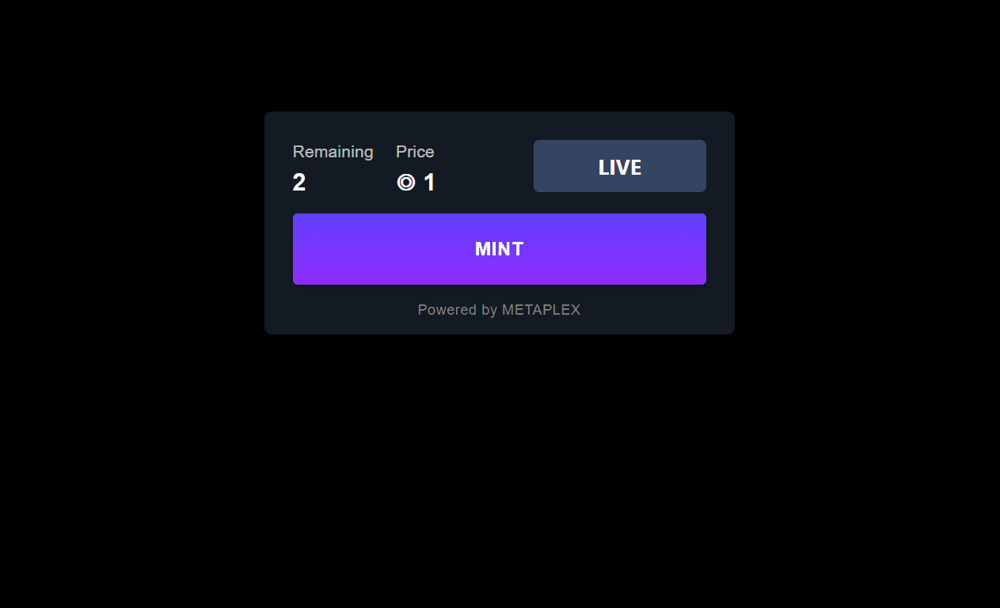

### 8. Enable Gatekeeper

Now that we have our Candy Machine UI working, lets update our Candy Machine to enable gatekeeper.

Open the `.config.json` file and update the `gatekeeper` field to enable captcha:

```tsx
"gatekeeper": {
    "gatekeeperNetwork": "ignREusXmGrscGNUesoU9mxfds9AiYTezUKex2PsZV6",
    "expireOnUse": true
  },
```

Update the Candy Machine by running the `update_candy_machine` command:

```tsx
ts-node metaplex/js/packages/cli/src/candy-machine-v2-cli.ts update_candy_machine \
    -e devnet \
    -k ~/.config/solana/devnet.json \
    -cp config.json \
    -c example
```

Refresh`[localhost:3000](http://localhost:3000)` in the browser and click the mint button. It should now require a captcha verification before minting.


### 9. Create Whitelist Token

Next, lets create a whitelist token.

Set our connection to offical devnet rpc (metaplex restricts token creation):

```tsx
solana config set --url https://api.devnet.solana.com
```

Generate a new keypair for the whitelist token:

```tsx
solana-keygen grind --starts-with WL:1
```

Create a new token with 0 decimals using the address we just generated:

```tsx
spl-token create-token --decimals 0 <WHITELIST TOKEN ADDRESS>.json
```

Create a new token account:

```tsx
spl-token create-account <WHITELIST TOKEN ADDRESS>
```

Mint whitelist tokens to the token account:

```tsx
spl-token mint <WHITELIST TOKEN ADDRESS> 3
```

Check the token balance:

```tsx
spl-token account-info <WHITELIST TOKEN ADDRESS>
```


If you would like to transfer whitelist tokens to another wallet address, use the following command:

```tsx
spl-token transfer <WHITELIST TOKEN ADDRESS> 1 <WALLET ADDRESS> --fund-recipient
```

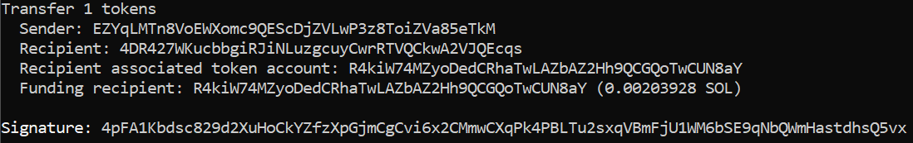

Set our connection to devnet back to metaplex rpc:

```tsx
solana config set --url https://metaplex.devnet.rpcpool.com/
```

### 10. Enable Whitelist

Next, lets update the our Candy Machine to enable whitelist settings.

Open the `.config.json` file and reset `gatekeeper` field to null as gatekeeper will not work with whitelist presale enabled:

```tsx
"gatekeeper": null,
```

Update the `"goLiveDate"` to sometime in the future:

```tsx
  "goLiveDate": "25 Dec 2022 00:00:00 GMT",
```

Update `whitelistMintSettings`

- `"burnEveryTime": true` will burn the whitelist token when minting and NFT
- `mint` specifies the token mint of the whitelist token
- `"presale" : true` setting allows whitelist token holders to mint before the `"goLiveDate"`
- `"discountPrice"` specifies a discounted mint price for whitelist token holders

```tsx
"whitelistMintSettings": {
    "mode" : { "burnEveryTime": true },
    "mint" : "<WHITELIST TOKEN ADDRESS>",
    "presale" : true,
    "discountPrice" : 0.01
},
```

Update the Candy Machine by running the `update_candy_machine` command again:

```tsx
ts-node metaplex/js/packages/cli/src/candy-machine-v2-cli.ts update_candy_machine \
    -e devnet \
    -k ~/.config/solana/devnet.json \
    -cp config.json \
    -c example
```

Refresh`[localhost:3000](http://localhost:3000)` in the browser and mint from a wallet that holds the whitelist token:

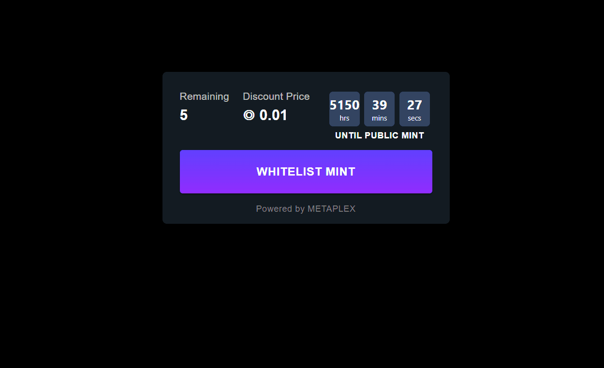

Go ahead and mint out the Candy Machine from a wallet with the whitelist token until you see the following:

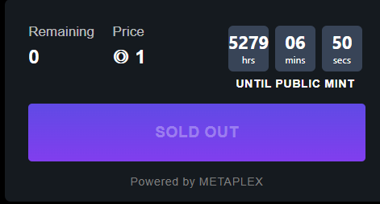

### 11. Withdraw Rent

Now that our Candy Machine is fully minted, the rent used for the Candy Machine can be retrieved by running the `withdraw` command:

```tsx
ts-node metaplex/js/packages/cli/src/candy-machine-v2-cli.ts withdraw <candy_machine_id> \
    -e devnet \
    -k ~/.config/solana/devnet.json
```

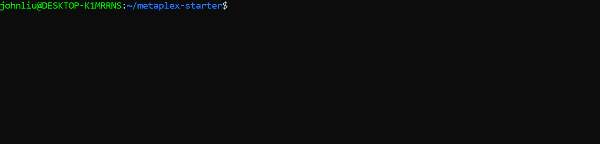

### 12. Signing NFTs

Finally, sign the NFTs to verify yourself as the creator of the collection by running the `sign_all` command:

```tsx
ts-node metaplex/js/packages/cli/src/candy-machine-v2-cli.ts sign_all \
    -e devnet \
    -k ~/.config/solana/devnet.json \
    -c example
```

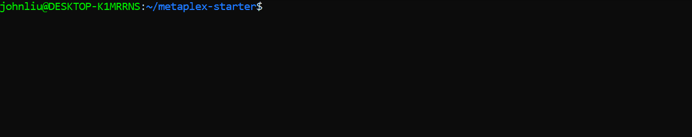

# Challenge

Now it’s your turn to build something independently. Create an new Candy Machine using your own images, metadata, and configuration.

You can build this from scratch or you can download the starter code here.

Recall that the sequence of steps are as follows:

1. Configure Candy Machine
2. Prepare assets
3. Verify assets
4. Upload Candy Machine
5. Verify upload
6. Mint NFTs
7. Withdraw Candy Machine
8. Sign collection
