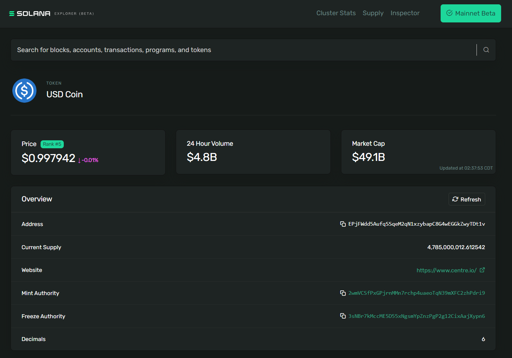
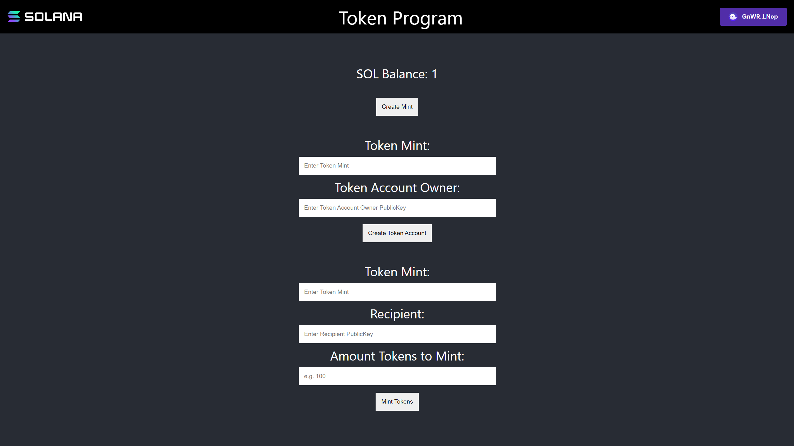

# Summary

- You may recall SOL is the 'native token' of Solana. All other tokens, fungible and non-fungible tokens (NFTs), are called **SPL Tokens**
- The **Token Program** contains instructions for creating and interacting with SPL Tokens
- **Token Mints** are accounts that define a specific token. This includes information about the token itself (like how many decimals it has), the account allowed to mint more tokens (called the **mint authority**), and where to find more information about the token like a description, image, etc. The mint authority can use the token mint to make more tokens! 
- **Token Accounts** hold tokens of a specific Token Mint. For most users, their balances of each token mint are stored in **Associated Token Accounts** - accounts with addresses made from their wallet address and the token's mint.
- Creating Token Mints and Token Accounts requires allocating **rent** in SOL. The rent for a Token Account can be refunded when the account is closed, however, Token Mints currently cannot be closed.

# Lesson

The Token Program is one of many programs made available by the Solana Program Library (SPL). It contains instructions for creating and interacting with SPL Tokens. These tokens represent all non-native (i.e. not SOL) tokens on the Solana network.

This lesson will focus on the basics of creating and managing a new SPL Token using the Token Program:
1. Creating a new Token Mint
2. Creating Token Accounts
3. Minting
4. Transferring tokens from one holder to another
5. Burning tokens

We'll be approaching this from the client side of the development process using the `@solana/spl-token` Javascript library.

## Token Mint

To create a new SPL Token you first have to create a Token Mint. A Token Mint is an account that holds data about a specific token.

As an example, let's look at [USD Coin (USDC) on the Solana Explorer](https://explorer.solana.com/address/EPjFWdd5AufqSSqeM2qN1xzybapC8G4wEGGkZwyTDt1v). USDC's Token Mint address is `EPjFWdd5AufqSSqeM2qN1xzybapC8G4wEGGkZwyTDt1v`. With the explorer, we can see the particular details about USDC's Token Mint such as the current supply of tokens, the addresses of the mint and freeze authorities, and the decimal precision of the token:



To create a new Token Mint, you need to send the right transaction instructions to the Token Program. To do this, we'll use the `createMint` function from `@solana/spl-token`.

```typescript
const tokenMint = await createMint(
  connection,
  payer,
  mintAuthority,
  freezeAuthority,
  decimal
);
```

 The `createMint` function returns the `publicKey` of the new token mint. This function requires the following arguments:

- `connection` - the JSON-RPC connection to the cluster
- `payer` - the public key of the payer for the transaction
- `mintAuthority` - the account that is authorized to do the actual minting of tokens from the token mint.
- `freezeAuthority` - an account authorized to freeze the tokens in a token account. If freezing is not a desired attribute, the parameter can be set to null
- `decimals` - specifies the desired decimal precision of the token

When creating a new mint from a script that has access to your secret key, you can simply use the `createMint` function. However, if you were to build a website to allow users to create a new token mint, you would need to do so with the user's secret key without making them expose it to the browser. In that case, you would want to build and submit a transaction with the right instructions.

Under the hood, the `createMint` function is simply creating a transaction that contains two instructions:
1. Create a new account
2. Initialize a new mint

This would look as follows:

```typescript
import * as web3 from '@solana/web3'
import * as token from '@solana/spl-token'

async function buildCreateMintTransaction(
  connection: web3.Connection,
  payer: web3.PublicKey,
  decimals: number
): Promise<web3.Transaction> {
  const lamports = await token.getMinimumBalanceForRentExemptMint(connection);
  const accountKeypair = web3.Keypair.generate();
  const programId = token.TOKEN_PROGRAM_ID

  const transaction = new web3.Transaction().add(
    web3.SystemProgram.createAccount({
      fromPubkey: payer,
      newAccountPubkey: accountKeypair.publicKey,
      space: token.MINT_SIZE,
      lamports,
      programId,
    }),
    token.createInitializeMintInstruction(
      accountKeypair.publicKey,
      decimals,
      payer,
      payer,
      programId
    )
  );

  return transaction
}
```

When manually building the instructions to create a new token mint, make sure you add the instructions for creating the account and initializing the mint to the *same transaction*. If you were to do each step in a separate transaction, it's theoretically possible for somebody else to take the account you create and initialize it for their own mint.

### Rent and Rent Exemption
Note that the first line in the function body of the previous code snippet contains a call to `getMinimumBalanceForRentExemptMint`, the result of which is passed into the `createAccount` function. This is part of account initialization called rent exemption.

Until recently, all accounts on Solana were required to do one of the following to avoid being deallocated:
1. Pay rent at specific intervals
2. Deposit enough SOL upon initialization to be considered rent-exempt

Recently, the first option was done away with and it became a requirement to deposit enough SOL for rent exemption when initializing a new account.

In this case, we're creating a new account for a token mint so we use `getMinimumBalanceForRentExemptMint` from the `@solana/spl-token` library. However, this concept applies to all accounts and you can use the more generic `getMinimumBalanceForRentExemption` method on `Connection` for other accounts you may need to create.

## Token Account

Before you can mint tokens (issue new supply), you need a Token Account to hold the newly issued tokens.

A Token Account holds tokens of a specific "mint" and has a specified "owner" of the account. Only the owner is authorized to decrease the Token Account balance (transfer, burn, etc.) while anyone can send tokens to the Token Account to increase its balance.

You can use the `spl-token` library's `createAccount` function to create the new Token Account:

```typescript
const tokenAccount = await createAccount(
  connection,
  payer,
  mint,
  owner,
  keypair
);
```

The `createAccount` function returns the `publicKey` of the new token account. This function requires the following arguments:

- `connection` - the JSON-RPC connection to the cluster
- `payer` - the account of the payer for the transaction
- `mint` - the token mint that the new token account is associated with
- `owner` - the account of the owner of the new token account
- `keypair` - this is an optional parameter for specifying the new token account address. If no keypair is provided, the `createAccount` function defaults to a derivation from the associated `mint` and `owner` accounts.

Please note that this `createAccount` function is different from the `createAccount` function shown above when we looked under the hood of the `createMint` function. Previously we used the `createAccount` function on `SystemProgram` to return the instruction for creating all accounts. The `createAccount` function here is a helper function in the `spl-token` library that submits a transaction with two instructions. The first creates the account and the second initializes the account as a Token Account.

Like with creating a Token Mint, if we needed to build the transaction for `createAccount` manually we could duplicate what the function is doing under the hood:
1. Use `getMint` to retrieve the data associated with the `mint`
2. Use `getAccountLenForMint` to calculate the space needed for the token account
3. Use `getMinimumBalanceForRentExemption` to calculate the lamports needed for rent exemption
4. Create a new transaction using `SystemProgram.createAccount` and `createInitializeAccountInstruction`. Note that this `createAccount` is from `@solana/web3.js` and used to create a generic new account. The `createInitializeAccountInstruction` uses this new account to initialize the new token account

```typescript
import * as web3 from '@solana/web3'
import * as token from '@solana/spl-token'

async function buildCreateTokenAccountTransaction(
  connection: web3.Connection,
  payer: web3.PublicKey,
  mint: web3.PublicKey
): Promise<web3.Transaction> {
  const mintState = await token.getMint(connection, mint)
  const accountKeypair = await web3.Keypair.generate()
  const space = token.getAccountLenForMint(mintState);
  const lamports = await connection.getMinimumBalanceForRentExemption(space);
  const programId = token.TOKEN_PROGRAM_ID

  const transaction = new web3.Transaction().add(
    web3.SystemProgram.createAccount({
      fromPubkey: payer,
      newAccountPubkey: accountKeypair.publicKey,
      space,
      lamports,
      programId,
    }),
    token.createInitializeAccountInstruction(
      accountKeypair.publicKey,
      mint,
      payer,
      programId
    )
  );

  return transaction
}
```

### Associated Token Accounts

An Associated Token Account stores tokens in an address made from:

 - The owner's public key
 - The token mint

For example, Bob's USDC is stored in an Associated Token Account made from Bob's public key, and the USDC mint address. 

Associated Token Accounts provide a deterministic way to find the Token Account owned by a specific `publicKey` for a specific token. 

There are other ways to create token accounts (particularly for onchain programs), but nearly all the time you want to store tokens for a user, you'll want it to be an Associated Token Account. Even if the user doesn't already have an ATA for that token, you can simply find the address and make the account for them.  


You can create an associated token account using the `spl-token` library's `createAssociatedTokenAccount` function.

```typescript
const associatedTokenAccount = await createAssociatedTokenAccount(
  connection,
	payer,
	mint,
	owner,
);
```

This function returns the `publicKey` of the new associated token account and requires the following arguments:

- `connection` - the JSON-RPC connection to the cluster
- `payer` - the account of the payer for the transaction
- `mint` - the token mint that the new token account is associated with
- `owner` - the account of the owner of the new token account

You can also use `getOrCreateAssociatedTokenAccount` to get the Token Account associated with a given address or create it if it doesn't exist. For example, if you were writing code to airdrop tokens to a given user, you'd likely use this function to ensure that the token account associated with the given user gets created if it doesn't already exist.

Under the hood, `createAssociatedTokenAccount` is doing two things:

1. Using `getAssociatedTokenAddress` to derive the associated token account address from the `mint` and `owner`
2. Building a transaction using instructions from `createAssociatedTokenAccountInstruction`

```typescript
import * as web3 from '@solana/web3'
import * as token from '@solana/spl-token'

async function buildCreateAssociatedTokenAccountTransaction(
  payer: web3.PublicKey,
  mint: web3.PublicKey
): Promise<web3.Transaction> {
  const associatedTokenAddress = await token.getAssociatedTokenAddress(mint, payer, false);

  const transaction = new web3.Transaction().add(
    token.createAssociatedTokenAccountInstruction(
      payer,
      associatedTokenAddress,
      payer,
      mint
    )
  )

  return transaction
}
```

## Mint Tokens

Minting tokens is the process of issuing new tokens into circulation. When you mint tokens, you increase the supply of the token mint and deposit the newly minted tokens into a token account. Only the mint authority of a token mint is allowed to mint new tokens.

To mint tokens using the `spl-token` library, you can use the `mintTo` function.

```typescript
const transactionSignature = await mintTo(
  connection,
  payer,
  mint,
  destination,
  authority,
  amount
);
```

The `mintTo` function returns a `TransactionSignature` that can be viewed on the Solana Explorer. The `mintTo` function requires the following arguments:

- `connection` - the JSON-RPC connection to the cluster
- `payer` - the account of the payer for the transaction
- `mint` - the token mint that the new token account is associated with
- `destination` - the token account that tokens will be minted to
- `authority` - the account authorized to mint tokens
- `amount` - the raw amount of tokens to mint outside of decimals, e.g. if Scrooge Coin mint's decimals property was set to 2 then to get 1 full Scrooge Coin you would need to set this property to 100

It's not uncommon to update the mint authority on a token mint to null after the tokens have been minted. This would set a maximum supply and ensure no tokens can be minted in the future. Conversely, minting authority could be granted to a program so tokens could be automatically minted at regular intervals or according to programmable conditions.

Under the hood, the `mintTo` function simply creates a transaction with the instructions obtained from the `createMintToInstruction` function.

```typescript
import * as web3 from '@solana/web3'
import * as token from '@solana/spl-token'

async function buildMintToTransaction(
  authority: web3.PublicKey,
  mint: web3.PublicKey,
  amount: number,
  destination: web3.PublicKey
): Promise<web3.Transaction> {
  const transaction = new web3.Transaction().add(
    token.createMintToInstruction(
      mint,
      destination,
      authority,
      amount
    )
  )

  return transaction
}
```

## Transfer Tokens

SPL Token transfers require both the sender and receiver to have token accounts for the mint of the tokens being transferred. The tokens are transferred from the sender’s token account to the receiver’s token account.

You can use `getOrCreateAssociatedTokenAccount` when obtaining the receiver's associated token account to ensure their token account exists before the transfer. If the account doesn't exist already, this function will create it and the payer on the transaction will be debited the lamports required for the account creation.

Once you know the receiver's token account address, you transfer tokens using the `spl-token` library's `transfer` function.

```typescript
const transactionSignature = await transfer(
  connection,
  payer,
  source,
  destination,
  owner,
  amount
)
```

The `transfer` function returns a `TransactionSignature` that can be viewed on the Solana Explorer. The `transfer` function requires the following arguments:

- `connection` - the JSON-RPC connection to the cluster
- `payer` - the account of the payer for the transaction
- `source` - the token account sending tokens
- `destination` - the token account receiving tokens
- `owner` - the account of the owner of the `source` token account
- `amount` - the number of tokens to transfer


Under the hood, the `transfer` function simply creates a transaction with the instructions obtained from the `createTransferInstruction` function:

```typescript
import * as web3 from '@solana/web3'
import * as token from '@solana/spl-token'

async function buildTransferTransaction(
  source: web3.PublicKey,
  destination: web3.PublicKey,
  owner: web3.PublicKey,
  amount: number
): Promise<web3.Transaction> {
  const transaction = new web3.Transaction().add(
    token.createTransferInstruction(
      source,
      destination,
      owner,
      amount,
    )
  )

  return transaction
}
```

# Lab

We’re going to use the Token Program to create a Token Mint, create an Associated Token Account, mint tokens, approve a delegate, transfer tokens, and burn tokens.

Assuming you already have a `.env` file with a `SECRET_KEY` setup per [Cryptography fundamentals](./intro-to-cryptography).

```bash
npm i @solana/web3.js @solana/spl-token @solana-developers/helpers esrun
```

### 1. Create the Token Mint

Create an empty file called `create-token-mint.ts`. After loading our keypairs, we'll call `createMint()`, setting our `user` as the `payer`, `mintAuthority`, and `freezeAuthority`.

Think of the token mint as the factory that makes tokens. Our `user`, as the `mintAuthority` is the person that runs the factory. 

```typescript
import { createMint } from "@solana/spl-token";
import "dotenv/config";
import {
  getKeypairFromEnvironment,
  getExplorerLink,
} from "@solana-developers/helpers";
import { Connection, clusterApiUrl } from "@solana/web3.js";

const connection = new Connection(clusterApiUrl("devnet"));

const user = getKeypairFromEnvironment("SECRET_KEY");

console.log(
  `🔑 Loaded our keypair securely, using an env file! Our public key is: ${user.publicKey.toBase58()}`
);

// This is a shortcut that runs:
// SystemProgram.createAccount
// token.createInitializeMintInstruction
// See https://www.soldev.app/course/token-program
const tokenMint = await createMint(connection, user, user.publicKey, null, 2);

const link = getExplorerLink("address", tokenMint.toString(), "devnet");

console.log(`✅ Finished! Created token mint: ${link}`);
```

Run the script using `npx esrun create-token-mint.ts`. You should see 

```bash
✅ Finished! Created token mint: https://explorer.solana.com/address/HYeUCAqdsQBkqQNHRoBPov42QySDhwM7zAqiorToosbz?cluster=devnet
```

Open up Solana Explorer and look at your new token!

Remember the address of the mint! We'll use this later.

### 2. Make some token metadata

You'll notice our token account does not have a pretty symbol and shows up as 'Unknown Token' in Explorer. That's because our token has no metadata! Let's add some.

We'll use the Metaplex `mpl-token-metadata` Program, version 2. This is the most popular version of `mpl-token-metadata` and saves significant complexity compared to the newer version 3.

```bash
npm i @metaplex-foundation/mpl-token-metadata@2
```

Create a new file called `create-token-metadata.ts`

```typescript
// This uses "@metaplex-foundation/mpl-token-metadata@2" to create tokens
import "dotenv/config";
import {
  getKeypairFromEnvironment,
  getExplorerLink,
} from "@solana-developers/helpers";
import {
  Connection,
  clusterApiUrl,
  PublicKey,
  Transaction,
  sendAndConfirmTransaction,
} from "@solana/web3.js";
import { createCreateMetadataAccountV3Instruction } from "@metaplex-foundation/mpl-token-metadata";

const user = getKeypairFromEnvironment("SECRET_KEY");

const connection = new Connection(clusterApiUrl("devnet"));

console.log(
  `🔑 We've loaded our keypair securely, using an env file! Our public key is: ${user.publicKey.toBase58()}`
);

const TOKEN_METADATA_PROGRAM_ID = new PublicKey(
  "metaqbxxUerdq28cj1RbAWkYQm3ybzjb6a8bt518x1s"
);

// Subtitute in your token mint account
const tokenMintAccount = new PublicKey("YOUR_TOKEN_MINT_ADDRESS_HERE");

const metadataData = {
  name: "Solana Training Token",
  symbol: "TRAINING",
  // Arweave / IPFS / Pinata etc link using metaplex standard for off-chain data
  uri: "https://arweave.net/1234",
  sellerFeeBasisPoints: 0,
  creators: null,
  collection: null,
  uses: null,
};

const metadataPDAAndBump = PublicKey.findProgramAddressSync(
  [
    Buffer.from("metadata"),
    TOKEN_METADATA_PROGRAM_ID.toBuffer(),
    tokenMintAccount.toBuffer(),
  ],
  TOKEN_METADATA_PROGRAM_ID
);

const metadataPDA = metadataPDAAndBump[0];

const transaction = new Transaction();

const createMetadataAccountInstruction =
  createCreateMetadataAccountV3Instruction(
    {
      metadata: metadataPDA,
      mint: tokenMintAccount,
      mintAuthority: user.publicKey,
      payer: user.publicKey,
      updateAuthority: user.publicKey,
    },
    {
      createMetadataAccountArgsV3: {
        collectionDetails: null,
        data: metadataData,
        isMutable: true,
      },
    }
  );

transaction.add(createMetadataAccountInstruction);

const transactionSignature = await sendAndConfirmTransaction(
  connection,
  transaction,
  [user]
);

const transactionLink = getExplorerLink(
  "transaction",
  transactionSignature,
  "devnet"
);

console.log(`✅ Transaction confirmed, explorer link is: ${transactionLink}!`);

const tokenMintLink = getExplorerLink(
  "address",
  tokenMintAccount.toString(),
  "devnet"
);

console.log(`✅ Look at the token mint again: ${tokenMintLink}!`);
```

You'll now see Solana Explorer is updated, showing the token's name and symbol on the mint!

Note that Solana Explorer will display a warning like:

> Warning! Token names and logos are not unique. This token may have spoofed its name and logo to look like another token. Verify the token's mint address to ensure it is correct.

This warning is accurate - indeed anyone can make any token have any symbol or name they like. However for your reference, if you are making an original token that becomes very well known, Solana Explorer uses a whitelist based on the [Unified Token List API](https://github.com/solflare-wallet/utl-api).

### 3. Create an Associated Token Account to store the tokens

Now that we've created the mint, let's create a new Associated Token Account so that someone can store our tokens. This Associated Token Account could be for our wallet (if we, as the token mint authority, want to mint tokens to our address) or anyone else we know with a devnet wallet! 

Create an empty file called `create-token-account.ts`. Then use `getOrCreateAssociatedTokenAccount()` to get an associated token account based on a wallet and our mint address, making the account if it needs to.

Remember to substitute in your token mint address below!

```typescript
import { getOrCreateAssociatedTokenAccount } from "@solana/spl-token";
import "dotenv/config";
import {
  getExplorerLink,
  getKeypairFromEnvironment,
} from "@solana-developers/helpers";
import { Connection, PublicKey, clusterApiUrl } from "@solana/web3.js";
const connection = new Connection(clusterApiUrl("devnet"));

const user = getKeypairFromEnvironment("SECRET_KEY");

console.log(
  `🔑 Loaded our keypair securely, using an env file! Our public key is: ${user.publicKey.toBase58()}`
);

// Subtitute in your token mint account from create-token-mint.ts
const tokenMintAccount = new PublicKey(
  "YOUR_TOKEN_MINT"
);

// Here we are making an associated token account for our own address, but we can 
// make an ATA on any other wallet in devnet!
// const recipient = new PublicKey("SOMEONE_ELSES_DEVNET_ADDRESS");
const recipient = user.publicKey;

const tokenAccount = await getOrCreateAssociatedTokenAccount(
  connection,
  user,
  tokenMintAccount,
  recipient
);

console.log(`Token Account: ${tokenAccount.address.toBase58()}`);

const link = getExplorerLink(
  "address",
  tokenAccount.address.toBase58(),
  "devnet"
);

console.log(`✅ Created token Account: ${link}`);

```

Run the script using `npx esrun create-token-mint.ts`. You should see: 

```bash
✅ Success! Created token account: https://explorer.solana.com/address/CTjoLdEeK8rk4YWYW9ZqACyjHexbYKH3hEoagHxLVEFs?cluster=devnet
```

Open the token account in Solana Explorer. Look at the owner - it's the account you made the ATA for! The balance will be zero, as we haven't sent any tokens there yet. Let's mint some tokens there and fix that!

### 4. Mint Tokens

Now that we have a token mint and a token account, let's mint tokens to the token account. Recall that we set the `user` as the `mintAuthority` for the `mint` we created.

Create a function `mintTokens` that uses the `spl-token` function `mintTo` to mint tokens:

```typescript
import { mintTo } from "@solana/spl-token";
import "dotenv/config";
import {
  getExplorerLink,
  getKeypairFromEnvironment,
} from "@solana-developers/helpers";
import { Connection, PublicKey, clusterApiUrl } from "@solana/web3.js";
const connection = new Connection(clusterApiUrl("devnet"));

// Our token has two decimal places
const MINOR_UNITS_PER_MAJOR_UNITS = Math.pow(10, 2);

const user = getKeypairFromEnvironment("SECRET_KEY");

// Subtitute in your token mint account from create-token-mint.ts
const tokenMintAccount = new PublicKey(
  "YOUR_TOKEN_MINT_ACCOUNT"
);

// Substitute in your own, or a friend's token account address, based on the previous step.
const recipientAssociatedTokenAccount = new PublicKey(
  "RECIPIENT_TOKEN_ACCOUNT"
);

const transactionSignature = await mintTo(
  connection,
  user,
  tokenMintAccount,
  recipientAssociatedTokenAccount,
  user,
  10 * MINOR_UNITS_PER_MAJOR_UNITS
);

const link = getExplorerLink("transaction", transactionSignature, "devnet");

console.log(`✅ Success! Mint Token Transaction: ${link}`);
```

Run the script using `npx esrun mint-tokens.ts`. You should see: 

```bash
✅ Success! Mint Token Transaction: https://explorer.solana.com/tx/36U9ELyJ2VAZSkeJKj64vUh9cEzVKWznESyqFCJ92sj1KgKwrFH5iwQsYmjRQDUN2uVhcbW8AVDsNaiNuPZ7n9m4?cluster=devnet
```

Open Explorer, and see the transaction and the new tokens in the recipient's account!

### 5. Transfer Tokens

Next, let's transfer some of the tokens we just minted using the `spl-token` library's `transfer` function. You can [add a second account on devnet](./intro-to-cryptography) if you like, or find a friend who has a devnet account and send them your token!

As you saw in Explorer, the tokens currently reside in an Associated Token Account attached to our wallet. We don't have to remember the address for our associated token account - we can just look it up using `getOrCreateAssociatedTokenAccount()` and providing our address and the mint of the token we want to send. Likewise, we can find (or make) an ATA for our recipient to hold this token too.

```typescript
import "dotenv/config";
import {
  getExplorerLink,
  getKeypairFromEnvironment,
} from "@solana-developers/helpers";
import { Connection, PublicKey, clusterApiUrl } from "@solana/web3.js";
import { getOrCreateAssociatedTokenAccount, transfer } from "@solana/spl-token";
const connection = new Connection(clusterApiUrl("devnet"));

const sender = getKeypairFromEnvironment("SECRET_KEY");

console.log(
  `🔑 Loaded our keypair securely, using an env file! Our public key is: ${sender.publicKey.toBase58()}`
);

// Add the recipient public key here.
const recipient = new PublicKey("YOUR_RECIPIENT_HERE");

// Subtitute in your token mint account
const tokenMintAccount = new PublicKey("YOUR_TOKEN_MINT_ADDRESS_HERE");

// Our token has two decimal places
const MINOR_UNITS_PER_MAJOR_UNITS = Math.pow(10, 2);

console.log(`💸 Attempting to send 1 token to ${recipient.toBase58()}...`);

// Get or create the source and destination token accounts to store this token
const sourceTokenAccount = await getOrCreateAssociatedTokenAccount(
  connection,
  sender,
  tokenMintAccount,
  sender.publicKey
);

const destinationTokenAccount = await getOrCreateAssociatedTokenAccount(
  connection,
  sender,
  tokenMintAccount,
  recipient
);

// Transfer the tokens
const signature = await transfer(
  connection,
  sender,
  sourceTokenAccount.address,
  destinationTokenAccount.address,
  sender,
  1 * MINOR_UNITS_PER_MAJOR_UNITS
);

const explorerLink = getExplorerLink("transaction", signature, "devnet");

console.log(`✅ Transaction confirmed, explorer link is: ${explorerLink}!`);
```

Open the Explorer link. You see your balance go down, and the recipient's balance go up!

# Challenge

Now it’s your turn to build something independently. Create an application that allows a user to create a new mint, create a token account, and mint tokens.

Note that you will not be able to directly use the helper functions we went over in the lab. To interact with the Token Program using the Phantom wallet adapter, you will have to build each transaction manually and submit the transaction to Phantom for approval.



1. You can build this from scratch or you can [download the starter code](https://github.com/Unboxed-Software/solana-token-frontend/tree/starter).
2. Create a new Token Mint in the `CreateMint` component.
  If you need a refresher on how to send transactions to a wallet for approval, have a look at the [Wallets lesson](./interact-with-wallets).

  When creating a new mint, the newly generated `Keypair` will also have to sign the transaction. When additional signers are required in addition to the connected wallet, use the following format:

  ```typescript
  sendTransaction(transaction, connection, {
    signers: [Keypair],
  })
  ```
3. Create a new Token Account in the `CreateTokenAccount` component.
4. Mint tokens in the `MintToForm` component.

If you get stumped, feel free to reference the [solution code](https://github.com/ZYJLiu/solana-token-frontend).

And remember, get creative with these challenges and make them your own!


## Completed the lab?

Push your code to GitHub and [tell us what you thought of this lesson](https://form.typeform.com/to/IPH0UGz7#answers-lesson=72cab3b8-984b-4b09-a341-86800167cfc7)!
