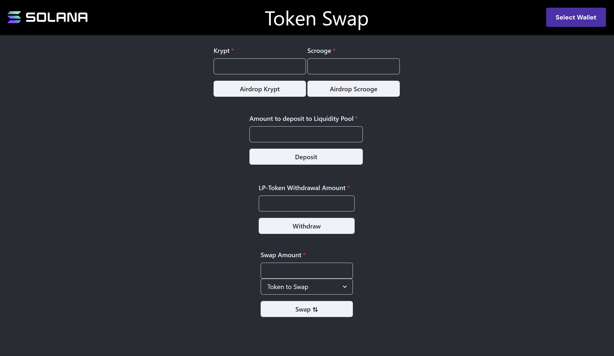

# Token Swap

# Lesson Objectives

*By the end of this lesson, you will be able to:*

- Create a token swap pool
- Deposit liquidity
- Withdraw liquidity
- Swap tokens

# TL;DR

- The **token swap program** is an SPL contract deployed to Mainnet and Devnet available for use by developers and protocols.
- The program accepts six different **instructions**, all of which we will explore in this lesson.
- Developers are able to create and use **liquidity pools** to swap between any SPL token that they wish.
- The program uses a mathematical formula called "**curve**" to calculate the price of all trades. Curves aim to mimic normal market dynamics: for example, as traders buy a lot of one token type, the value of the other token type goes up.

# Overview

## Swap Pools

Before we get into how to create and interact with swap pools on Solana, it’s important we understand the basics of what a swap pool is. A swap pool is an aggregation of two different tokens with the purpose of providing liquidity to facilitate exchange between each token.

Users provide liquidity to these pools by depositing their own tokens into each pool. These users are called liquidity providers. When a liquidity provider (or LP) deposits some tokens to the swap pool, LP-tokens are minted that represent the LP's fractional ownership in the pool. 

Most swap pools charge a transaction fee for facilitating each swap. These transactions fees are then paid out to the LP’s in proportion to the amount of liquidity they are providing in the pool. This provides incentive for LP's to provide liquidity to the pool.

When an LP is ready to withdraw their deposited liquidity, their LP-tokens are burned and tokens from the pool (proportional to the amount of LP-tokens burned) are sent to their wallet.

The purpose of swap pools is to facilitate decentralized trade between users. In traditional finance, users execute trades like this through a centralized exchange on a central limit [order book](https://www.investopedia.com/terms/o/order-book.asp). Generally, this requires a trusted third-party intermediary. 

Due to the decentralized nature of cryptocurrency, however, we now have a new way to facilitate trades. Many protocols decentralized exchanges have been built to take advantage of this. [Project Serum](https://www.projectserum.com/) is an example of such a decentralized central limit order book built on Solana.

Since swap pools are completely decentralized, anybody can issue instructions to the swap program to create a new swap pool between any SPL tokens they wish. This is a massive lift beyond traditional finance. Swap pools and Automated Market Makers (AMMs) are one of DeFi's most fascinating and complex topics. The nitty-gritty details of how they work are outside the scope of this lesson, but there is a ton of material out there available to you if you’re interested in learning more. For example, the Solana Token Swap program was heavily inspired by [Uniswap](https://uniswap.org/) and [Balancer](https://balancer.fi/), each of which provide excellent documentation that you can read through.

## Creating a Swap Pool

Creating swap pools with the SPL token swap program really showcases the account, instruction, and authorization models on Solana. This lesson will combine and build on top of a lot of what we have learned so far in the course. For operations specific to the Token Swap Program, we'll use the `@solana/spl-token-swap` library.

As we talk through creating a swap pool, we'll assume we're creating a swap pool for two tokens named Token A and Token B. Creating the swap pool with the `spl-token-swap` library is as simple as sending a transaction with an instruction created with the `TokenSwap.createInitSwapInstruction` function. However, there are a number of accounts you need to create or derive beforehand that will be needed when creating that instruction:
1. **Token swap account** - holds information about the swap pool
2. **Swap pool authority** - the account used to sign transactions on behalf of the swap program
3. **Token accounts for Token A and Token B** - associated token accounts for each of the tokens and the swap pool
4. **Pool token mint** - the mint for the swap pool's LP-token
5. **Pool token account** - the token account for the pool token mint
6. **Pool token fee account** - the account that gets paid the swap pool's transaction fees

### Token Swap State Account

Before you can create a swap pool, you'll need to create a token swap state account. This account will be used to hold information about the swap pool itself. 

To create the token swap state account, you use the `SystemProgram` instruction `createAccount`.

```tsx
import * as web3 from '@solana/web3'
import { TokenSwap, TOKEN_SWAP_PROGRAM_ID, TokenSwapLayout } from "@solana/spl-token-swap"

const transaction = new Web3.Transaction()
const tokenSwapStateAccount = Web3.Keypair.generate()
const rent = TokenSwap.getMinBalanceRentForExemptTokenSwap(connection)
const tokenSwapStateAccountInstruction = await Web3.SystemProgram.createAccount({
    newAccountPubkey: tokenSwapStateAccount.publicKey,
    fromPubkey: wallet.publicKey,
    lamports: rent,
    space: TokenSwapLayout.span,
    programId: TOKEN_SWAP_PROGRAM_ID
})
transaction.add(tokenSwapStateAccountInstruction)
```

A few items to note from this example:
1. You can get the number of lamports required for rent exemption using `TokenSwap.getMinBalanceRentForExemptTokenSwap` from the `spl-token-swap` library.
2. Similarly, you can use `TokenSwapLayout.span` for the space required on the account.
3. `programId` must be set to `TOKEN_SWAP_PROGRAM_ID`. This sets the owner of the new account to be the Token Swap Program itself. The Token Swap Program will need to write data to the new account and so must be set as the owner.

### Swap Pool Authority

The swap pool authority is the account used to sign for transactions on behalf of the swap program. This account is a Program Derived Address (PDA) derived from the Token Swap Program and the token swap state account. 

PDAs can only be created by their owning program, so you don't need to create this account directly. You do, however, need to know its public key. You can discover it using the `@solana/web3` library's `PublicKey.findProgramAddress` function.

```tsx
const [swapAuthority, bump] = await Web3.PublicKey.findProgramAddress(
    [tokenSwapStateAccount.publicKey.toBuffer()],
    TOKEN_SWAP_PROGRAM_ID,
)
```

The resulting public key will be used as the authority on a number of the accounts that follow.

### Token accounts for Token A and Token B

Token A and Token B accounts are associated token accounts used for the actual swap pool. These accounts must contain some number of A/B tokens respectively and the swap authority PDA must be marked as the owner of each so that the Token Swap Program can sign for transactions and transfer tokens from each account.

```tsx
let tokenAAccountAddress = await token.getAssociatedTokenAddress(
    tokenAMint, // mint
    swapAuthority, // owner
    true // allow owner off curve
)
  
const tokenAAccountInstruction = await token.createAssociatedTokenAccountInstruction(
    wallet.publicKey, // payer
    tokenAAccountAddress, // ata
    swapAuthority, // owner
    tokenAMint // mint
)

transaction.add(tokenAAccountInstruction)
```

If you need a refresher on creating token accounts, have a look at the [Token Program lesson](./token-program.md).

### Pool Token Mint

The pool token mint is the mint of the LP-tokens that represent an LP’s ownership in the pool. You create this mint the way you learned in the [Token Program lesson](./token-program.md). For the swap pool to work, the mint authority must be the swap authority account.

```tsx
const poolTokenMint = await token.createMint(
    connection,
    wallet,
    swapAuthority,
    null,
    2
)
```

### Pool Token Recipient Account

The pool token recipient account is the account the liquidity pool tokens (representing an LP's deposited liquidity in the pool) will be minted to.

```tsx
const tokenAccountPool = Web3.Keypair.generate()
const rent = await token.getMinimumBalanceForRentExemptAccount(connection)
const createTokenAccountPoolInstruction = Web3.SystemProgram.createAccount({
    fromPubkey: wallet.publicKey,
    newAccountPubkey: tokenAccountPool.publicKey,
    space: token.ACCOUNT_SIZE,
    lamports: rent,
    programId: token.TOKEN_PROGRAM_ID,
})
const initializeTokenAccountPoolInstruction = token.createInitializeAccountInstruction(
    tokenAccountPool.publicKey,
    poolTokenMint,
    wallet.publicKey
)

transaction.add(createTokenAccountPoolInstruction)
transaction.add(initializeTokenAccountPoolInstruction)
```

### Pool Token Fee Account

The pool token fee account is the token account that the fees for the token swaps are paid to. This account must be owned by a specific account defined in the swap program - that account has public key [HfoTxFR1Tm6kGmWgYWD6J7YHVy1UwqSULUGVLXkJqaKN](https://explorer.solana.com/address/HfoTxFR1Tm6kGmWgYWD6J7YHVy1UwqSULUGVLXkJqaKN?cluster=devnet).

```tsx
const feeOwner = new web3.PublicKey('HfoTxFR1Tm6kGmWgYWD6J7YHVy1UwqSULUGVLXkJqaKN')

let tokenFeeAccountAddress = await token.getAssociatedTokenAddress(
    poolTokenMint, // mint
    feeOwner, // owner
    true // allow owner off curve
)
  
const tokenFeeAccountInstruction = await token.createAssociatedTokenAccountInstruction(
    wallet.publicKey, // payer
    tokenFeeAccountAddress, // ata
    feeOwner, // owner
    poolTokenMint // mint
)

transaction.add(tokenFeeAccountInstruction)
```

### Create the swap pool

With all of the prerequisite accounts created, you can create the swap pool initialization instruction using `TokenSwap.createInitSwapInstruction` from the `spl-token-swap` library.

This function takes *a lot* of arguments. Let's talk through them.

The first 7 arguments are the prerequisite token accounts we just discussed. 

After that comes the constant representing the Token Program ID followed by the constant representing the Token Swap Program ID.

Next, there are 4 pairs of number arguments representing numerators and denominators for the trade fee, owner trade fee, owner withdraw fee, and host fee. Lets explain each of these:
1. **Trade fee** - 
2. **Owner trade fee** -
3. **Owner withdraw fee** -
4. **Host fee** -

Lastly, there's the curve type, which we'll discuss further later in the lesson.

```tsx
const createSwapInstruction = TokenSwap.createInitSwapInstruction(
    tokenSwapStateAccount,      // Token swap account
    swapAuthority,              // Swap pool authority
    tokenAAccountAddress,       // Token A token account
    tokenBAccountAddress,       // Token B token account
    poolTokenMint,              // Swap pool token mint
    tokenFeeAccountAddress,     // Token fee account
    tokenAccountPool.publicKey, // Swap pool token account
    token.TOKEN_PROGRAM_ID,     // Token Program ID
    TOKEN_SWAP_PROGRAM_ID,      // Token Swap Program ID
    0,                          // Trade fee numerator
    10000,                      // Trade fee denominator
    5,                          // Owner trade fee numerator
    10000,                      // Owner trade fee denominator
    0,                          // Owner withdraw fee numerator
    0,                          // Owner withdraw fee denominator
    20,                         // Host fee numerator
    100,                        // Host fee denominator
    CurveType.ConstantProduct   // Curve type
)

transaction.add(createSwapInstruction)
```

Once the transaction with this instruction successfully executes, the swap pool is ready to be used.

## Interacting with Swap Pools

Once the swap pool is initialized, the Token Swap Program has a few different instructions for using a swap pool. These include:
1. Executing a swap
2. Depositing liquidity
3. Withdrawing liquidity

### Execute a swap

Once a pool is created, users can immediately begin trading on it using the `swap` instruction. The swap instruction transfers funds from a user's source token account into the swap's source token account, and then transfers tokens from its destination token account into the user's destination token account.

Since Solana programs require all accounts to be declared in the instruction, users need to gather all account information from the pool state account: the token A and B accounts, pool token mint, and fee account.

### Deposit liquidity

The token swap program has two variations of deposit instructions. One allows users to only deposit tokens to one side of the swap pool at a time. The other allows for depositing to both sides of the swap pool at the same time.

In order to deposit liquidity to both sides of the swap pool, a user’s wallet must have a sufficient amount of each token beforehand. This will not be a problem for us because we can just airdrop ourselves as many tokens as we’d like, but it is something to keep in mind.

One caveat with the way the [token swap program implements this instruction](https://github.com/solana-labs/solana-program-library/blob/master/token-swap/program/src/processor.rs#L496) is that it expects the following as input data

- `pool_token_amount: u64`
- `maximum_token_a_amount: u64`
- `maximum_token_b_amount: u64`

Instead of providing the amount of tokens you would like to deposit, you’re expected to provide the program with the amount of LP-tokens you’d like to receive and it will calculate how many tokens that translates to with the pool’s given Curve and current liquidity. As long as the amount it derives is less than `maximum_token_a_amount` and `maximum_token_b_amount`, the program will transfer the derived amounts of the tokens and mint the user the amount of LP-tokens passed in the instruction. The `maximum_token_a_amount` and `maximum_token_b_amount` parameters are used to prevent slippage.

Remember, a transaction instruction is made up of 3 key components:

- array of AccountInfo’s of all accounts involved
- serialized data buffer
- program_id of the program the instruction is directed at


### Withdraw liquidity

To allow any trading, the pool needs liquidity provided from the outside. Using the `deposit_single_token_type_exact_amount_in` or `deposit_all_token_types` instructions, anyone can provide liquidity for others to trade. In exchange for providing this needed liquidity, depositors receive pool tokens representing their fractional ownership of all A and B tokens in the pool.

At any time, pool token holders may redeem their pool tokens in exchange for tokens A and B, returned at the current "fair" exchange rate as determined by the curve. In the `withdraw_all_token_types` or `withdraw_single_token_type_exact_amount_out` instructions, pool tokens are burned, and tokens A and B are transferred into the user's accounts.

## Curves

Trading curves are at the core of how swap pools and AMMs (Automated Market Makers) operate. The trading curve is the function that the token swap program uses to calculate how much of a destination token will be provided given an amount of source token. The curve essentially sets the market price of the tokens in the pool.

The pool we’ll be interacting with in this lesson employs a [Constant Product](https://spl.solana.com/token-swap#curves) Curve Function. The constant product curve is the well-known Uniswap and Balancer style curve which preserves an invariant on all swaps. This invariant can be expressed as the product of the quantity of token A and token B in the swap pool.

```tsx
A_total * B_total = invariant
```

If we have 100 token A and 5,000 token B, our invariant is 500,000.

Now, if a trader wishes to put in a specific amount token A for some amount of token B, the calculation becomes a matter of resolving "B_out" where:

```tsx
(A_total + A_in) * (B_total - B_out) = invariant
```

Putting in the 10 token A along with our invariant of half a million, we would need to solve for "B_out" like so:

```tsx
(100 + 10) * (5,000 - B_out) = 500,000
5,000 - B_out = 500,000 / 110
5,000 - (500,000 / 110) = B_out
B_out = 454.5454...
```

The product of the amount of token A and token B must always equal a constant, hence the name ‘Constant Product’. More information can be found on the [Uniswap whitepaper](https://uniswap.org/whitepaper.pdf) and the [Balancer whitepaper](https://balancer.fi/whitepaper.pdf).

# Demo

For this demo, a token pool of two brand new tokens has been created and is live on Devnet. We'll walk through building out a frontend UI to interact with this swap pool! Since the pool is already made, we don't have to worry about initiating the pool and funding it with tokens. Instead, we'll focus on building out the instructions for

- depositing liquidity to the pool
- withdrawing your deposited liquidity
- swapping from one token to the other



### 1. Download the starter code

Before we get started, go ahead and download the [starter code](https://github.com/Unboxed-Software/solana-token-swap-frontend/tree/starter).

The project is a fairly simple Next.js application re-using a lot of what was previously built out for the demos in the first lesson. As you can see from the image above, there are a few different text inputs and `Buttons` - all of which will submit transactions to the blockchain on the user's behalf. Our focus in this demo will be creating the instructions that the last three buttons will submit. 

The airdrop buttons are already implemented and should work out of the box. They utilize an airdrop program that's deployed on Devnet at address [CPEV4ibq2VUv7UnNpkzUGL82VRzotbv2dy8vGwRfh3H3](https://explorer.solana.com/address/CPEV4ibq2VUv7UnNpkzUGL82VRzotbv2dy8vGwRfh3H3?cluster=devnet). You can mint as many tokens as you'd like to your wallet to interact with the pool.

### 2. Create the Deposit Instruction

Of the two variations of deposit instructions on the Token Swap Program, we'll be using the variation that provides liquidity to both sides of the swap pool at once: `TokenSwap.depositAllTokenTypesInstruction`.

The deposit instruction should be added inside the `/components/Deposit.tsx` file inside the `handleTransactionSubmit` function. This function is called when the user clicks the Deposit button. 

We’ll start by deriving three associated token account addresses:
1. The associated token account corresponding to the user's wallet address and Krypt Coin
2. The associated token account corresponding to the user's wallet address and Scrooge Coin
3. The associated token account corresponding to the user's wallet address and the swap pools LP token

There are a number of ways to do this, but we'll use the helper function `getAssociatedTokenAddress` from the `spl-token` library.

```tsx
const handleTransactionSubmit = async (deposit: DepositAllSchema) => {
    if (!publicKey) {
        alert('Please connect your wallet!')
        return
    }
	// these are the accounts that hold the tokens
    const kryptATA = await token.getAssociatedTokenAddress(kryptMint, publicKey)
    const scroogeATA = await token.getAssociatedTokenAddress(ScroogeCoinMint, publicKey)
	const token_account_pool = await token.getAssociatedTokenAddress(pool_mint, publicKey)
}
```

Next, we need to check if the `tokenAccountPool` address we just derived has an already initialized account or not. We'll use the `getAccountInfo` function from the `@solana/web3` library to get the account info associated with `tokenAccountPool`. This function will return an `AccountInfo` struct if the account exists or `null` otherwise. If `null` is returned, we'll need to create the account.

Since the `handleTransactionSubmit` function is already going to be submitting a transaction, we'll simply add the instruction for creating an associated account to the same transaction rather than submit multiple.

```tsx
const handleTransactionSubmit = async (deposit: DepositAllSchema) => {
    if (!publicKey) {
        alert('Please connect your wallet!')
        return
    }

    const kryptATA = await token.getAssociatedTokenAddress(kryptMint, publicKey)
    const scroogeATA = await token.getAssociatedTokenAddress(ScroogeCoinMint, publicKey)
    const tokenAccountPool = await token.getAssociatedTokenAddress(pool_mint, publicKey)

    const transaction = new Web3.Transaction()

    let account = await connection.getAccountInfo(tokenAccountPool)

    if (account == null) {
        const createATAInstruction =
            token.createAssociatedTokenAccountInstruction(
                publicKey,
                tokenAccountPool,
                publicKey,
                pool_mint
            )
        transaction.add(createATAInstruction)
    }
}
```

Finally, we can create and add the deposit instruction using the `spl-token-swap` libary's `TokenSwap.depositAllTokenTypesInstruction` helper function. With that instruction added to the transaction, we can submit the transaction.

```tsx
const handleTransactionSubmit = async () => {
    if (!publicKey) {
        alert('Please connect your wallet!')
        return
    }

    const kryptATA = await token.getAssociatedTokenAddress(kryptMint, publicKey)
    const scroogeATA = await token.getAssociatedTokenAddress(ScroogeCoinMint, publicKey)
    const tokenAccountPool = await token.getAssociatedTokenAddress(poolMint, publicKey)

    const transaction = new Web3.Transaction()

    let account = await connection.getAccountInfo(tokenAccountPool)

    if (account == null) {
        const createATAInstruction =
            token.createAssociatedTokenAccountInstruction(
                publicKey,
                tokenAccountPool,
                publicKey,
                poolMint
            )
        transaction.add(createATAInstruction)
    }

    const instruction = TokenSwap.depositAllTokenTypesInstruction(
        tokenSwapStateAccount,
        swapAuthority,
        publicKey,
        kryptATA,
        scroogeATA,
        poolKryptAccount,
        poolScroogeAccount,
        poolMint,
        tokenAccountPool,
        TOKEN_SWAP_PROGRAM_ID,
        token.TOKEN_PROGRAM_ID,
        poolTokenAmount,
        100e9,
        100e9
    )

    transaction.add(instruction)
    
    try {
        let txid = await sendTransaction(transaction, connection)
        alert(`Transaction submitted: https://explorer.solana.com/tx/${txid}?cluster=devnet`)
        console.log(`Transaction submitted: https://explorer.solana.com/tx/${txid}?cluster=devnet`)
    } catch (e) {
        console.log(JSON.stringify(e))
        alert(JSON.stringify(e))
    }
}
```

With the exception of the user’s `publickey` and their derived associated token accounts (for Krypt Coin, Scrooge Coin, and the pool's LP token), notice that all the accounts are constants for this swap pool and are defined in the `const.ts` file.

At this point, you should be able to airdrop yourself some tokens and then deposit them into the swap pool!

### 3. Create the Withdrawal Instruction

The withdrawal instruction is very similar to the deposit instruction, but there are some subtle differences. Like deposits, the token swap program accepts two variations of withdrawals. You can either withdraw liquidity from a single side of the swap pool, or you can withdraw your deposited liquidity from both sides at the same time. We’ll be targeting the [instruction to withdraw from both sides of the swap pool at once](https://github.com/solana-labs/solana-program-library/blob/master/token-swap/program/src/processor.rs#L602).

This instruction will live in the `/components/Withdraw.tsx` file, also inside of the `handleTransactionSubmit` function.

```tsx
const transaction = new Web3.Transaction()

const userA = await getATA(kryptMint, publicKey)
const userB = await getATA(ScroogeCoinMint, publicKey)
const token_account_pool = await getATA(pool_mint, publicKey)

const buffer = withdraw.serialize()

const withdrawIX = new Web3.TransactionInstruction({
    keys: [
        {pubkey: token_swap_state_account, isSigner: false, isWritable: false},
        {pubkey: swap_authority, isSigner: false, isWritable: false},
        {pubkey: publicKey, isSigner: true, isWritable: false},
        {pubkey: pool_mint, isSigner: false, isWritable: true},
        {pubkey: token_account_pool, isSigner: false, isWritable: true},
        {pubkey: pool_krypt_account, isSigner: false, isWritable: true},
        {pubkey: pool_scrooge_account, isSigner: false, isWritable: true},
        {pubkey: userA, isSigner: false, isWritable: true},
        {pubkey: userB, isSigner: false, isWritable: true},
        {pubkey: fee_account, isSigner: false, isWritable: true},
        {pubkey: TOKEN_PROGRAM_ID, isSigner: false, isWritable: false},
    ],
    data: buffer,
    programId: TOKEN_SWAP_PROGRAM_ID,
})

transaction.add(withdrawIX)
```

Notice the ordering of accounts is different for the withdraw transaction and there is an additional `fee_account` provided this time. There is a fee that must be paid by the user for withdrawing liquidity from the pools, this fee is determined by the swap program based on the curve and paid to the `fee_account`.

### 4. Create the Swap Instruction

Now it's time to implement the actual purpose of this program - the [swap instruction](https://github.com/solana-labs/solana-program-library/blob/master/token-swap/program/src/processor.rs#L327)!

Note that our UI has a dropdown to allow users to select which token they would like to swap *from*, so we will have to create our instruction differently based on what the user selects.

We’ll do this inside the `handleTransactionSubmit` function of the `/components/Swap.tsx` file. Once again, we will have to derive the User’s `Associated Token Addresses` for each token mint, serialize our instruction data, and pass in the appropriate accounts.

```tsx
...
const userA = await getATA(kryptMint, publicKey)
const userB = await getATA(ScroogeCoinMint, publicKey)

const transaction = new Web3.Transaction()
const buffer = swap.serialize()
...
```

From here, the user’s input will determine our path of execution because swapping from Token A to Token B will require a different array of AccountInfo’s compared to swapping in the other direction from Token B to Token A. We’ll make this delineation using the `value` property of the dropdown options, when a user makes a selection we check what the `value` of that selection is.

```tsx

...
// check which direction to swap
    if (mint == 'option1') {
        const withdrawIX = new Web3.TransactionInstruction({
            keys: [
                {pubkey: token_swap_state_account, isSigner: false, isWritable: false},
                {pubkey: swap_authority, isSigner: false, isWritable: false},
                {pubkey: publicKey, isSigner: true, isWritable: false},
                {pubkey: userA, isSigner: false, isWritable: true},
                {pubkey: pool_krypt_account, isSigner: false, isWritable: true},
                {pubkey: pool_scrooge_account, isSigner: false, isWritable: true},
                {pubkey: userB, isSigner: false, isWritable: true},
                {pubkey: pool_mint, isSigner: false, isWritable: true},
                {pubkey: fee_account, isSigner: false, isWritable: true},
                {pubkey: TOKEN_PROGRAM_ID, isSigner: false, isWritable: false},
            ],
            data: buffer,
            programId: TOKEN_SWAP_PROGRAM_ID,
        })
        transaction.add(withdrawIX)
    }
    else if (mint == 'option2') {
        const withdrawIX = new Web3.TransactionInstruction({
            keys: [
                {pubkey: token_swap_state_account, isSigner: false, isWritable: false},
                {pubkey: swap_authority, isSigner: false, isWritable: false},
                {pubkey: publicKey, isSigner: true, isWritable: false},
                {pubkey: userB, isSigner: false, isWritable: true},
                {pubkey: pool_scrooge_account, isSigner: false, isWritable: true},
                {pubkey: pool_krypt_account, isSigner: false, isWritable: true},
                {pubkey: userA, isSigner: false, isWritable: true},
                {pubkey: pool_mint, isSigner: false, isWritable: true},
                {pubkey: fee_account, isSigner: false, isWritable: true},
                {pubkey: TOKEN_PROGRAM_ID, isSigner: false, isWritable: false},
            ],
            data: buffer,
            programId: TOKEN_SWAP_PROGRAM_ID,
        })
        transaction.add(withdrawIX)
    }
...
```

And that’s it! Once you have the swap instruction implemented, the UI should be fully functional and you can airdrop yourself tokens, deposit liquidity, withdraw your liquidity, and swap from token to token!

Notice that the token accounts involved in each transaction were the `Associated Token Accounts` of the User’s wallet address. This was done on purpose because that’s the account the Airdrop program mints tokens to. The airdrop program is the only way anyone can receive these tokens, so we don’t have to worry about someone using a random token that does not follow the `Associated Token Account` principles.

Please take your time with this code and the concepts in this lesson, swap pools can get a lot more complicated than the one we have implemented today. Have a look at the [solution code here](https://github.com/ixmorrow/token-swap-frontend).

# Challenge

Now, combine what you’ve learned about tokens and swap pools to create a swap pool using the tokens that you minted in the previous lesson. To even take it a step further, once you have a swap pool, try to make some edits to this UI so that it targets your swap pool instead!
