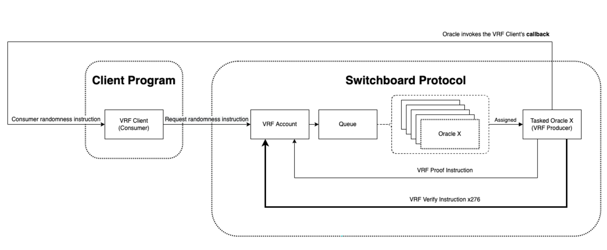

# Summary

- Attempts at generating randomness within your program are likely to be guessable by users given there's no true randomness onchain.
- Verifiable Random Functions (VRFs) give developers the opportunity to incorporate securely generated random numbers in their onchain programs.
- A VRF is a public-key pseudorandom function that provides proofs that its outputs were calculated correctly.
- Switchboard offers a developer-friendly VRF for the Solana ecosystem.

# Lesson

## Randomness On-Chain

Random numbers are ***not*** natively allowed onchain. This is because Solana is deterministic, every validator runs your code and needs to have the same result. So if you wanted to create a raffle program, you'd have to look outside of the blockchain for your randomness. This is where Verifiable Random Functions (VRFs) come in. VRFs offer developers a secure means of integrating randomness onchain in a decentralized fashion.

## Types of Randomness

Before we dive into how random numbers can be generated for a blockchain, we must first understand how they are generated on traditional computer systems. There are really two types of random numbers: *true random* and *pseudorandom*. The difference between the two lies in how the numbers are generated. 

Computers can acquire *true random* numbers by taking some type of physical measurement of the outside world as entropy. These measurements take advantage of natural phenomena, such as electronic noise, radioactive decay, or atmospheric noise, to generate random data. Because these processes are intrinsically unpredictable, the numbers they produce are genuinely random and not reproducible.

*Pseudorandom* numbers, on the other hand, are generated by algorithms that use a deterministic process to produce sequences of numbers that appear to be random. Pseudorandom number generators (PRNGs) start with an initial value called a seed and then use mathematical formulas to generate subsequent numbers in the sequence. Given the same seed, a PRNG will always produce the same sequence of numbers. It's important to seed with something close to true entropy: an admin-provided "random" input, the last system log, some combination of your system's clock time and other factors, etc.. Fun fact: older video games have been broken because speedrunners found out how their randomness was calculated. One game in particular used the number of steps you've taken in the game as a seed. 

Unfortunately, neither type of randomness is natively available in Solana programs, because these programs have to be deterministic. All validators need to come to the same conclusion. There is no way they’d all draw the same random number, and if they used a seed, it’d be prone to attacks. See the [Solana FAQs](https://docs.solana.com/developing/onchain-programs/developing-rust#depending-on-rand) for more. So we’ll have to look outside of the blockchain for randomness with VRFs.

## What is Verifiable Randomness?

A Verifiable Random Function (VRF) is a public-key pseudorandom function that provides proofs that its outputs were calculated correctly. This means we can use a cryptographic keypair to generate a random number with a proof, which can then be validated by anyone to ensure the value was calculated correctly without the possibility of leaking the producer’s secret key. Once validated, the random value is stored onchain in an account.

VRFs are a crucial component for achieving verifiable and unpredictable randomness on a blockchain, addressing some of the shortcomings of traditional PRNGs and the challenges with achieving true randomness in a decentralized system.

There are three key properties of a VRF:

1. **Deterministic** - A VRF takes a secret key and a nonce as inputs and deterministically produces an output ( seeding ). The result is a seemingly random value. Given the same secret key and nonce, the VRF will always produce the same output. This property ensures that the random value can be reproduced and verified by anyone.
2. **Unpredicatability** - The output of a VRF appears indistinguishable from true randomness to anyone without access to the secret key. This property ensures that even though the VRF is deterministic, you cannot predict the result ahead of time without knowledge of the inputs.
3. **Verifiability** - Anybody can verify the validity of the random value generated by a VRF using the corresponding secret key and nonce.

VRFs are not specific to Solana and have been utilized on other blockchains to generate pseudorandom numbers. Fortunately switchboard offers their implementation of VRF to Solana.

## Switchboard VRF Implementation

Switchboard is a decentralized Oracle network that offers VRFs on Solana. Oracles are services that provide external data to a blockchain, allowing them to interact with and respond to real-world events. The Switchboard network is made up of many different individual oracles run by third parties to provide external data and service requests onchain. To learn more about Switchboard’s Oracle network, please refer to our [Oracle lesson](./oracles).

Switchboard's VRF allows users to request an oracle to produce a randomness output onchain. Once an oracle has been assigned the request, the proof of the VRF result must be verified onchain before it can be used. The VRF proof takes 276 instructions (~48 transactions) to fully verify onchain. Once the proof is verified, the Switchboard program will execute a onchain callback defined by the VRF Account during account creation. From there the program can consume the random data.

You might be wondering how they get paid. In switchboard’s VRF implementation, you actually pay per request. // NEEDS more data

## Requesting and Consuming VRF

Now that we know what a VRF is and how it fits into the Switchboard Oracle network, let’s take a closer look at how to actually request and consume randomness from a Solana program. At a high level, the process for requesting and consuming randomness from Switchboard looks like this:

1. Create a `programAuthority` PDA that will be used as the program authority and sign on behalf of the program.
2. Create a Switchboard VRF Account with the `programAuthority` as the `authority` and specify the `callback` function the VRF will return the data to.
3. Invoke the `request_randomness` instruction on the Switchboard program. The program will assign an oracle to our VRF request.
4. Oracle serves the request and responds to the Switchboard program with the proof calculated using its secret key.
5. Oracle executes the 276 instructions to verify the VRF proof.
6. Once VRF proof is verified, the Switchboard program will invoke the `callback` that was passed in as the callback in the initial request with the pseudorandom number returned from the Oracle.
7. Program consumes the random number and can execute business logic with it!


There are a lot of steps here, but don’t worry, we'll be going through each step of the process in detail. 

First there are a couple of accounts that we will have to create ourselves to request randomness, specifically the `authority` and `vrf` accounts. The `authority` account is a PDA derived from our program that is requesting the randomness. So the PDA we create will have our own seeds for our own needs. For now, we'll simply set them at `VRFAUTH`.

```tsx
// derive PDA
[vrfAuthorityKey, vrfAuthoritySecret] = anchor.web3.PublicKey.findProgramAddressSync(
    [Buffer.from("VRFAUTH")],
    program.programId
  )
```

Then, we need to initialize a `vrf` account that is owned by the Switchboard program and mark the PDA we just derived as its authority. The `vrf` account has the following data structure.

```rust
pub struct VrfAccountData {
    /// The current status of the VRF account.
    pub status: VrfStatus,
    /// Incremental counter for tracking VRF rounds.
    pub counter: u128,
    /// Onchain account delegated for making account changes. <-- This is our PDA
    pub authority: Pubkey,
    /// The OracleQueueAccountData that is assigned to fulfill VRF update request.
    pub oracle_queue: Pubkey,
    /// The token account used to hold funds for VRF update request.
    pub escrow: Pubkey,
    /// The callback that is invoked when an update request is successfully verified.
    pub callback: CallbackZC,
    /// The number of oracles assigned to a VRF update request.
    pub batch_size: u32,
    /// Struct containing the intermediate state between VRF crank actions.
    pub builders: [VrfBuilder; 8],
    /// The number of builders.
    pub builders_len: u32,
    pub test_mode: bool,
    /// Oracle results from the current round of update request that has not been accepted as valid yet
    pub current_round: VrfRound,
    /// Reserved for future info.
    pub _ebuf: [u8; 1024],
}
```

Some important fields on this account are `authority`, `oracle_queue`, and `callback`. The `authority` should be a PDA of the program that has the ability to request randomness on this `vrf` account. That way, only that program can provide the signature needed for the vrf request. The `oracle_queue` field allows you to specify which specific oracle queue you’d like to service the vrf requests made with this account. If you aren’t familiar with oracle queues on Switchboard, checkout the [Oracles lesson in this unit](./oracles)! Lastly, the `callback` field is where you define the callback instruction the Switchboard program should invoke once the randomness result has be verified.

The `callback` field is of type `[CallbackZC](https://github.com/switchboard-xyz/solana-sdk/blob/9dc3df8a5abe261e23d46d14f9e80a7032bb346c/rust/switchboard-solana/src/oracle_program/accounts/ecvrf.rs#L25)`.

```rust
#[zero_copy(unsafe)]
#[repr(packed)]
pub struct CallbackZC {
    /// The program ID of the callback program being invoked.
    pub program_id: Pubkey,
    /// The accounts being used in the callback instruction.
    pub accounts: [AccountMetaZC; 32],
    /// The number of accounts used in the callback
    pub accounts_len: u32,
    /// The serialized instruction data.
    pub ix_data: [u8; 1024],
    /// The number of serialized bytes in the instruction data.
    pub ix_data_len: u32,
}
```

This is how you define the Callback struct client side.

```tsx
// example
import Callback from '@switchboard-xyz/solana.js'
...
...

const vrfCallback: Callback = {
      programId: program.programId,
      accounts: [
        // ensure all accounts in consumeRandomness are populated
        { pubkey: clientState, isSigner: false, isWritable: true },
        { pubkey: vrfClientKey, isSigner: false, isWritable: true },
        { pubkey: vrfSecret.publicKey, isSigner: false, isWritable: true },
      ],
			// use name of instruction
      ixData: vrfIxCoder.encode("consumeRandomness", ""), // pass any params for instruction here
    }
```

Now, you can create the `vrf` account.

```tsx
// Create Switchboard VRF
  [vrfAccount] = await switchboard.queue.createVrf({
    callback: vrfCallback,
    authority: vrfAuthorityKey, // vrf authority
    vrfKeypair: vrfSecret,
    enable: !queue.unpermissionedVrfEnabled, // only set permissions if required
  })
```

Now that we have all of our needed accounts we can finally call the `request_randomness` instruction on the Switchboard program. It's important to note you can invoke the `request_randomness` in a client or within a program with a cross program invocation (CPI). Let’s take a look at what accounts are required for this request by checking out the Account struct definition in the actual [Switchboard program](https://github.com/switchboard-xyz/solana-sdk/blob/fbef37e4a78cbd8b8b6346fcb96af1e20204b861/rust/switchboard-solana/src/oracle_program/instructions/vrf_request_randomness.rs#L8). 

```rust
// from the Switchboard program
// https://github.com/switchboard-xyz/solana-sdk/blob/fbef37e4a78cbd8b8b6346fcb96af1e20204b861/rust/switchboard-solana/src/oracle_program/instructions/vrf_request_randomness.rs#L8

pub struct VrfRequestRandomness<'info> {
    #[account(signer)]
    pub authority: AccountInfo<'info>,
    #[account(mut)]
    pub vrf: AccountInfo<'info>,
    #[account(mut)]
    pub oracle_queue: AccountInfo<'info>,
    pub queue_authority: AccountInfo<'info>,
    pub data_buffer: AccountInfo<'info>,
    #[account(
        mut,
        seeds = [
            b"PermissionAccountData",
            queue_authority.key().as_ref(),
            oracle_queue.key().as_ref(),
            vrf.key().as_ref()
        ],
        bump = params.permission_bump
    )]
    pub permission: AccountInfo<'info>,
    #[account(mut, constraint = escrow.owner == program_state.key())]
    pub escrow: Account<'info, TokenAccount>,
    #[account(mut, constraint = payer_wallet.owner == payer_authority.key())]
    pub payer_wallet: Account<'info, TokenAccount>,
    #[account(signer)]
    pub payer_authority: AccountInfo<'info>,
    pub recent_blockhashes: AccountInfo<'info>,
    #[account(seeds = [b"STATE"], bump = params.state_bump)]
    pub program_state: AccountInfo<'info>,
    pub token_program: AccountInfo<'info>,
}
```

That’s a lot of accounts, let’s walk through each one and give them some context.

- `authority` - PDA derived from our program
- `vrf` - [Account owned by the Switchboard program](https://docs.rs/switchboard-solana/latest/switchboard_solana/oracle_program/accounts/vrf/struct.VrfAccountData.html)
- Oracle Queue - [Account owned by Switchboard program that contains metadata about the oracle queue to use for this request](https://docs.rs/switchboard-solana/latest/switchboard_solana/oracle_program/accounts/queue/struct.OracleQueueAccountData.html)
- Queue Authority - Authority of the Oracle Queue chosen
- [Data Buffer](https://github.com/switchboard-xyz/solana-sdk/blob/9dc3df8a5abe261e23d46d14f9e80a7032bb346c/rust/switchboard-solana/src/oracle_program/accounts/queue.rs#L57C165-L57C165) - Account of the `OracleQueueBuffer` account holding a collection of Oracle pubkeys that have successfully hearbeated before the queues `oracleTimeout` configuration has elapsed. Stored in the Oracle Queue account.
- [Permission Account Data](https://docs.rs/switchboard-solana/latest/switchboard_solana/oracle_program/accounts/permission/struct.PermissionAccountData.html)
- Escrow (Switchboard escrow account) - Token Account
- Switchboard program state account - [Of type `SbState`](https://docs.rs/switchboard-solana/latest/switchboard_solana/oracle_program/accounts/sb_state/struct.SbState.html)
- Switchboard Program - Switchboard Program
- Payer Token Account - Will be used to pay for fees
- Payer Authority - Authority of the Payer Token Account
- Recent Blockhashes Program - [Recent Blockhashes Solana program](https://docs.rs/solana-program/latest/solana_program/sysvar/recent_blockhashes/index.html)
- Token Program - Solana Token Program

That’s all the accounts needed for just the randomness request, now let's see what it looks like in a Solana program via CPI. To do this, we make use of the `VrfRequestRandomness` data struct from the [SwitchboardV2 rust crate.](https://github.com/switchboard-xyz/solana-sdk/blob/main/rust/switchboard-solana/src/oracle_program/instructions/vrf_request_randomness.rs) This struct has some built-in capabilities to make our lives easier here, most notably the account structure is defined for us and we can easily call `invoke` or `invoke_signed` on the object.

```rust
// our client program
use switchboard_v2::VrfRequestRandomness;
use state::*;

pub fn request_randomness(ctx: Context<RequestRandomness>, request_params: RequestRandomnessParams) -> Result <()> {
	let switchboard_program = ctx.accounts.switchboard_program.to_account_info();
	
	let vrf_request_randomness = VrfRequestRandomness {
	    authority: ctx.accounts.vrf_state.to_account_info(),
	    vrf: ctx.accounts.vrf.to_account_info(),
	    oracle_queue: ctx.accounts.oracle_queue.to_account_info(),
	    queue_authority: ctx.accounts.queue_authority.to_account_info(),
	    data_buffer: ctx.accounts.data_buffer.to_account_info(),
	    permission: ctx.accounts.permission.to_account_info(),
	    escrow: ctx.accounts.switchboard_escrow.clone(),
	    payer_wallet: ctx.accounts.payer_wallet.clone(),
	    payer_authority: ctx.accounts.user.to_account_info(),
	    recent_blockhashes: ctx.accounts.recent_blockhashes.to_account_info(),
	    program_state: ctx.accounts.program_state.to_account_info(),
	    token_program: ctx.accounts.token_program.to_account_info(),
	};
	
	msg!("requesting randomness");
	vrf_request_randomness.invoke_signed(
	    switchboard_program,
	    request_params.switchboard_state_bump,
	    request_params.permission_bump,
	    state_seeds,
	)?;

...

Ok(())

}
```

Once the Switchboard program is invoked, it does some logic on its end and assigns an oracle in the `vrf` account’s defined oracle queue to serve the randomness request. The assigned oracle then calculates a random value and sends it back to the Switchboard program.

Once the result is verified, the Switchboard program then invokes the `callback` instruction defined in the `vrf` account. The callback instruction is where you would have written your business logic using the random numbers. In the following code we store the resulting randomness in our `vrf_auth` PDA from our first step.

```rust
// our client program

#[derive(Accounts)]
pub struct ConsumeRandomness<'info> {
    // vrf client state
    #[account]
    pub vrf_auth: AccountLoader<'info, VrfClientState>,
    // switchboard vrf account
    #[account(
        mut,
        constraint = vrf.load()?.authority == vrf_auth.key() @ EscrowErrorCode::InvalidVrfAuthorityError
    )]
    pub vrf: AccountLoader<'info, VrfAccountData>
}

pub fn handler(ctx: Context<ConsumeRandomness>) -> Result <()> {
    msg!("Consuming randomness!");

		// load the vrf account data
    let vrf = ctx.accounts.vrf.load()?;
		// use the get_result method to fetch the randomness results
    let result_buffer = vrf.get_result()?;

		// check if result buff is all 0's
    if result_buffer == [0u8; 32] {
        msg!("vrf buffer empty");
        return Ok(());
    }

    msg!("Result buffer is {:?}", result_buffer);
		// use the random value how you see fit

    Ok(())
}
```

Now you have randomness! Hooray! But there is one last thing we have not talked about yet and that’s how the randomness is returned. Switchboard, gives you your randomness calling `[get_result()](https://github.com/switchboard-xyz/solana-sdk/blob/9dc3df8a5abe261e23d46d14f9e80a7032bb346c/rust/switchboard-solana/src/oracle_program/accounts/vrf.rs#L122)`. This method returns the `current_round.result` field of the `vrf` account SwitchboardDecimal format, which is really just a buffer of 32 random `[u8](https://github.com/switchboard-xyz/solana-sdk/blob/9dc3df8a5abe261e23d46d14f9e80a7032bb346c/rust/switchboard-solana/src/oracle_program/accounts/ecvrf.rs#L65C26-L65C26)` unsigned-integers. You can use these unsigned-integers however you see fit in your program, but a very common method is to treat each integer in the buffer as its own random number. For example, if you need a dice roll (1-6) just take the first byte of the array, module it with 6 and add one.

```rust
// slice byte buffer to store the first value
let dice_roll = (result_buffer[0] % 6) + 1;
```

What you do with the random values from there is completely up to you! 

That is the essence of requesting randomness with a Switchboard VRF. To recap the steps involved in a VRF request, review this diagram.



# Lab

For this lesson’s lab, we will be picking up where we left off in the [Oracle lesson](./oracle). If you have'nt completed the Oracle lesson and demo, we strongly recommend you do as there are a lot of overlapping concepts and we’ll be starting from the Oracle lesson’s codebase.

If you don't want to complete the Oracle lesson, the starter code for this lab is provided for you in [the main branch of the lab Github repository](https://github.com/Unboxed-Software/michael-burry-escrow).

The repo contains a "Michael Burry" escrow program. This is a program that allows a user to lock up some solana funds in escrow that cannot be withdrawn until SOL has reached a predefined price in USD chosen by the user. We will be adding VRF functionality to this program to allow the user to "Get out of jail" by rolling doubles. Our demo today will allow the user to roll two virtual dice, if they roll doubles (the two dice match), the user can withdraw their funds from escrow regardless of the SOL price.

### 1. Program Setup

If you are cloning the repo from the previous lesson make sure to do the following:

1. `git clone [https://github.com/Unboxed-Software/michael-burry-escrow](https://github.com/Unboxed-Software/michael-burry-escrow)`
2. `cd michael-burry-escrow`
3. `anchor build`
4. `anchor keys list`
    1. Take the resulting key and put it into `Anchor.toml` and `programs/burry-escrow/src/lib.rs`
5. `solana config get`
    1. Take your **Keypair Path** and change the `wallet` field in your `Anchor.toml`
6. `yarn install`
7. `anchor test`

When all tests pass we’re ready to begin. We will start by filling in some boilerplate stuff, then we’ll implement the functions.

### 2. Cargo.toml

First, since VRF uses SPL tokens for their fees we need to import `anchor-spl` in our `Cargo.toml` file.

```tsx
[dependencies]
anchor-lang = "0.28.0"
anchor-spl = "0.28.0"
switchboard-v2 = "0.4.0"
```

### 3. Lib.rs

Next, let's edit `lib.rs` and add the additional functions we'll be building today. The functions are as follows:
- `init_vrf_client` - Creates the VRF authority PDA, which will sign for and consume the randomness.
- `get_out_of_jail` - Requests the randomness from the VRF, effectively rolling the dice.
- `consume_randomess` - The callback function for the VRF where we will check for the dice rolls.

```rust
use anchor_lang::prelude::*;
use instructions::deposit::*;
use instructions::withdraw::*;
use instructions::init_vrf_client::*;
use instructions::get_out_of_jail::*;
use instructions::consume_randomness::*;

pub mod instructions;
pub mod state;
pub mod errors;

declare_id!("YOUR_KEY_HERE");

#[program]
mod burry_escrow {

    use crate::instructions::init_vrf_client::init_vrf_client_handler;

    use super::*;

    pub fn deposit(ctx: Context<Deposit>, escrow_amt: u64, unlock_price: f64) -> Result<()> {
        deposit_handler(ctx, escrow_amt, unlock_price)
    }

    pub fn withdraw(ctx: Context<Withdraw>) -> Result<()> {
        withdraw_handler(ctx)
    }

    pub fn init_vrf_client(ctx: Context<InitVrfClient>) -> Result<()>{
        init_vrf_client_handler(ctx)
    }

		pub fn get_out_of_jail(ctx: Context<RequestRandomness>, params: RequestRandomnessParams) -> Result<()>{
        get_out_of_jail_handler(ctx, params)
    }

    pub fn consume_randomness(ctx: Context<ConsumeRandomness>) -> Result<()>{
        consume_randomness_handler(ctx)
    }
}
```

Make sure you replace `YOUR_KEY_HERE` with your own program key.

### 4. State.rs

Next, in `state.rs`, add an `out_of_jail` flag to `EscrowState`. When we finally roll two matching die, we'll flip this flag. When the `withdraw` function is called we can transfer the funds without checking the price.

```rust
// state.rs
#[account]
pub struct EscrowState {
    pub unlock_price: f64,
    pub escrow_amount: u64,
    pub out_of_jail: bool
}
```

Then, create our second data account for this program: `VrfClientState`. This will hold the state of our dice rolls. It will have the following fields:

- `bump` - Stores the bump of the account for easy signing later.
- `result_buffer` - This is where the VRF function will dump the raw randomness data.
- `dice_type` - We will set this to 6 as in a 6-sided die.
- `die_result_1` and `die_result_2` - The results of our dice roll.
- `timestamp` - Keeps track of when our last roll was.
- `vrf` - Public key of the VRF account; owned by the Switchboard program. We will create this before we call `VrfClientState`'s initialization function. 
- `escrow` - Public key of our burry escrow account.

We're also going to make the `VrfClientState` context a `zero_copy` struct. This means that we will initialize it with `load_init()` and pass it into accounts with `AccountLoader`. We do this because VRF functions are very account intensive and we need to be mindful of the stack. If you'd like to learn more about `zero_copy`, take a look at our [Program Architecture lesson](./program-architecture).

```rust
// state.rs

#[repr(packed)]
#[account(zero_copy(unsafe))]
#[derive(Default)]
pub struct VrfClientState {
    pub bump: u8,
    pub result_buffer: [u8; 32],
		pub dice_type: u8, // 6 sided
    pub die_result_1: u8,
    pub die_result_2: u8,
    pub timestamp: i64,
    pub vrf: Pubkey,
    pub escrow: Pubkey
}
```


Lastly we are going to add the `VRF_STATE_SEED` to PDA our VRF Client account.

```rust
pub const VRF_STATE_SEED: &[u8] = b"VRFCLIENT";
```

Your `state.rs` file should look like this:

```rust
use anchor_lang::prelude::*;

pub const ESCROW_SEED: &[u8] = b"MICHAEL BURRY";
pub const VRF_STATE_SEED: &[u8] = b"VRFCLIENT";
pub const SOL_USDC_FEED: &str = "GvDMxPzN1sCj7L26YDK2HnMRXEQmQ2aemov8YBtPS7vR";

#[account]
pub struct EscrowState {
    pub unlock_price: f64,
    pub escrow_amount: u64,
    pub out_of_jail: bool
}

#[repr(packed)]
#[account(zero_copy(unsafe))]
#[derive(Default)]
pub struct VrfClientState {
    pub bump: u8,
    pub result_buffer: [u8; 32],
		pub dice_type: u8, // 6 sided
    pub die_result_1: u8,
    pub die_result_2: u8,
    pub timestamp: i64,
    pub vrf: Pubkey,
    pub escrow: Pubkey
}
```

### 5. Errors.rs

Next, let's take a quick pit stop and add one last error `InvalidVrfAuthorityError` to `errors.rs`. We'll use this when the VRF authority is incorrect.

```rust
use anchor_lang::prelude::*;

#[error_code]
#[derive(Eq, PartialEq)]
pub enum EscrowErrorCode {
    #[msg("Not a valid Switchboard account")]
    InvalidSwitchboardAccount,
    #[msg("Switchboard feed has not been updated in 5 minutes")]
    StaleFeed,
    #[msg("Switchboard feed exceeded provided confidence interval")]
    ConfidenceIntervalExceeded,
    #[msg("Current SOL price is not above Escrow unlock price.")]
    SolPriceAboveUnlockPrice,
    #[msg("Switchboard VRF Account's authority should be set to the client's state pubkey")]
    InvalidVrfAuthorityError,
}
```

### 6. Mod.rs

Now, let's modify our `mod.rs` file to include our new functions we'll be writing.

```rust
pub mod deposit;
pub mod withdraw;
pub mod init_vrf_client;
pub mod get_out_of_jail;
pub mod consume_randomness;
```

### 7. Deposit.rs and Withdraw.rs

Lastly, let's update our `deposit.rs` and `withdraw.rs` files to reflect our soon-to-be new powers.

First, let’s initialize our `out_of_jail` flag to `false` in `deposit.rs`.

```rust
// in deposit.rs
...
let escrow_state = &mut ctx.accounts.escrow_account;
    escrow_state.unlock_price = unlock_price;
    escrow_state.escrow_amount = escrow_amount;
    escrow_state.out_of_jail = false; 
...
```

Next, let's write our simple get-out-of-jail logic. Wrap our oracle price-checks with an `if` statement. If the `out_of_jail` flag on the `escrow_state` account is false, then we check the price at which to unlock the SOL:

```rust
if !escrow_state.out_of_jail {
      // get result
      let val: f64 = feed.get_result()?.try_into()?;

      // check whether the feed has been updated in the last 300 seconds
      feed.check_staleness(Clock::get().unwrap().unix_timestamp, 300)
      .map_err(|_| error!(EscrowErrorCode::StaleFeed))?;

      msg!("Current feed result is {}!", val);
      msg!("Unlock price is {}", escrow_state.unlock_price);

      if val < escrow_state.unlock_price as f64 {
          return Err(EscrowErrorCode::SolPriceAboveUnlockPrice.into())
      }
  }
```

If `out_of_jail` is true, then we get out of jail free and can skip the price check, going straight to our withdrawal.

### 8. Using VRF

Now that we have the boilerplate out of the way, let’s move on to our first addition: initializing our VRF Client. Let’s create a new file called `init_vrf_client.rs` in the `/instructions` folder.

We'll add the needed crates, then create the `InitVrfClient` context. We'll need the following accounts:

- `user` - the signer who has funds in escrow.
- `escrow_account` - the burry escrow account created when the user locked their funds up.
- `vrf_client_state` - account we will be creating in this instruction to hold state about the user’s dice rolls.
- `vrf` - Our VRF owned by the Switchboard program, we will create this account client-side before we call `init_vrf_client`.
- `system_program` - The system program since we use the init macro for `vrf_state`, which calls `create_account` under the hood. 

```rust
use crate::state::*;
use crate::errors::*;
use anchor_lang::prelude::*;
use switchboard_v2::VrfAccountData;

#[derive(Accounts)]
pub struct InitVrfClient<'info> {
    #[account(mut)]
    pub user: Signer<'info>,
    // burry escrow account
    #[account(
        mut,
        seeds = [ESCROW_SEED, user.key().as_ref()],
        bump,
    )]
    pub escrow_account: Account<'info, EscrowState>,
    // vrf client state
    #[account(
        init,
        seeds = [
						VRF_STATE_SEED,
            user.key.as_ref(),
            escrow_account.key().as_ref(),
            vrf.key().as_ref(),
        ],
        payer = user,
        space = 8 + std::mem::size_of::<VrfClientState>(),
        bump
    )]
    pub vrf_state: AccountLoader<'info, VrfClientState>,

    // switchboard vrf account
    #[account(
        mut,
        constraint = vrf.load()?.authority == vrf_state.key() @ EscrowErrorCode::InvalidVrfAuthorityError
    )]
    pub vrf: AccountLoader<'info, VrfAccountData>,
    pub system_program: Program<'info, System>
}
```

Notice the `vrf_state` account is a PDA derived with the `VRF_STATE_SEED` string and the `user`, `escrow_account`, and `vrf` public keys as seeds. This means a single user can only initialize a single `vrf_state` account, just like they can only have one `escrow_account`. Since there is only one, If you wanted to be thorough, you might want to implement a `close_vrf_state` function to get your rent back.

Now, let’s write some basic initialization logic for this function. First we load and initialize our `vrf_state` account by calling `load_init()`. Then we fill in the values for each field.

```rust
pub fn init_vrf_client_handler(ctx: Context<InitVrfClient>) -> Result<()> {
    msg!("init_client validate");

    let mut vrf_state = ctx.accounts.vrf_state.load_init()?;
    *vrf_state = VrfClientState::default();
    vrf_state.bump = ctx.bumps.get("vrf_state").unwrap().clone();
    vrf_state.escrow = ctx.accounts.escrow_account.key();
    vrf_state.die_result_1 = 0;
    vrf_state.die_result_2 = 0;
    vrf_state.timestamp = 0;
    vrf_state.dice_type = 6; // sided

    Ok(())
}
```

### 9. Get Out of Jail

Now that we have the `VrfClientState` account initialized, we can use it in the `get_out_jail` instruction. Create a new file called `get_out_of_jail.rs` in the `/instructions` folder.

The `get_out_jail` instruction will make our VRF request to Switchboard. We'll need to pass in all of the accounts needed for both the VRF request and our business logic callback function.

VRF Accounts:
- `payer_wallet` - the token wallet that will pay for the VRF request; the `user` must be the owner of this account.
- `vrf` - The VRF account that was created by the client.
- `oracle_queue` - The oracle queue that will field the randomness result.
- `queue_authority` - The authority over the queue.
- `data_buffer` - The queue's data buffer account - used by the queue to compute/verify the randomness.
- `permission` - Created when creating the `vrf` account. It's derived from several of the other accounts.
- `switchboard_escrow` - Where the payer sends the tokens for requests.
- `program_state` - State of the Switchboard program.

Programs:
- `switchboard_program`
- `recent_blockhashes`
- `token_program`
- `system_program`

Buisness Logic Accounts:
- `user` - The user account who has escrowed the funds.
- `escrow_account` - The burry escrow state account for user.
- `vrf_state` - The VRF client state account initialized in the `init_vrf_client` instruction.

```rust
use crate::state::*;
use crate::errors::*;
use anchor_lang::prelude::*;
use anchor_lang::solana_program::sysvar::*;
use switchboard_v2::{VrfAccountData, OracleQueueAccountData, PermissionAccountData, SbState, VrfRequestRandomness};
use anchor_spl::token::{TokenAccount, Token};

#[derive(Accounts)]
pub struct RequestRandomness<'info> {
    // PAYER ACCOUNTS
    #[account(mut)]
    pub user: Signer<'info>,
    #[account(mut,
        constraint =
            payer_wallet.owner == user.key()
            && switchboard_escrow.mint == program_state.load()?.token_mint
    )]
    pub payer_wallet: Account<'info, TokenAccount>,
    // burry escrow account
    #[account(
        mut,
        seeds = [ESCROW_SEED, user.key().as_ref()],
        bump,
    )]
    pub escrow_account: Account<'info, EscrowState>,
    // vrf client state
    #[account(
        mut,
        seeds = [
            VRF_STATE_SEED,
            user.key.as_ref(),
            escrow_account.key().as_ref(),
            vrf.key().as_ref(),
        ],
        bump
    )]
    pub vrf_state: AccountLoader<'info, VrfClientState>,
    // switchboard vrf account
    #[account(
        mut,
        constraint = vrf.load()?.authority == vrf_state.key() @ EscrowErrorCode::InvalidVrfAuthorityError
    )]
    pub vrf: AccountLoader<'info, VrfAccountData>,
    // switchboard accounts
    #[account(mut,
        has_one = data_buffer
    )]
    pub oracle_queue: AccountLoader<'info, OracleQueueAccountData>,
    /// CHECK:
    #[account(
        mut,
        constraint = oracle_queue.load()?.authority == queue_authority.key()
    )]
    pub queue_authority: UncheckedAccount<'info>,
    /// CHECK
    #[account(mut)]
    pub data_buffer: AccountInfo<'info>,
    #[account(mut)]
    pub permission: AccountLoader<'info, PermissionAccountData>,
    #[account(mut,
        constraint = switchboard_escrow.owner == program_state.key() && switchboard_escrow.mint == program_state.load()?.token_mint
    )]
    pub switchboard_escrow: Account<'info, TokenAccount>,
    #[account(mut)]
    pub program_state: AccountLoader<'info, SbState>,
    /// CHECK:
    #[account(
        address = *vrf.to_account_info().owner,
        constraint = switchboard_program.executable == true
    )]
    pub switchboard_program: AccountInfo<'info>,
    // SYSTEM ACCOUNTS
    /// CHECK:
    #[account(address = recent_blockhashes::ID)]
    pub recent_blockhashes: AccountInfo<'info>,
    pub token_program: Program<'info, Token>,
    pub system_program: Program<'info, System>
}
```

Lastly, we'll create a new struct `RequestRandomnessParams`. We’ll be passing in some account's bumps client-side.

```rust
#[derive(Clone, AnchorSerialize, AnchorDeserialize)]
pub struct RequestRandomnessParams {
    pub permission_bump: u8,
    pub switchboard_state_bump: u8,
}
```

Now, we can work on the logic of this instruction. The logic should gather all of the accounts needed and pass them to `[VrfRequestRandomness](https://github.com/switchboard-xyz/solana-sdk/blob/fbef37e4a78cbd8b8b6346fcb96af1e20204b861/rust/switchboard-solana/src/oracle_program/instructions/vrf_request_randomness.rs#L8)`, which is a really nice struct from Switchboard. Then we'll sign the request and send it on it's way.

```rust
pub fn get_out_of_jail_handler(ctx: Context<RequestRandomness>, params: RequestRandomnessParams) -> Result <()> {
    let switchboard_program = ctx.accounts.switchboard_program.to_account_info();
    let vrf_state = ctx.accounts.vrf_state.load()?;
    
    let bump = vrf_state.bump.clone();
    drop(vrf_state);

		// build vrf request struct from the Switchboard Rust crate
    let vrf_request_randomness = VrfRequestRandomness {
        authority: ctx.accounts.vrf_state.to_account_info(),
        vrf: ctx.accounts.vrf.to_account_info(),
        oracle_queue: ctx.accounts.oracle_queue.to_account_info(),
        queue_authority: ctx.accounts.queue_authority.to_account_info(),
        data_buffer: ctx.accounts.data_buffer.to_account_info(),
        permission: ctx.accounts.permission.to_account_info(),
        escrow: ctx.accounts.switchboard_escrow.clone(),
        payer_wallet: ctx.accounts.payer_wallet.clone(),
        payer_authority: ctx.accounts.user.to_account_info(),
        recent_blockhashes: ctx.accounts.recent_blockhashes.to_account_info(),
        program_state: ctx.accounts.program_state.to_account_info(),
        token_program: ctx.accounts.token_program.to_account_info(),
    };

    let vrf_key = ctx.accounts.vrf.key();
    let escrow_key = ctx.accounts.escrow_account.key();
    let user_key = ctx.accounts.user.key();
    let state_seeds: &[&[&[u8]]] = &[&[
				&VRF_STATE_SEED,
        user_key.as_ref(),
        escrow_key.as_ref(),
        vrf_key.as_ref(),
        &[bump],
    ]];

    // submit vrf request with PDA signature
    msg!("requesting randomness");
    vrf_request_randomness.invoke_signed(
        switchboard_program,
        params.switchboard_state_bump,
        params.permission_bump,
        state_seeds,
    )?;

    msg!("randomness requested successfully");

    Ok(())
}
```

### 10. Consume Randomness

Now that we've built the logic to request a VRF from Switchboard, we must build the callback instruction the Switchboard program will call once the VRF has been verified. Create a new file called `consume_randomness.rs` in the `/instructions` directory.

This function will use the randomness to determine which dice have been rolled. If doubles are rolled, set the `out_of_jail` field on `vrf_state` to true.

First, let's create the `ConsumeRandomness` context. Fortunately, it only takes three accounts.

- `escrow_account` - state account for user’s escrowed funds.
- `vrf_state` - state account to hold information about dice roll.
- `vrf` - account with the random number that was just calculated by the Switchboard network.

```rust
// insde consume_randomness.rs
use crate::state::*;
use crate::errors::*;
use anchor_lang::prelude::*;
use switchboard_v2::VrfAccountData;

#[derive(Accounts)]
pub struct ConsumeRandomness<'info> {
    // burry escrow account
    #[account(mut)]
    pub escrow_account: Account<'info, EscrowState>,
    // vrf client state
    #[account(mut)]
    pub vrf_state: AccountLoader<'info, VrfClientState>,
    // switchboard vrf account
    #[account(
        mut,
        constraint = vrf.load()?.authority == vrf_state.key() @ EscrowErrorCode::InvalidVrfAuthorityError
    )]
    pub vrf: AccountLoader<'info, VrfAccountData>
}
```

Now let's write the logic for our `consume_randomness_handler`. We'll first fetch the results from the `vrf` account. 

We need to call `load()` because the `vrf` is passed in as an `AccountLoader`. Remember, `AccountLoader` avoids both stack and heap overflows for large accounts. Then, we call `get_result()` to grab the randomness from inside the `VrfAccountData` struct. Finally, we'll check if the resulting buffer is zeroed out. If it's all zeros, it means the Oracles have not yet verified and deposited the randomness in the account.

```rust
// inside consume_randomness.rs

pub fn consume_randomness_handler(ctx: Context<ConsumeRandomness>) -> Result <()> {
    msg!("Consuming randomness...");

    let vrf = ctx.accounts.vrf.load()?;
    let result_buffer = vrf.get_result()?;

    if result_buffer == [0u8; 32] {
        msg!("vrf buffer empty");
        return Ok(());
    }

		Ok(())
}
```

Then we load our `vrf_state` using `load_mut` since we'll be storing the randomness and dice rolls within it. We also want to check that the `result_buffer` returned from the `vrf` does not match byte for byte the `result_buffer` from the `vrf_state`. If they do match, we know the returned randomness is stale.

```rust
pub fn consume_randomness_handler(ctx: Context<ConsumeRandomness>) -> Result <()> {
    msg!("Successfully consumed randomness.");

    let vrf = ctx.accounts.vrf.load()?;
    let result_buffer = vrf.get_result()?;

    if result_buffer == [0u8; 32] {
        msg!("vrf buffer empty");
        return Ok(());
    }
		// new code
    let vrf_state = &mut ctx.accounts.vrf_state.load_mut()?;
    if result_buffer == vrf_state.result_buffer {
        msg!("result_buffer unchanged");
        return Ok(());
    }

		...
		...
}
```

Now it’s time to actually use the random result. Since we only use two dice we only need the first two bytes of the buffer. To convert these random values into “dice rolls”, we use modular arithmetic. For anyone not familiar with modular arithmetic, [Wikipedia can help](https://en.wikipedia.org/wiki/Modular_arithmetic). In modular arithmetic, numbers "wrap around" upon reaching a given fixed quantity. This given quantity is known as the modulus to leave as the remainder. Here, the modulus is the `dice_type` stored on the `vrf_state` account. We hard-coded this to 6 when the account was initialized to represent a 6-sided die. When we use `dice_type`, or 6, as the modulus, our result will be a number 0-5. We then add one, to make the resulting possibilities 1-6.

```rust
pub fn consume_randomness_handler(ctx: Context<ConsumeRandomness>) -> Result <()> {
    msg!("Successfully consumed randomness.");

    let vrf = ctx.accounts.vrf.load()?;
    let result_buffer = vrf.get_result()?;

    if result_buffer == [0u8; 32] {
        msg!("vrf buffer empty");
        return Ok(());
    }

    let vrf_state = &mut ctx.accounts.vrf_state.load_mut()?;
    let dice_type = vrf_state.dice_type;
    if result_buffer == vrf_state.result_buffer {
        msg!("result_buffer unchanged");
        return Ok(());
    }

    msg!("Result buffer is {:?}", result_buffer);

    let dice_1 = result_buffer[0] % dice_type + 1;
    let dice_2 = result_buffer[1] % dice_type + 1;

    msg!("Current Die 1 Value [1 - {}) = {}!", dice_type, dice_1);
    msg!("Current Die 2 Value [1 - {}) = {}!", dice_type, dice_2);

		...
		...
}
```

> Fun fact from Christian (one of the editors): one byte per roll is actually a slightly bad option for a dice roll. (Good enough to demo) You have 256 options in a u8. When modulo'd by 6, the number zero has a slight advantage in the distribution (256 is not divisible by 6).
> Number of 0s: (255-0)/6 + 1 = 43
> Number of 1s: (256-1)/6 = 42.6, so 42 occurrences of 1
> Number of 2s: (257-2)/6 = 42.5, so 42 occurrences of 2
> Number of 3s: (258-3)/6 = 42.5, so 42 occurrences of 3
> Number of 4s: (259-4)/6 = 42.5, so 42 occurrences of 4
> Number of 5s: (260-5)/6 = 42.5, so 42 occurrences of 5

The very last thing we have to do is update the fields in `vrf_state` and determine is the user rolled doubles. If so, flip the `out_of_jail` flag to true.

If the `out_of_jail` becomes true, the user can then call the `withdraw` instruction and it will skip over the price check.

```rust
pub fn consume_randomness_handler(ctx: Context<ConsumeRandomness>) -> Result <()> {
    msg!("Successfully consumed randomness.");

    let vrf = ctx.accounts.vrf.load()?;
    let result_buffer = vrf.get_result()?;

    if result_buffer == [0u8; 32] {
        msg!("vrf buffer empty");
        return Ok(());
    }

    let vrf_state = &mut ctx.accounts.vrf_state.load_mut()?;
    let dice_type = vrf_state.dice_type;
    if result_buffer == vrf_state.result_buffer {
        msg!("result_buffer unchanged");
        return Ok(());
    }

    msg!("Result buffer is {:?}", result_buffer);

    let dice_1 = result_buffer[0] % dice_type + 1;
    let dice_2 = result_buffer[1] % dice_type + 1;

    msg!("Current Die 1 Value [1 - {}) = {}!", dice_type, dice_1);
    msg!("Current Die 2 Value [1 - {}) = {}!", dice_type, dice_2);

    msg!("Updating VRF State with random value...");
    vrf_state.result_buffer = result_buffer;
    vrf_state.die_result_1 = dice_1;
    vrf_state.die_result_2 = dice_2;
    vrf_state.timestamp = Clock::get().unwrap().unix_timestamp;

    if dice_1 == dice_2 {
        msg!("Rolled doubles, get out of jail free!");
        let escrow_state = &mut ctx.accounts.escrow_account;
        escrow_state.out_of_jail = true;
    }

    Ok(())
}
```

And that's it for the get-out-of-jail functionality! Congrats, you have just built a program that can consume Switchboard data feeds and submit VRF requests. Please make sure your program builds successfully by running `anchor build`.

### 11. Testing

Alright, let’s test our program. Historically, we'd need to test the VRF on Devnet. Fortunately, the folks at Switchboard have created some really nice functions to let us run our own VRF oracle locally. For this, we’ll need to set up our local server, grab all of the right accounts, and then call our program.

The first thing we’ll do is pull in some more accounts in our `Anchor.toml` file:

```rust
# VRF ACCOUNTS
[[test.validator.clone]] # sbv2 attestation programID
address = "sbattyXrzedoNATfc4L31wC9Mhxsi1BmFhTiN8gDshx"

[[test.validator.clone]] # sbv2 attestation IDL
address = "5ExuoQR69trmKQfB95fDsUGsUrrChbGq9PFgt8qouncz"

[[test.validator.clone]] # sbv2 SbState
address = "CyZuD7RPDcrqCGbNvLCyqk6Py9cEZTKmNKujfPi3ynDd"
```

Then we create a new test file called `vrf-test.ts` and copy and paste the code below. It copies over the last two tests from the oracle lesson, adds some imports, and adds a new function called `delay`.

```tsx
import * as anchor from "@coral-xyz/anchor";
import { Program } from "@coral-xyz/anchor";
import { BurryEscrow } from "../target/types/burry_escrow";
import { Big } from "@switchboard-xyz/common";
import { AggregatorAccount, AnchorWallet, SwitchboardProgram, SwitchboardTestContext, Callback, PermissionAccount } from "@switchboard-xyz/solana.js"
import { NodeOracle } from "@switchboard-xyz/oracle"
import { assert } from "chai";

export const solUsedSwitchboardFeed = new anchor.web3.PublicKey("GvDMxPzN1sCj7L26YDK2HnMRXEQmQ2aemov8YBtPS7vR")

function delay(ms: number) {
  return new Promise( resolve => setTimeout(resolve, ms) );
}

describe("burry-escrow-vrf", () => {
  // Configure the client to use the local cluster.
  anchor.setProvider(anchor.AnchorProvider.env());
  const provider = anchor.AnchorProvider.env()
  const program = anchor.workspace.BurryEscrow as Program<BurryEscrow>;
  const payer = (provider.wallet as AnchorWallet).payer

  it("Create Burry Escrow Above Price", async () => {
    // fetch switchboard devnet program object
    const switchboardProgram = await SwitchboardProgram.load(
      "devnet",
      new anchor.web3.Connection("https://api.devnet.solana.com"),
      payer
    )
    const aggregatorAccount = new AggregatorAccount(switchboardProgram, solUsedSwitchboardFeed)

    // derive escrow state account
    const [escrowState] = await anchor.web3.PublicKey.findProgramAddressSync(
      [Buffer.from("MICHAEL BURRY"), payer.publicKey.toBuffer()],
      program.programId
    )
    console.log("Escrow Account: ", escrowState.toBase58())

    // fetch latest SOL price
    const solPrice: Big | null = await aggregatorAccount.fetchLatestValue()
    if (solPrice === null) {
      throw new Error('Aggregator holds no value')
    }
    const failUnlockPrice = solPrice.plus(10).toNumber()
    const amountToLockUp = new anchor.BN(100)

    // Send transaction
    try {
      const tx = await program.methods.deposit(
        amountToLockUp, 
        failUnlockPrice
      )
      .accounts({
        user: payer.publicKey,
        escrowAccount: escrowState,
        systemProgram: anchor.web3.SystemProgram.programId
      })
      .signers([payer])
      .rpc()

      await provider.connection.confirmTransaction(tx, "confirmed")
      console.log("Your transaction signature", tx)

      // Fetch the created account
      const newAccount = await program.account.escrowState.fetch(
        escrowState
      )

      const escrowBalance = await provider.connection.getBalance(escrowState, "confirmed")
      console.log("Onchain unlock price:", newAccount.unlockPrice)
      console.log("Amount in escrow:", escrowBalance)

      // Check whether the data onchain is equal to local 'data'
      assert(failUnlockPrice == newAccount.unlockPrice)
      assert(escrowBalance > 0)
    } catch (e) {
      console.log(e)
      assert.fail(e)
    }
  })

  it("Attempt to withdraw while price is below UnlockPrice", async () => {
    let didFail = false;

    // derive escrow address
    const [escrowState] = await anchor.web3.PublicKey.findProgramAddressSync(
      [Buffer.from("MICHAEL BURRY"), payer.publicKey.toBuffer()],
      program.programId
    )
    
    // send tx
    try {
      const tx = await program.methods.withdraw()
      .accounts({
        user: payer.publicKey,
        escrowAccount: escrowState,
        feedAggregator: solUsedSwitchboardFeed,
        systemProgram: anchor.web3.SystemProgram.programId
    })
      .signers([payer])
      .rpc()

      await provider.connection.confirmTransaction(tx, "confirmed")
      console.log("Your transaction signature", tx)

    } catch (e) {
      // verify tx returns expected error
      didFail = true;
      console.log(e.error.errorMessage)
      assert(e.error.errorMessage == 'Current SOL price is not above Escrow unlock price.')
    }

    assert(didFail)
  })
});
```

> Quick note: if you only want to run the vrf tests, change
> 
> 
> `describe("burry-escrow-vrf", () => {`
> 
> — to —
> 
> `describe.only("burry-escrow-vrf", () => {`
> 

Now, we are going to set up our local VRF Oracle server using `SwitchboardTestContext`. This will give us a `switchboard` context and an `oracle` node. We call the initialization functions in the `before()` function. This will run and complete before any tests begin. Lastly, let's add `oracle?.stop()` to the `after()` function to clean everything up.

```tsx
describe.only("burry-escrow-vrf", () => {
  // Configure the client to use the local cluster.
  anchor.setProvider(anchor.AnchorProvider.env());
  const provider = anchor.AnchorProvider.env()
  const program = anchor.workspace.BurryEscrow as Program<BurryEscrow>;
  const payer = (provider.wallet as AnchorWallet).payer

  // ADDED CODE
  let switchboard: SwitchboardTestContext
  let oracle: NodeOracle

  before(async () => {
    switchboard = await SwitchboardTestContext.loadFromProvider(provider, {
      name: "Test Queue",
      // You can provide a keypair to so the PDA schemes dont change between test runs
      // keypair: SwitchboardTestContext.loadKeypair(SWITCHBOARD_KEYPAIR_PATH),
      queueSize: 10,
      reward: 0,
      minStake: 0,
      oracleTimeout: 900,
      // aggregators will not require PERMIT_ORACLE_QUEUE_USAGE before joining a queue
      unpermissionedFeeds: true,
      unpermissionedVrf: true,
      enableBufferRelayers: true,
      oracle: {
        name: "Test Oracle",
        enable: true,
        // stakingWalletKeypair: SwitchboardTestContext.loadKeypair(STAKING_KEYPAIR_PATH),
      },
    })

    oracle = await NodeOracle.fromReleaseChannel({
      chain: "solana",
      // use the latest testnet (devnet) version of the oracle
      releaseChannel: "testnet",
      // disables production capabilities like monitoring and alerts
      network: "localnet",
      rpcUrl: provider.connection.rpcEndpoint,
      oracleKey: switchboard.oracle.publicKey.toBase58(),
      // path to the payer keypair so the oracle can pay for txns
      secretPath: switchboard.walletPath,
      // set to true to suppress oracle logs in the console
      silent: false,
      // optional env variables to speed up the workflow
      envVariables: {
        VERBOSE: "1",
        DEBUG: "1",
        DISABLE_NONCE_QUEUE: "1",
        DISABLE_METRICS: "1",
      },
    })

    switchboard.oracle.publicKey

    // start the oracle and wait for it to start heartbeating onchain
    await oracle.startAndAwait()
  })

  after(() => {
    oracle?.stop()
  })

// ... rest of code
}
```

Now let's run the actual test. We'll structure the test to keep rolling dice until we get doubles, then we'll check that we can withdraw the funds.

First, we'll gather all of the accounts we need. The `switchboard` test context gives us most of these. Then we'll need to call our `initVrfClient` function. Finally, we'll roll our dice in a loop and check for doubles. 

```tsx
it("Roll till you can withdraw", async () => {
  // derive escrow address
  const [escrowState] = await anchor.web3.PublicKey.findProgramAddressSync(
    [Buffer.from("MICHAEL BURRY"), payer.publicKey.toBuffer()],
    program.programId
  )

  const vrfSecret = anchor.web3.Keypair.generate()
  const [vrfClientKey] = anchor.web3.PublicKey.findProgramAddressSync(
    [
      Buffer.from("VRFCLIENT"),
      payer.publicKey.toBytes(),
      escrowState.toBytes(),
      vrfSecret.publicKey.toBytes(),
    ],
    program.programId
  )
  console.log(`VRF Client: ${vrfClientKey}`)

  const vrfIxCoder = new anchor.BorshInstructionCoder(program.idl)
  const vrfClientCallback: Callback = {
    programId: program.programId,
    accounts: [
      // ensure all accounts in consumeRandomness are populated
      // { pubkey: payer.publicKey, isSigner: false, isWritable: true },
      { pubkey: escrowState, isSigner: false, isWritable: true },
      { pubkey: vrfClientKey, isSigner: false, isWritable: true },
      { pubkey: vrfSecret.publicKey, isSigner: false, isWritable: true },
    ],
    ixData: vrfIxCoder.encode("consumeRandomness", ""), // pass any params for instruction here
  }

  const queue = await switchboard.queue.loadData();

  // Create Switchboard VRF and Permission account
  const [vrfAccount] = await switchboard.queue.createVrf({
    callback: vrfClientCallback,
    authority: vrfClientKey, // vrf authority
    vrfKeypair: vrfSecret,
    enable: !queue.unpermissionedVrfEnabled, // only set permissions if required
  })

  // vrf data
  const vrf = await vrfAccount.loadData();

  console.log(`Created VRF Account: ${vrfAccount.publicKey}`)

  // derive the existing VRF permission account using the seeds
  const [permissionAccount, permissionBump] = PermissionAccount.fromSeed(
    switchboard.program,
    queue.authority,
    switchboard.queue.publicKey,
    vrfAccount.publicKey
  )

  const [payerTokenWallet] = await switchboard.program.mint.getOrCreateWrappedUser(
    switchboard.program.walletPubkey,
    { fundUpTo: 1.0 }
  );

  // initialize vrf client
  try {
    const tx = await program.methods.initVrfClient()
    .accounts({
      user: payer.publicKey,
      escrowAccount: escrowState,
      vrfState: vrfClientKey,
      vrf: vrfAccount.publicKey,
      systemProgram: anchor.web3.SystemProgram.programId
    })
    .signers([payer])
    .rpc()
    
  } catch (e) {
    console.log(e)
    assert.fail()
  }

  let rolledDoubles = false
  while(!rolledDoubles){
    try {
      // Request randomness and roll dice
      const tx = await program.methods.getOutOfJail({
        switchboardStateBump: switchboard.program.programState.bump, 
        permissionBump})
      .accounts({
        vrfState: vrfClientKey,
        vrf: vrfAccount.publicKey,
        user: payer.publicKey,
        payerWallet: payerTokenWallet,
        escrowAccount: escrowState,
        oracleQueue: switchboard.queue.publicKey,
        queueAuthority: queue.authority,
        dataBuffer: queue.dataBuffer,
        permission: permissionAccount.publicKey,
        switchboardEscrow: vrf.escrow,
        programState: switchboard.program.programState.publicKey,

        switchboardProgram: switchboard.program.programId,
        recentBlockhashes: anchor.web3.SYSVAR_RECENT_BLOCKHASHES_PUBKEY,
        tokenProgram: anchor.utils.token.TOKEN_PROGRAM_ID,
        systemProgram: anchor.web3.SystemProgram.programId,
      })
      .signers([payer])
      .rpc()

      await provider.connection.confirmTransaction(tx, "confirmed")
      console.log(`Created VrfClient Account: ${vrfClientKey}`)

      // wait a few sec for switchboard to generate the random number and invoke callback ix
      console.log("Rolling Die...")

      let didUpdate = false;
      let vrfState = await program.account.vrfClientState.fetch(vrfClientKey)

      while(!didUpdate){
        console.log("Checking die...")
        vrfState = await program.account.vrfClientState.fetch(vrfClientKey);
        didUpdate = vrfState.timestamp.toNumber() > 0;
        await delay(1000)
      }

      console.log("Roll results - Die 1:", vrfState.dieResult1, "Die 2:", vrfState.dieResult2)
      if(vrfState.dieResult1 == vrfState.dieResult2){
        rolledDoubles = true
      } else {
        console.log("Resetting die...")
        await delay(5000)
      }

    } catch (e) {
      console.log(e)
      assert.fail()
    }
  }

  const tx = await program.methods.withdraw()
  .accounts({
    user: payer.publicKey,
    escrowAccount: escrowState,
    feedAggregator: solUsedSwitchboardFeed,
    systemProgram: anchor.web3.SystemProgram.programId
  })
  .signers([payer])
  .rpc()
  
  await provider.connection.confirmTransaction(tx, "confirmed")
})
```

Note the function where we get our `payerTokenWallet`. VRF actually requires the requester to pay some wrapped SOL. This is part of the incentive mechanism of the oracle network. Fortunately, with testing, Switchboard gives us this really nice function to create and fund a test wallet.

```typescript
  const [payerTokenWallet] = await switchboard.program.mint.getOrCreateWrappedUser(
    switchboard.program.walletPubkey,
    { fundUpTo: 1.0 }
  );
```

And there you have it! You should be able to run and pass all of the tests using `anchor test`.

If something is not working, go back and find where you went wrong. Alternatively feel free to try out the [solution code on the `vrf` branch](https://github.com/Unboxed-Software/michael-burry-escrow/tree/vrf). Remember to update your program keys and wallet path like we did in the [the Setup step](#1-program-setup).

# Challenge

Now it's time to work on something independently. Let's add some [Monopoly rules](https://en.wikipedia.org/wiki/Monopoly_(game)#Rules) to our program. Add some logic to the program to track how many times a user rolls. If they roll 3 times without rolling doubles, they should be able to withdraw their funds, just like getting out of jail in Monopoly.

If you get stuck, we have the solution in the [`vrf-challenge-solution` branch](https://github.com/Unboxed-Software/michael-burry-escrow/tree/vrf-challenge-solution).


## Completed the lab?

Push your code to GitHub and [tell us what you thought of this lesson](https://form.typeform.com/to/IPH0UGz7#answers-lesson=5af49eda-f3e7-407d-8cd7-78d0653ee17c)!