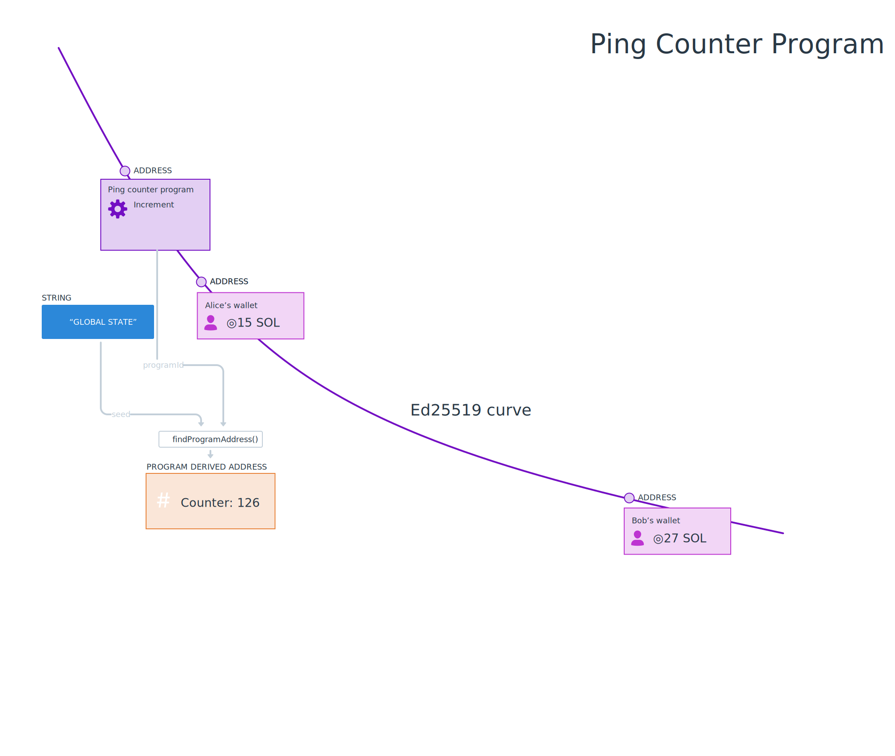
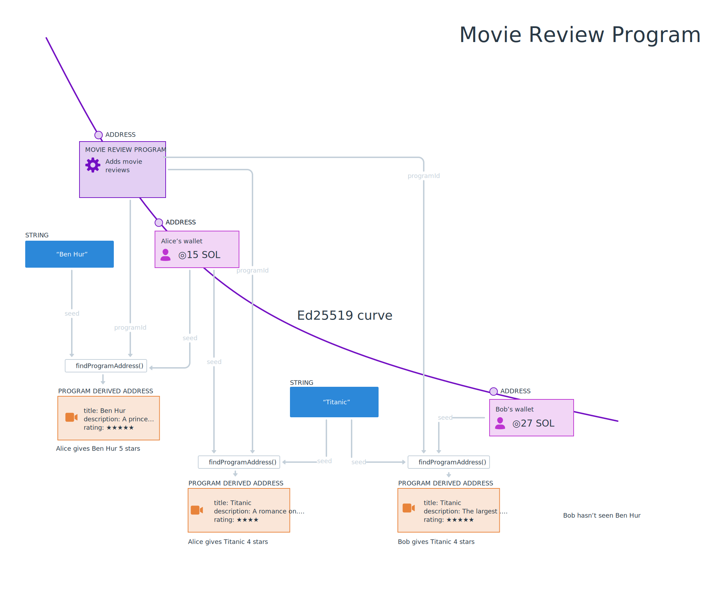
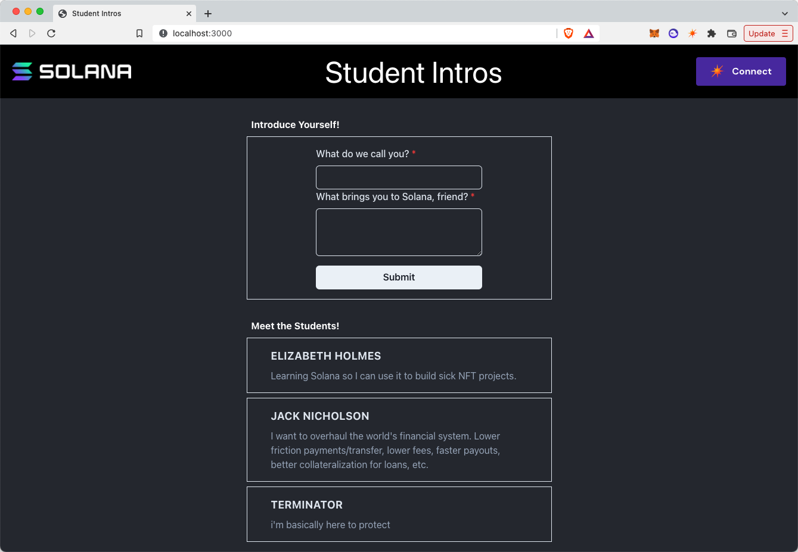

# TL;DR

- 程序将数据存储在 PDAs（Program Derived Address，程序派生账户）中。
- PDAs 不具备相应的私钥。
- 为了存储和定位数据，可以使用 `findProgramAddress(seeds, programid)` 方法派生一个 PDA。
- 可以使用 `getProgramAccounts(programId)` 获取属于程序的账户。
- 账户数据需要根据相应的布局进行反序列化。可以使用 `@coral-xyz/borsh` 来创建一个模式。

# 概述

在上一节中，我们序列化了由 Solana 程序存储在链上的程序数据。在本课程中，我们将更详细地介绍程序如何在链上存储数据，如何检索数据以及如何对它们存储的数据进行反序列化。

## 程序

俗话说，在 Solana 中，一切都是账户，即使是程序。程序是存储代码的账户，并标记为可执行。当有指令执行时，Solana runtime 可以执行这些代码。程序地址是 Ed25519 椭圆曲线上的公钥。与所有公钥一样，它们有相应的私钥。

程序将数据分开存储，存储在 PDAs 中，即**程序衍生地址**（Program Derived Address）。PDAs 是 Solana 的一个独特概念，但这种模式是很熟悉的：

- 您可以将 PDAs 视为键值存储，其中地址是键，账户内的数据是值。
- 您还可以将 PDAs 视为数据库中的记录，其中地址是用于查找内部值的主键。

PDAs 是结合程序地址和开发者选择的一些种子，以创建存储单个数据片段的地址。由于 PDAs 是位于 Ed25519 椭圆曲线之外的地址，因此 PDAs 没有私钥。相反，PDAs 可以通过用于创建它们的程序地址进行签名。

通过程序地址、bump 和种子，可以找到 PDAs 和其中的数据。要找到 PDA，需要将开发者选择的程序 ID 和种子（比如文本字符串）传递给 [`findProgramAddress()`](https://solana-labs.github.io/solana-web3.js/classes/PublicKey.html#findProgramAddress) 函数。

让我们看一些例子...

#### 示例：具有全局状态的程序

一个具有全局状态（global state）的简单程序，比如我们的 ping 计数器，可能希望只使用一个基于简单种子短语（如 `"GLOBAL_STATE"`）的 PDA。如果客户端想要从这个 PDA 读取数据，它可以使用程序 ID 和相同的种子来派生地址。

```typescript
const [pda, bump] = await findProgramAddress(Buffer.from("GLOBAL_STATE"), programId)
```



#### 示例：具有特定用户数据的程序

在存储特定用户数据的程序中，通常使用用户的公钥作为种子。这将每个用户的数据分离到自己的 PDA 中。这种分离使客户端能够通过使用程序 ID 和用户的公钥来找到每个用户的数据。

```typescript
const [pda, bump] = await web3.PublicKey.findProgramAddress(
  [
    publicKey.toBuffer()
  ],
  programId
)
```


#### 示例：每个用户有多个数据项的程序

当每个用户有多个数据项时，程序可能会使用更多的种子来创建和识别账户。例如，在一个记事本应用中，可能会有一个账户对应一个记事本，其中每个 PDA 都是使用用户的公钥和记事本内的其中一个标题派生而来的。

```typescript
const [pda, bump] = await web3.PublicKey.findProgramAddress(
  [
    publicKey.toBuffer(), 
    Buffer.from("Shopping list")
  ],
  programId,
);
```


在这个例子中，我们可以看到 Alice 和 Bob 都有一张名为“购物清单”（Shopping list）的便签，但由于我们使用他们的钱包地址作为其中一个种子，这两个便签可以同时存在。

### 获取多个程序账户

除了派生地址之外，您还可以使用 `connection.getProgramAccounts(programId)` 获取由程序创建的所有账户。这将返回一个对象数组，每个对象具有 `pubkey` 属性，表示账户的公钥，以及类型为 `AccountInfo` 的 `account` 属性。您可以使用 `account` 属性获取账户数据。

```typescript
const accounts = connection.getProgramAccounts(programId).then(accounts => {
  accounts.map(({ pubkey, account }) => {
    console.log('Account:', pubkey)
    console.log('Data buffer:', account.data)
  })
})
```

## 反序列化程序数据

`AccountInfo` 对象上的 `data` 属性是一个缓存。为了有效地使用它，您需要编写代码将其反序列化为更可用的形式。这类似于我们上一课中介绍的序列化过程。与之前一样，我们将使用 [Borsh](https://borsh.io/) 和 `@coral-xyz/borsh`。如果您需要对这两者进行复习，请查看之前的课程。

反序列化需要预先了解账户数据的布局。在创建自己的程序时，您将会定义好账户数据的数据结构。许多程序还有关于如何反序列化账户数据的文档。或者，如果程序代码可用，您可以查看源代码并以此确定结构。

要从链上程序正确地反序列化数据，您必须创建一个客户端模式，以映射数据在账户中的存储方式。例如，以下可能是一个存储链上游戏中有关玩家的元数据的账户的模式。

```typescript
import * as borsh from "@coral-xyz/borsh";

borshAccountSchema = borsh.struct([
  borsh.bool("initialized"),
  borsh.u16("playerId"),
  borsh.str("name"),
]);

```

一旦您定义了布局，只需在这个模式上调用 `.decode(buffer)`。

```typescript
import * as borsh from "@coral-xyz/borsh";

borshAccountSchema = borsh.struct([
  borsh.bool("initialized"),
  borsh.u16("playerId"),
  borsh.str("name"),
]);

const { playerId, name } = borshAccountSchema.decode(buffer);

```

# 实验

让我们一起继续练习，继续改进上一课中的电影评论应用程序。如果您刚开始学习本课程，也不用担心，应该可以顺利跟上。

作为复习，这个项目使用在 Devnet 上部署的 Solana 程序，允许用户对电影进行评论。在上一节课中，我们添加了前端框架的功能，使用户可以提交电影评论，但评论列表仍然显示模拟数据。让我们通过获取程序的存储账户并对存储在那里的数据进行反序列化来解决这个问题。


## 1. 下载起始代码

如果你没有完成上一课的实验，或者只是想确保没有漏掉任何内容，你可以下载[起始代码](https://github.com/Unboxed-Software/solana-movie-frontend/tree/solution-serialize-instruction-data)。

该项目是一个相当简单的 Next.js 应用程序。它包括我们在钱包课程中创建的 `WalletContextProvider`，一个用于显示电影评论的 `Card` 组件，一个显示评论列表的 `MovieList` 组件，一个用于提交新评论的 `Form` 组件，以及一个包含 `Movie` 对象类定义的 `Movie.ts` 文件。

请注意，当你运行 `npm run dev` 时，页面上显示的评论是模拟的。我们将把它们替换为真实的评论。

## 2. 创建缓冲区布局

请记住，要正确与 Solana 程序进行交互，您需要了解其数据的结构。一个提醒：



程序的可执行数据位于程序账户中，但单个评论存储在 PDA（程序派生地址） 中。我们使用 `findProgramAddress()` 为每个钱包的每个电影标题创建一个唯一的 PDA。我们将以下数据存储在 PDA 的 `data` 中：

1. `initialized` 布尔值，表示账户是否已初始化。
2. `rating` 无符号 8 位整数，表示评论者给电影的评分（满分为 5）。
3. `title` 字符串，表示评论的电影标题。
4. `description` 字符串，表示评论的内容。

让我们在 `Movie` 类中配置一个 `borsh` 布局，以表示电影账户数据布局。首先导入 `@coral-xyz/borsh`。接下来，创建一个名为 `borshAccountSchema` 的静态属性，并将其设置为包含上述属性的适当 `borsh` 结构。

```tsx
import * as borsh from '@coral-xyz/borsh'

export class Movie {
  title: string;
  rating: number;
  description: string;

  ...

  static borshAccountSchema = borsh.struct([
    borsh.bool('initialized'),
    borsh.u8('rating'),
    borsh.str('title'),
    borsh.str('description'),
  ])
}
```

记住，这里的顺序是*重要*的。它需要与账户数据的结构相匹配。

## 3. 创建反序列化数据的方法

既然我们已经设置好了缓冲区布局，让我们在 `Movie` 类中创建一个名为 `deserialize` 的静态方法，该方法将接受一个可选的 `Buffer` 并返回一个 `Movie` 对象或 `null`。

```typescript
import * as borsh from '@coral-xyz/borsh'

export class Movie {
  title: string;
  rating: number;
  description: string;

  ...

  static borshAccountSchema = borsh.struct([
    borsh.bool('initialized'),
    borsh.u8('rating'),
    borsh.str('title'),
    borsh.str('description'),
  ])

  static deserialize(buffer?: Buffer): Movie|null {
    if (!buffer) {
      return null
    }

    try {
      const { title, rating, description } = this.borshAccountSchema.decode(buffer)
      return new Movie(title, rating, description)
    } catch(error) {
      console.log('Deserialization error:', error)
      return null
    }
  }
}
```

该方法首先检查缓冲区是否存在，如果不存在，则返回 `null`。接下来，它使用我们创建的布局来解码缓冲区，然后使用数据构造并返回 `Movie` 的实例。如果解码失败，该方法将记录错误并返回 `null`。

## 4. 获取电影评论账户

现在我们有了反序列化账户数据的方法，我们需要实际获取这些账户。打开 `MovieList.tsx`，导入 `@solana/web3.js`。然后，在 `MovieList` 组件内创建一个新的 `Connection`。最后，在 `useEffect` 中将 `setMovies(Movie.mocks)` 这一行替换为对 `connection.getProgramAccounts` 的调用。将得到的数组转换为电影数组，然后调用 `setMovies`。

```typescript
import { Card } from './Card'
import { FC, useEffect, useState } from 'react'
import { Movie } from '../models/Movie'
import * as web3 from '@solana/web3.js'
import { useConnection } from "@solana/wallet-adapter-react"

const MOVIE_REVIEW_PROGRAM_ID = 'CenYq6bDRB7p73EjsPEpiYN7uveyPUTdXkDkgUduboaN'

export const MovieList: FC = () => {
  const { connection } = useConnection()
  const [movies, setMovies] = useState<Movie[]>([])

  useEffect(() => {
    connection.getProgramAccounts(new web3.PublicKey(MOVIE_REVIEW_PROGRAM_ID)).then(async (accounts) => {
      const movies: Movie[] = accounts.map(({ account }) => {
        return Movie.deserialize(account.data)
      })

      setMovies(movies)
    })
  }, [])

  return (
    <div>
      {
        movies.map((movie, i) => <Card key={i} movie={movie} /> )
      }
    </div>
  )
}
```

在这一点上，您应该能够运行应用程序并查看从程序检索的电影评论列表！

根据提交的评论数量，这可能需要很长时间才能加载，或者可能完全锁定浏览器。但不用担心——下一课我们将学习如何对账户进行分页和过滤，以便更有针对性地加载数据。

如果您需要更多时间来熟悉这些概念，请在继续之前查看[解决方案代码](https://github.com/Unboxed-Software/solana-movie-frontend/tree/solution-deserialize-account-data)。

# 挑战

现在轮到你独立构建一些东西了。在上一课中，您为学生介绍应用程序序列化指令数据，并将新的介绍发送到网络。现在，是时候获取和反序列化程序的账户数据了。请记住，支持此功能的 Solana 程序位于 `HdE95RSVsdb315jfJtaykXhXY478h53X6okDupVfY9yf`。



1. 你可以从头开始构建，也可以[下载起始代码](https://github.com/Unboxed-Software/solana-student-intros-frontend/tree/solution-serialize-instruction-data)。
2. 在 `StudentIntro.ts` 中创建账户缓冲区布局。账户数据包含：
   1. `initialized`，表示要运行的指令的无符号 8 位整数（应为 1）。
   2. `name`，表示学生的姓名的字符串。
   3. `message`，表示学生在 Solana 旅程中分享消息的字符串。
3. 在 `StudentIntro.ts` 中创建一个静态方法，该方法将使用缓冲区布局将帐户数据缓冲区反序列化为 `StudentIntro` 对象。
4. 在 `StudentIntroList` 组件的 `useEffect` 中，获取程序的账户并将其数据反序列化为 `StudentIntro` 对象列表。
5. 现在，你应该能够看到来自网络的学生介绍，而不是模拟数据了！

如果你遇到了困难，可以随时[查看解决方案代码](https://github.com/Unboxed-Software/solana-student-intros-frontend/tree/solution-deserialize-account-data)。

与往常一样，如果愿意，可以在这些挑战中发挥创意，超越已有的说明！

## 完成实验了吗？

将您的代码推送到 GitHub，并[告诉我们您对这节课的看法](https://form.typeform.com/to/IPH0UGz7#answers-lesson=9cb89e09-2c97-4185-93b0-c89f7aca7677)！