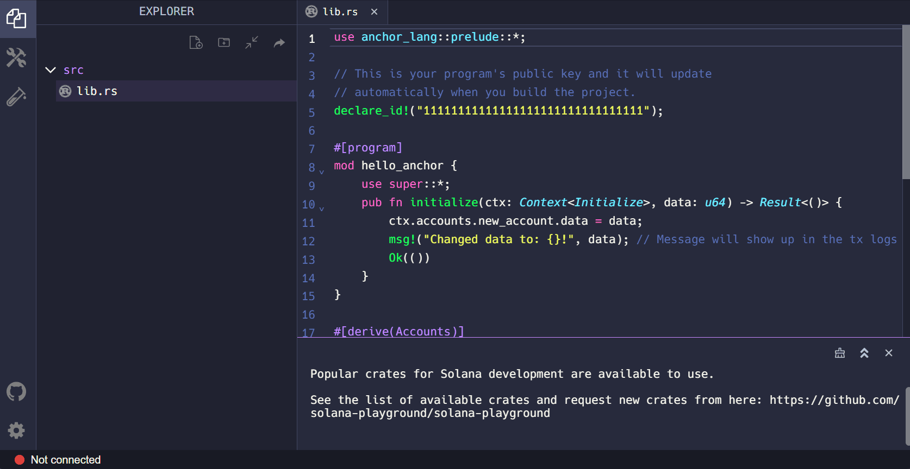

# TL;DR

- 在 Solana 上，**程序**是一种特定类型的账户，用于存储和执行指令逻辑
- Solana 程序具有处理指令的单一 **入口点**
- 一个程序使用包含在指令中的 **program_id**、**accounts** 列表和 **instruction_data** 来处理指令

# 概述

Solana 能够运行任意可执行代码的能力是其强大之处。Solana 程序，类似于其他区块链环境中的 "智能合约"，实质上是 Solana 生态系统的支柱。随着开发者和创作者构思并部署新程序，程序的数量每天都在增长。

本课程将为您提供使用 Rust 编程语言编写和部署 Solana 程序的基本介绍。为了避免设置本地开发环境的干扰，我们将使用一个名为 Solana Playground 的基于浏览器的 IDE。

## Rust 基础

在我们深入构建 "Hello, world!" 程序之前，让我们先了解一些 Rust 的基础知识。如果您想深入了解 Rust，请查阅[Rust 语言手册](https://doc.rust-lang.org/book/ch00-00-introduction.html)。

### 模块系统

Rust 使用称为 "模块系统"（module system） 的方式来组织代码。

这包括：

- **模块**（Modules） - 模块将代码分隔成逻辑单元，为路径的组织、范围和隐私提供了隔离的命名空间。
- **Crate** - 一个 crate 可以是库或可执行程序。一个 crate 的源代码通常被细分为多个模块。
- **包**（Packages） - 一个包包含一组 crate，以及一个用于指定元数据和包之间依赖关系的清单文件（manifest file）。

在本课程中，我们将专注于使用 crate 和模块。

### 路径和范围

Rust 中的 crate 包含定义功能的模块，可以与多个项目共享。如果我们想要访问模块内的项，那么我们需要知道它的 "路径"（就像在导航文件系统时一样）。

将 crate 结构视为一棵树，其中 crate 是树根，模块是树枝，每个分支（树枝）都可以有子模块或作为额外分支的项。

到达特定模块或项的路径是从 crate 到该模块的每个步骤的名称，它们之间用 `::` 分隔。作为例子，让我们看一下以下结构：

1. 根基 crate 是 `solana_program`
2. `solana_program` 包含一个名为 `account_info` 的模块
3. `account_info` 包含一个名为 `AccountInfo` 的结构体

到 `AccountInfo` 的路径将是 `solana_program::account_info::AccountInfo`。

在没有任何其他关键字的情况下，我们需要引用整个路径来在代码中使用 `AccountInfo`。

然而，使用 [`use`](https://doc.rust-lang.org/stable/book/ch07-04-bringing-paths-into-scope-with-the-use-keyword.html) 关键字，我们可以将一个项引入范围，以便在整个文件中重复使用，而无需每次指定完整路径。在 Rust 文件的顶部经常看到一系列的 `use` 命令。

```rust
use solana_program::account_info::AccountInfo
```

### 在 Rust 中声明函数

在 Rust 中，我们使用 `fn` 关键字，后跟函数名和一对括号来定义函数。

```rust
fn process_instruction()
```

然后，我们可以通过在括号内包含变量名并指定其相应的数据类型来向函数添加参数。

Rust 被称为一种“静态类型”语言，Rust 中的每个值都属于某种“数据类型”。这意味着 Rust 在编译时必须知道所有变量的类型。在多个类型可能的情况下，我们必须为变量添加类型注释。

在下面的例子中，我们创建了一个名为 `process_instruction` 的函数，该函数需要以下参数：

- `program_id` - 必须是类型 `&Pubkey`
- `accounts` - 必须是类型 `&[AccountInfo]`
- `instruction_data` - 必须是类型 `&[u8]`

请注意在 `process_instruction` 函数中列出的每个参数类型前面的 `&`。在 Rust 中，`&` 表示对另一个变量的“引用”（reference）。这允许您引用某个值而无需拥有它。保证“引用”指向特定类型的有效值。在 Rust 中创建引用的动作称为“借用”（borrowing）。

在这个例子中，当调用 `process_instruction` 函数时，用户必须传递必需参数的值。然后，`process_instruction` 函数引用用户传入的值，并保证每个值都是 `process_instruction` 函数中指定的正确数据类型。

另外，注意 `&[AccountInfo]` 和 `&[u8]` 周围的方括号 `[]`。这意味着 `accounts` 和 `instruction_data` 参数期望类型分别为 `AccountInfo` 和 `u8` 的“切片”（slice）。一个“切片”类似于一个数组（array，相同类型的对象集合），只是在编译时未知长度。换句话说，`accounts` 和 `instruction_data` 参数期望未知长度的输入。

```rust
fn process_instruction(
    program_id: &Pubkey,
    accounts: &[AccountInfo],
    instruction_data: &[u8],
)
```

然后，我们可以通过在函数后使用箭头 `->` 声明返回类型来使函数拥有返回值。

在下面的例子中，`process_instruction` 函数现在将返回类型为 `ProgramResult` 的值。我们将在下一部分详细介绍这一点。

```rust
fn process_instruction(
    program_id: &Pubkey,
    accounts: &[AccountInfo],
    instruction_data: &[u8],
) -> ProgramResult
```

### Result 枚举

`Result` 是标准库中表示两种离散结果的类型：成功 (`Ok`) 或失败 (`Err`)。我们将在以后的课程中更详细地讨论枚举（enums），但是由于您将在本课程的后面看到 `Ok`，因此重要的是了解基础知识。

当使用 `Ok` 或 `Err` 时，必须包含一个值，其类型由代码的上下文确定。例如，一个需要返回类型为 `Result<String, i64>` 的返回值的函数表示该函数可以返回一个带有嵌入字符串值的 `Ok`，或者带有嵌入整数的 `Err`。在这个例子中，整数是一个错误代码，可用于适当地处理错误。

要返回带有字符串值的成功情况，您可以执行以下操作：

```rust
Ok(String::from("Success!"));
```

要返回带有整数的错误，您可以执行以下操作：

```rust
Err(404);
```

## Solana 程序

回想一下，存储在 Solana 网络上的所有数据都包含在所谓的账户中。每个账户都有自己唯一的地址，用于标识和访问账户数据。Solana 程序只是存储和执行指令的一种特定类型的 Solana 账户。

### Solana Program Crate

要使用 Rust 编写 Solana 程序，我们使用 `solana_program` crate。`solana_program` crate 充当 Solana 程序的标准库。该标准库包含我们将用于开发 Solana 程序的模块和宏。如果您想更深入了解 `solana_program` crate，请查看[`solana_program` crate 文档](https://docs.rs/solana-program/latest/solana_program/index.html)。

对于一个基本的程序，我们需要从 `solana_program` crate 中引入以下项：

```rust
use solana_program::{
    account_info::AccountInfo,
    entrypoint,
    entrypoint::ProgramResult,
    pubkey::Pubkey,
    msg
};
```

- `AccountInfo` - `account_info` 模块中的一个结构体，允许我们访问账户信息
- `entrypoint` - 声明程序入口点的宏
- `ProgramResult` - `entrypoint` 模块中的一种 `Result` 类型，成功将返回 `()`，失败将返回 `ProgramError`
- `Pubkey` - `pubkey` 模块中的一个结构体，允许我们将地址作为公钥访问
- `msg` - 允许我们将消息打印到程序日志的宏

### Solana 程序入口点

Solana 程序需要一个单一的入口点来处理程序指令。入口点是使用 `entrypoint!` 宏声明的。

Solana 程序的入口点需要一个带有以下参数的 `process_instruction` 函数：

- `program_id` - 存储程序的账户地址
- `accounts` - 处理指令所需的账户列表
- `instruction_data` - 序列化的、指令特定的数据

```rust
entrypoint!(process_instruction);

fn process_instruction(
    program_id: &Pubkey,
    accounts: &[AccountInfo],
    instruction_data: &[u8],
) -> ProgramResult;
```

回想一下，Solana 程序账户只存储处理指令的逻辑。这意味着程序账户是“只读”（read-only）的和“无状态的”（stateless）。程序为了处理指令，将所需的“状态”（数据集）存储在数据账户中（与程序账户分开）。

为了处理指令，指令所需的数据账户必须通过 `accounts` 参数显式传递给程序。任何额外的输入必须通过 `instruction_data` 参数传递进来。

在程序执行之后，程序必须返回类型为 `ProgramResult` 的值。这个类型是一个 `Result`，其中成功情况的嵌入值是 `()`，失败情况的嵌入值是 `ProgramError`。`()` 是一个空值，`ProgramError` 是在 `solana_program` crate 中定义的错误类型。

...至此，您现在已经了解了使用 Rust 创建 Solana 程序的基础知识。让我们练习一下我们迄今为止学到的知识！

# 实验

我们将使用 Solana Playground 构建一个 "Hello, World!" 程序。Solana Playground 是一个允许您从浏览器中编写和部署 Solana 程序的工具。

## 1. 设置

打开 [Solana Playground](https://beta.solpg.io/)。接下来，删除默认的 `lib.rs` 文件中的所有内容并创建一个 Playground 钱包。



## 2. Solana Program Crate

首先，让我们从 `solana_program` crate 中引入我们将需要的一切。

```rust
use solana_program::{
    account_info::AccountInfo,
    entrypoint,
    entrypoint::ProgramResult,
    pubkey::Pubkey,
    msg
};
```

接下来，让我们使用 `entrypoint!` 宏设置程序的入口点并创建 `process_instruction` 函数。当程序被调用时，`msg!` 宏允许我们将 "Hello, world!" 打印到程序日志。

## 3. Entry Point

```rust
entrypoint!(process_instruction);

pub fn process_instruction(
    program_id: &Pubkey,
    accounts: &[AccountInfo],
    instruction_data: &[u8]
) -> ProgramResult{
    msg!("Hello, world!");

    Ok(())
}
```

所有在一起， "Hello, World!" 程序将如下所示：

```rust
use solana_program::{
    account_info::AccountInfo,
    entrypoint,
    entrypoint::ProgramResult,
    pubkey::Pubkey,
    msg
};

entrypoint!(process_instruction);

pub fn process_instruction(
    program_id: &Pubkey,
    accounts: &[AccountInfo],
    instruction_data: &[u8]
) -> ProgramResult{
    msg!("Hello, world!");

    Ok(())
}
```

## 4. Build and Deploy

现在让我们使用 Solana Playground 构建（build）和部署（deploy）我们的程序。


## 5. Invoke Program

最后，让我们从客户端调用我们的程序。本课程的重点是构建我们的 Solana 程序，因此我们已经为您提供了[调用我们的 "Hello, World!" 程序的客户端代码](https://github.com/Unboxed-Software/solana-hello-world-client)。

提供的代码包括一个名为 `sayHello` 的辅助函数，用于构建和提交我们的交易。然后，在主函数中调用 `sayHello`，并打印一个 Solana Explorer 的 URL，以在浏览器中查看我们的交易详情。

打开 `index.ts` 文件，您应该看到一个名为 `programId` 的变量。请更新此变量，将其设置为您刚刚在 Solana Playground 上部署的 "Hello, World!" 程序的程序 ID。

```tsx
let programId = new web3.PublicKey("<YOUR_PROGRAM_ID>");
```

您可以在 Solana Playground 上找到程序 ID，参考下面的图片。


接下来，使用 `npm i` 安装 Node 模块。

然后，运行 `npm start`。此命令将执行以下操作：
1. 如果不存在 `.env` 文件，生成一个新的密钥对，并创建一个 `.env` 文件
2. 空投 devnet SOL
3. 调用 "Hello, World!" 程序
4. 输出交易 URL，以在 Solana Explorer 上查看

将在控制台中打印的交易 URL 复制到浏览器中。向下滚动以查看 "Hello, World!" 在程序指令日志下的输出。


恭喜，您已成功构建和部署了一个 Solana 程序！

# 挑战

现在轮到你独立构建一些东西了。因为我们从非常简单的程序开始，所以你的程序看起来几乎和我们刚刚创建的一样。尝试达到可以自己从头编写而不参考之前的代码的地步是有用的，所以在这里尽量不要复制粘贴。

1. 编写一个新的程序，使用 `msg!` 宏将你自己的消息打印到程序日志中。
2. 像我们在实验中那样构建和部署你的程序。
3. 调用你新部署的程序，并使用 Solana Explorer 检查你的消息是否已打印到程序日志中。

和往常一样，在这些挑战中发挥创造力，如果愿意，可以超越基本说明 - 祝你玩得开心！

## 完成实验了吗？

将你的代码推送到 GitHub，并[告诉我们你对这节课的看法](https://form.typeform.com/to/IPH0UGz7#answers-lesson=5b56c69c-1490-46e4-850f-a7e37bbd79c2)!