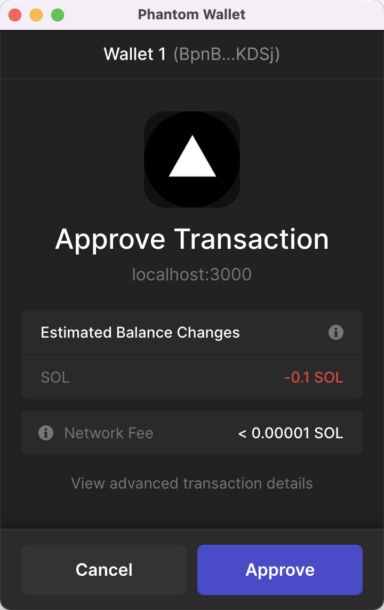
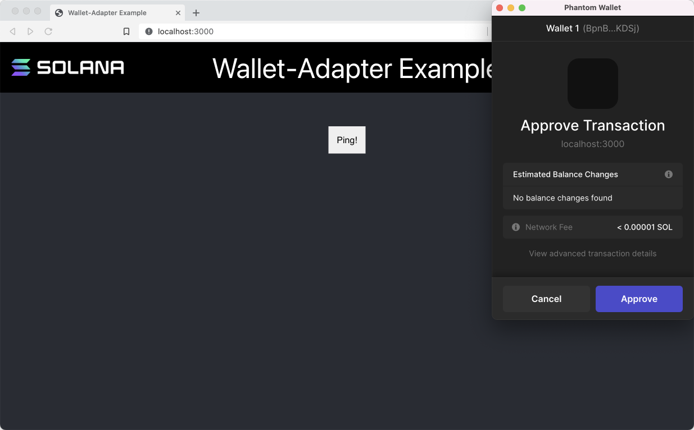

# TL;DR

- **钱包**存储您的密钥并处理安全交易签名
- **硬件钱包**将您的密钥存储在单独的设备上
- **软件钱包**使用您的计算机进行安全存储
- 软件钱包通常是**浏览器扩展**，有助于连接到网站
- Solana 的 **钱包适配器库** 简化了钱包浏览器扩展的支持，允许您构建可以请求用户钱包地址并建议他们签名交易的网站

# 概述

## 钱包

在前两课中我们讨论了密钥对。密钥对用于定位帐户和签署交易。虽然密钥对的公钥可以完全安全地共享，但私钥应始终保存在安全的位置。如果用户的私钥被泄露，那么一些恶意行为就可以耗尽其帐户中的所有资产，并以该用户的权限执行交易。

“钱包”（wallet）是指存储私钥以保证其安全的任何东西。这些安全存储选项通常可以描述为“硬件”（hardware）或“软件”(software)钱包。硬件钱包是与计算机分开的存储设备。软件钱包是您可以安装在现有设备上的应用程序。

软件钱包通常以浏览器扩展的形式出现。这使得网站可以轻松地与钱包进行交互。这些交互通常仅限于：

1. 查看钱包的公钥（地址）
2. 提交交易以供用户批准
3. 将批准的交易发送到网络

提交交易后，终端用户可以“确认”（confirm）交易并将其连同“签名”（signature）一起发送到网络。

签名交易需要使用您的私钥。通过让网站向您的钱包提交交易并让钱包处理签名，您可以确保您永远不会将您的密钥暴露给网站。相反，您只需与钱包应用程序共享私钥。

除非您自己创建钱包应用程序，否则您的代码永远不需要询问用户的密钥。相反，您可以要求用户使用信誉良好的钱包连接到您的网站。

## Phantom 钱包

Solana 生态系统中使用最广泛的软件钱包之一是 [Phantom](https://phantom.app)。Phantom 支持一些最流行的浏览器，并具有用于随时随地连接的移动应用程序。您可能希望您的去中心化应用支持多个钱包，但本课程将重点关注 Phantom。

## Solana’s 钱包适配器

Solana 的钱包适配器（Solana’s Wallet-Adapter）是一套库，可用于简化支持钱包浏览器扩展的过程。

Solana 的钱包适配器包含多个模块化包。核心功能位于 `@solana/wallet-adapter-base` 和`@solana/wallet-adapter-react` 中。

还有一些包为常见的 UI 框架提供组件。在本课以及整个课程中，我们将使用 `@solana/wallet-adapter-react-ui` 中的组件。

最后，还有一些包是特定钱包的适配器，包括 Phantom。您可以使用 `@solana/wallet-adapter-wallets` 来包含所有支持的钱包，也可以选择特定钱包的包，例如 `@solana/wallet-adapter-phantom` 。

### 安装钱包适配器库

当向现有的 React 应用添加钱包支持时，您首先要安装适当的包。您需要 `@solana/wallet-adapter-base`、`@solana/wallet-adapter-react`。如果您计划使用提供的 React 组件，您还需要添加 `@solana/wallet-adapter-react-ui`。

所有支持[钱包标准](https://github.com/wallet-standard/wallet-standard)的钱包均开箱即用，并且几乎所有当前的 Solana 钱包都支持钱包标准。但是，如果您希望添加对任何不支持该标准的钱包的支持，请为它们添加一个包。

```
npm install @solana/wallet-adapter-base \
    @solana/wallet-adapter-react \
    @solana/wallet-adapter-react-ui
```

### 连接钱包

`@solana/wallet-adapter-react` 允许我们通过钩子（hooks）和上下文提供者（context providers）持久保存和访问钱包连接状态，即：

- `useWallet`
- `WalletProvider`
- `useConnection`
- `ConnectionProvider`

为了使它们正常工作，对 `useWallet` 和 `useConnection` 的任何使用都应该包装在 `WalletProvider` 和 `ConnectionProvider` 中。确保这一点的最佳方法之一是将整个应用包装在 `ConnectionProvider` 和 `WalletProvider` 中：

```tsx
import { NextPage } from "next";
import { FC, ReactNode } from "react";
import {
  ConnectionProvider,
  WalletProvider,
} from "@solana/wallet-adapter-react";
import * as web3 from "@solana/web3.js";

export const Home: NextPage = (props) => {
  const endpoint = web3.clusterApiUrl("devnet");
  const wallets = useMemo(() => [], []);

  return (
    <ConnectionProvider endpoint={endpoint}>
      <WalletProvider wallets={wallets}>
        <p>Put the rest of your app here</p>
      </WalletProvider>
    </ConnectionProvider>
  );
};
```

请注意，`ConnectionProvider` 需要 `endpoint` 属性，`WalletProvider` 需要 `wallets` 属性。我们将继续使用 Devnet 集群的端点，并且由于所有主要 Solana 适配器都支持钱包标准，因此我们不需要任何特定钱包的适配器。

此时，您可以使用 `wallet.connect()` 进行连接，这将指示钱包提示用户是否有权查看其公钥并请求批准交易。


虽然您可以在 `useEffect` 钩子中执行此操作，但您通常希望提供更复杂的功能。例如，您可能希望用户能够从支持的钱包列表中进行选择，或者在连接后断开连接。

### `@solana/wallet-adapter-react-ui`

您可以为此创建自定义组件，也可以利用 `@solana/wallet-adapter-react-ui` 提供的组件。提供广泛选项的最简单方法是使用 `WalletModalProvider` 和 `WalletMultiButton`：

```tsx
import { NextPage } from "next";
import { FC, ReactNode } from "react";
import {
  ConnectionProvider,
  WalletProvider,
} from "@solana/wallet-adapter-react";
import {
  WalletModalProvider,
  WalletMultiButton,
} from "@solana/wallet-adapter-react-ui";
import * as web3 from "@solana/web3.js";

const Home: NextPage = (props) => {
  const endpoint = web3.clusterApiUrl("devnet");
  const wallets = useMemo(() => [], []);

  return (
    <ConnectionProvider endpoint={endpoint}>
      <WalletProvider wallets={wallets}>
        <WalletModalProvider>
          <WalletMultiButton />
          <p>Put the rest of your app here</p>
        </WalletModalProvider>
      </WalletProvider>
    </ConnectionProvider>
  );
};

export default Home;

```

`WalletModalProvider` 添加了在屏幕上呈现模式的功能，供用户选择他们想要使用的钱包。 `WalletMultiButton` 更改行为以匹配连接状态：


如果您需要更具体的功能，您还可以使用更精细的组件：

- `WalletConnectButton`
- `WalletModal`
- `WalletModalButton`
- `WalletDisconnectButton`
- `WalletIcon`

### 访问帐户信息

一旦您的网站连接到钱包，`useConnection` 将检索 `Connection` 对象，`useWallet` 将获取 `WalletContextState`。`WalletContextState` 有一个属性 `publicKey`，当未连接到钱包时，该属性为 `null`；当连接钱包时，它具有用户帐户的公钥。通过公钥和连接，您可以获取帐户信息等。

```tsx
import { useConnection, useWallet } from "@solana/wallet-adapter-react";
import { LAMPORTS_PER_SOL } from "@solana/web3.js";
import { FC, useEffect, useState } from "react";

export const BalanceDisplay: FC = () => {
  const [balance, setBalance] = useState(0);
  const { connection } = useConnection();
  const { publicKey } = useWallet();

  useEffect(() => {
    if (!connection || !publicKey) {
      return;
    }

    connection.onAccountChange(
      publicKey,
      (updatedAccountInfo) => {
        setBalance(updatedAccountInfo.lamports / LAMPORTS_PER_SOL);
      },
      "confirmed",
    );

    connection.getAccountInfo(publicKey).then((info) => {
      setBalance(info.lamports);
    });
  }, [connection, publicKey]);

  return (
    <div>
      <p>{publicKey ? `Balance: ${balance / LAMPORTS_PER_SOL} SOL` : ""}</p>
    </div>
  );
};
```

请注意对 `connection.onAccountChange()` 的调用，一旦网络确认交易，该调用就会更新显示的帐户余额。

### 发送交易

`WalletContextState` 还提供了一个 `sendTransaction` 函数，您可以使用它来提交交易以供批准。

```tsx
const { publicKey, sendTransaction } = useWallet();
const { connection } = useConnection();

const sendSol = (event) => {
  event.preventDefault();

  const transaction = new web3.Transaction();
  const recipientPubKey = new web3.PublicKey(event.target.recipient.value);

  const sendSolInstruction = web3.SystemProgram.transfer({
    fromPubkey: publicKey,
    toPubkey: recipientPubKey,
    lamports: LAMPORTS_PER_SOL * 0.1,
  });

  transaction.add(sendSolInstruction);
  sendTransaction(transaction, connection).then((sig) => {
    console.log(sig);
  });
};

```

当调用此函数时，连接的钱包将显示交易以供用户批准。如果获得批准，则交易将被发送。



# Lab

让我们使用上一课的 Ping 程序，构建一个前端，让用户可以批准一个 ping 该程序的交易。作为提醒，程序的公钥是 `ChT1B39WKLS8qUrkLvFDXMhEJ4F1XZzwUNHUt4AU9aVa`，数据账户的公钥是 `Ah9K7dQ8EHaZqcAsgBW8w37yN2eAy3koFmUn4x3CJtod`。



## 1. 下载 Phantom 浏览器扩展并设置为 Devnet

如果您还没有，请下载 [Phantom 浏览器扩展](https://phantom.app/download)。截至目前的撰写时，它支持 Chrome、Brave、Firefox 和 Edge 浏览器，因此您还需要安装其中一个浏览器。按照 Phantom 的说明创建一个新账户和一个新钱包。

一旦您有了一个钱包，在 Phantom UI 的找到并点击设置齿轮。向下滚动并点击 “Developer Settings” 一行，然后选择 “Testnet Mode”。这确保 Phantom 连接到我们在这个实验中将要使用到的相同网络。

## 2. 下载起始代码

下载[这个项目的起始代码](https://github.com/Unboxed-Software/solana-ping-frontend/tree/starter)。这个项目是一个简单的 Next.js 应用程序。除了 `AppBar` 组件之外，它基本上是空的。在整个实验过程中，我们将逐步构建其余部分。

您可以在控制台中使用命令 `npm run dev` 查看其当前状态。

## 3. 将应用包装在上下文提供程序中

首先，我们将创建一个新的组件，用于包含我们将要使用的各种 Wallet-Adapter 提供程序。在 `components` 文件夹内创建一个名为 `WalletContextProvider.tsx` 的新文件。

让我们从函数组件的一些样板代码开始：

```tsx
import { FC, ReactNode } from "react";

const WalletContextProvider: FC<{ children: ReactNode }> = ({ children }) => {
  return (

  ));
};

export default WalletContextProvider;
```

为了正确连接到用户的钱包，我们需要一个 `ConnectionProvider`、`WalletProvider` 和 `WalletModalProvider`。首先从 `@solana/wallet-adapter-react` 和 `@solana/wallet-adapter-react-ui` 中导入这些组件。然后将它们添加到 `WalletContextProvider` 组件中。请注意，`ConnectionProvider` 需要一个 `endpoint` 参数，而 `WalletProvider` 需要一个 `wallets` 数组。目前，分别使用一个空字符串和一个空数组。

```tsx
import { FC, ReactNode } from "react";
import {
  ConnectionProvider,
  WalletProvider,
} from "@solana/wallet-adapter-react";
import { WalletModalProvider } from "@solana/wallet-adapter-react-ui";

const WalletContextProvider: FC<{ children: ReactNode }> = ({ children }) => {
  return (
    <ConnectionProvider endpoint={""}>
      <WalletProvider wallets={[]}>
        <WalletModalProvider>{children}</WalletModalProvider>
      </WalletProvider>
    </ConnectionProvider>
  );
};

export default WalletContextProvider;

```

我们还需要为 `ConnectionProvider` 准备实际的节点（endpoint）和为 `WalletProvider` 提供支持的钱包。

对于节点，我们将使用之前使用过的 `@solana/web3.js` 库中的相同 `clusterApiUrl` 函数，因此您需要导入它。对于钱包数组，您还需要导入 `@solana/wallet-adapter-wallets` 库。

在导入这些库之后，创建一个使用 `clusterApiUrl` 函数获取 Devnet 的 URL 并赋值给常量 `endpoint`。然后创建一个常量 `wallets`，并将其设置为空数组，由于所有钱包都支持 Wallet Standard，我们不再需要任何自定义钱包适配器。最后，分别在 `ConnectionProvider` 和 `WalletProvider` 中替换空字符串和空数组。

为了完成这个组件，在导入下面添加 `require('@solana/wallet-adapter-react-ui/styles.css');` 以确保 Wallet Adapter 库组件的样式和行为正确。

```tsx
import { FC, ReactNode } from "react";
import {
  ConnectionProvider,
  WalletProvider,
} from "@solana/wallet-adapter-react";
import { WalletModalProvider } from "@solana/wallet-adapter-react-ui";
import * as web3 from "@solana/web3.js";
import * as walletAdapterWallets from "@solana/wallet-adapter-wallets";
require("@solana/wallet-adapter-react-ui/styles.css");

const WalletContextProvider: FC<{ children: ReactNode }> = ({ children }) => {
  const endpoint = web3.clusterApiUrl("devnet");
  const wallets = useMemo(() => [], []);

  return (
    <ConnectionProvider endpoint={endpoint}>
      <WalletProvider wallets={wallets}>
        <WalletModalProvider>{children}</WalletModalProvider>
      </WalletProvider>
    </ConnectionProvider>
  );
};

export default WalletContextProvider;

```

## 4. 添加钱包多按钮

接下来，让我们设置连接按钮。当前的按钮只是一个占位符，因为我们将使用 Wallet-Adapter 的“多按钮”而不是使用标准按钮或创建自定义组件。这个按钮与我们在 `WalletContextProvider` 中设置的提供程序进行交互，让用户选择钱包、连接到钱包以及断开与钱包的连接。如果您需要更多自定义功能，可以创建一个自定义组件来处理这个问题。

在我们添加“多按钮”之前，我们需要在 `index.tsx` 中将应用程序包装在 `WalletContextProvider` 中。在 `</Head>` 标签后导入并添加它：

```tsx
import { NextPage } from "next";
import styles from "../styles/Home.module.css";
import WalletContextProvider from "../components/WalletContextProvider";
import { AppBar } from "../components/AppBar";
import Head from "next/head";
import { PingButton } from "../components/PingButton";

const Home: NextPage = (props) => {
  return (
    <div className={styles.App}>
      <Head>
        <title>Wallet-Adapter Example</title>
        <meta name="description" content="Wallet-Adapter Example" />
      </Head>
      <WalletContextProvider>
        <AppBar />
        <div className={styles.AppBody}>
          <PingButton />
        </div>
      </WalletContextProvider>
    </div>
  );
};

export default Home;
```

如果运行应用程序，一切应该看起来仍然一样，因为右上角的当前按钮仍然只是一个占位符。为了解决这个问题，打开 `AppBar.tsx` 并将 `<button>Connect</button>` 替换为 `<WalletMultiButton/>`。您需要从 `@solana/wallet-adapter-react-ui` 导入 `WalletMultiButton`。

```tsx
import { FC } from "react";
import styles from "../styles/Home.module.css";
import Image from "next/image";
import { WalletMultiButton } from "@solana/wallet-adapter-react-ui";

export const AppBar: FC = () => {
  return (
    <div className={styles.AppHeader}>
      <Image src="/solanaLogo.png" height={30} width={200} />
      <span>Wallet-Adapter Example</span>
      <WalletMultiButton />
    </div>
  );
};
```

此时，您应该能够运行应用程序并与屏幕右上角的多按钮进行交互。现在它应该显示为 "Select Wallet"。如果您安装了 Phantom 扩展并已登录，您应该能够使用这个新按钮将您的 Phantom 钱包连接到站点。

## 5. 创建 ping 程序的按钮

现在我们的应用程序可以连接到 Phantom 钱包，让我们使 "Ping!" 按钮真正起作用。

首先打开 `PingButton.tsx` 文件。我们将替换 `onClick` 内部的 `console.log`，使用代码创建一个交易并将其提交给 Phantom 扩展以供最终用户批准。

首先，我们需要一个连接、钱包的公钥和 Wallet-Adapter 的 `sendTransaction` 函数。为了得到这些，我们需要从 `@solana/wallet-adapter-react` 中导入 `useConnection` 和 `useWallet`。在这里，让我们也导入 `@solana/web3.js`，因为我们将需要它来创建我们的交易。

```tsx
import { useConnection, useWallet } from '@solana/wallet-adapter-react'
import * as web3 from '@solana/web3.js'
import { FC, useState } from 'react'
import styles from '../styles/PingButton.module.css'

export const PingButton: FC = () => {

  const onClick = () => {
    console.log('Ping!')
  }

  return (
    <div className={styles.buttonContainer} onClick={onClick}>
      <button className={styles.button}>Ping!</button>
    </div>
  )
}
```

现在使用 `useConnection` 钩子创建一个 `connection` 常量，使用 `useWallet` 钩子创建 `publicKey` 和 `sendTransaction` 常量。

```tsx
import { useConnection, useWallet } from "@solana/wallet-adapter-react";
import * as web3 from "@solana/web3.js";
import { FC, useState } from "react";
import styles from "../styles/PingButton.module.css";

export const PingButton: FC = () => {
  const { connection } = useConnection();
  const { publicKey, sendTransaction } = useWallet();

  const onClick = () => {
    console.log("Ping!");
  };

  return (
    <div className={styles.buttonContainer} onClick={onClick}>
      <button className={styles.button}>Ping!</button>
    </div>
  );
};
```

有了这些，我们可以填写 `onClick` 中的内容。

首先，检查 `connection` 和 `publicKey` 是否都存在（如果有一个不存在，那么用户的钱包还未连接）。

接下来，构造两个 `PublicKey` 实例，一个用于程序 ID `ChT1B39WKLS8qUrkLvFDXMhEJ4F1XZzwUNHUt4AU9aVa`，另一个用于数据账户 `Ah9K7dQ8EHaZqcAsgBW8w37yN2eAy3koFmUn4x3CJtod`。

然后，构造一个 `Transaction`，然后构造一个新的 `TransactionInstruction`，其中包含数据账户作为可写入的公钥。

接下来，将指令添加到交易中。

最后，调用 `sendTransaction`。

```tsx
const onClick = () => {
  if (!connection || !publicKey) {
    return;
  }

  const programId = new web3.PublicKey(PROGRAM_ID);
  const programDataAccount = new web3.PublicKey(DATA_ACCOUNT_PUBKEY);
  const transaction = new web3.Transaction();

  const instruction = new web3.TransactionInstruction({
    keys: [
      {
        pubkey: programDataAccount,
        isSigner: false,
        isWritable: true,
      },
    ],
    programId,
  });

  transaction.add(instruction);
  sendTransaction(transaction, connection).then((sig) => {
    console.log(sig);
  });
};
```

就是这样！如果刷新页面，连接您的钱包，然后点击 ping 按钮，Phantom 应该会弹出一个确认交易的弹窗。

## 6. 在边缘处增加一些细节

有很多事情可以做，以使用户在这里的体验更好。例如，您可以更改 UI，仅在连接了钱包时显示 Ping 按钮，否则显示其他提示。您可以在用户确认交易后链接到 Solana Explorer 上的交易，以便他们可以轻松查看交易详情。您尝试的越多，就越能熟练，所以发挥您的创造力吧！

您还可以下载[此实验的完整源代码](https://github.com/Unboxed-Software/solana-ping-frontend)，以便在上下文中更好地理解所有内容。

# 挑战

现在轮到您独立构建一些东西了。创建一个应用程序，允许用户连接他们的 Phantom 钱包并向另一个账户发送 SOL。


1. 您可以从头开始构建，也可以[下载起始代码](https://github.com/Unboxed-Software/solana-send-sol-frontend/tree/starter)。
2. 使用适当的上下文提供程序包装起始应用程序。
3. 在表单组件中，设置交易并将其发送给用户的钱包以供批准。
4. 在用户体验方面发挥创意。添加一个链接，让用户在 Solana Explorer 上查看交易，或者添加其他您认为很酷的东西！

如果您真的卡住了，可以随时[查看解决方案代码](https://github.com/Unboxed-Software/solana-send-sol-frontend/tree/main)。

## 完成实验了吗？

将您的代码推送到 GitHub，并[告诉我们您对这节课的看法](https://form.typeform.com/to/IPH0UGz7#answers-lesson=69c5aac6-8a9f-4e23-a7f5-28ae2845dfe1)！