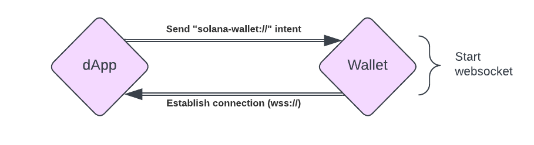
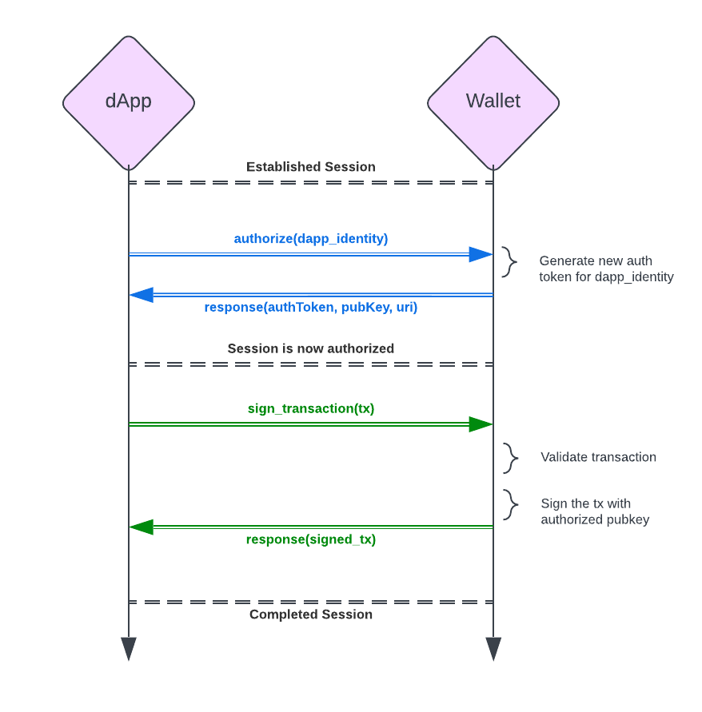
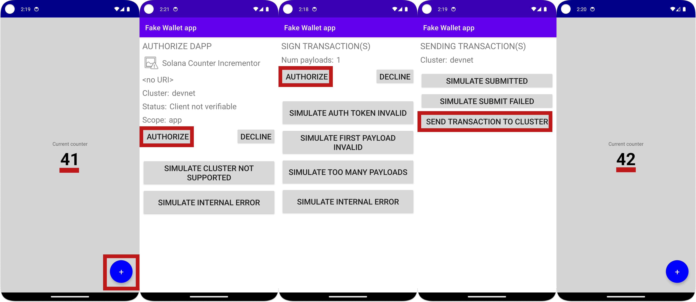

**译者**: [ben46](https://github.com/ben46)

# 摘要

- Solana移动钱包适配器（MWA）在移动应用程序和移动钱包之间创建了一个WebSocket连接，允许本机移动应用程序提交交易进行签名
- 创建Solana移动应用程序的最简单方法是使用Solana Mobile的[React Native packages](https://docs.solanamobile.com/react-native/setup) `@solana-mobile/mobile-wallet-adapter-protocol` 和 `@solana-mobile/mobile-wallet-adapter-protocol-web3js`
- React Native与React非常相似，但有一些移动端特殊之处

# 课程

Solana Mobile Stack（SMS）旨在帮助开发人员创建具有无缝UX的移动dApp。它包括[Mobile Wallet Adapter（MWA）](https://docs.solanamobile.com/getting-started/overview#mobile-wallet-adapter)，[Seed Vault](https://docs.solanamobile.com/getting-started/overview#seed-vault)和[Solana dApp Store](https://docs.solanamobile.com/getting-started/overview#solana-dapp-store)。

对于您的开发之旅最相关的是Mobile Wallet Adapter（MWA）。开始的最简单方法是使用React Native与Mobile Wallet Adapter结合创建一个简单的Android应用程序。本课程假设您熟悉React和Solana编程。如果不是这样，请[从头开始学习我们的课程](./intro-to-cryptography)，然后在觉得准备好时再回到这里！

## Solana移动介绍

在这些单元中，我们将开发与Solana网络交互的移动应用程序，这将开启加密使用案例和行为的全新范例。

### Solana移动使用案例

以下是Solana移动开发可以解锁的一些示例：

**移动银行和交易（DeFi）**

当前，大多数传统银行业务都通过本机移动应用进行。有了SMS，您现在可以使用本机移动应用创建个人钱包并进行交易，拥有自己的私钥。

**使用Solana微支付进行移动游戏**

移动游戏占据了游戏业总价值的大约50%，这在很大程度上要归功于小额游戏内购。然而，支付处理费通常意味着这些游戏内购至少要0.99美元。通过Solana，可以实现真正的微支付。需要额外生命？只需0.0001 SOL。

**移动电子商务**

SMS可以让新一波移动电子商务购物者直接从他们喜爱的Solana钱包进行支付。想象一下，在这个世界上，您可以像使用Apple Pay一样轻松地使用您的Solana钱包。

总之，移动加密为我们打开了许多大门。让我们深入学习如何成为其中的一部分：

### Solana开发在原生移动应用和Web之间的区别

Solana钱包在移动端与Web端的交互方式略有不同。钱包的核心功能是一样的：钱包保存您的私钥，并使用它们进行交易签名和发送。为了避免在钱包之间有不同的接口，开发人员将该功能抽象成了Solana钱包适配器标准。这在Web端仍然是标准。移动端的对应物是Mobile Wallet Adapter（MWA）。

这两种标准的区别是由Web钱包与移动端钱包的不同构造造成的。Web钱包只是浏览器扩展，将钱包适配器功能注入到您的网页的`window`对象中，从而使您的网站可以访问它们。然而，移动钱包是移动操作系统上的本机应用程序。无法将一个本机应用程序的功能暴露给另一个本机应用程序。Mobile Wallet Adapter的存在是为了让任何应用程序，使用任何语言编写，连接到本机钱包应用程序。

我们将深入研究Mobile Wallet Adapter的具体信息，但它本质上是打开应用程序之间WebSocket以进行通信。通过这种方式，另一个应用程序可以向钱包应用程序提供要签名和发送的交易，而钱包应用程序可以响应适当的状态更新。

### 支持的操作系统

在撰写本文时，支持Mobile Wallet Adapter的唯一移动操作系统是Android。

在Android上，WebSocket连接可以在应用程序之间持续存在，即使钱包应用程序处于后台。

在iOS上，应用程序之间的连接寿命受操作系统有意限制。具体而言，iOS在将应用程序推送到后台时会迅速挂起连接。这会终止MWA WebSocket连接。这是iOS和Android之间的固有设计差异（可能是为了保护电池寿命、网络使用等）。

但这并不意味着Solana dApp完全无法在iOS上运行。您仍然可以使用[标准钱包适配器](https://github.com/solana-labs/wallet-adapter)库创建一个移动友好的移动Web应用程序。然后您的用户可以安装类似[Glow Wallet](https://glow.app/)的移动友好钱包。

本课程的其余部分将重点放在使用MWA开发Android应用程序。

### 支持的框架

Solana移动支持多种不同的框架。官方支持的是React Native和原生Android，社区SDK支持Flutter、Unity和Unreal Engine。

**Solana SDK:**

- [React Native](https://docs.solanamobile.com/react-native/quickstart)（常规和Expo）
- [Android](https://docs.solanamobile.com/android-native/quickstart)

**社区SDK:**

- [Flutter](https://docs.solanamobile.com/flutter/overview)
- [Unity](https://docs.solanamobile.com/unity/unity_sdk)
- [Unreal Engine](https://docs.solanamobile.com/unreal/unreal_sdk)

为了使开发体验尽可能接近其他课程，我们将专门使用React Native。

## 从React到React Native

React Native将React网络框架应用到移动应用程序中。然而，虽然React和React Native感觉非常相似，但是存在一些区别。了解这些差异最好的方法就是在编码过程中体验它们。但是，为了给您一个头等舱的体验，这里提供了一些需要牢记的区别清单：```


- React Native 编译成本地 iOS 和安卓应用程序，而 React 编译成一组网页。
- 在 React 中，你使用 JSX 来编写 HTML 和 CSS。而在 React Native 中，你使用类似的语法来操作本地 UI 组件。这更像是使用 UI 库，比如 Chakra 或 Tailwind UI。你将使用 `<View>`、`<Text>` 和 `<Image>`，而不是 `<div>`、`<p>` 和 ``。
- 交互方式不同。你将使用 `onPress` 和其他手势，而不是 `onClick`。
- 许多标准的 React 和 Node 包可能不兼容 React Native。幸运的是，React Native 提供了最受欢迎的库的替代，并且通常可以使用 polyfills 来使 Node 包可用。如果你对 polyfills 不熟悉，可以查看 [MDN 文档](https://developer.mozilla.org/en-US/docs/Glossary/Polyfill)。简而言之，polyfills 主动替换 Node 原生库，使其能够在 Node 未运行的任何地方工作。
- 在 React Native 中建立开发环境可能具有挑战性。这将需要设置 Android Studio 以编译成安卓应用程序，以及设置 XCode 以编译成 iOS 应用程序。React Native 的[设置指南](https://reactnative.dev/docs/environment-setup?guide=native)涵盖了这一步骤。
- 对于常规开发和测试，你将使用物理移动设备或模拟器来运行你的代码。这依赖于一个名为 Metro 的预安装工具。React Native 的设置指南也涵盖了这一点。
- React Native 为你提供了无法在 React 中获得的对手机硬件的访问权限。这包括手机的相机、加速计等。
- React Native 引入了新的配置文件和构建文件夹。例如，`ios` 和 `android` 目录包含特定于平台的信息。此外，还有诸如 `Gemfile` 和 `metro.config.js` 的配置文件。通常情况下，只需关注编写代码，配置文件应该保持不动。而你的代码的起始点将是`App.tsx`。

学习曲线较高，但如果你懂 React 的话，开发移动应用程序并不像你想象的那么遥远！开始时可能会感到困惑，但经过几个小时的 React Native 开发，你会开始感到更加自在。甚至经过 [这节课的实验](#lab) 之后，你可能会感到更有信心。

## 使用 React Native 创建一个 Solana dApp

Solana React Native dApp 与 React dApp 几乎是相同的。主要区别在于钱包的互动方式。你的 dApp 不会像在浏览器中那样直接使用钱包，而是会通过 WebSocket 与你选择的钱包应用程序创建 MWA 会话。幸运的是，在 MWA 库中已经为你进行了抽象处理。你需要知道的唯一区别是，无论何时你需要调用钱包，你都将使用 `transact` 函数，我们很快会讨论它。


### 读取数据

在 React Native 中，从 Solana 集群中读取数据与在 React 中完全相同。你可以使用 `useConnection` 钩子来获取 `Connection` 对象。通过这样做，你可以获得账户信息。由于读取是免费的，我们不需要实际连接到钱包。

```tsx
const account = await connection.getAccountInfo(account);
```

如果你需要回顾一下这个知识点，请查看我们的 [有关从区块链读取数据的课程](./intro-to-reading-data)。

### 连接到钱包

把数据写入区块链必须通过事务完成。事务必须由一个或多个私钥签名，并发送到 RPC 提供者。这几乎总是通过一个钱包应用程序完成的。

典型的钱包互动是通过调用浏览器扩展。在移动设备上，你使用 WebSocket 来开始一个 MWA 会话。具体而言，你使用 Android 意图广播，其中 dApp 使用 `solana-wallet://` 方案。



当钱包应用程序收到这个意图时，它会与启动了该会话的 dApp 建立连接。你的 dApp 使用 `transact` 函数发送这个意图：

```tsx
transact(async (wallet: Web3MobileWallet) => {
	// 钱包操作代码在这里
}
```

这将为你提供一个 `Web3MobileWallet` 对象的访问权限。然后，你可以使用它来向钱包发送事务。同样的，当你想要访问钱包时，必须通过 `transact` 函数的回调函数。

### 签名和发送交易

发送交易发生在 `transact` 回调内部。流程如下：

1. 使用 `transact` 建立与钱包的会话，这会有一个回调函数 `async (wallet: Web3MobileWallet) => {...}`。
2. 在回调函数内部，使用 `wallet.authorize` 或 `wallet.reauthorize` 方法请求授权，具体取决于钱包的状态。
3. 使用 `wallet.signTransactions` 签名交易，或者使用 `wallet.signAndSendTransactions` 签名并发送交易。



注意：你可能希望创建一个 `useAuthorization()` 钩子来管理钱包的授权状态。我们将在 [实验](#lab) 中进行练习。

以下是使用 MWA 发送交易的示例：

```tsx
const { authorizeSession } = useAuthorization();
const { connection } = useConnection();

const sendTransactions = (transaction: Transaction)=> {

	transact(async (wallet: Web3MobileWallet) => {
		const latestBlockhashResult = await connection.getLatestBlockhash();
		const authResult = await authorizeSession(wallet);

		const updatedTransaction = new Transaction({
      ...transaction,
      ...latestBlockhashResult,
      feePayer: authResult.publicKey,
    });

		const signature = await wallet.signAndSendTransactions({
      transactions: [transaction],
    });
	})
}
```

### 调试

因为发送交易涉及两个应用程序，所以调试可能有些棘手。特别是你无法像查看你的 dApp 日志那样查看钱包的调试日志。

幸运的是，[Android Studio 上的 Logcat](https://developer.android.com/studio/debug/logcat) 让你能够看到设备上所有应用程序的日志。

如果你不喜欢使用 Logcat，另一种可能尝试的方法是只使用钱包来签署交易，然后在你的代码中发送它们。这可以让你更好地调试事务，如果你遇到问题的话。

### 发布

发布移动应用程序本身就可能很困难。当它是一个加密应用程序时往往更难。这主要有两个原因：用户安全和财务激励。

首先，大多数移动应用程序市场都有限制区块链参与的政策。加密货币还太新了，以至于我是监管上的不确定因素。平台觉得通过对与区块链相关的应用程序严格管理保护用户。


第二，如果你在应用中使用加密货币进行“购买”，你会被视为绕过平台费用（一般为15-30%）。这明确违反了应用商店的政策，因为平台试图保护其收入流。

这确实是一些障碍，但是还是有希望的。以下是每个市场需要牢记的一些事项：

- **应用商店（iOS）-** 今天我们只讨论了Android，原因是技术MWA。不过，他们的政策也是一些最严格的，让Solana dApps 难以存在。目前，苹果有一些相当严格的反加密政策。钱包似乎是没问题的，但他们会标记并可能拒绝任何看起来是使用加密货币的购买行为。
- **Google Play （安卓）-** Google 一般来说更加宽松，但还是有一些需要注意的事项。截至到2023年11月，Google 正在推出 [新的加密政策](https://www.theverge.com/2023/7/12/23792720/android-google-play-blockchain-crypto-nft-apps) 来更清楚地界定他们允许和不允许的内容。可以看一下。
- **Steam -** 完全不允许加密游戏
    > “建立在区块链技术之上，发布或允许加密货币或NFT交易的游戏。”
- **下载网站/你自己的网站 -** 根据目标平台，你可以在你自己的网站上提供你的 dApp 的下载。不过，大多数用户对从网站上下载移动应用程序持怀疑态度。
- **dApp商店（Solana）-** Solana 注意到了移动 dApp 在其他平台应用商店上的分发问题，并决定自己创建。作为 SMS 系统的一部分，他们建立了 [Solana dApp商店](https://docs.solanamobile.com/getting-started/overview#solana-dapp-store)。

## 结论

通过 SMS 开发移动 Solana 应用是相当简单的。虽然 React Native 与 React 有一些差异，但你需要编写的代码更加相似而不是不同。主要区别在于与钱包互动的代码部分将存在于 `transact` 回调函数内。如果你需要对 Solana 开发有更全面的了解，请记得查看我们的其他课程。

# 实验

我们通过使用 React Native 来创建一个简单的安卓移动计数器 dApp 来一起练习。这个应用将与我们在 [Anchor 客户端开发入门](https://www.soldev.app/course/intro-to-anchor-frontend) 课程中创建的 Anchor 计数器程序交互。这个 dApp 简单地显示一个计数器，并允许用户通过 Solana 程序对计数进行增加。在这个应用中，我们能够看到当前计数，连接我们的钱包，并增加计数。我们将在 Devnet 环境下完成这一切，仅编译为 Android。

这个程序已经存在，并且已经在 Devnet 上部署。如果你需要更多背景信息，可以自由查看 [已部署程序的代码](https://github.com/Unboxed-Software/anchor-ping-frontend/tree/solution-decrement)。

我们将使用原生的 React Native 来写这个应用，而不是使用任何起始模板。 Solana Mobile 提供了一个 [React Native 模板](https://docs.solanamobile.com/react-native/react-native-scaffold)，可以节省一些样板代码，但是没有比从零开始做来得更好。

### 0. 先决条件

React Native 允许我们使用与 React 类似的模式来编写移动应用程序。不过，在幕后，我们的 React 代码需要编译成与设备的原生操作系统兼容的语言和框架。这需要一些先决条件的设置：

1. [设置 React Native 开发环境](https://reactnative.dev/docs/environment-setup?guide=native#creating-a-new-application)。阅读完整的 [***文章***](https://reactnative.dev/docs/environment-setup?guide=native#creating-a-new-application)，以 Android 作为目标操作系统。为了方便起见，我们已经总结了以下高级步骤。但请记住，在你阅读此文时，源文章可能已经发生了变化。所以源文章是你在这里的真相之源。
    1. 安装依赖项
    2. 安装 Android Studio
    3. 配置 **ANDROID_HOME** 环境变量
    4. 创建一个示例项目（这只是用来设置模拟器的）
        1. 如果你遇到错误 “✖ Copying template”，在末尾添加 `--npm` 标志

            ```bash
            npx react-native@latest init AwesomeProject
            ✔ Downloading template
            ✖ Copying template
            
            npx react-native@latest init AwesomeProject --npm
            ✔ Downloading template
            ✔ Copying template
            ```
        
    5. 在你的模拟器上运行并编译示例项目
2. 安装并运行 Solana 虚拟钱包
    1. 安装资源库
    
        ```bash
        git clone https://github.com/solana-mobile/mobile-wallet-adapter.git
        ```
        
    2. 在 Android Studio 中，`打开项目 > 导航至克隆的目录 > 选择 mobile-wallet-adapter/android`
    3. 当 Android Studio 加载完成项目后，在顶部右侧的构建/运行配置下拉菜单中选择 `fakewallet`
    4. 为了调试，你需要使用 `Logcat`。当你的虚拟钱包在模拟器上运行时，转到 `View -> Tool Windows -> Logcat` 。这将打开一个控制台来记录虚拟钱包的活动。
3. （可选）安装其他 Solana 钱包，如 Google Play 商店上的 Phantom。 

最后，如果你遇到了 Java 版本问题，你可能需要使用 Java 11 版本。你可以在终端上输入 `java --version` 检查当前的版本。 

### 1. 规划应用的结构

在编码之前，让我们先理清应用的大纲。再次强调，这个应用将连接到并与我们已部署到 Devnet 的计数程序进行交互。为此，我们需要以下几个组件：

- 一个用于与 Solana 交互的 `Connection` 对象（`ConnectionProvider.tsx`）
- 访问我们的计数程序（`ProgramProvider.tsx`）
- 授权钱包进行签名和发送请求（`AuthProvider.tsx`）
- 用于显示计数值的文本控件（`CounterView.tsx`
- 一个用于递增计数的按键（`CounterButton.tsx`）

还会有更多的文件和考虑因素，但这些是我们将创建和使用的最重要的文件。

### 2. 创建应用

既然我们已经完成了一些基本的设置和结构，让我们用以下命令创建一个新应用：

```bash
npx react-native@latest init counter --npm
```

这会为我们创建一个名为 `counter` 的新的 React Native 项目。

让我们确保一切都设置正确，通过在我们的 Android 模拟器上启动默认应用并运行它。


```bash
cd counter
npm run android
```

这将在您的 Android 模拟器中打开并运行应用程序。如果出现问题，请检查确保您已经完成了 [先决条件部分](#0-prerequisites) 中的所有步骤。

### 3. 安装依赖项

我们需要添加我们的 Solana 依赖项。[Solana 移动文档提供了一个很好的包列表](https://docs.solanamobile.com/react-native/setup) 以及为什么我们需要它们的解释:

- `@solana-mobile/mobile-wallet-adapter-protocol`：一种 React Native/Javascript API，允许与支持 MWA 的钱包进行交互
- `@solana-mobile/mobile-wallet-adapter-protocol-web3js`：用于使用通用原语从 [@solana/web3.js](https://github.com/solana-labs/solana-web3.js) 中的 `Transaction` 和 `Uint8Array` 等东西的方便封装
- `@solana/web3.js`：与 Solana 网络通过 [JSON RPC API](https://docs.solana.com/api/http) 进行交互的 Solana Web 库
- `react-native-get-random-values`：`web3.js` 下的安全随机数生成器 polyfill，底层使用 React Native 的 Crypto 库
- `buffer`：Buffer polyfill；在 React Native 上也需要用于 `web3.js`

除了这个列表，我们还会添加另外两个包:
- `@coral-xyz/anchor`：Anchor TS 客户端。
- `assert`：一个让 Anchor 正常工作的 polyfill。
- `text-encoding-polyfill`：创建 `Program` 对象所需的 polyfill

如果您不熟悉：polyfill 主动替换 Node-native 库，使它们在任何 Node 未运行的地方都能工作。我们很快就会完成我们的 polyfill 设置。现在，请使用以下命令安装依赖项：

```bash
npm install \
  @solana/web3.js \
  @solana-mobile/mobile-wallet-adapter-protocol-web3js \
  @solana-mobile/mobile-wallet-adapter-protocol \
  react-native-get-random-values \
  buffer \
  @coral-xyz/anchor \
  assert \
  text-encoding-polyfill
```

### 4. 创建 ConnectionProvider.tsx

让我们开始添加我们的 Solana 功能。创建一个名为 `components` 的新文件夹，在其中创建一个名为 `ConnectionProvider.tsx` 的文件。此提供程序将包装整个应用程序，并使我们的 `Connection` 对象在整个应用程序中都可以使用。希望您能注意到一个模式：这与我们在整个课程中使用的 React 模式完全相同。

```tsx
import {Connection, ConnectionConfig} from '@solana/web3.js';
import React, {ReactNode, createContext, useContext, useMemo} from 'react';

export interface ConnectionProviderProps {
  children: ReactNode;
  endpoint: string;
  config?: ConnectionConfig;
}

export interface ConnectionContextState {
  connection: Connection;
}

const ConnectionContext = createContext<ConnectionContextState>(
  {} as ConnectionContextState,
);

export function ConnectionProvider(props: ConnectionProviderProps){
  const {children, endpoint, config = {commitment: 'confirmed'}} = {...props};
  const connection = useMemo(
    () => new Connection(endpoint, config),
    [config, endpoint],
  );

  return (
    <ConnectionContext.Provider value={{connection}}>
      {children}
    </ConnectionContext.Provider>
  );
};

export const useConnection = (): ConnectionContextState =>
  useContext(ConnectionContext);
```

### 5. 创建 AuthProvider.tsx

我们接下来需要的 Solana 提供者是认证提供者。这是移动端和 Web 开发的主要区别之一。我们正在实现的大致相当于我们在 Web 应用中习惯使用的 `WalletProvider`。但是，由于我们正在使用 Android 及其本地安装的钱包，连接和利用它们的流程略有不同。尤其需要遵循 MWA 协议。

我们通过在我们的 `AuthProvider` 中提供以下内容来实现这一点:

- `accounts`: 如果用户有多个钱包，则在此 `Accounts` 数组中维护不同的账户。
- `selectedAccount`: 交易的当前选定账户。
- `authorizeSession(wallet)`: 授权（或重新授权，如果令牌过期）用户的 `wallet` 并返回将作为会话的选定账户的账户。`wallet` 变量来自您随时想要与钱包交互时独立调用的 `transact` 函数的回调。
- `deauthorizeSession(wallet)`: 取消授权 `wallet`。
- `onChangeAccount`: 在 `selectedAccount` 更改时充当处理程序。

我们还会加入一些实用方法:

- `getPublicKeyFromAddress(base64Address)`: 从 `wallet` 对象给定的 Base64 地址创建一个新的公钥对象
- `getAuthorizationFromAuthResult`: 处理授权结果，从结果中提取相关数据，并返回 `Authorization` 上下文对象

我们将通过 `useAuthorization` 钩子公开所有这些。

由于这个提供程序在几乎所有应用程序中都是相同的，我们将提供完整的实现可以复制/粘贴。我们将在未来的课程中详细介绍 MWA 的细节。

在 `components` 中创建名为 `AuthProvider.tsx` 的文件，并粘贴以下内容：


```tsx
import {Cluster, PublicKey} from '@solana/web3.js';
import {
  Account as AuthorizedAccount,
  AuthorizationResult,
  AuthorizeAPI,
  AuthToken,
  Base64EncodedAddress,
  DeauthorizeAPI,
  ReauthorizeAPI,
} from '@solana-mobile/mobile-wallet-adapter-protocol';
import {toUint8Array} from 'js-base64';
import {useState, useCallback, useMemo, ReactNode} from 'react';
import React from 'react';

export const AuthUtils = {
  getAuthorizationFromAuthResult: (
    authResult: AuthorizationResult,
    previousAccount?: Account,
  ): Authorization => {
    let selectedAccount: Account;
    if (
      //no wallet selected yet
      previousAccount === null ||
      //the selected wallet is no longer authorized
      !authResult.accounts.some(
        ({address}) => address === previousAccount.address,
      )
    ) {
      const firstAccount = authResult.accounts[0];
      selectedAccount = AuthUtils.getAccountFromAuthorizedAccount(firstAccount);
    } else {
      selectedAccount = previousAccount;
    }
    return {
      accounts: authResult.accounts.map(
        AuthUtils.getAccountFromAuthorizedAccount,
      ),
      authToken: authResult.auth_token,
      selectedAccount,
    };
  },

  getAccountFromAuthorizedAccount: (
    authAccount: AuthorizedAccount,
  ): Account => {
    return {
      ...authAccount,
      publicKey: AuthUtils.getPublicKeyFromAddress(authAccount.address),
    };
  },

  getPublicKeyFromAddress: (address: Base64EncodedAddress) => {
    return new PublicKey(toUint8Array(address));
  },
};

export type Account = Readonly<{
  address: Base64EncodedAddress;
  label?: string;
  publicKey: PublicKey;
}>;

type Authorization = Readonly<{
  accounts: Account[];
  authToken: AuthToken;
  selectedAccount: Account;
}>;

export const AppIdentity = {
  name: 'Solana Counter Incrementor',
};

export type AuthorizationProviderContext = {
  accounts: Account[] | null;
  authorizeSession: (wallet: AuthorizeAPI & ReauthorizeAPI) => Promise<Account>;
  deauthorizeSession: (wallet: DeauthorizeAPI) => void;
  onChangeAccount: (nextSelectedAccount: Account) => void;
  selectedAccount: Account | null;
};

const AuthorizationContext = React.createContext<AuthorizationProviderContext>({
  accounts: null,
  authorizeSession: (_wallet: AuthorizeAPI & ReauthorizeAPI) => {
    throw new Error('Provider not initialized');
  },
  deauthorizeSession: (_wallet: DeauthorizeAPI) => {
    throw new Error('Provider not initialized');
  },
  onChangeAccount: (_nextSelectedAccount: Account) => {
    throw new Error('Provider not initialized');
  },
  selectedAccount: null,
});

export type AuthProviderProps = {
  children: ReactNode;
  cluster: Cluster;
};

export function AuthorizationProvider(props: AuthProviderProps) {
  const {children, cluster} = {...props};
  const [authorization, setAuthorization] = useState<Authorization | null>(
    null,
  );

  const handleAuthorizationResult = useCallback(
    async (authResult: AuthorizationResult): Promise<Authorization> => {
      const nextAuthorization = AuthUtils.getAuthorizationFromAuthResult(
        authResult,
        authorization?.selectedAccount,
      );
      setAuthorization(nextAuthorization);

      return nextAuthorization;
    },
    [authorization, setAuthorization],
  );

  const authorizeSession = useCallback(
    async (wallet: AuthorizeAPI & ReauthorizeAPI) => {
      const authorizationResult = await (authorization
        ? wallet.reauthorize({
            auth_token: authorization.authToken,
            identity: AppIdentity,
          })
        : wallet.authorize({cluster, identity: AppIdentity}));
      return (await handleAuthorizationResult(authorizationResult))
        .selectedAccount;
    },
    [authorization, handleAuthorizationResult],
  );

  const deauthorizeSession = useCallback(
    async (wallet: DeauthorizeAPI) => {
      if (authorization?.authToken === null) {
        return;
      }

      await wallet.deauthorize({auth_token: authorization.authToken});
      setAuthorization(null);
    },
    [authorization, setAuthorization],
  );

  const onChangeAccount = useCallback(
    (nextAccount: Account) => {
      setAuthorization(currentAuthorization => {
        if (
          //check if the account is no longer authorized
          !currentAuthorization?.accounts.some(
            ({address}) => address === nextAccount.address,
          )
        ) {
          throw new Error(`${nextAccount.address} is no longer authorized`);
        }

        return {...currentAuthorization, selectedAccount: nextAccount};
      });
    },
    [setAuthorization],
  );

  const value = useMemo(
    () => ({
      accounts: authorization?.accounts ?? null,
      authorizeSession,
      deauthorizeSession,
      onChangeAccount,
      selectedAccount: authorization?.selectedAccount ?? null,
    }),
    [authorization, authorizeSession, deauthorizeSession, onChangeAccount],
  );

  return (
    <AuthorizationContext.Provider value={value}>
      {children}
    </AuthorizationContext.Provider>
  );
}

export const useAuthorization = () => React.useContext(AuthorizationContext);
```

### 6. Create ProgramProvider.tsx

我们还需要的最后一个提供者是我们的程序提供者。这将暴露我们想要与之交互的计数程序。

由于我们使用Anchor TS客户端与我们的程序进行交互，我们需要程序的接口定义语言（IDL）。首先创建一个名为`models`的根级文件夹，然后创建一个新文件`anchor-counter.ts`。将[Anchor Counter IDL](../assets/counter-rn-idl.ts)的内容粘贴到这个新文件中。

接下来，在`components`文件夹内创建文件`ProgramProvider.tsx`。在其中，我们将创建程序提供者以展示我们的程序和计数PDA：

```tsx
import {AnchorProvider, IdlAccounts, Program, setProvider} from '@coral-xyz/anchor';
import {Keypair, PublicKey} from '@solana/web3.js';
import {AnchorCounter, IDL} from '../models/anchor-counter';
import React, {
  ReactNode,
  createContext,
  useCallback,
  useContext,
  useEffect,
  useMemo,
  useState,
} from 'react';
import {useConnection} from './ConnectionProvider';

export type CounterAccount = IdlAccounts<AnchorCounter>['counter'];

export type ProgramContextType = {
  program: Program<AnchorCounter> | null;
  counterAddress: PublicKey | null;
};

export const ProgramContext = createContext<ProgramContextType>({
  program: null,
  counterAddress: null,
});

export type ProgramProviderProps = {
  children: ReactNode;
};

export function ProgramProvider(props: ProgramProviderProps) {
  const { children } = props;
  const {connection} = useConnection();
  const [program, setProgram] = useState<Program<AnchorCounter> | null>(null);
  const [counterAddress, setCounterAddress] = useState<PublicKey | null>(null);

  const setup = useCallback(async () => {
    const programId = new PublicKey(
      'ALeaCzuJpZpoCgTxMjJbNjREVqSwuvYFRZUfc151AKHU',
    );

    const MockWallet = {
      signTransaction: () => Promise.reject(),
      signAllTransactions: () => Promise.reject(),
      publicKey: Keypair.generate().publicKey,
    };

    const provider = new AnchorProvider(connection, MockWallet, {});
    setProvider(provider);

    const programInstance = new Program<AnchorCounter>(
      IDL,
      programId,
      provider,
    );

    const [counterProgramAddress] = PublicKey.findProgramAddressSync(
      [Buffer.from('counter')],
      programId,
    );

    setProgram(programInstance);
    setCounterAddress(counterProgramAddress);
  }, [connection]);

  useEffect(() => {
    setup();
  }, [setup]);

  const value: ProgramContextType = useMemo(
    () => ({
      program,
      counterAddress,
    }),
    [program, counterAddress],
  );

  return (
    <ProgramContext.Provider value={value}>{children}</ProgramContext.Provider>
  );
}

export const useProgram = () => useContext(ProgramContext);
```

### 7. Modify App.tsx

现在我们已经准备好所有的提供者，让我们用它们来包裹我们的应用程序。我们将重写默认的 `App.tsx`，进行以下更改：

- 导入我们的提供者并添加我们的polyfills
- 首先用`ConnectionProvider`包裹应用程序，然后是`AuthorizationProvider`，最后是`ProgramProvider`
- 将我们的Devnet端点传递给`ConnectionProvider`
- 将我们的cluster传递给`AuthorizationProvider`
- 将默认的内部 `<View>` 替换为我们接下来将构建的 `<MainScreen />` 屏幕
```tsx
// Polyfills at the top
import "text-encoding-polyfill";
import "react-native-get-random-values";
import { Buffer } from "buffer";
global.Buffer = Buffer;

import { clusterApiUrl } from "@solana/web3.js";
import { ConnectionProvider } from "./components/ConnectionProvider";
import { AuthorizationProvider } from "./components/AuthProvider";
import { ProgramProvider } from "./components/ProgramProvider";
import { MainScreen } from "./screens/MainScreen"; // Going to make this
import React from "react";

export default function App() {
  const cluster = "devnet";
  const endpoint = clusterApiUrl(cluster);

  return (
    <ConnectionProvider
      endpoint={endpoint}
      config={{ commitment: "processed" }}
    >
      <AuthorizationProvider cluster={cluster}>
        <ProgramProvider>
          <MainScreen />
        </ProgramProvider>
      </AuthorizationProvider>
    </ConnectionProvider>
  );
}
```

### 8. Create MainScreen.tsx

现在，让我们将所有内容集合起来，创建我们的用户界面。在其中创建一个名为`screens`的新文件夹和一个名为`MainScreen.tsx`的新文件。在这个文件中，我们只是结构化屏幕以显示两个尚未创建的组件：`CounterView`和`CounterButton`。

此外，在这个文件中，我们引入了React Native的`StyleSheet`。这是与常规React的另一个不同之处。不用担心，它的行为与CSS非常相似。

在`screens/MainScreen.tsx`中粘贴以下内容：
```tsx
import { StatusBar, StyleSheet, View } from 'react-native';
import { CounterView } from '../components/CounterView';
import { CounterButton } from '../components/CounterButton';
import React from 'react';

const mainScreenStyles = StyleSheet.create({
  container: {
    height: '100%',
    width: '100%',
    backgroundColor: 'lightgray',
  },

  incrementButtonContainer: {position: 'absolute', right: '5%', bottom: '3%'},
  counterContainer: {
    alignContent: 'center',
    alignItems: 'center',
    justifyContent: 'center',
  },
});

export function MainScreen() {
  return (
    <View style={mainScreenStyles.container}>
      <StatusBar barStyle="light-content" backgroundColor="darkblue" />
      <View
        style={{
          ...mainScreenStyles.container,
          ...mainScreenStyles.counterContainer,
        }}>
        <CounterView />
      </View>
      <View style={mainScreenStyles.incrementButtonContainer}>
        <CounterButton />
      </View>
    </View>
  );
}
```

### 9. Create CounterView.tsx

CounterView是我们两个程序特定文件中的第一个。CounterView的唯一工作是获取并侦听我们的计数器帐户的更新。由于我们只是在这里侦听，所以不必执行任何MWA相关操作。它应该与Web应用程序看起来一样。我们将使用Connection对象侦听在ProgramProvider.tsx中指定的programAddress。当帐户发生更改时，我们会更新用户界面。

在components/CounterView.tsx中粘贴以下内容：

```tsx
import {View, Text, StyleSheet} from 'react-native';
import {useConnection} from './ConnectionProvider';
import {useProgram, CounterAccount} from './ProgramProvider';
import {useEffect, useState} from 'react';
import {AccountInfo} from '@solana/web3.js';
import React from 'react';

const counterStyle = StyleSheet.create({
  counter: {
    fontSize: 48,
    fontWeight: 'bold',
    color: 'black',
    textAlign: 'center',
  },
});

export function CounterView() {
  const {connection} = useConnection();
  const {program, counterAddress} = useProgram();
  const [counter, setCounter] = useState<CounterAccount>();

  // Fetch Counter Info
  useEffect(() => {
    if (!program || !counterAddress) return;

    program.account.counter.fetch(counterAddress).then(setCounter);

    const subscriptionId = connection.onAccountChange(
      counterAddress,
      (accountInfo: AccountInfo<Buffer>) => {
        try {
          const data = program.coder.accounts.decode(
            'counter',
            accountInfo.data,
          );
          setCounter(data);
        } catch (e) {
          console.log('account decoding error: ' + e);
        }
      },
    );

    return () => {
      connection.removeAccountChangeListener(subscriptionId);
    };
  }, [program, counterAddress, connection]);

  if (!counter) return <Text>Loading...</Text>;

  return (
    <View>
      <Text>Current counter</Text>
      <Text style={counterStyle.counter}>{counter.count.toString()}</Text>
    </View>
  );
}
```

### 10. Create CounterButton.tsx

最后，我们有我们的最后一个组件，`CounterButton`。这个浮动操作按钮将在一个新的函数`incrementCounter`中执行以下操作：

- 调用`transact`以访问移动钱包
- 使用`useAuthorization`钩子中的`authorizeSession`对会话进行授权
- 如果没有足够的Devnet SOL可用，则请求Devnet空投以为交易提供资金
- 创建一个`increment`交易
- 调用`signAndSendTransactions`让钱包对交易进行签名和发送

注意：我们使用的虚拟Solana钱包每次重新启动虚拟钱包应用程序时都会生成一个新的密钥对，这要求我们每次都要检查资金和空投。这仅用于演示目的，在生产中无法执行。

创建文件`CounterButton.tsx`，并粘贴以下内容：

```tsx
import {
  Alert,
  Platform,
  Pressable,
  StyleSheet,
  Text,
  ToastAndroid,
} from 'react-native';
import { useAuthorization } from './AuthProvider';
import { useProgram } from './ProgramProvider';
import { useConnection } from './ConnectionProvider';
import {
  transact,
  Web3MobileWallet,
} from '@solana-mobile/mobile-wallet-adapter-protocol-web3js';
import { LAMPORTS_PER_SOL, Transaction } from '@solana/web3.js';
import { useState } from 'react';
import React from 'react';

const floatingActionButtonStyle = StyleSheet.create({
  container: {
    height: 64,
    width: 64,
    alignItems: 'center',
    borderRadius: 40,
    justifyContent: 'center',
    elevation: 4,
    marginBottom: 4,
    backgroundColor: 'blue',
  },

  text: {
    fontSize: 24,
    color: 'white',
  },
});

export function CounterButton() {
  const {authorizeSession} = useAuthorization();
  const {program, counterAddress} = useProgram();
  const {connection} = useConnection();
  const [isTransactionInProgress, setIsTransactionInProgress] = useState(false);

  const showToastOrAlert = (message: string) => {
    if (Platform.OS === 'android') {
      ToastAndroid.show(message, ToastAndroid.SHORT);
    } else {
      Alert.alert(message);
    }
  };

  const incrementCounter = () => {
    if (!program || !counterAddress) return;

    if (!isTransactionInProgress) {
      setIsTransactionInProgress(true);

      transact(async (wallet: Web3MobileWallet) => {
        const authResult = await authorizeSession(wallet);
        const latestBlockhashResult = await connection.getLatestBlockhash();

        const ix = await program.methods
          .increment()
          .accounts({counter: counterAddress, user: authResult.publicKey})
          .instruction();

        const balance = await connection.getBalance(authResult.publicKey);

        console.log(
          `Wallet ${authResult.publicKey} has a balance of ${balance}`,
        );

        // When on Devnet you may want to transfer SOL manually per session, due to Devnet's airdrop rate limit
        const minBalance = LAMPORTS_PER_SOL / 1000;

        if (balance < minBalance) {
          console.log(
            `requesting airdrop for ${authResult.publicKey} on ${connection.rpcEndpoint}`,
          );
          await connection.requestAirdrop(authResult.publicKey, minBalance * 2);
        }

        const transaction = new Transaction({
          ...latestBlockhashResult,
          feePayer: authResult.publicKey,
        }).add(ix);
        const signature = await wallet.signAndSendTransactions({
          transactions: [transaction],
        });

        showToastOrAlert(`Transaction successful! ${signature}`);
      })
        .catch(e => {
          console.log(e);
          showToastOrAlert(`Error: ${JSON.stringify(e)}`);
        })
        .finally(() => {
          setIsTransactionInProgress(false);
        });
    }
  };

  return (
    <>
      <Pressable
        style={floatingActionButtonStyle.container}
        onPress={incrementCounter}>
        <Text style={floatingActionButtonStyle.text}>+</Text>
      </Pressable>
    </>
  );
}
```

### 11. 构建和运行

现在是测试一切是否正常工作的时候了！使用以下命令构建和运行：

```bash
npm run android
```

这将在模拟器中打开应用程序，在右下角点击+按钮。这将打开“假钱包”。 “假钱包”有各种选项可以帮助调试。下图概述了要点击以正确测试应用程序的按钮：



如果遇到问题，以下是可能的问题示例以及如何解决：

- 应用程序无法构建 → 退出 Metro，然后再试一次
- 按下 `CounterButton` 按钮时没有任何反应 → 确保你已安装 Solana 钱包（如我们在先决条件中安装的假钱包）
- 在调用 `increment` 时陷入无限循环 → 这可能是因为你达到了 Devnet 空投速率限制。 从 `CounterButton` 中删除空投部分，并手动发送一些 Devnet sol 到你的钱包地址（在控制台中打印出）

就是这样！你已经做出了你的第一个 Solana 移动 dApp。如果遇到问题，不妨查看仓库的 `main` 分支上的[完整解决方案代码](https://github.com/Unboxed-Software/solana-react-native-counter)。

# 挑战

你今天的挑战是拿到我们的应用并添加一个减法功能。只需添加一个按钮并调用我们程序的 `decrement` 函数。这个指令已经存在于程序和其 IDL 中，所以你只需编写客户端代码来调用它。

在你自己试一试之后，随时查看[解决方案分支上的解决方案代码](https://github.com/Unboxed-Software/solana-react-native-counter/tree/solution)。

## 完成了实验吗？

将你的代码推送到 GitHub，并[告诉我们你对本课程的看法](https://form.typeform.com/to/IPH0UGz7#answers-lesson=c15928ce-8302-4437-9b1b-9aa1d65af864)！
