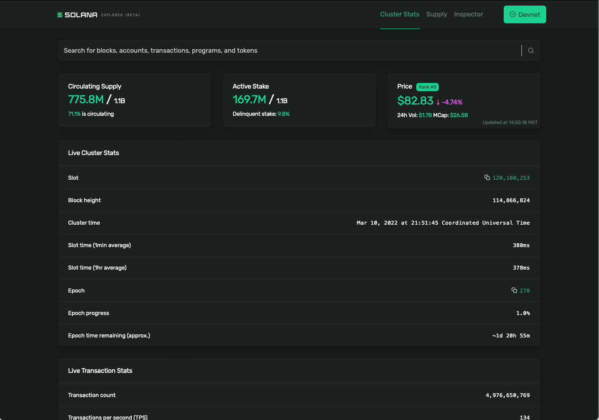
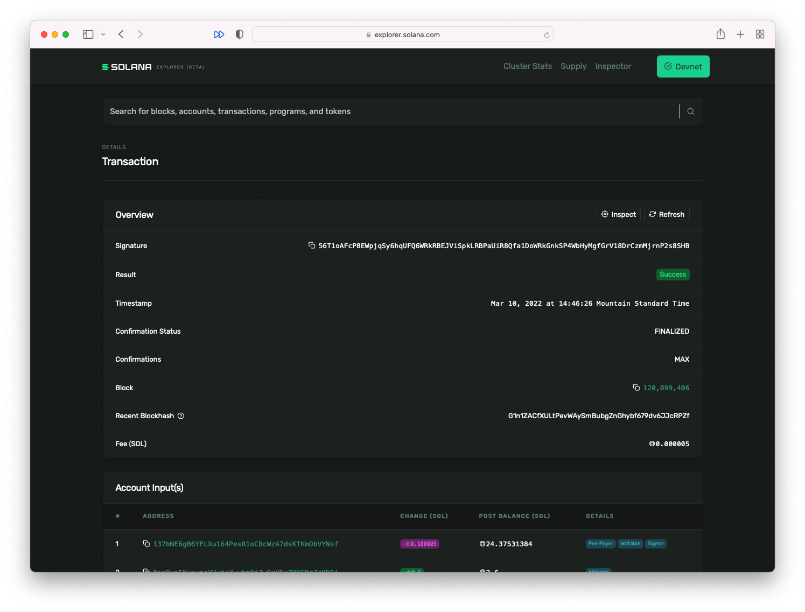

# TL;DR 

对链上数据的所有修改都是通过**交易**发生的。交易主要是一组调用 Solana 程序的指令。交易是原子性的，这意味着它们要么成功（如果所有指令均已正确执行），要么失败（就好像交易根本没有运行一样）。

# 概述

## 交易是原子性的

对链上数据的任何修改都是通过交易（transactions）发起的。

Solana 上的交易与其他地方的交易类似：它是原子性的。**原子性意味着整个事务运行要么全部成功，要么全部失败，不会存在部分成功和部分失败**。

想想在网上进行支付：

  - 您的账户余额已被扣除
  - 银行将资金转给商户

这两件事都需要发生才能使交易成功。如果其中任何一个失败（最好不要发生这些事情），例如向商家付款但不从您的帐户中扣除费用，或者从帐户中扣除但不向商家付款。

原子意味着事务要么发生（意味着所有单独步骤都成功），要么整个事务失败。

## 交易包含指令

Solana 上的交易中含有多个执行任务，这些任务称为**指令**（instructions）。

每条指令包含：

- 账户数组：需要读取和/或写入的帐户数组。这就是 Solana 快速的原因，即如果多个交易分别调用不同的账户，这些交易可以同时被处理
- 程序公钥：要调用的程序的公钥
- 字节数据：传递给被调用程序的数据，结构为字节数组

运行交易时，交易中包含的指令会调用一个或多个 Solana 程序。可以将 Solana 的程序理解为一个库，这个库里边包含一个或多个函数，则交易中的每一条指令就是调用某个库的其中一个函数。

正如您所期望的，`@solana/web3.js` 提供了用于创建交易和指令的辅助函数。您可以使用构造函数 `new Transaction()` 创建一个新交易。创建后，您可以使用 `add()` 方法向交易添加指令。

这些辅助函数之一是 `SystemProgram.transfer()`，它为 `SystemProgram` 发送一条指令来传输一些 SOL，`SystemProgram` 看作一个库，则 `transfer()` 为其中一个函数，这个函数的作用是转移 `SOL`：

```typescript
const transaction = new Transaction()

const sendSolInstruction = SystemProgram.transfer({
  fromPubkey: sender,
  toPubkey: recipient,
  lamports: LAMPORTS_PER_SOL * amount
})

transaction.add(sendSolInstruction)
```

`SystemProgram.transfer()` 函数需要：

- 与发送者帐户对应的公钥
- 与接收者帐户对应的公钥
- 以 lamports 为单位的 SOL 数量。

`SystemProgram.transfer()` 返回将 SOL 从发送者发送到接收者的指令。

本指令中使用的程序将是 `system program` （系统程序，地址为 `11111111111111111111111111111111`），数据是要传输的 SOL 数量（以 Lamports 为单位），帐户数组会包括发送者和接收者。

然后可以将该指令添加到交易中。

添加所有指令后，需要将交易发送到集群（cluster）并确认：

```typescript
const signature = sendAndConfirmTransaction(
  connection,
  transaction,
  [senderKeypair]
)
```

`sendAndConfirmTransaction()` 函数需要以下参数

- 集群连接
- 交易
- 一组密钥对，将充当交易的签名者，在本例中，我们只有一个签名者：发送者。

## 交易需要交易费

交易费构建在 Solana 经济系统中，作为对验证节点网络处理交易所需的 CPU 和 GPU 资源的补偿。Solana 交易费用是确定的。

交易签名者数组中包含的第一个签名者将负责支付交易费用。如果该签名者的帐户中没有足够的 SOL 来支付交易费，则交易将被丢弃，并出现如下错误：

````
> Transaction simulation failed: Attempt to debit an account but found no record of a prior credit.
````

如果您收到此错误，那是因为您的密钥对是全新的，并且没有任何 SOL 来支付交易费。让我们在设置连接后添加以下几行来解决此问题：

```typescript
await airdropIfRequired(
  connection,
  keypair.publicKey,
  1 * LAMPORTS_PER_SOL,
  0.5 * LAMPORTS_PER_SOL,
);
```

这会将 1 SOL 存入您的帐户，您可以将其用于测试。这在主网上行不通，因为它在这上面具有价值。但对于本地和 Devnet 上的测试来说，这是可以运行的。

您还可以在测试时使用 Solana CLI 命令 `solana airdrop 1` 在您的帐户中获取免费的测试 SOL，无论是在本地还是在开发网上。

## Solana 浏览器



区块链上的所有交易都可以在 [Solana Explorer](http://explorer.solana.com) 上公开查看。例如，您可以获取上例中 `sendAndConfirmTransaction()` 返回的签名，在 Solana Explorer 中搜索该签名，然后可以查看：

- 这个交易什么时候发生
- 它包含在哪个区块中
- 交易费用
- 还有更多！



# 实验

我们将创建一个脚本来将 SOL 发送给其他学生。

## 基础脚手架

我们首先使用我们在[密码学简介](./intro-to-cryptography)中文件夹和 `.env` 文件。

创建一个名为 `transfer.ts` 的文件：

```typescript
import {
  Connection,
  Transaction,
  SystemProgram,
  sendAndConfirmTransaction,
  PublicKey,
} from "@solana/web3.js";
import "dotenv/config"
import { getKeypairFromEnvironment } from "@solana-developers/helpers";

const suppliedToPubkey = process.argv[2] || null;

if (!suppliedToPubkey) {
  console.log(`Please provide a public key to send to`);
  process.exit(1);
}

const senderKeypair = getKeypairFromEnvironment("SECRET_KEY");

console.log(`suppliedToPubkey: ${suppliedToPubkey}`);

const toPubkey = new PublicKey(suppliedToPubkey);

const connection = new Connection("https://api.devnet.solana.com", "confirmed");

console.log(
  `✅ Loaded our own keypair, the destination public key, and connected to Solana`
);
```

运行脚本以确保其连接、加载您的密钥，命令行中输入以下指令，：

```
npx esrun transfer.ts (destination wallet address)
```

## 创建交易并运行

继续在 `transfer.ts` 添加以下内容以完成交易并发送：

```typescript
console.log(
  `✅ Loaded our own keypair, the destination public key, and connected to Solana`
);

const transaction = new Transaction();

const LAMPORTS_TO_SEND = 5000;

const sendSolInstruction = SystemProgram.transfer({
  fromPubkey: senderKeypair.publicKey,
  toPubkey,
  lamports: LAMPORTS_TO_SEND,
});

transaction.add(sendSolInstruction);

const signature = await sendAndConfirmTransaction(connection, transaction, [
  senderKeypair,
]);

console.log(
  `💸 Finished! Sent ${LAMPORTS_TO_SEND} to the address ${toPubkey}. `
);
console.log(`Transaction signature is ${signature}!`);
```
## 最终效果!

将 SOL 发送给班上的其他学生。

```
npx esrun transfer.ts (destination wallet address)
```

# 挑战

回答下列问题：

  - 转移的交易费需要多少 SOL？这是多少美元？

  - 您可以在 [Solana explorer](https://explorer.solana.com) 上找到您的交易吗？请记住，我们正在使用 `devnet` 网络。

  - 转账需要多长时间？

  - 您认为 `confirmed` 是什么意思？

## 完成实验了吗？

将您的代码推送到 GitHub 并[告诉我们您对本课程的看法](https://form.typeform.com/to/IPH0UGz7#answers-lesson=dda6b8de-9ed8-4ed2-b1a5-29d7a8a8b415)！