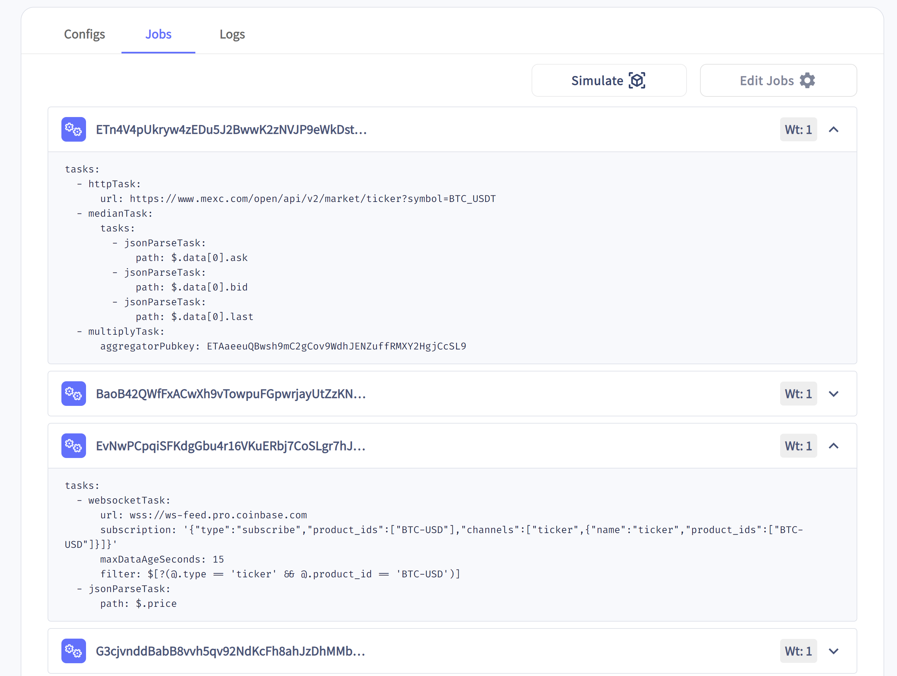

# 总结

- 神谕是为区块链网络提供外部数据的服务
- Solana上有两个主要的神谕提供商：**Switchboard**和**Pyth**
- 您可以构建自己的神谕来创建自定义数据提要
- 在选择数据提供商时要小心

# 课程

神谕是为区块链网络提供外部数据的服务。区块链天生是封闭的环境，不了解外部世界。这种限制固有地限制了去中心化应用（dApps）的用例。神谕通过创建去中心化的方式将现实世界的数据推送到链上来解决了这种限制。

神谕可以提供几乎任何类型的链上数据。例如：

- 体育赛事结果
- 天气数据
- 政治选举结果
- 市场数据
- 随机性

虽然具体实现可能因区块链而异，但通常神谕工作如下：

1. 数据在链下获取。
2. 该数据通过交易发布到链上并存储在一个账户中。
3. 程序可以读取存储在账户中的数据并在其逻辑中使用。

本课程将介绍神谕工作的基础知识、Solana上的神谕状态以及如何有效地在Solana开发中使用神谕。

## 信任和神谕网络

神谕需要克服的主要障碍是信任问题。由于区块链执行不可逆的财务交易，开发人员和用户都需要知道他们可以信任神谕数据的有效性和准确性。信任神谕的第一步是了解其实施方式。

广义上，有三种实施类型：

1. 单一、集中的神谕在链上发布数据。
    1. 优点：简单；只有一个真相来源。
    2. 缺点：没有阻止神谕提供商提供不准确的数据。
2. 多个神谕发布数据，使用共识机制确定最终结果。
    1. 优点：共识使得不良数据较少被推送到链上。
    2. 缺点：没有办法防止不良行为者发布不良数据并试图影响共识。
3. 具有某种权益证明机制的神谕网络。例如，要求神谕抵押代币参与共识机制。在每次响应时，如果一个神谕的偏离范围超出一定阈值，其抵押将被协议收走，并且它将无法报告。
    1. 优点：确保没有单一神谕能够太大幅度地影响最终结果，同时激励诚实和准确的行为。
    2. 缺点：构建去中心化网络具有挑战性，需要正确设置激励并足够吸引参与等。

根据神谕的用例，以上任何一种解决方案都可能是正确的方法。例如，您可能完全愿意参与一个利用中心化神谕在链上发布游戏信息的基于区块链的游戏。

另一方面，您可能不太愿意信任为交易应用程序提供价格信息的中心化神谕。

您可能最终为自己的应用程序创建许多独立的神谕，只是为了获得您需要的链下信息。然而，这些神谕不太可能被广大社区使用，因为去中心化是核心原则。您还应该对使用中心化第三方神谕持保留态度。

在理想的世界中，所有重要和/或有价值的数据都应通过高效的神谕网络通过可信赖的权益证明共识机制提供到链上。通过引入抵押机制，神谕提供者有充分的动力确保它们的数据准确，以保持它们的抵押资金。

即使一个神谕网络声称拥有这样的共识机制，也要了解使用该网络所涉及的风险。如果下游应用程序涉及的总价值大于神谕分配的抵押资金，神谕仍然可能有足够的动机合谋。

了解神谕网络的配置并判断是否可信是您的工作。通常，神谕应仅用于非关键任务，应考虑最坏情况。

## Solana上的神谕

[Pyth](https://pyth.network)和[Switchboard](https://switchboard.xyz)是当前Solana上的两个主要神谕提供商。它们各自独特，遵循略微不同的设计选择。

**Pyth**主要侧重于来自顶级金融机构发布的金融数据。Pyth的数据提供者发布市场数据更新。然后，这些更新由Pyth程序进行聚合并在链上发布。Pyth的数据并非完全去中心化，因为只有经过批准的数据提供者可以发布数据。Pyth的卖点在于，它的数据直接由平台进行审查并且来自金融机构，确保更高的质量。

**Switchboard**是完全去中心化的神谕网络，可提供各种数据。在他们的网站上查看所有提要[https://app.switchboard.xyz/solana/devnet/explore](https://app.switchboard.xyz/solana/devnet/explore) 此外，任何人都可以运行Switchboard的神谕，任何人都可以使用他们的数据。这意味着您需要在研究提要时保持警惕。我们将在课程的后续部分更多地讨论要注意的事项。

Switchboard遵循先前部分所述的第三个选项中权益权重神谕网络的变体。它通过引入所谓的TEE（受信执行环境）来实现。TEE是与系统其余部分隔离的安全环境，可以在其中执行敏感代码。简单来说，给定一个程序和一个输入，TEE可以执行并生成一个输出以及证据。如果您想了解更多关于TEE的信息，请阅读[Switchboard的文档](https://docs.switchboard.xyz/functions)。

通过在权益权重神谕上引入TEE，Switchboard能够验证每个神谕的软件以允许其参与网络。如果一个神谕运营商进行恶意操作并尝试更改批准代码的操作，数据报价验证将失败。这使得Switchboard的神谕能够 beyond量化价值报告运行--运行链下的自定义和保密计算等功能。

## Switchboard神谕

Switchboard的神谕使用数据提要将数据存储在Solana上。这些数据提要，也称为聚合器，是由Switchboard程序管理的一系列工作的集合，用于生成单一结果。这些聚合器在链上表示为常规的Solana账户。当一个神谕更新时，它直接将数据写入这些账户。让我们了解一些术语，以了解Switchboard的工作方式：


- **[聚合器（数据源）](https://github.com/switchboard-xyz/sbv2-solana/blob/0b5e0911a1851f9ca37042e6ff88db4cd840067b/rust/switchboard-solana/src/oracle_program/accounts/aggregator.rs#L60)** - 包含数据源配置，指定如何从指定源请求、更新和解决数据源更新的方式。聚合器是Switchboard Solana程序拥有的账户，也是数据发布到链上的地方。
- **[任务](https://github.com/switchboard-xyz/sbv2-solana/blob/0b5e0911a1851f9ca37042e6ff88db4cd840067b/rust/switchboard-solana/src/oracle_program/accounts/job.rs)** - 每个数据源应该对应一个任务账户。任务账户是一组Switchboard任务，用于指示神谕如何获取和转换数据。换句话说，它存储了从特定数据源获取数据的蓝图。
- **神谕** - 位于互联网和区块链之间并促进信息流动的独立程序。神谕会读取数据源的任务定义，计算结果并在链上提交其响应。
- **神谕队列** - 由一组神谕组成，以轮询的方式分配更新请求。队列中的神谕必须在链上进行主动心跳以提供更新。用于该队列的数据和配置存储在一个[由Switchboard程序拥有的账户](https://github.com/switchboard-xyz/solana-sdk/blob/9dc3df8a5abe261e23d46d14f9e80a7032bb346c/javascript/solana.js/src/generated/oracle-program/accounts/OracleQueueAccountData.ts#L8)中。
- **神谕一致性** - 决定神谕在接受的链上结果上达成一致的方式。Switchboard神谕使用中位数的神谕响应作为接受的结果。数据源机构能够控制请求的神谕数量以及必须响应的数量，以影响其安全性。

Switchboard神谕被激励更新数据源，因为他们会因准确更新数据源而获得奖励。每个数据源都有一个`LeaseContract`账户。租赁合同是一个预先资助的托管账户，用于奖励神谕履行更新请求。只有预定义的`leaseAuthority`可以从合同提款，但任何人都可以贡献。当对数据源请求新一轮更新时，请求更新的用户将从托管账户中获得奖励。这是为了激励用户和转动曲柄者（任何运行软件以系统化地向神谕发送更新请求的人）根据数据源的配置保持更新。一旦更新请求已经成功地由队列中的神谕提交到链上，神谕也会从托管账户中获得奖励。这些支付确保了积极的参与。

此外，神谕在能够服务更新请求和提交链上响应之前必须抵押代币。如果一个神谕提交的在链上结果超出了队列的配置参数，他们的抵押将被削减（如果队列启用了`slashingEnabled`）。这有助于确保神谕以诚信并准确的信息作出反应。

现在你已经了解了术语和经济学，让我们来看看数据如何在链上发布：

1. 神谕队列设置 - 当从队列请求更新时，下一个`N`个神谕被分配到更新请求并排到队列的最后。Switchboard网络中的每个神谕队列都是独立的，并且具有自己的配置。这个设计选择使用户能够定制神谕队列的行为，以匹配他们特定的用例。一个神谕队列存储在链上作为一个账户，并且包含有关队列的元数据。调用[oracleQueueInit指令](https://github.com/switchboard-xyz/solana-sdk/blob/9dc3df8a5abe261e23d46d14f9e80a7032bb346c/javascript/solana.js/src/generated/oracle-program/instructions/oracleQueueInit.ts#L13)在Switchboard Solana程序上可以创建队列。
   1. 一些相关的神谕队列配置：
      1. `oracle_timeout` - 如果过期神谕未能进行心跳，则将删除的间隔。
      2. `reward` - 为此队列上的神谕和轮开者提供的奖励。
      3. `min_stake` - 神谕必须提供的最低抵押金额以继续保持在队列上的数量。
      4. `size` - 队列上当前的神谕数量。
      5. `max_size` - 一个队列可以支持的神谕的最大数量。
2. 聚合器/数据源设置 - 创建聚合器/数据源账户。一个数据源属于一个单独的神谕队列。数据源的配置决定了如何通过网络调用和路由更新请求。
3. 任务账户设置 - 除了数据源，必须为每个数据源设置一个任务账户。这定义了神谕如何履行数据源的更新请求。这包括定义神谕应该从数据源获取数据的位置。
4. 请求分配 - 一旦使用数据源账户请求更新，神谕队列会将请求分配给队列中不同的神谕/节点进行完成。神谕将根据每个任务账户中定义的数据源获取数据。每个任务账户都有相关的权重。神谕将计算所有任务中结果的加权中位数。
5. 接收到`minOracleResults` 响应后，链上程序会使用神谕响应的中位数计算结果。响应队列配置参数内的神谕将受到奖励，而在此阈值之外响应的神谕将会被削减（如果队列启用了`slashingEnabled`）。
6. 更新后的结果存储在数据源账户中，以便可以在链上读取/消耗。

### 如何使用Switchboard神谕

要使用Switchboard神谕并将链下数据纳入Solana程序，首先必须找到一个提供你所需数据的数据源。Switchboard数据源是公开的，有许多[可以选择的](https://app.switchboard.xyz/solana/devnet/explore)。当寻找数据源时，你必须决定你需要多精确/可靠的数据流、你想要从何处获取数据以及数据源的更新频率。当消费公开可用的数据源时，你对这些事情没有控制权，因此要谨慎选择！


例如，有一个由Switchboard赞助的[BTC_USD feed](https://app.switchboard.xyz/solana/devnet/feed/8SXvChNYFhRq4EZuZvnhjrB3jJRQCv4k3P4W6hesH3Ee)。该feed在Solana开发网络/主网上可用，使用公钥`8SXvChNYFhRq4EZuZvnhjrB3jJRQCv4k3P4W6hesH3Ee`。它提供了比特币兑美元的当前价格链上数据。

Switchboard feed账户的实际链上数据看起来有点像这样：

```rust
// from the switchboard solana program
// https://github.com/switchboard-xyz/sbv2-solana/blob/0b5e0911a1851f9ca37042e6ff88db4cd840067b/rust/switchboard-solana/src/oracle_program/accounts/aggregator.rs#L60

pub struct AggregatorAccountData {
    /// 用于在链上存储的聚合器名称。
    pub name: [u8; 32],
    ...
		...
    /// 聚合器所属队列的公钥。
    pub queue_pubkey: Pubkey,
    ...
    /// 在验证完一轮之前所需的最小oracle响应数量。
    pub min_oracle_results: u32,
    /// 在oracle接受结果前所需的最小作业结果数量。
    pub min_job_results: u32,
    /// 在聚合器轮之间所需的最小秒数。
    pub min_update_delay_seconds: u32,
    ...
    /// 前一轮和当前轮之间所需的变化百分比。如果未达到方差百分比，则拒绝新的oracle响应。
    pub variance_threshold: SwitchboardDecimal,
    ...
		/// 已接受为有效的最新确认的更新请求结果。您将在latest_confirmed_round.result中找到正在请求的数据。
	  pub latest_confirmed_round: AggregatorRound,
		...
    /// 上一个已确认的轮结果。
    pub previous_confirmed_round_result: SwitchboardDecimal,
    /// 上一个已确认的轮被打开时的槽。
    pub previous_confirmed_round_slot: u64,
		...
}
```

可以在[Switchboard程序的此处](https://github.com/switchboard-xyz/sbv2-solana/blob/0b5e0911a1851f9ca37042e6ff88db4cd840067b/rust/switchboard-solana/src/oracle_program/accounts/aggregator.rs#L60)查看此数据结构的完整代码。

`AggregatorAccountData`类型的一些相关字段和配置包括：

- `min_oracle_results` - 在验证完一轮之前所需的最小oracle响应数量。
- `min_job_results` - 在oracle接受结果前所需的最小作业结果数量。
- `variance_threshold` - 前一轮和当前轮之间所需的变化百分比。如果未达到方差百分比，则拒绝新的oracle响应。
- `latest_confirmed_round` - 已接受为有效的最新确认的更新请求结果。您将在`latest_confirmed_round.result`中找到feed的数据。
- `min_update_delay_seconds` - 在聚合器轮之间所需的最小秒数。

上面列出的前三个配置直接与数据feed的准确性和可靠性有关。

`min_job_results`字段表示oracle必须从数据源接收成功响应的最小数量，然后才能在链上提交自己的响应。这意味着如果`min_job_results`为三，则每个oracle必须从三个作业源中获取数据。此数字越高，feed上的数据越可靠和准确。这也限制了单个数据源对结果的影响。

`min_oracle_results`字段是成功完成一轮所需的最小oracle响应数量。请记住，队列中的每个oracle都从被定义为作业的每个源中获取数据。然后，oracle获取源的响应的加权中值，并将该中值提交到链上。然后程序会等待加权中值的`min_oracle_results`，并获取其中的中值，这是存储在数据feed账户中的最终结果。

`min_update_delay_seconds`字段与feed的更新频率直接相关。在Switchboard程序接受结果之前，必须间隔`min_update_delay_seconds`秒才能进行下一轮更新。

查看Switchboard的资源管理器中的feed的作业选项卡可能会有所帮助。例如，可以查看[资源管理器中的BTC_USD feed](https://app.switchboard.xyz/solana/devnet/feed/8SXvChNYFhRq4EZuZvnhjrB3jJRQCv4k3P4W6hesH3Ee)。列出的每个作业定义了oracle将从中获取数据的源以及每个源的加权。您可以查看为此特定feed提供数据的实际API端点。在确定要在您的程序中使用哪个数据feed时，这样的事项非常重要。

以下是与BTC_USD feed相关的两个作业。它展示了两个数据源：[MEXC](https://www.mexc.com/) 和 [Coinbase](https://www.coinbase.com/)。



选择了要使用的feed后，您可以开始读取该feed中的数据。简单地通过反序列化并读取存储在账户中的状态来完成。在您的程序中，最简单的方法就是利用`switchboard_v2`包中我们上面定义的`AggregatorAccountData`结构。

```rust
// 导入anchor和switchboard包
use {
    anchor_lang::prelude::*,
    switchboard_v2::AggregatorAccountData,
};

...

#[derive(Accounts)]
pub struct ConsumeDataAccounts<'info> {
	// 传入feed聚合器账户并反序列化为AggregatorAccountData
	pub feed_aggregator: AccountLoader<'info, AggregatorAccountData>,
	...
}
```

请注意，这里我们使用的是`AccountLoader`类型，而不是普通的`Account`类型来反序列化聚合器账户。由于`AggregatorAccountData`占用空间较大，账户使用了所谓的零拷贝。结合`AccountLoader`，我们的程序直接访问数据而不是将其加载到内存中。在使用`AccountLoader`时，我们可以通过以下三种方式之一访问账户中存储的数据：

- 在初始化账户后`load_init`（这将忽略仅在用户指令代码之后才添加的缺少账户识别器）
- 当账户不可变时使用`load`
- 当账户可变时使用`load_mut`

如果您想了解更多，请查看[Advance Program Architecture lesson](./program-architecture)，我们在其中介绍了`Zero-Copy`和`AccountLoader`。


使用传入您的程序的聚合器账户，您可以使用它来获取最新的预言机结果。具体来说，您可以使用类型的 `get_result()` 方法：

```rust
// 在 Anchor 程序内
...

let feed = &ctx.accounts.feed_aggregator.load()?;
// 获取结果
let val: f64 = feed.get_result()?.try_into()?;
```

在 `AggregatorAccountData` 结构上定义的 `get_result()` 方法，比使用 `latest_confirmed_round.result` 获取数据更为安全，因为 Switchboard 已经实现了一些巧妙的安全检查。

```rust
// 来自 switchboard 程序
// https://github.com/switchboard-xyz/sbv2-solana/blob/0b5e0911a1851f9ca37042e6ff88db4cd840067b/rust/switchboard-solana/src/oracle_program/accounts/aggregator.rs#L195

pub fn get_result(&self) -> anchor_lang::Result<SwitchboardDecimal> {
    if self.resolution_mode == AggregatorResolutionMode::ModeSlidingResolution {
        return Ok(self.latest_confirmed_round.result);
    }
    let min_oracle_results = self.min_oracle_results;
    let latest_confirmed_round_num_success = self.latest_confirmed_round.num_success;
    if min_oracle_results > latest_confirmed_round_num_success {
        return Err(SwitchboardError::InvalidAggregatorRound.into());
    }
    Ok(self.latest_confirmed_round.result)
}
```

您还可以在 Typescript 中查看存储在 `AggregatorAccountData` 帐户中的当前值。

```tsx
import { AggregatorAccount, SwitchboardProgram} from '@switchboard-xyz/solana.js'

...
...
// 为测试用户创建密钥对
let user = new anchor.web3.Keypair()

// 获取 switchboard 开发网络程序对象
switchboardProgram = await SwitchboardProgram.load(
  "devnet",
  new anchor.web3.Connection("https://api.devnet.solana.com"),
  user
)

// 将 switchboard 程序对象和 feed 公钥传递给 AggregatorAccount 构造函数
aggregatorAccount = new AggregatorAccount(switchboardProgram, solUsedSwitchboardFeed)

// 获取最新的 SOL 价格
const solPrice: Big | null = await aggregatorAccount.fetchLatestValue()
if (solPrice === null) {
  throw new Error('Aggregator holds no value')
}
```

请记住，Switchboard 数据源只是由第三方（预言机）更新的帐户。鉴于此，您可以使用账户外部的程序一样处理该帐户。

### 最佳实践和常见陷阱

将 Switchboard 数据源整合到程序中时，有两组需考虑的问题：选择数据源和实际使用该数据源的数据。

在决定是否将数据源整合到程序中之前，始终要审查数据源的设置。设置例如**最小更新延迟**、**最小作业结果**和**最小预言机结果**直接影响最终持久化到聚合器帐户上的数据。例如，查看[BTC_USD 数据源的配置部分](https://app.switchboard.xyz/solana/devnet/feed/8SXvChNYFhRq4EZuZvnhjrB3jJRQCv4k3P4W6hesH3Ee)，您可以了解其相关配置。


BTC_USD 数据源具有最小更新延迟 = 6 秒。这意味着该数据源上的 BTC 价格仅在最短 6 秒内更新一次。对于大多数用例来说，这可能是可以接受的，但如果要将该数据源用于某些对延迟敏感的情况，则显然不是一个好选择。

还值得审查数据源的源自在预言机资源浏览器的作业部分。由于在链上持久化的值是预言机从每个源中获取的加权中位数结果，这些源直接影响存储在数据源中的内容。检查可疑链接，并可能自行运行（一段时间） API，以增加对其的信心。

找到符合需求的数据源后，您仍需确保正确使用此数据源。例如，您仍应在指令传递的帐户上实现必要的安全检查。任何账户都可以传递到程序的指令中，因此您应验证它是您预期的帐户。

在 Anchor 中，如果从 `switchboard_v2` 模块的 `AggregatorAccountData` 类型中反序列化帐户，Anchor 将检查该账户是否由 Switchboard 程序拥有。如果您的程序希望只能传入特定的数据源，则也可以验证传入的帐户的公钥与所预期的公钥匹配。一个方法是在程序中某处硬编码地址，并使用帐户约束验证传入的地址是否与预期的匹配。

```rust
use {
  anchor_lang::prelude::*,
  solana_program::{pubkey, pubkey::Pubkey},
	switchboard_v2::{AggregatorAccountData},
};

pub static BTC_USDC_FEED: Pubkey = pubkey!("8SXvChNYFhRq4EZuZvnhjrB3jJRQCv4k3P4W6hesH3Ee");

...
...

#[derive(Accounts)]
pub struct TestInstruction<'info> {
	// Switchboard SOL 数据源聚合器
	#[account(
	    address = BTC_USDC_FEED
	)]
	pub feed_aggregator: AccountLoader<'info, AggregatorAccountData>,
}
```

除了确保聚合器帐户是预期的帐户之外，您还可以在程序指令逻辑中针对数据源中存储的数据执行一些检查。需要检查的两个常见事项是数据陈旧性和置信区间。

当预言机触发时，每个数据源更新其中存储的当前值。这意味着更新取决于分配给其的预言机队列中的预言机。根据您打算使用数据源的方式，验证存储在数据源中的值是否最近更新可能会有益。例如，需要确定贷款抵押是否低于某个级别的贷款协议可能需要数据不超过几秒钟。您可以让代码检查聚合器帐户中最近更新的时间戳。以下代码段检查数据源中的最近更新时间戳不超过 30 秒。

```rust
use {
    anchor_lang::prelude::*,
    anchor_lang::solana_program::clock,
    switchboard_v2::{AggregatorAccountData, SwitchboardDecimal},
};

...
...

let feed = &ctx.accounts.feed_aggregator.load()?;
if (clock::Clock::get().unwrap().unix_timestamp - feed.latest_confirmed_round.round_open_timestamp) <= 30{
      valid_transfer = true;
  }
```

`AggregatorAccountData` 结构上的 `latest_confirmed_round` 字段的类型是定义为 `AggregatorRound` 的：


```rust
pub struct AggregatorRound {
    /// 维护从节点接收的成功响应数量。
    /// 节点可以每轮提交一个成功响应。
    pub num_success: u32,
    /// 错误响应的数量。
    pub num_error: u32,
    /// 更新请求轮是否结束。
    pub is_closed: bool,
    /// 维护该轮开始时的 `solana_program::clock::Slot`。
    pub round_open_slot: u64,
    /// 维护该轮开始时的 `solana_program::clock::UnixTimestamp`。
    pub round_open_timestamp: i64,
    /// 维护所有成功轮响应的当前中位数。
    pub result: SwitchboardDecimal,
    /// 该轮接受结果的标准偏差。
    pub std_deviation: SwitchboardDecimal,
    /// 维护本轮的最小节点响应。
    pub min_response: SwitchboardDecimal,
    /// 维护本轮的最大节点响应。
    pub max_response: SwitchboardDecimal,
    /// 满足本轮的预言机的公钥。
    pub oracle_pubkeys_data: [Pubkey; 16],
    /// 本轮所有成功节点响应的代表。如果为空，则为 `NaN`。
    pub medians_data: [SwitchboardDecimal; 16],
    /// 本轮预言机收到的当前奖励/处罚。
    pub current_payout: [i64; 16],
    /// 跟踪此处响应是否被满足。
    pub medians_fulfilled: [bool; 16],
    /// 跟踪此处错误是否被满足。
    pub errors_fulfilled: [bool; 16],
}
```

Aggregator 账户数据还有一个 `check_confidence_interval()` 方法，你可以将其作为数据验证的另一个方法。该方法允许你传入一个 `max_confidence_interval`。如果来自预言机的结果的标准偏差大于给定的 `max_confidence_interval`，它将返回一个错误。

```rust
pub fn check_confidence_interval(
    &self,
    max_confidence_interval: SwitchboardDecimal,
) -> anchor_lang::Result<()> {
    if self.latest_confirmed_round.std_deviation > max_confidence_interval {
        return Err(SwitchboardError::ConfidenceIntervalExceeded.into());
    }
    Ok(())
}
```

你可以将其整合到你的程序中，如下所示：

```rust
use {
    crate::{errors::*},
    anchor_lang::prelude::*,
    std::convert::TryInto,
    switchboard_v2::{AggregatorAccountData, SwitchboardDecimal},
};

...
...

let feed = &ctx.accounts.feed_aggregator.load()?;

// 检查 feed 是否超过 max_confidence_interval
feed.check_confidence_interval(SwitchboardDecimal::from_f64(max_confidence_interval))
    .map_err(|_| error!(ErrorCode::ConfidenceIntervalExceeded))?;
```

最后，在你的程序中，要为最坏情况做好计划。计划 feed 可能会过时，并计划 feed 账户关闭。

## 结论

如果你想要能够根据实时数据执行操作的有效程序，你将不得不使用预言机。幸运的是，有一些值得信赖的预言机网络，像 Switchboard，它们使使用预言机变得比以往更容易。但是，确保对你使用的预言机进行尽职调查。最终，你对你的程序行为负责！

# 实验

让我们练习使用预言机！我们将构建一个“Michael Burry Escrow”程序，将 SOL 锁定在托管账户中，直到 SOL 的美元价值高于一定的价值。这个程序以投资者 [迈克尔·伯里](https://en.wikipedia.org/wiki/Michael_Burry) 命名，他以预测 2008 年房地产市场崩盘而闻名。

我们将使用 devnet 的 [SOL_USD](https://app.switchboard.xyz/solana/devnet/feed/GvDMxPzN1sCj7L26YDK2HnMRXEQmQ2aemov8YBtPS7vR) 预言机来自 Switchboard。该程序有两个主要指令：

- 存款 - 锁定 SOL，并设置解锁时的美元价格。
- 提取 - 检查美元价格，如果满足条件则提取 SOL。

### 1. 程序设置

要开始，请使用以下命令创建程序

```zsh
anchor init burry-escrow
```

接下来，将 `lib.rs` 和 `Anchor.toml` 中的程序 ID 替换为运行 `anchor keys list` 时显示的程序 ID。

然后，将以下内容添加到 Anchor.toml 文件的末尾。这将告诉 Anchor 如何配置我们的本地测试环境。这将允许我们在本地测试程序，而无需部署并发送交易到 devnet。

```zsh
// Anchor.toml 末尾
[test.validator]
url="https://api.devnet.solana.com"

[test]
startup_wait = 10000

[[test.validator.clone]] # sbv2 devnet programID
address = "SW1TCH7qEPTdLsDHRgPuMQjbQxKdH2aBStViMFnt64f"

[[test.validator.clone]] # sbv2 devnet IDL
address = "Fi8vncGpNKbq62gPo56G4toCehWNy77GgqGkTaAF5Lkk"

[[test.validator.clone]] # sbv2 SOL/USD Feed
address="GvDMxPzN1sCj7L26YDK2HnMRXEQmQ2aemov8YBtPS7vR"
```


**附加信息：**我们还希望在我们的 `Cargo.toml` 文件中导入 `switchboard-v2` 箱。 确保你的依赖项如下所示：

```toml
[dependencies]
anchor-lang = "0.28.0"
switchboard-v2 = "0.4.0"
```

在开始逻辑之前，让我们先来看一下我们程序的结构。对于小型程序来说，将所有智能合约代码添加到一个名为 `lib.rs` 的文件中是非常容易的。但为了更有组织性，将其拆分到不同的文件中会更有帮助。我们的程序将在 `programs/src` 目录中有以下文件：

`/instructions/deposit.rs`

`/instructions/withdraw.rs`

`/instructions/mod.rs`

`errors.rs`

`state.rs`

`lib.rs`

`lib.rs` 文件仍将作为我们程序的入口点，但每个指令的逻辑将在它们自己的单独文件中。请创建上述所描述的程序架构，然后我们将开始。

### 2. `lib.rs`

在编写任何逻辑之前，我们将设置所有样板信息。我们先从 `lib.rs` 开始。我们的实际逻辑将放在 `/instructions` 目录中。

`lib.rs` 文件将作为我们程序的入口点。它将定义所有交易必须经过的 API 端点。

```rust
use anchor_lang::prelude::*;
use instructions::deposit::*;
use instructions::withdraw::*;
use state::*;

pub mod instructions;
pub mod state;
pub mod errors;

declare_id!("YOUR_PROGRAM_KEY_HERE");

#[program]
mod burry_oracle_program {

    use super::*;

    pub fn deposit(ctx: Context<Deposit>, escrow_amt: u64, unlock_price: u64) -> Result<()> {
        deposit_handler(ctx, escrow_amt, unlock_price)
    }

    pub fn withdraw(ctx: Context<Withdraw>) -> Result<()> {
        withdraw_handler(ctx)
    }
}
```

### 3. `state.rs`

接下来，让我们定义程序的数据账户：`EscrowState`。我们的数据账户将存储两个信息：

- `unlock_price` - 用户可以提取的 SOL 的 USD 价格；您可以将其硬编码为任何您想要的值（例如 $21.53）
- `escrow_amount` - 追踪存储在托管账户中的 lamports 数量

我们还将定义我们的 PDA 种子为 `"MICHAEL BURRY"` 和我们硬编码的 SOL_USD oracle 公钥为 `SOL_USDC_FEED`。

```rust
// in state.rs
use anchor_lang::prelude::*;

pub const ESCROW_SEED: &[u8] = b"MICHAEL BURRY";
pub const SOL_USDC_FEED: &str = "GvDMxPzN1sCj7L26YDK2HnMRXEQmQ2aemov8YBtPS7vR";

#[account]
pub struct EscrowState {
    pub unlock_price: f64,
    pub escrow_amount: u64,
}
```

### 4. Errors

让我们定义在整个程序中将使用的自定义错误。在 `errors.rs` 文件中，粘贴以下内容：

```rust
use anchor_lang::prelude::*;

#[error_code]
#[derive(Eq, PartialEq)]
pub enum EscrowErrorCode {
    #[msg("Not a valid Switchboard account")]
    InvalidSwitchboardAccount,
    #[msg("Switchboard feed has not been updated in 5 minutes")]
    StaleFeed,
    #[msg("Switchboard feed exceeded provided confidence interval")]
    ConfidenceIntervalExceeded,
    #[msg("Current SOL price is not above Escrow unlock price.")]
    SolPriceAboveUnlockPrice,
}
```

### 5. `mod.rs`

让我们设置我们的 `instructions/mod.rs` 文件。

```rust
// inside mod.rs
pub mod deposit;
pub mod withdraw;
```

### 6. **Deposit**

现在我们已经处理了所有样板内容，让我们开始处理存款指令。这将位于 `/src/instructions/deposit.rs` 文件中。当用户存款时，应该创建一个具有“MICHAEL BURRY”字符串和用户公钥作为种子的 PDA。这从本质上意味着用户一次只能打开一个托管账户。指令应该会在此 PDA 上初始化一个账户，并向其中发送用户想要锁定的 SOL 数量。用户需要成为签署者。

首先让我们构建 `Deposit` 上下文结构。为此，我们需要考虑为此指令需要哪些账户。我们从以下开始：

```rust
//inside deposit.rs
use crate::state::*;
use anchor_lang::prelude::*;
use anchor_lang::solana_program::{
    system_instruction::transfer,
    program::invoke
};

#[derive(Accounts)]
pub struct Deposit<'info> {
    // user account
    #[account(mut)]
    pub user: Signer<'info>,
    #[account(
      init,
      seeds = [ESCROW_SEED, user.key().as_ref()],
      bump,
      payer = user,
      space = std::mem::size_of::<EscrowState>() + 8
    )]
    pub escrow_account: Account<'info, EscrowState>,
		// system program
    pub system_program: Program<'info, System>,
}
```

注意我们添加到账户中的约束：
- 因为我们将从用户账户转移 SOL 到 `escrow_state` 账户，它们都需要可变。
- 我们知道 `escrow_account` 应该是通过“MICHAEL BURRY”字符串和用户的公钥派生的 PDA。我们可以使用 Anchor 账户约束来保证传入的地址确实满足该要求。
- 我们还知道我们必须在此 PDA 上初始化一个账户来存储程序的一些状态。我们在这里使用了 `init` 约束。

接下来，我们将进入实际逻辑。我们需要做的就是初始化 `escrow_state` 账户的状态并转移 SOL。我们期望用户传递他们想要锁定在托管中的 SOL 金额和解锁它的价格。我们将把这些值存储在 `escrow_state` 账户中。

之后，该方法应执行转移。此程序将锁定本机 SOL。因此，我们不需要使用代币账户或 Solana 代币程序。我们将必须使用 `system_program` 来转移用户想要锁定的 lamports 到托管中，并调用转移指令。


```rust
pub fn deposit_handler(ctx: Context<Deposit>, escrow_amt: u64, unlock_price: u64) -> Result<()> {
		msg!("Depositing funds in escrow...");

    let escrow_state = &mut ctx.accounts.escrow_account;
    escrow_state.unlock_price = unlock_price;
    escrow_state.escrow_amount = escrow_amount;

    let transfer_ix = transfer(
      &ctx.accounts.user.key(),
      &escrow_state.key(),
      escrow_amount
    );

    invoke(
        &transfer_ix,
        &[
            ctx.accounts.user.to_account_info(),
            ctx.accounts.escrow_account.to_account_info(),
            ctx.accounts.system_program.to_account_info()
        ]
    )?;

    msg!("Transfer complete. Escrow will unlock SOL at {}", &ctx.accounts.escrow_account.unlock_price);
}
```

这是存款指令的要点！`deposit.rs` 文件最终结果如下所示：

```rust
use crate::state::*;
use anchor_lang::prelude::*;
use anchor_lang::solana_program::{
    system_instruction::transfer,
    program::invoke
};

pub fn deposit_handler(ctx: Context<Deposit>, escrow_amount: u64, unlock_price: f64) -> Result<()> {
    msg!("Depositing funds in escrow...");

    let escrow_state = &mut ctx.accounts.escrow_account;
    escrow_state.unlock_price = unlock_price;
    escrow_state.escrow_amount = escrow_amount;

    let transfer_ix = transfer(
        &ctx.accounts.user.key(),
        &escrow_state.key(),
        escrow_amount
    );

    invoke(
        &transfer_ix,
        &[
            ctx.accounts.user.to_account_info(),
            ctx.accounts.escrow_account.to_account_info(),
            ctx.accounts.system_program.to_account_info()
        ]
    )?;

    msg!("Transfer complete. Escrow will unlock SOL at {}", &ctx.accounts.escrow_account.unlock_price);

    Ok(())
}

#[derive(Accounts)]
pub struct Deposit<'info> {
    // user account
    #[account(mut)]
    pub user: Signer<'info>,
    // account to store SOL in escrow
    #[account(
        init,
        seeds = [ESCROW_SEED, user.key().as_ref()],
        bump,
        payer = user,
        space = std::mem::size_of::<EscrowState>() + 8
    )]
    pub escrow_account: Account<'info, EscrowState>,

    pub system_program: Program<'info, System>,
}
```

**Withdraw**

提款指令将需要与存款指令相同的三个账户，另外还需要 SOL_USDC Switchboard 数据源账户。以下代码将放在 `withdraw.rs` 文件中。

```rust
use crate::state::*;
use crate::errors::*;
use std::str::FromStr;
use anchor_lang::prelude::*;
use switchboard_v2::AggregatorAccountData;
use anchor_lang::solana_program::clock::Clock;

#[derive(Accounts)]
pub struct Withdraw<'info> {
    // user account
    #[account(mut)]
    pub user: Signer<'info>,
    // escrow account
    #[account(
        mut,
        seeds = [ESCROW_SEED, user.key().as_ref()],
        bump,
        close = user
    )]
    pub escrow_account: Account<'info, EscrowState>,
    // Switchboard SOL feed aggregator
    #[account(
        address = Pubkey::from_str(SOL_USDC_FEED).unwrap()
    )]
    pub feed_aggregator: AccountLoader<'info, AggregatorAccountData>,
    pub system_program: Program<'info, System>,
}
```

请注意，我们使用了 close 约束，因为一旦交易完成，我们希望关闭 `escrow_account`。用作账户租赁的 SOL 将被转移至用户账户。

我们还使用了地址约束来验证传入的 feed 账户实际上是 `usdc_sol` feed，而不是其他 feed（我们将 SOL_USDC_FEED 地址硬编码）。此外，我们从 Switchboard rust crate 获取的 AggregatorAccountData 结构体。它验证给定账户是否由 switchboard 程序拥有，并允许我们轻松查看其值。您会注意到它被包装在 `AccountLoader` 中。这是因为 feed 实际上是一个相当大的账户，需要进行零拷贝。

现在我们来实现提款指令的逻辑。首先，我们要检查 feed 是否过时。然后，我们获取存储在 `feed_aggregator` 账户中的 SOL 的当前价格。最后，我们要检查当前价格是否高于 escrow 的 `unlock_price`。如果是，那么我们将从 escrow 账户中将 SOL 转回给用户，并关闭账户。如果否，则指令应该完成并返回错误。

```rust
pub fn withdraw_handler(ctx: Context<Withdraw>, params: WithdrawParams) -> Result<()> {
    let feed = &ctx.accounts.feed_aggregator.load()?;
    let escrow_state = &ctx.accounts.escrow_account;

    // get result
    let val: f64 = feed.get_result()?.try_into()?;

    // check whether the feed has been updated in the last 300 seconds
    feed.check_staleness(Clock::get().unwrap().unix_timestamp, 300)
    .map_err(|_| error!(EscrowErrorCode::StaleFeed))?;

    msg!("Current feed result is {}!", val);
    msg!("Unlock price is {}", escrow_state.unlock_price);

    if val < escrow_state.unlock_price as f64 {
        return Err(EscrowErrorCode::SolPriceAboveUnlockPrice.into())
    }

	....
}
```

为了完成逻辑，我们将执行转账，这次我们将以不同的方式转账。因为我们要从一个还保留数据的账户中转账，所以我们不能像之前那样使用 `system_program::transfer` 方法。如果我们尝试，指令将无法执行并出现以下错误。

```zsh
'Transfer: `from` must not carry data'
```

为此，我们将在每个账户上使用 `try_borrow_mut_lamports()`，并加减每个账户中存储的 lamports 数量。

```rust
// 'Transfer: `from` must not carry data'
  **escrow_state.to_account_info().try_borrow_mut_lamports()? = escrow_state
      .to_account_info()
      .lamports()
      .checked_sub(escrow_state.escrow_amount)
      .ok_or(ProgramError::InvalidArgument)?;

  **ctx.accounts.user.to_account_info().try_borrow_mut_lamports()? = ctx.accounts.user
      .to_account_info()
      .lamports()
      .checked_add(escrow_state.escrow_amount)
      .ok_or(ProgramError::InvalidArgument)?;
```

`withdraw.rs` 文件中的最终提款方法应如下所示：

```rust
use crate::state::*;
use crate::errors::*;
use std::str::FromStr;
use anchor_lang::prelude::*;
use switchboard_v2::AggregatorAccountData;
use anchor_lang::solana_program::clock::Clock;

pub fn withdraw_handler(ctx: Context<Withdraw>) -> Result<()> {
    let feed = &ctx.accounts.feed_aggregator.load()?;
    let escrow_state = &ctx.accounts.escrow_account;
```


# 7. 测试

让我们来编写一些测试。我们应该有四个测试：

- 创建具有低于当前 SOL 价格的解锁价格的 Escrow，以便测试提取
- 从上述 Escrow 中提取并关闭
- 创建具有高于当前 SOL 价格的解锁价格的 Escrow，以便测试提取
- 从上述 Escrow 中提取并失败

请注意，每个用户只能有一个 Escrow，所以上述顺序很重要。

我们将在一个代码片段中提供所有测试代码。在运行 `anchor test` 之前，请仔细阅读以确保理解。

```typescript
// tests/burry-escrow.ts

import * as anchor from "@coral-xyz/anchor";
import { Program } from "@coral-xyz/anchor";
import { BurryEscrow } from "../target/types/burry_escrow";
import { Big } from "@switchboard-xyz/common";
import { AggregatorAccount, AnchorWallet, SwitchboardProgram } from "@switchboard-xyz/solana.js"
import { assert } from "chai";

export const solUsedSwitchboardFeed = new anchor.web3.PublicKey("GvDMxPzN1sCj7L26YDK2HnMRXEQmQ2aemov8YBtPS7vR")

describe("burry-escrow", () => {
  // Configure the client to use the local cluster.
  anchor.setProvider(anchor.AnchorProvider.env());
  const provider = anchor.AnchorProvider.env()
  const program = anchor.workspace.BurryEscrow as Program<BurryEscrow>;
  const payer = (provider.wallet as AnchorWallet).payer

  it("Create Burry Escrow Below Price", async () => {
    // fetch switchboard devnet program object
    const switchboardProgram = await SwitchboardProgram.load(
      "devnet",
      new anchor.web3.Connection("https://api.devnet.solana.com"),
      payer
    )
    const aggregatorAccount = new AggregatorAccount(switchboardProgram, solUsedSwitchboardFeed)

    // derive escrow state account
    const [escrowState] = await anchor.web3.PublicKey.findProgramAddressSync(
      [Buffer.from("MICHAEL BURRY"), payer.publicKey.toBuffer()],
      program.programId
    )

    // fetch latest SOL price
    const solPrice: Big | null = await aggregatorAccount.fetchLatestValue()
    if (solPrice === null) {
      throw new Error('Aggregator holds no value')
    }
    const failUnlockPrice = solPrice.minus(10).toNumber()
    const amountToLockUp = new anchor.BN(100)

    // Send transaction
    try {
      const tx = await program.methods.deposit(
        amountToLockUp, 
        failUnlockPrice
      )
      .accounts({
        user: payer.publicKey,
        escrowAccount: escrowState,
        systemProgram: anchor.web3.SystemProgram.programId
      })
      .signers([payer])
      .rpc()

      await provider.connection.confirmTransaction(tx, "confirmed")

      // Fetch the created account
      const newAccount = await program.account.escrowState.fetch(
        escrowState
      )

      const escrowBalance = await provider.connection.getBalance(escrowState, "confirmed")
      console.log("Onchain unlock price:", newAccount.unlockPrice)
      console.log("Amount in escrow:", escrowBalance)

      // Check whether the data onchain is equal to local 'data'
      assert(failUnlockPrice == newAccount.unlockPrice)
      assert(escrowBalance > 0)
    } catch (e) {
      console.log(e)
      assert.fail(e)
    }
  })

  it("Withdraw from escrow", async () => {
    // derive escrow address
    const [escrowState] = await anchor.web3.PublicKey.findProgramAddressSync(
      [Buffer.from("MICHAEL BURRY"), payer.publicKey.toBuffer()],
      program.programId
    )
    
    // send tx
    const tx = await program.methods.withdraw()
    .accounts({
      user: payer.publicKey,
      escrowAccount: escrowState,
      feedAggregator: solUsedSwitchboardFeed,
      systemProgram: anchor.web3.SystemProgram.programId
  })
    .signers([payer])
    .rpc()

    await provider.connection.confirmTransaction(tx, "confirmed")

    // assert that the escrow account has been closed
    let accountFetchDidFail = false;
    try {
      await program.account.escrowState.fetch(escrowState)
    } catch(e){
      accountFetchDidFail = true;
    }

    assert(accountFetchDidFail)
 
  })

  it("Create Burry Escrow Above Price", async () => {
    // fetch switchboard devnet program object
    const switchboardProgram = await SwitchboardProgram.load(
      "devnet",
      new anchor.web3.Connection("https://api.devnet.solana.com"),
      payer
    )
    const aggregatorAccount = new AggregatorAccount(switchboardProgram, solUsedSwitchboardFeed)

    // derive escrow state account
    const [escrowState] = await anchor.web3.PublicKey.findProgramAddressSync(
      [Buffer.from("MICHAEL BURRY"), payer.publicKey.toBuffer()],
      program.programId
    )
    console.log("Escrow Account: ", escrowState.toBase58())

    // fetch latest SOL price
    const solPrice: Big | null = await aggregatorAccount.fetchLatestValue()
    if (solPrice === null) {
      throw new Error('Aggregator holds no value')
    }
    const failUnlockPrice = solPrice.plus(10).toNumber()
    const amountToLockUp = new anchor.BN(100)

    // Send transaction
    try {
      const tx = await program.methods.deposit(
        amountToLockUp, 
        failUnlockPrice
      )
      .accounts({
        user: payer.publicKey,
        escrowAccount: escrowState,
        systemProgram: anchor.web3.SystemProgram.programId
      })
      .signers([payer])
      .rpc()

      await provider.connection.confirmTransaction(tx, "confirmed")
      console.log("Your transaction signature", tx)

      // Fetch the created account
      const newAccount = await program.account.escrowState.fetch(
        escrowState
      )

      const escrowBalance = await provider.connection.getBalance(escrowState, "confirmed")
      console.log("Onchain unlock price:", newAccount.unlockPrice)
      console.log("Amount in escrow:", escrowBalance)

      // Check whether the data onchain is equal to local 'data'
      assert(failUnlockPrice == newAccount.unlockPrice)
      assert(escrowBalance > 0)
    } catch (e) {
      console.log(e)
      assert.fail(e)
    }
  })

  it("Attempt to withdraw while price is below UnlockPrice", async () => {
    let didFail = false;

    // derive escrow address
    const [escrowState] = await anchor.web3.PublicKey.findProgramAddressSync(
      [Buffer.from("MICHAEL BURRY"), payer.publicKey.toBuffer()],
      program.programId
    )
    
    // send tx
    try {
      const tx = await program.methods.withdraw()
      .accounts({
        user: payer.publicKey,
        escrowAccount: escrowState,
        feedAggregator: solUsedSwitchboardFeed,
        systemProgram: anchor.web3.SystemProgram.programId
    })
      .signers([payer])
      .rpc()

      await provider.connection.confirmTransaction(tx, "confirmed")
      console.log("Your transaction signature", tx)

    } catch (e) {
      // verify tx returns expected error
      didFail = true;
      console.log(e.error.errorMessage)
      assert(e.error.errorMessage == 'Current SOL price is not above Escrow unlock price.')
    }

    assert(didFail)
  })
});
```

如果您对测试逻辑有信心，请在您选择的shell中运行`anchor test`。您应该会得到四个测试通过的结果。

如果出现问题，请仔细检查实验，并确保一切都正确。请注意代码背后的意图，而不仅仅是复制/粘贴。您也可以在[Github存储库的`main`分支上](https://github.com/Unboxed-Software/michael-burry-escrow)查看可运行的代码。

## 挑战

作为一个独立的挑战，创建一个后备计划，以防数据源出现故障。如果Oracle队列在X时间内没有更新聚合器账户，或者数据源账户不再存在，就取回用户的托管资金。

这个挑战的潜在解决方案可以在[Github存储库的`challenge-solution`分支上](https://github.com/Unboxed-Software/michael-burry-escrow/tree/challenge-solution)找到。

## 完成实验了吗？

将您的代码推送到GitHub，然后[告诉我们您对本课程的看法](https://form.typeform.com/to/IPH0UGz7#answers-lesson=1a5d266c-f4c1-4c45-b986-2afd4be59991)！
