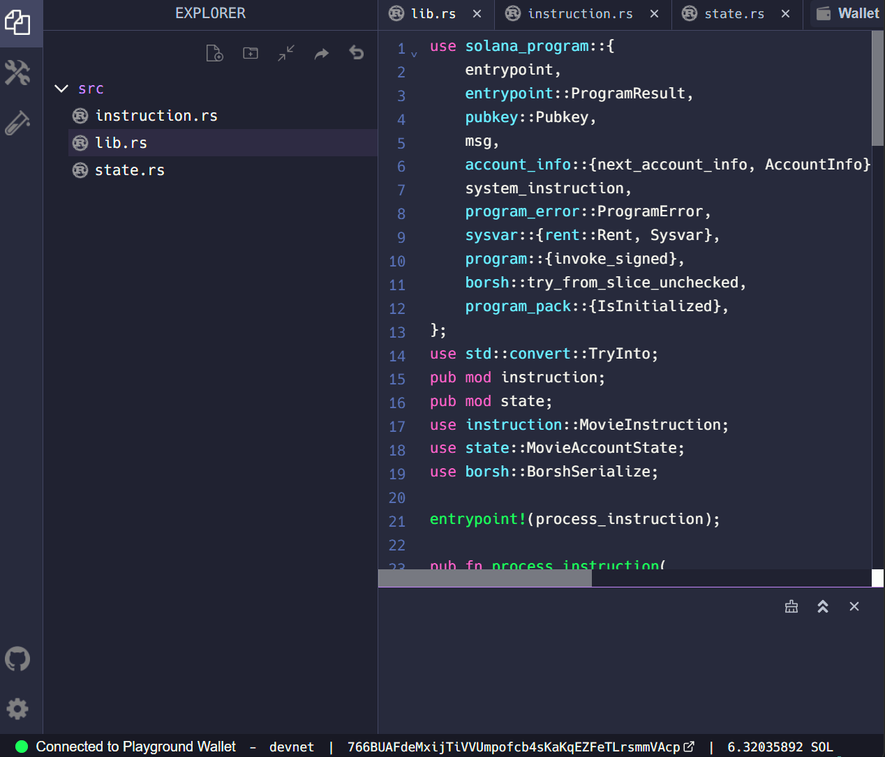

# TL;DR

- 程序状态存储在其他账户而不是程序本身
- 程序派生地址（PDA）由程序 ID 和可选的种子列表派生。一旦派生出来，PDAs 随后用作存储账户的地址
- 创建一个账户需要计算所需的空间以及相应的租金来分配给新账户
- 创建一个新账户需要通过跨程序调用（CPI）来执行 System Program 上的 `create_account` 指令
- 更新账户上的数据字段需要将数据序列化（转换为字节数组）到账户中

# 概述

Solana 通过使程序无状态来保持速度、效率和可扩展性。与将状态存储在程序本身上不同，Solana 上的程序使用 Solana 的账户模型从单独的 PDA 账户中读取状态并写入状态。

虽然这是一个非常灵活的模型，但如果不熟悉的话可能会难以使用。但不要担心！在这个课程中，我们将从简单的开始，逐步深入到下个单元的更复杂的程序。

在这个课程中，我们将学习 Solana 程序状态管理的基础知识，包括将状态表示为 Rust 类型、使用程序派生地址创建账户以及序列化账户数据。

## 程序状态

所有的 Solana 账户都有一个包含字节数组的 `data` 字段。这使得账户像计算机上的文件一样灵活。你可以在账户中存储几乎任何东西（只要账户有足够的存储空间）。

就像传统文件系统中的文件遵循特定的数据格式，比如 PDF 或 MP3 一样，存储在 Solana 账户中的数据也需要遵循某种模式，以便可以检索数据并将其反序列化为可用的格式。

### 将状态表示为 Rust 类型

在 Rust 中编写程序时，我们通常通过定义 Rust 数据类型来创建“格式”。

虽然这种类型应该反映你的数据结构，但对于大多数用例来说，一个简单的结构体就足够了。例如，一个将笔记存储在单独账户中的记笔记程序可能会有标题、正文和可能还有某种 ID 的数据。我们可以创建一个如下的结构体来表示：

```rust
struct NoteState {
    title: String,
    body: String,
    id: u64
}
```

### 使用 Borsh 进行序列化和反序列化

就像处理指令数据一样，我们需要一种机制将 Rust 数据类型转换为字节数组，反之亦然。**序列化**（Serialization）是将对象转换为字节数组的过程。**反序列化**（Deserialization）是从字节数组重建对象的过程。

我们将继续使用 Borsh 进行序列化和反序列化。在 Rust 中，我们可以使用 `borsh` crate 来访问 `BorshSerialize` 和 `BorshDeserialize` 特征。然后，我们可以使用 `derive` 属性宏应用这些特征。

```rust
use borsh::{BorshSerialize, BorshDeserialize};

#[derive(BorshSerialize, BorshDeserialize)]
struct NoteState {
    title: String,
    body: String,
    id: u64
}
```

这些特征将为 `NoteState` 提供我们可以根据需要使用的序列化和反序列化数据的方法。

## 创建账户

在我们更新帐户的数据字段之前，我们必须首先创建该帐户。

要在我们的程序中创建新帐户，我们必须：

1. 计算帐户所需的空间（space）和租金（rent）
2. 有一个要分配新帐户的地址
3. 调用系统程序以创建新帐户

### 空间和租金

请记住，在 Solana 网络上存储数据需要用户以 lamports 的形式分配租金。新帐户所需的租金数量取决于您希望为该帐户分配的空间使用量。这意味着我们在创建帐户之前需要知道要分配多少空间。

请注意，租金更像是一笔押金。当帐户关闭时，为租金分配的所有 lamports 都可以完全退还。此外，现在所有新帐户都必须是[租金豁免的（rent-exempt）](https://twitter.com/jacobvcreech/status/1524790032938287105)，这意味着随时间增长不会从帐户中扣除 lamports。如果帐户至少持有 2 年租金的价值，那么该帐户被视为租金豁免。换句话说，帐户将永久存储在链上，直到所有者关闭帐户并提取租金。

在我们的记笔记应用示例中，`NoteState` 结构指定需要存储在帐户中的三个字段：`title`、`body` 和 `id`。要计算帐户所需的大小，只需将每个字段中存储数据所需的大小相加。

对于像字符串这样的动态数据，Borsh 在开头添加了额外的 4 个字节，以存储该特定字段的长度。这意味着 `title` 和 `body` 各占用 4 个字节加上它们各自的大小。`id` 字段是一个 64 位整数，即 8 个字节。

您可以将这些长度相加，然后使用 `solana_program` crate 的 `rent` 模块中的 `minimum_balance` 函数计算所需空间的租金。

```rust
// 计算结构体 NoteState 所需要的账户大小
let account_len: usize = (4 + title.len()) + (4 + body.len()) + 8;

// 计算所需要的租金
let rent = Rent::get()?;
let rent_lamports = rent.minimum_balance(account_len);
```

### 程序派生地址（PDA）

在创建账户之前，我们还需要有一个地址来分配给该账户。对于程序拥有的账户，这将是使用 `find_program_address` 函数找到的程序派生地址（PDA）。

顾名思义，PDAs 是使用程序 ID（创建账户的程序的地址）和可选的“种子”列表派生的。可选的种子是在 `find_program_address` 函数中使用的额外输入，用于派生 PDA。对于使用派生 PDA 的函数将在给定相同输入时每次返回相同的地址。这使我们能够创建任意数量的 PDA 账户，并以确定性的方式找到每个账户。

除了您提供用于派生PDA的种子之外，`find_program_address` 函数还将提供一个额外的 “bump seed”（增量种子）。使 PDA 与其他 Solana 账户地址不同的是，它们没有相应的私钥。这确保只有拥有该地址的程序才能代表 PDA 进行签名。当 `find_program_address` 函数尝试使用提供的种子派生 PDA 时，它将 255 作为 “bump seed” 传递。如果生成的地址无效（即有相应的私钥），则函数使 bump seed 减 1，并使用该 bump seed 派生一个新的 PDA。一旦找到有效的 PDA，函数将返回 PDA 和用于派生 PDA 的 bump。

对于我们的记笔记程序，我们将使用笔记创建者的公钥和ID作为可选的种子来派生 PDA。以这种方式派生 PDA 允许我们确定性地找到每个笔记的账户。

```rust
let (note_pda_account, bump_seed) = Pubkey::find_program_address(&[note_creator.key.as_ref(), id.as_bytes().as_ref(),], program_id);
```

### 跨程序调用（CPI）

一旦我们计算出账户所需的租金并找到了一个有效的 PDA 以分配新账户的地址，我们最终准备好创建该账户。在我们的程序内创建一个新账户需要进行跨程序调用（Cross Program Invocation，CPI）。CPI 是指一个程序调用另一个程序上的指令。为了在我们的程序内创建一个新账户，我们将在系统程序上调用 `create_account` 指令。

CPI 可以使用 `invoke` 或 `invoke_signed` 进行。

```rust
pub fn invoke(
    instruction: &Instruction,
    account_infos: &[AccountInfo<'_>]
) -> ProgramResult
```

```rust
pub fn invoke_signed(
    instruction: &Instruction,
    account_infos: &[AccountInfo<'_>],
    signers_seeds: &[&[&[u8]]]
) -> ProgramResult
```

在本课程中，我们将使用 `invoke_signed`。与常规签名不同，常规签名使用秘密密钥进行签名，而 `invoke_signed` 使用可选的种子、bump seed 和程序 ID 来派生 PDA 并签署指令。这是通过将派生的 PDA 与传递给指令的所有账户进行比较来完成的。如果任何账户与 PDA 匹配，则该账户的签署字段将设置为 true。

程序可以通过这种方式安全地签署交易，因为 `invoke_signed` 生成用于签署的 PDA，在程序调用指令中使用 `program_id`。因此，一个程序无法生成一个匹配的 PDA，以签署使用另一个程序ID 派生的 PDA 的账户。

```rust
invoke_signed(
    // instruction
    &system_instruction::create_account(
        note_creator.key,
        note_pda_account.key,
        rent_lamports,
        account_len.try_into().unwrap(),
        program_id,
    ),
    // account_infos
    &[note_creator.clone(), note_pda_account.clone(), system_program.clone()],
    // signers_seeds
    &[&[note_creator.key.as_ref(), note_id.as_bytes().as_ref(), &[bump_seed]]],
)?;
```

## 序列化和反序列化账户数据

一旦我们创建了一个新账户，我们需要访问并更新账户的数据字段。这意味着将其字节数组反序列化为我们创建的类型的实例，更新该实例上的字段，然后将该实例重新序列化为字节数组。

### 反序列化账户数据

更新账户数据的第一步是将其 `data` 字节数组反序列化为其 Rust 类型。您可以通过首先借用账户上的数据字段来实现这一点。这允许您在没有获取所有权的情况下访问数据。

然后，您可以使用 `try_from_slice_unchecked` 函数，和使用您创建的用于表示数据的类型的格式，对已借用账户的数据字段进行反序列化。这将为您提供一个 Rust 类型的实例，以便您可以使用点符号轻松更新字段。如果我们使用我们一直在使用的记笔记应用示例来执行此操作，代码将如下所示：

```rust
let mut account_data = try_from_slice_unchecked::<NoteState>(note_pda_account.data.borrow()).unwrap();

account_data.title = title;
account_data.body = rating;
account_data.id = id;
```

### 序列化账户数据

一旦用于表示账户数据的 Rust 实例已使用适当的值进行更新，您可以将数据“保存”到账户上。

这通过对您创建的 Rust 类型的实例使用 `serialize` 函数来完成。您需要传递对账户数据的可变引用。这里的语法有些复杂，如果您不完全理解，不要担心。在 Rust 中，借用和引用是最难理解的概念之一。

```rust
account_data.serialize(&mut &mut note_pda_account.data.borrow_mut()[..])?;
```

上面的示例将 `account_data` 对象转换为字节数组，并将其设置为 `note_pda_account` 上的 `data` 属性。这将更新后的 `account_data` 变量保存到新账户的数据字段。现在，当用户获取 `note_pda_account` 并反序列化数据时，它将显示我们已序列化到账户中的更新后数据。

## 迭代器

您可能已经注意到在先前的示例中我们引用了 `note_creator`，但没有展示它是从哪里来的。

为了访问此类账户和其他账户，我们使用了[Rust 迭代器（Iterator）](https://doc.rust-lang.org/std/iter/trait.Iterator.html)。迭代器是 Rust 中的一个特征，用于在值的集合中提供顺序去访问每个元素。在 Solana 程序中，迭代器用于安全地迭代通过 `accounts` 参数传递给程序入口点的账户列表。

### Rust 迭代器

迭代器模式允许您对一系列元素执行某些任务。`iter()` 方法创建一个引用集合的迭代器对象。迭代器负责迭代每个元素的逻辑，并确定序列何时结束。在 Rust 中，迭代器是惰性的，这意味着它们在调用消耗迭代器的方法之前不会产生任何效果。一旦创建了迭代器，必须调用它的 `next()` 函数以获取下一个项目。

```rust
let v1 = vec![1, 2, 3];

// 创建 vec 的迭代器。
let v1_iter = v1.iter();

// 使用迭代器获取第一个元素
let first_item = v1_iter.next();

// 使用迭代器获取第二个元素
let second_item = v1_iter.next();
```

### Solana账户迭代器

回顾一下，所有指令所需的 `AccountInfo` 都通过单个 `accounts` 参数传递。为了遍历这些账户并在指令中使用它们，我们需要创建一个具有对 `accounts` 的可变引用的迭代器。

在这一点上，我们不直接使用迭代器，而是将其传递给 `solana_program` crate 提供的`account_info` 模块中的 `next_account_info` 函数。

例如，在一个记笔记程序中创建新笔记的指令，至少需要包含创建笔记的用户账户、用于存储笔记的 PDA，以及 `system_program` 用于初始化新账户的账户。这三个账户将通过 `accounts` 参数传递到程序入口点。然后使用 `accounts` 的迭代器将与每个账户相关联的 `AccountInfo` 分离出来以处理指令。

请注意，`&mut` 表示对 `accounts` 参数的可变引用。您可以阅读有关 [Rust中引用](https://doc.rust-lang.org/book/ch04-02-references-and-borrowing.html) 和 [`mut`关键字](https://doc.rust-lang.org/std/keyword.mut.html) 的更多信息。

```rust
// Get Account iterator
let account_info_iter = &mut accounts.iter();

// Get accounts
let note_creator = next_account_info(account_info_iter)?;
let note_pda_account = next_account_info(account_info_iter)?;
let system_program = next_account_info(account_info_iter)?;
```

# 实验

这个概述涵盖了许多新概念。让我们通过继续在上一课中学到的内容基础上一起练习，继续改进电影评论程序。如果您在没有完成上一课的情况下跳入这一课，不用担心，无论哪种方式，都应该能够跟上。我们将使用 [Solana Playground](https://beta.solpg.io) 来编写、构建和部署我们的代码。

作为提醒，我们正在构建一个 Solana 程序，允许用户对电影进行评论。在上一课中，我们对用户传入的指令数据进行了反序列化，但尚未将这些数据存储在账户中。现在让我们更新我们的程序，创建新的账户来存储用户的电影评论。

## 1. 获取起始代码

如果您没有完成上一课的实验，或者只是想确保您没有漏掉任何内容，您可以参考 [起始代码](https://beta.solpg.io/6295b25b0e6ab1eb92d947f7)。

我们的程序目前包括 `instruction.rs` 文件，我们使用它来反序列化传递到程序入口点的 `instruction_data`。我们还完成了 `lib.rs` 文件，以至于我们可以使用 `msg!` 宏将反序列化后的指令数据打印到程序日志中。

## 2. 创建用于表示账户数据的结构体

让我们开始创建一个名为 `state.rs` 的新文件。

这个文件将会：

1. 定义程序用于填充新账户数据字段的结构体
2. 为这个结构体添加 `BorshSerialize` 和 `BorshDeserialize` 特性

首先，让我们从 `borsh` crate 中引入我们将需要的所有内容。

```rust
use borsh::{BorshSerialize, BorshDeserialize};
```

接下来，让我们创建 `MovieAccountState` 结构体。这个结构体将定义每个新电影评论账户在其数据字段中存储的参数。我们的 `MovieAccountState` 结构体将需要以下参数：

- `is_initialized` - 表示账户是否已初始化
- `rating` - 用户对电影的评分
- `description` - 用户对电影的描述
- `title` - 用户正在评论的电影的标题

```rust
#[derive(BorshSerialize, BorshDeserialize)]
pub struct MovieAccountState {
    pub is_initialized: bool,
    pub rating: u8,
    pub title: String,
    pub description: String  
}
```

## 3. 更新 `lib.rs`

接下来，让我们更新我们的 `lib.rs` 文件。首先，我们将引入我们完成电影评论程序所需的所有内容。您可以在 [the `solana_program` crate 的文档](https://docs.rs/solana-program/latest/solana_program/)中阅读有关我们正在使用的每个引用的详细信息。

```rust
use solana_program::{
    entrypoint,
    entrypoint::ProgramResult,
    pubkey::Pubkey,
    msg,
    account_info::{next_account_info, AccountInfo},
    system_instruction,
    program_error::ProgramError,
    sysvar::{rent::Rent, Sysvar},
    program::{invoke_signed},
    borsh::try_from_slice_unchecked,
};
use std::convert::TryInto;
pub mod instruction;
pub mod state;
use instruction::MovieInstruction;
use state::MovieAccountState;
use borsh::BorshSerialize;
```

## 4. 迭代 `accounts`

接下来，让我们继续构建我们的 `add_movie_review` 函数。回想一下，通过单个 `accounts` 参数将一个账户数组传递到 `add_movie_review` 函数。为了处理我们的指令，我们需要迭代 `accounts` 并将每个账户的 `AccountInfo` 赋给自己的变量。

```rust
// Get Account iterator
let account_info_iter = &mut accounts.iter();

// Get accounts
let initializer = next_account_info(account_info_iter)?;
let pda_account = next_account_info(account_info_iter)?;
let system_program = next_account_info(account_info_iter)?;
```

## 5. 派生 PDA

接下来，在我们的 `add_movie_review` 函数中，让我们独立派生期望用户传递的 PDA。我们将在稍后提供导出的 `bump_seed`，因此即使 `pda_account` 应该引用相同的账户，我们仍然需要调用 `find_program_address`。

请注意，我们使用初始化用户（`initializer`）的公钥和电影标题（`title`）作为可选的种子为每个新账户派生 PDA。通过这种方式设置 PDA 限制了每个用户只能为任何一个电影标题写一篇评论。但是，它仍允许同一用户为具有不同标题的电影撰写评论，并且不同用户可以为具有相同标题的电影撰写评论。

```rust
// Derive PDA
let (pda, bump_seed) = Pubkey::find_program_address(&[initializer.key.as_ref(), title.as_bytes().as_ref(),], program_id);
```

## 6. 计算空间和租金

接下来，让我们计算我们新账户将需要的租金。回想一下，租金是用户必须为在 Solana 网络上存储数据的账户时分配的 lamports 数量。为了计算租金，我们首先必须计算我们新账户需要的空间大小。

`MovieAccountState` 结构体有四个字段。我们将为 `rating` 和 `is_initialized` 每个分配 1 个字节。对于 `title` 和 `description`，我们将分配的空间等于其中 `title` 和 `description` 的字符串长度加上 4 个字节。

```rust
// Calculate account size required
let account_len: usize = 1 + 1 + (4 + title.len()) + (4 + description.len());

// Calculate rent required
let rent = Rent::get()?;
let rent_lamports = rent.minimum_balance(account_len);
```

## 7. 创建新账户

一旦我们计算了租金并验证了 PDA，我们就可以准备创建我们的新账户了。为了创建一个新账户，我们必须从系统程序调用 `create_account` 指令。我们使用 `invoke_signed` 函数进行跨程序调用（CPI）。我们使用 `invoke_signed`，因为我们是使用 PDA 创建账户，需要电影评论程序“签名”该指令。

```rust
// Create the account
invoke_signed(
    &system_instruction::create_account(
        initializer.key,
        pda_account.key,
        rent_lamports,
        account_len.try_into().unwrap(),
        program_id,
    ),
    &[initializer.clone(), pda_account.clone(), system_program.clone()],
    &[&[initializer.key.as_ref(), title.as_bytes().as_ref(), &[bump_seed]]],
)?;

msg!("PDA created: {}", pda);
```

## 8. 更新账户数据

现在我们已经创建了一个新账户，我们准备使用 `state.rs` 文件中 `MovieAccountState` 结构体的格式更新新账户的数据字段。我们首先使用 `try_from_slice_unchecked` 从 `pda_account` 反序列化账户数据，然后设置每个字段的值。

```rust
msg!("unpacking state account");
let mut account_data = try_from_slice_unchecked::<MovieAccountState>(&pda_account.data.borrow()).unwrap();
msg!("borrowed account data");

account_data.title = title;
account_data.rating = rating;
account_data.description = description;
account_data.is_initialized = true;
```

最后，我们将更新后的 `account_data` 序列化到我们的 `pda_account` 的数据字段中。

```rust
msg!("serializing account");
account_data.serialize(&mut &mut pda_account.data.borrow_mut()[..])?;
msg!("state account serialized");
```

## 9. 构建和部署

我们已经准备好构建和部署我们的程序了！



您可以通过提交包含正确指令数据的交易来测试您的程序。为此，请随意使用[此脚本](https://github.com/Unboxed-Software/solana-movie-client)或我们在[反序列化程序数据](./deserialize-custom-data.md)课程的[前端](https://github.com/Unboxed-Software/solana-movie-frontend)。在这两种情况下，请确保将程序的程序 ID 复制并粘贴到源代码的适当位置，以确保您正在测试正确的程序。

如果使用前端，只需在 `MovieList.tsx` 和 `Form.tsx` 组件中将 `MOVIE_REVIEW_PROGRAM_ID` 替换为您部署的程序的地址。然后运行前端，提交一次查看，然后刷新浏览器以查看评论。

如果您需要更多时间来熟悉这些概念，可以在继续之前查看[解决方案代码](https://beta.solpg.io/62b23597f6273245aca4f5b4)。

# 挑战

现在轮到你独立构建一些东西了。在本课程中介绍的概念的帮助下，您现在已经了解了重建 Module 1 的整个 Student Intro 程序所需的所有内容。

Student Intro 程序是一个 Solana 程序，允许学生介绍自己。该程序将用户的姓名和简短介绍作为 `instruction_data`，并创建一个账户将数据存储在链上。

利用你在本课程中学到的知识，构建这个程序。除了将姓名和简短介绍作为指令数据外，该程序还应该：

1. 为每个学生创建一个独立的账户。
2. 在每个账户中存储 `is_initialized` 作为布尔值，`name` 作为字符串，`msg` 作为字符串。

您可以通过构建我们在 [Page, Order, and Filter Program Data lesson](./paging-ordering-filtering-data.md) 中创建的[前端](https://github.com/Unboxed-Software/solana-student-intros-frontend)来测试您的程序。请记得用您部署的程序 ID 替换前端代码中的程序 ID。

如果可能的话，请尝试独立完成这个挑战！但如果您遇到困难，可以随时参考[解决方案代码](https://beta.solpg.io/62b11ce4f6273245aca4f5b2)。

## 完成实验了吗？

将您的代码推送到 GitHub，并[告诉我们您对本课程的看法](https://form.typeform.com/to/IPH0UGz7#answers-lesson=8320fc87-2b6d-4b3a-8b1a-54b55afed781)!