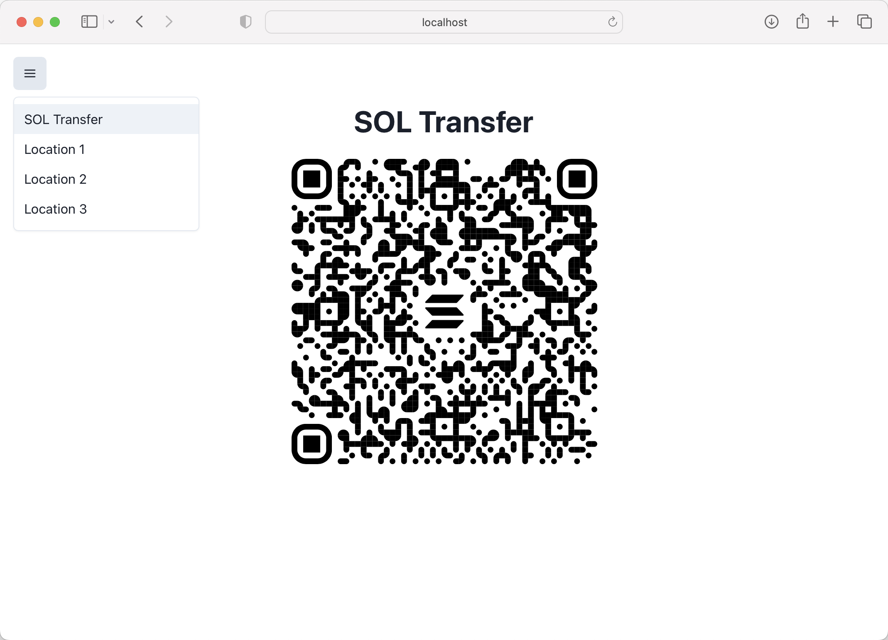

**译者**: [ben46](https://github.com/ben46)

# 摘要

- **Solana Pay** 是一项规范，用于在 URL 中编码 Solana 交易请求，从而实现跨不同 Solana 应用和钱包的标准化交易请求
- **部分签署** 交易允许创建在提交到网络之前需要多个签名的交易
- **交易过滤** 包括实施规则，以确定是否允许处理某些交易，这取决于某些条件或交易中特定数据的存在

# 课程

Solana 社区不断改进和扩展网络功能。但这并不总是意味着开发全新的技术。有时意味着以新的有趣方式利用网络的现有功能。

Solana Pay 就是很好的例子。与其向网络添加新功能，Solana Pay 在独特的方式上使用网络的现有签名功能，使得商家和应用能够请求交易，并为特定交易类型构建过滤机制。

在本课程中，您将学习如何使用 Solana Pay 创建转账和交易请求，将这些请求编码为 QR 码，部分签署交易，并根据您选择的条件过滤交易。我们希望您不仅仅看到这作为是利用新的有趣方式借助现有功能的例子，而且将其作为启发您自己独特客户端网络交互的一个起点。

## Solana Pay

[Solana Pay 规范](https://docs.solanapay.com/spec) 是一组标准，允许用户以统一的方式通过各种 Solana 应用和钱包请求支付和启动交易。

请求 URL 以 `solana:` 作为前缀，以便平台可以将链接定向到适当的应用程序。例如，在移动设备上，以 `solana:` 开头的 URL 将定向到支持 Solana Pay 规范的钱包应用。随后，钱包可以使用 URL 的其余部分来适当处理请求。

Solana Pay 规范定义了两种请求类型：

1. 转账请求：用于简单的 SOL 或 SPL 代币转账
2. 交易请求：用于请求任何类型的 Solana 交易

### 转账请求

转账请求规范描述了对于 SOL 或 SPL 代币转账的非互动请求。转账请求 URL 的格式如下：`solana:<recipient>?<optional-query-params>`。

`recipient` 的值是必需的，必须是正在请求转账的账户的 Base58 编码的公钥。此外，支持以下可选查询参数：

- `amount` - 表示要转账的代币数量的非负整数或十进制值
- `spl-token` - 如果转账的是 SPL 代币而不是 SOL，则是 SPL 代币铸造账户的 Base58 编码的公钥
- `reference` - 可选的基于 Base58 编码的 32 字节数组的参考值。客户端可据此在链上标识交易，因为客户端将不具有交易的签名
- `label` - 描述转账请求来源的 URL 编码的 UTF-8 字符串
- `message` - 描述转账请求性质的 URL 编码的 UTF-8 字符串
- `memo` - 必须包含在支付交易中的 SPL 备注指令中的 URL 编码的 UTF-8 字符串

例如，以下 URL 描述了对 1 SOL 的转账请求：

```text
solana:mvines9iiHiQTysrwkJjGf2gb9Ex9jXJX8ns3qwf2kN?amount=1&label=Michael&message=Thanks%20for%20all%20the%20fish&memo=OrderId12345
```

以下 URL 描述了对 0.1 USDC 的转账请求：

```text
solana:mvines9iiHiQTysrwkJjGf2gb9Ex9jXJX8ns3qwf2kN?amount=0.01&spl-token=EPjFWdd5AufqSSqeM2qN1xzybapC8G4wEGGkZwyTDt1v
```

### 交易请求

Solana Pay 交易请求类似于转账请求，因为它只是一个可以被支持的钱包消费的 URL。但是，此请求是互动的，而且格式更加开放：

```text
solana:<link>
```

`link` 的值应该是一个 URL，消费的钱包可以向其发出 HTTP 请求。与包含交易所需的所有信息不同，交易请求使用此 URL 拉取应呈现给用户的交易。

钱包收到交易请求 URL 时，会发生以下四件事情：

1. 钱包向提供的 `link` URL 的应用发送 GET 请求，以检索要显示给用户的标签和图标图像。
2. 然后，钱包发送用户端公钥的 POST 请求。
3. 应用程序使用用户端公钥（以及 `link` 中提供的任何附加信息）构建交易，然后以 Base64 编码的序列化交易形式响应。
4. 钱包解码和反序列化交易，然后让用户签署并发送交易。

考虑到交易请求比转账请求更复杂，本课程的其余部分将专注于创建交易请求。

## 创建交易请求

### 定义 API 端点

作为开发者，要使交易请求流程工作的主要任务是在您计划包含在交易请求中的 URL 上设置 REST API 端点。在本课程中，我们将使用 [Next.js API Routes](https://nextjs.org/docs/api-routes/introduction) 作为我们的端点，但您也可以使用您最熟悉的堆栈和工具。

在 Next.js 中，您可以通过向 `pages/api` 文件夹添加文件并导出一个处理请求和响应的函数来完成此任务。

```typescript
import { NextApiRequest, NextApiResponse } from "next"

export default async function handler(
    req: NextApiRequest,
    res: NextApiResponse,
) {
    // 处理请求
}
```

### 处理 GET 请求

消费交易请求 URL 的钱包将首先向此端点发出 GET 请求。您希望您的端点返回一个具有两个字段的 JSON 对象：

1. `label` - 描述交易请求来源的字符串
2. `icon`- 用于显示给用户的图像的 URL

基于前面的空端点，可能会像这样：

```typescript
import { NextApiRequest, NextApiResponse } from "next"

export default async function handler(
    req: NextApiRequest,
    res: NextApiResponse,
) {
    if (req.method === "GET") {
        return get(res)
    } else {
        return res.status(405).json({ error: "Method not allowed" })
    }
}

function get(res: NextApiResponse) {
    res.status(200).json({
        label: "Store Name",
        icon: "https://solana.com/src/img/branding/solanaLogoMark.svg",
    });
}
```


当钱包对API端点发出GET请求时，将调用`get`函数，并返回一个状态码为200的JSON对象，其中包含`label`和`icon`。

### 处理POST请求并构建交易

在发出GET请求后，钱包将向同一URL发出POST请求。您的端点应该期望POST请求的`body`包含一个JSON对象，其中包含一个由请求的钱包提供的`account`字段。`account`的值将是表示最终用户公钥的字符串。

有了这些信息和任何附加的提供的参数，您可以构建交易并将其返回以供钱包进行签名：

1. 连接到 Solana 网络并获取最新的`blockhash`。
2. 使用`blockhash`创建新交易。
3. 向交易中添加指令。
4. 对交易进行序列化，并将其与用于用户的消息一起返回，形成`PostResponse`对象。

```typescript
import { NextApiRequest, NextApiResponse } from "next"

export default async function handler(
    req: NextApiRequest,
    res: NextApiResponse,
) {
    if (req.method === "GET") {
        return get(res)
    } else if (req.method === "POST") {
        return post(req, res)
    } else {
        return res.status(405).json({ error: "方法不被允许" })
    }
}

function get(res: NextApiResponse) {
    res.status(200).json({
        label: "商店名称",
        icon: "https://solana.com/src/img/branding/solanaLogoMark.svg",
    });
}
async function post(
    req: PublicKey,
    res: PublicKey,
) {
    const { account, reference } = req.body

    const connection = new Connection(clusterApiUrl("devnet"));

    const { blockhash } = await connection.getLatestBlockhash();

    const transaction = new Transaction({
        recentBlockhash: blockhash,
        feePayer: account,
    });

    const instruction = SystemProgram.transfer({
        fromPubkey: account,
        toPubkey: Keypair.generate().publicKey,
        lamports: 0.001 * LAMPORTS_PER_SOL,
    });

    transaction.add(instruction);

    transaction.keys.push({
        pubkey: reference,
        isSigner: false,
        isWritable: false,
    })

    const serializedTransaction = transaction.serialize({
        requireAllSignatures: false,
    });
    const base64 = serializedTransaction.toString("base64");

    const message = "0.001 SOL的简单转账";

    res.send(200).json({
        transaction: base64,
        message,
    })
}
```

这里没有什么太特别的。这是您在标准客户端应用程序中使用的相同交易构造。唯一的区别是，您不是对交易进行签名并提交到网络，而是将交易作为base64编码的字符串在HTTP响应中返回。发出请求的钱包随后可以将交易呈现给用户进行签名。

### 确认交易

您可能已经注意到之前的示例假设`reference`作为查询参数提供。尽管请求的钱包未提供此值，但将这一查询参数包含在您的初始交易请求URL中非常有用。

由于您的应用程序不会向网络提交交易，因此您的代码将无法访问交易签名。通常情况下，这是您的应用程序如何定位网络上的交易并查看其状态。

为了解决这个问题，您可以在每个交易请求中将`reference`值作为查询参数。该值应该是一个base58编码的32字节数组，可以作为交易上的非签名者密钥进行包含。这使得您的应用程序可以使用`getSignaturesForAddress` RPC方法查找交易。然后，您的应用程序可以根据交易的状态调整其UI。

如果您使用`@solana/pay`库，则可以使用`findReference`辅助函数，而不必直接使用`getSignaturesForAddress`。

## 门控交易

我们之前曾提过 Solana Pay 是能够利用现有功能，并通过对网络进行创造性的操作来做一些新功能的示例。在 Solana Pay 所在的范围内另一个小例子便是只有在满足某些条件时才能进行某些特定的交易。

由于您控制构建交易的端点，因此您可以确定在构建交易之前必须满足哪些标准。例如，可以使用POST请求中提供的`account`字段来检查最终用户是否拥有特定收藏品的NFT，或者该公钥是否在一个预设的账户列表中，这些账户可以进行特定的交易。

```typescript
// 检索给定钱包拥有的nft的数组
const nfts = await metaplex.nfts().findAllByOwner({ owner: account }).run();

// 遍历nfts数组
for (let i = 0; i < nfts.length; i++) {
    // 检查当前nft是否具有所需值的collection字段
    if (nfts[i].collection?.address.toString() == collection.toString()) {
        // 构建交易
    } else {
        // 返回错误
    }
}
```

### 部分签名

如果您希望某些交易在某种门控机制的背后工作，那么这种功能也需要在链上进行强制。从您的 Solana Pay 端点返回一个错误会使得最终用户更难执行交易，但他们仍然可以手动构建。

这意味着所调用的指令应该需要某种类型的“管理员”签名，只有您的应用程序才能提供。但是，通过这样做，您已经让我们之前的示例无法工作。交易被构建并发送到请求钱包以进行最终用户的签名，但未包含管理员签名的交易将失败。

幸运的是，Solana通过部分签名实现了签名的可组合性。

部分签署多签名交易允许签名者在交易在网络上广播之前添加他们的签名。这在许多情况下很有用，包括：

-   批准需要多方签名的交易，例如需要商家和购买者确认付款细节的情况。
-   调用需要用户和管理员签名的自定义程序。这有助于限制对程序指令的访问，并确保只有授权方才可以执行它们。

```typescript
const { blockhash, lastValidBlockHeight } = await connection.getLatestBlockhash()

const transaction = new Transaction({
  feePayer: account,
  blockhash,
  lastValidBlockHeight,
})

...

transaction.partialSign(adminKeypair)
```


`partialSign`函数用于在不覆盖事务上的任何先前签名的情况下向事务添加签名。如果您正在构建具有多个签名者的交易，重要的是要记住，如果您没有指定事务的`feePayer`，则第一个签名者将用作交易的费用支付者。为了避免任何混淆或意外行为，请确保在必要时明确设置费用支付者。

在我们只允许在最终用户拥有特定NFT时通过交易请求的示例中，您只需在使用`partialSign`之前向事务添加您的管理员签名，然后将事务编码为base64编码的字符串并发出HTTP响应。

## Solana支付二维码

Solana Pay的显著特点之一是与二维码的简单集成。由于转账和交易请求只是URL，您可以将它们嵌入到您的应用程序或其他地方中可用的二维码中。

`@solana/pay`库通过提供的`createQR`助手函数简化了这一点。此函数需要您提供以下信息：

- `url` - 事务请求的URL。
- `size`（可选）- 二维码的宽度和高度（以像素为单位）。默认为512。
- `background`（可选）- 背景颜色。默认为白色。
- `color`（可选）- 前景颜色。默认为黑色。

```typescript
const qr = createQR(url, 400, 'transparent')
```

# 实验室

现在，您已经对Solana Pay有了概念性的理解，让我们把它付诸实践。我们将使用Solana Pay为寻宝游戏生成一系列二维码。参与者必须按顺序访问每个寻宝点。在每个位置，他们将使用提供的二维码向负责跟踪用户进度的寻宝游戏的智能合约提交相应的交易。

### 1. 起步

要开始，请下载 [存储库](https://github.com/Unboxed-Software/solana-scavenger-hunt-app/tree/starter) 的 `starter` 分支上的起始代码。起始代码是一个 Next.js 应用程序，显示一个Solana Pay二维码。请注意，菜单栏允许您在不同的二维码之间切换。默认选项是用于说明目的的简单SOL转账。在整个实验室过程中，我们将向菜单栏中的位置选项添加功能。



要做到这一点，我们将为在Devnet上调用Anchor程序的交易请求创建一个新的端点。该程序专门为这个 “寻宝” 应用程序创建，并有两个指令：`initialize` 和 `check_in`。`initialize` 指令用于设置用户状态，而 `check_in` 指令用于记录在寻宝游戏中的位置的签到。在本实验室中，我们不会更改程序，但请随时查看[源代码](https://github.com/Unboxed-Software/anchor-scavenger-hunt)以熟悉该程序。

在继续之前，请确保熟悉寻宝游戏应用的起始代码。查看`pages/index.tsx`、 `utils/createQrCode/simpleTransfer` 和 `/utils/checkTransaction` 将让您了解如何设置用于发送SOL的交易请求。我们将遵循类似交易请求的模式，用于在位置进行签到的交易请求。

### 2. 设置

在继续之前，让我们确保您可以在本地运行应用程序。首先将前端目录中的 `.env.example` 文件重命名为`.env`。该文件包含了在本实验室中用于部分签署交易的密钥对。

接下来，使用`yarn`安装依赖项，然后使用`yarn dev`并在浏览器中打开`localhost:3000`（或者如果3000端口已被占用，则在控制台指示端口处）

现在，如果您尝试使用移动设备扫描页面上显示的二维码，将会出现错误。这是因为二维码设置为发送你到计算机的 `localhost:3000`，这不是你的手机可以访问的地址。此外，Solana Pay需要使用HTTPS URL才能工作。

为了解决这个问题，您可以使用 [ngrok](https://ngrok.com/)。如果您以前没有使用过它，您需要安装它。安装好后，在终端中运行以下命令，将`3000`替换为您用于此项目的端口：

```bash
ngrok http 3000
```

这将为您提供一个可以远程访问本地服务器的唯一URL。输出将类似于：

```bash
会话状态                在线
账户                       your_email@gmail.com (Plan: Free)
更新                        可用更新 (版本 3.1.0, Ctrl-U 进行更新)
版本                       3.0.6
地区                       美国 (us)
延迟                       45ms
Web界面                 http://127.0.0.1:4040
转发                        https://7761-24-28-107-82.ngrok.io -> http://localhost:3000
```

现在，在浏览器中打开控制台中显示的HTTPS ngrok URL（例如 https://7761-24-28-107-82.ngrok.io）。这将允许您在本地测试的同时使用移动设备扫描二维码。

在撰写本实验室时，本实验室最适用于Solflare。某些钱包在扫描Solana Pay二维码时会显示错误的警告消息。无论使用哪个钱包，确保将钱包切换到devnet。然后扫描主页上标有“SOL转账”的二维码。此二维码是执行简单SOL转账的事务请求的参考实现，它还调用了 `requestAirdrop` 函数来为您的手机钱包提供Devnet SOL ，因为大多数人没有Devnet SOL 可用于测试。

如果您能成功使用二维码执行事务，则可以继续前进！

### 3. 创建签到事务请求端点

现在您已经准备就绪，该是创建支持使用寻宝游戏程序进行位置签到的事务请求端点的时候了。

首先打开位于`pages/api/checkIn.ts`的文件。请注意，该文件具有从环境变量中的秘密键初始化`eventOrganizer`的辅助函数。在这个文件中，我们将首先执行以下内容：

1. 导出一个`handler`函数来处理任意的HTTP请求
2. 添加`get`和`post`函数来处理这些HTTP方法
3. 在`handler`函数的主体中添加逻辑，根据HTTP请求方法调用`get`、`post`或返回405错误。

```typescript
import { NextApiRequest, NextApiResponse } from "next"

export default async function handler(
    req: NextApiRequest,
    res: NextApiResponse
) {
    if (req.method === "GET") {
        return get(res)
    } else if (req.method === "POST") {
        return await post(req, res)
    } else {
        return res.status(405).json({ error: "Method not allowed" })
    }
}

function get(res: NextApiResponse) {}

async function post(req: NextApiRequest, res: NextApiResponse) {}
```

### 4. 更新 `get` 函数

记住，钱包的第一次请求将是一个期望返回标签和图标的 GET 请求。更新 `get` 函数，以返回一个带有“寻宝游戏！”标签和 Solana 标志图标的响应。

```jsx
function get(res: NextApiResponse) {
    res.status(200).json({
        label: "寻宝游戏！",
        icon: "https://solana.com/src/img/branding/solanaLogoMark.svg",
    });
}
```

### 5. 更新 `post` 函数

在 GET 请求之后，钱包将向端点发出 POST 请求。请求的 `body` 将包含一个带有 `account` 字段的 JSON 对象，表示最终用户的公钥。

此外，查询参数将包含你编码到 QR 码中的任何内容。如果查看 `utils/createQrCode/checkIn.ts`，你会注意到该特定应用程序包括以下参数 `reference` 和 `id`：

1. `reference` - 用于标识交易的随机生成的公钥
2. `id` - 作为整数的位置 id

继续更新 `post` 函数，以从请求中提取 `account`、`reference` 和 `id`。如果其中任何一个缺失，应该返回一个错误。

接下来，添加一个 `try catch` 语句，`catch` 块会返回一个错误，`try` 块会调用一个新的 `buildTransaction` 函数。如果 `buildTransaction` 成功，应该返回一个带有交易和一个消息（表示用户已找到给定位置）的 JSON 对象和一个状态码为 200。现在暂时不用担心 `buildTransaction` 函数的逻辑 - 我们很快会实现它。

需要在这里导入 `PublicKey` 和 `Transaction`，来自 `@solana/web3.js`。

```typescript
import { NextApiRequest, NextApiResponse } from "next"
import { PublicKey, Transaction } from "@solana/web3.js"
...

async function post(req: NextApiRequest, res: NextApiResponse) {
    const { account } = req.body
    const { reference, id } = req.query

    if (!account || !reference || !id) {
        res.status(400).json({ error: "缺少必需的参数" })
        return
    }

    try {
        const transaction = await buildTransaction(
            new PublicKey(account),
            new PublicKey(reference),
            id.toString()
        )

        res.status(200).json({
            transaction: transaction,
            message: `您已找到位置 ${id}!`,
        })
    } catch (err) {
        console.log(err)
        let error = err as any
        if (error.message) {
            res.status(200).json({ transaction: "", message: error.message })
        } else {
            res.status(500).json({ error: "创建交易时出错" })
        }
    }
}

async function buildTransaction(
    account: PublicKey,
    reference: PublicKey,
    id: string
): Promise<string> {
    return new Transaction()
}
```

### 6. 实现 `buildTransaction` 函数

接下来，让我们实现 `buildTransaction` 函数。它应该构建、部分签名并返回签到交易。它需要执行的步骤顺序如下：

1. 获取用户状态
2. 使用 `locationAtIndex` 辅助函数和位置 id 获取一个 Location 对象
3. 验证用户是否处于正确位置
4. 从连接获取当前 blockhash 和最后有效的块高
5. 创建一个新的交易对象
6. 如果用户状态不存在，则向交易中添加初始化指令
7. 向交易中添加签到指令
8. 向签到指令添加 `reference` 公钥
9. 使用活动组织者的密钥部分签名交易
10. 使用 base64 编码序列化交易并返回交易

尽管每个步骤都很简单，但涉及的步骤很多。为了简化函数，我们将创建空的辅助函数，稍后为步骤 1、3、6 以及 7-8 填充内容。我们将这些函数命名为 `fetchUserState`、`verifyCorrectLocation`、`createInitUserInstruction` 和 `createCheckInInstruction`。

我们还将添加以下导入：

```typescript
import { NextApiRequest, NextApiResponse } from "next"
import { PublicKey, Transaction, TransactionInstruction } from "@solana/web3.js"
import { locationAtIndex, Location, locations } from "../../utils/locations"
import { connection, gameId, program } from "../../utils/programSetup"
```

使用空的辅助函数和新的导入，我们可以填充 `buildTransaction` 函数：

```typescript
async function buildTransaction(
    account: PublicKey,
    reference: PublicKey,
    id: string
): Promise<string> {
    const userState = await fetchUserState(account)

    const currentLocation = locationAtIndex(new Number(id).valueOf())

    if (!currentLocation) {
        throw { message: "Invalid location id" }
    }

    if (!verifyCorrectLocation(userState, currentLocation)) {
        throw { message: "You must visit each location in order!" }
    }

    const { blockhash, lastValidBlockHeight } =
        await connection.getLatestBlockhash()

    const transaction = new Transaction({
        feePayer: account,
        blockhash,
        lastValidBlockHeight,
    })

    if (!userState) {
        transaction.add(await createInitUserInstruction(account))
    }

    transaction.add(
        await createCheckInInstruction(account, reference, currentLocation)
    )

    transaction.partialSign(eventOrganizer)

    const serializedTransaction = transaction.serialize({
        requireAllSignatures: false,
    })

    const base64 = serializedTransaction.toString("base64")

    return base64
}

interface UserState {
    user: PublicKey
    gameId: PublicKey
    lastLocation: PublicKey
}

async function fetchUserState(account: PublicKey): Promise<UserState | null> {
    return null
}

function verifyCorrectLocation(
    userState: UserState | null,
    currentLocation: Location
): boolean {
    return false
}

async function createInitUserInstruction(
    account: PublicKey
): Promise<TransactionInstruction> {
    throw ""
}

async function createCheckInInstruction(
    account: PublicKey,
    reference: PublicKey,
    location: Location
): Promise<TransactionInstruction> {
    throw ""
}
```


### 7. 实现 `fetchUserState` 函数

完成 `buildTransaction` 函数后，我们可以开始实现我们创建的空帮助函数，从 `fetchUserState` 开始。此函数使用 `gameId` 和用户的 `account` 来推导用户状态 PDA，然后获取该帐户，如果不存在，则返回 null。

```typescript
async function fetchUserState(account: PublicKey): Promise<UserState | null> {
    const userStatePDA = PublicKey.findProgramAddressSync(
        [gameId.toBuffer(), account.toBuffer()],
        program.programId
    )[0]

    try {
        return await program.account.userState.fetch(userStatePDA)
    } catch {
        return null
    }
}
```

### 8. 实现 `verifyCorrectLocation` 函数

接下来，让我们实现 `verifyCorrectLocation` 帮助函数。此函数用于验证用户是否在寻宝游戏中的正确位置。

如果 `userState` 为 `null`，这意味着用户应该访问第一个位置。否则，用户应该访问其上次访问位置的索引加 1 的位置。

如果满足这些条件，函数将返回 true。否则，它将返回 false。

```typescript
function verifyCorrectLocation(
    userState: UserState | null,
    currentLocation: Location
): boolean {
    if (!userState) {
        return currentLocation.index === 1
    }

    const lastLocation = locations.find(
        (location) => location.key.toString() === userState.lastLocation.toString()
    )

    if (!lastLocation || currentLocation.index !== lastLocation.index + 1) {
        return false
    } else {
        return true
    }
}
```

### 9. 实现指令创建函数

最后，让我们实现 `createInitUserInstruction` 和 `createCheckInInstruction`。这些函数可以使用 Anchor 生成并返回相应的指令。唯一需要注意的是 `createCheckInInstruction` 需要将 `reference` 添加到密钥的指令列表中。

```typescript
async function createInitUserInstruction(
    account: PublicKey
): Promise<TransactionInstruction> {
    const initializeInstruction = await program.methods
        .initialize(gameId)
        .accounts({ user: account })
        .instruction()

    return initializeInstruction
}

async function createCheckInInstruction(
    account: PublicKey,
    reference: PublicKey,
    location: Location
): Promise<TransactionInstruction> {
    const checkInInstruction = await program.methods
        .checkIn(gameId, location.key)
        .accounts({
            user: account,
            eventOrganizer: eventOrganizer.publicKey,
        })
        .instruction()

    checkInInstruction.keys.push({
        pubkey: reference,
        isSigner: false,
        isWritable: false,
    })

    return checkInInstruction
}
```

### 10. 测试应用程序

这时候你的应用程序应该已经可以工作了！可以使用你的移动钱包进行测试。首先通过扫描 `Location 1` 的二维码开始测试。记得确保你的前端正在使用 ngrok URL 而不是 `localhost` 运行。

扫描二维码后，你应该会看到一个消息指示你在位置 1。然后，扫描 `Location 2` 页面上的二维码。在继续之前，你可能需要等待几秒钟前一个交易完成。

恭喜，你已成功完成了使用 Solana Pay 进行寻宝演示！根据你的背景，这可能并不直观或简单。如果是这样，可以随时再次浏览实验或按照自己的想法进行开发。Solana Pay 为缩小现实生活与链上互动之间的差距打开了许多大门。

如果你想查看最终解决方案代码，可以在[相同仓库的解决方案分支](https://github.com/Unboxed-Software/solana-scavenger-hunt-app/tree/solution)找到。

# 挑战

是时候自己尝试了。随意使用 Solana Pay 构建自己的想法，或使用以下提示。

使用 Solana Pay 构建一个应用程序（或修改实验中的应用程序），向用户铸造一个 NFT。为了提升体验，仅当用户满足一个或多个条件时才能进行交易（例如持有特定收藏的 NFT、已在预定列表中等）。

在这方面请发挥创意！Solana pay 规范为独特用例打开了许多大门。

## 完成了实验吗？

将你的代码推送到 GitHub，并[告诉我们你对这节课的感想](https://form.typeform.com/to/IPH0UGz7#answers-lesson=3c7e5796-c433-4575-93e1-1429f718aa10)！
