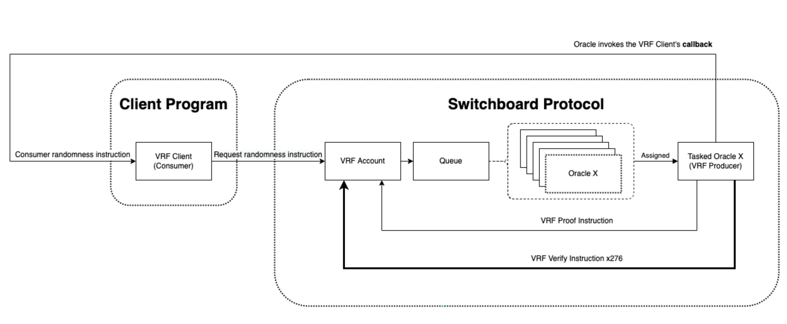

**译者**: [ben46](https://github.com/ben46)

# 摘要

- 在程序内生成随机性的尝试很可能会被用户猜出来，因为在链上并没有真正的随机性。
- 可验证随机函数（VRF）为开发人员提供了在其链上程序中安全生成随机数字的机会。
- VRF是一个提供其输出经过正确计算的证明的公钥伪随机函数。
- Switchboard为Solana生态系统提供了开发人员友好的VRF。

# 课程

## 链上随机性

链上***不允许***原生随机数字。这是因为Solana是确定性的，每个验证器都在运行您的代码并且需要获得相同的结果。因此，如果您想创建一个抽奖程序，您需要在区块链之外寻找随机性。这就是可验证随机函数（VRF）的作用。VRF为开发人员提供了一种安全的方式，以分散的方式在链上集成随机性。

## 随机性类型

在我们深入了解如何为区块链生成随机数字之前，我们必须首先了解它们如何在传统计算机系统上生成。实际上有两种类型的随机数字：*真正随机* 和 *伪随机*。二者的区别在于数字的生成方式。

计算机可以通过获取外部世界的某种物理测量作为熵来获取*真正随机*数字。这些测量利用自然现象，比如电子噪声、放射性衰变或大气噪声，生成随机数据。由于这些过程本质上是不可预测的，它们产生的数字是真正随机而且不可再现。

另一方面，*伪随机*数字由算法生成，该算法使用确定性过程来产生表面上看起来是随机的数字序列。伪随机数生成器（PRNGs）以称为种子的初始值开始，然后使用数学公式生成序列中的后续数字。给定相同的种子，PRNG将始终产生相同的数字序列。重要的是要使用接近真正熵的种子：管理员提供的“随机”输入、最后的系统日志、系统时钟和其他因素的组合等。有趣的是，某些老式视频游戏因为速通玩家发现其随机性是如何计算的而被破解。有一个特别的游戏使用了你在游戏中走过的步数作为种子。

遗憾的是，在Solana程序中，两种类型的随机性都不是原生可用的，因为这些程序必须是确定性的。所有验证者都需要得出相同的结论。他们不可能产生相同的随机数，如果他们使用种子，则容易受到攻击。请参阅[Solana常见问题解答](https://docs.solana.com/developing/on-chain-programs/developing-rust#depending-on-rand)获取更多信息。所以我们必须在链外寻找具有VRF的随机性。

## 什么是可验证随机性？

可验证随机函数（VRF）是一种提供其输出经过正确计算证明的公钥伪随机函数。这意味着我们可以使用加密密钥对生成带有证明的随机数，然后可以由任何人验证它是否正确计算，并确保不会泄漏生成者的秘密密钥。一旦验证，随机值将被存储在链上的一个账户中。

VRF是实现区块链上可验证和不可预测随机性的关键组件，解决了传统PRNGs的一些缺点和实现去中心化系统中真正随机性的挑战。

VRF具有三个关键属性：

1. **确定性** - VRF以秘密密钥和一次性号码作为输入，并确定性地产生输出（播种）。结果是一个看似随机的值。给定相同的秘密密钥和一次性号码，VRF将始终产生相同的输出。此属性确保随机值可以被任何人复制和验证。
2. **不可预测性** - VRF的输出对于没有访问秘密密钥的任何人来说看起来和真正的随机性一样。此属性确保尽管VRF是确定性的，你没有办法预测结果，除非你知道输入。
3. **可验证性** - 任何人都可以使用对应的秘密密钥和一次性号码来验证VRF生成的随机值的有效性。

VRF并不特定于Solana，它已经被用于其他区块链生成伪随机数字。幸运的是，Switchboard为Solana提供了他们的VRF实现。

## Switchboard VRF 实施

Switchboard是一个在Solana上提供VRF的去中心化Oracle网络。Oracle是提供外部数据给区块链的服务，使它们能够与真实世界事件进行交互和响应。Switchboard网络由许多由第三方运行的不同的单独的Oracles组成，以提供链上的外部数据和服务请求。有关Switchboard Oracle网络的更多信息，请参考我们的[Oracle课程](./oracles)。

Switchboard的VRF允许用户请求Oracle在链上产生随机输出。一旦已分配一个请求的Oracle，必须在链上验证VRF结果的证明才能使用。VRF证明需要276条指令（约48个交易）才能在链上完全验证。一旦证明验证通过，Switchboard程序将执行由VRF账户在账户创建期间定义的链上回调。然后程序可以消耗随机数据。

也许您会想知道他们如何收费。在Switchboard的VRF实施中，您实际上是按照请求付费。// 需要更多数据

## 请求和消耗VRF

现在我们知道了VRF是什么，以及它如何融入Switchboard Oracle网络，请让我们更详细地了解如何实际从Solana程序请求和消耗随机性。在高层次上，从Switchboard请求和消耗随机性的过程如下：

1. 创建一个`programAuthority` PDA，将用作程序授权，并代表程序进行签名。
2. 创建一个Switchboard VRF账户，以`programAuthority`作为`authority`并指定`callback`函数，以便VRF将数据返回给它。
3. 在Switchboard程序上调用`request_randomness`指令。程序将为我们的VRF请求分配一个Oracle。
4. Oracle为请求提供服务，并使用其秘密密钥计算出的证明响应给Switchboard程序。
5. Oracle执行276条指令来验证VRF证明。
6. 一旦VRF证明验证通过，Switchboard程序将使用最初请求中传递的回调调用`callback`，并使用从Oracle返回的伪随机数。
7. 程序消耗随机数，并可以用它来执行业务逻辑！

这里有许多步骤，但不用担心，我们将会详细地讨论每个步骤的过程。


首先，我们需要创建一些帐户来请求随机性，具体来说是 `authority` 和 `vrf` 帐户。 `authority` 帐户是由我们的程序派生出来的，用于请求随机性。因此，我们创建的 PDA 将使用我们自己的种子来满足我们自己的需求。目前，我们将简单地将它们设置为 `VRFAUTH`。

```tsx
// 派生 PDA
[vrfAuthorityKey, vrfAuthoritySecret] = anchor.web3.PublicKey.findProgramAddressSync(
    [Buffer.from("VRFAUTH")],
    program.programId
  )
```

然后，我们需要初始化一个由 Switchboard 程序拥有的 `vrf` 帐户，并将我们刚刚派生的 PDA 标记为其授权。 `vrf` 帐户具有以下数据结构。

```rust
pub struct VrfAccountData {
    /// VRF 帐户的当前状态。
    pub status: VrfStatus,
    /// 用于跟踪 VRF 轮次的递增计数器。
    pub counter: u128,
    /// 用于进行帐户更改委托的链上账户。 <-- 这是我们的 PDA
    pub authority: Pubkey,
    /// 分配用于满足 VRF 更新请求的 OracleQueueAccountData。
    pub oracle_queue: Pubkey,
    /// 用于容纳 VRF 更新请求资金的令牌帐户。
    pub escrow: Pubkey,
    /// 成功验证更新请求后调用的回调。
    pub callback: CallbackZC,
    /// 分配给 VRF 更新请求的 Oracle 数量。
    pub batch_size: u32,
    /// 包含 VRF 转动行动之间的中间状态的结构。
    pub builders: [VrfBuilder; 8],
    /// 建造者的数量。
    pub builders_len: u32,
    pub test_mode: bool,
    /// 当前更新请求的 Oracle 结果，尚未被接受为有效
    pub current_round: VrfRound,
    /// 保留以供将来使用的信息。
    pub _ebuf: [u8; 1024],
}
```

该帐户的一些重要字段包括 `authority`、 `oracle_queue` 和 `callback`。 `authority` 应该是能够在此 `vrf` 帐户上请求随机性的程序的 PDA。这样，只有该程序才能提供 vrf 请求所需的签名。 `oracle_queue` 字段允许您指定要服务使用此帐户进行的 vrf 请求的特定 Oracle 队列。如果您不熟悉 Switchboard 上的 Oracle 队列，请查阅本单元中的[Oracle 课程](./oracles)。最后， `callback` 字段是您定义 Switchboard 程序应该在随机性结果验证后调用的回调指令的位置。

`callback` 字段的类型为 `[CallbackZC](https://github.com/switchboard-xyz/solana-sdk/blob/9dc3df8a5abe261e23d46d14f9e80a7032bb346c/rust/switchboard-solana/src/oracle_program/accounts/ecvrf.rs#L25)`。

```rust
#[zero_copy(unsafe)]
#[repr(packed)]
pub struct CallbackZC {
    /// 被调用的回调程序的程序 ID。
    pub program_id: Pubkey,
    /// 用于回调指令中使用的帐户。
    pub accounts: [AccountMetaZC; 32],
    /// 用于回调的帐户数量。
    pub accounts_len: u32,
    /// 序列化指令数据。
    pub ix_data: [u8; 1024],
    /// 指令数据中序列化字节的数量。
    pub ix_data_len: u32,
}
```

这是您在客户端定义 Callback 结构的方式。

```tsx
// 示例
import Callback from '@switchboard-xyz/solana.js'
...
...

const vrfCallback: Callback = {
      programId: program.programId,
      accounts: [
        // 确保 consumeRandomness 中的所有帐户都已填充
        { pubkey: clientState, isSigner: false, isWritable: true },
        { pubkey: vrfClientKey, isSigner: false, isWritable: true },
        { pubkey: vrfSecret.publicKey, isSigner: false, isWritable: true },
      ],
			// 使用指令名称
      ixData: vrfIxCoder.encode("consumeRandomness", ""), // 在此处传递指令的任何参数
    }
```

现在，您可以创建 `vrf` 帐户。

```tsx
// 创建 Switchboard VRF
  [vrfAccount] = await switchboard.queue.createVrf({
    callback: vrfCallback,
    authority: vrfAuthorityKey, // vrf 授权
    vrfKeypair: vrfSecret,
    enable: !queue.unpermissionedVrfEnabled, // 只有在需要时设置权限
  })
```

现在，我们已经拥有所有所需的帐户，可以最终调用 Switchboard 程序上的 `request_randomness` 指令。重要的是要注意，可以在客户端或在具有跨程序调用 (CPI) 的程序中调用 `request_randomness`。让我们通过查看实际的 [Switchboard 程序](https://github.com/switchboard-xyz/solana-sdk/blob/fbef37e4a78cbd8b8b6346fcb96af1e20204b861/rust/switchboard-solana/src/oracle_program/instructions/vrf_request_randomness.rs#L8) 中的 Account 结构定义来了解该请求需要哪些帐户。


```rust
// from the Switchboard program
// https://github.com/switchboard-xyz/solana-sdk/blob/fbef37e4a78cbd8b8b6346fcb96af1e20204b861/rust/switchboard-solana/src/oracle_program/instructions/vrf_request_randomness.rs#L8

pub struct VrfRequestRandomness<'info> {
    #[account(signer)]
    pub authority: AccountInfo<'info>,
    #[account(mut)]
    pub vrf: AccountInfo<'info>,
    #[account(mut)]
    pub oracle_queue: AccountInfo<'info>,
    pub queue_authority: AccountInfo<'info>,
    pub data_buffer: AccountInfo<'info>,
    #[account(
        mut,
        seeds = [
            b"PermissionAccountData",
            queue_authority.key().as_ref(),
            oracle_queue.key().as_ref(),
            vrf.key().as_ref()
        ],
        bump = params.permission_bump
    )]
    pub permission: AccountInfo<'info>,
    #[account(mut, constraint = escrow.owner == program_state.key())]
    pub escrow: Account<'info, TokenAccount>,
    #[account(mut, constraint = payer_wallet.owner == payer_authority.key())]
    pub payer_wallet: Account<'info, TokenAccount>,
    #[account(signer)]
    pub payer_authority: AccountInfo<'info>,
    pub recent_blockhashes: AccountInfo<'info>,
    #[account(seeds = [b"STATE"], bump = params.state_bump)]
    pub program_state: AccountInfo<'info>,
    pub token_program: AccountInfo<'info>,
}
```

这是具有很多账户的，让我们逐个进行解释，并给予一些上下文。

- `authority` - 从我们的程序派生出的PDA
- `vrf` - [Switchboard程序拥有的账户](https://docs.rs/switchboard-solana/latest/switchboard_solana/oracle_program/accounts/vrf/struct.VrfAccountData.html)
- Orcale Queue - [由Switchboard程序拥有的账户，其中包含关于用于此请求的Orcale队列的元数据](https://docs.rs/switchboard-solana/latest/switchboard_solana/oracle_program/accounts/queue/struct.OracleQueueAccountData.html)
- Queue Authority - 所选Oracle队列的权限
- [Data Buffer](https://github.com/switchboard-xyz/solana-sdk/blob/9dc3df8a5abe261e23d46d14f9e80a7032bb346c/rust/switchboard-solana/src/oracle_program/accounts/queue.rs#L57C165-L57C165) - `OracleQueueBuffer`账户的账户，其中包含在队列的`oracleTimeout`配置已经过去之前成功发布心跳的Oracle pubkeys的集合。存储在Oracle队列账户中。
- [Permission Account Data](https://docs.rs/switchboard-solana/latest/switchboard_solana/oracle_program/accounts/permission/struct.PermissionAccountData.html)
- Escrow (Switchboard帐户托管) - 代币账户
- Switchboard程序状态帐户 - [类型为`SbState`](https://docs.rs/switchboard-solana/latest/switchboard_solana/oracle_program/accounts/sb_state/struct.SbState.html)
- Switchboard程序 - Switchboard程序
- 付款者代币账户 - 将用于支付费用
- 付款者权限 - 付款者代币账户的权限
- 最新区块哈希程序 - [最新的Solana区块哈希程序](https://docs.rs/solana-program/latest/solana_program/sysvar/recent_blockhashes/index.html)
- 代币程序 - Solana代币程序

以上仅是用于随机请求的所有账户，现在让我们看看在Solana程序中通过CPI是什么样子。为此，我们利用了[SwitchboardV2 rust箱](https://github.com/switchboard-xyz/solana-sdk/blob/main/rust/switchboard-solana/src/oracle_program/instructions/vrf_request_randomness.rs)中的`VrfRequestRandomness`数据结构。这个结构具有一些内置的功能，使我们的生活在这里更加容易，最值得注意的是账户结构已经为我们定义好，我们可以很容易地在对象上调用`invoke`或`invoke_signed`。

```rust
// 我们的客户端程序
use switchboard_v2::VrfRequestRandomness;
use state::*;

pub fn request_randomness(ctx: Context<RequestRandomness>, request_params: RequestRandomnessParams) -> Result <()> {
    let switchboard_program = ctx.accounts.switchboard_program.to_account_info();
    
    let vrf_request_randomness = VrfRequestRandomness {
        authority: ctx.accounts.vrf_state.to_account_info(),
        vrf: ctx.accounts.vrf.to_account_info(),
        oracle_queue: ctx.accounts.oracle_queue.to_account_info(),
        queue_authority: ctx.accounts.queue_authority.to_account_info(),
        data_buffer: ctx.accounts.data_buffer.to_account_info(),
        permission: ctx.accounts.permission.to_account_info(),
        escrow: ctx.accounts.switchboard_escrow.clone(),
        payer_wallet: ctx.accounts.payer_wallet.clone(),
        payer_authority: ctx.accounts.user.to_account_info(),
        recent_blockhashes: ctx.accounts.recent_blockhashes.to_account_info(),
        program_state: ctx.accounts.program_state.to_account_info(),
        token_program: ctx.accounts.token_program.to_account_info(),
    };
    
    msg!("请求随机性");
    vrf_request_randomness.invoke_signed(
        switchboard_program,
        request_params.switchboard_state_bump,
        request_params.permission_bump,
        state_seeds,
    )?;

...

Ok(())
}
```

一旦调用Switchboard程序，它会在其端执行一些逻辑，并分配一个在`vrf`账户的定义的Oracle队列中服务随机请求的Oracle。分配的Oracle然后计算一个随机值并将其发送回Switchboard程序。

一旦结果得到验证，Switchboard程序将调用`vrf`账户中定义的`callback`指令。回调指令是您将使用随机数编写业务逻辑的地方。在下面的代码中，我们将结果随机性存储在我们从开头的步骤中的`vrf_auth` PDA中。

```rust
// 我们的客户端程序

#[derive(Accounts)]
pub struct ConsumeRandomness<'info> {
    // vrf客户端状态
    #[账户]
    pub vrf_auth: AccountLoader<'info, VrfClientState>,
    // switchboard vrf账户
    #[账户(
        mut,
        约束 = vrf.load()?.authority == vrf_auth.key() @ EscrowErrorCode::InvalidVrfAuthorityError
    )]
    pub vrf: AccountLoader<'info, VrfAccountData>
}

pub fn handler(ctx: Context<ConsumeRandomness>) -> Result <()> {
    msg!("消费随机性!");

		// 加载vrf账户数据
    let vrf = ctx.accounts.vrf.load()?;
		// 使用get_result方法获取随机性结果
    let result_buffer = vrf.get_result()?;

		// 检查结果缓冲是否全为0
    if result_buffer == [0u8; 32] {
        msg!("vrf缓冲为空");
        return Ok(());
    }

    msg!("结果缓冲为：{:?}", result_buffer);
		// 根据需要使用随机值

    Ok(())
}
```

现在您有了随机性！万岁！但是还有一件事情我们还没有谈论过，那就是如何返回随机性。Switchboard 通过调用`[get_result()](https://github.com/switchboard-xyz/solana-sdk/blob/9dc3df8a5abe261e23d46d14f9e80a7032bb346c/rust/switchboard-solana/src/oracle_program/accounts/vrf.rs#L122)` 来给你返回随机性。这个方法返回 `vrf` 账户的 `current_round.result` 字段的 `SwitchboardDecimal` 格式，实际上这只是一个包含 32 个随机 `[u8](https://github.com/switchboard-xyz/solana-sdk/blob/9dc3df8a5abe261e23d46d14f9e80a7032bb346c/rust/switchboard-solana/src/oracle_program/accounts/ecvrf.rs#L65C26-L65C26)` 无符号整数的缓冲区。您可以根据需要在程序中使用这些无符号整数，不过一个非常普遍的方法是把缓冲区中的每个整数视为它自己的随机数。例如，如果您需要掷骰子（1-6），只需取数组的第一个字节，对6取模并加1。

```rust
// 切片字节缓冲区以存储第一个值
let dice_roll = (result_buffer[0] % 6) + 1;
```

您可以完全自行决定如何处理随机值！

这就是使用 Switchboard VRF 请求随机性的实质。要总结 VRF 请求涉及的步骤，请回顾下面的这个图示。



# 实验

对于本课程的实验，我们将继续进行[Oracle 课程](./oracle)中的工作。如果您尚未完成 Oracle 课程和演示，我们强烈建议您先完成，因为其中有很多重叠的概念，我们将从 Oracle 课程的代码库进行起点。

如果您不想完成 Oracle 课程，那么本实验的起始代码已经在[实验 Git 存储库的主分支](https://github.com/Unboxed-Software/michael-burry-escrow)中为您提供了。

该存储库包含一个“Michael Burry”代管程序。这是一个允许用户以代管方式锁定一些 Solana 资金的程序，直到 SOL 价格达到用户选择的预定义的美元价格。我们将向该程序添加 VRF 功能，以允许用户通过掷骰子来“摆脱监禁”。我们今天的演示将允许用户掷两个虚拟骰子，如果它们摇到相同的点数（两个骰子一样），用户可以从代管中取回他们的资金，而不考虑 SOL 价格。

### 1. 程序设置

如果您从之前的课程中克隆了该存储库，请确保执行以下步骤：

1. `git clone [https://github.com/Unboxed-Software/michael-burry-escrow](https://github.com/Unboxed-Software/michael-burry-escrow)`
2. `cd michael-burry-escrow`
3. `anchor build`
4. `anchor keys list`
    1. 取得结果的密钥并将其放入 `Anchor.toml` 和 `programs/burry-escrow/src/lib.rs` 中
5. `solana config get`
    1. 取得您的 **密钥路径** 并在 `Anchor.toml` 中更改 `wallet` 字段
6. `yarn install`
7. `anchor test` 

当所有测试通过后，我们就可以开始了。我们将首先填写一些样板代码，然后实现这些函数。

### 2. Cargo.toml

首先，因为 VRF 使用 SPL 代币作为它们的费用，我们需要在我们的 `Cargo.toml` 文件中导入 `anchor-spl`。

```tsx
[dependencies]
anchor-lang = "0.28.0"
anchor-spl = "0.28.0"
switchboard-v2 = "0.4.0"
```

### 3. Lib.rs

接下来，让我们编辑 `lib.rs` 并添加今天将构建的额外函数。函数如下：
- `init_vrf_client` - 创建 VRF 权限 PDA，它将签署和消耗随机性。
- `get_out_of_jail` - 从 VRF 请求随机性，实际上是掷骰子。
- `consume_randomess` - VRF 的回调函数，我们将在其中检查掷骰子结果。

```rust
use anchor_lang::prelude::*;
use instructions::deposit::*;
use instructions::withdraw::*;
use instructions::init_vrf_client::*;
use instructions::get_out_of_jail::*;
use instructions::consume_randomness::*;

pub mod instructions;
pub mod state;
pub mod errors;

declare_id!("YOUR_KEY_HERE");

#[program]
mod burry_escrow {

    use crate::instructions::init_vrf_client::init_vrf_client_handler;

    use super::*;

    pub fn deposit(ctx: Context<Deposit>, escrow_amt: u64, unlock_price: f64) -> Result<()> {
        deposit_handler(ctx, escrow_amt, unlock_price)
    }

    pub fn withdraw(ctx: Context<Withdraw>) -> Result<()> {
        withdraw_handler(ctx)
    }

    pub fn init_vrf_client(ctx: Context<InitVrfClient>) -> Result<()>{
        init_vrf_client_handler(ctx)
    }

		pub fn get_out_of_jail(ctx: Context<RequestRandomness>, params: RequestRandomnessParams) -> Result<()>{
        get_out_of_jail_handler(ctx, params)
    }

    pub fn consume_randomness(ctx: Context<ConsumeRandomness>) -> Result<()>{
        consume_randomness_handler(ctx)
    }
}
```

确保将`YOUR_KEY_HERE` 替换为您自己的程序密钥。

### 4. State.rs

接下来，在 `state.rs` 中，为 `EscrowState` 添加一个 `out_of_jail` 标志。当我们最终掷出两枚相同的骰子时，我们将翻转此标志。当调用 `withdraw` 函数时，我们可以在不检查价格的情况下转移资金。

```rust
// state.rs
#[account]
pub struct EscrowState {
    pub unlock_price: f64,
    pub escrow_amount: u64,
    pub out_of_jail: bool
}
```

然后，创建我们这个程序的第二个数据账户：`VrfClientState`。这将保存我们掷骰子的状态。它将具有以下字段：


- `bump` - 存储账户的加价信息，以便稍后进行简便签名。
- `result_buffer` - 这是 VRF 函数将会倒入原始随机数据的地方。
- `dice_type` - 我们将其设置为 6，就像一个 6 面骰子。
- `die_result_1` 和 `die_result_2` - 我们掷骰子后得到的结果。
- `timestamp` - 记录上次掷骰子的时间。
- `vrf` - VRF 账户的公钥；由 Switchboard 程序拥有。我们将在调用 `VrfClientState` 的初始化函数之前创建此账户。
- `escrow` - 我们的埋葬账户的公钥。

最后，我们将将 `VrfClientState` 上下文设置为 `zero_copy` 结构。这意味着我们将使用 `load_init()` 进行初始化，并将其传递给账户，使用 `AccountLoader`。我们这样做是因为 VRF 函数耗费大量账户资源，我们需要谨慎处理栈空间。如果您想了解有关 `zero_copy` 的更多信息，请查看我们的[程序架构课程](./program-architecture)。

```rust
// state.rs

#[repr(packed)]
#[account(zero_copy(unsafe))]
#[derive(Default)]
pub struct VrfClientState {
    pub bump: u8,
    pub result_buffer: [u8; 32],
		pub dice_type: u8, // 6 面骰子
    pub die_result_1: u8,
    pub die_result_2: u8,
    pub timestamp: i64,
    pub vrf: Pubkey,
    pub escrow: Pubkey
}
```

最后，我们将为 PDA 添加 `VRF_STATE_SEED` 到我们的 VRF 客户账户。

```rust
pub const VRF_STATE_SEED: &[u8] = b"VRFCLIENT";
```

您的 `state.rs` 文件应该如下所示：

```rust
use anchor_lang::prelude::*;

pub const ESCROW_SEED: &[u8] = b"MICHAEL BURRY";
pub const VRF_STATE_SEED: &[u8] = b"VRFCLIENT";
pub const SOL_USDC_FEED: &str = "GvDMxPzN1sCj7L26YDK2HnMRXEQmQ2aemov8YBtPS7vR";

#[account]
pub struct EscrowState {
    pub unlock_price: f64,
    pub escrow_amount: u64,
    pub out_of_jail: bool
}

#[repr(packed)]
#[account(zero_copy(unsafe))]
#[derive(Default)]
pub struct VrfClientState {
    pub bump: u8,
    pub result_buffer: [u8; 32],
		pub dice_type: u8, // 6 面骰子
    pub die_result_1: u8,
    pub die_result_2: u8,
    pub timestamp: i64,
    pub vrf: Pubkey,
    pub escrow: Pubkey
}
```

### 5. Errors.rs

接下来，让我们快速添加一个最后一个错误 `InvalidVrfAuthorityError` 到 `errors.rs`。我们将在 VRF 权限不正确时使用它。

```rust
use anchor_lang::prelude::*;

#[error_code]
#[derive(Eq, PartialEq)]
pub enum EscrowErrorCode {
    #[msg("不是一个有效的 Switchboard 账户")]
    InvalidSwitchboardAccount,
    #[msg("Switchboard 资料已经在 5 分钟内没有更新")]
    StaleFeed,
    #[msg("Switchboard 资料超过提供的置信区间")]
    ConfidenceIntervalExceeded,
    #[msg("当前的 SOL 价格未超过埋葬解锁价格。")]
    SolPriceAboveUnlockPrice,
    #[msg("Switchboard VRF 账户的权限应设置为客户状态的公钥")]
    InvalidVrfAuthorityError,
}
```

### 6. Mod.rs

现在，让我们修改我们的 `mod.rs` 文件，以包含我们将要编写的新函数。


```rust
pub mod deposit;
pub mod withdraw;
pub mod init_vrf_client;
pub mod get_out_of_jail;
pub mod consume_randomness;
```

### 7. Deposit.rs 和 Withdraw.rs

最后，让我们更新我们的 `deposit.rs` 和 `withdraw.rs` 文件，以反映我们即将拥有的新权限。

首先，在 `deposit.rs` 中，让我们将 `out_of_jail` 标志初始化为 `false`。

```rust
// 在 deposit.rs
...
let escrow_state = &mut ctx.accounts.escrow_account;
    escrow_state.unlock_price = unlock_price;
    escrow_state.escrow_amount = escrow_amount;
    escrow_state.out_of_jail = false; 
...
```

接下来，让我们编写简单的获得出狱逻辑。使用 `if` 语句将我们的 Oracle 价格检查包装起来。如果 `escrow_state` 账户上的 `out_of_jail` 标志为 false，则我们检查解锁 SOL 的价格：

```rust
if !escrow_state.out_of_jail {
      // get result
      let val: f64 = feed.get_result()?.try_into()?;

      // check whether the feed has been updated in the last 300 seconds
      feed.check_staleness(Clock::get().unwrap().unix_timestamp, 300)
      .map_err(|_| error!(EscrowErrorCode::StaleFeed))?;

      msg!("当前的资料结果为 {}！", val);
      msg!("解锁价格为 {}", escrow_state.unlock_price);

      if val < escrow_state.unlock_price as f64 {
          return Err(EscrowErrorCode::SolPriceAboveUnlockPrice.into())
      }
  }
```

如果 `out_of_jail` 为 true，则我们免于出狱，可以跳过价格检查，直接进行提款。

### 8. 使用 VRF

既然我们已经完成初始化工作，让我们转向我们的第一个新增部分：初始化我们的 VRF 客户端。让我们在 `/instructions` 文件夹中创建一个名为 `init_vrf_client.rs` 的新文件。

我们将添加所需的包，然后创建 `InitVrfClient` 上下文。我们将需要以下账户：

- `user` - 拥有埋葬资金的签署者。
- `escrow_account` - 当用户锁定资金时创建的埋葬账户。
- `vrf_client_state` - 在此指令中创建用于保存用户骰子投掷状态的账户。
- `vrf` - 我们由 Switchboard 程序拥有的 VRF，我们将在客户端调用 `init_vrf_client` 之前创建该账户。
- `system_program` - 由于我们在 `vrf_state` 上使用了初始化宏，它在底层调用了 `create_account`，因此我们需要系统程序。


```rust
use crate::state::*;
use crate::errors::*;
use anchor_lang::prelude::*;
use switchboard_v2::VrfAccountData;

#[derive(Accounts)]
pub struct InitVrfClient<'info> {
    #[account(mut)]
    pub user: Signer<'info>,
    // 埋葬的托管账户
    #[account(
        mut,
        seeds = [ESCROW_SEED, user.key().as_ref()],
        bump,
    )]
    pub escrow_account: Account<'info, EscrowState>,
    // vrf客户端状态
    #[account(
        init,
        seeds = [
						VRF_STATE_SEED,
            user.key.as_ref(),
            escrow_account.key().as_ref(),
            vrf.key().as_ref(),
        ],
        payer = user,
        space = 8 + std::mem::size_of::<VrfClientState>(),
        bump
    )]
    pub vrf_state: AccountLoader<'info, VrfClientState>,

    // switchboard vrf账户
    #[account(
        mut,
        constraint = vrf.load()?.authority == vrf_state.key() @ EscrowErrorCode::InvalidVrfAuthorityError
    )]
    pub vrf: AccountLoader<'info, VrfAccountData>,
    pub system_program: Program<'info, System>
}
```

请注意`vrf_state`账户是通过`VRF_STATE_SEED`字符串和`user`、`escrow_account`和`vrf`公钥作为种子派生的PDA。这意味着单个用户只能初始化一个`vrf_state`账户，就像他们只能拥有一个`escrow_account`一样。因为只有一个，如果你想要全面，你可能想要实现一个`close_vrf_state`函数来收回你的租金。

现在，让我们为这个函数编写一些基本的初始化逻辑。首先，我们通过调用`load_init()`加载和初始化我们的`vrf_state`账户。然后我们为每个字段填入值。

```rust
pub fn init_vrf_client_handler(ctx: Context<InitVrfClient>) -> Result<()> {
    msg!("init_client validate");

    let mut vrf_state = ctx.accounts.vrf_state.load_init()?;
    *vrf_state = VrfClientState::default();
    vrf_state.bump = ctx.bumps.get("vrf_state").unwrap().clone();
    vrf_state.escrow = ctx.accounts.escrow_account.key();
    vrf_state.die_result_1 = 0;
    vrf_state.die_result_2 = 0;
    vrf_state.timestamp = 0;
    vrf_state.dice_type = 6; // sided

    Ok(())
}
```

### 9. 从监狱逃跑

现在我们已经初始化了`VrfClientState`账户，我们可以在`get_out_jail`指令中使用它。在`/instructions`文件夹中创建一个名为`get_out_of_jail.rs`的新文件。

`get_out_jail`指令将对Switchboard进行VRF请求。我们需要传递所有对VRF请求和我们的业务逻辑回调函数所需的账户。

VRF账户:
- `payer_wallet` - 将支付VRF请求的代币钱包；`user`必须拥有此账户的所有者权利。
- `vrf` - 客户端创建的VRF账户。
- `oracle_queue` - 将接收随机结果的Oracle队列。
- `queue_authority` - 对队列的控制权。
- `data_buffer` - 队列的数据缓存账户 - 由队列用于计算/验证随机性。
- `permission` - 在创建`vrf`账户时创建。它是从其他多个账户派生的。
- `switchboard_escrow` - 付款人发送请求的令牌的位置。
- `program_state` - Switchboard程序的状态。

程序:
- `switchboard_program`
- `recent_blockhashes`
- `token_program`
- `system_program`

业务逻辑账户:
- `user` - 埋葬资金的用户账户。
- `escrow_account` - 用户的埋葬托管账户。
- `vrf_state` - 由`init_vrf_client`指令初始化的VRF客户端状态账户。

```rust
use crate::state::*;
use crate::errors::*;
use anchor_lang::prelude::*;
use anchor_lang::solana_program::sysvar::*;
use switchboard_v2::{VrfAccountData, OracleQueueAccountData, PermissionAccountData, SbState, VrfRequestRandomness};
use anchor_spl::token::{TokenAccount, Token};  

#[derive(Accounts)]
pub struct RequestRandomness<'info> {
    // 付款人账户
    #[account(mut)]
    pub user: Signer<'info>,
    #[account(mut,
        constraint =
            payer_wallet.owner == user.key()
            && switchboard_escrow.mint == program_state.load()?.token_mint
    )]
    pub payer_wallet: Account<'info, TokenAccount>,
    // burry escrow account
    #[account(
        mut,
        seeds = [ESCROW_SEED, user.key().as_ref()],
        bump,
    )]
    pub escrow_account: Account<'info, EscrowState>,
    // vrf client state
    #[account(
        mut,
        seeds = [
            VRF_STATE_SEED,
            user.key.as_ref(),
            escrow_account.key().as_ref(),
            vrf.key().as_ref(),
        ],
        bump
    )]
    pub vrf_state: AccountLoader<'info, VrfClientState>,
    // switchboard vrf account
    #[account(
        mut,
        constraint = vrf.load()?.authority == vrf_state.key() @ EscrowErrorCode::InvalidVrfAuthorityError
    )]
    pub vrf: AccountLoader<'info, VrfAccountData>,
    // switchboard accounts
    #[account(mut,
        has_one = data_buffer
    )]
    pub oracle_queue: AccountLoader<'info, OracleQueueAccountData>,
    /// 检查:
    #[account(
        mut,
        constraint = oracle_queue.load()?.authority == queue_authority.key()
    )]
    pub queue_authority: UncheckedAccount<'info>,
    /// 检查
    #[account(mut)]
    pub data_buffer: AccountInfo<'info>,
    #[account(mut)]
    pub permission: AccountLoader<'info, PermissionAccountData>,
    #[account(mut,
        constraint = switchboard_escrow.owner == program_state.key() && switchboard_escrow.mint == program_state.load()?.token_mint
    )]
    pub switchboard_escrow: Account<'info, TokenAccount>,
    #[account(mut)]
    pub program_state: AccountLoader<'info, SbState>,
    /// 检查:
    #[account(
        address = *vrf.to_account_info().owner,
        constraint = switchboard_program.executable == true
    )]
    pub switchboard_program: AccountInfo<'info>,
    // 系统账户
    /// 检查:
    #[account(address = recent_blockhashes::ID)]
    pub recent_blockhashes: AccountInfo<'info>,
    pub token_program: Program<'info, Token>,
    pub system_program: Program<'info, System>
}
```

最后，我们将创建一个新的结构`RequestRandomnessParams`。我们将在客户端传递一些账户的bumps。

```rust
#[derive(Clone, AnchorSerialize, AnchorDeserialize)]
pub struct RequestRandomnessParams {
    pub permission_bump: u8,
    pub switchboard_state_bump: u8,
}
```

现在，我们可以着手处理这个指令的逻辑。逻辑应该收集所需的所有账户并将它们传递给[`VrfRequestRandomness`](https://github.com/switchboard-xyz/solana-sdk/blob/fbef37e4a78cbd8b8b6346fcb96af1e20204b861/rust/switchboard-solana/src/oracle_program/instructions/vrf_request_randomness.rs#L8)，这是Switchboard中的一个非常好的结构。然后我们将对请求进行签名并发送。

```rust
pub fn get_out_of_jail_handler(ctx: Context<RequestRandomness>, params: RequestRandomnessParams) -> Result<()> {
    let switchboard_program = ctx.accounts.switchboard_program.to_account_info();
    let vrf_state = ctx.accounts.vrf_state.load()?;

    let bump = vrf_state.bump.clone();
    drop(vrf_state);

		// 从Switchboard Rust crate构建vrf请求结构
    let vrf_request_randomness = VrfRequestRandomness {
        authority: ctx.accounts.vrf_state.to_account_info(),
        vrf: ctx.accounts.vrf.to_account_info(),
        oracle_queue: ctx.accounts.oracle_queue.to_account_info(),
        queue_authority: ctx.accounts.queue_authority.to_account_info(),
        data_buffer: ctx.accounts.data_buffer.to_account_info(),
        permission: ctx.accounts.permission.to_account_info(),
        escrow: ctx.accounts.switchboard_escrow.clone(),
        payer_wallet: ctx.accounts.payer_wallet.clone(),
        payer_authority: ctx.accounts.user.to_account_info(),
        recent_blockhashes: ctx.accounts.recent_blockhashes.to_account_info(),
        program_state: ctx.accounts.program_state.to_account_info(),
        token_program: ctx.accounts.token_program.to_account_info(),
    };

    let vrf_key = ctx.accounts.vrf.key();
    let escrow_key = ctx.accounts.escrow_account.key();
    let user_key = ctx.accounts.user.key();
    let state_seeds: &[&[&[u8]]] = &[&[
				&VRF_STATE_SEED,
        user_key.as_ref(),
        escrow_key.as_ref(),
        vrf_key.as_ref(),
        &[bump],
    ]];

    // 提交带有PDA签名的vrf请求
    msg!("正在请求随机数");
    vrf_request_randomness.invoke_signed(
        switchboard_program,
        params.switchboard_state_bump,
        params.permission_bump,
        state_seeds,
    )?;

    msg!("随机数请求成功");

    Ok(())
}
```

### 10. 使用随机数

现在我们已经构建了从Switchboard请求VRF的逻辑，我们必须构建Switchboard程序在VRF验证后调用的回调指令。在`/instructions`目录中创建一个名为`consume_randomness.rs`的新文件。

此函数将使用随机数来确定骰子的点数。如果掷出双子，则将`vrf_state`的`out_of_jail`字段设置为true。

首先，让我们创建`ConsumeRandomness`上下文。幸运的是，它只需要三个账户。

- `escrow_account` - 用户的托管资金状态账户。
- `vrf_state` - 包含有关骰子点数的信息的状态账户。
- `vrf` - 刚刚由Switchboard网络计算出的随机数字的账户。

现在让我们为`consume_randomness_handler`编写逻辑。我们首先从`vrf`账户中获取结果。

我们需要调用`load()`，因为`vrf`被作为`AccountLoader`传递进来。请记住，`AccountLoader`可避免对大型账户的堆栈溢出和堆溢出。然后，我们调用`get_result()`来获取`VrfAccountData`结构体内部的随机性。最后，我们将检查结果缓冲区是否被清零。如果全为零，则意味着Oracle尚未验证并将随机性存入账户。

```rust
// inside consume_randomness.rs

pub fn consume_randomness_handler(ctx: Context<ConsumeRandomness>) -> Result <()> {
    msg!("Consuming randomness...");

    let vrf = ctx.accounts.vrf.load()?;
    let result_buffer = vrf.get_result()?;

    if result_buffer == [0u8; 32] {
        msg!("vrf buffer empty");
        return Ok(());
    }

		Ok(())
}
```

然后，我们使用`load_mut`加载我们的`vrf_state`，因为我们将在其中存储随机性和掷骰子结果。我们还希望检查从`vrf`返回的`result_buffer`是否与`vrf_state`的`result_buffer`一字不差。如果它们匹配，我们就知道返回的随机性是过时的。

```rust
pub fn consume_randomness_handler(ctx: Context<ConsumeRandomness>) -> Result <()> {
    msg!("Successfully consumed randomness.");

    let vrf = ctx.accounts.vrf.load()?;
    let result_buffer = vrf.get_result()?;

    if result_buffer == [0u8; 32] {
        msg!("vrf buffer empty");
        return Ok(());
    }
		// new code
    let vrf_state = &mut ctx.accounts.vrf_state.load_mut()?;
    if result_buffer == vrf_state.result_buffer {
        msg!("result_buffer unchanged");
        return Ok(());
    }

		...
		...
}
```

现在是时候实际使用随机结果了。由于我们只使用两个骰子，因此我们只需要缓冲区的前两个字节。为了将这些随机值转换为“掷骰子”的结果，我们使用模运算。对于不熟悉模运算的人，[维基百科可以提供帮助](https://en.wikipedia.org/wiki/Modular_arithmetic)。在模运算中，数字在达到给定固定数量后会“环绕”。这个给定的数量被称为要保留为余数的模数。在这里，模数是存储在`vrf_state`账户上的`dice_type`。我们在初始化账户时将其硬编码为6，以表示一个6面骰子。当我们使用`dice_type`或6作为模数时，我们的结果将是0-5之间的数字。然后我们加一，使得最终可能性为1-6。
```rust
pub fn consume_randomness_handler(ctx: Context<ConsumeRandomness>) -> Result <()> {
    msg!("Successfully consumed randomness.");

    let vrf = ctx.accounts.vrf.load()?;
    let result_buffer = vrf.get_result()?;

    if result_buffer == [0u8; 32] {
        msg!("vrf buffer empty");
        return Ok(());
    }

    let vrf_state = &mut ctx.accounts.vrf_state.load_mut()?;
    let dice_type = vrf_state.dice_type;
    if result_buffer == vrf_state.result_buffer {
        msg!("result_buffer unchanged");
        return Ok(());
    }

    msg!("Result buffer is {:?}", result_buffer);

    let dice_1 = result_buffer[0] % dice_type + 1;
    let dice_2 = result_buffer[1] % dice_type + 1;

    msg!("Current Die 1 Value [1 - {}) = {}!", dice_type, dice_1);
    msg!("Current Die 2 Value [1 - {}) = {}!", dice_type, dice_2);

		...
		...
}
```


> Fun fact from Christian (one of the editors): one byte per roll is actually a slightly bad option for a dice roll. (Good enough to demo) You have 256 options in a u8. When modulo'd by 6, the number zero has a slight advantage in the distribution (256 is not divisible by 6).
> Number of 0s: (255-0)/6 + 1 = 43
> Number of 1s: (256-1)/6 = 42.6, so 42 occurrences of 1
> Number of 2s: (257-2)/6 = 42.5, so 42 occurrences of 2
> Number of 3s: (258-3)/6 = 42.5, so 42 occurrences of 3
> Number of 4s: (259-4)/6 = 42.5, so 42 occurrences of 4
> Number of 5s: (260-5)/6 = 42.5, so 42 occurrences of 5

我们唯一剩下要做的是更新`vrf_state`中的字段并确定用户是否掷出双。如果是的话，将`out_of_jail`标志翻转为true。

如果`out_of_jail`变为true，用户随后可以调用`withdraw`指令，它将跳过价格检查。

```rust
pub fn consume_randomness_handler(ctx: Context<ConsumeRandomness>) -> Result <()> {
    msg!("Successfully consumed randomness.");

    let vrf = ctx.accounts.vrf.load()?;
    let result_buffer = vrf.get_result()?;

    if result_buffer == [0u8; 32] {
        msg!("vrf buffer empty");
        return Ok(());
    }

    let vrf_state = &mut ctx.accounts.vrf_state.load_mut()?;
    let dice_type = vrf_state.dice_type;
    if result_buffer == vrf_state.result_buffer {
        msg!("result_buffer unchanged");
        return Ok(());
    }

    msg!("Result buffer is {:?}", result_buffer);

    let dice_1 = result_buffer[0] % dice_type + 1;
    let dice_2 = result_buffer[1] % dice_type + 1;

    msg!("Current Die 1 Value [1 - {}) = {}!", dice_type, dice_1);
    msg!("Current Die 2 Value [1 - {}) = {}!", dice_type, dice_2);

    msg!("Updating VRF State with random value...");
    vrf_state.result_buffer = result_buffer;
    vrf_state.die_result_1 = dice_1;
    vrf_state.die_result_2 = dice_2;
    vrf_state.timestamp = Clock::get().unwrap().unix_timestamp;

    if dice_1 == dice_2 {
        msg!("Rolled doubles, get out of jail free!");
        let escrow_state = &mut ctx.accounts.escrow_account;
        escrow_state.out_of_jail = true;
    }

    Ok(())
}
```


这样就完成了出狱功能的实现！恭喜，您刚刚构建了一个能够使用 Switchboard 数据源并提交 VRF 请求的程序。请确保通过运行 `anchor build` 成功构建您的程序。

### 11. 测试

好的，让我们测试一下我们的程序。历来，我们需要在 Devnet 上测试 VRF。幸运的是，Switchboard 的开发人员创建了一些非常好的函数，让我们可以在本地运行自己的 VRF Oracle。为此，我们需要设置本地服务器、获取所有正确的账户，然后调用我们的程序。

首先，我们将在 `Anchor.toml` 文件中引入更多的账户：

```rust
# VRF 账户
[[test.validator.clone]] # sbv2 attestation programID
address = "sbattyXrzedoNATfc4L31wC9Mhxsi1BmFhTiN8gDshx"

[[test.validator.clone]] # sbv2 attestation IDL
address = "5ExuoQR69trmKQfB95fDsUGsUrrChbGq9PFgt8qouncz"

[[test.validator.clone]] # sbv2 SbState
address = "CyZuD7RPDcrqCGbNvLCyqk6Py9cEZTKmNKujfPi3ynDd"
```

然后，我们创建一个名为 `vrf-test.ts` 的新测试文件，并复制粘贴以下代码。它复制了上一节 Oracle 课程中的最后两个测试，并添加了一些引入，并添加了一个名为 `delay` 的新函数。

```tsx
import * as anchor from "@coral-xyz/anchor";
import { Program } from "@coral-xyz/anchor";
import { BurryEscrow } from "../target/types/burry_escrow";
import { Big } from "@switchboard-xyz/common";
import { AggregatorAccount, AnchorWallet, SwitchboardProgram, SwitchboardTestContext, Callback, PermissionAccount } from "@switchboard-xyz/solana.js"
import { NodeOracle } from "@switchboard-xyz/oracle"
import { assert } from "chai";

export const solUsedSwitchboardFeed = new anchor.web3.PublicKey("GvDMxPzN1sCj7L26YDK2HnMRXEQmQ2aemov8YBtPS7vR")

function delay(ms: number) {
  return new Promise( resolve => setTimeout(resolve, ms) );
}

describe("burry-escrow-vrf", () => {
  // 配置客户端以使用本地集群。
  anchor.setProvider(anchor.AnchorProvider.env());
  const provider = anchor.AnchorProvider.env()
  const program = anchor.workspace.BurryEscrow as Program<BurryEscrow>;
  const payer = (provider.wallet as AnchorWallet).payer

  it("创建高于价格的 Burry Escrow", async () => {
    // 获取 Switchboard devnet 程序对象
    const switchboardProgram = await SwitchboardProgram.load(
      "devnet",
      new anchor.web3.Connection("https://api.devnet.solana.com"),
      payer
    )
    const aggregatorAccount = new AggregatorAccount(switchboardProgram, solUsedSwitchboardFeed)

    // 推导出资金托管状态账户
    const [escrowState] = await anchor.web3.PublicKey.findProgramAddressSync(
      [Buffer.from("MICHAEL BURRY"), payer.publicKey.toBuffer()],
      program.programId
    )
    console.log("资金托管账户：", escrowState.toBase58())

    // 获取最新的 SOL 价格
    const solPrice: Big | null = await aggregatorAccount.fetchLatestValue()
    if (solPrice === null) {
      throw new Error('聚合器未持有价值')
    }
    const failUnlockPrice = solPrice.plus(10).toNumber()
    const amountToLockUp = new anchor.BN(100)

    // 发送交易
    try {
      const tx = await program.methods.deposit(
        amountToLockUp, 
        failUnlockPrice
      )
      .accounts({
        user: payer.publicKey,
        escrowAccount: escrowState,
        systemProgram: anchor.web3.SystemProgram.programId
      })
      .signers([payer])
      .rpc()

      await provider.connection.confirmTransaction(tx, "confirmed")
      console.log("Your transaction signature", tx)

      // 获取创建的账户
      const newAccount = await program.account.escrowState.fetch(
        escrowState
      )

      const escrowBalance = await provider.connection.getBalance(escrowState, "confirmed")
      console.log("Onchain unlock price:", newAccount.unlockPrice)
      console.log("资金托管金额:", escrowBalance)

      // 检查链上数据是否与本地 '数据' 相等
      assert(failUnlockPrice == newAccount.unlockPrice)
      assert(escrowBalance > 0)
    } catch (e) {
      console.log(e)
      assert.fail(e)
    }
  })

  it("在解锁价格之下尝试提款", async () => {
    let didFail = false;

    // 推导资金托管地址
    const [escrowState] = await anchor.web3.PublicKey.findProgramAddressSync(
      [Buffer.from("MICHAEL BURRY"), payer.publicKey.toBuffer()],
      program.programId
    )
    
    // 发送交易
    try {
      const tx = await program.methods.withdraw()
      .accounts({
        user: payer.publicKey,
        escrowAccount: escrowState,
        feedAggregator: solUsedSwitchboardFeed,
        systemProgram: anchor.web3.SystemProgram.programId
    })
      .signers([payer])
      .rpc()

      await provider.connection.confirmTransaction(tx, "confirmed")
      console.log("Your transaction signature", tx)

    } catch (e) {
      // 验证交易返回预期错误
      didFail = true;
      console.log(e.error.errorMessage)
      assert(e.error.errorMessage == '当前 SOL 价格未高于资金托管解锁价格。')
    }

    assert(didFail)
  })
});
```

> 快速提示：如果您只想运行 vrf 测试，请更改
> 
> 
> `describe("burry-escrow-vrf", () => {`
> 
> — 为 —
> 
> `describe.only("burry-escrow-vrf", () => {`
> 

现在，我们将使用 `SwitchboardTestContext` 设置本地 VRF Oracle 服务器。这将为我们提供一个 `switchboard` 上下文和一个 `oracle` 节点。我们在 `before()` 函数中调用初始化函数。这将在任何测试开始之前运行并完成。最后，让我们在 `after()` 函数中添加 `oracle?.stop()` 来清理所有内容。

```tsx
describe.only("burry-escrow-vrf", () => {
  // 配置客户端使用本地集群。
  anchor.setProvider(anchor.AnchorProvider.env());
  const provider = anchor.AnchorProvider.env()
  const program = anchor.workspace.BurryEscrow as Program<BurryEscrow>;
  const payer = (provider.wallet as AnchorWallet).payer

  // 添加的代码
  let switchboard: SwitchboardTestContext
  let oracle: NodeOracle

  before(async () => {
    switchboard = await SwitchboardTestContext.loadFromProvider(provider, {
      name: "测试队列",
      // 您可以提供一个密钥对，以便在测试运行之间不更改 PDA 方案
      // keypair: SwitchboardTestContext.loadKeypair(SWITCHBOARD_KEYPAIR_PATH),
      queueSize: 10,
      reward: 0,
      minStake: 0,
      oracleTimeout: 900,
      // 聚合器不需要在加入队列之前进行 PERMIT_ORACLE_QUEUE_USAGE
      unpermissionedFeeds: true,
      unpermissionedVrf: true,
      enableBufferRelayers: true,
      oracle: {
        name: "测试 Oracle",
        enable: true,
        // stakingWalletKeypair: SwitchboardTestContext.loadKeypair(STAKING_KEYPAIR_PATH),
      },
    })

    oracle = await NodeOracle.fromReleaseChannel({
      chain: "solana",
      // 使用 Oracle 的最新测试网（devnet）版本
      releaseChannel: "testnet",
      // 禁用生产功能，如监控和警报
      network: "localnet",
      rpcUrl: provider.connection.rpcEndpoint,
      oracleKey: switchboard.oracle.publicKey.toBase58(),
      // 付款密钥对路径，以便 Oracle 支付交易
      secretPath: switchboard.walletPath,
      // 设置为 true 以在控制台中抑制 Oracle 日志
      silent: false,
      // 用于加速工作流程的可选环境变量
      envVariables: {
        VERBOSE: "1",
        DEBUG: "1",
        DISABLE_NONCE_QUEUE: "1",
        DISABLE_METRICS: "1",
      },
    })

    switchboard.oracle.publicKey

    // 启动 Oracle 并等待其在链上开始心跳
    await oracle.startAndAwait()
  })

  after(() => {
    oracle?.stop()
  })

// ... 代码的剩余部分
}
```

现在让我们运行实际的测试。我们将设计测试以持续掷骰子，直到我们得到双数，然后我们将检查是否可以提取资金。

首先，我们将收集所有我们需要的账户。`switchboard` 测试上下文为我们提供了大部分。然后我们需要调用我们的 `initVrfClient` 函数。最后，我们将在循环中掷骰子并检查双数。


```tsx
it("Roll till you can withdraw", async () => {
  // derive escrow address
  const [escrowState] = await anchor.web3.PublicKey.findProgramAddressSync(
    [Buffer.from("MICHAEL BURRY"), payer.publicKey.toBuffer()],
    program.programId
  )

  const vrfSecret = anchor.web3.Keypair.generate()
  const [vrfClientKey] = anchor.web3.PublicKey.findProgramAddressSync(
    [
      Buffer.from("VRFCLIENT"),
      payer.publicKey.toBytes(),
      escrowState.toBytes(),
      vrfSecret.publicKey.toBytes(),
    ],
    program.programId
  )
  console.log(`VRF Client: ${vrfClientKey}`)

  const vrfIxCoder = new anchor.BorshInstructionCoder(program.idl)
  const vrfClientCallback: Callback = {
    programId: program.programId,
    accounts: [
      // ensure all accounts in consumeRandomness are populated
      // { pubkey: payer.publicKey, isSigner: false, isWritable: true },
      { pubkey: escrowState, isSigner: false, isWritable: true },
      { pubkey: vrfClientKey, isSigner: false, isWritable: true },
      { pubkey: vrfSecret.publicKey, isSigner: false, isWritable: true },
    ],
    ixData: vrfIxCoder.encode("consumeRandomness", ""), // pass any params for instruction here
  }

  const queue = await switchboard.queue.loadData();

  // Create Switchboard VRF and Permission account
  const [vrfAccount] = await switchboard.queue.createVrf({
    callback: vrfClientCallback,
    authority: vrfClientKey, // vrf authority
    vrfKeypair: vrfSecret,
    enable: !queue.unpermissionedVrfEnabled, // only set permissions if required
  })

  // vrf data
  const vrf = await vrfAccount.loadData();

  console.log(`Created VRF Account: ${vrfAccount.publicKey}`)

  // derive the existing VRF permission account using the seeds
  const [permissionAccount, permissionBump] = PermissionAccount.fromSeed(
    switchboard.program,
    queue.authority,
    switchboard.queue.publicKey,
    vrfAccount.publicKey
  )

  const [payerTokenWallet] = await switchboard.program.mint.getOrCreateWrappedUser(
    switchboard.program.walletPubkey,
    { fundUpTo: 1.0 }
  );

  // initialize vrf client
  try {
    const tx = await program.methods.initVrfClient()
    .accounts({
      user: payer.publicKey,
      escrowAccount: escrowState,
      vrfState: vrfClientKey,
      vrf: vrfAccount.publicKey,
      systemProgram: anchor.web3.SystemProgram.programId
    })
    .signers([payer])
    .rpc()
    
  } catch (e) {
    console.log(e)
    assert.fail()
  }

  let rolledDoubles = false
  while(!rolledDoubles){
    try {
      // Request randomness and roll dice
      const tx = await program.methods.getOutOfJail({
        switchboardStateBump: switchboard.program.programState.bump, 
        permissionBump})
      .accounts({
        vrfState: vrfClientKey,
        vrf: vrfAccount.publicKey,
        user: payer.publicKey,
        payerWallet: payerTokenWallet,
        escrowAccount: escrowState,
        oracleQueue: switchboard.queue.publicKey,
        queueAuthority: queue.authority,
        dataBuffer: queue.dataBuffer,
        permission: permissionAccount.publicKey,
        switchboardEscrow: vrf.escrow,
        programState: switchboard.program.programState.publicKey,

        switchboardProgram: switchboard.program.programId,
        recentBlockhashes: anchor.web3.SYSVAR_RECENT_BLOCKHASHES_PUBKEY,
        tokenProgram: anchor.utils.token.TOKEN_PROGRAM_ID,
        systemProgram: anchor.web3.SystemProgram.programId,
      })
      .signers([payer])
      .rpc()

      await provider.connection.confirmTransaction(tx, "confirmed")
      console.log(`Created VrfClient Account: ${vrfClientKey}`)

      // wait a few sec for switchboard to generate the random number and invoke callback ix
      console.log("Rolling Die...")

      let didUpdate = false;
      let vrfState = await program.account.vrfClientState.fetch(vrfClientKey)

      while(!didUpdate){
        console.log("Checking die...")
        vrfState = await program.account.vrfClientState.fetch(vrfClientKey);
        didUpdate = vrfState.timestamp.toNumber() > 0;
        await delay(1000)
      }

      console.log("Roll results - Die 1:", vrfState.dieResult1, "Die 2:", vrfState.dieResult2)
      if(vrfState.dieResult1 == vrfState.dieResult2){
        rolledDoubles = true
      } else {
        console.log("Resetting die...")
        await delay(5000)
      }

    } catch (e) {
      console.log(e)
      assert.fail()
    }
  }

  const tx = await program.methods.withdraw()
  .accounts({
    user: payer.publicKey,
    escrowAccount: escrowState,
    feedAggregator: solUsedSwitchboardFeed,
    systemProgram: anchor.web3.SystemProgram.programId
  })
  .signers([payer])
  .rpc()
  
  await provider.connection.confirmTransaction(tx, "confirmed")
})
```

请注意我们获取 `payerTokenWallet` 的函数。实际上，VRF 要求请求者支付一定数量的包装 SOL。这是预言机网络的激励机制的一部分。幸运的是，在测试中，Switchboard 为我们提供了这个非常好用的函数来创建并资助一个测试钱包。

```typescript
const [payerTokenWallet] = await switchboard.program.mint.getOrCreateWrappedUser(
  switchboard.program.walletPubkey,
  { fundUpTo: 1.0 }
);
```
就是这样！您应该能够运行并通过所有测试，使用 `anchor test`。

如果有什么不对劲，返回查找你的错误之处。或者随时尝试一下 [`vrf` 分支上的解决方案代码](https://github.com/Unboxed-Software/michael-burry-escrow/tree/vrf)。记得像我们在 [设置步骤](#1-program-setup) 中那样更新你的程序密钥和钱包路径。

# 挑战

现在是时候独立完成一些工作了。让我们在程序中添加一些 [大富翁游戏规则](https://en.wikipedia.org/wiki/Monopoly_(game)#Rules)。增加一些逻辑到程序中，跟踪用户投掷的次数。如果他们投掷了 3 次而没有投中双数，他们应该能够取回他们的资金，就像在大富翁游戏中出狱一样。

如果你卡住了，我们在 [`vrf-challenge-solution` 分支上](https://github.com/Unboxed-Software/michael-burry-escrow/tree/vrf-challenge-solution) 有解决方案。

## 完成了实验吗？

将您的代码推送到 GitHub，并[告诉我们您对这节课的看法](https://form.typeform.com/to/IPH0UGz7#answers-lesson=5af49eda-f3e7-407d-8cd7-78d0653ee17c)！
